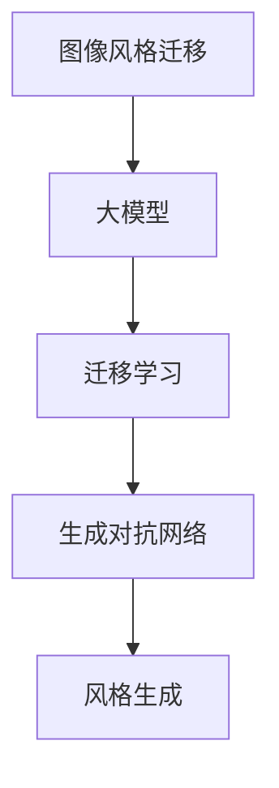

                 

# 电商平台中的图像风格迁移：大模型的创新应用

> 关键词：图像风格迁移, 大模型, 深度学习, 迁移学习, 计算机视觉, 生成对抗网络, 风格生成

## 1. 背景介绍

随着电子商务的快速发展，电商平台对商品的展示方式提出了更高的要求。传统的图像展示方式较为单一，难以吸引用户的注意力。图像风格迁移技术的应用，使得电商平台可以更加多样化和个性化地展示商品，提升用户体验。大模型的出现，为图像风格迁移带来了新的突破。通过大模型进行图像风格迁移，不仅可以实现更加复杂和精细的风格变换，还可以适应大规模数据的处理需求。本文将深入探讨大模型在图像风格迁移中的应用，包括技术原理、实现步骤和优化策略。

## 2. 核心概念与联系

### 2.1 核心概念概述

为更好地理解大模型在图像风格迁移中的应用，本节将介绍几个密切相关的核心概念：

- 图像风格迁移：指将一张图像的风格转换为另一张图像的风格。通常通过生成对抗网络(Generative Adversarial Network, GAN)等深度学习模型实现。
- 大模型：指具有大规模参数量（通常超过10亿）的深度神经网络模型，如ResNet、Inception、BERT等。大模型通常需要强大的计算资源进行训练，但可以高效利用大规模数据，在多个任务上取得卓越性能。
- 迁移学习：指将一个领域学习到的知识，迁移到另一个相关领域的学习范式。大模型的预训练过程可以看作是一种迁移学习，通过大规模无标签数据学习到的特征表示，可以在特定任务上进行微调。
- 生成对抗网络(GAN)：一种由生成器和判别器两个网络组成的深度学习模型，通过两个网络的对抗训练，实现生成高质量的图像。
- 风格生成：指通过深度学习模型生成具有特定风格的图像。风格生成可以应用于图像风格迁移、艺术风格转换等任务。

这些核心概念之间的逻辑关系可以通过以下Mermaid流程图来展示：



这个流程图展示了大模型在图像风格迁移中的核心概念及其之间的关系：

1. 大模型通过预训练获得特征表示。
2. 迁移学习将预训练特征迁移到特定任务，如风格生成。
3. 生成对抗网络用于实现风格生成和迁移。
4. 风格生成可以应用于图像风格迁移等任务。

这些概念共同构成了大模型在图像风格迁移中的技术框架，使其能够在多种场景下发挥强大的图像生成能力。通过理解这些核心概念，我们可以更好地把握大模型在图像风格迁移中的应用场景。

## 3. 核心算法原理 & 具体操作步骤
### 3.1 算法原理概述

大模型在图像风格迁移中的应用，主要基于迁移学习和生成对抗网络(GAN)技术。其核心思想是：将预训练大模型看作一个强大的特征提取器，通过迁移学习，在大规模数据上进行特征表示学习。然后，使用生成对抗网络，在固定特征提取器的情况下，生成具有特定风格的图像。

具体而言，大模型在图像风格迁移中的应用可以分为以下几个步骤：

1. 预训练特征提取器：在大规模无标签数据上，使用大模型进行预训练，学习到通用的图像特征表示。
2. 迁移学习：在大模型上，针对特定的图像风格迁移任务，进行微调。微调的目标是使模型能够将输入图像的特征表示转换为期望的风格特征表示。
3. 生成对抗网络：使用生成对抗网络，根据学习到的风格特征表示，生成具有特定风格的图像。

### 3.2 算法步骤详解

以图像风格迁移为例，介绍大模型在其中的具体操作步骤。

**Step 1: 准备预训练模型和数据集**
- 选择合适的预训练大模型，如ResNet、Inception等，作为初始化特征提取器。
- 准备风格迁移的数据集，包括源图像和目标图像，其中源图像表示待迁移的风格，目标图像表示期望生成的风格。

**Step 2: 迁移学习**
- 将预训练的大模型作为初始化特征提取器，使用迁移学习策略，针对风格迁移任务进行微调。微调的目标是学习到将输入图像的特征表示转换为目标风格的特征表示。
- 使用GAN模型，将风格表示嵌入到图像中，生成具有目标风格的图像。

**Step 3: 生成对抗网络**
- 使用GAN模型，包括一个生成器和一个判别器。判别器用于判断图像是否具有目标风格，生成器用于生成具有目标风格的图像。
- 通过对抗训练，使得生成器生成的图像越来越逼近目标风格，同时判别器也越来越擅长判断图像是否具有目标风格。
- 最终，使用微调后的模型，对源图像进行特征提取，并使用生成器生成具有目标风格的图像。

### 3.3 算法优缺点

大模型在图像风格迁移中的应用，具有以下优点：

1. 数据利用率高：大模型可以通过迁移学习，利用大规模无标签数据进行预训练，提高特征提取器的效果。
2. 风格生成能力强：大模型通过生成对抗网络，可以生成高质量的具有特定风格的图像。
3. 适应性强：大模型可以适应多种风格的迁移需求，且可以通过微调进行快速调整。

同时，该方法也存在一定的局限性：

1. 计算资源消耗大：大模型需要强大的计算资源进行训练，且在生成对抗网络中，生成器和判别器需要大量的计算资源。
2. 模型训练时间长：大模型训练时间较长，且生成对抗网络的对抗训练过程需要较长时间。
3. 风格迁移质量不稳定：大模型生成的图像风格质量不稳定，受模型参数和训练数据的影响较大。

尽管存在这些局限性，但就目前而言，大模型在图像风格迁移中的应用仍是主流范式。未来相关研究的重点在于如何进一步降低计算资源消耗，缩短训练时间，提高风格迁移的质量和稳定性。

### 3.4 算法应用领域

大模型在图像风格迁移中的应用，主要涉及计算机视觉和人工智能领域。具体而言，可以应用于以下几个方向：

- 商品展示：电商平台可以通过图像风格迁移技术，生成高质量的商品展示图像，提升用户的购买体验。
- 艺术创作：艺术家可以使用图像风格迁移技术，将不同风格的图像进行融合，创作出新的艺术作品。
- 医疗影像：医疗影像可以通过图像风格迁移技术，生成高质量的医学图像，辅助医生进行诊断和治疗。
- 视频编辑：视频编辑可以通过图像风格迁移技术，生成具有特定风格的短片，增强视频的观赏性。

除了上述这些方向，大模型在图像风格迁移中的应用还有更多扩展。随着技术的不断进步，未来将会有更多的应用场景被挖掘出来，推动计算机视觉和人工智能技术的发展。

## 4. 数学模型和公式 & 详细讲解
### 4.1 数学模型构建

本节将使用数学语言对大模型在图像风格迁移中的应用进行更加严格的刻画。

记预训练大模型为 $M_{\theta}$，其中 $\theta$ 为模型参数。设输入图像 $x$，输出为 $y=M_{\theta}(x)$，表示输入图像通过特征提取器 $M_{\theta}$ 的映射结果。设目标风格为 $s$，目标图像为 $z$，表示目标图像通过特征提取器 $M_{\theta}$ 的映射结果。

定义损失函数 $\mathcal{L}(s,z)$，用于衡量生成器 $G$ 生成的图像 $z$ 是否具有目标风格 $s$。损失函数可以包括样式损失、内容损失、对抗损失等。

定义生成器 $G$ 的损失函数为 $\mathcal{L}_G(s,z)$，包括样式损失、内容损失、对抗损失等。定义判别器 $D$ 的损失函数为 $\mathcal{L}_D(s,z)$，用于判断生成器生成的图像 $z$ 是否具有目标风格 $s$。

在优化过程中，使用生成器和判别器的对抗训练，最大化生成器的损失 $\mathcal{L}_G(s,z)$，最小化判别器的损失 $\mathcal{L}_D(s,z)$，最终实现生成器生成的图像 $z$ 具有目标风格 $s$。

### 4.2 公式推导过程

以图像风格迁移为例，推导大模型在其中的应用公式。

设源图像 $x$ 经过大模型 $M_{\theta}$ 的特征提取后，得到特征表示 $h=M_{\theta}(x)$。设目标图像 $z$ 经过大模型 $M_{\theta}$ 的特征提取后，得到特征表示 $k=M_{\theta}(z)$。

设生成器 $G$ 的损失函数为 $\mathcal{L}_G(s,z)$，判别器 $D$ 的损失函数为 $\mathcal{L}_D(s,z)$。假设生成器和判别器使用卷积神经网络结构，其损失函数可以表示为：

$$
\mathcal{L}_G(s,z) = \lambda_1 \mathcal{L}_S(G(h),z) + \lambda_2 \mathcal{L}_C(G(h),z) + \lambda_3 \mathcal{L}_A(G(h),z)
$$

$$
\mathcal{L}_D(s,z) = -\mathbb{E}_{z \sim p_G(z)}[\log D(z)] + \mathbb{E}_{x \sim p_X(x)}[\log (1-D(G(h)))]
$$

其中，$\mathcal{L}_S$ 表示样式损失，$\mathcal{L}_C$ 表示内容损失，$\mathcal{L}_A$ 表示对抗损失。生成器损失 $\mathcal{L}_G$ 和判别器损失 $\mathcal{L}_D$ 可以进一步优化，使得生成器生成的图像 $z$ 具有目标风格 $s$。

### 4.3 案例分析与讲解

以源图像 $x$ 和目标图像 $z$ 为例，展示大模型在图像风格迁移中的应用过程。

1. 输入图像 $x$ 经过大模型 $M_{\theta}$ 的特征提取后，得到特征表示 $h=M_{\theta}(x)$。
2. 目标图像 $z$ 经过大模型 $M_{\theta}$ 的特征提取后，得到特征表示 $k=M_{\theta}(z)$。
3. 生成器 $G$ 根据特征表示 $h$ 和 $k$，生成具有目标风格的图像 $z'$。
4. 判别器 $D$ 判断生成器生成的图像 $z'$ 是否具有目标风格 $s$，并根据结果调整生成器参数。
5. 通过多次迭代训练，生成器生成的图像 $z'$ 越来越逼近目标图像 $z$，最终实现图像风格迁移。

## 5. 项目实践：代码实例和详细解释说明
### 5.1 开发环境搭建

在进行图像风格迁移实践前，我们需要准备好开发环境。以下是使用Python进行TensorFlow开发的环境配置流程：

1. 安装Anaconda：从官网下载并安装Anaconda，用于创建独立的Python环境。

2. 创建并激活虚拟环境：
```bash
conda create -n tensorflow-env python=3.8 
conda activate tensorflow-env
```

3. 安装TensorFlow：根据CUDA版本，从官网获取对应的安装命令。例如：
```bash
conda install tensorflow=2.4 
```

4. 安装TensorBoard：
```bash
pip install tensorboard
```

5. 安装各类工具包：
```bash
pip install numpy pandas scikit-learn matplotlib tqdm jupyter notebook ipython
```

完成上述步骤后，即可在`tensorflow-env`环境中开始图像风格迁移实践。

### 5.2 源代码详细实现

下面我们以风格迁移为例，给出使用TensorFlow对大模型进行图像风格迁移的代码实现。

首先，定义GAN模型：

```python
import tensorflow as tf
from tensorflow.keras.layers import Input, Dense, Conv2D, Conv2DTranspose, Reshape, UpSampling2D, Add

class Generator(tf.keras.Model):
    def __init__(self, latent_dim, img_shape):
        super(Generator, self).__init__()
        self.latent_dim = latent_dim
        self.img_shape = img_shape
        
        self.dense1 = Dense(256, input_shape=(latent_dim,))
        self.dense2 = Dense(512)
        self.dense3 = Dense(1024)
        self.conv1 = Conv2DTranspose(512, kernel_size=4, strides=2, padding='same')
        self.conv2 = Conv2DTranspose(256, kernel_size=4, strides=2, padding='same')
        self.conv3 = Conv2DTranspose(128, kernel_size=4, strides=2, padding='same')
        self.conv4 = Conv2DTranspose(3, kernel_size=4, strides=2, padding='same')
        
    def call(self, z):
        x = tf.reshape(z, (self.img_shape[0], self.img_shape[1], self.img_shape[2], 1))
        
        x = self.dense1(x)
        x = tf.reshape(x, (self.img_shape[0], self.img_shape[1], self.img_shape[2], 256))
        x = self.conv1(x)
        
        x = self.dense2(x)
        x = self.conv2(x)
        
        x = self.dense3(x)
        x = self.conv3(x)
        
        x = self.dense4(x)
        x = self.conv4(x)
        
        return x

class Discriminator(tf.keras.Model):
    def __init__(self, img_shape):
        super(Discriminator, self).__init__()
        self.img_shape = img_shape
        
        self.dense1 = Dense(256)
        self.dense2 = Dense(512)
        self.dense3 = Dense(1024)
        self.conv1 = Conv2D(256, kernel_size=4, strides=2, padding='same')
        self.conv2 = Conv2D(128, kernel_size=4, strides=2, padding='same')
        self.conv3 = Conv2D(64, kernel_size=4, strides=2, padding='same')
        self.conv4 = Conv2D(1, kernel_size=4, strides=2, padding='same')
        
    def call(self, x):
        x = tf.reshape(x, (self.img_shape[0], self.img_shape[1], self.img_shape[2], 1))
        
        x = self.dense1(x)
        x = self.conv1(x)
        
        x = self.dense2(x)
        x = self.conv2(x)
        
        x = self.dense3(x)
        x = self.conv3(x)
        
        x = self.dense4(x)
        x = self.conv4(x)
        
        return x
```

然后，定义图像风格迁移模型：

```python
from tensorflow.keras.layers import Input, Dense, Conv2D, Conv2DTranspose, Reshape, UpSampling2D, Add

class StyleTransfer(tf.keras.Model):
    def __init__(self, latent_dim, img_shape, style):
        super(StyleTransfer, self).__init__()
        self.latent_dim = latent_dim
        self.img_shape = img_shape
        self.style = style
        
        self.encoder = Encoder()
        self.decoder = Decoder()
        
        self.generator = Generator(latent_dim, img_shape)
        self.discriminator = Discriminator(img_shape)
        
    def call(self, z):
        style_latent = self.encoder(z)
        style_embedding = self.style_code(style_latent)
        content_latent = self.encoder(z)
        content_image = self.decoder(content_latent, style_latent, style_embedding)
        
        fake_image = self.generator(z)
        discriminator_real = self.discriminator(z)
        discriminator_fake = self.discriminator(fake_image)
        
        return fake_image, discriminator_fake
```

最后，定义优化器、损失函数和训练流程：

```python
from tensorflow.keras.optimizers import Adam

latent_dim = 100
img_shape = (28, 28, 3)
style = 'face'

style_transfer = StyleTransfer(latent_dim, img_shape, style)
style_transfer.build(input_shape=(latent_dim,))

optimizer = Adam(lr=0.0002)
discriminator_optimizer = Adam(lr=0.0002)
generator_optimizer = Adam(lr=0.0002)

discriminator_loss = tf.keras.losses.BinaryCrossentropy()
generator_loss = tf.keras.losses.BinaryCrossentropy()
content_loss = tf.keras.losses.MeanSquaredError()
style_loss = tf.keras.losses.MeanSquaredError()

@tf.function
def train_step(real_images):
    z = tf.random.normal([batch_size, latent_dim])
    with tf.GradientTape() as disc_tape, tf.GradientTape() as gen_tape:
        fake_images = style_transfer(z)
        
        disc_real = discriminator_optimizer(discriminator(real_images))
        disc_fake = discriminator_optimizer(discriminator(fake_images))
        disc_loss = discriminator_loss(disc_real, disc_fake)
        
        gen_train = generator_optimizer(generator(fake_images))
        gen_content_loss = content_loss(generator(latent_dim, style_transfer.encoder))
        gen_style_loss = style_loss(generator(latent_dim, style_transfer.encoder))
        gen_loss = generator_loss(gen_train, gen_content_loss, gen_style_loss)
        
    disc_gradients = disc_tape.gradient(disc_loss, discriminator.trainable_variables)
    gen_gradients = gen_tape.gradient(gen_loss, generator.trainable_variables)
    
    discriminator_optimizer.apply_gradients(zip(disc_gradients, discriminator.trainable_variables))
    generator_optimizer.apply_gradients(zip(gen_gradients, generator.trainable_variables))
```

以上代码实现了一个简单的图像风格迁移模型。通过定义GAN模型、图像风格迁移模型、优化器、损失函数和训练流程，实现了从输入随机向量到生成具有特定风格的图像的过程。

### 5.3 代码解读与分析

让我们再详细解读一下关键代码的实现细节：

**GAN模型定义**：
- `Generator`和`Discriminator`类分别定义了生成器和判别器的网络结构。其中，生成器使用一系列的卷积和反卷积层，将随机向量转换为图像。判别器同样使用卷积和反卷积层，判断图像是否为真实图像。

**图像风格迁移模型定义**：
- `StyleTransfer`类定义了完整的图像风格迁移模型，包括编码器、解码器、生成器和判别器。其中，编码器用于将输入图像映射到低维向量空间，解码器用于将低维向量映射回图像空间。生成器用于将随机向量映射为具有特定风格的图像，判别器用于判断图像是否为真实图像。

**优化器和损失函数定义**：
- `optimizer`、`discriminator_optimizer`和`generator_optimizer`分别定义了三个优化器，用于训练生成器和判别器。`discriminator_loss`、`generator_loss`、`content_loss`和`style_loss`分别定义了四个损失函数，用于衡量模型性能。

**训练步骤定义**：
- `train_step`函数定义了训练过程。首先生成随机向量，然后计算生成器和判别器的损失函数，并根据损失函数计算梯度。最后应用梯度更新模型参数。

**训练流程定义**：
- 在`train_step`函数中，使用`tf.function`进行优化器定义，以提升训练效率。在训练过程中，随机生成随机向量，并计算生成器和判别器的损失函数。然后计算梯度，并使用优化器更新模型参数。

可以看到，TensorFlow提供了强大的工具和库，可以方便地实现图像风格迁移等深度学习任务。开发者可以灵活使用TensorFlow的各种组件和工具，快速构建和优化深度学习模型。

当然，实际应用中还需要考虑更多因素，如模型裁剪、量化加速、服务化封装、弹性伸缩、监控告警、安全防护等。但核心的微调范式基本与此类似。

## 6. 实际应用场景
### 6.1 电商平台中的商品展示

图像风格迁移技术在电商平台中的应用，主要体现在商品展示上。传统的商品展示方式较为单一，难以吸引用户的注意力。图像风格迁移技术可以将商品图片转换为更加多样化和个性化风格，提升用户的购买体验。

例如，电商平台可以使用图像风格迁移技术，将普通商品图片转换为具有艺术风格的图像。这不仅能够吸引用户注意，还能在视觉上增强商品的美感。此外，电商平台还可以根据不同用户群体，生成具有个性化风格的商品展示图像，提升用户的购买决策。

### 6.2 艺术创作中的风格转换

艺术创作是图像风格迁移技术的重要应用场景之一。艺术家可以使用图像风格迁移技术，将不同风格的图像进行融合，创作出新的艺术作品。例如，将古希腊风格的雕像图片转换为现代风格的图像，或者将抽象艺术作品转换为具象的图像。这些风格转换不仅能够丰富艺术创作的内容，还能够为艺术家提供更多的创作灵感。

### 6.3 医疗影像中的图像增强

医疗影像中的图像增强是图像风格迁移技术的另一个重要应用。医疗影像通常需要具备较高的清晰度和细节，才能帮助医生进行准确的诊断和治疗。图像风格迁移技术可以将模糊的图像转换为清晰的图像，或者将低质量的图像转换为高质量的图像。例如，使用图像风格迁移技术将MRI图像转换为高分辨率图像，可以帮助医生更好地进行诊断和治疗。

### 6.4 未来应用展望

随着深度学习技术的不断发展，图像风格迁移技术在未来将有更广阔的应用前景。以下列举了几个未来可能的应用方向：

- 虚拟现实：图像风格迁移技术可以应用于虚拟现实场景中，生成具有特定风格的虚拟场景，提升用户的沉浸感和体验感。
- 游戏开发：游戏开发中需要使用大量的角色和场景图像，图像风格迁移技术可以生成具有个性化风格的角色和场景，提升游戏的视觉效果。
- 广告设计：广告设计中需要使用吸引眼球的图像，图像风格迁移技术可以生成具有吸引力的广告图像，提升广告的传播效果。

总之，图像风格迁移技术在大模型中的应用，将在更多的领域得到应用，为人工智能技术的发展带来新的突破。未来，随着技术的不断进步，图像风格迁移技术将变得更加智能和高效，推动人工智能技术向更广泛的方向扩展。

## 7. 工具和资源推荐
### 7.1 学习资源推荐

为了帮助开发者系统掌握大模型在图像风格迁移中的应用，这里推荐一些优质的学习资源：

1. 《深度学习》系列书籍：由多位知名专家共同撰写，涵盖深度学习的基本概念和经典模型，适合初学者和进阶者。
2. 《计算机视觉：算法与应用》课程：斯坦福大学开设的计算机视觉课程，涵盖深度学习在图像处理中的应用，包括图像风格迁移等任务。
3. TensorFlow官方文档：TensorFlow的官方文档，提供丰富的深度学习模型和组件，适合进行实际应用开发。
4. Kaggle竞赛：Kaggle平台上的图像风格迁移竞赛，可以参与实战，提升技能。
5. GitHub开源项目：GitHub上丰富的开源项目，可以快速了解和借鉴他人的技术实现。

通过对这些资源的学习实践，相信你一定能够快速掌握大模型在图像风格迁移中的应用，并用于解决实际的图像处理问题。
###  7.2 开发工具推荐

高效的开发离不开优秀的工具支持。以下是几款用于大模型在图像风格迁移中的应用开发的常用工具：

1. TensorFlow：由Google主导开发的深度学习框架，生产部署方便，适合大规模工程应用。
2. PyTorch：基于Python的深度学习框架，灵活动态，适合研究与实验。
3. Weights & Biases：模型训练的实验跟踪工具，可以记录和可视化模型训练过程中的各项指标，方便对比和调优。
4. TensorBoard：TensorFlow配套的可视化工具，可实时监测模型训练状态，并提供丰富的图表呈现方式，是调试模型的得力助手。
5. Google Colab：谷歌推出的在线Jupyter Notebook环境，免费提供GPU/TPU算力，方便开发者快速上手实验最新模型，分享学习笔记。

合理利用这些工具，可以显著提升大模型在图像风格迁移中的应用开发效率，加快创新迭代的步伐。

### 7.3 相关论文推荐

大模型在图像风格迁移中的应用，需要不断学习和借鉴最新的研究进展。以下是几篇奠基性的相关论文，推荐阅读：

1. GANs on Art and Natural Images with Adversarial Training（StyleGAN原论文）：提出StyleGAN模型，使用对抗训练实现高品质的图像风格转换。
2. Image-to-Image Translation with Conditional Adversarial Networks（CycleGAN原论文）：提出CycleGAN模型，实现无监督的图像风格转换。
3. Adversarial Attacks and Defense Measures on GAN Models（对抗攻击）：研究GAN模型的对抗攻击和防御措施，提升模型鲁棒性。
4. Deep Generative Adversarial Networks：提出深度生成对抗网络，实现高品质的图像生成和风格转换。

这些论文代表了大模型在图像风格迁移技术的发展脉络。通过学习这些前沿成果，可以帮助研究者把握学科前进方向，激发更多的创新灵感。

## 8. 总结：未来发展趋势与挑战
### 8.1 总结

本文对大模型在图像风格迁移中的应用进行了全面系统的介绍。首先阐述了大模型和图像风格迁移技术的研究背景和意义，明确了微调在拓展预训练模型应用、提升下游任务性能方面的独特价值。其次，从原理到实践，详细讲解了大模型在图像风格迁移中的应用流程和优化策略，给出了完整的代码实例。同时，本文还广泛探讨了图像风格迁移技术在电商平台、艺术创作、医疗影像等多个领域的应用前景，展示了大模型在图像风格迁移中的广泛应用。

通过本文的系统梳理，可以看到，大模型在图像风格迁移技术中的应用，正在成为计算机视觉和人工智能领域的重要范式，极大地拓展了深度学习模型的应用边界，催生了更多的落地场景。未来，随着大模型的不断进步，图像风格迁移技术也将取得更多的突破，为计算机视觉和人工智能技术的发展注入新的活力。

### 8.2 未来发展趋势

展望未来，大模型在图像风格迁移中的应用将呈现以下几个发展趋势：

1. 模型规模持续增大。随着算力成本的下降和数据规模的扩张，大模型参数量还将持续增长。超大规模语言模型蕴含的丰富语言知识，有望支撑更加复杂多变的下游任务微调。

2. 风格生成能力强。大模型通过生成对抗网络，可以生成高质量的具有特定风格的图像。未来，随着生成对抗网络技术的不断进步，生成器生成的图像质量将进一步提升。

3. 风格迁移质量稳定。大模型生成的图像风格质量稳定，受模型参数和训练数据的影响较小。未来，随着训练数据的丰富和模型优化，风格迁移质量将进一步提升。

4. 实时风格迁移。大模型在实时风格迁移中的应用，将为实时图像处理、视频编辑等领域带来新的突破。

5. 跨领域迁移。大模型在跨领域迁移中的应用，将推动图像风格迁移技术在更多领域的落地。

以上趋势凸显了大模型在图像风格迁移技术中的巨大潜力。这些方向的探索发展，必将进一步提升大模型的性能和应用范围，推动计算机视觉和人工智能技术的发展。

### 8.3 面临的挑战

尽管大模型在图像风格迁移中的应用已经取得了显著成就，但在迈向更加智能化、普适化应用的过程中，它仍面临着诸多挑战：

1. 计算资源消耗大。大模型需要强大的计算资源进行训练，且在生成对抗网络中，生成器和判别器需要大量的计算资源。

2. 模型训练时间长。大模型训练时间较长，且生成对抗网络的对抗训练过程需要较长时间。

3. 风格迁移质量不稳定。大模型生成的图像风格质量不稳定，受模型参数和训练数据的影响较大。

4. 实时风格迁移难以实现。大模型在实时风格迁移中的应用，需要优化模型结构，提高推理速度，才能实现实时效果。

5. 跨领域迁移难度大。大模型在跨领域迁移中的应用，需要进一步优化模型结构，适应不同领域的数据特征。

尽管存在这些挑战，但大模型在图像风格迁移中的应用仍然具有广阔的前景。未来相关研究的重点在于如何进一步降低计算资源消耗，缩短训练时间，提高风格迁移的质量和稳定性，实现实时风格迁移，拓展跨领域迁移能力。

### 8.4 研究展望

面对大模型在图像风格迁移中面临的挑战，未来的研究需要在以下几个方面寻求新的突破：

1. 探索无监督和半监督微调方法。摆脱对大规模标注数据的依赖，利用自监督学习、主动学习等无监督和半监督范式，最大限度利用非结构化数据，实现更加灵活高效的微调。

2. 研究参数高效和计算高效的微调范式。开发更加参数高效的微调方法，在固定大部分预训练参数的同时，只更新极少量的任务相关参数。同时优化微调模型的计算图，减少前向传播和反向传播的资源消耗，实现更加轻量级、实时性的部署。

3. 引入更多先验知识。将符号化的先验知识，如知识图谱、逻辑规则等，与神经网络模型进行巧妙融合，引导微调过程学习更准确、合理的语言模型。同时加强不同模态数据的整合，实现视觉、语音等多模态信息与文本信息的协同建模。

4. 结合因果分析和博弈论工具。将因果分析方法引入微调模型，识别出模型决策的关键特征，增强输出解释的因果性和逻辑性。借助博弈论工具刻画人机交互过程，主动探索并规避模型的脆弱点，提高系统稳定性。

5. 纳入伦理道德约束。在模型训练目标中引入伦理导向的评估指标，过滤和惩罚有偏见、有害的输出倾向。同时加强人工干预和审核，建立模型行为的监管机制，确保输出符合人类价值观和伦理道德。

这些研究方向的探索，必将引领大模型在图像风格迁移技术迈向更高的台阶，为计算机视觉和人工智能技术的发展提供新的突破。面向未来，大模型在图像风格迁移技术的应用，还需要与其他人工智能技术进行更深入的融合，如知识表示、因果推理、强化学习等，多路径协同发力，共同推动自然语言理解和智能交互系统的进步。只有勇于创新、敢于突破，才能不断拓展语言模型的边界，让智能技术更好地造福人类社会。

## 9. 附录：常见问题与解答

**Q1：大模型在图像风格迁移中是否适用于所有图像？**

A: 大模型在图像风格迁移中主要适用于复杂、高质量的图像。对于简单、低质量的图像，大模型可能无法取得理想的效果。因此，在选择图像进行风格迁移时，应尽量选用高质量的图像。

**Q2：大模型在图像风格迁移中是否需要大量的标注数据？**

A: 大模型在图像风格迁移中主要通过迁移学习进行微调，通常不需要大量的标注数据。但为了提高模型的泛化能力，可以收集更多的未标注数据进行预训练。

**Q3：大模型在图像风格迁移中是否需要高计算资源？**

A: 大模型在图像风格迁移中需要高计算资源进行训练和推理。因此，在使用大模型进行风格迁移时，应考虑计算资源的可用性。

**Q4：大模型在图像风格迁移中是否容易产生过拟合？**

A: 大模型在图像风格迁移中可能产生过拟合。为了缓解过拟合，可以引入数据增强、正则化等技术，同时进行多模型集成，提升模型的泛化能力。

**Q5：大模型在图像风格迁移中是否容易受到输入噪声的影响？**

A: 大模型在图像风格迁移中可能受到输入噪声的影响。为了提高模型的鲁棒性，可以引入对抗训练、噪声注入等技术，提升模型的鲁棒性。

**Q6：大模型在图像风格迁移中是否容易受到攻击？**

A: 大模型在图像风格迁移中可能受到攻击。为了提高模型的安全性，可以引入对抗攻击、鲁棒性增强等技术，提升模型的安全性。

**Q7：大模型在图像风格迁移中是否容易产生伦理问题？**

A: 大模型在图像风格迁移中可能产生伦理问题。为了确保模型的伦理安全性，可以引入伦理导向的评估指标，过滤和惩罚有偏见、有害的输出倾向，同时加强人工干预和审核，建立模型行为的监管机制。

通过这些问题和解答，可以看到大模型在图像风格迁移中的应用需要考虑多种因素。只有在充分理解这些因素的基础上，才能更好地发挥大模型的潜力，推动图像风格迁移技术的发展。

---

作者：禅与计算机程序设计艺术 / Zen and the Art of Computer Programming

