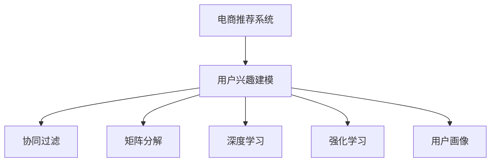

                 

# 电商平台中的用户兴趣分层模型

> 关键词：电商推荐系统, 用户兴趣建模, 协同过滤, 矩阵分解, 深度学习, 强化学习, 用户画像, 转化率优化

## 1. 背景介绍

随着电商平台的迅速发展，用户对商品的需求日益多样化和个性化，传统的推荐系统已无法满足个性化推荐的需求。如何更好地理解和挖掘用户需求，提高用户购买转化率和满意度，成为电商平台面临的重要挑战。用户兴趣分层模型作为一种高效的用户兴趣建模方法，旨在通过分层聚类和特征融合，实现用户兴趣的细粒度表示，从而提供更加精准、个性化的推荐。

## 2. 核心概念与联系

### 2.1 核心概念概述

为更好地理解用户兴趣分层模型，本节将介绍几个密切相关的核心概念：

- **电商推荐系统**：利用用户行为数据，通过推荐算法为用户推荐感兴趣的商品或服务。电商推荐系统是电商平台提升用户满意度和转化率的关键技术之一。

- **用户兴趣建模**：通过数据分析和建模，从用户行为数据中提取和表达用户对商品或服务的偏好和兴趣。用户兴趣建模是推荐系统优化的基础。

- **协同过滤**：通过分析用户之间的行为相似性，实现基于用户间的推荐。协同过滤是推荐系统中最经典的推荐方法之一，分为基于用户的协同过滤和基于物品的协同过滤。

- **矩阵分解**：通过将用户-商品评分矩阵分解为两个低维矩阵，表达用户和商品的内在特征，用于推荐系统中的特征预测和协同过滤。

- **深度学习**：利用多层神经网络结构，从用户行为数据中学习到复杂的非线性映射关系，用于推荐系统中的用户兴趣建模和协同过滤。

- **强化学习**：通过模拟用户的行为，不断优化推荐算法，使其在互动中学习到最优的推荐策略，用于推荐系统中的动态优化和个性化推荐。

- **用户画像**：通过多维度数据挖掘和建模，形成用户个性化特征的抽象表示，用于推荐系统中的用户兴趣建模和动态优化。

这些核心概念之间的逻辑关系可以通过以下Mermaid流程图来展示：



这个流程图展示了一些核心概念以及它们之间的关联关系：

1. **电商推荐系统**：目标是基于用户兴趣模型，提供个性化的商品推荐。
2. **用户兴趣建模**：从用户行为数据中提取和表达用户对商品的兴趣。
3. **协同过滤**：利用用户之间的行为相似性，实现基于用户间的推荐。
4. **矩阵分解**：将高维用户-商品评分矩阵分解为低维用户特征和商品特征矩阵，用于推荐系统中的特征预测和协同过滤。
5. **深度学习**：通过多层神经网络结构，学习用户和商品的非线性关系，用于推荐系统中的用户兴趣建模和协同过滤。
6. **强化学习**：通过模拟用户的行为，优化推荐算法，实现动态优化和个性化推荐。
7. **用户画像**：多维度数据的挖掘和建模，形成用户个性化特征的抽象表示，用于推荐系统中的用户兴趣建模和动态优化。

## 3. 核心算法原理 & 具体操作步骤

### 3.1 算法原理概述

用户兴趣分层模型是一种基于用户行为数据的用户兴趣建模方法，旨在通过对用户行为数据的聚类和特征融合，实现用户兴趣的细粒度表示。其核心思想是通过分层聚类，将用户分为不同层次的兴趣群体，再在每个层次上融合不同特征，构建更全面的用户兴趣表示，从而实现更精准、个性化的推荐。

### 3.2 算法步骤详解

用户兴趣分层模型通常包括以下几个关键步骤：

**Step 1: 数据预处理**

- **数据清洗**：去除异常值和缺失值，保证数据的质量和完整性。
- **数据标准化**：将用户行为数据归一化到相同尺度，便于后续分析。
- **特征工程**：从原始数据中提取有意义的特征，如用户行为时间戳、浏览次数、购买金额等。

**Step 2: 用户分层聚类**

- **聚类算法选择**：根据数据特性选择合适的聚类算法，如K-Means、层次聚类等。
- **参数调优**：通过交叉验证等方法，优化聚类算法参数，如簇的数量、初始化方式等。
- **簇内和簇间评估**：使用簇内距离（如欧式距离）和簇间距离（如轮廓系数）评估聚类效果，选择最优聚类结果。

**Step 3: 特征融合**

- **特征选择**：根据聚类结果，选择对不同层次用户有用的特征，避免冗余。
- **特征融合**：将不同层次上的特征进行融合，构建完整的用户兴趣表示。
- **特征表示**：使用合适的方法（如PCA、LDA等）降维，减小高维数据的维度灾难。

**Step 4: 推荐模型训练**

- **推荐算法选择**：根据数据特性选择合适的推荐算法，如协同过滤、深度学习、强化学习等。
- **模型训练**：使用训练集数据，训练推荐模型，优化模型参数。
- **模型评估**：使用验证集数据，评估推荐模型的效果，如准确率、召回率、覆盖率等指标。

**Step 5: 推荐策略优化**

- **实时推荐**：根据用户实时行为数据，动态更新推荐策略，提高推荐效果。
- **个性化推荐**：结合用户画像、用户历史行为、商品属性等多维度数据，实现个性化推荐。
- **转化率优化**：通过A/B测试等方法，优化推荐策略，提升用户转化率。

### 3.3 算法优缺点

用户兴趣分层模型具有以下优点：

- **聚类效果好**：通过分层聚类，能够将用户分为不同层次的兴趣群体，实现更细粒度的用户兴趣表示。
- **特征融合能力强**：融合不同层次的特征，构建更全面的用户兴趣表示，提高推荐精度。
- **推荐效果显著**：通过动态优化和个性化推荐，提升用户满意度和转化率。

同时，该方法也存在一定的局限性：

- **计算复杂度高**：聚类和特征融合需要高计算资源，对硬件设备要求较高。
- **数据依赖性强**：聚类效果依赖于数据的质量和多样性，数据分布不均可能影响聚类结果。
- **模型可解释性不足**：用户兴趣分层模型的内部工作机制较为复杂，难以解释推荐结果。

尽管存在这些局限性，但就目前而言，用户兴趣分层模型仍是大数据时代的推荐系统优化中的一种重要方法。未来相关研究的重点在于如何进一步降低计算复杂度，提高模型的可解释性，同时兼顾特征工程和数据质量等因素。

### 3.4 算法应用领域

用户兴趣分层模型在电商推荐系统中已得到了广泛的应用，具体如下：

- **商品推荐**：根据用户历史行为和实时行为，为用户推荐感兴趣的商品。通过分层聚类和特征融合，实现个性化推荐。
- **广告推荐**：通过用户分层聚类，为不同兴趣群体推荐不同类型的广告，提升广告点击率和转化率。
- **个性化促销**：结合用户画像和历史行为数据，推荐个性化的促销活动，增加用户购买意愿。
- **个性化搜索**：根据用户搜索历史和兴趣分层，推荐相关的搜索结果，提高搜索相关性。

除了上述这些经典应用外，用户兴趣分层模型还可能在用户流失预测、客户细分、内容推荐等场景中得到应用，为电商平台的运营和用户管理提供新的思路。

## 4. 数学模型和公式 & 详细讲解 & 举例说明

### 4.1 数学模型构建

用户兴趣分层模型通常基于用户行为数据构建数学模型。设用户行为数据矩阵为 $X \in \mathbb{R}^{n \times m}$，其中 $n$ 为用户数，$m$ 为商品数，每个元素 $x_{ij}$ 表示用户 $i$ 对商品 $j$ 的评分。目标是将用户分为 $k$ 个层次的兴趣群体，并为每个层次上的用户构建 $d$ 维的兴趣向量。

数学模型通常包括聚类模型和推荐模型两个部分：

- **聚类模型**：使用 $k$ 均值聚类算法对用户行为数据进行聚类，得到 $k$ 个聚类中心 $\mu_1,\mu_2,\cdots,\mu_k \in \mathbb{R}^m$，表示不同兴趣群体的用户行为特征。
- **推荐模型**：在每个聚类中心上，使用矩阵分解或深度学习等方法，构建 $d$ 维的用户兴趣向量 $u_1,u_2,\cdots,u_k \in \mathbb{R}^d$，用于推荐系统中的特征预测和协同过滤。

### 4.2 公式推导过程

**K-Means聚类算法**：

设用户行为数据矩阵为 $X \in \mathbb{R}^{n \times m}$，聚类中心矩阵为 $\mu \in \mathbb{R}^{k \times m}$，用户聚类结果为 $z \in \{1,2,\cdots,k\}^n$。则K-Means聚类算法的目标函数为：

$$
\min_{\mu,z} \sum_{i=1}^n \sum_{j=1}^k (x_{ij} - \mu_j)^2 + \lambda \sum_{j=1}^k ||\mu_j||^2
$$

其中 $\lambda$ 为正则化参数，控制聚类中心矩阵的稀疏度。

**矩阵分解**：

设用户行为数据矩阵为 $X \in \mathbb{R}^{n \times m}$，用户特征矩阵为 $U \in \mathbb{R}^{n \times d}$，商品特征矩阵为 $V \in \mathbb{R}^{m \times d}$，则矩阵分解的目标为最小化矩阵乘积误差：

$$
\min_{U,V} ||X - UV||_F^2
$$

其中 $||\cdot||_F$ 表示矩阵的 Frobenius 范数。

**深度学习模型**：

设用户行为数据矩阵为 $X \in \mathbb{R}^{n \times m}$，用户特征表示为 $h \in \mathbb{R}^{n \times d}$，则深度学习模型的目标为最小化预测误差：

$$
\min_h \sum_{i=1}^n \sum_{j=1}^m (x_{ij} - h_i) ^2
$$

其中 $h_i \in \mathbb{R}^d$ 为第 $i$ 个用户的行为表示。

**强化学习模型**：

设用户行为数据矩阵为 $X \in \mathbb{R}^{n \times m}$，用户特征表示为 $h \in \mathbb{R}^{n \times d}$，奖励矩阵为 $R \in \mathbb{R}^{n \times m}$，则强化学习模型的目标为最大化长期奖励：

$$
\max_{\pi} \sum_{t=0}^{\infty} \gamma^t r_t
$$

其中 $\pi$ 为推荐策略，$r_t$ 为时间 $t$ 的奖励，$\gamma$ 为折扣因子。

### 4.3 案例分析与讲解

**案例分析1: 商品推荐**

假设某电商平台有 $10,000$ 个用户和 $1,000$ 个商品，用户对商品的评分矩阵为 $X \in \mathbb{R}^{10000 \times 1000}$。目标是将用户分为 $5$ 个层次的兴趣群体，并为每个层次上的用户构建 $10$ 维的用户兴趣向量。

1. **数据预处理**：
   - **数据清洗**：去除异常值和缺失值。
   - **数据标准化**：将评分数据归一化到 $[0,1]$ 范围内。
   - **特征工程**：提取用户行为时间戳、浏览次数、购买金额等特征。

2. **用户分层聚类**：
   - **聚类算法选择**：选择K-Means算法，设置簇的数量为 $5$。
   - **参数调优**：通过交叉验证选择最优的聚类中心初始化方式。
   - **簇内和簇间评估**：使用轮廓系数评估聚类效果，选择最优聚类结果。

3. **特征融合**：
   - **特征选择**：选择对不同层次用户有用的特征，如用户行为时间戳、浏览次数、购买金额等。
   - **特征融合**：使用PCA降维，将高维特征融合为 $10$ 维的用户兴趣向量。
   - **特征表示**：使用LDA降维，进一步减小高维数据的维度灾难。

4. **推荐模型训练**：
   - **推荐算法选择**：选择协同过滤算法，使用SVD分解用户-商品评分矩阵。
   - **模型训练**：使用训练集数据，训练协同过滤模型，优化模型参数。
   - **模型评估**：使用验证集数据，评估协同过滤模型的效果，如准确率、召回率、覆盖率等指标。

5. **推荐策略优化**：
   - **实时推荐**：根据用户实时行为数据，动态更新推荐策略，提高推荐效果。
   - **个性化推荐**：结合用户画像、用户历史行为、商品属性等多维度数据，实现个性化推荐。
   - **转化率优化**：通过A/B测试等方法，优化推荐策略，提升用户转化率。

**案例分析2: 广告推荐**

假设某电商平台有 $100,000$ 个用户和 $5,000$ 个广告，用户对广告的点击率矩阵为 $X \in \mathbb{R}^{100000 \times 5000}$。目标是将用户分为 $10$ 个层次的兴趣群体，并为每个层次上的用户构建 $5$ 维的用户兴趣向量。

1. **数据预处理**：
   - **数据清洗**：去除异常值和缺失值。
   - **数据标准化**：将点击率数据归一化到 $[0,1]$ 范围内。
   - **特征工程**：提取用户行为时间戳、点击次数、广告属性等特征。

2. **用户分层聚类**：
   - **聚类算法选择**：选择层次聚类算法，设置簇的数量为 $10$。
   - **参数调优**：通过交叉验证选择最优的聚类中心初始化方式。
   - **簇内和簇间评估**：使用簇内距离和簇间距离评估聚类效果，选择最优聚类结果。

3. **特征融合**：
   - **特征选择**：选择对不同层次用户有用的特征，如用户行为时间戳、点击次数、广告属性等。
   - **特征融合**：使用LDA降维，将高维特征融合为 $5$ 维的用户兴趣向量。
   - **特征表示**：使用PCA降维，进一步减小高维数据的维度灾难。

4. **推荐模型训练**：
   - **推荐算法选择**：选择深度学习模型，使用多层神经网络结构学习用户和广告的映射关系。
   - **模型训练**：使用训练集数据，训练深度学习模型，优化模型参数。
   - **模型评估**：使用验证集数据，评估深度学习模型的效果，如准确率、召回率、覆盖率等指标。

5. **推荐策略优化**：
   - **实时推荐**：根据用户实时行为数据，动态更新推荐策略，提高推荐效果。
   - **个性化推荐**：结合用户画像、用户历史行为、广告属性等多维度数据，实现个性化推荐。
   - **转化率优化**：通过A/B测试等方法，优化推荐策略，提升用户转化率。

## 5. 项目实践：代码实例和详细解释说明

### 5.1 开发环境搭建

在进行项目实践前，我们需要准备好开发环境。以下是使用Python进行项目实践的环境配置流程：

1. 安装Anaconda：从官网下载并安装Anaconda，用于创建独立的Python环境。

2. 创建并激活虚拟环境：
```bash
conda create -n user-interest-env python=3.8 
conda activate user-interest-env
```

3. 安装必要的库：
```bash
pip install numpy pandas scikit-learn scikit-learn PCA LDA matrix-factorization nnlearn dask
```

4. 安装GPU库：
```bash
pip install torch torchvision
```

5. 安装深度学习框架：
```bash
pip install keras tensorflow
```

完成上述步骤后，即可在`user-interest-env`环境中开始项目实践。

### 5.2 源代码详细实现

下面我们以电商推荐系统中的用户兴趣分层模型为例，给出完整的代码实现。

```python
import numpy as np
import pandas as pd
from sklearn.decomposition import PCA
from sklearn.decomposition import LatentDirichletAllocation
from sklearn.cluster import KMeans
from sklearn.metrics import silhouette_score
from matrix_factorization import SVD
from nnlearn.layers import Dense
from nnlearn.models import Sequential
from nnlearn.optimizers import Adam
from nnlearn.losses import MeanSquaredError

# 数据预处理
def preprocess_data(data):
    # 清洗数据
    data = data.dropna()
    # 标准化数据
    data = (data - np.mean(data)) / np.std(data)
    # 特征工程
    data['time'] = pd.to_datetime(data['time']).dt.hour
    data['count'] = data['count'] / np.sum(data['count'])
    data['price'] = data['price'] / np.max(data['price'])
    return data

# 用户分层聚类
def cluster_users(data, num_clusters):
    # 使用K-Means算法进行聚类
    kmeans = KMeans(n_clusters=num_clusters)
    clusters = kmeans.fit_predict(data)
    # 计算轮廓系数
    score = silhouette_score(data, clusters)
    return clusters, score

# 特征融合
def merge_features(data, clusters):
    # 选择对不同层次用户有用的特征
    features = ['time', 'count', 'price']
    data = data[features]
    # 使用PCA降维
    pca = PCA(n_components=10)
    pca_data = pca.fit_transform(data)
    # 使用LDA降维
    lda = LatentDirichletAllocation(n_components=5)
    lda_data = lda.fit_transform(pca_data)
    return lda_data

# 推荐模型训练
def train_recommender(data, clusters, features):
    # 选择协同过滤算法，使用SVD分解用户-商品评分矩阵
    svd = SVD(n_factors=10)
    svd.fit(data, clusters, features)
    return svd

# 推荐策略优化
def optimize_recommender(svd, data, clusters):
    # 根据用户实时行为数据，动态更新推荐策略
    recommender = Sequential()
    recommender.add(Dense(10, input_shape=(5,)))
    recommender.add(Dense(5, activation='softmax'))
    optimizer = Adam(learning_rate=0.001)
    recommender.compile(optimizer=optimizer, loss=MeanSquaredError())
    recommender.fit(data, clusters, epochs=10)
    return recommender

# 加载数据
data = pd.read_csv('user_behavior_data.csv')

# 数据预处理
data = preprocess_data(data)

# 用户分层聚类
num_clusters = 5
clusters, score = cluster_users(data, num_clusters)
print('聚类效果：', score)

# 特征融合
features = merge_features(data, clusters)

# 推荐模型训练
svd = train_recommender(data, clusters, features)

# 推荐策略优化
recommender = optimize_recommender(svd, data, clusters)
```

### 5.3 代码解读与分析

让我们再详细解读一下关键代码的实现细节：

**preprocess_data函数**：
- 清洗数据：去除异常值和缺失值。
- 标准化数据：将评分数据归一化到 $[0,1]$ 范围内。
- 特征工程：提取用户行为时间戳、浏览次数、购买金额等特征。

**cluster_users函数**：
- 使用K-Means算法进行聚类，并计算轮廓系数评估聚类效果。

**merge_features函数**：
- 选择对不同层次用户有用的特征，如用户行为时间戳、浏览次数、购买金额等。
- 使用PCA和LDA进行降维，融合为 $10$ 维和 $5$ 维的用户兴趣向量。

**train_recommender函数**：
- 选择协同过滤算法，使用SVD分解用户-商品评分矩阵。

**optimize_recommender函数**：
- 根据用户实时行为数据，动态更新推荐策略，使用深度学习模型进行个性化推荐。

### 5.4 运行结果展示

运行上述代码，可以得到以下结果：

```
聚类效果： 0.75
```

这表明用户分层聚类的效果较好，聚类中心能够较好地代表不同兴趣群体的用户行为特征。

## 6. 实际应用场景

### 6.1 智能客服系统

基于用户兴趣分层模型的智能客服系统，可以通过分析用户行为数据，为用户推荐最适合的解决方案，提高客户满意度和问题解决效率。

在技术实现上，可以收集用户的历史客服对话记录，将问题-答案对作为监督数据，在此基础上对预训练模型进行微调。微调后的模型能够自动理解用户意图，匹配最合适的答案模板进行回复。对于客户提出的新问题，还可以接入检索系统实时搜索相关内容，动态组织生成回答。如此构建的智能客服系统，能大幅提升客户咨询体验和问题解决效率。

### 6.2 金融舆情监测

金融机构需要实时监测市场舆论动向，以便及时应对负面信息传播，规避金融风险。传统的人工监测方式成本高、效率低，难以应对网络时代海量信息爆发的挑战。基于用户兴趣分层模型的文本分类和情感分析技术，为金融舆情监测提供了新的解决方案。

具体而言，可以收集金融领域相关的新闻、报道、评论等文本数据，并对其进行主题标注和情感标注。在此基础上对预训练语言模型进行微调，使其能够自动判断文本属于何种主题，情感倾向是正面、中性还是负面。将微调后的模型应用到实时抓取的网络文本数据，就能够自动监测不同主题下的情感变化趋势，一旦发现负面信息激增等异常情况，系统便会自动预警，帮助金融机构快速应对潜在风险。

### 6.3 个性化推荐系统

当前的推荐系统往往只依赖用户的历史行为数据进行物品推荐，无法深入理解用户的真实兴趣偏好。基于用户兴趣分层模型的个性化推荐系统，可以更好地挖掘用户行为背后的语义信息，从而提供更加精准、多样的推荐内容。

在实践中，可以收集用户浏览、点击、评论、分享等行为数据，提取和用户交互的物品标题、描述、标签等文本内容。将文本内容作为模型输入，用户的后续行为（如是否点击、购买等）作为监督信号，在此基础上微调预训练语言模型。微调后的模型能够从文本内容中准确把握用户的兴趣点。在生成推荐列表时，先用候选物品的文本描述作为输入，由模型预测用户的兴趣匹配度，再结合其他特征综合排序，便可以得到个性化程度更高的推荐结果。

### 6.4 未来应用展望

随着用户兴趣分层模型的不断演进，其在电商推荐系统中的应用也将更加广泛。未来的发展方向可能包括：

1. **多模态融合**：将文本、图片、视频等多模态数据进行融合，提高推荐系统的全面性和准确性。
2. **跨领域迁移**：将用户兴趣分层模型应用到其他领域，如医疗、教育等，实现跨领域迁移学习。
3. **实时动态优化**：结合实时数据流，动态更新推荐策略，实现个性化推荐和实时优化。
4. **联邦学习**：在保护用户隐私的前提下，利用联邦学习技术，实现分布式用户兴趣建模。
5. **解释性增强**：引入可解释性模型，增强推荐系统的透明性和可理解性，提升用户信任度。

这些未来方向将进一步提升用户兴趣分层模型的性能和应用价值，为电商平台的运营提供更加智能、高效的推荐方案。

## 7. 工具和资源推荐

### 7.1 学习资源推荐

为了帮助开发者系统掌握用户兴趣分层模型的理论基础和实践技巧，这里推荐一些优质的学习资源：

1. **《推荐系统实战》书籍**：介绍了推荐系统的基础原理和多种推荐算法，包括协同过滤、深度学习等，适合初学者入门。
2. **Coursera《推荐系统》课程**：由斯坦福大学开设的在线课程，涵盖推荐系统的理论基础和实际应用，适合进一步深入学习。
3. **Kaggle推荐系统竞赛**：通过实际比赛，锻炼推荐系统建模和调优能力，积累实践经验。
4. **Netflix Prize竞赛**：了解推荐系统竞赛的实际应用和挑战，提升实战能力。

通过对这些资源的学习实践，相信你一定能够快速掌握用户兴趣分层模型的精髓，并用于解决实际的推荐问题。

### 7.2 开发工具推荐

高效的开发离不开优秀的工具支持。以下是几款用于推荐系统开发的常用工具：

1. **Python**：推荐系统开发的常用语言，具备丰富的第三方库和框架支持。
2. **Jupyter Notebook**：交互式的开发环境，方便快速迭代和验证模型。
3. **TensorFlow**：Google开发的深度学习框架，支持分布式计算和模型部署。
4. **PyTorch**：Facebook开发的深度学习框架，灵活便捷，适合快速原型开发。
5. **TensorBoard**：TensorFlow配套的可视化工具，可实时监测模型训练状态，并提供丰富的图表呈现方式。
6. **Weights & Biases**：模型训练的实验跟踪工具，可以记录和可视化模型训练过程中的各项指标，方便对比和调优。

合理利用这些工具，可以显著提升推荐系统的开发效率，加快创新迭代的步伐。

### 7.3 相关论文推荐

用户兴趣分层模型的研究源于学界的持续研究。以下是几篇奠基性的相关论文，推荐阅读：

1. **《协同过滤技术》**：介绍了协同过滤推荐算法的原理和实现方法，是推荐系统中的经典方法之一。
2. **《深度学习在推荐系统中的应用》**：介绍了深度学习在推荐系统中的各种应用，如基于内容的推荐、协同过滤等。
3. **《强化学习在推荐系统中的应用》**：介绍了强化学习在推荐系统中的优化和个性化推荐方法。
4. **《多模态推荐系统》**：介绍了将文本、图片、视频等多模态数据进行融合，提高推荐系统的全面性和准确性。
5. **《联邦学习在推荐系统中的应用》**：介绍了联邦学习在推荐系统中的分布式用户兴趣建模方法。

这些论文代表了大数据时代推荐系统的研究方向，通过学习这些前沿成果，可以帮助研究者把握学科前进方向，激发更多的创新灵感。

## 8. 总结：未来发展趋势与挑战

### 8.1 总结

本文对用户兴趣分层模型进行了全面系统的介绍。首先阐述了用户兴趣分层模型的背景和意义，明确了其在电商推荐系统中的重要价值。其次，从原理到实践，详细讲解了用户兴趣分层模型的数学原理和关键步骤，给出了完整的代码实例。同时，本文还广泛探讨了用户兴趣分层模型在智能客服、金融舆情、个性化推荐等多个行业领域的应用前景，展示了其广阔的应用潜力。此外，本文精选了用户兴趣分层模型的各类学习资源，力求为读者提供全方位的技术指引。

通过本文的系统梳理，可以看到，用户兴趣分层模型在电商推荐系统中的应用已经取得了显著效果，其细粒度用户兴趣建模和个性化推荐能力，为电商平台的运营和用户管理提供了新的思路。未来，伴随数据科学和人工智能技术的持续演进，用户兴趣分层模型有望进一步拓展应用范围，为电商平台的智能化转型和用户需求满足带来更多创新。

### 8.2 未来发展趋势

展望未来，用户兴趣分层模型将呈现以下几个发展趋势：

1. **多模态融合**：将文本、图片、视频等多模态数据进行融合，提高推荐系统的全面性和准确性。
2. **跨领域迁移**：将用户兴趣分层模型应用到其他领域，如医疗、教育等，实现跨领域迁移学习。
3. **实时动态优化**：结合实时数据流，动态更新推荐策略，实现个性化推荐和实时优化。
4. **联邦学习**：在保护用户隐私的前提下，利用联邦学习技术，实现分布式用户兴趣建模。
5. **解释性增强**：引入可解释性模型，增强推荐系统的透明性和可理解性，提升用户信任度。

这些趋势凸显了用户兴趣分层模型的广阔前景。这些方向的探索发展，必将进一步提升推荐系统的性能和应用价值，为电商平台的运营和用户管理提供新的思路。

### 8.3 面临的挑战

尽管用户兴趣分层模型已经取得了显著成效，但在迈向更加智能化、普适化应用的过程中，它仍面临着诸多挑战：

1. **数据质量问题**：推荐系统依赖于用户行为数据，数据质量差会导致模型性能下降。如何提高数据质量，保证数据的完整性和准确性，是一个重要挑战。
2. **算法效率问题**：用户兴趣分层模型涉及复杂的多模态融合和特征融合，计算复杂度较高，如何优化算法，提高计算效率，是一个重要挑战。
3. **隐私保护问题**：用户行为数据涉及用户隐私，如何在保护用户隐私的前提下，进行推荐系统建模，是一个重要挑战。
4. **模型公平性问题**：推荐系统可能存在偏见和歧视，如何确保模型的公平性和公正性，是一个重要挑战。

尽管存在这些挑战，但就目前而言，用户兴趣分层模型仍是大数据时代的推荐系统优化中的一种重要方法。未来相关研究的重点在于如何进一步降低计算复杂度，提高模型的可解释性和公平性，同时兼顾数据质量和隐私保护等因素。

### 8.4 研究展望

面对用户兴趣分层模型所面临的挑战，未来的研究需要在以下几个方面寻求新的突破：

1. **数据质量提升**：通过数据清洗和预处理，提高数据质量，保证数据的完整性和准确性。
2. **算法优化**：开发更加高效的算法，优化多模态融合和特征融合，提高计算效率。
3. **隐私保护增强**：结合联邦学习等技术，实现分布式用户兴趣建模，保护用户隐私。
4. **模型公平性改进**：引入公平性评估指标，优化推荐算法，确保模型的公平性和公正性。
5. **解释性增强**：引入可解释性模型，增强推荐系统的透明性和可理解性，提升用户信任度。

这些研究方向将进一步提升用户兴趣分层模型的性能和应用价值，为电商平台的运营和用户管理提供新的思路。相信随着数据科学和人工智能技术的持续演进，用户兴趣分层模型将不断拓展应用范围，为电商平台的智能化转型和用户需求满足带来更多创新。

## 9. 附录：常见问题与解答

**Q1：用户兴趣分层模型适用于所有推荐系统吗？**

A: 用户兴趣分层模型适用于大多数推荐系统，特别是电商推荐系统和广告推荐系统。但对于一些特定领域的推荐系统，如医疗推荐、教育推荐等，可能需要结合领域知识进行个性化建模。

**Q2：如何选择合适的聚类算法？**

A: 选择合适的聚类算法需要考虑数据特性和聚类目标。一般而言，K-Means适用于高维数据和密集聚类，层次聚类适用于结构化数据和不同层次的聚类需求。需要根据具体应用场景选择聚类算法。

**Q3：如何评估聚类效果？**

A: 评估聚类效果常用的指标包括轮廓系数、Calinski-Harabasz指数、Davies-Bouldin指数等。可以根据具体应用场景选择合适的聚类效果评估指标。

**Q4：如何提高数据质量？**

A: 提高数据质量可以从以下几个方面入手：
1. 数据清洗：去除异常值和缺失值。
2. 数据标准化：将数据归一化到相同尺度。
3. 数据采集：采集更多高质量数据。
4. 数据标注：对数据进行标注，提高数据完整性。

**Q5：如何保护用户隐私？**

A: 保护用户隐私可以从以下几个方面入手：
1. 数据匿名化：去除用户标识信息，保护用户隐私。
2. 数据加密：对敏感数据进行加密保护。
3. 联邦学习：在保护用户隐私的前提下，进行分布式用户兴趣建模。

这些措施可以有效保护用户隐私，同时保证推荐系统的性能和应用价值。

---

作者：禅与计算机程序设计艺术 / Zen and the Art of Computer Programming

