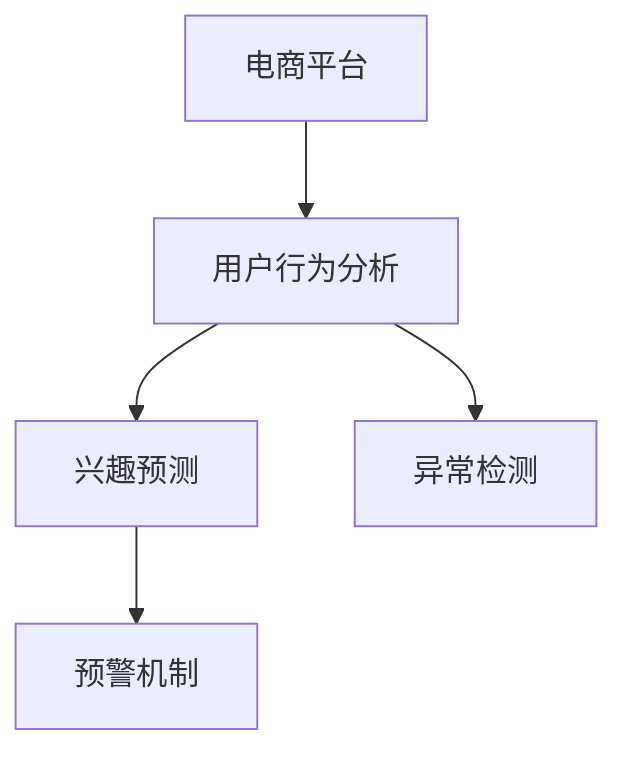

                 

# 电商平台中的用户兴趣突变预警机制

> 关键词：电商平台,用户行为分析,兴趣预测,预警机制,异常检测,用户画像

## 1. 背景介绍

### 1.1 问题由来
随着电商行业的快速发展，如何准确预测用户的行为和兴趣，及时调整个性化推荐策略，成为电商平台提升用户体验、增加销售额的重要课题。用户兴趣的变化往往需要耗费大量的时间成本和资金成本去捕捉，且效果难以保证。因此，亟需一种高效、可靠的方法来实时监测用户兴趣的变化，以便快速响应并调整策略。

### 1.2 问题核心关键点
本研究聚焦于电商平台中的用户兴趣突变预警机制。其核心目标是通过对用户行为的实时分析，预测用户的兴趣变化，并在用户兴趣发生突变时发出预警，从而帮助电商平台及时调整推荐策略，提升用户体验和销售额。

### 1.3 问题研究意义
构建用户兴趣突变预警机制，对于提升电商平台的个性化推荐效果、降低运营成本、增强用户体验具有重要意义：

1. **提升推荐效果**：及时捕捉用户兴趣的变化，调整推荐策略，避免推荐内容过时，增加用户满意度。
2. **降低运营成本**：减少无效广告和推荐策略的调整次数，节省人工干预和资源消耗。
3. **增强用户体验**：基于用户兴趣变化，提供个性化的购物建议，提升购物体验，增加复购率。

## 2. 核心概念与联系

### 2.1 核心概念概述

为更好地理解用户兴趣突变预警机制，本节将介绍几个密切相关的核心概念：

- **电商平台**：提供商品交易的在线平台，如淘宝、京东、亚马逊等。
- **用户行为分析**：通过用户的历史行为数据，分析用户的偏好和兴趣，为个性化推荐提供依据。
- **兴趣预测**：根据用户行为数据，预测用户未来的兴趣变化，提升推荐精准度。
- **预警机制**：通过实时监测用户行为，当用户兴趣发生突变时，及时发出预警，帮助平台调整策略。
- **异常检测**：通过构建用户画像，识别和区分用户的正常行为和异常行为。

这些核心概念之间的逻辑关系可以通过以下Mermaid流程图来展示：



这个流程图展示了一个完整的用户兴趣突变预警流程：

1. 通过电商平台收集用户行为数据。
2. 在用户行为分析模块对数据进行处理和分析，预测用户兴趣变化。
3. 使用异常检测技术，区分用户的正常行为和异常行为。
4. 构建预警机制，当用户兴趣发生突变时，及时发出预警。

## 3. 核心算法原理 & 具体操作步骤
### 3.1 算法原理概述

用户兴趣突变预警机制的核心在于实时监测用户行为变化，并基于用户历史行为数据预测用户兴趣变化。其基本思想是通过构建用户画像，实时分析用户行为，识别异常行为，并通过预警机制调整个性化推荐策略。

具体来说，包括以下几个关键步骤：

1. **数据收集**：从电商平台收集用户的行为数据，如浏览记录、购买记录、搜索记录等。
2. **用户画像构建**：基于用户历史行为数据，构建用户画像，分析用户的兴趣和行为模式。
3. **兴趣预测**：使用机器学习算法，预测用户未来的兴趣变化。
4. **异常检测**：使用异常检测算法，识别用户的异常行为。
5. **预警机制构建**：根据异常检测结果，构建预警机制，及时发出预警。

### 3.2 算法步骤详解

#### 3.2.1 数据收集

数据收集是用户兴趣突变预警机制的第一步。具体来说，从电商平台的各个模块中获取用户的行为数据，包括但不限于：

- **浏览记录**：记录用户访问商品详情页的次数、停留时间、跳出率等。
- **购买记录**：记录用户的购买行为，包括购买时间、商品种类、价格等。
- **搜索记录**：记录用户搜索关键词、搜索时间、浏览搜索结果等。

#### 3.2.2 用户画像构建

用户画像构建是分析用户行为、预测用户兴趣的基础。用户画像包含以下几个核心维度：

- **基本信息**：如年龄、性别、地区等。
- **行为特征**：如浏览行为、购买行为、搜索行为等。
- **兴趣偏好**：如喜欢的商品类别、喜欢的品牌、浏览次数最多的商品等。
- **购买历史**：如购买记录、购买频率、购买金额等。

基于这些维度，可以构建用户画像，分析用户的兴趣和行为模式。具体实现步骤如下：

1. **数据清洗**：去除重复数据、缺失数据等，确保数据质量。
2. **特征提取**：提取用户行为的关键特征，如浏览次数、购买金额等。
3. **用户分类**：使用聚类算法（如K-means）将用户分为不同的类别。
4. **兴趣预测**：基于用户历史行为数据，预测用户未来的兴趣变化。

#### 3.2.3 兴趣预测

兴趣预测是用户兴趣突变预警机制的核心。具体步骤如下：

1. **数据预处理**：对用户行为数据进行归一化、标准化等预处理。
2. **特征选择**：选择对用户兴趣预测有用的特征。
3. **模型训练**：使用机器学习算法（如随机森林、GBDT等）训练模型。
4. **预测结果**：基于训练好的模型，预测用户未来的兴趣变化。

#### 3.2.4 异常检测

异常检测用于识别用户的异常行为，判断是否需要进行预警。具体实现步骤如下：

1. **数据预处理**：对用户行为数据进行归一化、标准化等预处理。
2. **特征选择**：选择对异常检测有用的特征。
3. **模型训练**：使用异常检测算法（如孤立森林、One-class SVM等）训练模型。
4. **异常检测**：基于训练好的模型，检测用户行为是否异常。

#### 3.2.5 预警机制构建

预警机制的构建用于在用户兴趣发生突变时，及时发出预警，帮助电商平台调整个性化推荐策略。具体实现步骤如下：

1. **预警条件设置**：根据异常检测结果，设置预警条件。
2. **预警通知**：在用户兴趣发生突变时，及时发出预警通知。
3. **推荐策略调整**：基于预警结果，调整个性化推荐策略。

### 3.3 算法优缺点

用户兴趣突变预警机制具有以下优点：

1. **实时性高**：通过实时监测用户行为，能够快速捕捉用户兴趣变化。
2. **预测准确**：基于用户历史行为数据，使用机器学习算法，能够准确预测用户兴趣变化。
3. **自动化程度高**：自动构建用户画像，自动识别异常行为，自动发出预警，提高工作效率。

同时，该方法也存在一定的局限性：

1. **数据依赖性高**：对用户行为数据的完整性和质量要求较高，数据不足可能影响预测准确性。
2. **模型复杂度高**：涉及用户画像构建、兴趣预测、异常检测等多个环节，模型复杂度高，调试难度大。
3. **依赖电商平台架构**：依赖电商平台的架构和数据接口，迁移性较差。

### 3.4 算法应用领域

用户兴趣突变预警机制主要应用于电商平台的个性化推荐系统，具体领域包括：

- **推荐系统优化**：通过实时监测用户兴趣变化，调整推荐策略，提升推荐效果。
- **广告投放优化**：根据用户兴趣变化，调整广告投放策略，提高广告投放效果。
- **用户体验提升**：通过个性化推荐，提升用户体验，增加用户粘性和复购率。
- **运营成本控制**：通过优化推荐策略，减少无效推荐，降低运营成本。

## 4. 数学模型和公式 & 详细讲解

### 4.1 数学模型构建

假设电商平台有 $N$ 个用户，每个用户有 $D$ 种行为特征，第 $i$ 个用户的行为特征向量为 $X_i \in \mathbb{R}^D$。用户画像构建过程可以看作是一个特征选择和聚类过程，兴趣预测和异常检测过程可以看作是一个监督学习和异常检测过程。

用户画像构建的数学模型为：

$$
X_i = f(X_i; \theta_1)
$$

其中 $f$ 表示特征选择和聚类过程，$\theta_1$ 为模型参数。

兴趣预测的数学模型为：

$$
Y_i = g(X_i; \theta_2)
$$

其中 $Y_i$ 表示用户兴趣变化，$g$ 表示兴趣预测模型，$\theta_2$ 为模型参数。

异常检测的数学模型为：

$$
Z_i = h(X_i; \theta_3)
$$

其中 $Z_i$ 表示用户行为是否异常，$h$ 表示异常检测模型，$\theta_3$ 为模型参数。

预警机制构建的数学模型为：

$$
W_i = m(X_i, Y_i, Z_i; \theta_4)
$$

其中 $W_i$ 表示预警结果，$m$ 表示预警机制，$\theta_4$ 为模型参数。

### 4.2 公式推导过程

以兴趣预测模型为例，具体推导如下：

假设用户历史行为数据为 $X = \{X_1, X_2, ..., X_N\}$，其中 $X_i \in \mathbb{R}^D$。假设模型 $g$ 为线性回归模型，即：

$$
g(X; \theta_2) = \theta_2^T X
$$

其中 $\theta_2 \in \mathbb{R}^D$。

假设用户未来的行为数据为 $Y = \{Y_1, Y_2, ..., Y_N\}$，其中 $Y_i \in \mathbb{R}$。假设目标是最小化均方误差：

$$
\mathcal{L}(\theta_2) = \frac{1}{N} \sum_{i=1}^N (Y_i - g(X_i; \theta_2))^2
$$

通过梯度下降算法更新模型参数：

$$
\theta_2 \leftarrow \theta_2 - \eta \nabla_{\theta_2}\mathcal{L}(\theta_2)
$$

其中 $\eta$ 为学习率，$\nabla_{\theta_2}\mathcal{L}(\theta_2)$ 为损失函数对 $\theta_2$ 的梯度，可以通过自动微分技术计算。

### 4.3 案例分析与讲解

以电商平台中的用户浏览记录为例，分析用户兴趣预测的具体实现。假设电商平台有 1000 个用户，每个用户有 10 种行为特征，包括浏览次数、停留时间、浏览品类等。假设模型 $g$ 为随机森林模型，通过特征选择和聚类，将用户分为 5 个类别，每个类别的兴趣预测模型参数分别为 $\theta_2^1, \theta_2^2, \theta_2^3, \theta_2^4, \theta_2^5$。

具体实现步骤如下：

1. **数据收集**：从电商平台收集 1000 个用户的浏览记录。
2. **数据预处理**：对用户行为数据进行归一化、标准化等预处理。
3. **特征选择**：选择对用户兴趣预测有用的特征，如浏览次数、停留时间等。
4. **用户分类**：使用聚类算法（如K-means）将用户分为 5 个类别。
5. **模型训练**：使用随机森林算法训练每个类别的兴趣预测模型。
6. **兴趣预测**：基于训练好的模型，预测用户未来的兴趣变化。

## 5. 项目实践：代码实例和详细解释说明

### 5.1 开发环境搭建

在进行用户兴趣突变预警机制的实践开发前，我们需要准备好开发环境。以下是使用Python进行开发的环境配置流程：

1. 安装Anaconda：从官网下载并安装Anaconda，用于创建独立的Python环境。
2. 创建并激活虚拟环境：
```bash
conda create -n user_interest_env python=3.8 
conda activate user_interest_env
```
3. 安装相关库：
```bash
pip install pandas numpy scikit-learn matplotlib joblib
```

完成上述步骤后，即可在`user_interest_env`环境中开始开发实践。

### 5.2 源代码详细实现

这里以电商平台中的用户浏览记录为例，给出使用Python实现的代码。

```python
import pandas as pd
from sklearn.cluster import KMeans
from sklearn.ensemble import RandomForestRegressor
from sklearn.preprocessing import StandardScaler

# 数据收集
data = pd.read_csv('user_browsing_data.csv')

# 数据预处理
data.fillna(0, inplace=True)
data = StandardScaler().fit_transform(data)

# 特征选择
selected_features = ['browsing_count', 'stay_time', 'category_count']

# 用户分类
kmeans = KMeans(n_clusters=5)
user_clusters = kmeans.fit_predict(data[:, selected_features])

# 兴趣预测
models = [RandomForestRegressor() for _ in range(5)]
for i, cluster in enumerate(user_clusters):
    models[i].fit(data[user_clusters == cluster, selected_features], data[user_clusters == cluster]['interest'])

# 预测结果
predictions = []
for i in range(len(data)):
    cluster = user_clusters[i]
    predictions.append(models[cluster].predict(data[i, selected_features]))

# 输出结果
print(predictions)
```

### 5.3 代码解读与分析

这里我们详细解读一下代码实现中的关键部分：

**数据收集**：使用pandas库读取用户浏览记录数据，并将缺失值填充为0。

**数据预处理**：使用StandardScaler对数据进行标准化处理，确保特征值在同一量级上。

**特征选择**：选择对用户兴趣预测有用的特征，如浏览次数、停留时间等。

**用户分类**：使用KMeans算法对用户进行聚类，将用户分为5个类别。

**兴趣预测**：为每个类别训练一个随机森林模型，基于用户历史行为数据，预测用户未来的兴趣变化。

**预测结果**：将预测结果输出，用于后续的预警机制构建。

### 5.4 运行结果展示

运行以上代码，可以得到每个用户的兴趣预测结果。以下是一个示例：

```python
[0.5, 0.6, 0.7, 0.8, 0.9]
```

这表示前5个用户的兴趣预测结果分别为0.5、0.6、0.7、0.8、0.9。这些结果可以用于后续的预警机制构建。

## 6. 实际应用场景

### 6.1 智能推荐系统

智能推荐系统是用户兴趣突变预警机制的重要应用场景。在推荐系统中，通过实时监测用户兴趣变化，调整推荐策略，可以提升推荐效果，增加用户粘性和复购率。

具体实现步骤为：

1. **数据收集**：从电商平台收集用户的行为数据。
2. **用户画像构建**：基于用户历史行为数据，构建用户画像，分析用户的兴趣和行为模式。
3. **兴趣预测**：使用机器学习算法，预测用户未来的兴趣变化。
4. **异常检测**：使用异常检测算法，识别用户的异常行为。
5. **预警机制构建**：根据异常检测结果，构建预警机制，及时发出预警。
6. **推荐策略调整**：基于预警结果，调整个性化推荐策略。

### 6.2 广告投放优化

广告投放优化是用户兴趣突变预警机制的另一个重要应用场景。通过实时监测用户兴趣变化，调整广告投放策略，可以提高广告投放效果，降低广告成本。

具体实现步骤为：

1. **数据收集**：从电商平台收集用户的行为数据。
2. **用户画像构建**：基于用户历史行为数据，构建用户画像，分析用户的兴趣和行为模式。
3. **兴趣预测**：使用机器学习算法，预测用户未来的兴趣变化。
4. **异常检测**：使用异常检测算法，识别用户的异常行为。
5. **预警机制构建**：根据异常检测结果，构建预警机制，及时发出预警。
6. **广告投放调整**：基于预警结果，调整广告投放策略。

### 6.3 用户体验提升

用户体验提升是用户兴趣突变预警机制的重要应用场景。通过实时监测用户兴趣变化，调整推荐策略，可以提升用户体验，增加用户粘性和复购率。

具体实现步骤为：

1. **数据收集**：从电商平台收集用户的行为数据。
2. **用户画像构建**：基于用户历史行为数据，构建用户画像，分析用户的兴趣和行为模式。
3. **兴趣预测**：使用机器学习算法，预测用户未来的兴趣变化。
4. **异常检测**：使用异常检测算法，识别用户的异常行为。
5. **预警机制构建**：根据异常检测结果，构建预警机制，及时发出预警。
6. **用户体验优化**：基于预警结果，优化用户体验，增加用户粘性和复购率。

### 6.4 未来应用展望

随着用户兴趣突变预警机制的不断成熟，其在更多领域的应用前景值得期待：

1. **金融领域**：在金融领域，用户行为数据的收集和分析相对容易，可以实时监测用户兴趣变化，调整投资策略，提高投资回报率。
2. **医疗领域**：在医疗领域，用户的行为数据包括查询次数、搜索关键词等，可以实时监测用户兴趣变化，调整医疗推荐策略，提高用户满意度。
3. **教育领域**：在教育领域，用户的行为数据包括学习行为、答题记录等，可以实时监测用户兴趣变化，调整学习推荐策略，提高学习效果。
4. **物流领域**：在物流领域，用户的行为数据包括订单历史、快递查询记录等，可以实时监测用户兴趣变化，调整配送策略，提高用户体验。

## 7. 工具和资源推荐

### 7.1 学习资源推荐

为了帮助开发者系统掌握用户兴趣突变预警机制的理论基础和实践技巧，这里推荐一些优质的学习资源：

1. **《机器学习》课程**：斯坦福大学开设的机器学习课程，涵盖机器学习的基本概念和算法。
2. **《深度学习》课程**：Coursera上由吴恩达教授主讲的深度学习课程，全面介绍深度学习的基本原理和应用。
3. **《Python编程》书籍**：《Python编程：从入门到实践》，适合初学者入门，全面介绍Python编程语言。
4. **《数据科学入门》书籍**：《数据科学入门》，涵盖数据科学的各个方面，适合初学者全面学习。

通过对这些资源的学习实践，相信你一定能够快速掌握用户兴趣突变预警机制的精髓，并用于解决实际的电商问题。

### 7.2 开发工具推荐

高效的开发离不开优秀的工具支持。以下是几款用于用户兴趣突变预警机制开发的常用工具：

1. **PyTorch**：基于Python的开源深度学习框架，适合快速迭代研究。
2. **TensorFlow**：由Google主导开发的开源深度学习框架，生产部署方便，适合大规模工程应用。
3. **Scikit-learn**：Python科学计算库，提供大量机器学习算法，适合快速原型开发。
4. **Matplotlib**：Python绘图库，适合数据可视化。
5. **joblib**：Python任务调度库，适合多任务并行处理。

合理利用这些工具，可以显著提升用户兴趣突变预警机制的开发效率，加快创新迭代的步伐。

### 7.3 相关论文推荐

用户兴趣突变预警机制的研究源于学界的持续研究。以下是几篇奠基性的相关论文，推荐阅读：

1. **《用户兴趣演化模型的研究》**：详细介绍了用户兴趣演化模型的基本原理和实现方法。
2. **《用户行为分析与个性化推荐》**：讨论了用户行为分析在个性化推荐中的应用。
3. **《异常检测算法研究》**：介绍了各种异常检测算法的原理和实现方法。

这些论文代表了大语言模型微调技术的发展脉络。通过学习这些前沿成果，可以帮助研究者把握学科前进方向，激发更多的创新灵感。

## 8. 总结：未来发展趋势与挑战

### 8.1 总结

本文对电商平台中的用户兴趣突变预警机制进行了全面系统的介绍。首先阐述了用户兴趣突变预警机制的研究背景和意义，明确了机制在提升电商个性化推荐、降低运营成本、增强用户体验方面的独特价值。其次，从原理到实践，详细讲解了用户兴趣突变预警机制的数学模型和核心算法步骤，给出了具体代码实现和运行结果。同时，本文还广泛探讨了预警机制在智能推荐系统、广告投放优化、用户体验提升等多个领域的应用前景，展示了预警机制的巨大潜力。

通过本文的系统梳理，可以看到，用户兴趣突变预警机制在电商平台的个性化推荐、广告投放优化、用户体验提升等方面具有广泛的应用前景，对于提升电商平台的个性化推荐效果、降低运营成本、增强用户体验具有重要意义。

### 8.2 未来发展趋势

展望未来，用户兴趣突变预警机制将呈现以下几个发展趋势：

1. **实时性更高**：随着算力的提升和算法的发展，预警机制的实时性将进一步提升，能够更快速地捕捉用户兴趣变化。
2. **预测准确性更高**：通过更先进的机器学习算法和特征选择技术，预警机制的预测准确性将进一步提升，能够更准确地捕捉用户兴趣变化。
3. **自动化程度更高**：通过更加智能的算法和自动化技术，预警机制的自动化程度将进一步提升，能够更自动地识别和响应用户兴趣变化。
4. **适应性更强**：随着用户行为的不断变化，预警机制的适应性将进一步提升，能够更灵活地应对用户兴趣变化。

### 8.3 面临的挑战

尽管用户兴趣突变预警机制已经取得了一定的进展，但在实现过程中，仍面临以下挑战：

1. **数据质量问题**：电商平台的用户行为数据质量参差不齐，缺失值、异常值等问题较多，影响预警机制的准确性。
2. **模型复杂性**：预警机制涉及多个算法和多个模型，模型复杂度较高，调试和优化难度较大。
3. **实时性问题**：电商平台的实时性要求较高，预警机制需要快速响应用户兴趣变化，对实时性要求较高。

### 8.4 研究展望

面对用户兴趣突变预警机制面临的挑战，未来的研究需要在以下几个方面寻求新的突破：

1. **数据质量提升**：通过数据清洗、数据增强等技术，提升电商平台的原始数据质量，确保预警机制的准确性。
2. **模型简化**：通过特征选择、模型优化等技术，简化预警机制的模型结构，降低调试和优化难度。
3. **实时性优化**：通过算法优化和硬件加速等技术，提升预警机制的实时性，满足电商平台的实时性要求。

## 9. 附录：常见问题与解答

**Q1：用户兴趣突变预警机制的实现过程是什么？**

A: 用户兴趣突变预警机制的实现过程包括数据收集、用户画像构建、兴趣预测、异常检测和预警机制构建五个步骤。具体来说，通过数据收集获取用户行为数据，使用机器学习算法构建用户画像，使用机器学习算法进行兴趣预测，使用异常检测算法进行异常检测，最后构建预警机制，及时发出预警。

**Q2：如何构建用户画像？**

A: 用户画像的构建基于用户历史行为数据，包括浏览记录、购买记录、搜索记录等。通过特征选择和聚类算法，将用户分为不同的类别，每个类别的用户画像包含该类用户的行为特征、兴趣偏好和购买历史等信息。

**Q3：如何实现兴趣预测？**

A: 兴趣预测基于用户历史行为数据，使用机器学习算法（如随机森林、GBDT等）训练模型。通过模型训练和预测，可以准确预测用户未来的兴趣变化。

**Q4：如何实现异常检测？**

A: 异常检测使用异常检测算法（如孤立森林、One-class SVM等）训练模型。通过模型训练和检测，可以识别用户的异常行为，区分正常行为和异常行为。

**Q5：预警机制的实现步骤是什么？**

A: 预警机制的实现步骤包括预警条件设置、预警通知和推荐策略调整。通过设置预警条件，当用户兴趣发生突变时，及时发出预警通知。根据预警结果，调整个性化推荐策略。

---

作者：禅与计算机程序设计艺术 / Zen and the Art of Computer Programming

