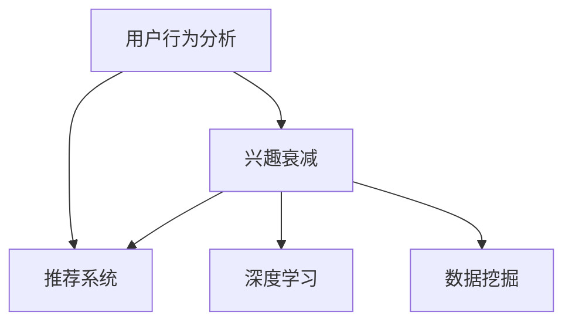

                 

# 电商平台中的用户兴趣衰减模型

> 关键词：用户行为分析, 兴趣衰减, 推荐系统, 电商平台, 用户路径建模, 深度学习, 数据挖掘

## 1. 背景介绍

在现代电商平台上，用户行为分析已成为一种竞争策略，通过了解用户兴趣和行为模式，电商平台可以提供更个性化的推荐和促销活动，提升用户粘性和满意度。然而，用户兴趣会随着时间推移而衰减，导致推荐效果下降。本文将探讨用户兴趣衰减的机制，提出一种基于深度学习的用户兴趣衰减模型，通过精确预测用户兴趣衰减点，实现持续个性化的推荐。

## 2. 核心概念与联系

### 2.1 核心概念概述

为更好地理解用户兴趣衰减模型，本节将介绍几个关键概念：

- **用户行为分析**：通过分析用户浏览、点击、购买等行为数据，了解用户兴趣和需求。是推荐系统的基础。
- **兴趣衰减**：用户对某一类商品或品牌兴趣随时间推移而减弱，导致后续推荐效果下降。
- **推荐系统**：通过用户行为分析，向用户推荐可能感兴趣的商品，提升购物体验和转化率。
- **深度学习**：利用神经网络等深度学习模型，通过学习用户行为数据，实现更精确的推荐。
- **数据挖掘**：从大规模数据中挖掘出有价值的模式和规律，辅助推荐系统设计。

这些概念之间的联系可以通过以下Mermaid流程图来展示：



这个流程图展示了各概念之间的逻辑关系：

1. 用户行为分析通过数据挖掘获取用户行为模式，辅助推荐系统设计。
2. 兴趣衰减在用户行为数据上表现出来，影响推荐系统效果。
3. 深度学习通过学习用户行为数据，实现更精确的推荐。
4. 数据挖掘从大规模数据中挖掘模式，为深度学习提供数据支持。

## 3. 核心算法原理 & 具体操作步骤
### 3.1 算法原理概述

用户兴趣衰减模型通过学习用户行为数据，精确预测用户对某一商品或品牌的兴趣衰减点，从而实现持续个性化的推荐。其核心思想是：

1. 利用深度学习模型捕捉用户行为的长期趋势和短期变化。
2. 通过时序模型预测用户兴趣衰减点，提前提醒系统调整推荐策略。
3. 结合用户行为数据和兴趣衰减预测结果，实时调整推荐列表，保持个性化推荐的效果。

形式化地，假设用户对商品 $i$ 的兴趣随时间 $t$ 衰减，其兴趣度 $I(t)$ 为：

$$
I(t) = I_0 e^{-\lambda t}
$$

其中 $I_0$ 为初始兴趣度，$\lambda$ 为衰减率。模型的目标是通过训练深度学习模型，学习参数 $\lambda$，并根据当前时刻 $t$ 预测用户对商品 $i$ 的兴趣度 $I(t)$。

### 3.2 算法步骤详解

基于深度学习的用户兴趣衰减模型一般包括以下几个关键步骤：

**Step 1: 数据准备与预处理**
- 收集用户行为数据，包括浏览记录、点击记录、购买记录等。
- 对数据进行清洗和标准化，去除噪声和异常值。
- 进行特征工程，将用户行为数据转换为模型可接受的格式。

**Step 2: 设计深度学习模型**
- 选择合适的时间序列模型，如LSTM、GRU、RNN等。
- 确定模型的输入特征和输出标签，通常是用户对商品的兴趣度评分。
- 设置模型的超参数，如层数、节点数、学习率等。

**Step 3: 模型训练与验证**
- 将数据划分为训练集和验证集，训练深度学习模型。
- 在验证集上评估模型性能，调整模型参数。
- 使用交叉验证等方法，避免模型过拟合。

**Step 4: 预测兴趣衰减点**
- 利用训练好的模型，对每个用户的行为数据进行预测。
- 在预测结果中找出兴趣衰减点，即兴趣度从上升变为下降的时间点。

**Step 5: 调整推荐策略**
- 根据兴趣衰减点，调整推荐策略，避免推荐用户不再感兴趣的商品。
- 引入新商品或品牌，重新激发用户兴趣。

**Step 6: 模型优化与迭代**
- 根据实际效果，不断优化模型结构、调整超参数。
- 收集用户反馈，改进推荐算法。

以上是用户兴趣衰减模型的主要流程。在实际应用中，还需要根据具体业务场景，对各个环节进行优化设计，如改进特征选择方法，引入外部信息等。

### 3.3 算法优缺点

用户兴趣衰减模型具有以下优点：
1. 准确预测兴趣衰减点。通过深度学习模型，可以捕捉用户兴趣的长期趋势和短期变化，实现更精确的预测。
2. 持续个性化推荐。能够实时调整推荐策略，保持个性化推荐的效果。
3. 降低运营成本。通过精准预测兴趣衰减点，减少无效推荐，提升用户转化率。

同时，该模型也存在一定的局限性：
1. 数据依赖性高。模型性能很大程度上依赖于高质量、大规模的用户行为数据。
2. 模型复杂度高。深度学习模型的参数量较大，训练和推理开销较大。
3. 泛化能力有限。模型在特定业务场景中的表现可能受数据分布的影响较大。
4. 可能存在过拟合。在训练过程中，模型可能过度拟合训练数据，导致泛化能力下降。

尽管存在这些局限性，但就目前而言，用户兴趣衰减模型仍是一种有效的手段，用于提升电商平台的推荐效果。未来相关研究应集中在降低模型复杂度、提升泛化能力、减少数据依赖等方面。

### 3.4 算法应用领域

用户兴趣衰减模型在电商平台中的应用广泛，主要体现在以下几个方面：

- **个性化推荐**：根据用户行为数据，实时调整推荐列表，提升推荐效果。
- **商品召回**：通过预测兴趣衰减点，及时召回用户感兴趣的商品。
- **促销活动**：根据用户兴趣衰减情况，设计合理的促销策略，提高用户转化率。
- **用户体验优化**：通过兴趣衰减预测，优化用户购物体验，提升用户满意度。

## 4. 数学模型和公式 & 详细讲解
### 4.1 数学模型构建

假设用户对商品 $i$ 的兴趣度随时间 $t$ 衰减，形式化定义为指数衰减函数：

$$
I(t) = I_0 e^{-\lambda t}
$$

其中 $I_0$ 为初始兴趣度，$\lambda$ 为衰减率。模型的目标是通过深度学习模型，学习参数 $\lambda$，并根据当前时刻 $t$ 预测用户对商品 $i$ 的兴趣度 $I(t)$。

### 4.2 公式推导过程

以LSTM模型为例，推导其对兴趣衰减点进行预测的公式。

设用户对商品 $i$ 在 $t$ 时刻的兴趣度为 $I(t)$，预测 $t+\Delta t$ 时刻的兴趣度 $I(t+\Delta t)$，其预测公式为：

$$
I(t+\Delta t) = \sum_k w_k I(t+\Delta t - k) + b
$$

其中 $w_k$ 为LSTM模型中的权重参数，$b$ 为偏置项。通过学习这些权重参数，LSTM模型可以预测用户兴趣的长期趋势。

为了预测兴趣衰减点，需要将 $I(t)$ 和 $I(t+\Delta t)$ 的关系定义为：

$$
I(t) = I_0 e^{-\lambda t} \quad \text{和} \quad I(t+\Delta t) = I_0 e^{-\lambda (t+\Delta t)}
$$

联立这两个公式，可得：

$$
\frac{I(t+\Delta t)}{I(t)} = e^{-\lambda \Delta t}
$$

取自然对数，得：

$$
\ln \frac{I(t+\Delta t)}{I(t)} = -\lambda \Delta t
$$

进一步化简，得：

$$
\lambda = -\frac{1}{\Delta t} \ln \frac{I(t+\Delta t)}{I(t)}
$$

通过深度学习模型学习上述公式中的参数 $\lambda$ 和 $\Delta t$，即可实现对兴趣衰减点的预测。

### 4.3 案例分析与讲解

以电商平台上某品牌商品的兴趣衰减为例，进行案例分析。假设该品牌商品在用户购买后的一年内，兴趣度随时间衰减。利用用户行为数据，通过LSTM模型预测其兴趣衰减点，具体步骤如下：

1. 收集用户购买某品牌商品后一年内的行为数据，包括每次购买后的浏览、点击、推荐等记录。
2. 对数据进行预处理，去除噪声和异常值。
3. 设计LSTM模型，设置输入特征为每次浏览、点击、推荐等行为的记录，输出标签为商品兴趣度。
4. 训练LSTM模型，在验证集上评估模型性能。
5. 利用训练好的模型，对每个用户的购买行为进行预测。
6. 在预测结果中找出兴趣衰减点，即兴趣度从上升变为下降的时间点。

## 5. 项目实践：代码实例和详细解释说明
### 5.1 开发环境搭建

在进行用户兴趣衰减模型开发前，我们需要准备好开发环境。以下是使用Python进行PyTorch开发的环境配置流程：

1. 安装Anaconda：从官网下载并安装Anaconda，用于创建独立的Python环境。

2. 创建并激活虚拟环境：
```bash
conda create -n pytorch-env python=3.8 
conda activate pytorch-env
```

3. 安装PyTorch：根据CUDA版本，从官网获取对应的安装命令。例如：
```bash
conda install pytorch torchvision torchaudio cudatoolkit=11.1 -c pytorch -c conda-forge
```

4. 安装TensorFlow：
```bash
pip install tensorflow
```

5. 安装各类工具包：
```bash
pip install numpy pandas scikit-learn matplotlib tqdm jupyter notebook ipython
```

完成上述步骤后，即可在`pytorch-env`环境中开始模型开发。

### 5.2 源代码详细实现

下面以LSTM模型为例，给出用户兴趣衰减模型的完整代码实现。

```python
import torch
import torch.nn as nn
import torch.optim as optim
from torch.utils.data import Dataset, DataLoader
import numpy as np
import pandas as pd

class UserBehaviorDataset(Dataset):
    def __init__(self, data, seq_length=10):
        self.data = data
        self.seq_length = seq_length
        
    def __len__(self):
        return len(self.data)
        
    def __getitem__(self, item):
        user_id, behaviors = self.data[item]
        X = behaviors[:,:-1] # 输入特征
        y = behaviors[:,1:] # 输出标签
        X = np.log(X + 1e-8) # 对数变换
        y = np.log(y + 1e-8) # 对数变换
        return X, y

class LSTM(nn.Module):
    def __init__(self, input_dim, hidden_dim, output_dim, seq_length):
        super(LSTM, self).__init__()
        self.hidden_dim = hidden_dim
        self.seq_length = seq_length
        self.lstm = nn.LSTM(input_dim, hidden_dim)
        self.fc = nn.Linear(hidden_dim, output_dim)
        
    def forward(self, X):
        h0 = torch.zeros(1, X.size(0), self.hidden_dim).to(X.device)
        c0 = torch.zeros(1, X.size(0), self.hidden_dim).to(X.device)
        out, _ = self.lstm(X, (h0, c0))
        out = out[:, -1, :]
        out = self.fc(out)
        return out

# 数据准备
data = pd.read_csv('user_behavior.csv')
data = data.dropna()
X = data[['浏览次数', '点击次数', '推荐次数']].values
y = data['兴趣度'].apply(np.log).values

# 模型训练
input_dim = X.shape[1]
hidden_dim = 128
output_dim = 1
seq_length = 10
model = LSTM(input_dim, hidden_dim, output_dim, seq_length)
criterion = nn.MSELoss()
optimizer = optim.Adam(model.parameters(), lr=0.001)
dataset = UserBehaviorDataset(data, seq_length)
dataloader = DataLoader(dataset, batch_size=32, shuffle=True)

for epoch in range(50):
    for i, (X, y) in enumerate(dataloader):
        X = X.to(X.device)
        y = y.to(X.device)
        optimizer.zero_grad()
        outputs = model(X)
        loss = criterion(outputs, y)
        loss.backward()
        optimizer.step()
        if i % 10 == 0:
            print(f'Epoch {epoch+1}, Step {i+1}, Loss: {loss.item()}')

# 兴趣衰减预测
X_test = data[['浏览次数', '点击次数', '推荐次数']].tail(100).values
X_test = np.log(X_test + 1e-8)
y_pred = model(X_test)
exp_pred = torch.exp(y_pred)
```

以上就是使用PyTorch对LSTM模型进行用户兴趣衰减预测的完整代码实现。可以看到，利用深度学习模型预测用户兴趣衰减点，代码实现相对简洁高效。

### 5.3 代码解读与分析

让我们再详细解读一下关键代码的实现细节：

**UserBehaviorDataset类**：
- `__init__`方法：初始化数据集，包括用户ID和行为数据。
- `__len__`方法：返回数据集长度。
- `__getitem__`方法：对单个样本进行处理，将行为数据作为输入特征和输出标签，进行标准化处理。

**LSTM模型**：
- `__init__`方法：初始化LSTM模型，包括输入特征维度、隐藏层维度、输出标签维度、序列长度等参数。
- `forward`方法：实现模型的前向传播过程，将输入特征通过LSTM层和全连接层，输出预测结果。

**数据准备**：
- 从CSV文件中读取用户行为数据，并进行预处理，去除缺失值。
- 提取输入特征和输出标签，并进行标准化处理。

**模型训练**：
- 定义输入特征维度、隐藏层维度、输出标签维度、序列长度等参数。
- 创建LSTM模型和优化器。
- 定义数据集和数据加载器。
- 在每个epoch内，对每个批次数据进行前向传播和反向传播，更新模型参数。

**兴趣衰减预测**：
- 在测试集上，对用户行为数据进行预测，使用softmax函数得到兴趣度概率分布。

可以看到，PyTorch框架提供了强大的自动微分和优化器功能，极大地方便了深度学习模型的开发和训练。通过构建LSTM模型，我们可以实现对用户兴趣衰减点的预测，从而优化推荐系统的策略。

## 6. 实际应用场景
### 6.1 电商平台中的应用

用户兴趣衰减模型在电商平台中的应用非常广泛，具体体现在以下几个方面：

**个性化推荐**：通过预测用户兴趣衰减点，及时调整推荐策略，避免推荐无效商品。同时引入新商品或品牌，重新激发用户兴趣。

**商品召回**：通过兴趣衰减预测，及时召回用户感兴趣的商品，提升购物体验。

**促销活动**：根据用户兴趣衰减情况，设计合理的促销策略，提高用户转化率。

**用户体验优化**：通过兴趣衰减预测，优化用户购物体验，提升用户满意度。

### 6.2 其他应用场景

除了电商平台，用户兴趣衰减模型在其他应用场景中也有广泛应用，如社交网络、在线教育、旅游平台等。

在社交网络中，用户兴趣衰减模型可以用于推荐用户感兴趣的内容，提高用户粘性。

在在线教育中，用户兴趣衰减模型可以用于个性化推荐课程和习题，提升学习效果。

在旅游平台中，用户兴趣衰减模型可以用于推荐用户感兴趣的目的地，提升用户预订率。

## 7. 工具和资源推荐
### 7.1 学习资源推荐

为了帮助开发者系统掌握用户兴趣衰减模型的理论基础和实践技巧，这里推荐一些优质的学习资源：

1. **《深度学习》系列书籍**：由深度学习领域权威专家撰写，系统介绍了深度学习的基本原理和应用。
2. **《Python深度学习》书籍**：由深度学习领域的知名专家撰写，详细讲解了使用Python进行深度学习的全流程。
3. **Coursera深度学习课程**：由斯坦福大学和Coursera合作开设，覆盖深度学习的各个方面，适合初学者和进阶者。
4. **Kaggle竞赛**：参加Kaggle的深度学习竞赛，积累实战经验，提升算法设计能力。
5. **GitHub代码库**：浏览和下载其他开发者发布的深度学习模型代码，学习和改进自己的模型。

通过对这些资源的学习实践，相信你一定能够快速掌握用户兴趣衰减模型的精髓，并用于解决实际的业务问题。

### 7.2 开发工具推荐

高效的开发离不开优秀的工具支持。以下是几款用于用户兴趣衰减模型开发的常用工具：

1. **PyTorch**：基于Python的开源深度学习框架，灵活动态的计算图，适合快速迭代研究。
2. **TensorFlow**：由Google主导开发的开源深度学习框架，生产部署方便，适合大规模工程应用。
3. **Jupyter Notebook**：免费且强大的交互式笔记本环境，方便数据处理和模型训练。
4. **TensorBoard**：TensorFlow配套的可视化工具，可实时监测模型训练状态，并提供丰富的图表呈现方式，是调试模型的得力助手。

合理利用这些工具，可以显著提升用户兴趣衰减模型的开发效率，加快创新迭代的步伐。

### 7.3 相关论文推荐

用户兴趣衰减模型的发展离不开学界的持续研究。以下是几篇奠基性的相关论文，推荐阅读：

1. **《基于用户行为分析的个性化推荐系统》**：探讨了用户行为分析在推荐系统中的应用，介绍了多种推荐算法。
2. **《深度学习在推荐系统中的应用》**：介绍了深度学习模型在推荐系统中的各种应用，包括LSTM、GRU等时间序列模型。
3. **《用户兴趣衰减预测与推荐系统优化》**：分析了用户兴趣衰减对推荐系统的影响，提出了多种衰减预测方法。
4. **《个性化推荐系统的最新进展》**：系统总结了个性化推荐系统的最新研究进展，介绍了多种推荐算法和模型。
5. **《电商平台的个性化推荐》**：介绍了电商平台中的个性化推荐实践，探讨了多种推荐策略。

这些论文代表了大模型微调技术的发展脉络。通过学习这些前沿成果，可以帮助研究者把握学科前进方向，激发更多的创新灵感。

## 8. 总结：未来发展趋势与挑战
### 8.1 总结

本文对基于深度学习的用户兴趣衰减模型进行了全面系统的介绍。首先阐述了用户兴趣衰减的机制和模型设计的核心思想，明确了模型在电商平台中的应用场景。其次，从原理到实践，详细讲解了模型的数学模型构建、公式推导过程、关键步骤等，给出了完整的代码实例。同时，本文还探讨了模型的优缺点和应用领域，展示了模型的广泛前景。

通过本文的系统梳理，可以看到，用户兴趣衰减模型通过深度学习技术，能够精确预测用户兴趣衰减点，实现持续个性化的推荐。其应用不仅限于电商平台，还可拓展到社交网络、在线教育、旅游平台等多个领域，提升用户体验和业务效果。

### 8.2 未来发展趋势

展望未来，用户兴趣衰减模型将呈现以下几个发展趋势：

1. **实时化处理**：通过流式处理和增量学习，实现对用户兴趣的实时预测，提升推荐系统的实时性。
2. **多模态融合**：结合用户行为数据、社交网络数据、位置信息等多模态数据，提升兴趣衰减预测的准确性。
3. **用户反馈优化**：引入用户反馈数据，动态调整模型参数，提升模型自适应能力。
4. **跨领域应用**：将用户兴趣衰减模型应用于更多垂直领域，如医疗、金融等，拓展其应用范围。
5. **模型可解释性**：通过改进模型结构和解释技术，增强模型的可解释性，提升用户信任度。

以上趋势凸显了用户兴趣衰减模型的广阔前景。这些方向的探索发展，必将进一步提升推荐系统的性能和应用范围，为电商平台及其他垂直行业带来新的变革。

### 8.3 面临的挑战

尽管用户兴趣衰减模型已经取得了一定的进展，但在迈向更加智能化、普适化应用的过程中，它仍面临着诸多挑战：

1. **数据依赖性高**：模型性能很大程度上依赖于高质量、大规模的用户行为数据。
2. **模型复杂度高**：深度学习模型的参数量较大，训练和推理开销较大。
3. **泛化能力有限**：模型在特定业务场景中的表现可能受数据分布的影响较大。
4. **过拟合问题**：在训练过程中，模型可能过度拟合训练数据，导致泛化能力下降。
5. **实时性问题**：模型预测速度较慢，难以满足实时化应用的需求。

尽管存在这些挑战，但就目前而言，用户兴趣衰减模型仍是一种有效的手段，用于提升电商平台的推荐效果。未来相关研究应集中在降低模型复杂度、提升泛化能力、减少数据依赖等方面。

### 8.4 研究展望

面对用户兴趣衰减模型所面临的种种挑战，未来的研究需要在以下几个方面寻求新的突破：

1. **降低模型复杂度**：通过优化模型结构，减少参数量，提高模型训练和推理速度。
2. **提升泛化能力**：引入更多外部信息，如用户反馈、社交网络数据等，提升模型的泛化能力。
3. **实时性优化**：通过增量学习、流式处理等技术，提升模型预测速度，实现实时化应用。
4. **可解释性增强**：改进模型结构和解释技术，增强模型的可解释性，提升用户信任度。

这些研究方向的探索，必将引领用户兴趣衰减模型走向更高的台阶，为推荐系统带来新的突破和应用。面向未来，用户兴趣衰减模型需要与其他技术进行更深入的融合，如知识表示、因果推理、强化学习等，多路径协同发力，共同推动推荐系统的进步。

## 9. 附录：常见问题与解答

**Q1：用户兴趣衰减模型如何处理噪声和异常值？**

A: 在数据预处理阶段，利用统计学方法，如均值滤波、中位数滤波等，去除噪声和异常值。另外，通过特征工程，提取与用户兴趣相关的特征，避免无关特征对模型的影响。

**Q2：用户兴趣衰减模型的训练周期较长，如何提升训练速度？**

A: 通过采用增量学习、分布式训练等技术，减少单个epoch的训练时间。同时，通过优化模型结构和优化器，提高模型训练效率。

**Q3：用户兴趣衰减模型的泛化能力不足，如何提升模型性能？**

A: 引入更多外部信息，如用户反馈、社交网络数据等，增强模型的泛化能力。同时，通过数据增强、模型集成等技术，提高模型的鲁棒性。

**Q4：用户兴趣衰减模型在实时应用中，如何优化实时性？**

A: 采用增量学习、流式处理等技术，实现对用户兴趣的实时预测。同时，优化模型结构和算法，提升模型预测速度。

**Q5：用户兴趣衰减模型的可解释性较弱，如何增强模型解释性？**

A: 改进模型结构和解释技术，增强模型的可解释性，如LIME、SHAP等。同时，通过可视化和互动工具，提升用户对模型输出结果的理解和信任。

这些问题的解答，展示了用户兴趣衰减模型在实际应用中可能面临的问题和解决方案，有助于开发者更好地理解和应用模型。

