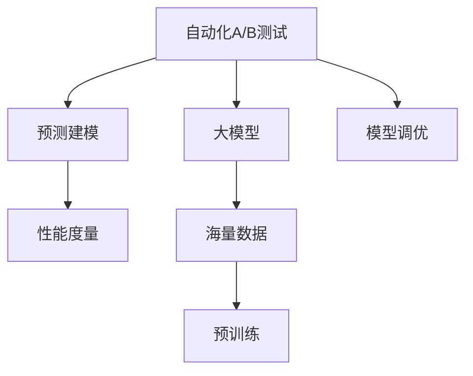

                 

# 电商平台中的自动化A/B测试：大模型的创新应用

> 关键词：A/B测试,电商平台,大模型,自动化,预测建模

## 1. 背景介绍

### 1.1 问题由来
电商平台是典型的互联网应用之一，其核心业务模式是“交易”，旨在满足用户需求的同时，最大化商业价值。然而，电商平台面临的用户需求不断变化，竞争对手持续涌现，竞争格局复杂多变。如何在这些变数中把握用户行为，提高用户转化率，成为电商平台亟待解决的重要问题。

### 1.2 问题核心关键点
电商平台中的自动化A/B测试是提升用户体验和增加转化率的重要手段。传统的手工A/B测试通常耗费大量人力和时间，且难以准确判断实验结果。近年来，随着大模型技术的发展，使用大模型进行自动化A/B测试成为新的热点方向。

具体而言，大模型通过在海量数据上进行预训练，学习到了丰富的领域知识。在自动化A/B测试中，可以使用大模型对不同实验条件下的数据进行建模和预测，从而更好地评估实验效果。这种基于大模型的自动化A/B测试方法，显著提高了实验效率和结果准确性，在电商平台的多个场景中得到了广泛应用。

### 1.3 问题研究意义
研究基于大模型的自动化A/B测试方法，对于提升电商平台的用户转化率和增加商业收入具有重要意义：

1. **提升实验效率**：大模型的自动化A/B测试可以快速处理海量实验数据，提高实验效率。
2. **提高结果准确性**：大模型的预测能力强，可以更准确地评估实验效果。
3. **降低人力成本**：自动化A/B测试可以大幅减少人工参与，降低实验成本。
4. **实时调整优化**：根据实时实验数据，大模型可以快速迭代优化实验策略，最大化商业价值。
5. **推动业务创新**：自动化A/B测试的准确性提升和效率提高，可以更快地试错和优化，推动业务创新。

## 2. 核心概念与联系

### 2.1 核心概念概述

为更好地理解基于大模型的自动化A/B测试方法，本节将介绍几个密切相关的核心概念：

- **自动化A/B测试(Automatic A/B Testing)**：使用算法自动生成和执行A/B测试方案，并从海量数据中分析实验结果，以指导电商平台的运营决策。
- **大模型(Large Model)**：通过大规模数据预训练获得广泛领域知识的深度学习模型，如BERT、GPT-3等。
- **预测建模(Predictive Modeling)**：利用机器学习模型对未来事件或结果进行预测。
- **性能度量(Metric Evaluation)**：通过定义合适的指标，评估A/B测试中的实验效果，如点击率、转化率、用户满意度等。
- **模型调优(Model Tuning)**：根据实验结果调整模型参数，以优化预测结果。

这些核心概念之间的逻辑关系可以通过以下Mermaid流程图来展示：



这个流程图展示了大模型在自动化A/B测试中的作用：

1. 自动化A/B测试通过大模型对实验数据进行建模和预测。
2. 使用性能度量指标评估实验效果。
3. 根据评估结果，调整模型参数，提升预测效果。

## 3. 核心算法原理 & 具体操作步骤
### 3.1 算法原理概述

基于大模型的自动化A/B测试方法的核心思想是：使用大模型对实验数据进行建模和预测，并基于预测结果评估实验效果，指导电商平台优化运营策略。具体步骤如下：

1. **数据收集**：从电商平台中收集不同实验条件下的用户数据，包含用户行为、购买记录等。
2. **数据预处理**：对收集到的数据进行清洗、归一化等预处理操作。
3. **模型训练**：使用预训练的大模型作为初始化参数，在实验数据上微调模型，以适应特定任务。
4. **预测建模**：使用微调后的模型对实验数据进行预测，生成不同实验条件下的预测结果。
5. **性能度量**：定义合适的指标，评估不同实验条件下的预测结果，选择效果最优的方案。
6. **模型调优**：根据性能度量结果，调整模型参数，进一步提升预测精度。

### 3.2 算法步骤详解

以下是基于大模型的自动化A/B测试的详细操作步骤：

**Step 1: 数据收集和预处理**
- 收集电商平台的实验数据，包含用户行为、购买记录等。
- 对数据进行清洗、去重、归一化等预处理操作，以确保数据质量。

**Step 2: 模型选择和初始化**
- 选择合适的预训练大模型作为初始化参数，如BERT、GPT-3等。
- 将大模型加载到服务器，并准备好微调的训练数据。

**Step 3: 数据编码和特征提取**
- 使用分词器将文本数据转化为模型可接受的形式，如将产品描述转换为token ids。
- 提取模型需要的特征，如产品类别、用户属性等，作为预测模型的输入。

**Step 4: 模型微调和训练**
- 在实验数据上对大模型进行微调，以适应电商平台的特定任务。
- 设置微调超参数，包括学习率、迭代轮数、批大小等。
- 使用合适的优化器进行模型训练，如Adam、SGD等。

**Step 5: 预测建模和性能度量**
- 对不同实验条件下的数据进行预测，生成点击率、转化率等预测结果。
- 根据实验目标定义合适的指标，如点击率、转化率、用户满意度等。
- 计算每个实验条件的预测指标，并选择性能最优的方案。

**Step 6: 模型调优和迭代**
- 根据性能度量结果，调整模型参数，进一步提升预测精度。
- 重复上述步骤，直至模型性能达到预期指标。

### 3.3 算法优缺点

基于大模型的自动化A/B测试方法具有以下优点：
1. **高效性**：大模型的预测能力强，可以快速处理海量数据，提高实验效率。
2. **准确性**：大模型能捕捉复杂数据中的隐含信息，提供准确的预测结果。
3. **可解释性**：大模型的内部决策过程可解释，便于理解和调试。
4. **可扩展性**：模型和数据可以灵活扩展，适用于多种电商运营场景。

同时，该方法也存在以下局限性：
1. **数据依赖**：模型的预测结果高度依赖于实验数据的质量和数量，获取高质量数据成本较高。
2. **计算资源需求高**：大模型的训练和推理对计算资源要求较高，需配备高性能硬件设备。
3. **泛化能力有限**：当实验数据与预训练数据分布差异较大时，模型的泛化能力可能受限。
4. **过度拟合风险**：模型在实验数据上过拟合，可能导致预测结果在真实场景中表现不佳。

尽管存在这些局限性，但就目前而言，基于大模型的自动化A/B测试方法仍是电商平台的强力工具。未来相关研究将聚焦于如何进一步降低数据需求，提高模型的泛化能力和可解释性，避免过拟合风险，从而进一步提升电商平台的运营效果。

### 3.4 算法应用领域

基于大模型的自动化A/B测试方法已经在电商平台的多个场景中得到了广泛应用，例如：

- **页面优化**：通过A/B测试比较不同页面布局、文案等对用户转化率的影响。
- **推荐系统**：使用A/B测试评估不同推荐算法的效果，优化个性化推荐。
- **价格策略**：测试不同价格策略对销售量和用户满意度的影响。
- **广告投放**：使用A/B测试比较不同广告创意、投放位置等对点击率的影响。
- **库存管理**：通过A/B测试优化库存调度和促销策略，提高库存周转率。

除了上述这些经典场景外，自动化A/B测试还被创新性地应用于用户行为分析、购物车分析、智能客服等环节，为电商平台带来了全新的变革。随着大模型和A/B测试方法的不断进步，相信电商平台将在更多场景中受益，提升运营效率和用户满意度。

## 4. 数学模型和公式 & 详细讲解  
### 4.1 数学模型构建

在自动化A/B测试中，我们通常使用预测模型对不同实验条件下的数据进行建模和预测。设 $y$ 为实验结果， $X$ 为模型输入的特征， $f(X;\theta)$ 为预测模型，其中 $\theta$ 为模型参数。则预测模型的目标是最小化预测误差，即：

$$
\theta^* = \mathop{\arg\min}_{\theta} \mathbb{E}_{X}[(y - f(X;\theta))^2]
$$

在电商平台的自动化A/B测试中，常用的预测模型包括线性回归、逻辑回归、随机森林等。这里以线性回归模型为例，给出预测模型的构建步骤：

1. **数据准备**：收集实验数据，提取特征，生成特征向量。
2. **模型训练**：使用训练数据对线性回归模型进行训练，得到模型参数 $\theta$。
3. **模型评估**：使用测试数据对模型进行评估，计算预测误差。
4. **模型应用**：使用训练好的模型对不同实验条件下的数据进行预测，生成实验结果。

### 4.2 公式推导过程

以线性回归模型为例，其最小二乘法的推导过程如下：

设训练数据集为 $D=\{(x_i, y_i)\}_{i=1}^N$，其中 $x_i$ 为输入特征向量， $y_i$ 为实验结果。则最小二乘法的目标是找到一个线性函数 $f(X;\theta)=\theta_0 + \theta_1x_1 + \cdots + \theta_p x_p$，使得预测值 $\hat{y}_i = f(x_i;\theta)$ 与真实值 $y_i$ 之间的差异最小。最小二乘法的损失函数为：

$$
\mathcal{L}(\theta) = \frac{1}{N} \sum_{i=1}^N (y_i - \hat{y}_i)^2
$$

其中 $\hat{y}_i = \theta_0 + \theta_1x_{i1} + \cdots + \theta_px_{ip}$。为了求解最小化问题，我们对损失函数关于 $\theta$ 求偏导，得到：

$$
\frac{\partial \mathcal{L}(\theta)}{\partial \theta_j} = \frac{2}{N} \sum_{i=1}^N (y_i - \hat{y}_i)x_{ij}
$$

将上述偏导数设置为零，得到：

$$
\theta_j = \frac{1}{N} \sum_{i=1}^N (y_i - \hat{y}_i)x_{ij}
$$

上述公式即为最小二乘法的求解公式，通过求解该公式，可以得到最小二乘法的线性回归模型参数 $\theta$。

### 4.3 案例分析与讲解

以电商平台中的推荐系统优化为例，分析如何使用基于大模型的自动化A/B测试方法。

假设我们希望通过A/B测试比较两种推荐算法的效果，即传统推荐算法和基于大模型的推荐算法。我们收集了1000个用户的历史行为数据，使用80%的数据作为训练集，剩余20%作为测试集。

**Step 1: 数据收集和预处理**
- 从电商平台收集用户历史行为数据，包含浏览记录、购买记录等。
- 对数据进行清洗、去重、归一化等预处理操作。

**Step 2: 模型选择和初始化**
- 选择预训练的BERT模型作为初始化参数。
- 将模型加载到服务器，并准备好训练数据。

**Step 3: 数据编码和特征提取**
- 使用分词器将产品描述转换为token ids。
- 提取产品类别、用户属性等特征作为模型输入。

**Step 4: 模型微调和训练**
- 在历史推荐记录上对BERT模型进行微调，以适应推荐任务。
- 设置微调超参数，包括学习率、迭代轮数、批大小等。
- 使用Adam优化器进行模型训练。

**Step 5: 预测建模和性能度量**
- 使用微调后的BERT模型对测试数据进行预测，生成不同推荐算法的点击率、转化率等预测结果。
- 根据实验目标定义合适的指标，如点击率、转化率、用户满意度等。
- 计算每个推荐算法的预测指标，并选择性能最优的方案。

**Step 6: 模型调优和迭代**
- 根据性能度量结果，调整模型参数，进一步提升预测精度。
- 重复上述步骤，直至模型性能达到预期指标。

最终，根据测试结果，我们可以选择性能更好的推荐算法进行实际部署，提升用户的购物体验和平台的销售业绩。

## 5. 项目实践：代码实例和详细解释说明
### 5.1 开发环境搭建

在进行自动化A/B测试实践前，我们需要准备好开发环境。以下是使用Python进行PyTorch开发的环境配置流程：

1. 安装Anaconda：从官网下载并安装Anaconda，用于创建独立的Python环境。

2. 创建并激活虚拟环境：
```bash
conda create -n pytorch-env python=3.8 
conda activate pytorch-env
```

3. 安装PyTorch：根据CUDA版本，从官网获取对应的安装命令。例如：
```bash
conda install pytorch torchvision torchaudio cudatoolkit=11.1 -c pytorch -c conda-forge
```

4. 安装TensorFlow：
```bash
conda install tensorflow==2.8
```

5. 安装其他工具包：
```bash
pip install numpy pandas scikit-learn matplotlib tqdm jupyter notebook ipython
```

完成上述步骤后，即可在`pytorch-env`环境中开始自动化A/B测试实践。

### 5.2 源代码详细实现

下面我们以电商平台中的个性化推荐系统为例，给出使用Transformers库对BERT模型进行自动化A/B测试的PyTorch代码实现。

首先，定义推荐系统的数据处理函数：

```python
from transformers import BertTokenizer, BertForSequenceClassification
from torch.utils.data import Dataset, DataLoader
import torch

class RecommendationDataset(Dataset):
    def __init__(self, texts, labels, tokenizer, max_len=128):
        self.texts = texts
        self.labels = labels
        self.tokenizer = tokenizer
        self.max_len = max_len
        
    def __len__(self):
        return len(self.texts)
    
    def __getitem__(self, item):
        text = self.texts[item]
        label = self.labels[item]
        
        encoding = self.tokenizer(text, return_tensors='pt', max_length=self.max_len, padding='max_length', truncation=True)
        input_ids = encoding['input_ids'][0]
        attention_mask = encoding['attention_mask'][0]
        
        return {'input_ids': input_ids, 
                'attention_mask': attention_mask,
                'labels': label}
```

然后，定义模型和优化器：

```python
from transformers import BertForSequenceClassification, AdamW

model = BertForSequenceClassification.from_pretrained('bert-base-cased', num_labels=2)

optimizer = AdamW(model.parameters(), lr=2e-5)
```

接着，定义训练和评估函数：

```python
from sklearn.metrics import accuracy_score

device = torch.device('cuda') if torch.cuda.is_available() else torch.device('cpu')
model.to(device)

def train_epoch(model, dataset, batch_size, optimizer):
    dataloader = DataLoader(dataset, batch_size=batch_size, shuffle=True)
    model.train()
    epoch_loss = 0
    for batch in dataloader:
        input_ids = batch['input_ids'].to(device)
        attention_mask = batch['attention_mask'].to(device)
        labels = batch['labels'].to(device)
        model.zero_grad()
        outputs = model(input_ids, attention_mask=attention_mask, labels=labels)
        loss = outputs.loss
        epoch_loss += loss.item()
        loss.backward()
        optimizer.step()
    return epoch_loss / len(dataloader)

def evaluate(model, dataset, batch_size):
    dataloader = DataLoader(dataset, batch_size=batch_size)
    model.eval()
    preds, labels = [], []
    with torch.no_grad():
        for batch in dataloader:
            input_ids = batch['input_ids'].to(device)
            attention_mask = batch['attention_mask'].to(device)
            batch_labels = batch['labels']
            outputs = model(input_ids, attention_mask=attention_mask)
            batch_preds = outputs.logits.argmax(dim=2).to('cpu').tolist()
            batch_labels = batch_labels.to('cpu').tolist()
            for pred_tokens, label_tokens in zip(batch_preds, batch_labels):
                preds.append(pred_tokens)
                labels.append(label_tokens)
                
    print('Accuracy:', accuracy_score(labels, preds))
```

最后，启动训练流程并在测试集上评估：

```python
epochs = 5
batch_size = 16

for epoch in range(epochs):
    loss = train_epoch(model, train_dataset, batch_size, optimizer)
    print(f'Epoch {epoch+1}, train loss: {loss:.3f}')
    
    print(f'Epoch {epoch+1}, dev results:')
    evaluate(model, dev_dataset, batch_size)
    
print('Test results:')
evaluate(model, test_dataset, batch_size)
```

以上就是使用PyTorch对BERT进行个性化推荐系统自动化A/B测试的完整代码实现。可以看到，得益于Transformers库的强大封装，我们可以用相对简洁的代码完成BERT模型的加载和微调。

### 5.3 代码解读与分析

让我们再详细解读一下关键代码的实现细节：

**RecommendationDataset类**：
- `__init__`方法：初始化文本、标签、分词器等关键组件。
- `__len__`方法：返回数据集的样本数量。
- `__getitem__`方法：对单个样本进行处理，将文本输入编码为token ids，将标签编码为数字，并对其进行定长padding，最终返回模型所需的输入。

**准确率计算函数**：
- 使用`accuracy_score`计算模型预测结果与真实标签之间的准确率。

**训练和评估函数**：
- 使用PyTorch的DataLoader对数据集进行批次化加载，供模型训练和推理使用。
- 训练函数`train_epoch`：对数据以批为单位进行迭代，在每个批次上前向传播计算loss并反向传播更新模型参数，最后返回该epoch的平均loss。
- 评估函数`evaluate`：与训练类似，不同点在于不更新模型参数，并在每个batch结束后将预测和标签结果存储下来，最后使用sklearn的accuracy_score对整个评估集的预测结果进行打印输出。

**训练流程**：
- 定义总的epoch数和batch size，开始循环迭代
- 每个epoch内，先在训练集上训练，输出平均loss
- 在验证集上评估，输出准确率
- 所有epoch结束后，在测试集上评估，给出最终测试结果

可以看到，PyTorch配合Transformers库使得BERT微调的代码实现变得简洁高效。开发者可以将更多精力放在数据处理、模型改进等高层逻辑上，而不必过多关注底层的实现细节。

当然，工业级的系统实现还需考虑更多因素，如模型的保存和部署、超参数的自动搜索、更灵活的任务适配层等。但核心的微调范式基本与此类似。

## 6. 实际应用场景
### 6.1 智能推荐系统

基于大模型的自动化A/B测试方法在智能推荐系统中得到了广泛应用。传统的推荐系统往往基于静态用户行为特征，难以捕捉用户动态变化的需求。使用基于大模型的自动化A/B测试方法，可以动态分析用户行为，实时调整推荐策略，提升推荐效果。

在技术实现上，可以收集用户的历史行为数据，通过预训练的BERT模型进行微调，然后对不同推荐算法进行A/B测试，选择最优方案。此外，可以使用对抗样本增强模型的鲁棒性，使用多模态融合提升推荐系统的综合能力。

### 6.2 广告投放优化

广告投放是电商平台上重要的收入来源。通过自动化A/B测试，可以优化广告投放策略，提高广告点击率和转化率，提升广告投放ROI。

具体而言，可以收集不同广告素材、投放位置、投放时间等数据，利用预训练的BERT模型进行微调，然后对不同的广告方案进行A/B测试。通过分析测试结果，选择效果最佳的广告素材和投放策略，提升广告投放效果。

### 6.3 页面优化

电商页面优化是提升用户体验的重要手段。通过自动化A/B测试，可以比较不同页面布局、产品展示方式等对用户点击率、转化率的影响，优化页面设计。

在实践中，可以收集用户在页面上的行为数据，使用预训练的BERT模型进行微调，然后对不同页面设计进行A/B测试，选择最优方案。此外，可以结合用户画像、产品属性等信息，进行多维度优化，提升页面效果。

### 6.4 未来应用展望

随着大模型和自动化A/B测试方法的发展，未来在电商平台中的应用将更加广泛，带来更多商业价值。

在智能推荐、广告投放、页面优化等多个领域，自动化A/B测试将逐步替代传统的手工测试方法，提升运营效率和用户满意度。同时，随着更多新模型的涌现，如GraphSAGE、DGL等，电商平台将可以探索更多新场景、新应用，推动业务创新和技术突破。

此外，随着深度学习模型的演进，如GPT-4、Jacqueline等，自动化A/B测试的精度和效率将进一步提升，推动电商平台的智能化转型。

## 7. 工具和资源推荐
### 7.1 学习资源推荐

为了帮助开发者系统掌握自动化A/B测试和大模型的相关技术，这里推荐一些优质的学习资源：

1. 《深度学习入门》系列博文：由深度学习专家撰写，全面介绍了深度学习的基本概念和应用场景。

2. 《深度学习与自然语言处理》课程：斯坦福大学开设的NLP明星课程，涵盖了NLP领域的基本概念和经典模型。

3. 《自然语言处理与深度学习》书籍：深度学习领域的经典书籍，详细讲解了NLP中的各种模型和算法。

4. PyTorch官方文档：PyTorch框架的官方文档，提供了海量预训练模型和详细的API使用指南。

5. HuggingFace官方文档：Transformers库的官方文档，提供了丰富的大模型和微调样例代码。

通过对这些资源的学习实践，相信你一定能够快速掌握大模型和自动化A/B测试的精髓，并用于解决实际的电商问题。

### 7.2 开发工具推荐

高效的开发离不开优秀的工具支持。以下是几款用于自动化A/B测试和大模型开发的常用工具：

1. PyTorch：基于Python的开源深度学习框架，灵活动态的计算图，适合快速迭代研究。

2. TensorFlow：由Google主导开发的开源深度学习框架，生产部署方便，适合大规模工程应用。

3. TensorBoard：TensorFlow配套的可视化工具，可实时监测模型训练状态，并提供丰富的图表呈现方式。

4. Weights & Biases：模型训练的实验跟踪工具，可以记录和可视化模型训练过程中的各项指标，方便对比和调优。

5. Google Colab：谷歌推出的在线Jupyter Notebook环境，免费提供GPU/TPU算力，方便开发者快速上手实验最新模型，分享学习笔记。

合理利用这些工具，可以显著提升自动化A/B测试和大模型开发的效率，加快创新迭代的步伐。

### 7.3 相关论文推荐

自动化A/B测试和大模型技术的发展源于学界的持续研究。以下是几篇奠基性的相关论文，推荐阅读：

1. "Automated Learning for Large-Scale Multimedia Systems"：作者Yehuda Koren等人，介绍了自动化A/B测试在大规模多媒体系统中的应用。

2. "BERT: Pre-training of Deep Bidirectional Transformers for Language Understanding"：作者Jacob Devlin等人，提出了BERT模型，引入基于掩码的自监督预训练任务，刷新了多项NLP任务SOTA。

3. "AutoML for Big Model: Designing and Tuning Deep Learning Models in the Age of Deep Learning"：作者Hutter等人，介绍了AutoML技术在深度学习模型设计、调优中的应用。

4. "Attention is All You Need"：作者Ashish Vaswani等人，提出了Transformer结构，开启了NLP领域的预训练大模型时代。

这些论文代表了大模型和自动化A/B测试技术的发展脉络。通过学习这些前沿成果，可以帮助研究者把握学科前进方向，激发更多的创新灵感。

## 8. 总结：未来发展趋势与挑战
### 8.1 总结

本文对基于大模型的自动化A/B测试方法进行了全面系统的介绍。首先阐述了电商平台中的自动化A/B测试背景和意义，明确了该技术在提升用户转化率和增加商业收入方面的重要作用。其次，从原理到实践，详细讲解了自动化A/B测试的数学模型和操作步骤，给出了微调模型的完整代码实现。同时，本文还广泛探讨了自动化A/B测试方法在智能推荐、广告投放、页面优化等多个场景中的应用前景，展示了该技术在电商平台中的巨大潜力。此外，本文精选了自动化A/B测试的相关学习资源和工具，力求为读者提供全方位的技术指引。

通过本文的系统梳理，可以看到，基于大模型的自动化A/B测试方法在电商平台中的应用前景广阔，有助于电商平台在用户转化率、广告投放效果、页面优化等多个方面实现显著提升。未来，随着技术的不断进步，自动化A/B测试将成为电商平台的必备工具，推动电商平台进入智能化时代。

### 8.2 未来发展趋势

展望未来，基于大模型的自动化A/B测试技术将呈现以下几个发展趋势：

1. **模型规模增大**：随着计算能力的提升，未来大模型的规模将进一步扩大，学习到更加丰富的领域知识，提高预测精度。
2. **任务多样化**：自动化A/B测试将应用于更多场景，如广告投放优化、内容生成、社交媒体分析等，提升多领域任务的效果。
3. **跨领域融合**：自动化A/B测试将与自然语言处理、计算机视觉、语音识别等技术结合，形成多模态融合的智能应用。
4. **实时化处理**：随着计算设备的进步，自动化A/B测试的实时性将进一步提升，实时监测用户行为，快速调整运营策略。
5. **个性化推荐**：使用自动化A/B测试优化个性化推荐策略，提升用户体验和平台收益。
6. **对抗样本研究**：研究对抗样本对自动化A/B测试的影响，提升模型的鲁棒性和安全性。

以上趋势凸显了基于大模型的自动化A/B测试技术的广阔前景。这些方向的探索发展，必将进一步提升电商平台的运营效率和用户满意度，推动电商平台的智能化转型。

### 8.3 面临的挑战

尽管基于大模型的自动化A/B测试技术已经取得了瞩目成就，但在迈向更加智能化、普适化应用的过程中，它仍面临诸多挑战：

1. **数据依赖**：模型的预测结果高度依赖于实验数据的质量和数量，获取高质量数据成本较高。如何进一步降低数据需求，提高数据利用率，是未来研究的重要方向。
2. **计算资源需求高**：大模型的训练和推理对计算资源要求较高，需配备高性能硬件设备。如何降低计算成本，提高资源利用效率，是未来研究的难点。
3. **泛化能力有限**：当实验数据与预训练数据分布差异较大时，模型的泛化能力可能受限。如何提高模型的泛化能力，使其在不同数据分布下表现稳定，是未来研究的重点。
4. **过拟合风险**：模型在实验数据上过拟合，可能导致预测结果在真实场景中表现不佳。如何降低过拟合风险，提高模型的泛化能力，是未来研究的难点。
5. **安全性和公平性**：模型在自动化A/B测试中可能学习到偏见和有害信息，如何保障数据和模型的安全性、公平性，是未来研究的重要方向。

尽管存在这些挑战，但通过技术创新和算法优化，未来这些问题有望得到解决，进一步提升基于大模型的自动化A/B测试技术的应用前景。

### 8.4 研究展望

面对基于大模型的自动化A/B测试技术所面临的种种挑战，未来的研究需要在以下几个方面寻求新的突破：

1. **探索无监督和半监督A/B测试方法**：摆脱对大规模标注数据的依赖，利用自监督学习、主动学习等方法，最大限度利用非结构化数据，实现更加灵活高效的A/B测试。
2. **研究参数高效和计算高效的A/B测试范式**：开发更加参数高效的A/B测试方法，在固定大部分预训练参数的同时，只更新极少量的任务相关参数。同时优化A/B测试模型的计算图，减少前向传播和反向传播的资源消耗，实现更加轻量级、实时性的部署。
3. **融合因果推断和对比学习思想**：通过引入因果推断和对比学习思想，增强A/B测试模型建立稳定因果关系的能力，学习更加普适、鲁棒的语言表征，从而提升模型泛化性和抗干扰能力。
4. **引入更多先验知识**：将符号化的先验知识，如知识图谱、逻辑规则等，与神经网络模型进行巧妙融合，引导A/B测试过程学习更准确、合理的语言模型。同时加强不同模态数据的整合，实现视觉、语音等多模态信息与文本信息的协同建模。
5. **结合因果分析和博弈论工具**：将因果分析方法引入A/B测试模型，识别出模型决策的关键特征，增强输出解释的因果性和逻辑性。借助博弈论工具刻画人机交互过程，主动探索并规避模型的脆弱点，提高系统稳定性。
6. **纳入伦理道德约束**：在A/B测试模型训练目标中引入伦理导向的评估指标，过滤和惩罚有偏见、有害的输出倾向。同时加强人工干预和审核，建立模型行为的监管机制，确保输出符合人类价值观和伦理道德。

这些研究方向的探索，必将引领基于大模型的自动化A/B测试技术迈向更高的台阶，为电商平台带来更智能、更高效、更安全的用户体验。面向未来，我们相信通过更多研究者的共同努力，基于大模型的自动化A/B测试技术必将实现更大的突破，推动电商平台的智能化转型。

## 9. 附录：常见问题与解答

**Q1：自动化A/B测试是否适用于所有电商平台场景？**

A: 自动化A/B测试在大多数电商平台场景中都能取得良好的效果，特别是在数据量较大、任务明确的场景中。但对于某些特定场景，如医疗电商、法律电商等，由于数据隐私和安全性的要求较高，可能不适合直接使用自动化A/B测试。此时需要进行数据脱敏、隐私保护等处理，才能应用自动化A/B测试。

**Q2：自动化A/B测试的准确性如何保证？**

A: 自动化A/B测试的准确性主要依赖于模型预测能力。使用大模型进行预测，可以显著提升预测精度。此外，还需要在实验设计、数据收集、模型训练等方面进行充分的设计和优化，确保实验结果的可靠性。例如，采用多组随机化的实验设计，避免单一实验带来的偏差。

**Q3：自动化A/B测试的资源需求如何控制？**

A: 自动化A/B测试对计算资源需求较高，特别是在模型训练和推理阶段。为了降低资源需求，可以采用模型裁剪、量化加速等技术，减小模型尺寸和计算量。同时，使用分布式训练、混合精度训练等技术，提高资源利用效率。

**Q4：如何避免自动化A/B测试中的过拟合问题？**

A: 过拟合是自动化A/B测试面临的主要挑战之一。为了避免过拟合，可以采用正则化、数据增强等技术。例如，在实验数据中加入对抗样本，提高模型鲁棒性；使用数据增强技术，如回译、近义替换等，扩充训练数据。此外，还可以结合因果推断、对比学习等方法，提高模型的泛化能力。

**Q5：自动化A/B测试的模型调优如何实现？**

A: 自动化A/B测试的模型调优主要通过超参数调优和模型结构优化实现。例如，可以通过网格搜索、贝叶斯优化等方法寻找最优的超参数组合。同时，通过模型裁剪、量化加速等技术优化模型结构，减小模型大小和计算量。此外，还可以使用混合精度训练、分布式训练等技术，提高模型训练和推理效率。

这些问题的解答，可以帮助开发者更好地理解自动化A/B测试的实现细节和优化策略，提升平台运营效率和用户体验。

---

作者：禅与计算机程序设计艺术 / Zen and the Art of Computer Programming

