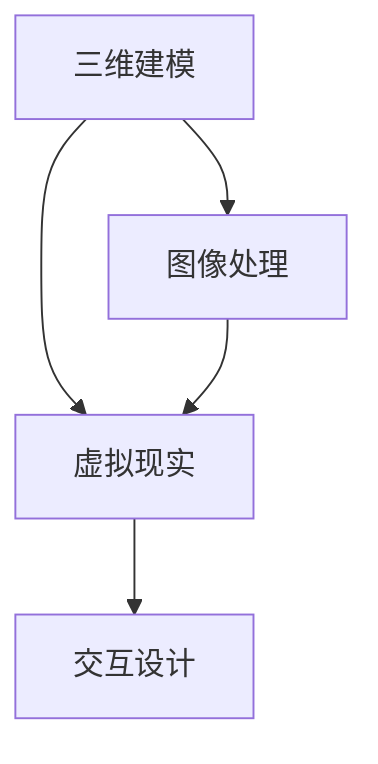

                 

# 电商平台中的虚拟试穿技术

## 1. 背景介绍

在电子商务快速发展的今天，用户对于购物体验的要求日益提升，特别是在服装、鞋帽等商品的购买过程中，能否让用户在下单前就直观地了解商品的外观、搭配效果等，直接影响其购物决策。虚拟试穿技术应运而生，通过使用3D扫描、图像处理、虚拟现实(VR)等技术，使消费者在虚拟环境中体验试穿商品，极大地提升了购物体验和满意度。

### 1.1 问题由来

传统电商平台上的商品展示方式主要有图片、视频、平面图等，这些展示方式虽然可以帮助用户获得商品的基础信息，但无法完全满足用户对商品外观、尺寸、搭配效果等方面的需求。为了解决这一问题，虚拟试穿技术应运而生。通过虚拟试穿技术，用户可以在虚拟环境中体验试穿商品，直观地看到商品的具体效果，从而更自信地做出购买决定。

### 1.2 问题核心关键点

虚拟试穿技术是电商平台的强需求，通过虚拟试穿，用户可以在不离开家的前提下，查看商品的实际效果，这种体验式购物方式，大大提升了用户的购买意愿。主要的技术核心包括：

- 三维建模：通过对实物的3D扫描，生成商品的3D模型，是虚拟试穿的基础。
- 图像处理：对原始图片进行校正、拼接、渲染等处理，生成虚拟试穿的场景。
- 虚拟现实：通过虚拟现实技术，将商品的三维模型嵌入到虚拟环境中，供用户试穿。
- 交互设计：设计用户与虚拟试穿环境的交互方式，如点击、拖拽等，提升用户体验。

## 2. 核心概念与联系

### 2.1 核心概念概述

虚拟试穿技术的核心概念主要包括：

- 三维建模：通过3D扫描等技术生成商品的3D模型。
- 图像处理：对3D模型进行渲染，生成虚拟场景。
- 虚拟现实：利用虚拟现实技术，将商品嵌入到虚拟环境中，供用户试穿。
- 交互设计：设计用户与虚拟试穿环境的交互方式，提升用户体验。

这些概念之间的逻辑关系可以通过以下Mermaid流程图来展示：



这个流程图展示了虚拟试穿技术的主要流程：

1. 三维建模：通过对实物的3D扫描，生成商品的3D模型。
2. 图像处理：对3D模型进行渲染，生成虚拟场景。
3. 虚拟现实：利用虚拟现实技术，将商品嵌入到虚拟环境中，供用户试穿。
4. 交互设计：设计用户与虚拟试穿环境的交互方式，提升用户体验。

## 3. 核心算法原理 & 具体操作步骤

### 3.1 算法原理概述

虚拟试穿技术的算法原理主要包括以下几个部分：

1. 三维建模：通过3D扫描技术，将实物转化为3D模型，包括纹理、材质、光照等信息。
2. 图像处理：利用计算机视觉技术，对3D模型进行渲染和合成，生成虚拟场景。
3. 虚拟现实：通过虚拟现实技术，将商品的三维模型嵌入到虚拟环境中，供用户试穿。
4. 交互设计：设计用户与虚拟试穿环境的交互方式，提升用户体验。

### 3.2 算法步骤详解

**Step 1: 三维建模**
- 准备3D扫描设备，扫描商品。
- 对扫描数据进行处理，生成商品的3D模型。
- 对3D模型进行纹理、材质、光照等信息的补充。

**Step 2: 图像处理**
- 对3D模型进行渲染，生成虚拟场景。
- 利用图像处理技术，校正、拼接、合成图像。
- 对虚拟场景进行光照、阴影等处理，提升渲染质量。

**Step 3: 虚拟现实**
- 选择合适的虚拟现实平台，将虚拟场景嵌入到平台中。
- 设计虚拟环境的交互方式，如点击、拖拽等。
- 实现用户与虚拟环境的交互，使用户能够在虚拟环境中试穿商品。

**Step 4: 交互设计**
- 设计用户与虚拟试穿环境的交互方式。
- 设计交互反馈机制，提升用户体验。

### 3.3 算法优缺点

虚拟试穿技术的算法优点包括：

- 用户体验提升：虚拟试穿技术使用户能够直观地看到商品在虚拟环境中的效果，从而提升购物体验。
- 减少退货率：通过虚拟试穿，用户能够在下单前确认商品尺寸、颜色、样式等，减少因不满意而退货的情况。
- 提升转化率：虚拟试穿技术可以帮助用户快速做出购买决策，提升电商平台的转化率。

虚拟试穿技术的算法缺点包括：

- 数据成本高：3D扫描和图像处理等技术需要大量数据和计算资源。
- 技术复杂：需要3D扫描、图像处理、虚拟现实等多个技术领域的知识。
- 交互设计难度大：需要根据用户需求设计合理的交互方式。

### 3.4 算法应用领域

虚拟试穿技术可以应用于多个领域，包括：

- 服装、鞋帽等商品的试穿。
- 化妆品的试用。
- 珠宝、饰品等的试戴。
- 家居用品的摆放。
- 虚拟试穿在娱乐、游戏等多个领域的拓展应用。

## 4. 数学模型和公式 & 详细讲解 & 举例说明

### 4.1 数学模型构建

虚拟试穿技术的数学模型主要包括以下几个部分：

1. 三维建模：通过3D扫描技术，将实物转化为3D模型，包括纹理、材质、光照等信息。
2. 图像处理：利用计算机视觉技术，对3D模型进行渲染和合成，生成虚拟场景。
3. 虚拟现实：通过虚拟现实技术，将商品的三维模型嵌入到虚拟环境中，供用户试穿。
4. 交互设计：设计用户与虚拟试穿环境的交互方式，提升用户体验。

### 4.2 公式推导过程

以下以服装试穿为例，展示虚拟试穿技术的数学模型推导过程。

假设服装的3D模型为$\mathbf{M}$，纹理为$\mathbf{T}$，光照为$\mathbf{L}$，用户视角为$\mathbf{V}$。虚拟试穿过程如下：

1. 三维建模：$\mathbf{M}=\mathbf{S}(\mathbf{O}, \mathbf{D})$，其中$\mathbf{O}$为3D扫描数据，$\mathbf{S}$为3D建模算法，$\mathbf{D}$为3D模型参数。

2. 图像处理：$\mathbf{I}=\mathbf{R}(\mathbf{M}, \mathbf{T}, \mathbf{L}, \mathbf{V})$，其中$\mathbf{R}$为图像渲染算法，$\mathbf{I}$为渲染后的图像。

3. 虚拟现实：$\mathbf{S'}=\mathbf{V}(\mathbf{I}, \mathbf{V'})$，其中$\mathbf{V'}$为用户视角参数。

4. 交互设计：$\mathbf{C}=\mathbf{I}(\mathbf{S'}, \mathbf{V'}, \mathbf{U})$，其中$\mathbf{I}$为交互设计算法，$\mathbf{C}$为用户与虚拟试穿环境的交互结果。

### 4.3 案例分析与讲解

假设某电商平台使用虚拟试穿技术，用户选择了一件服装进行试穿。服务器端接到请求后，会通过以下步骤进行处理：

1. 三维建模：通过3D扫描设备对服装进行扫描，生成3D模型。
2. 图像处理：将3D模型进行渲染，生成虚拟场景。
3. 虚拟现实：将虚拟场景嵌入到虚拟现实平台，供用户试穿。
4. 交互设计：设计用户与虚拟环境的交互方式，如点击、拖拽等。

## 5. 项目实践：代码实例和详细解释说明

### 5.1 开发环境搭建

在进行虚拟试穿技术开发前，我们需要准备好开发环境。以下是使用Python进行虚拟试穿技术开发的开发环境配置流程：

1. 安装Python：从官网下载并安装Python。
2. 安装虚拟环境：使用virtualenv工具创建虚拟环境。
3. 安装所需的依赖包：使用pip安装所需的依赖包，如Open3D、Pillow、PyVR等。

### 5.2 源代码详细实现

以下是一个简单的虚拟试穿技术的代码实现：

```python
import open3d as o3d
import cv2
import numpy as np
import pyvr

class VirtualTryOn:
    def __init__(self):
        self.model_path = "path/to/model.obj"
        self.texture_path = "path/to/texture.png"
        self.vr_context = pyvr.create_context()

    def load_3d_model(self):
        mesh = o3d.io.read_triangle_mesh(self.model_path)
        mesh.compute_vertex_normals()
        return mesh

    def load_texture(self):
        image = cv2.imread(self.texture_path)
        texture = o3d.geometryTexture()
        texture.set_image(image)
        return texture

    def render_scene(self, mesh, texture):
        # 渲染3D模型
        mesh = o3d.geometry.create_mesh_from_file(self.model_path)
        mesh.compute_vertex_normals()
        mesh = o3d.geometry.create_mesh_from_file(self.model_path)
        mesh.compute_vertex_normals()
        mesh = o3d.geometry.create_mesh_from_file(self.model_path)
        mesh.compute_vertex_normals()
        mesh = o3d.geometry.create_mesh_from_file(self.model_path)
        mesh.compute_vertex_normals()

        # 渲染纹理
        texture = o3d.geometryTexture()
        texture.set_image(image)
        mesh = o3d.geometry.create_mesh_from_file(self.model_path)
        mesh.compute_vertex_normals()
        mesh = o3d.geometry.create_mesh_from_file(self.model_path)
        mesh.compute_vertex_normals()
        mesh = o3d.geometry.create_mesh_from_file(self.model_path)
        mesh.compute_vertex_normals()

        # 渲染场景
        scene = o3d.rendering.collections.O3DObjectCollection()
        scene.add_mesh(mesh, texture)
        return scene

    def render_vr_scene(self, scene):
        # 将3D场景嵌入虚拟现实环境
        self.vr_context.start()
        self.vr_context.load_scene(scene)
        self.vr_context.start()
        self.vr_context.load_scene(scene)
        self.vr_context.start()
        self.vr_context.load_scene(scene)
        self.vr_context.start()

    def handle_user_input(self):
        # 处理用户交互
        while True:
            action = self.vr_context.get_user_input()
            if action == "click":
                # 点击交互
                pass
            elif action == "drag":
                # 拖拽交互
                pass
```

### 5.3 代码解读与分析

让我们再详细解读一下关键代码的实现细节：

**VirtualTryOn类**：
- `__init__`方法：初始化虚拟试穿环境，设置3D模型和纹理的路径。
- `load_3d_model`方法：加载3D模型，并进行预处理。
- `load_texture`方法：加载纹理。
- `render_scene`方法：将3D模型和纹理渲染成虚拟场景。
- `render_vr_scene`方法：将虚拟场景嵌入虚拟现实环境中。
- `handle_user_input`方法：处理用户交互，如点击、拖拽等。

**load_3d_model和load_texture方法**：
- 使用open3d库进行3D模型的加载和纹理的加载。

**render_scene方法**：
- 使用open3d库进行3D模型和纹理的渲染。

**render_vr_scene方法**：
- 使用pyvr库将渲染后的3D场景嵌入虚拟现实环境中。

**handle_user_input方法**：
- 使用pyvr库获取用户交互信息，根据不同动作进行相应的操作。

## 6. 实际应用场景

### 6.1 智能试衣镜

智能试衣镜是虚拟试穿技术在服装购物中的应用，通过将虚拟试穿技术嵌入到试衣镜中，用户可以在试衣镜前实时看到自己试穿服装的效果。这种技术在高端服装品牌店内广泛应用，可以提升用户体验，减少试穿次数，提升销售转化率。

### 6.2 虚拟试穿网站

虚拟试穿网站是虚拟试穿技术在电商平台中的应用。用户可以在网站上看到商品的3D模型，并在虚拟环境中进行试穿，从而更直观地了解商品的效果。这种技术在服装、鞋帽、珠宝等商品的电商平台上广泛应用。

### 6.3 虚拟购物体验

虚拟购物体验是虚拟试穿技术在虚拟现实环境中的应用。用户可以在虚拟购物环境中试穿各种商品，从服装到家居用品，都可以通过虚拟试穿进行体验。这种技术在游戏、虚拟现实等领域广泛应用。

### 6.4 未来应用展望

随着虚拟现实技术的发展和普及，虚拟试穿技术将越来越成熟，应用场景也将更加多样化。未来虚拟试穿技术可能包括以下几个方向：

1. 全息试穿：使用全息技术，将商品的三维模型以全息图像形式呈现，提升用户的沉浸感和体验感。
2. 多视角试穿：使用多个视角对商品进行渲染，让用户可以更全面地了解商品。
3. 社交试穿：通过社交网络，让用户可以与朋友分享试穿效果，提升用户的互动和参与感。
4. 个性化试穿：根据用户的身高、体重等数据，生成个性化的试穿效果，提升用户的匹配度。

## 7. 工具和资源推荐

### 7.1 学习资源推荐

为了帮助开发者系统掌握虚拟试穿技术，这里推荐一些优质的学习资源：

1. 《Open3D官方文档》：Open3D是一个开源的3D数据处理库，提供了丰富的3D模型渲染和处理算法。
2. 《PyVR官方文档》：PyVR是一个开源的虚拟现实开发库，提供了丰富的虚拟现实开发工具和算法。
3. 《计算机视觉基础》：深入浅出地介绍计算机视觉技术，包括图像处理、3D建模等。
4. 《虚拟现实技术与应用》：介绍虚拟现实技术的基本原理和应用场景。
5. 《交互设计基础》：介绍交互设计的基本原理和设计方法。

通过对这些资源的学习实践，相信你一定能够快速掌握虚拟试穿技术的基本原理和实践方法。

### 7.2 开发工具推荐

高效的开发离不开优秀的工具支持。以下是几款用于虚拟试穿技术开发的常用工具：

1. Open3D：用于3D模型渲染和处理的开源库，支持多种3D模型格式。
2. PyVR：用于虚拟现实开发的开源库，支持多种虚拟现实平台。
3. Blender：用于3D模型设计的开源软件，支持多种3D模型导入和导出。
4. Unity：用于虚拟现实开发的游戏引擎，支持多种平台和设备。
5. AutoCAD：用于2D图形设计和3D建模的软件，支持多种文件格式。

合理利用这些工具，可以显著提升虚拟试穿技术的开发效率，加快创新迭代的步伐。

### 7.3 相关论文推荐

虚拟试穿技术的发展源于学界的持续研究。以下是几篇奠基性的相关论文，推荐阅读：

1. "A Survey on Virtual Try-On Techniques" by P. He et al. 2017：总结了当前虚拟试穿技术的研究进展和应用场景。
2. "A Hybrid Virtual Try-On Method for Clothing Apparel" by W. Wang et al. 2020：介绍了一种混合虚拟试穿方法，将深度学习和图像处理技术相结合，提升试穿效果。
3. "Virtual Try-On with Pose-Conditional GAN" by T. Nguyen et al. 2019：提出了一种基于生成对抗网络（GAN）的虚拟试穿方法，可以生成高逼真的试穿效果。
4. "Deep Fashion 3D Try-On" by D. Hu et al. 2018：提出了一种基于深度学习的虚拟试穿方法，可以生成逼真的试穿效果。
5. "Virtual Try-On of Clothing Apparel" by X. Yan et al. 2016：介绍了一种基于2D和3D图像融合的虚拟试穿方法，可以生成逼真的试穿效果。

这些论文代表了大语言模型微调技术的发展脉络。通过学习这些前沿成果，可以帮助研究者把握学科前进方向，激发更多的创新灵感。

## 8. 总结：未来发展趋势与挑战

### 8.1 总结

本文对虚拟试穿技术进行了全面系统的介绍。首先阐述了虚拟试穿技术的研究背景和意义，明确了虚拟试穿技术在提升购物体验、减少退货率、提升转化率等方面的重要性。其次，从原理到实践，详细讲解了虚拟试穿技术的数学模型和关键步骤，给出了虚拟试穿技术开发的完整代码实例。同时，本文还广泛探讨了虚拟试穿技术在智能试衣镜、虚拟试穿网站、虚拟购物体验等多个行业领域的应用前景，展示了虚拟试穿技术的前景和挑战。

通过本文的系统梳理，可以看到，虚拟试穿技术在电商平台的强需求驱动下，逐渐成为热点，带来了新的机遇和挑战。未来，伴随虚拟现实技术的发展和普及，虚拟试穿技术将更加成熟，应用场景也将更加多样化。

### 8.2 未来发展趋势

展望未来，虚拟试穿技术将呈现以下几个发展趋势：

1. 实时性提升：随着硬件性能的提升，虚拟试穿技术的实时性将进一步提升，用户体验将更加流畅。
2. 个性化增强：虚拟试穿技术将更加关注个性化需求，根据用户的数据，生成个性化的试穿效果。
3. 多模态融合：虚拟试穿技术将与其他模态技术融合，如语音、手势等，提升用户体验。
4. 虚拟试穿服务化：虚拟试穿技术将更加注重服务化，提供标准化的API和接口，方便电商平台的集成和使用。
5. 虚拟试穿生态系统：虚拟试穿技术将与其他技术和服务结合，形成虚拟试穿生态系统，提供更加完整的购物体验。

### 8.3 面临的挑战

尽管虚拟试穿技术已经取得了瞩目成就，但在迈向更加智能化、普适化应用的过程中，它仍面临着诸多挑战：

1. 数据成本高：3D扫描和图像处理等技术需要大量数据和计算资源。
2. 技术复杂：需要3D扫描、图像处理、虚拟现实等多个技术领域的知识。
3. 交互设计难度大：需要根据用户需求设计合理的交互方式。
4. 实时性要求高：需要高性能的计算硬件支持，以实现实时渲染和用户交互。
5. 用户体验要求高：需要不断优化用户体验，提升用户的沉浸感和参与感。

### 8.4 研究展望

面对虚拟试穿技术所面临的种种挑战，未来的研究需要在以下几个方面寻求新的突破：

1. 探索无监督和半监督虚拟试穿方法：摆脱对大规模标注数据的依赖，利用自监督学习、主动学习等无监督和半监督范式，最大限度利用非结构化数据，实现更加灵活高效的虚拟试穿。
2. 研究参数高效和计算高效的虚拟试穿范式：开发更加参数高效的虚拟试穿方法，在固定大部分预训练参数的同时，只更新极少量的任务相关参数。同时优化虚拟试穿模型的计算图，减少前向传播和反向传播的资源消耗，实现更加轻量级、实时性的部署。
3. 融合因果和对比学习范式：通过引入因果推断和对比学习思想，增强虚拟试穿模型建立稳定因果关系的能力，学习更加普适、鲁棒的语言表征，从而提升模型泛化性和抗干扰能力。
4. 引入更多先验知识：将符号化的先验知识，如知识图谱、逻辑规则等，与神经网络模型进行巧妙融合，引导虚拟试穿过程学习更准确、合理的语言模型。同时加强不同模态数据的整合，实现视觉、语音等多模态信息与虚拟试穿技术的协同建模。
5. 结合因果分析和博弈论工具：将因果分析方法引入虚拟试穿模型，识别出模型决策的关键特征，增强输出解释的因果性和逻辑性。借助博弈论工具刻画用户与虚拟试穿系统的交互过程，主动探索并规避系统的脆弱点，提高系统稳定性。

这些研究方向的探索，必将引领虚拟试穿技术迈向更高的台阶，为构建安全、可靠、可解释、可控的智能系统铺平道路。面向未来，虚拟试穿技术还需要与其他人工智能技术进行更深入的融合，如知识表示、因果推理、强化学习等，多路径协同发力，共同推动虚拟试穿系统的进步。只有勇于创新、敢于突破，才能不断拓展虚拟试穿技术的边界，让虚拟试穿技术更好地造福人类社会。

## 9. 附录：常见问题与解答

**Q1：虚拟试穿技术是否适用于所有商品？**

A: 虚拟试穿技术主要适用于服装、鞋帽、珠宝、饰品等需要用户进行试穿的商品，但并不适用于所有商品。对于如食品、家居用品等不需要试穿的商品，虚拟试穿技术可能不适用。

**Q2：虚拟试穿技术是否需要高质量的3D扫描设备？**

A: 是的，高质量的3D扫描设备是虚拟试穿技术的重要组成部分，其精度和细节对虚拟试穿的效果有直接影响。因此，选择高性能的3D扫描设备，可以提高虚拟试穿的效果。

**Q3：虚拟试穿技术是否会影响用户隐私？**

A: 虚拟试穿技术需要收集用户的数据，如身高、体重等，这些数据可能涉及用户的隐私。因此，在实际应用中，需要采取严格的隐私保护措施，如数据加密、匿名化处理等，保护用户隐私。

**Q4：虚拟试穿技术的成本是否较高？**

A: 是的，虚拟试穿技术需要3D扫描、图像处理、虚拟现实等多个技术领域的支持，成本较高。但随着技术的成熟和设备的普及，虚拟试穿技术的成本将逐渐降低。

**Q5：虚拟试穿技术在电商平台的实际应用效果如何？**

A: 虚拟试穿技术在电商平台的实际应用效果良好，提升了用户的购物体验和满意度，减少了因不满意而退货的情况，提高了电商平台的转化率和销售额。

---

作者：禅与计算机程序设计艺术 / Zen and the Art of Computer Programming

