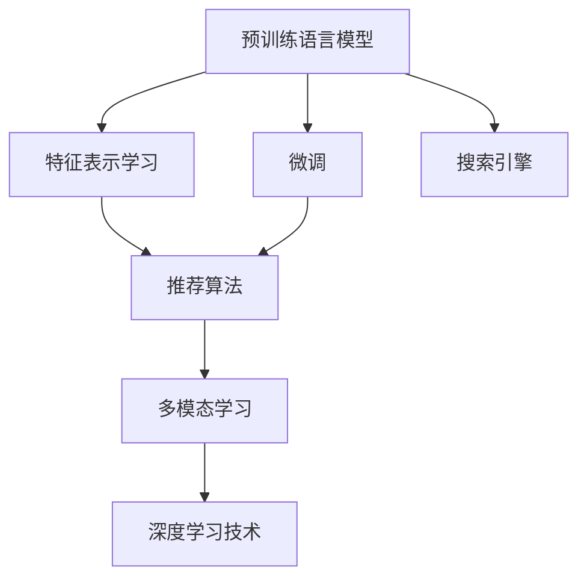

                 

## 1. 背景介绍

### 1.1 问题由来

在当今数字化和信息化的时代，电商平台已经成为了人们购物的重要渠道之一。为了提供更好的用户体验，电商平台越来越依赖于智能推荐系统。这些系统通过分析用户行为数据，推荐用户可能感兴趣的商品，提升用户的购物体验和平台的转化率。然而，传统的推荐系统往往基于统计方法和特征工程，其效果受限于数据的充分性和特征的有效性，难以应对用户多样化和个性化的需求。

随着深度学习技术的发展，基于大模型的推荐系统开始受到广泛关注。大模型通过在海量数据上进行预训练，学习到丰富的特征表示，能够在无需大量标注数据的情况下，通过微调优化适应特定任务的性能。特别是近几年，大型预训练语言模型（如BERT、GPT、Transformer等）的兴起，为电商平台推荐系统的优化提供了新的方向。

### 1.2 问题核心关键点

大模型在电商推荐系统中的应用，主要体现在以下几个方面：

- **大模型的预训练和微调**：通过在大规模无标签数据上进行预训练，学习通用的语言表示，再通过微调适应电商平台的具体任务，如商品搜索、用户行为预测、个性化推荐等。
- **模型的跨领域迁移能力**：大模型在多个领域中的表现优异，能够将在其他领域中学习的知识迁移到电商推荐任务中。
- **高效推荐**：大模型的自回归结构使其能够高效生成推荐结果，且在推荐系统中的应用往往不需要从头训练，极大地缩短了模型的开发周期。
- **用户个性化**：大模型通过学习用户的行为和语义信息，能够提供更精准的个性化推荐。
- **鲁棒性和泛化能力**：大模型通过在大规模数据上进行训练，能够更好地抵抗噪声和对抗样本，提升推荐系统的鲁棒性和泛化能力。

本文聚焦于基于大模型的电商平台搜索推荐系统的优化，探讨了如何通过大模型提高推荐系统的性能、效率与转化率，并为读者提供了一整套完整的实践指南。

## 2. 核心概念与联系

### 2.1 核心概念概述

为更好地理解基于大模型的电商平台推荐系统，本节将介绍几个密切相关的核心概念：

- **预训练语言模型(Pretrained Language Model, PLM)**：通过在大规模无标签文本数据上进行自监督学习，学习通用的语言表示，如BERT、GPT、Transformer等。
- **微调(Fine-Tuning)**：在预训练模型的基础上，通过有监督地训练来优化模型在特定任务上的性能。
- **特征表示学习(Feature Representation Learning)**：学习如何将原始数据转化为高维特征，以便于模型进行学习和预测。
- **搜索引擎(Search Engine)**：通过倒排索引等技术，快速检索用户输入的关键词与商品信息的相关性。
- **推荐算法(Recommendation Algorithm)**：通过学习用户行为数据，预测用户可能感兴趣的商品，如协同过滤、基于内容的推荐等。
- **多模态学习(Multi-modal Learning)**：结合文本、图像、声音等多模态信息，提升推荐的全面性和精准性。

这些核心概念之间的逻辑关系可以通过以下Mermaid流程图来展示：



这个流程图展示了大模型在电商平台推荐系统中的关键概念及其之间的关系：

1. 预训练语言模型通过在大规模数据上进行预训练，学习到通用的语言表示。
2. 微调通过在小规模标注数据上进行有监督学习，优化模型在特定任务上的性能。
3. 特征表示学习将原始数据转化为高维特征，用于后续的模型学习和预测。
4. 搜索引擎通过倒排索引技术，快速检索用户输入的关键词与商品信息的相关性。
5. 推荐算法通过学习用户行为数据，预测用户可能感兴趣的商品。
6. 多模态学习结合多种信息源，提升推荐的全面性和精准性。
7. 深度学习技术提供强大的模型构建和优化能力，促进整个推荐系统的提升。

这些概念共同构成了电商平台搜索推荐系统的核心，使得平台能够高效、精准地为用户提供个性化推荐。

## 3. 核心算法原理 & 具体操作步骤

### 3.1 算法原理概述

基于大模型的电商平台推荐系统，本质上是通过在大规模预训练语言模型上进行微调，适应电商平台的特定任务。其核心思想是：利用预训练模型学习到的通用语言表示，通过微调过程将其适应到推荐系统的具体任务上，从而提升推荐的性能。

形式化地，假设预训练语言模型为 $M_{\theta}$，其中 $\theta$ 为预训练得到的模型参数。给定电商平台推荐任务 $T$ 的标注数据集 $D=\{(x_i,y_i)\}_{i=1}^N$，推荐系统的目标是通过微调优化模型在任务 $T$ 上的性能，使得模型输出逼近理想结果 $y_i$。

微调的优化目标是最小化损失函数 $\mathcal{L}$，即：

$$
\hat{\theta}=\mathop{\arg\min}_{\theta} \mathcal{L}(M_{\theta},D)
$$

其中 $\mathcal{L}$ 为推荐系统的损失函数，用于衡量模型预测输出与真实结果之间的差异。常见的损失函数包括交叉熵损失、均方误差损失等。

通过梯度下降等优化算法，微调过程不断更新模型参数 $\theta$，最小化损失函数 $\mathcal{L}$，使得模型输出逼近真实结果 $y_i$。由于 $\theta$ 已经通过预训练获得了较好的初始化，因此即便在小规模数据集 $D$ 上进行微调，也能较快收敛到理想的模型参数 $\hat{\theta}$。

### 3.2 算法步骤详解

基于大模型的电商平台推荐系统一般包括以下几个关键步骤：

**Step 1: 准备预训练模型和数据集**
- 选择合适的预训练语言模型 $M_{\theta}$ 作为初始化参数，如 BERT、GPT等。
- 准备电商平台推荐任务 $T$ 的标注数据集 $D$，划分为训练集、验证集和测试集。一般要求标注数据与预训练数据的分布不要差异过大。

**Step 2: 定义推荐模型**
- 根据电商平台推荐任务的类型，设计合适的推荐模型架构。常见的推荐模型包括协同过滤模型、基于内容的推荐模型、深度学习推荐模型等。
- 在预训练模型的基础上添加推荐算法模块，如矩阵分解、向量空间模型等。

**Step 3: 设置微调超参数**
- 选择合适的优化算法及其参数，如 AdamW、SGD 等，设置学习率、批大小、迭代轮数等。
- 设置正则化技术及强度，包括权重衰减、Dropout、Early Stopping 等。
- 确定冻结预训练参数的策略，如仅微调顶层，或全部参数都参与微调。

**Step 4: 执行梯度训练**
- 将训练集数据分批次输入模型，前向传播计算损失函数。
- 反向传播计算参数梯度，根据设定的优化算法和学习率更新模型参数。
- 周期性在验证集上评估模型性能，根据性能指标决定是否触发 Early Stopping。
- 重复上述步骤直到满足预设的迭代轮数或 Early Stopping 条件。

**Step 5: 测试和部署**
- 在测试集上评估微调后模型 $M_{\hat{\theta}}$ 的性能，对比微调前后的推荐准确率提升。
- 使用微调后的模型对新商品进行推荐，集成到实际的应用系统中。
- 持续收集新的用户行为数据，定期重新微调模型，以适应数据分布的变化。

以上是基于大模型的电商平台推荐系统的完整流程。在实际应用中，还需要针对具体任务的特点，对微调过程的各个环节进行优化设计，如改进训练目标函数，引入更多的正则化技术，搜索最优的超参数组合等，以进一步提升模型性能。

### 3.3 算法优缺点

基于大模型的电商平台推荐系统具有以下优点：
1. 能够利用预训练模型的广泛语言知识，提升推荐的准确性和全面性。
2. 适应性广，能够处理多种推荐任务，如商品搜索、商品评论、个性化推荐等。
3. 训练速度快，微调过程可在小规模数据集上快速收敛。
4. 可解释性强，部分预训练模型提供了可解释的输出解释方式。

同时，该方法也存在一定的局限性：
1. 依赖标注数据。微调的效果很大程度上取决于标注数据的质量和数量，获取高质量标注数据的成本较高。
2. 过拟合风险。微调过程中容易过拟合标注数据，导致模型在新数据上泛化能力不足。
3. 计算资源需求高。大模型训练和推理需要大量的计算资源，如GPU/TPU等。

尽管存在这些局限性，但就目前而言，基于大模型的推荐系统仍然是大规模电商平台推荐的主流范式。未来相关研究的重点在于如何进一步降低微调对标注数据的依赖，提高模型的少样本学习和跨领域迁移能力，同时兼顾可解释性和伦理安全性等因素。

### 3.4 算法应用领域

基于大模型的电商平台推荐系统已经在电商、零售、在线教育等多个领域得到广泛应用，具体包括：

- **电商平台商品推荐**：推荐系统通过分析用户的浏览、购买行为，推荐用户可能感兴趣的商品。例如，淘宝、京东、亚马逊等电商平台。
- **个性化推荐系统**：为在线教育平台推荐个性化的学习资源，如在线课程、视频、文章等。例如，Coursera、Khan Academy 等。
- **内容推荐**：为视频网站推荐用户可能感兴趣的视频内容。例如，Netflix、YouTube 等。
- **广告推荐**：为广告系统推荐用户可能感兴趣的广告内容。例如，Facebook、Google Ads 等。

除了上述这些经典应用外，大模型在推荐系统中的应用还在不断创新，如个性化视频推荐、智能客服、智能广告等，为电商平台的推荐服务带来新的突破。随着预训练模型和推荐算法的不断进步，相信基于大模型的推荐系统将在更广阔的应用领域大放异彩。

## 4. 数学模型和公式 & 详细讲解

### 4.1 数学模型构建

本节将使用数学语言对基于大模型的电商平台推荐系统进行更加严格的刻画。

记预训练语言模型为 $M_{\theta}$，其中 $\theta$ 为预训练得到的模型参数。假设电商平台推荐任务为 $T$，标注数据集为 $D=\{(x_i,y_i)\}_{i=1}^N, x_i \in \mathcal{X}, y_i \in \mathcal{Y}$，其中 $\mathcal{X}$ 为输入空间，$\mathcal{Y}$ 为输出空间。

定义模型 $M_{\theta}$ 在数据样本 $(x,y)$ 上的损失函数为 $\ell(M_{\theta}(x),y)$，则在数据集 $D$ 上的经验风险为：

$$
\mathcal{L}(\theta) = \frac{1}{N}\sum_{i=1}^N \ell(M_{\theta}(x_i),y_i)
$$

微调的优化目标是最小化经验风险，即找到最优参数：

$$
\theta^* = \mathop{\arg\min}_{\theta} \mathcal{L}(\theta)
$$

在实践中，我们通常使用基于梯度的优化算法（如SGD、Adam等）来近似求解上述最优化问题。设 $\eta$ 为学习率，$\lambda$ 为正则化系数，则参数的更新公式为：

$$
\theta \leftarrow \theta - \eta \nabla_{\theta}\mathcal{L}(\theta) - \eta\lambda\theta
$$

其中 $\nabla_{\theta}\mathcal{L}(\theta)$ 为损失函数对参数 $\theta$ 的梯度，可通过反向传播算法高效计算。

### 4.2 公式推导过程

以下我们以推荐任务为例，推导交叉熵损失函数及其梯度的计算公式。

假设模型 $M_{\theta}$ 在输入 $x$ 上的输出为 $\hat{y}=M_{\theta}(x) \in [0,1]$，表示商品被用户购买的概率。真实标签 $y \in \{0,1\}$。则二分类交叉熵损失函数定义为：

$$
\ell(M_{\theta}(x),y) = -[y\log \hat{y} + (1-y)\log (1-\hat{y})]
$$

将其代入经验风险公式，得：

$$
\mathcal{L}(\theta) = -\frac{1}{N}\sum_{i=1}^N [y_i\log M_{\theta}(x_i)+(1-y_i)\log(1-M_{\theta}(x_i))]
$$

根据链式法则，损失函数对参数 $\theta_k$ 的梯度为：

$$
\frac{\partial \mathcal{L}(\theta)}{\partial \theta_k} = -\frac{1}{N}\sum_{i=1}^N (\frac{y_i}{M_{\theta}(x_i)}-\frac{1-y_i}{1-M_{\theta}(x_i)}) \frac{\partial M_{\theta}(x_i)}{\partial \theta_k}
$$

其中 $\frac{\partial M_{\theta}(x_i)}{\partial \theta_k}$ 可进一步递归展开，利用自动微分技术完成计算。

在得到损失函数的梯度后，即可带入参数更新公式，完成模型的迭代优化。重复上述过程直至收敛，最终得到适应电商平台推荐任务的最优模型参数 $\theta^*$。

## 5. 项目实践：代码实例和详细解释说明

### 5.1 开发环境搭建

在进行推荐系统开发前，我们需要准备好开发环境。以下是使用Python进行PyTorch开发的环境配置流程：

1. 安装Anaconda：从官网下载并安装Anaconda，用于创建独立的Python环境。

2. 创建并激活虚拟环境：
```bash
conda create -n pytorch-env python=3.8 
conda activate pytorch-env
```

3. 安装PyTorch：根据CUDA版本，从官网获取对应的安装命令。例如：
```bash
conda install pytorch torchvision torchaudio cudatoolkit=11.1 -c pytorch -c conda-forge
```

4. 安装Transformers库：
```bash
pip install transformers
```

5. 安装各类工具包：
```bash
pip install numpy pandas scikit-learn matplotlib tqdm jupyter notebook ipython
```

完成上述步骤后，即可在`pytorch-env`环境中开始推荐系统开发。

### 5.2 源代码详细实现

下面我们以基于BERT的电商平台商品推荐系统为例，给出使用Transformers库进行推荐系统开发的PyTorch代码实现。

首先，定义推荐任务的数据处理函数：

```python
from transformers import BertTokenizer
from torch.utils.data import Dataset
import torch

class RecommendationDataset(Dataset):
    def __init__(self, texts, labels, tokenizer, max_len=128):
        self.texts = texts
        self.labels = labels
        self.tokenizer = tokenizer
        self.max_len = max_len
        
    def __len__(self):
        return len(self.texts)
    
    def __getitem__(self, item):
        text = self.texts[item]
        label = self.labels[item]
        
        encoding = self.tokenizer(text, return_tensors='pt', max_length=self.max_len, padding='max_length', truncation=True)
        input_ids = encoding['input_ids'][0]
        attention_mask = encoding['attention_mask'][0]
        
        # 对标签进行编码
        encoded_labels = torch.tensor(label, dtype=torch.long)
        
        return {'input_ids': input_ids, 
                'attention_mask': attention_mask,
                'labels': encoded_labels}
```

然后，定义模型和优化器：

```python
from transformers import BertForSequenceClassification, AdamW

model = BertForSequenceClassification.from_pretrained('bert-base-cased', num_labels=2)

optimizer = AdamW(model.parameters(), lr=2e-5)
```

接着，定义训练和评估函数：

```python
from torch.utils.data import DataLoader
from tqdm import tqdm
from sklearn.metrics import classification_report

device = torch.device('cuda') if torch.cuda.is_available() else torch.device('cpu')
model.to(device)

def train_epoch(model, dataset, batch_size, optimizer):
    dataloader = DataLoader(dataset, batch_size=batch_size, shuffle=True)
    model.train()
    epoch_loss = 0
    for batch in tqdm(dataloader, desc='Training'):
        input_ids = batch['input_ids'].to(device)
        attention_mask = batch['attention_mask'].to(device)
        labels = batch['labels'].to(device)
        model.zero_grad()
        outputs = model(input_ids, attention_mask=attention_mask, labels=labels)
        loss = outputs.loss
        epoch_loss += loss.item()
        loss.backward()
        optimizer.step()
    return epoch_loss / len(dataloader)

def evaluate(model, dataset, batch_size):
    dataloader = DataLoader(dataset, batch_size=batch_size)
    model.eval()
    preds, labels = [], []
    with torch.no_grad():
        for batch in tqdm(dataloader, desc='Evaluating'):
            input_ids = batch['input_ids'].to(device)
            attention_mask = batch['attention_mask'].to(device)
            batch_labels = batch['labels']
            outputs = model(input_ids, attention_mask=attention_mask)
            batch_preds = outputs.logits.argmax(dim=2).to('cpu').tolist()
            batch_labels = batch_labels.to('cpu').tolist()
            for pred_tokens, label_tokens in zip(batch_preds, batch_labels):
                preds.append(pred_tokens)
                labels.append(label_tokens)
                
    print(classification_report(labels, preds))
```

最后，启动训练流程并在测试集上评估：

```python
epochs = 5
batch_size = 16

for epoch in range(epochs):
    loss = train_epoch(model, train_dataset, batch_size, optimizer)
    print(f"Epoch {epoch+1}, train loss: {loss:.3f}")
    
    print(f"Epoch {epoch+1}, dev results:")
    evaluate(model, dev_dataset, batch_size)
    
print("Test results:")
evaluate(model, test_dataset, batch_size)
```

以上就是使用PyTorch对BERT进行电商平台商品推荐系统开发的完整代码实现。可以看到，得益于Transformers库的强大封装，我们可以用相对简洁的代码完成BERT模型的加载和推荐系统构建。

### 5.3 代码解读与分析

让我们再详细解读一下关键代码的实现细节：

**RecommendationDataset类**：
- `__init__`方法：初始化文本、标签、分词器等关键组件。
- `__len__`方法：返回数据集的样本数量。
- `__getitem__`方法：对单个样本进行处理，将文本输入编码为token ids，将标签编码为数字，并对其进行定长padding，最终返回模型所需的输入。

**模型定义和优化器**：
- 使用BertForSequenceClassification类加载预训练模型，设置标签数。
- 使用AdamW优化器进行模型参数的更新。

**训练和评估函数**：
- 使用PyTorch的DataLoader对数据集进行批次化加载，供模型训练和推理使用。
- 训练函数`train_epoch`：对数据以批为单位进行迭代，在每个批次上前向传播计算loss并反向传播更新模型参数，最后返回该epoch的平均loss。
- 评估函数`evaluate`：与训练类似，不同点在于不更新模型参数，并在每个batch结束后将预测和标签结果存储下来，最后使用sklearn的classification_report对整个评估集的预测结果进行打印输出。

**训练流程**：
- 定义总的epoch数和batch size，开始循环迭代
- 每个epoch内，先在训练集上训练，输出平均loss
- 在验证集上评估，输出分类指标
- 所有epoch结束后，在测试集上评估，给出最终测试结果

可以看到，PyTorch配合Transformers库使得BERT推荐系统的代码实现变得简洁高效。开发者可以将更多精力放在数据处理、模型改进等高层逻辑上，而不必过多关注底层的实现细节。

当然，工业级的系统实现还需考虑更多因素，如模型的保存和部署、超参数的自动搜索、更灵活的任务适配层等。但核心的微调范式基本与此类似。

## 6. 实际应用场景

### 6.1 智能客服系统

基于大模型的推荐系统可以广泛应用于智能客服系统的构建。传统客服往往需要配备大量人力，高峰期响应缓慢，且一致性和专业性难以保证。而使用推荐系统推荐机器人，可以7x24小时不间断服务，快速响应客户咨询，用自然流畅的语言解答各类常见问题。

在技术实现上，可以收集企业内部的历史客服对话记录，将问题和最佳答复构建成监督数据，在此基础上对预训练推荐模型进行微调。微调后的推荐模型能够自动理解用户意图，匹配最合适的答复模板进行回复。对于客户提出的新问题，还可以接入检索系统实时搜索相关内容，动态组织生成回答。如此构建的智能客服系统，能大幅提升客户咨询体验和问题解决效率。

### 6.2 个性化推荐系统

当前推荐系统往往只依赖用户的历史行为数据进行物品推荐，无法深入理解用户的真实兴趣偏好。基于大模型的个性化推荐系统可以更好地挖掘用户的行为和语义信息，从而提供更精准、多样的推荐内容。

在实践中，可以收集用户浏览、点击、评论、分享等行为数据，提取和用户交互的物品标题、描述、标签等文本内容。将文本内容作为模型输入，用户的后续行为（如是否点击、购买等）作为监督信号，在此基础上微调预训练语言模型。微调后的模型能够从文本内容中准确把握用户的兴趣点。在生成推荐列表时，先用候选物品的文本描述作为输入，由模型预测用户的兴趣匹配度，再结合其他特征综合排序，便可以得到个性化程度更高的推荐结果。

### 6.3 搜索系统

在搜索引擎中，大模型可以通过学习用户的搜索查询，推荐可能相关的搜索结果。例如，用户搜索“如何提高编程技能”时，推荐系统可以基于大模型学习到的语言知识，推荐相关的编程教程、书籍、视频等内容。推荐系统可以根据用户的搜索历史和行为，动态调整推荐策略，提高搜索结果的相关性和用户体验。

### 6.4 未来应用展望

随着大模型和推荐算法的不断发展，基于大模型的推荐系统将在更多领域得到应用，为传统行业带来变革性影响。

在智慧医疗领域，基于大模型的推荐系统可以辅助医生进行疾病诊断和治疗方案推荐，加速医疗知识的传播和应用。

在智能教育领域，推荐系统可以根据学生的学习行为和语义信息，推荐个性化的学习资源，如在线课程、视频、文章等，提升学习效果和满意度。

在智慧城市治理中，推荐系统可以推荐城市事件的处理方案和预警信息，帮助城市管理者高效应对突发事件，提升城市治理水平。

此外，在企业生产、社会治理、文娱传媒等众多领域，基于大模型的推荐系统也将不断涌现，为经济社会发展注入新的动力。相信随着技术的日益成熟，大模型推荐系统必将在更广阔的应用领域大放异彩，深刻影响人类的生产生活方式。

## 7. 工具和资源推荐

### 7.1 学习资源推荐

为了帮助开发者系统掌握基于大模型的电商平台推荐系统的理论基础和实践技巧，这里推荐一些优质的学习资源：

1. 《深度学习理论与实践》系列博文：由深度学习领域的权威专家撰写，详细介绍了深度学习的基本原理、算法和应用，是理解大模型的基础读物。

2. 《Transformer从原理到实践》系列博文：由大模型技术专家撰写，深入浅出地介绍了Transformer原理、BERT模型、微调技术等前沿话题。

3. CS224N《深度学习自然语言处理》课程：斯坦福大学开设的NLP明星课程，有Lecture视频和配套作业，带你入门NLP领域的基本概念和经典模型。

4. 《Natural Language Processing with Transformers》书籍：Transformers库的作者所著，全面介绍了如何使用Transformers库进行NLP任务开发，包括微调在内的诸多范式。

5. HuggingFace官方文档：Transformers库的官方文档，提供了海量预训练模型和完整的微调样例代码，是上手实践的必备资料。

通过对这些资源的学习实践，相信你一定能够快速掌握基于大模型的电商平台推荐系统的精髓，并用于解决实际的推荐问题。

### 7.2 开发工具推荐

高效的开发离不开优秀的工具支持。以下是几款用于基于大模型的电商平台推荐系统开发的常用工具：

1. PyTorch：基于Python的开源深度学习框架，灵活动态的计算图，适合快速迭代研究。大部分预训练语言模型都有PyTorch版本的实现。

2. TensorFlow：由Google主导开发的开源深度学习框架，生产部署方便，适合大规模工程应用。同样有丰富的预训练语言模型资源。

3. Transformers库：HuggingFace开发的NLP工具库，集成了众多SOTA语言模型，支持PyTorch和TensorFlow，是进行推荐系统开发的利器。

4. Weights & Biases：模型训练的实验跟踪工具，可以记录和可视化模型训练过程中的各项指标，方便对比和调优。与主流深度学习框架无缝集成。

5. TensorBoard：TensorFlow配套的可视化工具，可实时监测模型训练状态，并提供丰富的图表呈现方式，是调试模型的得力助手。

6. Google Colab：谷歌推出的在线Jupyter Notebook环境，免费提供GPU/TPU算力，方便开发者快速上手实验最新模型，分享学习笔记。

合理利用这些工具，可以显著提升基于大模型的推荐系统的开发效率，加快创新迭代的步伐。

### 7.3 相关论文推荐

大模型和推荐系统的发展源于学界的持续研究。以下是几篇奠基性的相关论文，推荐阅读：

1. Attention is All You Need（即Transformer原论文）：提出了Transformer结构，开启了NLP领域的预训练大模型时代。

2. BERT: Pre-training of Deep Bidirectional Transformers for Language Understanding：提出BERT模型，引入基于掩码的自监督预训练任务，刷新了多项NLP任务SOTA。

3. Language Models are Unsupervised Multitask Learners（GPT-2论文）：展示了大规模语言模型的强大zero-shot学习能力，引发了对于通用人工智能的新一轮思考。

4. Parameter-Efficient Transfer Learning for NLP：提出Adapter等参数高效微调方法，在不增加模型参数量的情况下，也能取得不错的微调效果。

5. Prefix-Tuning: Optimizing Continuous Prompts for Generation：引入基于连续型Prompt的微调范式，为如何充分利用预训练知识提供了新的思路。

6. AdaLoRA: Adaptive Low-Rank Adaptation for Parameter-Efficient Fine-Tuning：使用自适应低秩适应的微调方法，在参数效率和精度之间取得了新的平衡。

这些论文代表了大模型和推荐系统的发展脉络。通过学习这些前沿成果，可以帮助研究者把握学科前进方向，激发更多的创新灵感。

## 8. 总结：未来发展趋势与挑战

### 8.1 总结

本文对基于大模型的电商平台推荐系统进行了全面系统的介绍。首先阐述了大模型和推荐系统的发展背景和意义，明确了推荐系统在提升用户体验和平台转化率方面的重要价值。其次，从原理到实践，详细讲解了基于大模型的推荐系统的数学原理和关键步骤，给出了推荐系统开发的完整代码实例。同时，本文还广泛探讨了推荐系统在智能客服、个性化推荐、搜索系统等多个行业领域的应用前景，展示了推荐系统的巨大潜力。此外，本文精选了推荐技术的各类学习资源，力求为读者提供全方位的技术指引。

通过本文的系统梳理，可以看到，基于大模型的推荐系统在大数据、智能算法和工程实践的驱动下，正在向更加高效、精准、个性化的方向发展，成为电商平台推荐系统的重要范式。未来，伴随大模型和推荐算法的不断进步，推荐系统将在更多领域得到应用，为传统行业带来变革性影响。

### 8.2 未来发展趋势

展望未来，基于大模型的推荐系统将呈现以下几个发展趋势：

1. 推荐系统将进一步个性化。随着用户数据量的增加和计算能力的提升，推荐系统能够更加精准地把握用户的兴趣和需求，提供更加个性化的推荐。

2. 跨领域推荐能力将得到增强。未来的推荐系统将不仅仅局限于电商平台的商品推荐，而是能够跨领域地推荐多种类型的信息，如音乐、视频、新闻等。

3. 推荐系统的可解释性将得到提升。未来的推荐系统将引入更多的因果分析和推理机制，使得推荐结果具有更高的可解释性和可信任度。

4. 推荐系统的实时性将得到提升。未来的推荐系统将能够实时处理用户请求，快速生成推荐结果，提升用户体验。

5. 推荐系统的跨模态能力将得到增强。未来的推荐系统将结合文本、图像、声音等多种信息源，提升推荐的全面性和精准性。

6. 推荐系统的推荐策略将更加灵活。未来的推荐系统将能够动态调整推荐策略，根据用户的行为和环境变化，实时调整推荐内容。

以上趋势凸显了基于大模型的推荐系统的广阔前景。这些方向的探索发展，必将进一步提升推荐系统的性能和应用范围，为电商平台的推荐服务带来新的突破。

### 8.3 面临的挑战

尽管基于大模型的推荐系统已经取得了瞩目成就，但在迈向更加智能化、普适化应用的过程中，它仍面临着诸多挑战：

1. 推荐系统的数据隐私和安全问题。如何保护用户数据的隐私和安全性，避免数据泄露和滥用，是一个重要挑战。

2. 推荐系统的多样性和公正性问题。如何避免推荐系统的偏见，确保推荐结果的多样性和公正性，是一个复杂的技术和社会问题。

3. 推荐系统的计算资源消耗。大模型的训练和推理需要大量的计算资源，如何在保证性能的同时，提高计算效率，是一个重要的工程挑战。

4. 推荐系统的稳定性问题。如何确保推荐系统的稳定性和鲁棒性，避免在数据分布变化时出现性能波动，是一个重要的技术挑战。

5. 推荐系统的公平性和透明度问题。如何确保推荐系统的公平性，使得推荐结果对所有用户都是公平和透明的，是一个重要的社会和伦理问题。

6. 推荐系统的可解释性和可解释性问题。如何增强推荐系统的可解释性，使得用户和开发者能够理解和信任推荐结果，是一个重要的技术挑战。

这些挑战凸显了大模型和推荐系统在应用过程中需要解决的问题。只有通过技术创新和多方合作，才能实现大模型和推荐系统的可持续发展。

### 8.4 研究展望

面对大模型和推荐系统面临的种种挑战，未来的研究需要在以下几个方面寻求新的突破：

1. 探索无监督和半监督推荐方法。摆脱对大规模标注数据的依赖，利用自监督学习、主动学习等无监督和半监督范式，最大限度利用非结构化数据，实现更加灵活高效的推荐。

2. 研究参数高效和计算高效的推荐方法。开发更加参数高效的推荐方法，在固定大部分预训练参数的同时，只更新极少量的任务相关参数。同时优化推荐算法的计算图，减少前向传播和反向传播的资源消耗，实现更加轻量级、实时性的部署。

3. 融合因果和对比学习范式。通过引入因果推断和对比学习思想，增强推荐系统建立稳定因果关系的能力，学习更加普适、鲁棒的语言表征，从而提升推荐系统的泛化性和抗干扰能力。

4. 引入更多先验知识。将符号化的先验知识，如知识图谱、逻辑规则等，与神经网络模型进行巧妙融合，引导推荐过程学习更准确、合理的语言模型。同时加强不同模态数据的整合，实现视觉、语音等多模态信息与文本信息的协同建模。

5. 结合因果分析和博弈论工具。将因果分析方法引入推荐系统，识别出推荐决策的关键特征，增强推荐结果的因果性和逻辑性。借助博弈论工具刻画人机交互过程，主动探索并规避推荐系统的脆弱点，提高系统稳定性。

6. 纳入伦理道德约束。在推荐系统训练目标中引入伦理导向的评估指标，过滤和惩罚有偏见、有害的输出倾向。同时加强人工干预和审核，建立推荐系统的监管机制，确保推荐结果符合人类价值观和伦理道德。

这些研究方向的探索，必将引领大模型和推荐系统的进一步发展，为构建更加智能化、普适化的推荐系统铺平道路。面向未来，大模型和推荐系统还需要与其他人工智能技术进行更深入的融合，如知识表示、因果推理、强化学习等，多路径协同发力，共同推动推荐系统的进步。只有勇于创新、敢于突破，才能不断拓展推荐系统的边界，让推荐系统更好地服务于人类社会。

## 9. 附录：常见问题与解答

**Q1：推荐系统的数据隐私和安全问题如何解决？**

A: 推荐系统的数据隐私和安全问题可以通过以下几种方式解决：
1. 数据匿名化：在数据收集和处理过程中，去除或模糊化用户的个人信息，保护用户隐私。
2. 数据加密：使用加密技术保护用户数据在传输和存储过程中的安全性。
3. 差分隐私：在数据收集和分析过程中，通过添加噪声等方式，使得单个用户的数据难以被识别和重构。
4. 数据共享协议：与第三方机构签订数据共享协议，明确数据使用范围和保护措施，确保数据安全和隐私。

**Q2：推荐系统的多样性和公正性问题如何解决？**

A: 推荐系统的多样性和公正性问题可以通过以下几种方式解决：
1. 多样性约束：在推荐算法中引入多样性约束，确保推荐结果中包含多种类型的信息，避免推荐结果过于单一。
2. 公平性指标：定义公平性指标，如均等性、代表性等，通过优化推荐算法，确保推荐结果对所有用户都是公平的。
3. 用户反馈机制：引入用户反馈机制，收集用户对推荐结果的反馈意见，及时调整推荐策略，提高推荐系统的公正性。
4. 多元数据源：结合多元数据源，如社交网络、知识图谱等，提升推荐系统的多样性和公正性。

**Q3：推荐系统的计算资源消耗如何优化？**

A: 推荐系统的计算资源消耗可以通过以下几种方式优化：
1. 模型压缩：通过模型剪枝、量化等技术，减小模型尺寸，降低计算资源消耗。
2. 分布式计算：利用分布式计算框架，如Hadoop、Spark等，分散计算任务，提高计算效率。
3. 硬件加速：使用GPU、TPU等高性能硬件设备，加速模型训练和推理过程。
4. 模型并行：采用模型并行技术，如数据并行、模型并行等，提高计算效率。
5. 微调策略：通过参数高效微调、模型蒸馏等技术，减少计算资源消耗，提高推荐系统的性能。

**Q4：推荐系统的稳定性问题如何解决？**

A: 推荐系统的稳定性问题可以通过以下几种方式解决：
1. 鲁棒性训练：在模型训练过程中，引入鲁棒性训练策略，如对抗训练、数据增强等，提高模型的鲁棒性。
2. 动态更新：根据数据分布的变化，动态调整推荐算法和模型参数，提高推荐系统的稳定性。
3. 多模型融合：结合多个推荐模型，通过投票、加权等方式，提高推荐系统的稳定性。
4. 数据清洗：清洗异常数据和噪声数据，提高数据的可靠性和模型的稳定性。

**Q5：推荐系统的公平性和透明度问题如何解决？**

A: 推荐系统的公平性和透明度问题可以通过以下几种方式解决：
1. 公平性指标：定义公平性指标，如均等性、代表性等，通过优化推荐算法，确保推荐结果对所有用户都是公平的。
2. 透明性约束：在推荐算法中引入透明性约束，使得推荐过程和结果对用户和开发者透明。
3. 用户反馈机制：引入用户反馈机制，收集用户对推荐结果的反馈意见，及时调整推荐策略，提高推荐系统的公平性和透明度。
4. 伦理审查：建立伦理审查机制，对推荐系统的开发和应用进行伦理审查，确保推荐系统符合人类价值观和伦理道德。

这些措施有助于提升推荐系统的公平性和透明度，保护用户和社会的利益。

