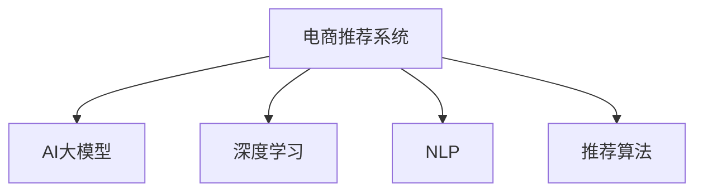

                 

# 电商平台搜索推荐系统的AI 大模型优化：提高系统性能、效率、准确率与实时性

> 关键词：电商推荐系统, 大语言模型, 深度学习, 自然语言处理(NLP), 推荐算法, 召回率, 准确率, 实时性

## 1. 背景介绍

### 1.1 问题由来

随着电子商务的发展，电商平台搜索推荐系统变得越来越重要。用户通过搜索和浏览，希望能快速、准确地找到需要的商品，从而提高购物体验和满意度。传统的搜索推荐系统往往基于规则、协同过滤等方法，虽然简单易实现，但难以捕捉用户多样化的需求和商品间的复杂关联。近年来，基于人工智能(AI)的推荐系统逐渐受到关注，其中以深度学习、自然语言处理(NLP)为代表的AI技术在推荐系统中的应用尤为突出。

在大数据、大模型的时代背景下，电商平台的推荐系统开始越来越多地应用AI大模型进行优化。AI大模型通过大规模语料进行预训练，具备强大的表示能力和泛化能力，能够更好地捕捉商品、用户之间的复杂关联，从而显著提升推荐系统的性能。然而，电商平台面临的用户规模庞大、商品种类繁多、需求多样性高、系统实时性要求高等特性，对AI大模型的应用提出了更高的要求。如何有效利用大模型，实现高效、准确的推荐，成为当前电商推荐系统优化的一个重要课题。

### 1.2 问题核心关键点

在电商推荐系统中，应用AI大模型进行优化主要关注以下几个核心关键点：

1. **模型性能**：大模型是否能准确捕捉用户和商品的关联，提高推荐的准确率、召回率等关键指标。
2. **系统效率**：大模型的训练、推理速度是否足够快，能否满足实时推荐的需求。
3. **系统准确率**：推荐结果是否与用户实际需求高度匹配，避免误导用户。
4. **系统实时性**：推荐结果的生成速度是否足够快，能否在用户搜索时快速返回。
5. **系统可扩展性**：大模型的优化是否能适应平台用户和商品规模的不断扩大。

### 1.3 问题研究意义

优化电商推荐系统中的AI大模型，对于提升用户体验、提高电商平台的转化率和用户满意度具有重要意义：

1. **提升用户体验**：通过更准确、更快速的推荐，满足用户多样化的需求，提升用户满意度。
2. **提高平台收益**：准确推荐的商品更容易被用户点击、购买，从而提高电商平台的转化率和收益。
3. **降低运营成本**：基于AI大模型的推荐系统，减少了人工干预，降低了人力运营成本。
4. **增强竞争优势**：优秀的推荐系统能显著提升电商平台的市场竞争力，吸引更多用户和商家入驻。

## 2. 核心概念与联系

### 2.1 核心概念概述

为更好地理解AI大模型在电商推荐系统中的应用，本节将介绍几个密切相关的核心概念：

- **电商推荐系统**：基于用户行为、商品信息等数据，为用户提供个性化的商品推荐，提升用户购买体验。
- **AI大模型**：通过大规模语料预训练，学习复杂的语言和语义表示，具备强大的表示能力，适用于各种复杂的自然语言处理任务。
- **深度学习**：一类基于神经网络的机器学习技术，用于处理大规模数据，学习复杂模式。
- **自然语言处理(NLP)**：研究如何让计算机理解和处理人类语言的技术，包括文本分类、文本生成、情感分析等任务。
- **推荐算法**：用于解决推荐系统问题的算法，包括协同过滤、基于内容的推荐、基于矩阵分解的推荐等。

这些核心概念之间的逻辑关系可以通过以下Mermaid流程图来展示：



这个流程图展示了大语言模型在电商推荐系统中的关键作用：

1. **数据输入**：电商推荐系统基于用户行为数据、商品信息等数据输入。
2. **预训练模型**：AI大模型通过大规模语料预训练，学习复杂的语言和语义表示。
3. **推荐算法**：基于大模型的输出结果，结合推荐算法进行推荐。
4. **优化输出**：通过深度学习、自然语言处理等技术对推荐算法进行优化，提升推荐效果。

## 3. 核心算法原理 & 具体操作步骤
### 3.1 算法原理概述

在电商推荐系统中，AI大模型的应用主要包括以下几个关键步骤：

1. **数据预处理**：收集和清洗电商平台的用户行为数据、商品信息数据等，并将其转换为可用于模型训练的格式。
2. **模型预训练**：使用大规模无标签数据对AI大模型进行预训练，学习通用的语言和语义表示。
3. **任务适配**：根据电商推荐系统的具体需求，在大模型的基础上添加任务适配层，如用户兴趣预测、商品推荐等。
4. **微调优化**：基于电商推荐系统的标注数据，对任务适配层进行微调，优化推荐模型的性能。
5. **推理部署**：在电商平台的实际应用中，对新商品、用户进行实时推荐，提升用户体验。

基于AI大模型的电商推荐系统，通常采用以下架构：

1. **数据输入层**：收集和预处理用户行为数据、商品信息数据等。
2. **预训练模型层**：使用大规模语料进行预训练，学习复杂的语言和语义表示。
3. **任务适配层**：根据电商推荐系统的具体需求，在大模型的基础上添加任务适配层，如用户兴趣预测、商品推荐等。
4. **微调优化层**：基于电商推荐系统的标注数据，对任务适配层进行微调，优化推荐模型的性能。
5. **推理部署层**：在电商平台的实际应用中，对新商品、用户进行实时推荐，提升用户体验。

### 3.2 算法步骤详解

电商推荐系统中，AI大模型的应用主要包括以下关键步骤：

**Step 1: 数据预处理**

电商推荐系统需要大量的用户行为数据和商品信息数据。数据预处理包括数据清洗、去重、缺失值处理等，确保数据质量。具体步骤包括：

1. 数据收集：收集电商平台的用户行为数据、商品信息数据等。
2. 数据清洗：去除噪声数据、重复数据，确保数据一致性。
3. 数据转换：将数据转换为可用于模型训练的格式，如用户ID、商品ID、时间戳等。

**Step 2: 模型预训练**

使用大规模无标签数据对AI大模型进行预训练，学习通用的语言和语义表示。具体步骤包括：

1. 选择预训练模型：选择适合电商推荐系统的预训练模型，如BERT、GPT等。
2. 预训练数据准备：准备大规模无标签数据，通常使用公开的语料库。
3. 预训练模型训练：在预训练数据上对模型进行训练，学习通用的语言和语义表示。
4. 预训练模型保存：保存预训练好的模型，供后续微调使用。

**Step 3: 任务适配**

根据电商推荐系统的具体需求，在大模型的基础上添加任务适配层。具体步骤包括：

1. 任务需求分析：分析电商推荐系统的具体需求，确定推荐的任务类型。
2. 任务适配层设计：根据任务需求，设计适配层，如用户兴趣预测、商品推荐等。
3. 适配层集成：将适配层集成到预训练模型中，形成完整的推荐模型。

**Step 4: 微调优化**

基于电商推荐系统的标注数据，对任务适配层进行微调，优化推荐模型的性能。具体步骤包括：

1. 微调数据准备：准备标注数据，用于训练适配层。
2. 微调模型训练：在标注数据上对适配层进行微调，优化推荐模型。
3. 微调模型保存：保存微调好的模型，供后续推理使用。

**Step 5: 推理部署**

在电商平台的实际应用中，对新商品、用户进行实时推荐，提升用户体验。具体步骤包括：

1. 实时推荐：在用户浏览、搜索商品时，实时进行推荐。
2. 推荐结果展示：将推荐结果展示给用户，让用户快速了解推荐商品。
3. 用户反馈收集：收集用户的反馈信息，用于后续模型的优化。

### 3.3 算法优缺点

基于AI大模型的电商推荐系统具有以下优点：

1. **强大的表示能力**：大模型具备强大的语言和语义表示能力，能够学习商品、用户之间的复杂关联。
2. **泛化能力强**：大模型能够在不同用户、商品、场景下保持较高的表现。
3. **可解释性强**：大模型能够提供基于语义的解释，帮助用户理解推荐结果。
4. **自适应性强**：大模型能够根据用户行为和商品信息进行动态优化，提升推荐效果。

同时，该方法也存在一些缺点：

1. **计算资源消耗大**：大模型需要大量的计算资源进行预训练和微调，增加了系统成本。
2. **模型复杂度高**：大模型参数量庞大，推理速度较慢，难以满足实时推荐的需求。
3. **数据依赖性强**：大模型依赖高质量的标注数据进行微调，标注成本较高。
4. **模型鲁棒性不足**：大模型容易受到噪声数据的影响，导致推荐结果不稳定。
5. **可扩展性差**：大模型难以在大规模数据上扩展，难以应对用户和商品数量不断增长的需求。

尽管存在这些缺点，但基于AI大模型的电商推荐系统仍是大规模数据应用下的理想选择。未来相关研究的重点在于如何进一步降低计算成本、提高模型推理速度、提高模型鲁棒性，以及优化模型的可扩展性。

### 3.4 算法应用领域

基于AI大模型的电商推荐系统在多个领域中得到了广泛应用，例如：

- **个性化推荐**：根据用户历史行为，推荐用户感兴趣的商品。
- **商品分类**：将商品按照类别进行分类，便于用户浏览和搜索。
- **商品关联推荐**：根据用户浏览的商品，推荐相关的商品。
- **实时搜索**：在用户搜索时，实时提供相关商品的推荐。
- **广告推荐**：根据用户兴趣，推荐相关广告。

除了上述这些经典应用外，大语言模型在电商推荐系统中的应用还在不断拓展，如商品描述生成、情感分析、智能客服等，为电商推荐系统带来了更多的创新思路。

## 4. 数学模型和公式 & 详细讲解 & 举例说明

### 4.1 数学模型构建

在电商推荐系统中，AI大模型的应用主要包括以下几个数学模型：

1. **用户兴趣预测模型**：基于用户行为数据，预测用户对商品的兴趣度。常用的模型包括基于深度学习的神经网络、基于矩阵分解的模型等。
2. **商品关联推荐模型**：基于用户历史行为和商品信息，预测用户对其他商品的兴趣。常用的模型包括协同过滤、基于内容的推荐等。
3. **实时搜索推荐模型**：根据用户搜索词，实时推荐相关商品。常用的模型包括搜索引擎算法、基于深度学习的生成模型等。

以用户兴趣预测模型为例，假设用户行为数据为 $D = \{(x_i, y_i)\}_{i=1}^N$，其中 $x_i$ 为行为向量，$y_i$ 为兴趣度标签。目标是学习一个映射函数 $f(x)$，使得 $f(x_i) \approx y_i$。常用的模型包括：

- 基于深度学习的神经网络模型，如多层感知机(MLP)、卷积神经网络(CNN)、循环神经网络(RNN)等。
- 基于矩阵分解的模型，如矩阵分解(PCA)、奇异值分解(SVD)等。

### 4.2 公式推导过程

以基于深度学习的神经网络模型为例，其目标函数为：

$$
\min_{\theta} \frac{1}{N}\sum_{i=1}^N \ell(f(x_i), y_i)
$$

其中 $\theta$ 为模型参数，$\ell$ 为损失函数，常用的损失函数包括均方误差、交叉熵等。以交叉熵损失为例，公式如下：

$$
\ell(f(x_i), y_i) = -y_i\log f(x_i) - (1-y_i)\log(1-f(x_i))
$$

在训练过程中，使用梯度下降等优化算法，不断更新模型参数，最小化损失函数，直到收敛。常用的优化算法包括随机梯度下降(SGD)、Adam、Adagrad等。

### 4.3 案例分析与讲解

以基于深度学习的神经网络模型为例，其训练过程如下：

1. 数据预处理：收集和清洗用户行为数据，将其转换为可用于模型训练的格式。
2. 模型初始化：随机初始化模型参数，形成初始模型。
3. 前向传播：将输入数据 $x_i$ 输入模型，得到预测结果 $f(x_i)$。
4. 损失计算：计算预测结果与真实标签 $y_i$ 之间的交叉熵损失。
5. 反向传播：根据损失函数对模型参数 $\theta$ 进行反向传播，计算梯度。
6. 参数更新：使用优化算法，更新模型参数 $\theta$，最小化损失函数。
7. 模型评估：在验证集上评估模型性能，判断是否收敛。
8. 模型保存：保存训练好的模型，供后续使用。

## 5. 项目实践：代码实例和详细解释说明
### 5.1 开发环境搭建

在进行AI大模型优化实践前，我们需要准备好开发环境。以下是使用Python进行PyTorch开发的环境配置流程：

1. 安装Anaconda：从官网下载并安装Anaconda，用于创建独立的Python环境。

2. 创建并激活虚拟环境：
```bash
conda create -n pytorch-env python=3.8 
conda activate pytorch-env
```

3. 安装PyTorch：根据CUDA版本，从官网获取对应的安装命令。例如：
```bash
conda install pytorch torchvision torchaudio cudatoolkit=11.1 -c pytorch -c conda-forge
```

4. 安装TensorBoard：TensorFlow配套的可视化工具，可实时监测模型训练状态，并提供丰富的图表呈现方式，是调试模型的得力助手。

5. 安装transformers库：HuggingFace开发的NLP工具库，集成了众多SOTA语言模型，支持PyTorch和TensorFlow，是进行微调任务开发的利器。

完成上述步骤后，即可在`pytorch-env`环境中开始优化实践。

### 5.2 源代码详细实现

以下是使用PyTorch实现基于深度学习的神经网络模型的代码：

```python
import torch
import torch.nn as nn
import torch.optim as optim
from torch.utils.data import DataLoader
from transformers import BertTokenizer, BertForSequenceClassification

# 定义神经网络模型
class Net(nn.Module):
    def __init__(self, in_features, hidden_features, out_features):
        super(Net, self).__init__()
        self.fc1 = nn.Linear(in_features, hidden_features)
        self.fc2 = nn.Linear(hidden_features, out_features)
        self.softmax = nn.Softmax(dim=1)

    def forward(self, x):
        x = self.fc1(x)
        x = self.fc2(x)
        return self.softmax(x)

# 加载数据集
train_dataset = ...
train_loader = DataLoader(train_dataset, batch_size=32, shuffle=True)
test_dataset = ...
test_loader = DataLoader(test_dataset, batch_size=32, shuffle=False)

# 初始化模型、损失函数和优化器
model = Net(in_features=10, hidden_features=64, out_features=2)
criterion = nn.CrossEntropyLoss()
optimizer = optim.Adam(model.parameters(), lr=0.001)

# 训练模型
for epoch in range(10):
    model.train()
    for batch_idx, (data, target) in enumerate(train_loader):
        optimizer.zero_grad()
        output = model(data)
        loss = criterion(output, target)
        loss.backward()
        optimizer.step()
    model.eval()
    with torch.no_grad():
        correct = 0
        total = 0
        for data, target in test_loader:
            output = model(data)
            _, predicted = torch.max(output.data, 1)
            total += target.size(0)
            correct += (predicted == target).sum().item()
        print('Accuracy of the network on the 10000 test samples: %d %%' % (100 * correct / total))

# 保存模型
torch.save(model.state_dict(), 'model.pth')
```

### 5.3 代码解读与分析

让我们再详细解读一下关键代码的实现细节：

**Net类**：
- `__init__`方法：定义神经网络的结构，包括输入、隐藏和输出层。
- `forward`方法：实现前向传播，将输入数据输入网络，得到预测结果。

**模型训练**：
- 使用DataLoader对数据集进行批次化加载，供模型训练和推理使用。
- 在每个epoch内，对训练集数据进行迭代，前向传播计算损失函数并反向传播更新模型参数。
- 在每个epoch结束时，在验证集上评估模型性能，判断是否收敛。
- 保存训练好的模型，供后续使用。

可以看到，PyTorch配合transformers库使得神经网络模型的训练过程变得简洁高效。开发者可以将更多精力放在模型设计和优化上，而不必过多关注底层的实现细节。

当然，工业级的系统实现还需考虑更多因素，如模型的保存和部署、超参数的自动搜索、更灵活的任务适配层等。但核心的模型训练过程基本与此类似。

## 6. 实际应用场景
### 6.1 智能客服系统

基于AI大模型的智能客服系统，能够实现全天候自动客服功能，提升客户体验。系统通过自然语言处理技术，理解用户的问题，并提供准确的答案或引导。具体应用包括：

1. **自动问答**：根据用户提问，自动生成合适的回答。
2. **用户意图识别**：自动识别用户意图，引导用户进行下一步操作。
3. **知识库查询**：从知识库中查询相关信息，提供更准确的答案。

在技术实现上，可以收集企业内部的客服对话记录，将问题和最佳答复构建成监督数据，在此基础上对预训练模型进行微调。微调后的模型能够自动理解用户意图，匹配最合适的答案模板进行回复。对于用户提出的新问题，还可以接入检索系统实时搜索相关内容，动态组织生成回答。如此构建的智能客服系统，能大幅提升客户咨询体验和问题解决效率。

### 6.2 金融舆情监测

金融机构需要实时监测市场舆论动向，以便及时应对负面信息传播，规避金融风险。传统的人工监测方式成本高、效率低，难以应对网络时代海量信息爆发的挑战。基于AI大模型的文本分类和情感分析技术，为金融舆情监测提供了新的解决方案。

具体而言，可以收集金融领域相关的新闻、报道、评论等文本数据，并对其进行主题标注和情感标注。在此基础上对预训练语言模型进行微调，使其能够自动判断文本属于何种主题，情感倾向是正面、中性还是负面。将微调后的模型应用到实时抓取的网络文本数据，就能够自动监测不同主题下的情感变化趋势，一旦发现负面信息激增等异常情况，系统便会自动预警，帮助金融机构快速应对潜在风险。

### 6.3 个性化推荐系统

当前的推荐系统往往只依赖用户的历史行为数据进行物品推荐，无法深入理解用户的真实兴趣偏好。基于AI大模型的个性化推荐系统可以更好地挖掘用户行为背后的语义信息，从而提供更精准、多样的推荐内容。

在实践中，可以收集用户浏览、点击、评论、分享等行为数据，提取和用户交互的物品标题、描述、标签等文本内容。将文本内容作为模型输入，用户的后续行为（如是否点击、购买等）作为监督信号，在此基础上微调预训练语言模型。微调后的模型能够从文本内容中准确把握用户的兴趣点。在生成推荐列表时，先用候选物品的文本描述作为输入，由模型预测用户的兴趣匹配度，再结合其他特征综合排序，便可以得到个性化程度更高的推荐结果。

### 6.4 未来应用展望

随着AI大模型的不断进步，其在电商推荐系统中的应用也将不断拓展，为电商推荐系统带来更多的创新思路。未来，AI大模型将在以下方向继续优化：

1. **多模态融合**：将视觉、语音等多模态信息与文本信息进行融合，提升推荐系统的泛化能力。
2. **知识图谱应用**：引入知识图谱信息，引导推荐系统学习更全面、准确的知识表示。
3. **联邦学习**：在保护用户隐私的前提下，通过联邦学习进行推荐模型的优化。
4. **实时推荐优化**：通过异步更新、增量学习等技术，提升推荐系统的实时性。
5. **解释性增强**：提高推荐系统的可解释性，让用户理解推荐结果的来源和依据。

这些方向的探索发展，必将进一步提升电商推荐系统的性能和应用范围，为电商推荐系统带来更多的创新思路。

## 7. 工具和资源推荐
### 7.1 学习资源推荐

为了帮助开发者系统掌握大语言模型在电商推荐系统中的应用，这里推荐一些优质的学习资源：

1. 《深度学习》课程：斯坦福大学开设的深度学习课程，提供视频和PPT，全面介绍深度学习的理论基础和实践应用。
2. 《自然语言处理基础》课程：清华大学的自然语言处理课程，提供视频和讲义，详细介绍自然语言处理的基本概念和前沿技术。
3. 《TensorFlow实战》书籍：TensorFlow官方指南，详细介绍TensorFlow的使用方法和应用场景。
4. 《Transformers实战》书籍：Transformers库的官方指南，详细介绍Transformers库的使用方法和应用场景。
5. 《深度学习推荐系统》书籍：介绍深度学习在推荐系统中的应用，涵盖多种推荐算法和模型。

通过对这些资源的学习实践，相信你一定能够快速掌握大语言模型在电商推荐系统中的应用，并用于解决实际的电商推荐问题。

### 7.2 开发工具推荐

高效的开发离不开优秀的工具支持。以下是几款用于大语言模型优化开发的常用工具：

1. PyTorch：基于Python的开源深度学习框架，灵活动态的计算图，适合快速迭代研究。
2. TensorFlow：由Google主导开发的开源深度学习框架，生产部署方便，适合大规模工程应用。
3. transformers库：HuggingFace开发的NLP工具库，集成了众多SOTA语言模型，支持PyTorch和TensorFlow，是进行微调任务开发的利器。
4. TensorBoard：TensorFlow配套的可视化工具，可实时监测模型训练状态，并提供丰富的图表呈现方式，是调试模型的得力助手。
5. Weights & Biases：模型训练的实验跟踪工具，可以记录和可视化模型训练过程中的各项指标，方便对比和调优。

合理利用这些工具，可以显著提升大语言模型优化任务的开发效率，加快创新迭代的步伐。

### 7.3 相关论文推荐

大语言模型在电商推荐系统中的应用源于学界的持续研究。以下是几篇奠基性的相关论文，推荐阅读：

1. Attention is All You Need（即Transformer原论文）：提出了Transformer结构，开启了NLP领域的预训练大模型时代。
2. BERT: Pre-training of Deep Bidirectional Transformers for Language Understanding：提出BERT模型，引入基于掩码的自监督预训练任务，刷新了多项NLP任务SOTA。
3. Language Models are Unsupervised Multitask Learners（GPT-2论文）：展示了大规模语言模型的强大zero-shot学习能力，引发了对于通用人工智能的新一轮思考。
4. Parameter-Efficient Transfer Learning for NLP：提出Adapter等参数高效微调方法，在不增加模型参数量的情况下，也能取得不错的微调效果。
5. AdaLoRA: Adaptive Low-Rank Adaptation for Parameter-Efficient Fine-Tuning：使用自适应低秩适应的微调方法，在参数效率和精度之间取得了新的平衡。

这些论文代表了大语言模型在电商推荐系统中的应用发展脉络。通过学习这些前沿成果，可以帮助研究者把握学科前进方向，激发更多的创新灵感。

## 8. 总结：未来发展趋势与挑战
### 8.1 总结

本文对基于AI大模型的电商推荐系统进行了全面系统的介绍。首先阐述了AI大模型在电商推荐系统中的应用背景和意义，明确了AI大模型在推荐系统优化中的关键作用。其次，从原理到实践，详细讲解了电商推荐系统中的AI大模型的数学模型、优化算法和实现步骤，给出了完整的代码实例。同时，本文还广泛探讨了AI大模型在智能客服、金融舆情、个性化推荐等多个领域的应用前景，展示了AI大模型的巨大潜力。此外，本文精选了AI大模型的各类学习资源，力求为读者提供全方位的技术指引。

通过本文的系统梳理，可以看到，AI大模型在电商推荐系统中的应用前景广阔，其强大的表示能力和泛化能力，使其能够更好地捕捉用户和商品的关联，提升推荐系统的性能和效率。未来，随着大模型的不断进步和优化，AI大模型必将在电商推荐系统中发挥更大的作用，为用户带来更优质的购物体验。

### 8.2 未来发展趋势

展望未来，AI大模型在电商推荐系统中的应用将呈现以下几个发展趋势：

1. **模型规模持续增大**：随着算力成本的下降和数据规模的扩张，AI大模型的参数量还将持续增长。超大规模语言模型蕴含的丰富语言知识，有望支撑更加复杂多变的电商推荐场景。
2. **推荐算法不断优化**：基于AI大模型的推荐算法将不断优化，引入更多先进技术，如因果推断、强化学习等，提升推荐系统的性能和效率。
3. **实时推荐能力提升**：通过异步更新、增量学习等技术，提升推荐系统的实时性，满足用户的实时需求。
4. **多模态信息融合**：将视觉、语音等多模态信息与文本信息进行融合，提升推荐系统的泛化能力和用户满意度。
5. **联邦学习应用**：在保护用户隐私的前提下，通过联邦学习进行推荐模型的优化，保护用户数据安全。
6. **可解释性增强**：提高推荐系统的可解释性，让用户理解推荐结果的来源和依据，增强用户的信任感。

以上趋势凸显了AI大模型在电商推荐系统中的应用前景。这些方向的探索发展，必将进一步提升电商推荐系统的性能和应用范围，为用户带来更多的创新思路。

### 8.3 面临的挑战

尽管AI大模型在电商推荐系统中的应用已经取得了显著成果，但在迈向更加智能化、普适化应用的过程中，它仍面临着诸多挑战：

1. **计算资源消耗大**：大模型需要大量的计算资源进行预训练和微调，增加了系统成本。如何优化模型结构、降低计算资源消耗，是一个重要的研究方向。
2. **模型鲁棒性不足**：大模型容易受到噪声数据的影响，导致推荐结果不稳定。如何提高模型的鲁棒性，是一个需要重点解决的问题。
3. **数据依赖性强**：大模型依赖高质量的标注数据进行微调，标注成本较高。如何降低对标注数据的依赖，是一个亟待解决的问题。
4. **实时推荐能力不足**：大模型的推理速度较慢，难以满足实时推荐的需求。如何优化模型推理速度，提升实时性，是一个需要重点解决的问题。
5. **系统可扩展性差**：大模型难以在大规模数据上扩展，难以应对用户和商品数量不断增长的需求。如何提高系统的可扩展性，是一个需要重点解决的问题。
6. **隐私保护问题**：大模型需要处理用户行为数据，涉及用户隐私保护。如何在保护用户隐私的前提下，进行模型优化，是一个需要重点解决的问题。

这些挑战需要通过技术创新和工程实践的不断努力，才能逐步克服。只有不断优化模型结构和算法，提升模型的性能和效率，才能实现大模型在电商推荐系统中的广泛应用。

### 8.4 研究展望

未来，大语言模型在电商推荐系统中的应用将不断深入，从以下几个方面进行研究和探索：

1. **模型结构和算法优化**：优化模型结构和算法，提高模型的性能和效率，降低计算资源消耗。
2. **多模态信息融合**：将视觉、语音等多模态信息与文本信息进行融合，提升推荐系统的泛化能力和用户满意度。
3. **联邦学习和分布式优化**：在保护用户隐私的前提下，通过联邦学习和分布式优化进行推荐模型的优化。
4. **实时推荐优化**：通过异步更新、增量学习等技术，提升推荐系统的实时性，满足用户的实时需求。
5. **可解释性增强**：提高推荐系统的可解释性，让用户理解推荐结果的来源和依据，增强用户的信任感。

这些研究方向需要学界和产业界的共同努力，通过持续的创新和优化，才能实现大模型在电商推荐系统中的广泛应用，为用户提供更优质的购物体验。

## 9. 附录：常见问题与解答

**Q1：大语言模型在电商推荐系统中的应用是否只适用于特定领域？**

A: 大语言模型在电商推荐系统中的应用具有很强的普适性。虽然具体应用场景可能存在一些领域差异，但大语言模型可以通过微调来适应不同的电商推荐任务。例如，在金融推荐系统中，大语言模型也可以根据用户行为数据，预测用户的投资兴趣，推荐相关的理财产品。因此，大语言模型在电商推荐系统中的应用不仅限于电商领域，可以应用于任何基于用户行为数据的推荐场景。

**Q2：如何优化电商推荐系统中的大语言模型？**

A: 电商推荐系统中的大语言模型优化可以从以下几个方面入手：

1. **数据预处理**：收集和清洗高质量的用户行为数据和商品信息数据，确保数据质量。
2. **模型预训练**：使用大规模无标签数据对大模型进行预训练，学习通用的语言和语义表示。
3. **任务适配**：根据电商推荐系统的具体需求，在大模型的基础上添加任务适配层，如用户兴趣预测、商品推荐等。
4. **微调优化**：基于电商推荐系统的标注数据，对任务适配层进行微调，优化推荐模型的性能。
5. **推理部署**：在电商平台的实际应用中，对新商品、用户进行实时推荐，提升用户体验。

优化过程中，需要注意控制计算资源消耗、提高模型推理速度、提高模型鲁棒性，以及优化模型的可扩展性。

**Q3：电商推荐系统中的大语言模型是否需要定期更新？**

A: 电商推荐系统中的大语言模型需要定期更新，以适应用户行为和商品信息的变化。更新方式可以通过重新训练、微调或增量学习等方式实现。

在重新训练过程中，需要重新收集和处理数据，对整个模型进行训练和优化。这种方式适用于数据和模型变化较大的情况，但计算资源消耗较大。

在微调过程中，可以使用新数据对模型进行微调，以适应数据和模型变化。这种方式计算资源消耗较小，但需要优化微调策略，避免过拟合。

在增量学习过程中，可以通过新数据对模型进行增量更新，以适应数据和模型变化。这种方式计算资源消耗最小，但需要优化增量更新算法，确保模型性能。

**Q4：电商推荐系统中的大语言模型是否可以部署在云端？**

A: 电商推荐系统中的大语言模型可以部署在云端，以满足大规模用户和商品的数据处理需求。

云端部署具有以下优势：
1. 资源丰富：云平台具备丰富的计算资源，能够满足大规模数据处理的需求。
2. 灵活性高：云平台可以根据需求灵活调整资源，适应电商平台的实时推荐需求。
3. 安全性高：云平台具备高安全保障，能够保护用户数据和模型安全。

云端部署的主要挑战在于计算资源成本较高，需要根据实际情况进行资源分配和优化。同时，云平台的稳定性、可用性也需要得到保障。

**Q5：电商推荐系统中的大语言模型是否可以结合其他AI技术进行优化？**

A: 电商推荐系统中的大语言模型可以结合其他AI技术进行优化，以提升推荐系统的性能和效率。

结合AI技术可以包括以下几个方面：
1. 结合知识图谱：引入知识图谱信息，引导推荐系统学习更全面、准确的知识表示。
2. 结合强化学习：通过强化学习进行推荐系统的优化，提升推荐系统的性能和效率。
3. 结合因果推断：通过因果推断进行推荐系统的优化，提高推荐系统的可解释性和鲁棒性。
4. 结合自然语言生成：结合自然语言生成技术，生成个性化的推荐内容，提升用户满意度。

这些结合方式需要根据具体的电商推荐系统需求进行设计和优化，以达到最优的效果。

**Q6：电商推荐系统中的大语言模型是否可以应用于其他领域？**

A: 电商推荐系统中的大语言模型可以应用于其他领域，但需要根据具体场景进行调整和优化。

例如，在医疗推荐系统中，大语言模型可以通过预训练和微调，学习医疗知识图谱中的关系，推荐相关的医疗信息。在金融推荐系统中，大语言模型可以通过预训练和微调，学习金融领域的专业知识，推荐相关的理财产品。

因此，大语言模型具有很强的通用性，可以在不同的领域中发挥其强大的语言处理能力，提升相关领域的信息处理和推荐能力。

---

作者：禅与计算机程序设计艺术 / Zen and the Art of Computer Programming

