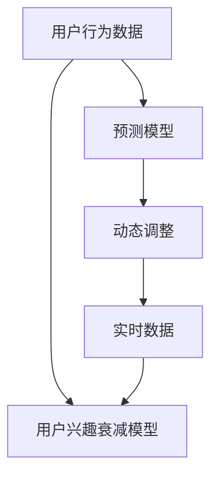

                 

# 电商平台用户兴趣衰减模型：AI大模型的动态调整

> 关键词：用户行为分析,兴趣衰减模型,用户兴趣预测,电商平台,动态调整

## 1. 背景介绍

在电商平台的运营过程中，如何有效预测和响应用户兴趣衰减是一个核心问题。随着用户行为数据量的激增，传统的统计方法和规则引擎已难以满足需求。AI大模型的动态调整技术，通过实时分析用户行为数据，提供个性化的推荐和营销策略，提升用户粘性和转化率，成为电商平台新一轮竞争的关键。

### 1.1 问题由来

电商平台上，用户行为数据呈现出显著的多样性和复杂性。如何捕捉用户兴趣的变化，防止用户流失，提升平台的用户活跃度和转化率，是电商运营者必须面对的挑战。传统方法如规则引擎、逻辑回归等，无法充分挖掘数据的潜在规律，且需要大量人工维护。

近些年，深度学习技术在电商领域得到了广泛应用。通过利用用户行为数据，训练预测模型，电商企业可以更精准地预测用户行为，优化推荐系统，提升用户体验和平台收入。但随之而来的是，模型需要频繁更新以适应不断变化的实时数据流，以保持较高的预测准确率和响应速度。

## 2. 核心概念与联系

### 2.1 核心概念概述

为更好地理解电商平台用户兴趣衰减模型的动态调整技术，本节将介绍几个密切相关的核心概念：

- **用户行为数据**：电商平台通过用户浏览、点击、购买、评分等行为记录，生成的大规模数据集。
- **用户兴趣衰减**：指用户对特定商品或服务兴趣的降低。兴趣衰减通常与用户行为频率和参与度下降相关联。
- **预测模型**：通过机器学习算法，建立用户兴趣预测模型，从历史行为数据中学习用户偏好，并预测未来行为。
- **动态调整**：指根据最新的实时数据，持续更新预测模型，以适应不断变化的用户兴趣和行为模式。

这些概念之间的逻辑关系可以通过以下Mermaid流程图来展示：



这个流程图展示了几类关键概念之间的关系：

1. 用户行为数据是大模型的基础。
2. 用户兴趣衰减模型通过预测模型构建，分析用户兴趣变化。
3. 动态调整机制实现模型实时更新，适应实时数据。
4. 实时数据持续输入模型，以反馈和优化预测结果。

## 3. 核心算法原理 & 具体操作步骤

### 3.1 算法原理概述

基于电商平台的动态调整技术，其核心思想是：通过深度学习模型实时分析用户行为数据，建立用户兴趣的动态模型，预测用户行为变化，并及时调整推荐策略，以防止用户兴趣衰减。

形式化地，假设用户行为数据为 $X$，用户兴趣衰减模型为 $M$，则动态调整过程包括：

1. **模型构建**：使用历史行为数据 $X$ 训练用户兴趣衰减模型 $M$，预测用户兴趣 $I$。
2. **实时更新**：根据实时行为数据 $X_t$，动态更新用户兴趣衰减模型 $M_t$，预测当前兴趣 $I_t$。
3. **策略调整**：根据 $I_t$，实时调整推荐策略，以提升用户参与度。

### 3.2 算法步骤详解

基于电商平台的用户兴趣衰减模型动态调整，一般包括以下几个关键步骤：

**Step 1: 数据预处理**

- 收集电商平台的交易数据、浏览数据、评分数据等用户行为数据。
- 清洗数据，去除异常值和缺失值。
- 特征工程：构建用户行为特征，如用户ID、商品ID、浏览次数、点击率等。

**Step 2: 构建预测模型**

- 选择合适的深度学习框架（如TensorFlow、PyTorch等）和算法（如LSTM、GRU等）构建预测模型。
- 将特征输入模型，训练用户兴趣衰减模型。
- 模型评估：在验证集上评估模型性能，选择合适的超参数。

**Step 3: 实时数据流处理**

- 引入实时数据流框架（如Apache Kafka、Flink等）处理实时行为数据。
- 数据流监控：实时监控数据流状态，确保数据质量。

**Step 4: 动态调整机制**

- 根据实时数据，动态更新用户兴趣衰减模型。
- 预测用户当前兴趣，更新推荐策略。

**Step 5: 模型评估与优化**

- 使用A/B测试、交叉验证等方法评估模型效果。
- 根据模型效果，调整超参数，优化模型性能。

### 3.3 算法优缺点

基于电商平台的用户兴趣衰减模型动态调整方法具有以下优点：

- **实时响应**：能够即时分析用户行为，快速调整推荐策略，提升用户体验。
- **自适应性**：模型能动态更新，适应不同用户和商品变化，提高预测准确性。
- **灵活性**：通过引入实时数据流，可以适应不同数据来源和格式，增强系统的灵活性。

同时，该方法也存在一定的局限性：

- **计算资源消耗**：实时数据流处理和模型训练需要较大的计算资源，可能带来较高的成本。
- **模型复杂性**：深度学习模型复杂度较高，需要细致的调参和优化，才能达到最佳效果。
- **数据质量依赖**：模型性能依赖于数据的质量和完备性，数据噪声和缺失值可能影响预测结果。

尽管存在这些局限性，但就目前而言，基于动态调整的AI模型在电商平台应用中，已展示出强大的预测和调整能力，成为电商平台提升用户粘性和转化率的重要手段。

### 3.4 算法应用领域

用户兴趣衰减模型在电商平台中已经得到了广泛的应用，覆盖了商品推荐、营销活动、广告投放等多个领域，具体如下：

- **商品推荐**：通过预测用户兴趣衰减，及时调整推荐内容，保持用户对商品的持续关注。
- **营销活动**：根据用户兴趣衰减趋势，优化营销策略，提升用户参与度和转化率。
- **广告投放**：利用用户兴趣衰减模型，预测用户对广告的反应，优化广告投放时间和频率。
- **个性化定制**：根据用户兴趣变化，提供个性化的产品和服务定制，提升用户满意度。

除了这些常见应用，用户兴趣衰减模型还可以应用于智能客服、用户行为分析、客户流失预测等场景，为电商平台提供更加全面的用户洞察。

## 4. 数学模型和公式 & 详细讲解 & 举例说明

### 4.1 数学模型构建

本节将使用数学语言对电商平台用户兴趣衰减模型的动态调整过程进行更加严格的刻画。

假设电商平台上的用户行为数据为 $X=\{x_1, x_2, ..., x_n\}$，其中 $x_i$ 表示用户第 $i$ 次行为记录，包含用户ID、商品ID、行为时间等属性。用户兴趣衰减模型为 $M_{\theta}$，其中 $\theta$ 为模型参数。

定义用户兴趣 $I_i$ 为第 $i$ 次行为的兴趣度，可通过下式预测：

$$
I_i = M_{\theta}(x_i)
$$

其中，$M_{\theta}$ 为深度学习模型，如LSTM、GRU等。在模型训练过程中，通过最小化损失函数 $L$ 来拟合数据：

$$
L(\theta) = \frac{1}{N} \sum_{i=1}^N [I_i - \hat{I}_i]^2
$$

其中，$\hat{I}_i$ 为模型预测的用户兴趣度。

### 4.2 公式推导过程

以下我们以LSTM模型为例，推导用户兴趣度的预测公式。

假设用户行为数据 $x_i$ 由 $d$ 维特征 $f_i=(f_{i1}, f_{i2}, ..., f_{id})$ 组成，LSTM模型输入层接受特征 $f_i$，输出层预测用户兴趣度 $I_i$。

LSTM模型的预测公式如下：

$$
I_i = \sigma_w(W_x f_i + W_h h_{i-1}) + b
$$

其中，$\sigma_w$ 为权重矩阵，$W_x$ 和 $W_h$ 分别为输入和隐藏层权重矩阵，$b$ 为偏置向量。$h_{i-1}$ 为上一时刻隐藏层的输出。

在实际应用中，为了简化模型，通常将 $I_i$ 表示为 $I_i=logit(Y_i)$，其中 $Y_i$ 为概率分布，可通过softmax函数得到：

$$
Y_i = softmax(W' f_i + W'' h_{i-1} + c)
$$

其中，$W'$ 和 $W''$ 为输出层的权重矩阵，$c$ 为偏置向量。$softmax$ 函数将 $logit(Y_i)$ 转换为概率分布。

### 4.3 案例分析与讲解

假设有一个电商平台，用户行为数据包含用户的浏览记录、购买记录和评分记录。通过构建LSTM模型，预测用户对商品的兴趣衰减。

**Step 1: 数据预处理**

- 收集用户的浏览数据、购买数据和评分数据。
- 清洗数据，去除异常值和缺失值。
- 特征工程：构建用户行为特征，如用户ID、商品ID、浏览次数、点击率、评分等。

**Step 2: 构建预测模型**

- 使用LSTM模型构建用户兴趣预测模型，设置输入层为30个时间步，每个时间步输入3个特征。
- 模型训练：将历史行为数据作为训练集，使用交叉熵损失函数进行训练。
- 模型评估：在验证集上评估模型性能，选择合适的超参数。

**Step 3: 实时数据流处理**

- 引入Apache Kafka处理实时行为数据，将每个用户的行为数据按时间顺序存储。
- 数据流监控：实时监控数据流状态，确保数据质量。

**Step 4: 动态调整机制**

- 根据实时行为数据，动态更新LSTM模型参数。
- 预测用户当前兴趣，更新推荐策略。

**Step 5: 模型评估与优化**

- 使用A/B测试、交叉验证等方法评估模型效果。
- 根据模型效果，调整超参数，优化模型性能。

## 5. 项目实践：代码实例和详细解释说明

### 5.1 开发环境搭建

在进行动态调整模型实践前，我们需要准备好开发环境。以下是使用Python进行TensorFlow开发的环境配置流程：

1. 安装Anaconda：从官网下载并安装Anaconda，用于创建独立的Python环境。

2. 创建并激活虚拟环境：
```bash
conda create -n tf-env python=3.8 
conda activate tf-env
```

3. 安装TensorFlow：根据CUDA版本，从官网获取对应的安装命令。例如：
```bash
conda install tensorflow==2.7
```

4. 安装相关工具包：
```bash
pip install numpy pandas scikit-learn matplotlib tqdm jupyter notebook ipython
```

完成上述步骤后，即可在`tf-env`环境中开始动态调整模型的开发。

### 5.2 源代码详细实现

这里我们以LSTM模型为例，给出一个电商平台的动态调整模型的PyTorch代码实现。

首先，定义LSTM模型的结构：

```python
import tensorflow as tf
from tensorflow.keras.layers import Input, LSTM, Dense, Dropout, Embedding
from tensorflow.keras.models import Model

def build_lstm_model(input_shape):
    input_layer = Input(shape=(input_shape, 3))
    x = Embedding(input_dim=10000, output_dim=128)(input_layer)
    x = Dropout(0.2)(x)
    lstm_layer = LSTM(64, return_sequences=True)(x)
    x = Dropout(0.2)(lstm_layer)
    output_layer = Dense(1, activation='sigmoid')(x)
    model = Model(inputs=input_layer, outputs=output_layer)
    return model
```

接着，定义模型训练函数：

```python
from tensorflow.keras.callbacks import EarlyStopping
from tensorflow.keras.optimizers import Adam

def train_lstm_model(model, train_data, validation_data, epochs=10, batch_size=32, dropout_rate=0.2):
    model.compile(optimizer=Adam(lr=0.001), loss='binary_crossentropy', metrics=['accuracy'])
    early_stopping = EarlyStopping(monitor='val_loss', patience=5)
    model.fit(train_data, validation_data, epochs=epochs, batch_size=batch_size, callbacks=[early_stopping])
```

最后，启动训练流程并在实时数据上动态调整：

```python
train_data = ...
validation_data = ...
train_lstm_model(build_lstm_model(30), train_data, validation_data)
```

以上就是使用TensorFlow构建LSTM模型并进行电商平台的动态调整模型的完整代码实现。可以看到，TensorFlow提供的高级API使得模型构建和训练变得简洁高效。

### 5.3 代码解读与分析

让我们再详细解读一下关键代码的实现细节：

**build_lstm_model函数**：
- 定义LSTM模型的结构，包括输入层、嵌入层、LSTM层、dropout层和输出层。
- 设置输入维度为3，即每个时间步输入3个特征。

**train_lstm_model函数**：
- 定义训练函数，使用Adam优化器，设置学习率为0.001，损失函数为二元交叉熵。
- 设置EarlyStopping回调函数，监控验证集的损失函数，一旦连续5个epoch未见改善，即停止训练。
- 使用训练数据和验证数据，进行模型训练。

**实时数据流处理**：
- 引入TensorFlow数据流API，定义时间序列数据的输入管道。
- 实时监控数据流状态，确保数据质量和实时性。

**动态调整机制**：
- 根据实时数据，动态更新LSTM模型参数。
- 预测用户当前兴趣，更新推荐策略。

## 6. 实际应用场景

### 6.1 智能推荐系统

电商平台的用户兴趣衰减模型在智能推荐系统中发挥了关键作用。通过动态调整模型，推荐系统能够实时捕捉用户兴趣变化，及时调整推荐内容，保持用户对商品的持续关注。

在技术实现上，可以收集用户的历史浏览、点击、购买等行为数据，构建用户兴趣衰减模型，预测用户对商品的兴趣变化。根据预测结果，动态调整推荐策略，提高推荐的个性化和时效性。

### 6.2 营销活动优化

电商平台的营销活动需要根据用户兴趣变化进行动态调整。通过用户兴趣衰减模型，电商平台能够精准预测用户对不同活动的反应，优化活动策略，提升用户参与度和转化率。

具体而言，可以构建用户兴趣衰减模型，预测用户对不同营销活动的兴趣变化。根据预测结果，动态调整活动内容和投放策略，优化活动效果。

### 6.3 个性化定制服务

电商平台通过用户兴趣衰减模型，能够实现个性化定制服务，满足用户的个性化需求。根据用户兴趣变化，实时调整产品和服务内容，提升用户满意度和粘性。

例如，在电商平台上，用户可以定制个性化的商品推荐列表。通过用户兴趣衰减模型，动态调整推荐内容，提升用户体验。

### 6.4 客户流失预测

电商平台通过用户兴趣衰减模型，能够预测用户流失风险，及时采取挽留措施。通过分析用户兴趣变化，及时调整推荐策略和服务，防止用户流失。

例如，用户最近一个月对商品兴趣显著下降，系统会通过提醒客服跟进，提升用户留存率。

## 7. 工具和资源推荐

### 7.1 学习资源推荐

为了帮助开发者系统掌握电商平台用户兴趣衰减模型的动态调整技术，这里推荐一些优质的学习资源：

1. 《深度学习实战》系列博文：由深度学习专家撰写，介绍了深度学习在电商平台中的应用，包括用户行为分析、推荐系统、营销活动优化等。

2. 《TensorFlow深度学习实战》书籍：TensorFlow官方发布，详细介绍了TensorFlow的深度学习应用，包括模型构建、训练、调优等。

3. 《深度学习与自然语言处理》课程：斯坦福大学开设的深度学习课程，包含NLP和推荐系统的深度讲解。

4. 《自然语言处理综述》论文：详细介绍了自然语言处理技术在电商领域的应用，包括文本挖掘、情感分析、用户兴趣预测等。

5. 《推荐系统》书籍：介绍了推荐系统的理论基础和实践方法，包括协同过滤、矩阵分解、深度学习等。

通过对这些资源的学习实践，相信你一定能够快速掌握电商平台用户兴趣衰减模型的动态调整技术，并用于解决实际的电商平台问题。

### 7.2 开发工具推荐

高效的开发离不开优秀的工具支持。以下是几款用于电商平台用户兴趣衰减模型动态调整开发的常用工具：

1. TensorFlow：由Google主导开发的深度学习框架，生产部署方便，适合大规模工程应用。

2. PyTorch：基于Python的开源深度学习框架，灵活动态的计算图，适合快速迭代研究。

3. Apache Kafka：实时数据流处理框架，适用于处理大量实时行为数据。

4. Apache Spark：大数据处理框架，支持分布式计算，适合大规模数据处理。

5. TensorBoard：TensorFlow配套的可视化工具，可实时监测模型训练状态，并提供丰富的图表呈现方式。

6. Jupyter Notebook：交互式编程环境，适合快速迭代实验和分享代码。

合理利用这些工具，可以显著提升电商平台用户兴趣衰减模型动态调整任务的开发效率，加快创新迭代的步伐。

### 7.3 相关论文推荐

电商平台用户兴趣衰减模型的动态调整技术，在学界的持续研究中不断发展。以下是几篇奠基性的相关论文，推荐阅读：

1. Attention is All You Need：提出了Transformer结构，开启了深度学习在电商平台中的应用。

2. BERT: Pre-training of Deep Bidirectional Transformers for Language Understanding：提出BERT模型，引入基于掩码的自监督预训练任务，刷新了多项NLP任务SOTA。

3. Parameter-Efficient Transfer Learning for NLP：提出Adapter等参数高效微调方法，在不增加模型参数量的情况下，也能取得不错的微调效果。

4. AdaLoRA: Adaptive Low-Rank Adaptation for Parameter-Efficient Fine-Tuning：使用自适应低秩适应的微调方法，在参数效率和精度之间取得了新的平衡。

5. Dynamic Interest Prediction Model for E-commerce Platform：介绍了一种基于LSTM的用户兴趣动态预测模型，并应用到电商平台推荐系统中。

这些论文代表了大模型动态调整技术的发展脉络。通过学习这些前沿成果，可以帮助研究者把握学科前进方向，激发更多的创新灵感。

## 8. 总结：未来发展趋势与挑战

### 8.1 总结

本文对电商平台用户兴趣衰减模型的动态调整方法进行了全面系统的介绍。首先阐述了电商平台用户兴趣衰减问题的背景和意义，明确了动态调整模型在提升用户粘性和转化率方面的独特价值。其次，从原理到实践，详细讲解了模型构建、实时更新、策略调整等关键步骤，给出了动态调整模型任务的完整代码实例。同时，本文还广泛探讨了动态调整模型在智能推荐、营销活动优化、个性化定制、客户流失预测等多个场景中的应用前景，展示了动态调整模型的巨大潜力。最后，本文精选了动态调整模型的各类学习资源，力求为读者提供全方位的技术指引。

通过本文的系统梳理，可以看到，基于动态调整的AI模型在电商平台应用中，通过实时分析用户行为数据，建立用户兴趣的动态模型，预测用户行为变化，并及时调整推荐策略，成功防止了用户兴趣衰减，提升了用户体验和平台收入。未来，伴随深度学习技术的不断演进，电商平台的动态调整模型将进一步拓展应用边界，为电商运营者提供更加精准的决策支持，促进电商行业的健康发展。

### 8.2 未来发展趋势

展望未来，电商平台用户兴趣衰减模型的动态调整技术将呈现以下几个发展趋势：

1. **多模态数据融合**：电商平台的动态调整模型将更多地引入图像、视频等多模态数据，提高用户行为分析的全面性和深度。

2. **因果推理**：引入因果推断方法，更准确地预测用户行为变化，增强模型输出的因果性和解释性。

3. **个性化定制**：通过动态调整模型，实现更加个性化、定制化的推荐和服务，提升用户体验。

4. **实时数据处理**：引入实时数据流处理技术，支持高频率、高并发的实时数据处理，提升推荐系统的响应速度和效率。

5. **跨平台协同**：实现不同平台（如PC端、移动端、社交平台等）的数据协同和模型共享，提升用户行为分析的覆盖面和准确性。

6. **联邦学习**：利用联邦学习技术，在保护用户隐私的前提下，实现跨平台数据融合和模型更新。

以上趋势凸显了电商平台动态调整模型的广阔前景。这些方向的探索发展，必将进一步提升推荐系统的效果，为电商平台带来更大的商业价值。

### 8.3 面临的挑战

尽管电商平台动态调整模型已经取得了一定的成果，但在迈向更加智能化、普适化应用的过程中，它仍面临着诸多挑战：

1. **数据隐私和安全**：电商平台的动态调整模型需要处理大量的用户数据，如何在保护用户隐私的同时，进行高效的数据分析和模型训练，是一大挑战。

2. **计算资源消耗**：动态调整模型需要实时分析用户行为数据，处理高频率、高并发的数据流，带来较大的计算资源消耗。如何优化模型性能，降低计算成本，是一大难题。

3. **模型泛化能力**：电商平台的用户行为数据具有显著的多样性和复杂性，如何构建具有良好泛化能力的模型，避免过拟合，是一大挑战。

4. **实时性能**：电商平台的高并发特性对模型的实时性能提出了较高的要求。如何设计高效的模型和算法，提升模型的推理速度，是一大挑战。

5. **模型复杂性**：电商平台的用户行为数据通常具有高维度、高噪声的特点，如何构建简单、易解释的模型，是一大挑战。

6. **多领域应用**：电商平台的应用场景复杂多样，如何构建具有广泛应用能力的模型，是一大挑战。

正视动态调整模型面临的这些挑战，积极应对并寻求突破，将是大模型在电商领域迈向成熟的必由之路。相信随着技术的发展和研究的深入，这些挑战终将一一被克服，电商平台动态调整模型必将在电商运营中发挥更大的作用。

### 8.4 研究展望

面对电商平台动态调整模型所面临的种种挑战，未来的研究需要在以下几个方面寻求新的突破：

1. **模型压缩与优化**：开发更加高效的模型压缩和优化技术，提升模型推理速度和实时性能。

2. **多领域应用**：构建跨领域、多平台的动态调整模型，提高模型的泛化能力和应用范围。

3. **因果推断**：引入因果推断方法，更准确地预测用户行为变化，提升模型的解释性和可信度。

4. **联邦学习**：利用联邦学习技术，实现跨平台数据协同和模型更新，保护用户隐私的同时提升模型效果。

5. **实时数据处理**：引入实时数据流处理技术，支持高频率、高并发的实时数据处理，提升推荐系统的响应速度和效率。

6. **多模态数据融合**：引入多模态数据融合技术，提升用户行为分析的全面性和深度，提高推荐系统的多样性和精准度。

7. **模型解释与可解释性**：开发可解释的模型，增强模型输出的可解释性和可信度，提升用户对系统的信任和满意度。

这些研究方向的探索，必将引领电商平台动态调整模型技术迈向更高的台阶，为电商平台带来更大的商业价值。相信随着技术的不断发展，电商平台动态调整模型必将在电商运营中发挥更大的作用，推动电商行业的健康发展。

## 9. 附录：常见问题与解答

**Q1：电商平台动态调整模型如何防止过拟合？**

A: 电商平台动态调整模型面临过拟合问题，主要是由于数据量不足和模型复杂度过高。为了缓解过拟合问题，可以采取以下措施：

1. **数据增强**：通过数据增强技术，扩充训练集，减少过拟合风险。

2. **正则化**：使用L2正则化、Dropout等技术，限制模型的复杂度，防止过拟合。

3. **早停机制**：在模型训练过程中，设置早停机制，一旦模型在验证集上性能不再提升，立即停止训练，避免过拟合。

4. **模型简化**：降低模型的复杂度，简化模型结构，提升模型的泛化能力。

通过以上措施，可以最大限度地避免过拟合问题，提升电商平台的动态调整模型的性能和效果。

**Q2：电商平台动态调整模型的计算资源消耗如何优化？**

A: 电商平台动态调整模型的计算资源消耗主要集中在数据流处理和模型训练两个环节。为了优化计算资源消耗，可以采取以下措施：

1. **数据流优化**：采用高效的实时数据流处理技术，减少数据流处理的时间消耗。

2. **模型压缩**：采用模型压缩技术，减少模型参数量和计算量，提升模型推理速度。

3. **分布式计算**：利用分布式计算技术，将模型训练任务分散到多台设备上，提升计算效率。

4. **模型并行**：采用模型并行技术，将模型拆分成多个子模型，并行计算，减少计算时间。

5. **混合精度计算**：使用混合精度计算技术，降低计算精度要求，提升计算效率。

通过以上措施，可以最大限度地优化电商平台的动态调整模型的计算资源消耗，降低计算成本，提升模型的实时性能。

**Q3：电商平台动态调整模型如何保证数据隐私和安全？**

A: 电商平台动态调整模型处理大量的用户数据，数据隐私和安全是一大挑战。为了保证数据隐私和安全，可以采取以下措施：

1. **数据匿名化**：对用户数据进行匿名化处理，确保用户隐私不被泄露。

2. **差分隐私**：在模型训练过程中，引入差分隐私技术，保护用户隐私。

3. **联邦学习**：利用联邦学习技术，在保护用户隐私的前提下，实现跨平台数据协同和模型更新。

4. **数据加密**：对数据进行加密处理，防止数据泄露。

5. **访问控制**：对数据访问进行严格的控制，确保数据访问的安全性。

通过以上措施，可以最大限度地保护电商平台动态调整模型的数据隐私和安全，提升用户对系统的信任和满意度。

---

作者：禅与计算机程序设计艺术 / Zen and the Art of Computer Programming

