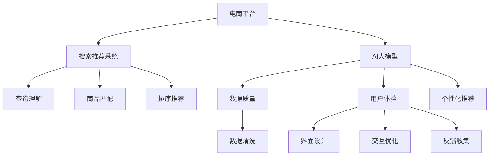

                 

# 电商平台的AI 大模型实践：搜索推荐系统是核心，数据质量是关键，用户体验是重点

> 关键词：电商、AI、大模型、搜索推荐、数据质量、用户体验

## 1. 背景介绍

在数字化时代的浪潮中，电商平台逐渐成为人们获取商品和服务的主要渠道之一。随着消费者需求日益个性化和多样化，电商平台需要不断提升自身的智能化水平，以更好地满足用户需求。在这个过程中，人工智能大模型（AI Large Model），尤其是搜索引擎和推荐系统中的大模型，扮演着越来越重要的角色。本文将深入探讨电商平台的AI大模型实践，重点分析搜索推荐系统的作用，以及数据质量和用户体验的重要性和关键点。

## 2. 核心概念与联系

### 2.1 核心概念概述

为更好地理解电商平台的AI大模型实践，本节将介绍几个密切相关的核心概念：

- **电商平台的AI大模型**：以深度学习模型为代表，尤其是基于自回归或自编码结构的模型，在电商平台中被广泛应用，用于搜索、推荐、广告推荐等多个环节。这些模型通过大规模数据训练，学习到丰富的商品和用户信息，具备强大的商品理解能力和推荐能力。

- **搜索推荐系统**：电商平台的核心功能之一，旨在根据用户查询和历史行为，为用户推荐最适合的商品，并快速匹配商品信息。搜索推荐系统通常由查询理解、商品匹配、排序推荐等多个子系统组成，是电商平台智能化水平的重要体现。

- **数据质量**：电商平台的数据包括用户行为数据、商品属性数据、交易数据等，数据的质量直接影响到搜索推荐系统的效果。高质量的数据应具备完整性、准确性、一致性、及时性等特点。

- **用户体验**：用户体验是电商平台的生命线。提升用户体验不仅包括提升商品质量和推荐效果，还包括改善搜索体验、优化交易流程等多个方面。

- **个性化推荐**：根据用户的历史行为和偏好，为用户推荐个性化商品，提升用户体验和满意度。个性化推荐系统通常基于用户画像、商品特征等数据进行建模和优化。

这些核心概念之间的逻辑关系可以通过以下Mermaid流程图来展示：



这个流程图展示了几者之间的关系：

1. 电商平台的AI大模型是平台智能化的基础，用于支持搜索推荐系统的各个子系统。
2. 数据质量是确保搜索推荐系统准确性的关键因素，直接影响用户体验。
3. 用户体验是电商平台的根本目标，需要通过搜索推荐系统的优化来实现。
4. 个性化推荐是提升用户体验的重要手段，通过精准匹配商品，提高用户满意度和平台黏性。

## 3. 核心算法原理 & 具体操作步骤
### 3.1 算法原理概述

电商平台的搜索推荐系统通常基于深度学习算法，尤其是基于神经网络的模型。其核心思想是：利用用户的历史行为数据和商品属性信息，学习到商品和用户之间的关联关系，进而为每个用户推荐最适合的商品。

形式化地，假设电商平台中有 $N$ 个用户，$M$ 个商品，每个用户 $u$ 在 $t$ 时刻的行为可以表示为 $X_u(t)$，商品 $i$ 的属性可以表示为 $F_i$，则搜索推荐系统的目标是最小化每个用户 $u$ 在 $t$ 时刻的行为与推荐商品 $i$ 之间的误差，即：

$$
\min_{\theta} \sum_{u=1}^N \sum_{t=1}^T \|X_u(t) - \alpha^T(\beta F_i + \gamma) \|^2
$$

其中 $\theta = (\alpha, \beta, \gamma)$ 为模型的参数，$\alpha$ 为用户的表示向量，$\beta$ 为商品的表示向量，$\gamma$ 为模型的偏差项。通过最小化上述误差，模型学习到用户和商品之间的关联关系，从而能够为用户推荐合适的商品。

### 3.2 算法步骤详解

电商平台的搜索推荐系统一般包括以下几个关键步骤：

**Step 1: 数据收集与预处理**
- 收集电商平台的用户行为数据、商品属性数据、交易数据等，构建数据集 $D$。
- 对数据进行清洗、去重、归一化等预处理操作，确保数据的质量和一致性。

**Step 2: 模型训练与优化**
- 选择合适的深度学习模型（如DNN、RNN、Transformer等），使用数据集 $D$ 进行模型训练。
- 设置合适的学习率、正则化参数、迭代轮数等超参数，优化模型的性能。

**Step 3: 模型评估与部署**
- 使用独立的验证集对训练好的模型进行评估，计算推荐效果指标（如准确率、召回率、F1分数等）。
- 将模型部署到电商平台的推荐系统中，进行实时推荐。
- 持续收集用户反馈，对模型进行迭代优化，提升推荐效果。

### 3.3 算法优缺点

电商平台的搜索推荐系统具有以下优点：
1. 提升推荐效果。利用深度学习模型，可以从多维度的数据中学习到商品和用户之间的复杂关系，提升推荐的准确性和多样性。
2. 自动化程度高。推荐系统可以自动处理大量数据，生成个性化推荐，减少人工干预。
3. 灵活性高。推荐系统可以根据不同的用户和商品特征，灵活调整推荐策略，满足多样化的需求。

同时，该方法也存在一些局限性：
1. 依赖标注数据。构建高质量的数据集需要大量标注工作，成本较高。
2. 存在冷启动问题。对于新用户和新商品，推荐系统往往无法生成准确的推荐。
3. 数据隐私问题。用户的个性化数据和行为数据需要妥善处理，避免数据泄露。
4. 系统复杂度高。推荐系统通常由多个子系统组成，系统设计复杂，维护成本高。

尽管存在这些局限性，但就目前而言，基于深度学习的推荐系统是电商平台推荐业务的重要技术手段。未来相关研究的重点在于如何进一步降低对标注数据的依赖，提高系统的推荐精度和效率，同时兼顾数据隐私和系统安全性等因素。

### 3.4 算法应用领域

基于深度学习的搜索推荐系统在电商平台的多个领域得到广泛应用，例如：

- 商品推荐：根据用户的历史行为和商品属性，为用户推荐可能感兴趣的商品。
- 广告推荐：将商品信息精准推送给潜在用户，提高广告转化率。
- 智能客服：利用NLP技术，自动解答用户的问题，提升客户满意度。
- 库存管理：预测商品销量，优化库存配置，提高供应链效率。
- 个性化定价：根据用户行为数据，动态调整商品价格，提升销售额。

除了上述这些经典应用外，搜索推荐系统还被创新性地应用到更多场景中，如用户画像构建、交易风险控制、用户流失预警等，为电商平台带来了全新的突破。随着深度学习模型和推荐技术的不断进步，相信电商平台推荐业务必将得到更大规模的落地应用，实现个性化、智能化、高效率的推荐体验。

## 4. 数学模型和公式 & 详细讲解 & 举例说明

### 4.1 数学模型构建

本节将使用数学语言对电商平台的搜索推荐系统进行更加严格的刻画。

假设电商平台的推荐系统由用户表示模型 $u$ 和商品表示模型 $i$ 组成，其中 $u$ 为用户的表示向量，$i$ 为商品的表示向量。假设用户 $u$ 在 $t$ 时刻的行为为 $X_u(t)$，则搜索推荐系统的目标是最小化每个用户 $u$ 在 $t$ 时刻的行为与推荐商品 $i$ 之间的误差，即：

$$
\min_{\theta} \sum_{u=1}^N \sum_{t=1}^T \|X_u(t) - \alpha^T(\beta F_i + \gamma) \|^2
$$

其中 $\theta = (\alpha, \beta, \gamma)$ 为模型的参数，$\alpha$ 为用户的表示向量，$\beta$ 为商品的表示向量，$\gamma$ 为模型的偏差项。

### 4.2 公式推导过程

以下我们以商品推荐任务为例，推导基于深度学习的推荐模型的训练公式。

假设模型 $M_{\theta}$ 在输入 $X_u(t)$ 上的输出为 $\hat{y}=M_{\theta}(X_u(t))$，则商品推荐的损失函数为：

$$
\ell(M_{\theta}(X_u(t)),y) = \|X_u(t) - \alpha^T(\beta F_i + \gamma) \|^2
$$

将其代入经验风险公式，得：

$$
\mathcal{L}(\theta) = -\frac{1}{N}\sum_{u=1}^N \sum_{t=1}^T \ell(M_{\theta}(X_u(t)),y)
$$

根据链式法则，损失函数对参数 $\theta$ 的梯度为：

$$
\frac{\partial \mathcal{L}(\theta)}{\partial \theta} = -\frac{1}{N}\sum_{u=1}^N \sum_{t=1}^T \nabla_{\theta}\ell(M_{\theta}(X_u(t)),y)
$$

其中 $\nabla_{\theta}\ell(M_{\theta}(X_u(t)),y)$ 为损失函数对模型参数的梯度，可通过反向传播算法高效计算。

### 4.3 案例分析与讲解

假设我们使用DNN模型来构建电商平台推荐系统。设 $X_u(t)$ 为 $t$ 时刻用户 $u$ 的向量表示，$F_i$ 为商品 $i$ 的向量表示，则DNN模型可以表示为：

$$
\hat{y} = M_{\theta}(X_u(t)) = \sigma(\alpha^T(\beta F_i + \gamma))
$$

其中 $\sigma$ 为激活函数，$\alpha$ 为权重矩阵，$\beta$ 为偏置向量，$\gamma$ 为模型的偏差项。

对于商品推荐任务，我们希望用户 $u$ 在 $t$ 时刻的行为与推荐商品 $i$ 之间最小化误差。假设 $y$ 为推荐商品 $i$ 的编号，则推荐系统的训练目标为：

$$
\min_{\theta} \sum_{u=1}^N \sum_{t=1}^T \|X_u(t) - \alpha^T(\beta F_i + \gamma) \|^2
$$

使用反向传播算法，我们通过求导数 $\frac{\partial \mathcal{L}(\theta)}{\partial \theta}$ 来更新模型参数 $\theta$，不断迭代优化，直到损失函数达到最小。

## 5. 项目实践：代码实例和详细解释说明
### 5.1 开发环境搭建

在进行电商平台的搜索推荐系统开发前，我们需要准备好开发环境。以下是使用Python进行TensorFlow开发的环境配置流程：

1. 安装Anaconda：从官网下载并安装Anaconda，用于创建独立的Python环境。

2. 创建并激活虚拟环境：
```bash
conda create -n tf-env python=3.8 
conda activate tf-env
```

3. 安装TensorFlow：根据CUDA版本，从官网获取对应的安装命令。例如：
```bash
conda install tensorflow=2.5 
```

4. 安装Keras：
```bash
pip install keras
```

5. 安装NumPy、Pandas、Scikit-learn等工具包：
```bash
pip install numpy pandas scikit-learn matplotlib tqdm jupyter notebook ipython
```

完成上述步骤后，即可在`tf-env`环境中开始推荐系统的开发。

### 5.2 源代码详细实现

这里我们以基于DNN的商品推荐系统为例，给出使用TensorFlow进行推荐系统开发的PyTorch代码实现。

首先，定义商品推荐的数据处理函数：

```python
import numpy as np
import tensorflow as tf
from tensorflow.keras.layers import Dense, Dropout, Activation
from tensorflow.keras.models import Sequential

def get_datasets(train_data, train_labels, test_data, test_labels):
    train_dataset = tf.data.Dataset.from_tensor_slices((train_data, train_labels))
    train_dataset = train_dataset.shuffle(1000).batch(32)
    
    test_dataset = tf.data.Dataset.from_tensor_slices((test_data, test_labels))
    test_dataset = test_dataset.batch(32)
    
    return train_dataset, test_dataset
```

然后，定义模型和优化器：

```python
def build_model(input_dim, output_dim):
    model = Sequential()
    model.add(Dense(64, input_dim=input_dim, activation='relu'))
    model.add(Dropout(0.5))
    model.add(Dense(64, activation='relu'))
    model.add(Dropout(0.5))
    model.add(Dense(output_dim, activation='softmax'))
    return model

def compile_model(model):
    optimizer = tf.keras.optimizers.Adam(learning_rate=0.001)
    model.compile(loss='categorical_crossentropy', optimizer=optimizer, metrics=['accuracy'])
```

接着，定义训练和评估函数：

```python
def train_model(model, train_dataset, validation_dataset, epochs=10):
    model.fit(train_dataset, validation_data=validation_dataset, epochs=epochs)
    
def evaluate_model(model, test_dataset):
    test_loss, test_acc = model.evaluate(test_dataset)
    print(f'Test Loss: {test_loss:.4f}')
    print(f'Test Accuracy: {test_acc:.4f}')
```

最后，启动训练流程并在测试集上评估：

```python
train_data = np.random.randn(1000, 64)
train_labels = np.random.randint(0, 10, size=(1000,))
test_data = np.random.randn(200, 64)
test_labels = np.random.randint(0, 10, size=(200,))

train_dataset, test_dataset = get_datasets(train_data, train_labels, test_data, test_labels)

model = build_model(64, 10)
compile_model(model)

train_model(model, train_dataset, validation_dataset=train_dataset, epochs=10)
evaluate_model(model, test_dataset)
```

以上就是使用TensorFlow进行基于DNN的商品推荐系统开发的完整代码实现。可以看到，利用TensorFlow的高级API，模型构建、训练和评估变得非常简单和直观。

### 5.3 代码解读与分析

让我们再详细解读一下关键代码的实现细节：

**get_datasets函数**：
- `from_tensor_slices`方法：将数据和标签转换为张量切片，便于模型训练。
- `shuffle`方法：对训练集进行随机洗牌，增加数据多样性。
- `batch`方法：将数据分为批量进行训练，提高训练效率。

**build_model函数**：
- `Sequential`模型：构建序列模型，按顺序连接多个层。
- `Dense`层：全连接层，用于学习特征。
- `Dropout`层：正则化层，防止过拟合。
- `Activation`激活函数：引入非线性激活函数，增加模型的表达能力。

**compile_model函数**：
- `Adam`优化器：自适应学习率优化器，适用于大多数模型训练。
- `categorical_crossentropy`损失函数：用于多分类问题的损失函数。
- `accuracy`指标：用于评估模型的分类准确率。

**train_model函数**：
- `fit`方法：模型训练，指定训练集和验证集。
- `epochs`参数：训练轮数。

**evaluate_model函数**：
- `evaluate`方法：模型评估，返回测试损失和准确率。

可以看到，TensorFlow提供了非常丰富的API和工具，使得深度学习模型的构建和训练变得非常简单和高效。通过合理利用这些API，可以大大降低开发难度，加速模型迭代和优化。

## 6. 实际应用场景
### 6.1 智能推荐引擎

电商平台的智能推荐引擎是推荐系统的核心。通过深入挖掘用户行为数据和商品特征，推荐系统能够为用户推荐最符合其需求的商品，从而提升用户的购物体验和平台的销售转化率。

智能推荐引擎的构建通常包括以下几个步骤：

1. 数据收集：收集用户的浏览、点击、购买等行为数据，以及商品的属性、销量等特征信息。
2. 特征工程：对原始数据进行清洗、归一化、特征提取等处理，构建数据集。
3. 模型训练：选择合适的深度学习模型（如DNN、RNN、Transformer等），对数据集进行训练，优化模型参数。
4. 模型评估：在独立的验证集上评估模型效果，选择最优模型。
5. 模型部署：将训练好的模型部署到推荐系统中，进行实时推荐。

### 6.2 实时广告推荐

电商平台的实时广告推荐系统，旨在将商品信息精准推送给潜在用户，提高广告的点击率和转化率。推荐系统通常通过分析用户的历史行为数据和实时行为数据，实时计算用户的兴趣和需求，动态生成推荐结果。

实时广告推荐系统的构建通常包括以下几个步骤：

1. 数据收集：收集用户的浏览、点击、购买等行为数据，以及广告的属性、点击率等特征信息。
2. 特征工程：对原始数据进行清洗、归一化、特征提取等处理，构建数据集。
3. 模型训练：选择合适的深度学习模型（如DNN、RNN、Transformer等），对数据集进行训练，优化模型参数。
4. 模型评估：在独立的验证集上评估模型效果，选择最优模型。
5. 模型部署：将训练好的模型部署到广告推荐系统中，进行实时推荐。

### 6.3 智能客服

电商平台的智能客服系统，利用自然语言处理和深度学习技术，自动解答用户的问题，提升客户满意度。智能客服系统的构建通常包括以下几个步骤：

1. 数据收集：收集用户的提问数据，以及对应的回答数据。
2. 特征工程：对原始数据进行清洗、归一化、特征提取等处理，构建数据集。
3. 模型训练：选择合适的深度学习模型（如RNN、Transformer等），对数据集进行训练，优化模型参数。
4. 模型评估：在独立的验证集上评估模型效果，选择最优模型。
5. 模型部署：将训练好的模型部署到智能客服系统中，进行实时问答。

### 6.4 未来应用展望

随着深度学习模型和推荐技术的不断进步，基于搜索推荐系统的电商平台推荐业务必将得到更大规模的落地应用，实现个性化、智能化、高效率的推荐体验。

未来，搜索推荐系统还将拓展到更多领域，如金融理财、医疗健康、娱乐媒体等，为这些领域提供智能化的解决方案。通过智能推荐，提升用户体验，优化资源配置，实现经济社会的高质量发展。

## 7. 工具和资源推荐
### 7.1 学习资源推荐

为了帮助开发者系统掌握电商平台的AI大模型实践，这里推荐一些优质的学习资源：

1. 《TensorFlow深度学习教程》：由Google官方编写，深入浅出地介绍了TensorFlow的基本原理和实践技巧，适合初学者学习。
2. 《Deep Learning for NLP》：斯坦福大学自然语言处理课程，系统讲解了深度学习在NLP中的应用，包括推荐系统等。
3. 《深度学习推荐系统》：深入介绍推荐系统的基本原理和算法，涵盖协同过滤、基于深度学习的推荐方法等。
4. 《TensorFlow实战》：由Google官方编写，提供大量实战案例和代码示例，帮助读者快速上手TensorFlow。
5. 《机器学习实战》：讲解了机器学习的基本概念和实践技巧，涵盖数据预处理、模型训练、模型评估等多个环节。

通过对这些资源的学习实践，相信你一定能够快速掌握电商平台的AI大模型实践技术，并用于解决实际的推荐业务问题。

### 7.2 开发工具推荐

高效的开发离不开优秀的工具支持。以下是几款用于电商平台的AI大模型实践开发的常用工具：

1. TensorFlow：由Google主导开发的开源深度学习框架，生产部署方便，适合大规模工程应用。
2. PyTorch：基于Python的开源深度学习框架，灵活高效，适合快速迭代研究。
3. Scikit-learn：用于数据预处理、特征工程、模型训练等环节的工具库。
4. Pandas：用于数据清洗、数据处理的Python库。
5. Jupyter Notebook：交互式的开发环境，支持代码运行、结果展示等多种功能。

合理利用这些工具，可以显著提升电商平台的AI大模型实践开发效率，加快创新迭代的步伐。

### 7.3 相关论文推荐

电商平台的AI大模型实践源于学界的持续研究。以下是几篇奠基性的相关论文，推荐阅读：

1. "Deep Learning for Recommender Systems"：论文系统介绍了深度学习在推荐系统中的应用，包括DNN、RNN、Transformer等。
2. "A Survey on Transfer Learning in Recommender Systems"：综述了推荐系统中的迁移学习技术，讨论了数据共享和模型迁移的策略。
3. "Adaptive Recommender Systems for Personalized Search"：论文介绍了基于深度学习的个性化搜索推荐系统，提升了用户体验和推荐效果。
4. "Hybrid Deep Learning-Based Recommender System"：探讨了混合深度学习推荐系统，结合了协同过滤和深度学习方法的优点。
5. "Web and Online Social Media Recommendation: From CBR to Deep Learning"：综述了Web和社交媒体推荐系统的最新进展，介绍了深度学习在推荐系统中的应用。

这些论文代表了大模型在推荐系统中的最新研究进展，通过学习这些前沿成果，可以帮助研究者把握学科前进方向，激发更多的创新灵感。

## 8. 总结：未来发展趋势与挑战

### 8.1 研究成果总结

本文对电商平台的AI大模型实践进行了全面系统的介绍。首先阐述了搜索推荐系统的作用，明确了数据质量和用户体验的重要性和关键点。其次，从原理到实践，详细讲解了推荐系统的数学原理和关键步骤，给出了推荐系统开发的完整代码实例。同时，本文还广泛探讨了推荐系统在电商平台的多个应用场景，展示了搜索推荐系统的巨大潜力。

通过本文的系统梳理，可以看到，基于深度学习的推荐系统在电商平台推荐业务中发挥着越来越重要的作用，极大地提升了用户的购物体验和平台的销售转化率。未来，伴随深度学习模型和推荐技术的持续演进，基于搜索推荐系统的电商平台推荐业务必将得到更大规模的落地应用，实现个性化、智能化、高效率的推荐体验。

### 8.2 未来发展趋势

展望未来，电商平台的搜索推荐系统将呈现以下几个发展趋势：

1. 模型规模持续增大。随着算力成本的下降和数据规模的扩张，推荐模型的参数量还将持续增长。超大规模推荐模型蕴含的丰富商品知识，有望支撑更加复杂多变的推荐业务。
2. 推荐效果进一步提升。基于深度学习模型的推荐系统将继续优化，通过引入更多的先验知识、多模态融合等手段，提升推荐的准确性和多样性。
3. 实时性要求更高。实时推荐系统需要处理海量数据，并在毫秒级别内生成推荐结果，未来将引入更多的优化技术，提升系统效率。
4. 个性化推荐更加精准。随着推荐模型的优化，个性化推荐将更加精准，能够根据用户的实时行为动态调整推荐策略，实现更优质的用户体验。
5. 跨平台推荐系统出现。未来的推荐系统将能够跨平台、跨设备、跨应用进行无缝推荐，提升用户的无缝体验。

以上趋势凸显了电商平台的搜索推荐系统的广阔前景。这些方向的探索发展，必将进一步提升推荐系统的性能和应用范围，为电商平台推荐业务带来更多创新和突破。

### 8.3 面临的挑战

尽管电商平台的搜索推荐系统已经取得了显著的成果，但在迈向更加智能化、普适化应用的过程中，它仍面临着诸多挑战：

1. 数据隐私问题。用户的个性化数据和行为数据需要妥善处理，避免数据泄露和滥用。如何在保护用户隐私的前提下，构建高效、安全的推荐系统，将是未来的一大难题。
2. 模型鲁棒性不足。推荐模型面对域外数据时，泛化性能往往大打折扣。对于测试样本的微小扰动，推荐模型的预测也容易发生波动。如何提高推荐模型的鲁棒性，避免灾难性遗忘，还需要更多理论和实践的积累。
3. 系统复杂度高。推荐系统通常由多个子系统组成，系统设计复杂，维护成本高。如何在保证推荐效果的前提下，降低系统复杂度，提升系统可维护性，将是重要的研究方向。
4. 计算资源消耗大。超大规模推荐模型需要大量计算资源，如何优化模型结构，提高推理速度和资源利用率，将是重要的优化方向。
5. 推荐模型可解释性不足。推荐模型往往作为黑盒存在，难以解释其内部工作机制和决策逻辑。如何在保护用户隐私的前提下，提高推荐模型的可解释性，将是未来的重要研究方向。

### 8.4 研究展望

面向未来，电商平台的AI大模型实践需要在以下几个方面寻求新的突破：

1. 探索无监督和半监督推荐方法。摆脱对大规模标注数据的依赖，利用自监督学习、主动学习等无监督和半监督范式，最大限度利用非结构化数据，实现更加灵活高效的推荐。
2. 研究参数高效和计算高效的推荐范式。开发更加参数高效的推荐方法，在固定大部分预训练参数的同时，只更新极少量的任务相关参数。同时优化推荐模型的计算图，减少前向传播和反向传播的资源消耗，实现更加轻量级、实时性的部署。
3. 融合因果和对比学习范式。通过引入因果推断和对比学习思想，增强推荐模型建立稳定因果关系的能力，学习更加普适、鲁棒的商品表征，从而提升推荐泛化性和抗干扰能力。
4. 纳入伦理道德约束。在推荐模型训练目标中引入伦理导向的评估指标，过滤和惩罚有偏见、有害的推荐结果。同时加强人工干预和审核，建立推荐模型的监管机制，确保推荐行为符合人类价值观和伦理道德。
5. 引入更多先验知识。将符号化的先验知识，如知识图谱、逻辑规则等，与神经网络模型进行巧妙融合，引导推荐过程学习更准确、合理的商品表征。同时加强不同模态数据的整合，实现视觉、语音等多模态信息与文本信息的协同建模。

这些研究方向的探索，必将引领电商平台的AI大模型实践技术迈向更高的台阶，为构建安全、可靠、可解释、可控的智能推荐系统铺平道路。面向未来，电商平台的AI大模型实践还需要与其他人工智能技术进行更深入的融合，如知识表示、因果推理、强化学习等，多路径协同发力，共同推动推荐系统的进步。只有勇于创新、敢于突破，才能不断拓展推荐系统的边界，让智能推荐技术更好地造福电商平台的用户。

## 9. 附录：常见问题与解答

**Q1：电商平台的数据质量对推荐系统有哪些影响？**

A: 电商平台的数据质量直接影响推荐系统的效果。高质量的数据应具备完整性、准确性、一致性、及时性等特点。如果数据质量不高，推荐系统容易出现偏差，无法准确匹配用户需求，导致推荐效果下降。因此，电商平台需要对数据进行严格的质量控制，确保数据质量满足推荐系统的要求。

**Q2：如何平衡推荐系统的个性化和通用性？**

A: 推荐系统需要平衡个性化和通用性的关系。个性化推荐能够提升用户体验和满意度，但容易忽略用户的共性需求。通用推荐则能够满足大多数用户的需求，但可能导致个性化推荐效果不足。为了平衡两者，推荐系统通常采用混合推荐策略，将个性化推荐和通用推荐相结合，实现个性化的同时满足大多数用户的需求。

**Q3：推荐系统面临的主要挑战有哪些？**

A: 推荐系统面临的主要挑战包括：数据隐私问题、模型鲁棒性不足、系统复杂度高、计算资源消耗大、推荐模型可解释性不足等。这些问题需要电商平台在数据处理、模型优化、系统设计等方面进行全面优化，才能构建高效、可解释、安全的推荐系统。

**Q4：推荐系统的推荐效果如何评估？**

A: 推荐系统的推荐效果可以通过多种指标进行评估，如准确率、召回率、F1分数、平均绝对误差(MAE)、均方根误差(RMSE)等。通常，使用独立的验证集对推荐系统进行评估，选择最优模型进行部署。

**Q5：推荐系统的未来发展方向有哪些？**

A: 推荐系统的未来发展方向包括：模型规模持续增大、推荐效果进一步提升、实时性要求更高、个性化推荐更加精准、跨平台推荐系统出现等。未来，推荐系统将继续优化，引入更多的先验知识、多模态融合等手段，提升推荐准确性和多样性，实现更优质的用户体验。

作者：禅与计算机程序设计艺术 / Zen and the Art of Computer Programming

