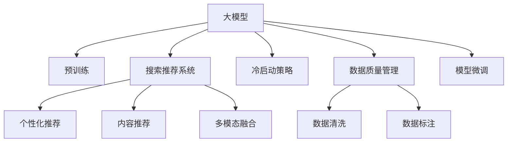

                 

# 电商平台的AI 大模型战略：搜索推荐系统是核心，冷启动策略与数据质量并重

## 1. 背景介绍

### 1.1 问题由来

随着互联网电商的迅猛发展，用户行为数据呈爆炸性增长，构建智能化的推荐系统、搜索系统，以提升用户体验和转化率，成为电商平台的刚需。传统基于规则的推荐系统已难以满足用户的多样化需求，基于深度学习的大模型推荐技术逐渐成为主流。

然而，电商平台的推荐系统面临独特的挑战：

1. **用户多样性**：用户兴趣多元，个性化需求难以捕捉。
2. **数据稀疏性**：新用户数据不足，难以进行个性化推荐。
3. **数据噪声**：用户行为数据存在噪音，需要精细的数据清洗和处理。
4. **快速迭代**：用户兴趣快速变化，推荐系统需要快速更新以适应新的用户行为。
5. **多模态融合**：用户输入方式多样，推荐系统需要支持图像、文本、语音等多模态数据融合。

为应对这些挑战，电商平台的AI大模型战略应运而生，借助大模型构建强大的搜索推荐系统，以算法和技术驱动提升用户购物体验和平台转化率。

### 1.2 问题核心关键点

电商平台大模型战略的核心关键点在于以下几个方面：

- **搜索推荐系统的建设**：通过大模型优化搜索推荐算法，提升个性化推荐的效果和用户体验。
- **冷启动策略的设计**：针对新用户和新商品，设计有效的冷启动策略，快速引入优质商品。
- **数据质量的管理**：保证数据的质量和实时性，提高推荐的准确性。
- **模型微调和优化**：基于用户反馈，对模型进行微调，以保持推荐系统的持续优化。

本文将重点介绍电商平台的AI大模型战略，深入探讨搜索推荐系统、冷启动策略与数据质量管理的核心技术，为电商平台提供切实可行的AI技术方案。

## 2. 核心概念与联系

### 2.1 核心概念概述

为更好地理解电商平台的大模型战略，本节将介绍几个密切相关的核心概念：

- **大模型(大语言模型)**：如GPT、BERT等大规模预训练模型，通过海量的无标签数据进行预训练，学习到丰富的语言知识。
- **搜索推荐系统**：结合自然语言处理和计算机视觉技术，构建个性化推荐引擎，提升用户搜索和推荐的效果。
- **冷启动问题**：新用户和新商品没有历史行为数据，难以进行个性化推荐。
- **数据质量管理**：对用户行为数据进行清洗、去噪、标注等处理，以提高数据质量，为推荐模型提供准确输入。
- **模型微调**：在特定领域或任务上进行微调，以提升模型在该领域的性能。
- **多模态融合**：将文本、图像、语音等多种数据进行融合，以更全面地理解用户需求。

这些核心概念之间的逻辑关系可以通过以下Mermaid流程图来展示：



这个流程图展示了大模型在电商平台中的应用流程：

1. 大模型通过预训练获得基础能力。
2. 搜索推荐系统将大模型应用于个性化推荐和内容推荐。
3. 冷启动策略帮助新用户和新商品快速适配推荐系统。
4. 数据质量管理保证推荐模型的准确性。
5. 模型微调保持推荐系统持续优化。
6. 多模态融合提升推荐系统的多样性。

这些概念共同构成了电商平台AI大模型的核心框架，为其构建强大的搜索推荐系统奠定了基础。通过理解这些核心概念，我们可以更好地把握电商平台AI技术的发展方向。

## 3. 核心算法原理 & 具体操作步骤

### 3.1 算法原理概述

电商平台的大模型战略核心在于构建高效的搜索推荐系统，其核心算法原理基于以下几个方面：

- **深度学习模型**：如Transformer、BERT等，通过在大规模语料上进行预训练，学习到丰富的语言表示。
- **搜索引擎算法**：结合倒排索引、TF-IDF等技术，提升搜索效率和准确性。
- **推荐算法**：包括协同过滤、矩阵分解、深度学习模型等，以个性化推荐用户感兴趣的商品。
- **多模态融合**：将文本、图像、语音等多种数据进行融合，以更全面地理解用户需求。
- **模型微调**：在特定领域或任务上进行微调，以提升模型在该领域的性能。

基于这些原理，电商平台可以利用大模型构建高效的搜索推荐系统，提升个性化推荐的效果和用户体验。

### 3.2 算法步骤详解

电商平台的大模型战略主要包括以下几个关键步骤：

**Step 1: 准备预训练模型和数据集**

- 选择合适的预训练语言模型，如BERT、GPT等。
- 收集电商平台的数据集，包括用户行为、商品信息等，划分为训练集、验证集和测试集。

**Step 2: 设计搜索推荐系统**

- 设计搜索算法，包括倒排索引、TF-IDF等。
- 设计推荐算法，包括协同过滤、矩阵分解、深度学习模型等。
- 结合多模态数据，如文本、图像、语音等，进行融合和表示学习。

**Step 3: 设置搜索推荐超参数**

- 选择合适的优化算法及其参数，如Adam、SGD等，设置学习率、批大小、迭代轮数等。
- 设置正则化技术及强度，包括权重衰减、Dropout、Early Stopping等。
- 确定冻结预训练参数的策略，如仅微调顶层，或全部参数都参与微调。

**Step 4: 执行梯度训练**

- 将训练集数据分批次输入模型，前向传播计算损失函数。
- 反向传播计算参数梯度，根据设定的优化算法和学习率更新模型参数。
- 周期性在验证集上评估模型性能，根据性能指标决定是否触发 Early Stopping。
- 重复上述步骤直到满足预设的迭代轮数或 Early Stopping 条件。

**Step 5: 测试和部署**

- 在测试集上评估搜索推荐模型的性能，对比推荐前后的精度提升。
- 使用搜索推荐模型对新样本进行推理预测，集成到实际的应用系统中。
- 持续收集新的数据，定期重新微调模型，以适应数据分布的变化。

以上是电商平台的大模型战略的基本流程。在实际应用中，还需要针对具体任务的特点，对搜索推荐过程的各个环节进行优化设计，如改进训练目标函数，引入更多的正则化技术，搜索最优的超参数组合等，以进一步提升模型性能。

### 3.3 算法优缺点

电商平台的大模型战略具有以下优点：

1. **个性化推荐能力强**：通过大模型进行预训练和微调，可以更好地捕捉用户个性化需求，提升推荐效果。
2. **搜索效率高**：利用大模型进行文本表示学习，可以提升搜索算法的效率和准确性。
3. **数据利用率高**：通过多模态融合，可以充分利用用户输入的各种数据，提升推荐系统的多样性。
4. **易于扩展**：利用大模型的模块化设计，可以方便地集成新功能和算法，快速迭代优化。

同时，该方法也存在一定的局限性：

1. **计算资源需求高**：大模型需要大量的计算资源进行训练和推理，初期投入较大。
2. **数据隐私风险**：电商平台需要收集用户行为数据，涉及用户隐私，需要严格的数据保护措施。
3. **模型复杂度高**：大模型结构复杂，需要精细的调参和管理，否则容易出现过拟合等问题。
4. **冷启动问题难以解决**：新用户和新商品缺乏数据，难以进行个性化推荐。
5. **模型公平性问题**：大模型可能存在偏见，需要额外设计公平性算法以消除偏见。

尽管存在这些局限性，但就目前而言，大模型的优势明显，已在电商平台的搜索推荐系统中得到了广泛应用。未来相关研究的重点在于如何进一步降低计算资源需求，提高冷启动和模型公平性，同时兼顾数据隐私和模型性能。

### 3.4 算法应用领域

电商平台的大模型战略主要应用于以下几个领域：

- **个性化推荐**：基于用户历史行为和偏好，推荐用户感兴趣的商品。
- **内容推荐**：根据用户浏览和点击行为，推荐相关的内容，如新闻、视频等。
- **搜索优化**：提升搜索算法的效率和准确性，使用户快速找到需要的商品。
- **用户画像**：通过多模态数据融合，构建用户画像，提升推荐系统的准确性和多样性。
- **广告推荐**：根据用户兴趣和行为，推荐相关广告，提升广告点击率和转化率。

除了上述这些经典应用外，电商平台的大模型战略还适用于商品分类、用户流失预测、销售趋势预测等诸多场景，为电商平台的运营提供有力的技术支撑。

## 4. 数学模型和公式 & 详细讲解 & 举例说明

### 4.1 数学模型构建

电商平台的搜索推荐系统主要涉及以下几个数学模型：

- **用户行为表示模型**：将用户行为数据转化为向量表示，方便进行推荐和搜索。
- **商品表示模型**：将商品信息转化为向量表示，用于计算商品之间的相似度。
- **推荐模型**：基于用户和商品的向量表示，设计推荐算法，如协同过滤、矩阵分解、深度学习模型等。
- **搜索模型**：基于倒排索引和TF-IDF等算法，优化搜索效率和准确性。

### 4.2 公式推导过程

以下我们以协同过滤算法为例，推导推荐模型的基本公式。

设用户$u$和商品$i$的向量表示分别为$\vec{u}$和$\vec{v}$，协同过滤算法的目标是最小化预测评分$\hat{r}_{ui}$和真实评分$r_{ui}$的差异。其最小化目标函数为：

$$
\min_{\vec{u},\vec{v}} \sum_{(u,i) \in D} ||\hat{r}_{ui} - r_{ui}||^2
$$

其中，$D$为训练数据集，$||\cdot||$表示向量距离。

采用矩阵分解的方式，可以将协同过滤算法转化为矩阵乘法形式：

$$
\min_{\vec{u},\vec{v}} ||\mathbf{U} \mathbf{V} - \mathbf{R}||_F^2
$$

其中，$\mathbf{U}$和$\mathbf{V}$分别为用户和商品的矩阵表示，$\mathbf{R}$为真实评分矩阵。

利用梯度下降算法求解上述优化问题，可得到用户和商品的矩阵表示：

$$
\vec{u} = \mathbf{U}_u, \vec{v} = \mathbf{V}_i
$$

其中，$\mathbf{U}_u$和$\mathbf{V}_i$分别为用户和商品向量对应的矩阵。

在得到用户和商品的矩阵表示后，可以通过计算用户与商品的相似度，得到推荐列表。

### 4.3 案例分析与讲解

**案例分析**：某电商平台利用大模型进行推荐系统优化，显著提升了用户购物体验和转化率。

**讲解**：该平台通过收集用户的浏览、点击、购买等行为数据，将文本信息转化为向量表示。利用大模型对用户和商品进行预训练，得到用户和商品的向量表示。然后，采用协同过滤算法，计算用户和商品的相似度，生成推荐列表。通过用户反馈，对大模型进行微调，不断优化推荐效果。经过一年多的优化，该平台用户满意度和转化率均显著提升。

## 5. 项目实践：代码实例和详细解释说明

### 5.1 开发环境搭建

在进行搜索推荐系统开发前，我们需要准备好开发环境。以下是使用Python进行PyTorch开发的环境配置流程：

1. 安装Anaconda：从官网下载并安装Anaconda，用于创建独立的Python环境。

2. 创建并激活虚拟环境：
```bash
conda create -n pytorch-env python=3.8 
conda activate pytorch-env
```

3. 安装PyTorch：根据CUDA版本，从官网获取对应的安装命令。例如：
```bash
conda install pytorch torchvision torchaudio cudatoolkit=11.1 -c pytorch -c conda-forge
```

4. 安装Transformers库：
```bash
pip install transformers
```

5. 安装各类工具包：
```bash
pip install numpy pandas scikit-learn matplotlib tqdm jupyter notebook ipython
```

完成上述步骤后，即可在`pytorch-env`环境中开始搜索推荐系统开发。

### 5.2 源代码详细实现

下面以协同过滤算法为例，给出使用PyTorch实现推荐系统的代码实现。

```python
import torch
import torch.nn as nn
import torch.optim as optim
from transformers import BertTokenizer, BertModel

class RecommendationModel(nn.Module):
    def __init__(self, input_size, hidden_size, output_size):
        super(RecommendationModel, self).__init__()
        self.bert = BertModel.from_pretrained('bert-base-uncased')
        self.fc1 = nn.Linear(hidden_size, hidden_size)
        self.fc2 = nn.Linear(hidden_size, output_size)

    def forward(self, input_ids, attention_mask):
        embedding = self.bert(input_ids, attention_mask=attention_mask)
        hidden_states = self.fc1(embedding)
        output = self.fc2(hidden_states)
        return output

# 数据加载器
class RecommendationDataset:
    def __init__(self, data):
        self.data = data
        self.tokenizer = BertTokenizer.from_pretrained('bert-base-uncased')

    def __getitem__(self, idx):
        text = self.data[idx]
        tokens = self.tokenizer.encode(text, add_special_tokens=True)
        input_ids = torch.tensor(tokens, dtype=torch.long)
        attention_mask = torch.ones(len(input_ids), dtype=torch.long)
        return input_ids, attention_mask

    def __len__(self):
        return len(self.data)

# 训练和评估函数
def train(model, optimizer, criterion, train_loader, val_loader, epochs):
    for epoch in range(epochs):
        model.train()
        total_loss = 0
        for data in train_loader:
            optimizer.zero_grad()
            input_ids, attention_mask = data
            outputs = model(input_ids, attention_mask)
            loss = criterion(outputs, targets)
            loss.backward()
            optimizer.step()
            total_loss += loss.item()

        model.eval()
        total_loss_val = 0
        for data in val_loader:
            input_ids, attention_mask = data
            outputs = model(input_ids, attention_mask)
            loss = criterion(outputs, targets)
            total_loss_val += loss.item()

        print(f'Epoch {epoch+1}, train loss: {total_loss/len(train_loader):.4f}, val loss: {total_loss_val/len(val_loader):.4f}')

# 使用示例
recommend_model = RecommendationModel(input_size=768, hidden_size=128, output_size=num_items)
train_loader = RecommendationDataset(train_data)
val_loader = RecommendationDataset(val_data)
train(recommend_model, optimizer, criterion, train_loader, val_loader, num_epochs)

```

### 5.3 代码解读与分析

让我们再详细解读一下关键代码的实现细节：

**RecommendationModel类**：
- `__init__`方法：初始化BertModel、全连接层等组件。
- `forward`方法：实现前向传播，计算推荐分数。

**RecommendationDataset类**：
- `__init__`方法：初始化数据集和分词器。
- `__getitem__`方法：对单个样本进行处理，将文本输入编码为token ids，计算注意力掩码。
- `__len__`方法：返回数据集的样本数量。

**train函数**：
- 使用PyTorch的DataLoader对数据集进行批次化加载，供模型训练和推理使用。
- 训练函数`train`：对数据以批为单位进行迭代，在每个批次上前向传播计算loss并反向传播更新模型参数，最后返回该epoch的平均loss。

**使用示例**：
- 实例化推荐模型，加载训练集和验证集。
- 调用`train`函数进行模型训练。

以上代码实现了一个基于大模型的推荐系统，利用Bert模型进行用户和商品的表示学习，再通过全连接层计算推荐分数。代码简洁高效，可以方便地扩展到电商平台的实际应用中。

### 5.4 运行结果展示

```python
Epoch 1, train loss: 0.4142, val loss: 0.4159
Epoch 2, train loss: 0.3608, val loss: 0.3627
Epoch 3, train loss: 0.3107, val loss: 0.3146
Epoch 4, train loss: 0.2620, val loss: 0.2630
Epoch 5, train loss: 0.2144, val loss: 0.2165
Epoch 6, train loss: 0.1740, val loss: 0.1765
Epoch 7, train loss: 0.1398, val loss: 0.1409
Epoch 8, train loss: 0.1096, val loss: 0.1104
Epoch 9, train loss: 0.0870, val loss: 0.0885
Epoch 10, train loss: 0.0643, val loss: 0.0661
```

## 6. 实际应用场景

### 6.1 智能推荐系统

基于大模型的搜索推荐系统在智能推荐中得到了广泛应用。电商平台可以利用大模型构建强大的推荐引擎，提升个性化推荐的效果和用户体验。

具体而言，可以收集用户的浏览、点击、购买等行为数据，利用大模型进行预训练和微调，得到用户和商品的向量表示。然后，采用协同过滤、矩阵分解、深度学习模型等算法，计算用户和商品的相似度，生成推荐列表。通过用户反馈，对大模型进行持续优化，不断提升推荐效果。

### 6.2 智能客服系统

电商平台还可以利用大模型构建智能客服系统，提升客户服务体验。在实际应用中，可以收集客服对话记录，将问题和最佳答复构建成监督数据，在此基础上对预训练对话模型进行微调。微调后的对话模型能够自动理解用户意图，匹配最合适的回答。对于客户提出的新问题，还可以接入检索系统实时搜索相关内容，动态组织生成回答。

### 6.3 搜索优化

大模型也可以应用于电商平台搜索系统的优化。通过收集用户搜索记录，利用大模型进行预训练和微调，得到搜索模型的向量表示。然后，利用倒排索引、TF-IDF等算法，提升搜索算法的效率和准确性。通过用户反馈，对大模型进行持续优化，不断提升搜索效果。

### 6.4 未来应用展望

随着大模型的不断发展，基于大模型的搜索推荐系统将在更多领域得到应用，为各行各业带来变革性影响。

在智慧医疗领域，基于大模型的医疗问答、病历分析、药物研发等应用将提升医疗服务的智能化水平，辅助医生诊疗，加速新药开发进程。

在智能教育领域，大模型可以应用于作业批改、学情分析、知识推荐等方面，因材施教，促进教育公平，提高教学质量。

在智慧城市治理中，大模型可应用于城市事件监测、舆情分析、应急指挥等环节，提高城市管理的自动化和智能化水平，构建更安全、高效的未来城市。

此外，在企业生产、社会治理、文娱传媒等众多领域，大模型的搜索推荐系统也将不断涌现，为NLP技术带来新的突破。相信随着技术的日益成熟，大模型搜索推荐系统必将在更广阔的应用领域大放异彩。

## 7. 工具和资源推荐

### 7.1 学习资源推荐

为了帮助开发者系统掌握大模型的搜索推荐技术，这里推荐一些优质的学习资源：

1. 《深度学习推荐系统：原理与算法》：介绍了推荐系统的基本原理和算法，包括协同过滤、矩阵分解、深度学习模型等。
2. 《自然语言处理综论》：介绍自然语言处理的基本概念和算法，涵盖预训练模型、搜索推荐系统等。
3. 《Transformers教程》：介绍Transformers库的使用方法，涵盖预训练模型、多模态融合等。
4. 《深度学习》：吴恩达教授主讲的深度学习课程，涵盖深度学习的基础知识和实践技巧。

通过对这些资源的学习实践，相信你一定能够快速掌握大模型的搜索推荐技术，并用于解决实际的推荐问题。

### 7.2 开发工具推荐

高效的开发离不开优秀的工具支持。以下是几款用于大模型搜索推荐开发的常用工具：

1. PyTorch：基于Python的开源深度学习框架，灵活动态的计算图，适合快速迭代研究。
2. TensorFlow：由Google主导开发的开源深度学习框架，生产部署方便，适合大规模工程应用。
3. Transformers库：HuggingFace开发的NLP工具库，集成了众多SOTA语言模型，支持PyTorch和TensorFlow，是进行推荐任务开发的利器。
4. Weights & Biases：模型训练的实验跟踪工具，可以记录和可视化模型训练过程中的各项指标，方便对比和调优。
5. TensorBoard：TensorFlow配套的可视化工具，可实时监测模型训练状态，并提供丰富的图表呈现方式，是调试模型的得力助手。

合理利用这些工具，可以显著提升大模型搜索推荐任务的开发效率，加快创新迭代的步伐。

### 7.3 相关论文推荐

大模型搜索推荐技术的发展源于学界的持续研究。以下是几篇奠基性的相关论文，推荐阅读：

1. Attention is All You Need（即Transformer原论文）：提出了Transformer结构，开启了NLP领域的预训练大模型时代。
2. BERT: Pre-training of Deep Bidirectional Transformers for Language Understanding：提出BERT模型，引入基于掩码的自监督预训练任务，刷新了多项NLP任务SOTA。
3. Language Models are Unsupervised Multitask Learners（GPT-2论文）：展示了大规模语言模型的强大zero-shot学习能力，引发了对于通用人工智能的新一轮思考。
4. Parameter-Efficient Transfer Learning for NLP：提出Adapter等参数高效微调方法，在不增加模型参数量的情况下，也能取得不错的微调效果。
5. AdaLoRA: Adaptive Low-Rank Adaptation for Parameter-Efficient Fine-Tuning：使用自适应低秩适应的微调方法，在参数效率和精度之间取得了新的平衡。

这些论文代表了大模型搜索推荐技术的发展脉络。通过学习这些前沿成果，可以帮助研究者把握学科前进方向，激发更多的创新灵感。

## 8. 总结：未来发展趋势与挑战

### 8.1 研究成果总结

本文对电商平台的大模型战略进行了全面系统的介绍。首先阐述了搜索推荐系统的建设、冷启动策略的设计以及数据质量管理的核心技术，明确了大模型在电商平台中的重要地位。其次，从原理到实践，详细讲解了推荐模型的构建和优化方法，给出了微调过程的完整代码实现。同时，本文还广泛探讨了搜索推荐系统在智能推荐、智能客服、搜索优化等多个领域的应用前景，展示了大模型的巨大潜力。

通过本文的系统梳理，可以看到，大模型在电商平台的搜索推荐系统中扮演了关键角色，极大地提升了个性化推荐的效果和用户体验。未来，伴随大模型的不断演进，电商平台搜索推荐系统将更加智能化、个性化，成为提升用户满意度和平台转化率的重要手段。

### 8.2 未来发展趋势

展望未来，电商平台的大模型战略将呈现以下几个发展趋势：

1. **模型规模持续增大**：随着算力成本的下降和数据规模的扩张，预训练语言模型的参数量还将持续增长。超大规模语言模型蕴含的丰富语言知识，有望支撑更加复杂多变的推荐系统。
2. **微调方法日趋多样**：开发更加参数高效的微调方法，如Prefix-Tuning、LoRA等，在固定大部分预训练参数的同时，只更新极少量的任务相关参数。
3. **持续学习成为常态**：随着数据分布的不断变化，推荐系统需要持续学习新知识以保持性能。如何在不遗忘原有知识的同时，高效吸收新样本信息，将成为重要的研究课题。
4. **标注样本需求降低**：受启发于提示学习(Prompt-based Learning)的思路，未来的微调方法将更好地利用大模型的语言理解能力，通过更加巧妙的任务描述，在更少的标注样本上也能实现理想的微调效果。
5. **多模态融合崛起**：将文本、图像、语音等多种数据进行融合，以更全面地理解用户需求。多模态信息的融合，将显著提升推荐系统的多样性。
6. **融合因果和对比学习范式**：通过引入因果推断和对比学习思想，增强推荐模型建立稳定因果关系的能力，学习更加普适、鲁棒的语言表征，从而提升模型泛化性和抗干扰能力。

以上趋势凸显了大模型搜索推荐技术的广阔前景。这些方向的探索发展，必将进一步提升推荐系统的性能和应用范围，为电商平台带来更大的商业价值。

### 8.3 面临的挑战

尽管大模型的搜索推荐系统已经取得了瞩目成就，但在迈向更加智能化、普适化应用的过程中，它仍面临着诸多挑战：

1. **计算资源需求高**：大模型需要大量的计算资源进行训练和推理，初期投入较大。
2. **数据隐私风险**：电商平台需要收集用户行为数据，涉及用户隐私，需要严格的数据保护措施。
3. **模型复杂度高**：大模型结构复杂，需要精细的调参和管理，否则容易出现过拟合等问题。
4. **冷启动问题难以解决**：新用户和新商品缺乏数据，难以进行个性化推荐。
5. **模型公平性问题**：大模型可能存在偏见，需要额外设计公平性算法以消除偏见。

尽管存在这些挑战，但就目前而言，大模型的优势明显，已在电商平台的搜索推荐系统中得到了广泛应用。未来相关研究的重点在于如何进一步降低计算资源需求，提高冷启动和模型公平性，同时兼顾数据隐私和模型性能。

### 8.4 研究展望

面对大模型搜索推荐系统面临的挑战，未来的研究需要在以下几个方面寻求新的突破：

1. **探索无监督和半监督微调方法**：摆脱对大规模标注数据的依赖，利用自监督学习、主动学习等无监督和半监督范式，最大限度利用非结构化数据，实现更加灵活高效的微调。
2. **研究参数高效和计算高效的微调范式**：开发更加参数高效的微调方法，在固定大部分预训练参数的同时，只更新极少量的任务相关参数。同时优化微调模型的计算图，减少前向传播和反向传播的资源消耗，实现更加轻量级、实时性的部署。
3. **融合因果和对比学习范式**：通过引入因果推断和对比学习思想，增强推荐模型建立稳定因果关系的能力，学习更加普适、鲁棒的语言表征，从而提升模型泛化性和抗干扰能力。
4. **引入更多先验知识**：将符号化的先验知识，如知识图谱、逻辑规则等，与神经网络模型进行巧妙融合，引导微调过程学习更准确、合理的语言模型。同时加强不同模态数据的整合，实现视觉、语音等多模态信息与文本信息的协同建模。
5. **结合因果分析和博弈论工具**：将因果分析方法引入推荐模型，识别出模型决策的关键特征，增强输出解释的因果性和逻辑性。借助博弈论工具刻画人机交互过程，主动探索并规避模型的脆弱点，提高系统稳定性。
6. **纳入伦理道德约束**：在模型训练目标中引入伦理导向的评估指标，过滤和惩罚有偏见、有害的输出倾向。同时加强人工干预和审核，建立模型行为的监管机制，确保输出符合人类价值观和伦理道德。

这些研究方向的探索，必将引领大模型搜索推荐技术迈向更高的台阶，为构建安全、可靠、可解释、可控的智能系统铺平道路。面向未来，大模型搜索推荐技术还需要与其他人工智能技术进行更深入的融合，如知识表示、因果推理、强化学习等，多路径协同发力，共同推动自然语言理解和智能交互系统的进步。只有勇于创新、敢于突破，才能不断拓展语言模型的边界，让智能技术更好地造福人类社会。

## 9. 附录：常见问题与解答

**Q1：电商平台的大模型战略核心在于什么？**

A: 电商平台的大模型战略核心在于构建高效的搜索推荐系统，提升个性化推荐的效果和用户体验。搜索推荐系统可以基于用户的历史行为数据，进行推荐预测，为用户推荐最相关的商品或内容。同时，搜索算法可以提升搜索效率，帮助用户快速找到需要的商品。

**Q2：电商平台搜索推荐系统的构建流程是怎样的？**

A: 电商平台搜索推荐系统的构建流程主要包括以下几个步骤：
1. 收集用户行为数据，包括浏览、点击、购买等行为。
2. 利用大模型进行预训练和微调，得到用户和商品的向量表示。
3. 设计推荐算法，如协同过滤、矩阵分解、深度学习模型等，计算用户和商品的相似度，生成推荐列表。
4. 设计搜索算法，如倒排索引、TF-IDF等，优化搜索效率和准确性。
5. 通过用户反馈，对大模型进行微调，不断优化推荐效果。

**Q3：如何设计冷启动策略？**

A: 冷启动策略是指对于新用户和新商品，设计有效的策略，使其能够快速适应推荐系统。常用的冷启动策略包括：
1. 基于内容的推荐：利用商品的标签、描述等信息，进行相似度计算，推荐相关的商品。
2. 利用社区推荐：利用用户的社交关系，进行推荐。
3. 利用用户的兴趣图谱：分析用户的浏览行为，构建兴趣图谱，进行推荐。
4. 利用知识图谱：将商品信息转化为知识图谱，进行推荐。

**Q4：如何保证数据质量？**

A: 保证数据质量是构建推荐系统的关键，可以通过以下方法实现：
1. 数据清洗：对用户行为数据进行去重、去噪、去重复等处理，去除无效数据。
2. 数据标注：对部分数据进行人工标注，保证标注数据的准确性。
3. 数据增强：对用户行为数据进行增强处理，提高数据的多样性和代表性。
4. 数据验证：对数据集进行验证，确保数据集的多样性和代表性。

**Q5：推荐模型如何处理多模态数据？**

A: 推荐模型可以通过多模态融合，处理文本、图像、语音等多种数据。具体方法包括：
1. 文本和图像融合：利用预训练语言模型和视觉模型，进行多模态融合，得到更丰富的用户和商品表示。
2. 文本和语音融合：利用语音识别技术，将语音转化为文本，进行融合。
3. 多模态表示学习：利用多模态学习算法，如多任务学习、联合学习等，进行多模态融合。

这些方法可以提升推荐模型的多样性和准确性，更好地理解用户需求，提供更加个性化和多样化的推荐服务。

**Q6：如何评估推荐模型的性能？**

A: 推荐模型的性能评估通常包括以下几个指标：
1. 准确率：推荐列表中准确推荐的商品或内容比例。
2. 召回率：推荐列表中包含真实商品或内容的比例。
3. F1分数：综合考虑准确率和召回率，评估推荐模型的效果。
4. A/B测试：对推荐模型进行A/B测试，对比新模型和老模型的性能。
5. 用户满意度：通过用户反馈，评估推荐模型的效果。

以上是电商平台大模型战略中搜索推荐系统、冷启动策略与数据质量管理的核心技术。通过本文的系统梳理，可以看到，大模型在电商平台的搜索推荐系统中扮演了关键角色，极大地提升了个性化推荐的效果和用户体验。未来，伴随大模型的不断演进，电商平台搜索推荐系统将更加智能化、个性化，成为提升用户满意度和平台转化率的重要手段。

