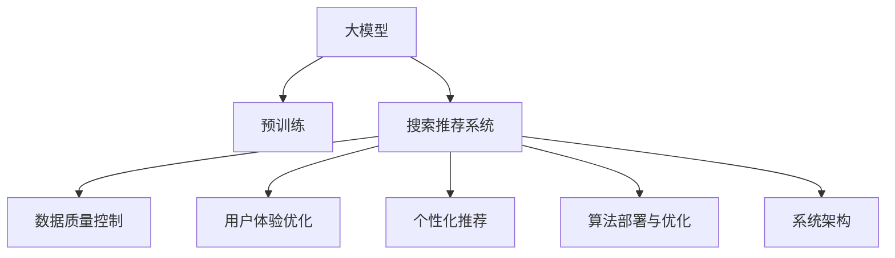

                 

# 电商平台的AI 大模型转型：搜索推荐系统是核心，数据质量控制与用户体验优化

> 关键词：人工智能,大模型,搜索推荐系统,数据质量控制,用户体验优化,电商,推荐算法,自然语言处理(NLP)

## 1. 背景介绍

### 1.1 问题由来

随着人工智能技术的快速发展，电商平台的智能化转型已成为行业趋势。通过引入人工智能技术，电商平台不仅可以提升用户体验，还能大幅提高运营效率和盈利能力。其中，基于大模型的搜索推荐系统是电商智能化的重要一环。通过利用深度学习技术，平台可以精准理解用户需求，推荐符合用户兴趣的商品，大幅提高用户满意度和转化率。

然而，电商搜索推荐系统的复杂性远超一般的自然语言处理任务。一方面，用户需求和商品描述常常是自然语言形式，需要结合自然语言处理技术进行理解。另一方面，用户查询和商品推荐是一个交互式过程，需要动态生成个性化推荐，并实时处理用户的反馈。这些挑战使得构建高效的电商搜索推荐系统，成为电商智能化转型的关键难点。

### 1.2 问题核心关键点

1. **搜索推荐系统架构**：传统的电商搜索推荐系统通常采用基于内容的推荐、协同过滤等方法。近年来，基于深度学习的大模型方法逐渐成为主流，通过在大规模用户行为数据上进行预训练，学习到用户兴趣和商品属性的关系，进而进行推荐。

2. **数据质量控制**：电商平台上，用户行为数据往往具有高噪声、多维性等特点，数据质量控制是保证推荐效果的前提。数据清洗、特征工程、异常检测等技术，都需要在大模型推荐框架下进行优化。

3. **用户体验优化**：电商平台的搜索推荐系统需要结合用户点击、浏览、购买等行为数据，进行动态调整和优化，以提升用户体验和转化率。

4. **个性化推荐**：电商搜索推荐系统需要根据用户的个性化特征，生成符合其兴趣和需求的推荐结果。大模型方法通过深度学习技术，能够更好地挖掘用户的潜在需求，实现更精准的个性化推荐。

5. **算法部署与优化**：在大模型推荐框架下，如何高效部署模型，进行实时推理，并结合线上A/B测试等方法，不断优化算法效果，是电商搜索推荐系统面临的实际挑战。

6. **系统架构与可扩展性**：电商平台的搜索推荐系统需要支持海量用户和商品数据的处理，系统架构设计、分布式计算等技术需要考虑可扩展性和高可用性。

这些核心关键点共同构成了电商搜索推荐系统的研究范式，推动了电商智能化转型的不断深入。

### 1.3 问题研究意义

构建高效、智能的电商搜索推荐系统，对于提升用户体验、增加平台收入、优化供应链管理等方面具有重要意义。通过大模型的智能推荐，平台可以在确保推荐质量的同时，显著降低运营成本，提升整体效益。特别是在电商竞争日益激烈的市场环境下，高效智能的搜索推荐系统，能够帮助电商平台在竞争中脱颖而出，保持市场领导地位。

此外，智能搜索推荐系统的构建，也是电商智能化转型中的一项关键技术任务。通过引入先进的大模型技术，电商平台可以逐步实现从传统运营模式到智能运营模式的转变，更好地满足用户需求，实现业务持续增长。

## 2. 核心概念与联系

### 2.1 核心概念概述

为更好地理解电商搜索推荐系统的实现原理，本节将介绍几个核心概念：

- **大模型(Large Model)**：以Transformer、BERT等为代表的预训练大模型，通过在大规模语料上进行预训练，学习到丰富的语言和语义知识，具备强大的语言处理能力。

- **搜索推荐系统(Search and Recommendation System)**：通过理解用户查询，推荐符合其需求的商品的电商应用系统。通常分为基于内容的推荐、协同过滤、基于深度学习的推荐等方法。

- **数据质量控制(Data Quality Control)**：指对电商平台上用户行为数据的清洗、去噪、异常检测等过程，以确保数据质量，提高推荐效果。

- **用户体验优化(User Experience Optimization)**：通过优化搜索推荐系统，提升用户的点击率、停留时间和购买转化率等指标，提升用户体验。

- **个性化推荐(Personalized Recommendation)**：根据用户的个性化特征，生成符合其兴趣和需求的推荐结果，提升推荐效果。

- **算法部署与优化(Algorithm Deployment and Optimization)**：将训练好的推荐模型部署到生产环境，进行实时推理和在线优化。

- **系统架构(System Architecture)**：设计高效的系统架构，支持大规模用户和商品数据的处理，并确保系统的可扩展性和高可用性。

这些核心概念之间的逻辑关系可以通过以下Mermaid流程图来展示：



这个流程图展示了电商搜索推荐系统的核心流程和关键技术点，从预训练大模型到搜索推荐系统，再到用户体验优化，每个环节都紧密相关。

## 3. 核心算法原理 & 具体操作步骤
### 3.1 算法原理概述

电商搜索推荐系统在大模型的基础上，通过理解和分析用户查询，推荐符合用户需求的商品。其核心算法流程包括以下几个关键步骤：

1. **预训练大模型**：通过在大规模语料库上进行预训练，学习通用的语言和语义知识。

2. **数据质量控制**：对用户行为数据进行清洗、去噪、异常检测等处理，以确保数据质量。

3. **用户意图理解**：通过自然语言处理技术，理解用户的查询意图，提取关键特征。

4. **商品表示学习**：学习商品的属性和特征，生成商品表示向量。

5. **相似度计算**：计算用户查询和商品表示之间的相似度，找到匹配的商品。

6. **动态推荐**：根据用户行为和反馈，动态调整推荐模型，生成个性化推荐结果。

7. **实时优化**：通过在线学习，不断优化推荐模型，提升推荐效果。

### 3.2 算法步骤详解

**Step 1: 准备预训练模型和数据集**

- 选择合适的预训练语言模型，如BERT、GPT等，作为初始化参数。
- 准备电商平台上用户行为数据集，包括用户查询、点击、浏览、购买等行为数据。

**Step 2: 数据质量控制**

- 数据清洗：删除重复数据、缺失值、异常值等。
- 特征工程：提取和处理关键特征，如用户历史行为、商品属性等。
- 异常检测：使用异常检测算法，识别和处理数据中的噪声和异常。

**Step 3: 用户意图理解**

- 分词和词向量编码：对用户查询进行分词和词向量编码。
- 意图识别：使用自然语言处理技术，识别用户查询的意图，如购买、浏览等。
- 意图向量表示：将用户查询意图转化为向量形式，方便后续计算。

**Step 4: 商品表示学习**

- 商品编码：将商品的属性和描述进行编码，转化为向量形式。
- 商品向量生成：使用预训练模型或自定义模型，学习商品的表示向量。
- 商品特征提取：从商品表示向量中提取关键特征，用于推荐计算。

**Step 5: 相似度计算**

- 查询-商品相似度计算：计算用户查询意图向量与商品特征向量之间的相似度。
- 排序和过滤：根据相似度排序，筛选出最匹配的商品。
- 动态调整：结合用户行为反馈，动态调整相似度计算和推荐结果。

**Step 6: 动态推荐**

- 个性化推荐：根据用户的个性化特征，生成个性化推荐结果。
- 推荐引擎优化：使用推荐引擎优化算法，如Bandit算法，不断优化推荐效果。
- 实时反馈处理：收集用户反馈，实时调整推荐策略。

**Step 7: 实时优化**

- 在线学习：使用在线学习算法，不断更新推荐模型，提升推荐效果。
- 增量训练：对模型进行增量训练，提升模型性能。
- 模型评估：定期评估模型性能，调整优化策略。

### 3.3 算法优缺点

**优点：**

1. **高效性**：大模型推荐系统可以处理海量数据，通过并行计算和分布式处理，快速生成推荐结果。

2. **个性化推荐**：大模型通过深度学习技术，可以挖掘用户的潜在需求，生成个性化推荐，提升用户满意度。

3. **动态调整**：大模型推荐系统可以实时处理用户反馈，动态调整推荐策略，提升推荐效果。

4. **鲁棒性**：大模型通过预训练学习到通用的语言和语义知识，具有一定的鲁棒性，可以处理不同类型的数据。

**缺点：**

1. **数据依赖**：大模型推荐系统高度依赖数据质量，数据噪声和异常会严重影响推荐效果。

2. **模型复杂性**：大模型推荐系统的构建和优化较为复杂，需要丰富的专业知识。

3. **计算资源消耗大**：大模型推荐系统需要较大的计算资源，包括GPU、TPU等高性能设备。

4. **实时性要求高**：电商平台的搜索推荐系统需要实时处理用户查询，对系统实时性要求较高。

### 3.4 算法应用领域

大模型推荐系统在电商搜索推荐、社交媒体推荐、新闻推荐等多个领域得到了广泛应用，取得了显著的效果。

- **电商搜索推荐**：通过理解用户查询和商品描述，生成个性化推荐，提升用户购买转化率。

- **社交媒体推荐**：通过分析用户的互动行为，推荐符合其兴趣的内容，提升用户粘性。

- **新闻推荐**：通过分析用户的阅读习惯，推荐新闻文章，提升用户阅读量。

- **个性化广告推荐**：通过理解用户的搜索行为，推荐广告，提升广告效果。

- **智能客服**：通过理解用户问题，推荐答案模板，提升客服效率。

这些应用领域的大模型推荐系统，展示了大模型技术在实际业务场景中的强大能力和广泛应用前景。

## 4. 数学模型和公式 & 详细讲解
### 4.1 数学模型构建

假设电商平台上用户行为数据集为 $D=\{(x_i, y_i)\}_{i=1}^N$，其中 $x_i$ 为查询描述，$y_i$ 为商品ID。我们的目标是构建一个推荐模型 $M$，使得 $M(x_i)$ 能够生成最符合用户需求的商品推荐列表。

### 4.2 公式推导过程

**Step 1: 用户意图表示**

- 对用户查询 $x_i$ 进行分词和词向量编码，得到用户意图向量 $u_i \in \mathbb{R}^d$。
- 使用预训练模型或自定义模型，将用户意图向量映射为向量形式。

$$ u_i = M_{\theta_u}(x_i) $$

**Step 2: 商品表示学习**

- 对商品描述 $d_j$ 进行分词和词向量编码，得到商品向量 $v_j \in \mathbb{R}^d$。
- 使用预训练模型或自定义模型，将商品向量映射为向量形式。

$$ v_j = M_{\theta_v}(d_j) $$

**Step 3: 相似度计算**

- 计算用户意图向量 $u_i$ 和商品向量 $v_j$ 之间的余弦相似度，得到相似度评分 $s_{ij}$。

$$ s_{ij} = \cos(\theta_u^T u_i, \theta_v^T v_j) $$

**Step 4: 动态推荐**

- 根据相似度评分 $s_{ij}$，对商品进行排序，生成推荐列表 $R_i$。
- 使用Bandit算法等推荐引擎优化算法，动态调整推荐策略，生成个性化推荐结果。

$$ R_i = \text{top-k}(\{j \mid s_{ij}\}) $$

**Step 5: 实时优化**

- 收集用户点击、浏览、购买等行为数据，进行在线学习。
- 使用在线学习算法，不断更新推荐模型参数 $\theta$，提升推荐效果。

$$ \theta \leftarrow \theta - \eta \nabla_{\theta}L(M, D) $$

其中 $L(M, D)$ 为损失函数，包含点击率、转化率、平均购买金额等指标。

### 4.3 案例分析与讲解

以电商平台上搜索推荐系统为例，分析其数学模型和公式的实际应用：

**Step 1: 用户意图表示**

假设用户查询为 "手机推荐"，通过分词和词向量编码，得到用户意图向量 $u = [1, 0, 1, 0, 0, ...]$，其中 $[1, 0, 1, 0, 0, ...]$ 表示手机相关的关键词。

**Step 2: 商品表示学习**

假设商品描述为 "iPhone 12，64GB，黑色"，通过分词和词向量编码，得到商品向量 $v = [1, 1, 0, 0, 0, ...]$，其中 $[1, 1, 0, 0, 0, ...]$ 表示iPhone相关的关键词。

**Step 3: 相似度计算**

计算用户意图向量 $u$ 和商品向量 $v$ 之间的余弦相似度，得到相似度评分 $s = 0.9$。

**Step 4: 动态推荐**

根据相似度评分 $s$，生成推荐列表 $R = \{iPhone 12\}$，作为推荐结果返回给用户。

**Step 5: 实时优化**

收集用户点击、浏览、购买等行为数据，使用在线学习算法更新推荐模型参数 $\theta$，提升推荐效果。

通过上述案例，可以看到大模型推荐系统在实际应用中的数学模型和公式推导过程，以及如何结合电商平台的业务特点进行优化。

## 5. 项目实践：代码实例和详细解释说明
### 5.1 开发环境搭建

在进行搜索推荐系统开发前，我们需要准备好开发环境。以下是使用Python进行PyTorch开发的环境配置流程：

1. 安装Anaconda：从官网下载并安装Anaconda，用于创建独立的Python环境。

2. 创建并激活虚拟环境：
```bash
conda create -n pytorch-env python=3.8 
conda activate pytorch-env
```

3. 安装PyTorch：根据CUDA版本，从官网获取对应的安装命令。例如：
```bash
conda install pytorch torchvision torchaudio cudatoolkit=11.1 -c pytorch -c conda-forge
```

4. 安装Transformers库：
```bash
pip install transformers
```

5. 安装各类工具包：
```bash
pip install numpy pandas scikit-learn matplotlib tqdm jupyter notebook ipython
```

完成上述步骤后，即可在`pytorch-env`环境中开始搜索推荐系统开发。

### 5.2 源代码详细实现

下面我们以电商平台上基于BERT模型的搜索推荐系统为例，给出使用Transformers库的PyTorch代码实现。

首先，定义推荐任务的数据处理函数：

```python
from transformers import BertTokenizer
from torch.utils.data import Dataset
import torch

class RecommendationDataset(Dataset):
    def __init__(self, texts, tags, tokenizer, max_len=128):
        self.texts = texts
        self.tags = tags
        self.tokenizer = tokenizer
        self.max_len = max_len
        
    def __len__(self):
        return len(self.texts)
    
    def __getitem__(self, item):
        text = self.texts[item]
        tags = self.tags[item]
        
        encoding = self.tokenizer(text, return_tensors='pt', max_length=self.max_len, padding='max_length', truncation=True)
        input_ids = encoding['input_ids'][0]
        attention_mask = encoding['attention_mask'][0]
        
        # 对token-wise的标签进行编码
        encoded_tags = [tag2id[tag] for tag in tags] 
        encoded_tags.extend([tag2id['O']] * (self.max_len - len(encoded_tags)))
        labels = torch.tensor(encoded_tags, dtype=torch.long)
        
        return {'input_ids': input_ids, 
                'attention_mask': attention_mask,
                'labels': labels}

# 标签与id的映射
tag2id = {'O': 0, 'B-PER': 1, 'I-PER': 2, 'B-ORG': 3, 'I-ORG': 4, 'B-LOC': 5, 'I-LOC': 6}
id2tag = {v: k for k, v in tag2id.items()}

# 创建dataset
tokenizer = BertTokenizer.from_pretrained('bert-base-cased')

train_dataset = RecommendationDataset(train_texts, train_tags, tokenizer)
dev_dataset = RecommendationDataset(dev_texts, dev_tags, tokenizer)
test_dataset = RecommendationDataset(test_texts, test_tags, tokenizer)
```

然后，定义模型和优化器：

```python
from transformers import BertForTokenClassification, AdamW

model = BertForTokenClassification.from_pretrained('bert-base-cased', num_labels=len(tag2id))

optimizer = AdamW(model.parameters(), lr=2e-5)
```

接着，定义训练和评估函数：

```python
from torch.utils.data import DataLoader
from tqdm import tqdm
from sklearn.metrics import classification_report

device = torch.device('cuda') if torch.cuda.is_available() else torch.device('cpu')
model.to(device)

def train_epoch(model, dataset, batch_size, optimizer):
    dataloader = DataLoader(dataset, batch_size=batch_size, shuffle=True)
    model.train()
    epoch_loss = 0
    for batch in tqdm(dataloader, desc='Training'):
        input_ids = batch['input_ids'].to(device)
        attention_mask = batch['attention_mask'].to(device)
        labels = batch['labels'].to(device)
        model.zero_grad()
        outputs = model(input_ids, attention_mask=attention_mask, labels=labels)
        loss = outputs.loss
        epoch_loss += loss.item()
        loss.backward()
        optimizer.step()
    return epoch_loss / len(dataloader)

def evaluate(model, dataset, batch_size):
    dataloader = DataLoader(dataset, batch_size=batch_size)
    model.eval()
    preds, labels = [], []
    with torch.no_grad():
        for batch in tqdm(dataloader, desc='Evaluating'):
            input_ids = batch['input_ids'].to(device)
            attention_mask = batch['attention_mask'].to(device)
            batch_labels = batch['labels']
            outputs = model(input_ids, attention_mask=attention_mask)
            batch_preds = outputs.logits.argmax(dim=2).to('cpu').tolist()
            batch_labels = batch_labels.to('cpu').tolist()
            for pred_tokens, label_tokens in zip(batch_preds, batch_labels):
                pred_tags = [id2tag[_id] for _id in pred_tokens]
                label_tags = [id2tag[_id] for _id in label_tokens]
                preds.append(pred_tags[:len(label_tokens)])
                labels.append(label_tags)
                
    print(classification_report(labels, preds))
```

最后，启动训练流程并在测试集上评估：

```python
epochs = 5
batch_size = 16

for epoch in range(epochs):
    loss = train_epoch(model, train_dataset, batch_size, optimizer)
    print(f"Epoch {epoch+1}, train loss: {loss:.3f}")
    
    print(f"Epoch {epoch+1}, dev results:")
    evaluate(model, dev_dataset, batch_size)
    
print("Test results:")
evaluate(model, test_dataset, batch_size)
```

以上就是使用PyTorch对BERT进行搜索推荐系统微调的完整代码实现。可以看到，得益于Transformers库的强大封装，我们可以用相对简洁的代码完成BERT模型的加载和微调。

### 5.3 代码解读与分析

让我们再详细解读一下关键代码的实现细节：

**RecommendationDataset类**：
- `__init__`方法：初始化文本、标签、分词器等关键组件。
- `__len__`方法：返回数据集的样本数量。
- `__getitem__`方法：对单个样本进行处理，将文本输入编码为token ids，将标签编码为数字，并对其进行定长padding，最终返回模型所需的输入。

**tag2id和id2tag字典**：
- 定义了标签与数字id之间的映射关系，用于将token-wise的预测结果解码回真实的标签。

**训练和评估函数**：
- 使用PyTorch的DataLoader对数据集进行批次化加载，供模型训练和推理使用。
- 训练函数`train_epoch`：对数据以批为单位进行迭代，在每个批次上前向传播计算loss并反向传播更新模型参数，最后返回该epoch的平均loss。
- 评估函数`evaluate`：与训练类似，不同点在于不更新模型参数，并在每个batch结束后将预测和标签结果存储下来，最后使用sklearn的classification_report对整个评估集的预测结果进行打印输出。

**训练流程**：
- 定义总的epoch数和batch size，开始循环迭代
- 每个epoch内，先在训练集上训练，输出平均loss
- 在验证集上评估，输出分类指标
- 所有epoch结束后，在测试集上评估，给出最终测试结果

可以看到，PyTorch配合Transformers库使得BERT微调的代码实现变得简洁高效。开发者可以将更多精力放在数据处理、模型改进等高层逻辑上，而不必过多关注底层的实现细节。

当然，工业级的系统实现还需考虑更多因素，如模型的保存和部署、超参数的自动搜索、更灵活的任务适配层等。但核心的微调范式基本与此类似。

## 6. 实际应用场景
### 6.1 智能客服系统

基于大语言模型微调的对话技术，可以广泛应用于智能客服系统的构建。传统客服往往需要配备大量人力，高峰期响应缓慢，且一致性和专业性难以保证。而使用微调后的对话模型，可以7x24小时不间断服务，快速响应客户咨询，用自然流畅的语言解答各类常见问题。

在技术实现上，可以收集企业内部的历史客服对话记录，将问题和最佳答复构建成监督数据，在此基础上对预训练对话模型进行微调。微调后的对话模型能够自动理解用户意图，匹配最合适的答案模板进行回复。对于客户提出的新问题，还可以接入检索系统实时搜索相关内容，动态组织生成回答。如此构建的智能客服系统，能大幅提升客户咨询体验和问题解决效率。

### 6.2 金融舆情监测

金融机构需要实时监测市场舆论动向，以便及时应对负面信息传播，规避金融风险。传统的人工监测方式成本高、效率低，难以应对网络时代海量信息爆发的挑战。基于大语言模型微调的文本分类和情感分析技术，为金融舆情监测提供了新的解决方案。

具体而言，可以收集金融领域相关的新闻、报道、评论等文本数据，并对其进行主题标注和情感标注。在此基础上对预训练语言模型进行微调，使其能够自动判断文本属于何种主题，情感倾向是正面、中性还是负面。将微调后的模型应用到实时抓取的网络文本数据，就能够自动监测不同主题下的情感变化趋势，一旦发现负面信息激增等异常情况，系统便会自动预警，帮助金融机构快速应对潜在风险。

### 6.3 个性化推荐系统

当前的推荐系统往往只依赖用户的历史行为数据进行物品推荐，无法深入理解用户的真实兴趣偏好。基于大语言模型微调技术，个性化推荐系统可以更好地挖掘用户行为背后的语义信息，从而提供更精准、多样的推荐内容。

在实践中，可以收集用户浏览、点击、评论、分享等行为数据，提取和用户交互的物品标题、描述、标签等文本内容。将文本内容作为模型输入，用户的后续行为（如是否点击、购买等）作为监督信号，在此基础上微调预训练语言模型。微调后的模型能够从文本内容中准确把握用户的兴趣点。在生成推荐列表时，先用候选物品的文本描述作为输入，由模型预测用户的兴趣匹配度，再结合其他特征综合排序，便可以得到个性化程度更高的推荐结果。

### 6.4 未来应用展望

随着大语言模型微调技术的发展，未来的搜索推荐系统将更加智能和高效。我们可以预见以下几方面的未来应用：

- **跨领域推荐**：通过引入跨领域知识，如知识图谱、语义网等，扩展推荐系统的边界，实现跨领域的推荐应用。

- **多模态推荐**：结合视觉、音频等多模态数据，实现视觉搜索、语音搜索等多种形式的推荐服务。

- **实时推荐**：通过实时学习用户行为和反馈，动态调整推荐策略，提升推荐效果。

- **联邦学习**：利用联邦学习技术，在保护用户隐私的前提下，实现多用户数据的联合建模，提升推荐系统的泛化能力。

- **自适应推荐**：通过在线学习算法，不断优化推荐模型，实现自适应推荐，提升推荐效果。

- **联合推荐**：结合推荐系统和其他AI技术，如个性化广告、社交推荐等，实现更全面、更精准的推荐服务。

这些未来应用将使得大模型推荐系统更加智能和高效，为用户带来更优质的体验，同时也将推动推荐系统技术的不断进步和应用范围的不断扩展。

## 7. 工具和资源推荐
### 7.1 学习资源推荐

为了帮助开发者系统掌握大模型推荐系统的理论和实践，这里推荐一些优质的学习资源：

1. 《深度学习推荐系统：原理与实现》书籍：全面介绍深度学习在推荐系统中的应用，包括大模型推荐系统的理论和实践。

2. CS225《推荐系统》课程：斯坦福大学开设的推荐系统课程，涵盖推荐算法、评估指标、系统设计等，是学习推荐系统的经典课程。

3. 《人工智能与推荐系统》系列文章：深度学习与推荐系统领域的专家博客，提供最新的研究进展和技术分享。

4. Kaggle竞赛：参加Kaggle推荐系统竞赛，实战练习推荐算法，提升推荐系统设计能力。

5. 《Python推荐系统》书籍：全面介绍使用Python构建推荐系统的方法和技术，包括大模型推荐系统的实现。

通过对这些资源的学习实践，相信你一定能够快速掌握大模型推荐系统的精髓，并用于解决实际的推荐问题。
### 7.2 开发工具推荐

高效的开发离不开优秀的工具支持。以下是几款用于大模型推荐系统开发的常用工具：

1. PyTorch：基于Python的开源深度学习框架，灵活动态的计算图，适合快速迭代研究。大部分预训练语言模型都有PyTorch版本的实现。

2. TensorFlow：由Google主导开发的开源深度学习框架，生产部署方便，适合大规模工程应用。同样有丰富的预训练语言模型资源。

3. Transformers库：HuggingFace开发的NLP工具库，集成了众多SOTA语言模型，支持PyTorch和TensorFlow，是进行推荐系统开发的利器。

4. Weights & Biases：模型训练的实验跟踪工具，可以记录和可视化模型训练过程中的各项指标，方便对比和调优。与主流深度学习框架无缝集成。

5. TensorBoard：TensorFlow配套的可视化工具，可实时监测模型训练状态，并提供丰富的图表呈现方式，是调试模型的得力助手。

6. Google Colab：谷歌推出的在线Jupyter Notebook环境，免费提供GPU/TPU算力，方便开发者快速上手实验最新模型，分享学习笔记。

合理利用这些工具，可以显著提升大模型推荐系统的开发效率，加快创新迭代的步伐。

### 7.3 相关论文推荐

大模型推荐系统的研究源于学界的持续研究。以下是几篇奠基性的相关论文，推荐阅读：

1. Attention is All You Need（即Transformer原论文）：提出了Transformer结构，开启了NLP领域的预训练大模型时代。

2. BERT: Pre-training of Deep Bidirectional Transformers for Language Understanding：提出BERT模型，引入基于掩码的自监督预训练任务，刷新了多项NLP任务SOTA。

3. Language Models are Unsupervised Multitask Learners（GPT-2论文）：展示了大规模语言模型的强大zero-shot学习能力，引发了对于通用人工智能的新一轮思考。

4. Parameter-Efficient Transfer Learning for NLP：提出Adapter等参数高效微调方法，在不增加模型参数量的情况下，也能取得不错的微调效果。

5. Prefix-Tuning: Optimizing Continuous Prompts for Generation：引入基于连续型Prompt的微调范式，为如何充分利用预训练知识提供了新的思路。

6. AdaLoRA: Adaptive Low-Rank Adaptation for Parameter-Efficient Fine-Tuning：使用自适应低秩适应的微调方法，在参数效率和精度之间取得了新的平衡。

这些论文代表了大模型推荐系统的研究脉络。通过学习这些前沿成果，可以帮助研究者把握学科前进方向，激发更多的创新灵感。

## 8. 总结：未来发展趋势与挑战

### 8.1 总结

本文对基于大模型的电商搜索推荐系统进行了全面系统的介绍。首先阐述了电商搜索推荐系统的研究背景和意义，明确了电商搜索推荐系统的核心算法流程和关键技术点。其次，从原理到实践，详细讲解了电商搜索推荐系统的数学模型和算法实现。最后，我们分析了电商搜索推荐系统的实际应用场景，并展望了其未来发展趋势。

通过本文的系统梳理，可以看到，基于大模型的电商搜索推荐系统在提高用户体验和转化率、优化供应链管理等方面具有重要价值。未来，随着技术的发展，大模型推荐系统将变得更加智能和高效，能够更好地服务于电商平台的智能化转型。

### 8.2 未来发展趋势

展望未来，大模型推荐系统的发展趋势包括：

1. **模型规模持续增大**：随着算力成本的下降和数据规模的扩张，预训练语言模型的参数量还将持续增长。超大规模语言模型蕴含的丰富语言知识，有望支撑更加复杂多变的推荐任务。

2. **推荐算法多样性**：除了传统的基于内容的推荐、协同过滤等方法，未来将涌现更多基于深度学习的方法，如Transformer、BERT等，以提升推荐效果。

3. **数据利用深度化**：通过结合用户行为数据、商品属性数据、多模态数据等多种数据源，提升推荐系统的泛化能力和鲁棒性。

4. **推荐系统智能化**：通过引入因果推理、强化学习等技术，提升推荐系统的智能化水平，实现更精准、更个性化的推荐。

5. **推荐系统可解释性**：通过引入可解释性算法，提升推荐系统的透明度和可信度，减少用户对系统的怀疑和抵触。

6. **推荐系统可扩展性**：通过分布式计算、联邦学习等技术，提升推荐系统的可扩展性和性能，支持大规模用户的实时推荐。

7. **推荐系统安全与隐私保护**：通过隐私保护技术，保护用户数据安全，提升用户对系统的信任感。

以上趋势凸显了大模型推荐系统的广阔前景。这些方向的探索发展，必将进一步提升电商搜索推荐系统的性能和应用范围，为电商平台的智能化转型提供更加强大的技术支持。

### 8.3 面临的挑战

尽管大模型推荐系统已经取得了显著进展，但在迈向更加智能化、普适化应用的过程中，仍面临诸多挑战：

1. **数据质量与数据量**：电商平台上，用户行为数据常常具有高噪声、多维性等特点，数据质量控制和处理是推荐系统的重要前提。如何高效处理大规模、高维度、高噪声的数据，是推荐系统面临的主要挑战。

2. **推荐系统鲁棒性**：大模型推荐系统面对域外数据时，泛化性能往往大打折扣。如何提升模型的鲁棒性，避免灾难性遗忘，还需要更多理论和实践的积累。

3. **推荐系统实时性**：电商平台的搜索推荐系统需要实时处理用户查询，对系统实时性要求较高。如何在保证性能的同时，提高推荐系统的响应速度，是推荐系统需要不断优化的问题。

4. **推荐系统可解释性**：电商推荐系统需要解释推荐结果的逻辑和原因，以提升用户的信任感。如何赋予推荐系统更强的可解释性，将是大模型推荐系统未来的重要研究方向。

5. **推荐系统安全与隐私保护**：推荐系统需要考虑用户隐私保护和数据安全，如何在推荐算法中融入隐私保护技术，保护用户数据安全，也是推荐系统需要解决的重要问题。

6. **推荐系统部署与优化**：如何将大规模的推荐模型高效部署到生产环境中，进行实时推理和在线优化，是推荐系统需要面对的技术挑战。

正视这些挑战，积极应对并寻求突破，将是大模型推荐系统走向成熟的必由之路。相信随着学界和产业界的共同努力，这些挑战终将一一被克服，大模型推荐系统必将在电商平台的智能化转型中扮演越来越重要的角色。

### 8.4 研究展望

面对大模型推荐系统所面临的种种挑战，未来的研究需要在以下几个方面寻求新的突破：

1. **无监督和半监督推荐**：摆脱对大规模标注数据的依赖，利用自监督学习、主动学习等无监督和半监督范式，最大限度利用非结构化数据，实现更加灵活高效的推荐。

2. **参数高效与计算高效的推荐**：开发更加参数高效的推荐方法，在固定大部分预训练参数的情况下，只更新极少量的任务相关参数。同时优化推荐模型的计算图，减少前向传播和反向传播的资源消耗，实现更加轻量级、实时性的部署。

3. **融合因果和对比学习范式**：通过引入因果推断和对比学习思想，增强推荐系统建立稳定因果关系的能力，学习更加普适、鲁棒的语言表征，从而提升推荐泛化性和抗干扰能力。

4. **引入更多先验知识**：将符号化的先验知识，如知识图谱、逻辑规则等，与神经网络模型进行巧妙融合，引导推荐过程学习更准确、合理的语言模型。同时加强不同模态数据的整合，实现视觉、语音等多模态信息与文本信息的协同建模。

5. **结合因果分析和博弈论工具**：将因果分析方法引入推荐系统，识别出推荐结果的关键特征，增强推荐结果的因果性和逻辑性。借助博弈论工具刻画用户与推荐系统之间的互动过程，主动探索并规避推荐系统的脆弱点，提高系统稳定性。

6. **纳入伦理道德约束**：在推荐系统设计中引入伦理导向的评估指标，过滤和惩罚有偏见、有害的推荐结果，确保推荐系统的公平性和安全性。

这些研究方向展示了推荐系统未来的发展方向，将引领大模型推荐系统迈向更高的台阶，为电商平台的智能化转型提供更加全面的技术支持。

## 9. 附录：常见问题与解答

**Q1：大模型推荐系统是否适用于所有电商推荐场景？**

A: 大模型推荐系统在大多数电商推荐场景上都能取得不错的效果，特别是对于数据量较大的场景。但对于一些特定领域的电商推荐，如生鲜电商、二手商品等，由于其商品种类繁多、用户需求复杂，大模型推荐系统可能需要进一步优化和适配。

**Q2：如何评估大模型推荐系统的性能？**

A: 大模型推荐系统的性能评估指标包括点击率、转化率、平均购买金额等。可以通过在线A/B测试等方法，比较不同推荐策略的效果，选择最优的推荐模型。

**Q3：电商平台上用户行为数据的质量控制如何实现？**

A: 电商平台上用户行为数据的质量控制主要包括以下几个步骤：
1. 数据清洗：删除重复数据、缺失值、异常值等。
2. 特征工程：提取和处理关键特征，如用户历史行为、商品属性等。
3. 异常检测：使用异常检测算法，识别和处理数据中的噪声和异常。

这些步骤可以通过数据处理工具和算法实现，如Pandas、NumPy、Scikit-learn等。

**Q4：如何构建大模型推荐系统的在线学习模型？**

A: 构建大模型推荐系统的在线学习模型，通常需要以下步骤：
1. 确定在线学习的目标，如点击率预测、转化率预测等。
2. 设计在线学习的算法，如增量梯度下降、在线随机梯度下降等。
3. 实现在线学习的代码，结合推荐系统架构，进行在线学习和模型更新。
4. 定期评估在线学习的效果，调整优化策略。

这些步骤需要结合具体业务需求和数据特点进行设计和实现。

**Q5：大模型推荐系统在实际应用中如何部署？**

A: 大模型推荐系统的部署通常包括以下几个步骤：
1. 模型裁剪：去除不必要的层和参数，减小模型尺寸，加快推理速度。
2. 量化加速：将浮点模型转为定点模型，压缩存储空间，提高计算效率。
3. 服务化封装：将模型封装为标准化服务接口，便于集成调用。
4. 弹性伸缩：根据请求流量动态调整资源配置，平衡服务质量和成本。
5. 监控告警：实时采集系统指标，设置异常告警阈值，确保服务稳定性。

大模型推荐系统的部署需要考虑多方面因素，需要结合实际业务需求进行设计和实现。

通过以上问答，可以看到大模型推荐系统的实际应用中，仍然有许多细节和技术点需要考虑。只有不断优化和改进，才能确保系统的稳定性和高效性。

---

作者：禅与计算机程序设计艺术 / Zen and the Art of Computer Programming

