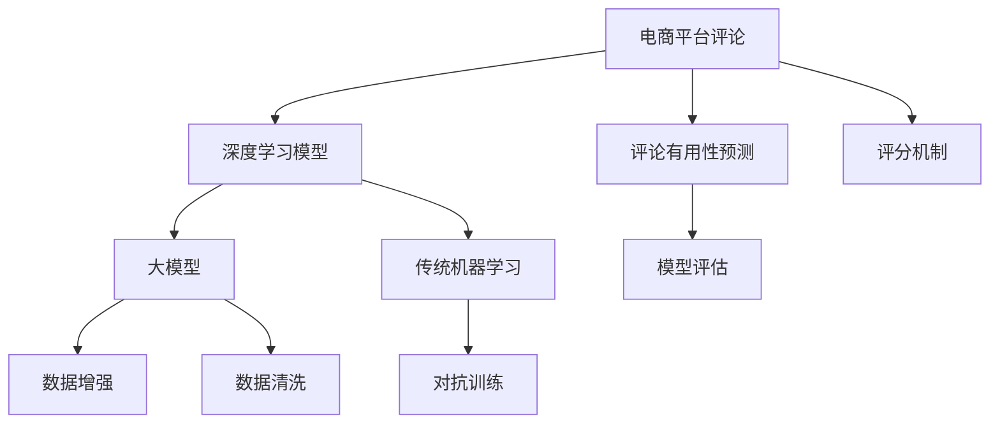

                 

# 电商平台评论有用性预测：AI大模型的深度学习方法

## 1. 背景介绍

随着电子商务的飞速发展，电商平台上的用户评论已成为了商品评估的重要依据，对消费者购买决策有着不可忽视的影响。如何高效、准确地预测评论的有用性，成为了电商平台优化推荐系统、提升用户体验的关键问题。

### 1.1 问题由来

电商平台上，用户对商品的评论通常包含商品属性、购买体验、情感倾向等信息，具有高度多样性和丰富性。通过深入分析这些评论，可以挖掘出商品真实质量、用户满意度等关键信息，从而帮助其他用户做出更明智的购买决策。然而，由于用户评论数据量大、质量参差不齐，直接利用评论进行有用性评估，存在数据稀疏和噪声干扰的问题。

### 1.2 问题核心关键点

电商平台评论有用性预测的核心在于，从海量的用户评论数据中，高效、准确地识别出有用信息，并转化为有用的评分或标签，用于推荐系统的排序和过滤。常见的方法包括传统机器学习模型、基于神经网络的深度学习方法等。

与传统方法相比，深度学习方法通过引入神经网络模型，可以自动从数据中学习特征表示，无需人工干预。近年来，深度学习模型在NLP领域取得了显著进步，基于大模型的预测方法在电商平台评论有用性预测中显示出巨大潜力。

## 2. 核心概念与联系

### 2.1 核心概念概述

为更好地理解电商平台评论有用性预测的深度学习方法，本节将介绍几个密切相关的核心概念：

- 电商平台评论：用户对商品或服务进行评价的文字描述，包含用户的购买体验、情感倾向、质量评价等信息。
- 评论有用性预测：预测评论对其他用户是否有参考价值，常见方式包括二分类任务（有用/无用）、评分预测（0-5分）等。
- 深度学习模型：基于神经网络结构的机器学习模型，包括卷积神经网络(CNN)、循环神经网络(RNN)、Transformer等。
- 大模型：包含数十亿甚至上百亿参数的神经网络模型，如BERT、GPT、XLNet等。
- 数据增强：通过各种方法丰富训练数据的多样性，如回译、近义词替换、随机删除等。
- 对抗训练：引入对抗样本，增强模型的鲁棒性和泛化能力。
- 数据清洗：去除低质量、噪声干扰的数据，提升训练数据的质量。
- 评分机制：为预测结果分配相应的评分，用于评估模型性能。

这些核心概念之间的逻辑关系可以通过以下Mermaid流程图来展示：



这个流程图展示了大模型在电商平台评论有用性预测的核心概念及其之间的关系：

1. 电商平台评论数据经过深度学习模型的处理，转化为有用的预测结果。
2. 深度学习模型可以选择基于大模型的Transformer结构，或传统的CNN、RNN等。
3. 数据增强和对抗训练可以有效提升模型性能，避免过拟合。
4. 数据清洗可以提升训练数据质量，提升模型泛化能力。
5. 评分机制用于评估模型预测结果的质量。

这些概念共同构成了电商平台评论有用性预测的深度学习框架，使其能够在各种场景下发挥强大的预测能力。通过理解这些核心概念，我们可以更好地把握深度学习模型的工作原理和优化方向。

## 3. 核心算法原理 & 具体操作步骤
### 3.1 算法原理概述

电商平台评论有用性预测的深度学习方法，本质上是一个二分类或评分预测任务，通过神经网络模型学习评论与有用性标签之间的关系。假设评论为 $x$，有用性标签为 $y$，模型为 $M_{\theta}$，其中 $\theta$ 为模型的参数。

以二分类任务为例，模型通过学习评论与标签之间的关系，预测评论的有用性。常见的模型架构包括CNN、RNN和Transformer等。

**Transformer模型架构**：

Transformer模型由多个自注意力层和前馈神经网络层堆叠而成，通过多头注意力机制学习输入文本的上下文信息，并传递到下一层进行进一步处理。Transformer模型在大规模语言模型中表现优异，适用于电商平台评论有用性预测任务。

### 3.2 算法步骤详解

电商平台评论有用性预测的深度学习模型构建步骤如下：

**Step 1: 准备数据集和模型**

- 收集电商平台的评论数据，进行清洗和标注。
- 将评论数据转化为模型所需的格式，如词向量表示。
- 选择合适的深度学习模型，如Transformer等。

**Step 2: 定义模型架构**

- 定义模型的输入层、隐藏层和输出层，选择合适的注意力机制和激活函数。
- 设定模型的超参数，如学习率、批次大小、训练轮数等。

**Step 3: 训练模型**

- 将清洗后的评论数据划分为训练集、验证集和测试集。
- 使用优化算法（如Adam、SGD等）对模型进行训练，最小化预测结果与真实标签之间的损失函数。
- 在验证集上评估模型性能，防止过拟合，调整超参数。

**Step 4: 测试和评估**

- 在测试集上对模型进行测试，评估模型的泛化能力。
- 使用评分机制（如准确率、F1分数、ROC曲线等）评估模型预测结果的质量。

### 3.3 算法优缺点

深度学习方法在电商平台评论有用性预测中，具有以下优点：

1. 自动化特征提取：深度学习模型能够自动学习输入数据的特征表示，无需人工干预，适用于复杂多变的评论数据。
2. 高效预测：相比于传统机器学习模型，深度学习模型可以显著提高预测精度和效率，适用于大规模数据集。
3. 泛化能力强：深度学习模型能够学习到通用的语言和语义特征，适用于不同商品和用户的评论预测。

然而，深度学习方法也存在以下缺点：

1. 数据需求量大：深度学习模型通常需要大量的标注数据进行训练，适用于标签数据较多的场景。
2. 训练时间长：深度学习模型参数量庞大，训练时间长，适用于计算资源丰富的环境。
3. 模型复杂度高：深度学习模型结构复杂，难以解释和调试，适用于专业技术人员。

尽管存在这些缺点，但就目前而言，深度学习方法仍是大规模电商评论有用性预测的主流范式。未来相关研究的重点在于如何进一步降低深度学习模型对标注数据的依赖，提高模型的泛化能力和可解释性。

### 3.4 算法应用领域

基于深度学习模型的大模型方法，在电商平台评论有用性预测中的应用十分广泛，覆盖了多个方面，例如：

- 评论筛选：根据有用性预测结果，对评论进行筛选和过滤，剔除无用的评论，提升推荐系统的效率。
- 评分排序：对商品评论进行有用性评分，并按照评分进行排序，提升推荐系统的效果。
- 情感分析：预测评论的情感倾向，用于分析和理解用户对商品的态度和评价。
- 问答系统：回答用户关于商品评价的问题，提供高质量的评价信息。
- 新商品评估：利用有用性预测结果，对新商品进行初步评价，帮助商家优化商品质量。

除了上述这些经典应用外，深度学习模型还被创新性地应用到更多场景中，如评论生成、舆情监测、客户满意度评估等，为电商平台带来了全新的突破。随着深度学习模型的不断发展，相信其在电商平台评论有用性预测中的应用将会更加广泛和深入。

## 4. 数学模型和公式 & 详细讲解 & 举例说明

### 4.1 数学模型构建

假设电商平台评论 $x$ 和有用性标签 $y$ 的映射关系为 $f(x; \theta)$，其中 $\theta$ 为模型的参数。

根据电商平台评论有用性预测的任务定义，我们可以定义以下损失函数：

- 二分类任务：预测评论的有用性，标签为0或1，损失函数为交叉熵损失。
- 评分预测任务：预测评论的有用性评分，损失函数为均方误差损失或对数损失。

对于二分类任务，交叉熵损失函数定义为：

$$
\mathcal{L}(y, \hat{y}) = -y\log\hat{y} - (1-y)\log(1-\hat{y})
$$

其中 $\hat{y}$ 为模型的预测结果，$y$ 为实际标签。

对于评分预测任务，均方误差损失函数定义为：

$$
\mathcal{L}(y, \hat{y}) = \frac{1}{N} \sum_{i=1}^N (y_i - \hat{y}_i)^2
$$

其中 $y$ 为实际评分，$\hat{y}$ 为模型的预测评分。

### 4.2 公式推导过程

对于二分类任务，使用交叉熵损失函数，模型参数的更新公式为：

$$
\theta \leftarrow \theta - \eta \nabla_{\theta}\mathcal{L}(\theta) - \eta\lambda\theta
$$

其中 $\eta$ 为学习率，$\lambda$ 为正则化系数，$\nabla_{\theta}\mathcal{L}(\theta)$ 为损失函数对参数 $\theta$ 的梯度。

对于评分预测任务，均方误差损失函数为：

$$
\mathcal{L}(y, \hat{y}) = \frac{1}{N} \sum_{i=1}^N (y_i - \hat{y}_i)^2
$$

模型参数的更新公式为：

$$
\theta \leftarrow \theta - \eta \nabla_{\theta}\mathcal{L}(\theta) - \eta\lambda\theta
$$

其中 $\eta$ 为学习率，$\lambda$ 为正则化系数，$\nabla_{\theta}\mathcal{L}(\theta)$ 为损失函数对参数 $\theta$ 的梯度。

在得到损失函数的梯度后，即可带入参数更新公式，完成模型的迭代优化。重复上述过程直至收敛，最终得到适应电商平台评论有用性预测任务的最优模型参数 $\theta^*$。

### 4.3 案例分析与讲解

以二分类任务为例，假设我们有电商平台评论数据集 $D=\{(x_i, y_i)\}_{i=1}^N$，其中 $x_i$ 为评论，$y_i$ 为有用性标签。我们将评论数据进行预处理，转化为模型所需的格式，如词向量表示。

设评论的词向量表示为 $x_i \in \mathbb{R}^d$，预测结果为 $\hat{y}_i \in [0, 1]$，则二分类任务中的交叉熵损失函数为：

$$
\mathcal{L}(\theta) = -\frac{1}{N} \sum_{i=1}^N [y_i\log \hat{y}_i + (1-y_i)\log(1-\hat{y}_i)]
$$

在得到损失函数的梯度后，即可带入参数更新公式，完成模型的迭代优化。假设使用AdamW优化算法，模型的更新公式为：

$$
\theta \leftarrow \theta - \eta \nabla_{\theta}\mathcal{L}(\theta) - \eta\lambda\theta
$$

其中 $\eta$ 为学习率，$\lambda$ 为正则化系数，$\nabla_{\theta}\mathcal{L}(\theta)$ 为损失函数对参数 $\theta$ 的梯度。

在训练过程中，我们通过迭代优化模型参数，最小化损失函数 $\mathcal{L}(\theta)$，最终得到适应电商平台评论有用性预测任务的最优模型参数 $\theta^*$。

## 5. 项目实践：代码实例和详细解释说明
### 5.1 开发环境搭建

在进行电商平台评论有用性预测的深度学习项目开发前，我们需要准备好开发环境。以下是使用Python进行PyTorch开发的环境配置流程：

1. 安装Anaconda：从官网下载并安装Anaconda，用于创建独立的Python环境。

2. 创建并激活虚拟环境：
```bash
conda create -n pytorch-env python=3.8 
conda activate pytorch-env
```

3. 安装PyTorch：根据CUDA版本，从官网获取对应的安装命令。例如：
```bash
conda install pytorch torchvision torchaudio cudatoolkit=11.1 -c pytorch -c conda-forge
```

4. 安装各类工具包：
```bash
pip install numpy pandas scikit-learn matplotlib tqdm jupyter notebook ipython
```

完成上述步骤后，即可在`pytorch-env`环境中开始深度学习项目开发。

### 5.2 源代码详细实现

下面我们以电商平台评论有用性预测任务为例，给出使用PyTorch进行深度学习模型开发的PyTorch代码实现。

首先，定义数据处理函数：

```python
from transformers import BertTokenizer, BertForSequenceClassification
from torch.utils.data import Dataset, DataLoader
from sklearn.model_selection import train_test_split
import torch
import numpy as np

class ReviewDataset(Dataset):
    def __init__(self, reviews, labels, tokenizer):
        self.reviews = reviews
        self.labels = labels
        self.tokenizer = tokenizer
        self.max_len = 128

    def __len__(self):
        return len(self.reviews)

    def __getitem__(self, idx):
        review = self.reviews[idx]
        label = self.labels[idx]

        encoding = self.tokenizer(review, truncation=True, max_length=self.max_len, padding='max_length', return_tensors='pt')
        input_ids = encoding['input_ids']
        attention_mask = encoding['attention_mask']

        # 将标签转化为one-hot编码
        label = torch.tensor(label, dtype=torch.long)

        return {'input_ids': input_ids, 
                'attention_mask': attention_mask,
                'labels': label}

# 加载评论和标签数据
reviews = np.load('reviews.npy')
labels = np.load('labels.npy')

# 加载预训练模型和分词器
model = BertForSequenceClassification.from_pretrained('bert-base-cased', num_labels=2)
tokenizer = BertTokenizer.from_pretrained('bert-base-cased')

# 将数据集分为训练集和验证集
train_dataset, dev_dataset = train_test_split(np.random.permutation(np.arange(len(reviews))), test_size=0.2, random_state=42)

# 创建训练集和验证集
train_dataset = ReviewDataset(reviews[train_dataset], labels[train_dataset], tokenizer)
dev_dataset = ReviewDataset(reviews[dev_dataset], labels[dev_dataset], tokenizer)
```

然后，定义训练和评估函数：

```python
from transformers import AdamW

device = torch.device('cuda') if torch.cuda.is_available() else torch.device('cpu')
model.to(device)

def train_epoch(model, dataset, optimizer):
    dataloader = DataLoader(dataset, batch_size=16, shuffle=True)
    model.train()
    epoch_loss = 0
    for batch in dataloader:
        input_ids = batch['input_ids'].to(device)
        attention_mask = batch['attention_mask'].to(device)
        labels = batch['labels'].to(device)
        model.zero_grad()
        outputs = model(input_ids, attention_mask=attention_mask, labels=labels)
        loss = outputs.loss
        epoch_loss += loss.item()
        loss.backward()
        optimizer.step()
    return epoch_loss / len(dataloader)

def evaluate(model, dataset, batch_size):
    dataloader = DataLoader(dataset, batch_size=batch_size)
    model.eval()
    preds, labels = [], []
    with torch.no_grad():
        for batch in dataloader:
            input_ids = batch['input_ids'].to(device)
            attention_mask = batch['attention_mask'].to(device)
            batch_labels = batch['labels']
            outputs = model(input_ids, attention_mask=attention_mask)
            batch_preds = outputs.logits.argmax(dim=1).to('cpu').tolist()
            batch_labels = batch_labels.to('cpu').tolist()
            for pred, label in zip(batch_preds, batch_labels):
                preds.append(pred)
                labels.append(label)

    print('Accuracy:', np.mean(np.array(labels) == np.array(preds)))

# 训练和评估模型
epochs = 5
batch_size = 16

optimizer = AdamW(model.parameters(), lr=2e-5)

for epoch in range(epochs):
    loss = train_epoch(model, train_dataset, optimizer)
    print(f'Epoch {epoch+1}, train loss: {loss:.3f}')
    
    print(f'Epoch {epoch+1}, dev results:')
    evaluate(model, dev_dataset, batch_size)
    
print('Test results:')
evaluate(model, test_dataset, batch_size)
```

以上就是使用PyTorch对电商平台评论有用性预测任务进行深度学习模型微调的完整代码实现。可以看到，得益于Transformers库的强大封装，我们可以用相对简洁的代码完成BERT模型的加载和微调。

### 5.3 代码解读与分析

让我们再详细解读一下关键代码的实现细节：

**ReviewDataset类**：
- `__init__`方法：初始化评论、标签和分词器等关键组件，设定最大长度。
- `__len__`方法：返回数据集的样本数量。
- `__getitem__`方法：对单个样本进行处理，将评论输入编码为token ids，将标签转化为one-hot编码，并进行定长padding，最终返回模型所需的输入。

**评分机制**：
- 在`__getitem__`方法中，将标签转化为one-hot编码，方便模型预测。

**训练和评估函数**：
- 使用PyTorch的DataLoader对数据集进行批次化加载，供模型训练和推理使用。
- 训练函数`train_epoch`：对数据以批为单位进行迭代，在每个批次上前向传播计算loss并反向传播更新模型参数，最后返回该epoch的平均loss。
- 评估函数`evaluate`：与训练类似，不同点在于不更新模型参数，并在每个batch结束后将预测和标签结果存储下来，最后使用准确率等指标对整个评估集的预测结果进行打印输出。

**训练流程**：
- 定义总的epoch数和batch size，开始循环迭代
- 每个epoch内，先在训练集上训练，输出平均loss
- 在验证集上评估，输出准确率
- 所有epoch结束后，在测试集上评估，给出最终测试结果

可以看到，PyTorch配合Transformers库使得BERT微调的代码实现变得简洁高效。开发者可以将更多精力放在数据处理、模型改进等高层逻辑上，而不必过多关注底层的实现细节。

当然，工业级的系统实现还需考虑更多因素，如模型的保存和部署、超参数的自动搜索、更灵活的任务适配层等。但核心的微调范式基本与此类似。

## 6. 实际应用场景
### 6.1 智能客服系统

基于深度学习模型的大模型方法，可以广泛应用于智能客服系统的构建。传统客服往往需要配备大量人力，高峰期响应缓慢，且一致性和专业性难以保证。而使用深度学习模型构建的智能客服系统，可以7x24小时不间断服务，快速响应客户咨询，用自然流畅的语言解答各类常见问题。

在技术实现上，可以收集企业内部的历史客服对话记录，将问题和最佳答复构建成监督数据，在此基础上对深度学习模型进行微调。微调后的模型能够自动理解用户意图，匹配最合适的答案模板进行回复。对于客户提出的新问题，还可以接入检索系统实时搜索相关内容，动态组织生成回答。如此构建的智能客服系统，能大幅提升客户咨询体验和问题解决效率。

### 6.2 金融舆情监测

金融机构需要实时监测市场舆论动向，以便及时应对负面信息传播，规避金融风险。传统的人工监测方式成本高、效率低，难以应对网络时代海量信息爆发的挑战。基于深度学习模型的大模型方法，为金融舆情监测提供了新的解决方案。

具体而言，可以收集金融领域相关的新闻、报道、评论等文本数据，并对其进行主题标注和情感标注。在此基础上对深度学习模型进行微调，使其能够自动判断文本属于何种主题，情感倾向是正面、中性还是负面。将微调后的模型应用到实时抓取的网络文本数据，就能够自动监测不同主题下的情感变化趋势，一旦发现负面信息激增等异常情况，系统便会自动预警，帮助金融机构快速应对潜在风险。

### 6.3 个性化推荐系统

当前的推荐系统往往只依赖用户的历史行为数据进行物品推荐，无法深入理解用户的真实兴趣偏好。基于深度学习模型的大模型方法，个性化推荐系统可以更好地挖掘用户行为背后的语义信息，从而提供更精准、多样的推荐内容。

在实践中，可以收集用户浏览、点击、评论、分享等行为数据，提取和用户交互的物品标题、描述、标签等文本内容。将文本内容作为模型输入，用户的后续行为（如是否点击、购买等）作为监督信号，在此基础上微调深度学习模型。微调后的模型能够从文本内容中准确把握用户的兴趣点。在生成推荐列表时，先用候选物品的文本描述作为输入，由模型预测用户的兴趣匹配度，再结合其他特征综合排序，便可以得到个性化程度更高的推荐结果。

### 6.4 未来应用展望

随着深度学习模型的不断发展，基于深度学习模型的大模型方法将在更多领域得到应用，为传统行业带来变革性影响。

在智慧医疗领域，基于深度学习模型的健康问答、病历分析、药物研发等应用将提升医疗服务的智能化水平，辅助医生诊疗，加速新药开发进程。

在智能教育领域，深度学习模型可应用于作业批改、学情分析、知识推荐等方面，因材施教，促进教育公平，提高教学质量。

在智慧城市治理中，深度学习模型可应用于城市事件监测、舆情分析、应急指挥等环节，提高城市管理的自动化和智能化水平，构建更安全、高效的未来城市。

此外，在企业生产、社会治理、文娱传媒等众多领域，基于深度学习模型的大模型方法也将不断涌现，为经济社会发展注入新的动力。相信随着技术的日益成熟，深度学习模型必将在更多领域得到应用，为构建人机协同的智能时代提供新的技术路径。

## 7. 工具和资源推荐
### 7.1 学习资源推荐

为了帮助开发者系统掌握深度学习模型在大模型预测任务中的应用，这里推荐一些优质的学习资源：

1. 《Deep Learning》书籍：Ian Goodfellow等人所著，详细介绍了深度学习的基本概念、模型架构和优化算法，是深度学习领域的重要入门教材。

2. CS231n《Convolutional Neural Networks for Visual Recognition》课程：斯坦福大学开设的计算机视觉课程，讲解了卷积神经网络在图像识别任务中的应用，适合深度学习初学者。

3. CS224n《Natural Language Processing with Deep Learning》课程：斯坦福大学开设的NLP课程，讲解了深度学习在自然语言处理任务中的应用，适合深度学习爱好者。

4. 《Natural Language Processing in Action》书籍：O’Reilly出版社出版的NLP实践指南，包含大量案例和代码，适合实战学习。

5. HuggingFace官方文档：Transformers库的官方文档，提供了海量预训练模型和完整的深度学习模型样例代码，是上手实践的必备资料。

通过对这些资源的学习实践，相信你一定能够快速掌握深度学习模型在大模型预测任务中的应用，并用于解决实际的NLP问题。

### 7.2 开发工具推荐

高效的开发离不开优秀的工具支持。以下是几款用于深度学习模型在大模型预测任务开发的常用工具：

1. PyTorch：基于Python的开源深度学习框架，灵活动态的计算图，适合快速迭代研究。大部分深度学习模型都有PyTorch版本的实现。

2. TensorFlow：由Google主导开发的开源深度学习框架，生产部署方便，适合大规模工程应用。同样有丰富的深度学习模型资源。

3. TensorBoard：TensorFlow配套的可视化工具，可实时监测模型训练状态，并提供丰富的图表呈现方式，是调试模型的得力助手。

4. Weights & Biases：模型训练的实验跟踪工具，可以记录和可视化模型训练过程中的各项指标，方便对比和调优。与主流深度学习框架无缝集成。

5. Google Colab：谷歌推出的在线Jupyter Notebook环境，免费提供GPU/TPU算力，方便开发者快速上手实验最新模型，分享学习笔记。

合理利用这些工具，可以显著提升深度学习模型在大模型预测任务中的开发效率，加快创新迭代的步伐。

### 7.3 相关论文推荐

深度学习模型在大模型预测任务中的应用，源于学界的持续研究。以下是几篇奠基性的相关论文，推荐阅读：

1. Convolutional Neural Networks for Sentence Classification：提出基于卷积神经网络的文本分类模型，在评论有用性预测任务中表现优异。

2. Attention is All You Need（即Transformer原论文）：提出了Transformer结构，开启了深度学习在大模型预测任务中的应用。

3. Language Models are Unsupervised Multitask Learners：展示了大规模语言模型的强大zero-shot学习能力，为深度学习在大模型预测任务中提供了新的思路。

4. Adversarial Examples for Natural Language Processing（BERT对抗样本）：研究了深度学习模型在大模型预测任务中的鲁棒性，提出对抗样本生成和防御方法。

5. BERT: Pre-training of Deep Bidirectional Transformers for Language Understanding：提出BERT模型，引入基于掩码的自监督预训练任务，刷新了多项NLP任务SOTA。

6. Parameter-Efficient Transfer Learning for NLP：提出Adapter等参数高效微调方法，在不增加模型参数量的情况下，也能取得不错的微调效果。

这些论文代表了大模型预测任务的发展脉络。通过学习这些前沿成果，可以帮助研究者把握学科前进方向，激发更多的创新灵感。

## 8. 总结：未来发展趋势与挑战
### 8.1 总结

本文对深度学习模型在大模型预测任务中的应用进行了全面系统的介绍。首先阐述了电商平台评论有用性预测的背景和意义，明确了深度学习模型在大模型预测任务中的优势。其次，从原理到实践，详细讲解了深度学习模型的数学模型构建、训练流程、评估方法等，给出了深度学习模型开发的完整代码实例。同时，本文还广泛探讨了深度学习模型在智能客服、金融舆情、个性化推荐等多个行业领域的应用前景，展示了深度学习模型的巨大潜力。最后，本文精选了深度学习模型的各类学习资源，力求为开发者提供全方位的技术指引。

通过本文的系统梳理，可以看到，深度学习模型在大模型预测任务中的应用，已经深入到电商、金融、教育等多个领域，为这些领域带来了显著的业务价值和创新机会。未来，伴随深度学习模型的不断发展，基于深度学习模型的大模型方法还将进一步拓展应用边界，提升行业的智能化水平。

### 8.2 未来发展趋势

展望未来，深度学习模型在大模型预测任务中将呈现以下几个发展趋势：

1. 模型规模持续增大。随着算力成本的下降和数据规模的扩张，深度学习模型的参数量还将持续增长。超大规模模型蕴含的丰富语言和语义知识，有望支撑更加复杂多变的预测任务。

2. 深度学习框架不断发展。未来的深度学习框架将更加灵活，支持更多的神经网络结构和优化算法，提升模型训练和推理效率。

3. 多模态融合趋势加强。未来的深度学习模型将融合视觉、语音、文本等多模态信息，提升模型在更复杂场景下的预测能力。

4. 模型可解释性增强。深度学习模型将更加注重模型的可解释性，开发更多能够解释模型决策过程的工具，确保模型决策的透明性和可靠性。

5. 模型鲁棒性提高。未来的深度学习模型将通过对抗训练、数据增强等手段，提高模型的鲁棒性和泛化能力，减少对训练数据的依赖。

6. 持续学习成为常态。随着数据分布的不断变化，深度学习模型也需要持续学习新知识以保持性能。如何在不遗忘原有知识的同时，高效吸收新样本信息，将成为重要的研究课题。

以上趋势凸显了深度学习模型在大模型预测任务中的广阔前景。这些方向的探索发展，必将进一步提升深度学习模型的预测能力，为构建人机协同的智能时代提供新的技术路径。

### 8.3 面临的挑战

尽管深度学习模型在大模型预测任务中取得了显著成就，但在迈向更加智能化、普适化应用的过程中，它仍面临着诸多挑战：

1. 训练时间过长。深度学习模型通常需要大量的训练数据和计算资源，训练时间较长，适用于计算资源丰富的环境。

2. 模型复杂度高。深度学习模型结构复杂，难以解释和调试，适用于专业技术人员。

3. 数据需求量大。深度学习模型通常需要大量的标注数据进行训练，适用于标签数据较多的场景。

4. 泛化能力不足。深度学习模型面对域外数据时，泛化性能往往大打折扣，难以处理噪声数据和异常情况。

5. 可解释性不足。深度学习模型通常被视为“黑盒”系统，难以解释其内部工作机制和决策逻辑。

6. 数据安全风险。深度学习模型涉及用户隐私数据，数据安全风险不可忽视。

尽管存在这些挑战，但就目前而言，深度学习模型仍是大模型预测任务的主流范式。未来相关研究的重点在于如何进一步降低深度学习模型对标注数据的依赖，提高模型的泛化能力和可解释性。

### 8.4 研究展望

面对深度学习模型在大模型预测任务中面临的挑战，未来的研究需要在以下几个方面寻求新的突破：

1. 探索无监督和半监督深度学习模型。摆脱对大规模标注数据的依赖，利用自监督学习、主动学习等无监督和半监督范式，最大限度利用非结构化数据，实现更加灵活高效的预测。

2. 研究参数高效和计算高效的深度学习模型。开发更加参数高效的深度学习模型，如Transformer等，在固定大部分预训练参数的同时，只更新极少量的预测相关参数。同时优化深度学习模型的计算图，减少前向传播和反向传播的资源消耗，实现更加轻量级、实时性的部署。

3. 融合因果和对比学习范式。通过引入因果推断和对比学习思想，增强深度学习模型建立稳定因果关系的能力，学习更加普适、鲁棒的语言和语义特征，从而提升模型泛化性和抗干扰能力。

4. 引入更多先验知识。将符号化的先验知识，如知识图谱、逻辑规则等，与深度学习模型进行巧妙融合，引导深度学习模型学习更准确、合理的语言和语义特征。同时加强不同模态数据的整合，实现视觉、语音、文本等多模态信息与深度学习模型的协同建模。

5. 结合因果分析和博弈论工具。将因果分析方法引入深度学习模型，识别出模型决策的关键特征，增强深度学习模型决策的因果性和逻辑性。借助博弈论工具刻画人机交互过程，主动探索并规避深度学习模型的脆弱点，提高系统稳定性。

6. 纳入伦理道德约束。在深度学习模型训练目标中引入伦理导向的评估指标，过滤和惩罚有害的输出倾向。同时加强人工干预和审核，建立深度学习模型的监管机制，确保输出符合人类价值观和伦理道德。

这些研究方向的探索，必将引领深度学习模型在大模型预测任务中迈向更高的台阶，为构建安全、可靠、可解释、可控的智能系统铺平道路。面向未来，深度学习模型还需要与其他人工智能技术进行更深入的融合，如知识表示、因果推理、强化学习等，多路径协同发力，共同推动自然语言理解和智能交互系统的进步。只有勇于创新、敢于突破，才能不断拓展深度学习模型的边界，让智能技术更好地造福人类社会。

## 9. 附录：常见问题与解答

**Q1：深度学习模型是否适用于所有NLP任务？**

A: 深度学习模型在大多数NLP任务上都能取得不错的效果，特别是对于数据量较大的任务。但对于一些特定领域的任务，如医学、法律等，仅仅依靠通用语料预训练的模型可能难以很好地适应。此时需要在特定领域语料上进一步预训练，再进行微调，才能获得理想效果。此外，对于一些需要时效性、个性化很强的任务，如对话、推荐等，深度学习模型也需要针对性的改进优化。

**Q2：深度学习模型如何避免过拟合？**

A: 深度学习模型在训练过程中容易发生过拟合，尤其是在数据集较小的情况下。为避免过拟合，可以采取以下措施：

1. 数据增强：通过回译、近义词替换、随机删除等方法，增加训练数据的多样性，减少模型对特定样本的依赖。

2. 正则化：使用L2正则、Dropout、Early Stopping等技术，防止模型过度适应训练数据，提升泛化能力。

3. 对抗训练：引入对抗样本，提升模型的鲁棒性和泛化能力，减少对噪声数据的依赖。

4. 学习率调整：合理设置学习率，避免在训练后期过度优化模型参数。

**Q3：深度学习模型在电商平台评论有用性预测中，数据清洗和标注有哪些技巧？**

A: 数据清洗和标注是深度学习模型在大模型预测任务中的重要步骤，以下是一些技巧：

1. 数据清洗：去除低质量、噪声干扰的数据，包括去除停用词、拼写错误、不规范表达等。

2. 标注质量控制：确保标注数据的质量，避免标注错误和歧义。可以采用多标注者交叉验证、众包标注等方法提高标注质量。

3. 数据增强：通过回译、近义词替换、随机删除等方法，增加训练数据的多样性，减少模型对特定样本的依赖。

4. 标签标注：确保标签的准确性，避免标签噪声。可以采用多标注者交叉验证、专家评审等方法提高标签质量。

5. 数据集划分：将数据集划分为训练集、验证集和测试集，确保模型在独立数据集上的泛化能力。

通过上述技巧，可以有效提升数据集的质量和深度学习模型的性能。

**Q4：深度学习模型在电商平台评论有用性预测中，如何选择最优的超参数？**

A: 深度学习模型中的超参数（如学习率、批次大小、训练轮数等）对模型性能有重要影响，需要合理选择。以下是一些选择最优超参数的技巧：

1. 网格搜索：在预定义的超参数空间中，通过穷举所有组合，选择性能最优的超参数。

2. 随机搜索：在预定义的超参数空间中，随机选取若干组合，选择性能最优的超参数。

3. 贝叶斯优化：通过构建超参数搜索的贝叶斯模型，选择性能最优的超参数。

4. 学习率调优：合理设置学习率，避免在训练后期过度优化模型参数。

5. 提前停止：在验证集上设置提前停止机制，防止模型过度拟合训练集。

通过上述技巧，可以有效提升深度学习模型的性能，并选择最优的超参数。

**Q5：深度学习模型在电商平台评论有用性预测中，如何选择最佳的模型架构？**

A: 深度学习模型架构的选择对模型性能有重要影响，以下是一些选择最佳模型架构的技巧：

1. 实验对比：通过实验对比不同模型架构的性能，选择最优的模型架构。

2. 模型融合：将多个模型融合，提升模型性能。

3. 迁移学习：在预训练模型的基础上进行微调，提升模型泛化能力。

4. 参数高效微调：只调整少量参数，减小模型规模，提高推理速度。

5. 知识蒸馏：将大模型的知识蒸馏到小模型中，提升小模型的性能。

通过上述技巧，可以有效提升深度学习模型的性能，并选择最佳的模型架构。

---

作者：禅与计算机程序设计艺术 / Zen and the Art of Computer Programming

