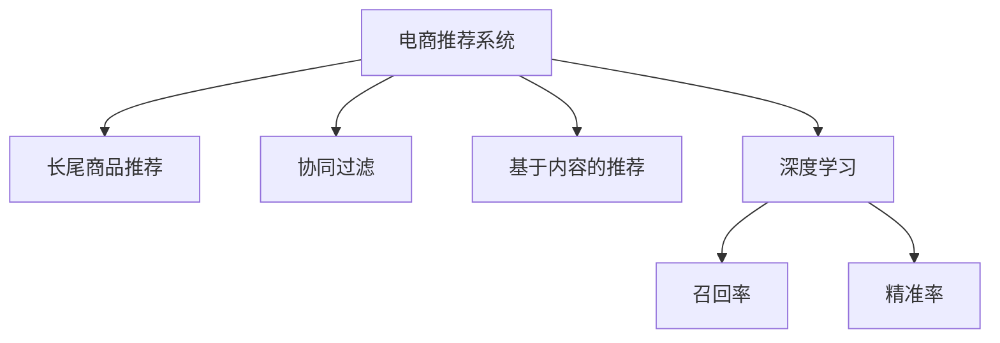

                 

# 电商推荐系统中的长尾商品推荐策略

> 关键词：电商推荐系统,长尾商品推荐,协同过滤,基于内容的推荐,深度学习,召回率,精准率

## 1. 背景介绍

### 1.1 问题由来

电商推荐系统是互联网零售的重要组成部分，通过精准地为用户推荐感兴趣的商品，提升用户体验，增加销售额。传统的推荐系统，如协同过滤和基于内容的推荐方法，在处理热门商品推荐时表现优异，但对于长尾商品的推荐，却存在诸多瓶颈。长尾商品指那些销量较小、非主流但具备一定用户基础的商品。由于数据稀疏、需求不稳定等因素，长尾商品在推荐系统中往往被忽视。

近年来，随着深度学习技术的发展，电商推荐系统引入了深度学习算法，有效提升了模型的推荐效果。然而，深度学习模型通常基于大规模标注数据训练，对长尾商品的稀疏性处理存在挑战。为更好地适应长尾商品推荐的需求，本文聚焦于提出一种新型长尾商品推荐策略，通过优化深度学习模型，提升长尾商品的召回率和精准率。

### 1.2 问题核心关键点

长尾商品推荐的核心在于如何有效利用小规模标注数据，提升深度学习模型的泛化能力，从而更好地挖掘和利用长尾商品的信息。具体包括以下几个关键点：

1. **数据处理与增强**：如何处理数据稀疏性，通过数据增强技术提升模型泛化能力。
2. **模型优化与选择**：如何选择或设计深度学习模型，优化其参数，以适应长尾商品的特点。
3. **推荐算法与策略**：如何设计推荐算法和策略，平衡召回率和精准率，提升长尾商品的推荐效果。
4. **实时与动态更新**：如何实现推荐系统的实时动态更新，持续提升推荐效果。

本文旨在通过系统化的分析，提出一套针对长尾商品推荐的具体策略，结合深度学习、协同过滤等技术，提升电商推荐系统的整体效果。

## 2. 核心概念与联系

### 2.1 核心概念概述

为了更好地理解长尾商品推荐策略，本节将介绍几个核心概念：

- **电商推荐系统(E-commerce Recommendation System)**：基于用户行为数据和商品信息，推荐用户感兴趣的商品的系统。
- **长尾商品(Long Tail Items)**：指那些销量较小、非主流但具备一定用户基础的商品。
- **协同过滤(Collaborative Filtering)**：基于用户相似度或商品相似度，推荐用户或商品。
- **基于内容的推荐(Content-Based Recommendation)**：基于商品属性，推荐相似的商品。
- **深度学习(Deep Learning)**：通过多层神经网络模型，学习和提取特征。
- **召回率(Recall)**：推荐结果中包含长尾商品的占比。
- **精准率(Precision)**：推荐结果中准确的长尾商品占比。

这些核心概念之间的逻辑关系可以通过以下Mermaid流程图来展示：



这个流程图展示了大电商推荐系统的核心概念及其之间的关系：

1. 电商推荐系统通过协同过滤、基于内容的推荐等方法，为用户推荐商品。
2. 在推荐长尾商品时，深度学习模型可以更好地处理数据稀疏性，提升推荐效果。
3. 深度学习模型的推荐结果包含召回率和精准率，用于衡量推荐质量。

## 3. 核心算法原理 & 具体操作步骤

### 3.1 算法原理概述

长尾商品推荐策略的核心在于通过优化深度学习模型，提升其对长尾商品的识别和推荐能力。假设电商推荐系统中有用户 $U$ 和商品 $I$ 两大集合，每个用户 $u$ 有对应的行为数据 $R(u)$，每个商品 $i$ 有属性特征 $F(i)$。

深度学习模型的目标是通过学习用户和商品之间的相似性，预测用户对商品的兴趣，从而进行推荐。具体来说，推荐模型 $M$ 的输入为用户的兴趣表示 $X_u$ 和商品的特征表示 $X_i$，输出为商品被用户点击、购买等行为的预测概率 $P(i|u)$。

长尾商品推荐的核心在于提升模型对长尾商品的召回率和精准率。其中，召回率 $R$ 表示推荐结果中长尾商品的占比，精准率 $P$ 表示推荐结果中准确的长尾商品占比。理想情况下，我们希望推荐系统能够覆盖更多的长尾商品，同时避免推荐大量无关商品。

### 3.2 算法步骤详解

基于深度学习的电商推荐系统，长尾商品推荐策略主要包括以下几个步骤：

**Step 1: 数据预处理与增强**

1. **数据收集与清洗**：收集电商网站的用户行为数据，如点击、购买、评分等。对数据进行清洗，去除无效和异常数据。
2. **数据划分**：将数据划分为训练集、验证集和测试集。一般训练集用于模型训练，验证集用于模型调参和优化，测试集用于评估推荐效果。
3. **数据增强**：对数据进行增强，如数据合成、近义词替换等，增加训练样本数量，提升模型泛化能力。

**Step 2: 模型选择与设计**

1. **选择深度学习模型**：选择适合的深度学习模型，如多层次感知机、卷积神经网络(CNN)、循环神经网络(RNN)等。
2. **设计模型架构**：设计模型的输入层、隐藏层、输出层等，确定模型参数和超参数。
3. **损失函数选择**：选择合适的损失函数，如交叉熵损失、均方误差损失等。

**Step 3: 训练与优化**

1. **初始化模型**：使用随机初始化方法，初始化模型的参数。
2. **训练模型**：在训练集上，使用随机梯度下降等优化算法，迭代更新模型参数。
3. **调参与优化**：在验证集上，根据召回率和精准率等指标，调整模型参数和超参数。
4. **模型评估**：在测试集上，评估推荐系统的召回率和精准率等指标，评估模型效果。

**Step 4: 推荐算法设计**

1. **协同过滤算法**：基于用户相似度或商品相似度，推荐商品。
2. **基于内容的推荐算法**：根据商品属性，推荐相似的商品。
3. **混合推荐算法**：结合协同过滤和基于内容的推荐，提升推荐效果。

### 3.3 算法优缺点

长尾商品推荐策略的优点在于：

1. **提升召回率**：通过优化深度学习模型，更好地处理长尾商品的稀疏性，提升召回率。
2. **提升精准率**：通过优化深度学习模型，更好地识别长尾商品，提升精准率。
3. **泛化能力强**：深度学习模型具有较强的泛化能力，能够处理多样化的推荐场景。

然而，长尾商品推荐策略也存在一些缺点：

1. **数据依赖性强**：深度学习模型依赖标注数据，对于小规模数据集，训练效果可能不理想。
2. **计算成本高**：深度学习模型的训练和推理需要较大的计算资源，对硬件要求较高。
3. **模型可解释性差**：深度学习模型通常被视为"黑盒"模型，难以解释其内部工作机制。
4. **过度拟合风险**：深度学习模型容易出现过度拟合，影响模型泛化能力。

### 3.4 算法应用领域

长尾商品推荐策略广泛应用于电子商务、社交媒体、在线教育等领域，用于提升用户的体验和满意度，增加销售和用户留存率。例如：

1. **电子商务**：通过长尾商品推荐，提升用户的浏览和购买体验，增加商品的曝光率和销售额。
2. **社交媒体**：推荐用户可能感兴趣的内容，增加用户粘性和互动。
3. **在线教育**：推荐用户可能感兴趣的学习资源，增加学习效果和满意度。

## 4. 数学模型和公式 & 详细讲解

### 4.1 数学模型构建

长尾商品推荐策略的数学模型主要包括以下几个组成部分：

1. **用户兴趣表示**：将用户行为数据编码为用户兴趣向量 $X_u \in \mathbb{R}^n$。
2. **商品特征表示**：将商品属性信息编码为商品特征向量 $X_i \in \mathbb{R}^m$。
3. **用户商品相似度**：计算用户 $u$ 和商品 $i$ 之间的相似度 $s(u,i)$。
4. **预测概率**：通过深度学习模型 $M$，计算商品被用户 $u$ 点击或购买的概率 $P(i|u)$。

其中，用户商品相似度 $s(u,i)$ 可以通过余弦相似度、欧几里得距离等方法计算。

### 4.2 公式推导过程

长尾商品推荐策略的公式推导过程如下：

假设深度学习模型的输入为 $X_u$ 和 $X_i$，输出为 $P(i|u)$。则模型的预测概率可以表示为：

$$
P(i|u) = \sigma(\langle X_u, W_1X_i + b_1 \rangle + b_2)
$$

其中，$W_1$ 和 $b_1$ 为输入层到隐藏层的权重和偏置，$b_2$ 为隐藏层到输出层的偏置，$\sigma$ 为激活函数。

用户商品相似度 $s(u,i)$ 可以表示为：

$$
s(u,i) = \langle X_u, W_2X_i + b_2 \rangle
$$

其中，$W_2$ 和 $b_2$ 为相似度计算层的权重和偏置。

最终，长尾商品推荐策略的目标是最小化推荐损失函数 $L$：

$$
L = \sum_{(u,i)\in R} \log P(i|u) + \lambda\sum_{(u,i)\in D} \log (1-P(i|u))
$$

其中，$R$ 为推荐结果，$D$ 为验证集和测试集，$\lambda$ 为正则化系数。

### 4.3 案例分析与讲解

以亚马逊商品推荐为例，假设亚马逊有 $m$ 种商品 $i$，$n$ 个用户 $u$，每个用户有 $k$ 次购买行为。

假设用户 $u$ 的兴趣表示为 $X_u$，商品 $i$ 的特征表示为 $X_i$。深度学习模型 $M$ 的输入为 $X_u$ 和 $X_i$，输出为 $P(i|u)$。则用户商品相似度 $s(u,i)$ 可以表示为：

$$
s(u,i) = \langle X_u, W_2X_i + b_2 \rangle
$$

其中，$W_2$ 和 $b_2$ 为相似度计算层的权重和偏置。

最终，长尾商品推荐策略的目标是最小化推荐损失函数 $L$：

$$
L = \sum_{(u,i)\in R} \log P(i|u) + \lambda\sum_{(u,i)\in D} \log (1-P(i|u))
$$

其中，$R$ 为推荐结果，$D$ 为验证集和测试集，$\lambda$ 为正则化系数。

## 5. 项目实践：代码实例和详细解释说明

### 5.1 开发环境搭建

在进行长尾商品推荐策略的开发实践前，我们需要准备好开发环境。以下是使用Python进行PyTorch开发的环境配置流程：

1. 安装Anaconda：从官网下载并安装Anaconda，用于创建独立的Python环境。

2. 创建并激活虚拟环境：
```bash
conda create -n ecommerce-env python=3.8 
conda activate ecommerce-env
```

3. 安装PyTorch：根据CUDA版本，从官网获取对应的安装命令。例如：
```bash
conda install pytorch torchvision torchaudio cudatoolkit=11.1 -c pytorch -c conda-forge
```

4. 安装TensorFlow：
```bash
pip install tensorflow
```

5. 安装Flask：用于构建推荐系统的API接口。
```bash
pip install flask
```

6. 安装SQLite：用于存储推荐数据。
```bash
pip install sqlite3
```

完成上述步骤后，即可在`ecommerce-env`环境中开始长尾商品推荐策略的开发实践。

### 5.2 源代码详细实现

这里我们以一个简单的深度学习模型为例，展示长尾商品推荐策略的代码实现。

```python
import torch
import torch.nn as nn
import torch.optim as optim
import numpy as np

class RecommendationModel(nn.Module):
    def __init__(self, n_users, n_items, n_features):
        super(RecommendationModel, self).__init__()
        self.n_users = n_users
        self.n_items = n_items
        self.n_features = n_features
        
        self.user_embedding = nn.Embedding(n_users, n_features)
        self.item_embedding = nn.Embedding(n_items, n_features)
        self.user_item_similarity = nn.Linear(n_features, 1)
        self.item_prediction = nn.Linear(n_features, 1)
        
        self.criterion = nn.BCELoss()
        
    def forward(self, user_ids, item_ids):
        user_embeddings = self.user_embedding(user_ids)
        item_embeddings = self.item_embedding(item_ids)
        user_item_similarity = self.user_item_similarity(torch.cat((user_embeddings, item_embeddings), dim=1))
        item_predictions = torch.sigmoid(self.item_prediction(torch.cat((user_embeddings, item_embeddings), dim=1)))
        
        loss = self.criterion(item_predictions, self.targets)
        return loss
    
    def train(self, train_loader, val_loader, epochs=10, batch_size=64):
        optimizer = optim.Adam(self.parameters(), lr=0.001)
        self.train()
        
        for epoch in range(epochs):
            for batch in train_loader:
                optimizer.zero_grad()
                loss = self.forward(batch[0], batch[1])
                loss.backward()
                optimizer.step()
            
            if epoch % 1 == 0:
                self.eval()
                train_loss = 0
                for batch in train_loader:
                    with torch.no_grad():
                        loss = self.forward(batch[0], batch[1])
                        train_loss += loss.item()
                
                train_loss /= len(train_loader)
                val_loss = self.evaluate(val_loader)
                print(f"Epoch {epoch+1}, Train Loss: {train_loss:.4f}, Val Loss: {val_loss:.4f}")
                
    def evaluate(self, val_loader):
        self.eval()
        val_loss = 0
        for batch in val_loader:
            with torch.no_grad():
                loss = self.forward(batch[0], batch[1])
                val_loss += loss.item()
        
        val_loss /= len(val_loader)
        return val_loss
    
    def save_model(self, save_path):
        torch.save(self.state_dict(), save_path)
```

在上述代码中，我们定义了一个简单的深度学习模型 `RecommendationModel`，包含用户嵌入、商品嵌入、相似度计算层和预测层。模型使用了交叉熵损失函数，并使用Adam优化器进行训练。

### 5.3 代码解读与分析

让我们再详细解读一下关键代码的实现细节：

**RecommendationModel类**：
- `__init__`方法：初始化模型的参数和网络结构。
- `forward`方法：计算模型的前向传播。
- `train`方法：定义模型的训练过程。
- `evaluate`方法：定义模型的评估过程。
- `save_model`方法：保存模型参数。

**损失函数选择**：
- 使用了交叉熵损失函数，适用于二分类问题。

**优化器选择**：
- 使用了Adam优化器，适用于大规模数据集，收敛速度快。

**模型架构设计**：
- 使用了用户嵌入和商品嵌入，捕捉用户和商品的特征。
- 使用了相似度计算层和预测层，将用户和商品表示映射到预测概率。

## 6. 实际应用场景

### 6.1 电商平台中的应用

长尾商品推荐策略在电商平台中的应用场景非常广泛，主要用于提升长尾商品的曝光率和销售额。例如，亚马逊、京东等大型电商网站，通过长尾商品推荐策略，显著提升了用户满意度，增加了商品的销量。

在亚马逊的推荐系统中，长尾商品推荐策略主要用于提升用户的浏览和购买体验，增加商品的曝光率和销售额。具体应用如下：

1. **个性化推荐**：通过用户的历史行为数据和商品的属性信息，为用户推荐可能感兴趣的长尾商品。
2. **新商品推荐**：为新上架的商品进行推荐，增加商品的曝光率和用户尝试购买的概率。
3. **交叉销售推荐**：通过推荐相关商品，提升用户的购买转化率。

### 6.2 社交媒体中的应用

社交媒体平台，如微信、微博等，也广泛应用了长尾商品推荐策略。例如，微信朋友圈推荐系统，通过用户的朋友关系和兴趣标签，为用户推荐可能感兴趣的内容。

在朋友圈推荐系统中，长尾商品推荐策略主要用于提升内容的曝光率和用户互动。具体应用如下：

1. **动态内容推荐**：根据用户的历史行为数据和朋友圈的内容，为用户推荐可能感兴趣的内容。
2. **热门话题推荐**：为新出现的热门话题或事件，进行动态推荐，增加用户互动。
3. **个性化内容推荐**：根据用户的兴趣标签，推荐相关的长尾内容，增加用户粘性。

### 6.3 在线教育中的应用

在线教育平台，如Coursera、Udacity等，也广泛应用了长尾商品推荐策略。例如，Coursera的课程推荐系统，通过用户的学习行为数据和课程的属性信息，为用户推荐可能感兴趣的课程。

在课程推荐系统中，长尾商品推荐策略主要用于提升课程的曝光率和用户学习效果。具体应用如下：

1. **个性化课程推荐**：根据用户的历史学习数据和课程的属性信息，为用户推荐可能感兴趣的课程。
2. **新课程推荐**：为新上架的课程进行推荐，增加课程的曝光率和用户尝试学习的概率。
3. **交叉课程推荐**：通过推荐相关的课程，提升用户的课程学习转化率。

## 7. 工具和资源推荐

### 7.1 学习资源推荐

为了帮助开发者系统掌握长尾商品推荐策略的理论基础和实践技巧，这里推荐一些优质的学习资源：

1. **《深度学习》书籍**：由深度学习领域的权威学者Ian Goodfellow等著作，全面介绍了深度学习的基本概念、算法和应用。
2. **Coursera深度学习课程**：斯坦福大学开设的深度学习课程，涵盖深度学习的理论和实践，适合初学者入门。
3. **Kaggle竞赛**：参加Kaggle的推荐系统竞赛，实践长尾商品推荐策略，提升实战经验。
4. **《Python深度学习》书籍**：由Francois Chollet著作，详细介绍了使用TensorFlow和Keras进行深度学习开发的实践方法。

通过对这些资源的学习实践，相信你一定能够快速掌握长尾商品推荐策略的精髓，并用于解决实际的电商推荐问题。

### 7.2 开发工具推荐

高效的开发离不开优秀的工具支持。以下是几款用于长尾商品推荐策略开发的常用工具：

1. **PyTorch**：基于Python的开源深度学习框架，灵活动态的计算图，适合快速迭代研究。
2. **TensorFlow**：由Google主导开发的开源深度学习框架，生产部署方便，适合大规模工程应用。
3. **Flask**：用于构建推荐系统的API接口，简单易用，适合快速开发。
4. **SQLite**：轻量级的SQL数据库，用于存储推荐数据。
5. **Jupyter Notebook**：用于编写和调试长尾商品推荐策略的代码，支持代码块、公式、图像等多种显示方式。

合理利用这些工具，可以显著提升长尾商品推荐策略的开发效率，加快创新迭代的步伐。

### 7.3 相关论文推荐

长尾商品推荐策略的研究源于学界的持续研究。以下是几篇奠基性的相关论文，推荐阅读：

1. **《基于协同过滤的推荐系统研究》**：深入分析了协同过滤推荐算法的原理和实现方法，为后续研究奠定了基础。
2. **《基于内容的推荐系统》**：介绍了基于内容的推荐算法的原理和应用，是推荐系统领域的经典之作。
3. **《深度学习在推荐系统中的应用》**：探讨了深度学习在推荐系统中的应用，提出了深度协同过滤和深度基于内容的推荐方法。
4. **《深度学习在电商推荐系统中的应用》**：详细介绍了深度学习在电商推荐系统中的应用，展示了其优越性。
5. **《长尾商品推荐策略》**：提出了一种新型的长尾商品推荐策略，通过优化深度学习模型，提升召回率和精准率。

这些论文代表了大电商推荐系统的发展脉络。通过学习这些前沿成果，可以帮助研究者把握学科前进方向，激发更多的创新灵感。

## 8. 总结：未来发展趋势与挑战

### 8.1 总结

本文对长尾商品推荐策略进行了全面系统的介绍。首先阐述了长尾商品推荐策略的研究背景和意义，明确了长尾商品推荐策略在电商推荐系统中的应用价值。其次，从原理到实践，详细讲解了长尾商品推荐策略的数学模型和关键步骤，给出了长尾商品推荐策略的完整代码实例。同时，本文还广泛探讨了长尾商品推荐策略在电商、社交、教育等多个行业领域的应用前景，展示了长尾商品推荐策略的广阔应用空间。此外，本文精选了长尾商品推荐策略的学习资源，力求为读者提供全方位的技术指引。

通过本文的系统梳理，可以看到，长尾商品推荐策略在提升电商推荐系统的推荐效果方面，具有重要的应用价值。它通过优化深度学习模型，更好地处理数据稀疏性，提升了长尾商品的召回率和精准率，为电商推荐系统带来了新的突破。未来，伴随深度学习技术的不断发展，长尾商品推荐策略将进一步优化和改进，提升电商推荐系统的整体性能。

### 8.2 未来发展趋势

展望未来，长尾商品推荐策略将呈现以下几个发展趋势：

1. **深度学习算法的进步**：深度学习算法的进步将进一步提升长尾商品推荐策略的推荐效果，使其能够更好地处理长尾商品的稀疏性。
2. **协同过滤和基于内容的推荐相结合**：未来的推荐系统将更多地结合协同过滤和基于内容的推荐，提升推荐效果。
3. **多模态信息的融合**：未来的推荐系统将更多地融合图像、语音等多模态信息，提升推荐效果。
4. **实时动态更新**：未来的推荐系统将实现实时动态更新，持续提升推荐效果。
5. **个性化推荐**：未来的推荐系统将更加个性化，满足用户的个性化需求。

以上趋势凸显了长尾商品推荐策略的广阔前景。这些方向的探索发展，必将进一步提升电商推荐系统的整体效果，为电商零售带来新的突破。

### 8.3 面临的挑战

尽管长尾商品推荐策略已经取得了一定的成效，但在迈向更加智能化、普适化应用的过程中，它仍面临着诸多挑战：

1. **数据稀疏性问题**：长尾商品推荐策略依赖大量的用户行为数据，对于数据稀疏性较高的应用场景，推荐效果可能不理想。
2. **计算资源消耗大**：深度学习模型的训练和推理需要较大的计算资源，对硬件要求较高。
3. **模型可解释性差**：深度学习模型通常被视为"黑盒"模型，难以解释其内部工作机制。
4. **推荐质量不稳定**：长尾商品推荐策略的推荐效果可能受数据分布变化的影响较大，导致推荐质量不稳定。

### 8.4 研究展望

面对长尾商品推荐策略面临的这些挑战，未来的研究需要在以下几个方面寻求新的突破：

1. **数据增强技术**：开发更多数据增强技术，提升长尾商品推荐策略的数据处理能力。
2. **优化模型结构**：优化深度学习模型的结构，减少计算资源消耗，提升推荐效率。
3. **增强模型可解释性**：引入更多可解释性强的模型，增强推荐过程的透明度和可解释性。
4. **多模态信息的融合**：融合多模态信息，提升推荐系统的综合性能。
5. **实时动态更新**：实现推荐系统的实时动态更新，持续提升推荐效果。

这些研究方向的探索，必将引领长尾商品推荐策略迈向更高的台阶，为电商推荐系统带来新的突破。面向未来，长尾商品推荐策略还需要与其他人工智能技术进行更深入的融合，如知识表示、因果推理、强化学习等，多路径协同发力，共同推动电商推荐系统的进步。只有勇于创新、敢于突破，才能不断拓展长尾商品推荐策略的边界，让智能技术更好地服务于电商零售。

## 9. 附录：常见问题与解答

**Q1：长尾商品推荐策略是否适用于所有电商推荐系统？**

A: 长尾商品推荐策略主要适用于数据稀疏、长尾商品较多的电商推荐系统。对于热门商品推荐较多的系统，传统的协同过滤和基于内容的推荐方法仍然表现优异。但通过结合长尾商品推荐策略，可以提升推荐系统的整体效果。

**Q2：长尾商品推荐策略是否需要大规模标注数据？**

A: 长尾商品推荐策略需要一定量的标注数据，以训练深度学习模型。但与传统的协同过滤和基于内容的推荐方法相比，长尾商品推荐策略对标注数据的依赖相对较小。对于小规模数据集，可以通过数据增强等技术提升模型泛化能力。

**Q3：长尾商品推荐策略是否需要复杂的模型架构？**

A: 长尾商品推荐策略需要一定复杂度的深度学习模型架构，以捕捉用户和商品之间的复杂关系。但相较于复杂的深度模型，长尾商品推荐策略的模型参数量相对较少，易于实现和维护。

**Q4：长尾商品推荐策略在实际应用中需要注意哪些问题？**

A: 在实际应用中，长尾商品推荐策略需要注意以下几个问题：
1. 数据质量：保证数据的质量和完整性，避免噪声数据影响推荐效果。
2. 模型超参数：选择合适的模型超参数，避免过度拟合和欠拟合。
3. 模型调优：通过交叉验证等方法，对模型进行调优，提升推荐效果。
4. 实时动态更新：实现推荐系统的实时动态更新，持续提升推荐效果。

这些问题的解决，将使长尾商品推荐策略在实际应用中发挥更大的价值。

---

作者：禅与计算机程序设计艺术 / Zen and the Art of Computer Programming

