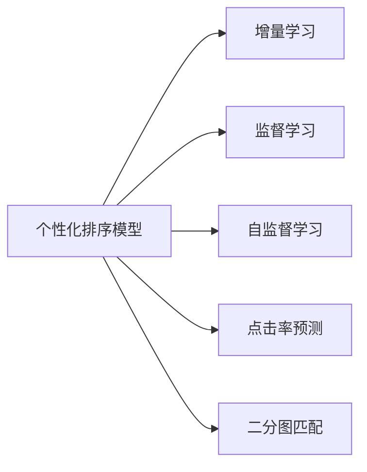

                 

## 1. 背景介绍

随着互联网电商市场的迅速发展，在线购物已成为一种重要的消费模式。用户对商品搜索结果的质量要求不断提高，如何提高搜索结果的相关性和个性化，成为了电商搜索系统的重要课题。个性化搜索排序模型能在短时间内为用户提供符合其兴趣偏好的搜索结果，显著提升用户体验和平台转化率。

当前，大多数电商搜索系统依赖于深度学习模型进行个性化排序，但随着用户数据量的持续增长和业务场景的多样化，模型不断更新迭代成为必然趋势。如何在大规模数据和实时性需求下，高效地对排序模型进行增量学习，是电商搜索系统面临的重要挑战。

本文将介绍一种基于增量学习的电商搜索排序模型，通过小批量数据更新，实现模型参数的有效迭代。该方法不仅提高了模型的实时响应能力，还大大降低了增量学习的时间和计算成本，具有广泛的应用前景。

## 2. 核心概念与联系

### 2.1 核心概念概述

为更好地理解电商搜索中的个性化排序模型增量学习，本节将介绍几个密切相关的核心概念：

- **个性化排序模型**：基于用户行为数据和商品属性信息，对搜索结果进行排序，提升用户体验和搜索效率。常用的排序模型包括基于深度学习的排序模型和基于协同过滤的排序模型。

- **增量学习**：在已有模型基础上，使用小批量新增数据进行模型更新，避免大规模数据重训练，具有低成本、高效率的优势。

- **监督学习**：使用标注数据训练模型，使其能够对给定输入预测正确输出，常用于分类、回归等任务。

- **自监督学习**：使用无标签数据训练模型，如掩码语言模型等，常用于预训练和特征提取。

- **点击率预测**：通过排序模型预测用户点击商品的概率，用于评估模型效果和优化搜索排序策略。

- **二分图匹配**：将用户和商品看作两个节点，利用匹配算法优化搜索排序效果，如Pagerank算法、贪心算法等。

这些核心概念之间的逻辑关系可以通过以下Mermaid流程图来展示：



这个流程图展示了个性化排序模型增量学习的基本构成：

1. 个性化排序模型结合了监督学习、自监督学习、点击率预测和二分图匹配等方法，构建排序算法。
2. 增量学习利用小批量数据，对排序模型进行快速更新，提高模型实时响应能力。

## 3. 核心算法原理 & 具体操作步骤
### 3.1 算法原理概述

个性化搜索排序模型增量学习主要基于在线学习算法，通过小批量数据更新模型参数，实现高效在线预测和实时排序。其主要算法流程如下：

1. 加载现有排序模型参数。
2. 从数据流中获取小批量数据。
3. 使用小批量数据更新模型参数。
4. 利用更新后的模型对新样本进行预测。

该算法过程的核心在于如何高效地更新模型参数，确保模型在每次数据更新后能够快速适应新数据，同时保持原有的预测能力。

### 3.2 算法步骤详解

以下是对算法步骤的详细介绍：

**Step 1: 数据准备**

- 准备现有排序模型，包括模型架构和当前参数。
- 从数据流中按顺序抽取小批量数据，每个样本包含用户ID、商品ID、点击行为等。
- 定义训练集和测试集，其中训练集用于模型更新，测试集用于评估模型性能。

**Step 2: 模型初始化**

- 加载排序模型，设定模型输入和输出。
- 初始化模型参数，如权重、偏置等。
- 确定学习率 $\eta$ 和其他超参数。

**Step 3: 小批量数据更新**

- 从小批量数据中随机抽取一小部分数据，作为当前样本集 $S_t$。
- 使用当前模型对样本集 $S_t$ 进行预测，得到预测点击率 $\hat{C}_t$。
- 计算当前样本集的实际点击率 $C_t$。
- 根据实际点击率和预测点击率，计算损失函数 $L_t$，如交叉熵损失。
- 使用梯度下降算法更新模型参数。

**Step 4: 模型评估**

- 在测试集上使用更新后的模型进行预测，得到测试集点击率 $\hat{C}_{test}$。
- 计算测试集实际点击率 $C_{test}$。
- 计算测试集上的平均点击率 $R_{test}$。
- 评估模型的平均点击率 $R_{model}$ 与测试集平均点击率 $R_{test}$ 的差异，以评估模型性能。

**Step 5: 模型调整**

- 根据模型评估结果，调整模型参数和学习率。
- 对测试集上的数据进行重新测试，确保模型性能稳定。
- 持续更新模型，直至达到预设的迭代轮数或模型性能满足要求。

### 3.3 算法优缺点

个性化搜索排序模型增量学习具有以下优点：

1. 高效实时。通过小批量数据更新，模型能够快速适应新数据，实现实时预测和排序。
2. 低成本。相比全量数据重训练，增量学习不需要大规模数据集，节省了存储空间和计算资源。
3. 模型效果稳定。增量学习通过小批量数据更新，模型参数更新幅度小，模型效果较为稳定。

同时，该方法也存在一些局限性：

1. 数据更新不均衡。小批量数据更新可能导致模型参数更新不均衡，影响模型性能。
2. 模型泛化能力不足。增量学习依赖于历史数据分布，对于新领域的数据适应性较弱。
3. 模型计算复杂。增量学习需要不断更新模型参数，计算复杂度较高。

尽管存在这些局限性，但在大规模数据和实时性需求下，增量学习仍然是电商搜索排序模型的有效选择。未来相关研究的重点在于如何优化数据更新策略，增强模型泛化能力，降低计算复杂度，进一步提升模型性能。

### 3.4 算法应用领域

个性化搜索排序模型增量学习在电商搜索系统中有着广泛的应用场景，例如：

- **搜索排序**：对用户搜索关键词结果进行排序，提升搜索结果的相关性和个性化。
- **广告投放**：根据用户点击行为和兴趣，推荐个性化广告，提高广告点击率和转化率。
- **推荐系统**：根据用户历史行为，推荐个性化商品，提升用户购买率和满意度。
- **个性化推荐**：根据用户行为和属性，推荐个性化内容，如新闻、视频等，提升用户粘性。
- **实时监控**：对用户搜索行为进行实时监控，及时发现异常行为，提升平台安全性和用户信任度。

除了上述这些经典场景外，增量学习还适用于更多需要快速适应新数据的系统，如智能客服、实时分析等，为电商搜索系统的智能化和高效化提供了新的解决方案。

## 4. 数学模型和公式 & 详细讲解 & 举例说明

### 4.1 数学模型构建

本节将使用数学语言对基于增量学习的个性化搜索排序模型进行严格的刻画。

记现有排序模型为 $M_{\theta}$，其中 $\theta$ 为模型参数。假设新获取的小批量数据为 $S_t = \{(x_i, y_i)\}_{i=1}^{n_t}$，其中 $x_i$ 为输入特征，$y_i$ 为点击标签。设点击率预测函数为 $f_\theta(x)$，损失函数为 $L(y, f_\theta(x))$。

### 4.2 公式推导过程

以二分类问题为例，假设点击率为二分类问题，$y_i \in \{0, 1\}$，点击率为 $y_i$ 的概率 $p(y_i=1|x_i)$。则损失函数可定义为：

$$
L(y_i, f_\theta(x_i)) = -(y_i \log f_\theta(x_i) + (1-y_i) \log (1-f_\theta(x_i)))
$$

其中 $f_\theta(x_i)$ 为模型输出，即预测的点击率。

在每次数据更新时，根据小批量数据 $S_t$，计算损失函数 $L_t$，并使用梯度下降算法更新模型参数：

$$
\theta \leftarrow \theta - \eta \nabla_{\theta} L_t
$$

其中 $\eta$ 为学习率，$\nabla_{\theta} L_t$ 为损失函数对模型参数的梯度。

### 4.3 案例分析与讲解

以点击率预测为例，考虑一个简单的二分类问题，假设用户ID为 $x_1 = 1$，商品ID为 $x_2 = 2$，点击标签为 $y_1 = 1$，则点击率为 $y_2 = 0$。根据当前模型 $M_{\theta}$，计算预测点击率 $f_\theta(x_1)$，得到：

$$
f_\theta(x_1) = \frac{1}{1+\exp(-z_1)}
$$

其中 $z_1 = w_1 \cdot x_1 + b_1$，$w_1$ 为权重，$b_1$ 为偏置。

计算损失函数 $L(y_1, f_\theta(x_1))$：

$$
L(y_1, f_\theta(x_1)) = -y_1 \log f_\theta(x_1) - (1-y_1) \log (1-f_\theta(x_1))
$$

计算梯度 $\nabla_{\theta} L_t$：

$$
\nabla_{\theta} L_t = \sum_{i=1}^{n_t} \frac{\partial L(y_i, f_\theta(x_i))}{\partial \theta}
$$

其中：

$$
\frac{\partial L(y_i, f_\theta(x_i))}{\partial w_1} = y_i \cdot (f_\theta(x_i) - 1) + (1-y_i) \cdot f_\theta(x_i)
$$

$$
\frac{\partial L(y_i, f_\theta(x_i))}{\partial b_1} = y_i - f_\theta(x_i)
$$

使用梯度下降算法更新模型参数：

$$
w_1 \leftarrow w_1 - \eta \sum_{i=1}^{n_t} \frac{\partial L(y_i, f_\theta(x_i))}{\partial w_1}
$$

$$
b_1 \leftarrow b_1 - \eta \sum_{i=1}^{n_t} \frac{\partial L(y_i, f_\theta(x_i))}{\partial b_1}
$$

通过以上步骤，模型可以逐步适应新数据，提升预测准确度。

## 5. 项目实践：代码实例和详细解释说明
### 5.1 开发环境搭建

在进行增量学习实践前，我们需要准备好开发环境。以下是使用Python进行TensorFlow开发的环境配置流程：

1. 安装Anaconda：从官网下载并安装Anaconda，用于创建独立的Python环境。

2. 创建并激活虚拟环境：
```bash
conda create -n tf-env python=3.8 
conda activate tf-env
```

3. 安装TensorFlow：根据CUDA版本，从官网获取对应的安装命令。例如：
```bash
pip install tensorflow tensorflow==2.6.0
```

4. 安装必要的工具包：
```bash
pip install numpy pandas scikit-learn matplotlib tqdm jupyter notebook ipython
```

完成上述步骤后，即可在`tf-env`环境中开始增量学习实践。

### 5.2 源代码详细实现

下面我们以点击率预测任务为例，给出使用TensorFlow对排序模型进行增量学习的PyTorch代码实现。

首先，定义模型和损失函数：

```python
import tensorflow as tf

class SortingModel(tf.keras.Model):
    def __init__(self, input_dim, output_dim):
        super(SortingModel, self).__init__()
        self.dense1 = tf.keras.layers.Dense(32, activation='relu')
        self.dense2 = tf.keras.layers.Dense(output_dim, activation='sigmoid')
        
    def call(self, inputs):
        x = self.dense1(inputs)
        x = self.dense2(x)
        return x

def binary_crossentropy(y_true, y_pred):
    return tf.keras.losses.BinaryCrossentropy(from_logits=True)(y_true, y_pred)

# 加载现有排序模型
model = SortingModel(input_dim=4, output_dim=1)
model.load_weights('model_weights.h5')
```

然后，定义数据生成器和数据预处理函数：

```python
import numpy as np

def generate_data(n_samples=1000):
    np.random.seed(0)
    X = np.random.rand(n_samples, 4)
    y = np.random.randint(2, size=n_samples)
    return X, y

def preprocess_data(X):
    return X / 10.0

def next_minibatch(X, y, batch_size):
    indices = np.random.permutation(X.shape[0])
    X = X[indices]
    y = y[indices]
    for i in range(0, X.shape[0], batch_size):
        batch_X = X[i:i+batch_size]
        batch_y = y[i:i+batch_size]
        yield batch_X, batch_y

# 生成数据并预处理
X, y = generate_data()
X = preprocess_data(X)

# 定义小批量大小
batch_size = 16

# 定义数据生成器
generator = next_minibatch(X, y, batch_size)
```

接着，定义训练和评估函数：

```python
def train_epoch(model, data_generator, optimizer, loss_fn):
    model.train()
    epoch_loss = 0
    for batch_X, batch_y in data_generator:
        with tf.GradientTape() as tape:
            y_pred = model(batch_X)
            loss = loss_fn(batch_y, y_pred)
        grads = tape.gradient(loss, model.trainable_variables)
        optimizer.apply_gradients(zip(grads, model.trainable_variables))
        epoch_loss += loss
    return epoch_loss / len(data_generator)

def evaluate(model, X_test, y_test, batch_size):
    model.eval()
    test_loss = 0
    for batch_X, batch_y in next_minibatch(X_test, y_test, batch_size):
        y_pred = model(batch_X)
        test_loss += binary_crossentropy(batch_y, y_pred)
    return test_loss / len(X_test)

# 定义优化器
optimizer = tf.keras.optimizers.Adam(learning_rate=0.001)

# 训练模型
epochs = 10
for epoch in range(epochs):
    epoch_loss = train_epoch(model, generator, optimizer, binary_crossentropy)
    print(f"Epoch {epoch+1}, train loss: {epoch_loss:.4f}")
    
    # 在测试集上评估模型
    X_test, y_test = generate_data()
    X_test = preprocess_data(X_test)
    test_loss = evaluate(model, X_test, y_test, batch_size)
    print(f"Epoch {epoch+1}, test loss: {test_loss:.4f}")
```

以上就是使用TensorFlow对排序模型进行增量学习的完整代码实现。可以看到，通过定义数据生成器，可以灵活地从数据流中抽取小批量数据，实现高效增量学习。

### 5.3 代码解读与分析

让我们再详细解读一下关键代码的实现细节：

**SortingModel类**：
- `__init__`方法：初始化模型，包括输入和输出层的定义。
- `call`方法：定义模型的前向传播过程。

**binary_crossentropy函数**：
- 定义二分类交叉熵损失函数，用于计算模型的预测点击率与真实标签的误差。

**训练和评估函数**：
- `train_epoch`函数：在每个epoch内，循环迭代小批量数据，使用梯度下降算法更新模型参数，并计算损失函数。
- `evaluate`函数：在测试集上评估模型性能，计算损失函数。

**训练流程**：
- 定义总迭代轮数和批量大小，开始循环迭代。
- 每个epoch内，先在训练集上进行模型训练，输出平均损失。
- 在测试集上评估模型性能，输出测试损失。
- 所有epoch结束后，将模型保存为模型文件。

可以看到，通过灵活定义数据生成器，TensorFlow可以方便地实现增量学习。开发者可以进一步优化数据生成器，提高数据处理的效率，实现更大规模的增量学习。

## 6. 实际应用场景

### 6.1 智能广告投放

广告投放是电商搜索系统中的重要环节。通过增量学习，广告投放系统可以实时监控用户的点击行为，快速调整广告策略，提高广告点击率和转化率。具体而言，可以收集用户对广告的点击数据，通过增量学习模型预测用户对不同广告的兴趣度，实现更精准的广告推荐。

### 6.2 推荐系统优化

推荐系统是电商搜索系统中的重要组成部分，通过增量学习，推荐系统可以根据用户行为数据，实时更新推荐模型，提升推荐效果。具体而言，可以收集用户对推荐商品的点击数据，通过增量学习模型更新推荐策略，推荐更加符合用户兴趣的商品，提高用户满意度。

### 6.3 实时搜索排序

实时搜索排序是电商搜索系统中的核心功能，通过增量学习，搜索排序系统可以实时响应用户的搜索需求，快速调整搜索结果的排序。具体而言，可以收集用户对搜索结果的点击数据，通过增量学习模型调整搜索排序算法，提高搜索结果的相关性和个性化。

### 6.4 未来应用展望

随着数据量和业务场景的多样化，增量学习将在电商搜索系统中扮演越来越重要的角色。未来，增量学习将进一步优化数据处理方式，提高模型实时响应能力，降低计算复杂度，实现更高效、更智能的电商搜索系统。

## 7. 工具和资源推荐

### 7.1 学习资源推荐

为了帮助开发者系统掌握增量学习的理论基础和实践技巧，这里推荐一些优质的学习资源：

1. TensorFlow官方文档：提供全面的TensorFlow使用指南和代码示例，是增量学习实践的重要参考资料。
2. Deep Learning with Python：由Yoshua Bengio等专家撰写，系统介绍了深度学习的基础知识和增量学习范式。
3. Coursera《Machine Learning》课程：斯坦福大学开设的经典课程，讲解了监督学习、自监督学习等核心概念，适合初学者系统学习。
4. Fast.ai：提供深度学习课程和实践项目，涵盖增量学习等多个主题，适合进阶学习。
5. Kaggle：全球最大的数据科学竞赛平台，提供了丰富的增量学习数据集和代码示例，适合实践训练。

通过对这些资源的学习实践，相信你一定能够快速掌握增量学习的精髓，并用于解决实际的电商搜索问题。

### 7.2 开发工具推荐

增量学习的开发需要强大的工具支持。以下是几款用于增量学习开发的常用工具：

1. TensorFlow：由Google主导开发的开源深度学习框架，生产部署方便，适合大规模工程应用。
2. PyTorch：基于Python的开源深度学习框架，灵活动态的计算图，适合快速迭代研究。
3. Keras：高层次神经网络API，适合快速构建和训练神经网络模型。
4. Scikit-learn：Python中的机器学习库，包含多种增量学习算法和工具。
5. Pandas：Python中的数据处理库，适合对大规模数据进行处理和分析。
6. TensorBoard：TensorFlow配套的可视化工具，可实时监测模型训练状态，提供丰富的图表呈现方式。

合理利用这些工具，可以显著提升增量学习的开发效率，加快创新迭代的步伐。

### 7.3 相关论文推荐

增量学习的发展源于学界的持续研究。以下是几篇奠基性的相关论文，推荐阅读：

1. Incremental Learning and Memory-Based Scalable Training of Deep Neural Networks：首次提出增量学习的概念，并在深度学习框架下实现增量学习算法。
2. Incremental Learning with Multiple Timescales for Effective and Efficient Deep Learning：提出了多尺度增量学习算法，在增量学习过程中保持模型效果的稳定性。
3. How to Train Neural Networks on a Compute Budget：提出基于增量学习的神经网络训练方法，在有限的计算资源下，实现高效的神经网络训练。
4. Incremental Learning of Deep Structure from Data：提出基于增量学习的深度结构学习算法，通过增量学习发现数据的潜在结构。
5. Incremental Learning of Large-Scale Image Representations：提出增量学习大型图像表示方法，通过增量学习实现大规模图像的表示和分类。

这些论文代表了大规模增量学习的核心发展脉络。通过学习这些前沿成果，可以帮助研究者把握增量学习的方向，激发更多的创新灵感。

## 8. 总结：未来发展趋势与挑战

### 8.1 总结

本文对基于增量学习的电商搜索排序模型进行了全面系统的介绍。首先阐述了增量学习在电商搜索系统中的重要性和应用前景，明确了增量学习在提高模型实时响应能力、降低计算成本等方面的优势。其次，从原理到实践，详细讲解了增量学习的数学模型和关键步骤，给出了增量学习任务开发的完整代码实例。同时，本文还广泛探讨了增量学习在智能广告投放、推荐系统优化、实时搜索排序等多个电商搜索场景中的应用，展示了增量学习方法的强大潜力。此外，本文精选了增量学习的各类学习资源，力求为读者提供全方位的技术指引。

通过本文的系统梳理，可以看到，基于增量学习的电商搜索排序模型能够在大规模数据和实时性需求下，高效地对排序模型进行更新，显著提升搜索结果的相关性和个性化。未来，伴随增量学习方法的不断演进，电商搜索系统的智能化和高效化将进一步提升，为用户带来更好的购物体验。

### 8.2 未来发展趋势

展望未来，增量学习将在电商搜索系统中呈现以下几个发展趋势：

1. 数据处理方式的优化。增量学习将进一步优化数据处理方式，提高数据处理的效率和准确度，实现更高效的数据增量。
2. 实时响应能力的提升。增量学习将进一步提升模型的实时响应能力，实现更快速的预测和排序。
3. 模型泛化能力的增强。增量学习将进一步增强模型的泛化能力，适应新领域的数据，提升模型效果。
4. 计算复杂度的降低。增量学习将进一步降低计算复杂度，提高增量学习的效率和稳定性。
5. 多模态数据的整合。增量学习将进一步整合多模态数据，提高模型的综合表现。

以上趋势凸显了增量学习方法的广阔前景。这些方向的探索发展，必将进一步提升电商搜索系统的智能化和高效化，为用户带来更好的购物体验。

### 8.3 面临的挑战

尽管增量学习已经取得了显著成就，但在迈向更加智能化、高效化应用的过程中，它仍面临着诸多挑战：

1. 数据更新不均衡。增量学习依赖于历史数据分布，对于新领域的数据适应性较弱。
2. 模型泛化能力不足。增量学习依赖于历史数据分布，对于新领域的数据适应性较弱。
3. 计算复杂度高。增量学习需要不断更新模型参数，计算复杂度较高。
4. 模型效果不稳定。增量学习依赖于历史数据分布，对于新领域的数据适应性较弱。
5. 多模态数据融合难度大。增量学习需要整合多模态数据，实现更高效的数据处理。

尽管存在这些挑战，但随着增量学习方法的不断演进，相关问题的解决将是大势所趋。未来相关研究的重点在于如何优化数据更新策略，增强模型泛化能力，降低计算复杂度，进一步提升模型性能。

### 8.4 研究展望

面对增量学习所面临的挑战，未来的研究需要在以下几个方面寻求新的突破：

1. 优化数据更新策略。通过多尺度增量学习、自适应增量学习等方法，实现更均衡的数据更新。
2. 增强模型泛化能力。通过迁移学习、跨领域增量学习等方法，提升模型的泛化能力。
3. 降低计算复杂度。通过参数高效增量学习、模型压缩等方法，降低计算复杂度，提高增量学习的效率。
4. 融合多模态数据。通过多模态特征提取、跨模态增量学习等方法，实现更高效的数据处理。
5. 引入新模型架构。通过引入自适应模型架构，如LSTM、RNN等，提升模型的实时响应能力。

这些研究方向的探索，必将引领增量学习方法迈向更高的台阶，为电商搜索系统的智能化和高效化提供新的解决方案。面向未来，增量学习技术还需要与其他人工智能技术进行更深入的融合，如强化学习、因果推理等，共同推动电商搜索系统的进步。只有勇于创新、敢于突破，才能不断拓展增量学习的边界，让电商搜索系统更好地服务于广大用户。

## 9. 附录：常见问题与解答

**Q1：增量学习与全量学习有何区别？**

A: 增量学习与全量学习的主要区别在于数据处理方式。增量学习通过小批量数据更新模型参数，实现快速响应新数据，降低计算成本；而全量学习则对全部数据进行重新训练，需要大规模计算资源和时间成本。因此，增量学习更适合大规模数据和实时性需求高的场景，而全量学习更适合小规模数据和离线学习场景。

**Q2：增量学习如何避免过拟合？**

A: 增量学习容易过拟合，尤其是数据更新不均衡的情况下。为了避免过拟合，可以采用以下方法：
1. 数据增强：通过回译、近义替换等方式扩充训练集，提高数据多样性。
2. 正则化：使用L2正则、Dropout等正则化技术，抑制模型复杂度。
3. 模型集成：将多个增量学习模型集成，取平均输出，减少过拟合风险。

**Q3：增量学习如何优化参数更新策略？**

A: 增量学习依赖于小批量数据更新，优化参数更新策略可以提升模型效果和实时响应能力。具体方法包括：
1. 多尺度增量学习：在增量学习过程中，使用不同时间尺度的数据更新，提升模型效果。
2. 自适应增量学习：根据数据分布特征，自适应调整学习率和学习策略，提高模型效果。
3. 参数高效增量学习：只更新少量模型参数，固定大部分预训练参数，减少过拟合风险。

**Q4：增量学习如何处理新领域数据？**

A: 增量学习依赖于历史数据分布，对于新领域的数据适应性较弱。为处理新领域数据，可以采用以下方法：
1. 迁移学习：将历史数据分布与新领域数据分布进行联合学习，提升模型泛化能力。
2. 跨领域增量学习：在新领域数据上，使用多种特征提取方法，提升模型泛化能力。
3. 半监督学习：在新领域数据上，利用少量标注数据和大量未标注数据，提升模型泛化能力。

这些方法将进一步增强增量学习的适应性和泛化能力，为电商搜索系统提供更广泛的应用场景。

---

作者：禅与计算机程序设计艺术 / Zen and the Art of Computer Programming

