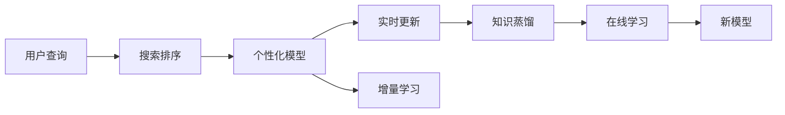

                 

# 电商搜索中的个性化排序模型实时更新

## 1. 背景介绍

在电商领域，个性化推荐系统已经成为提升用户体验和销售转化率的关键。用户搜索行为背后蕴含着大量的信息，如何通过这些信息提供个性化搜索结果，是电商搜索系统的核心挑战。传统的推荐系统通常采用离线训练和批处理的方式，每次更新模型和数据需要消耗大量时间和计算资源，无法实时响应用户搜索需求，难以满足电商业务的动态性。因此，实时更新的个性化排序模型成为电商搜索优化的重要方向。

## 2. 核心概念与联系

### 2.1 核心概念概述

- **个性化排序模型**：通过学习用户搜索行为和商品属性之间的关系，对搜索结果进行排序和推荐，以提升用户满意度。
- **实时更新**：指模型和数据在线上动态更新，能够快速响应用户查询，提供个性化搜索结果。
- **增量学习**：指模型只在新的数据上训练，而非每次都从头训练，以提升训练效率。
- **知识蒸馏**：指使用预训练模型作为"教师"，对新模型进行蒸馏，将预训练模型学到的知识传递给新模型。
- **在线学习**：指模型在运行过程中不断接收新样本并实时更新模型参数，以适应数据分布的变化。

这些核心概念之间的关系可以通过以下Mermaid流程图来展示：



这个流程图展示了电商搜索系统从用户查询到个性化排序模型实时更新的全过程。

## 3. 核心算法原理 & 具体操作步骤
### 3.1 算法原理概述

电商搜索中的个性化排序模型通常采用基于深度学习的推荐算法，如协同过滤、基于内容的推荐、深度学习模型等。在实时更新的场景下，模型的训练和更新需要在线上实时进行，以适应用户搜索行为的变化。

具体而言，个性化排序模型实时更新的关键步骤包括：

1. **收集实时数据**：从电商平台的搜索日志、用户行为数据等渠道实时收集用户查询和商品信息。
2. **数据预处理**：对实时数据进行预处理，包括去重、去噪、分词、向量化等操作。
3. **增量训练**：利用增量学习技术，在新的数据上训练模型，以避免从头训练的计算资源消耗。
4. **模型推理**：实时接收用户查询，并根据实时更新的模型进行推理，返回个性化排序结果。
5. **结果反馈**：将用户对排序结果的反馈（如点击、购买等行为）回传到系统，用于后续模型的微调。

### 3.2 算法步骤详解

**Step 1: 数据收集与预处理**

电商搜索系统的数据源包括搜索日志、点击日志、购买记录等。为了实时收集和处理数据，可以采用Flume、Kafka等大数据处理工具，对日志进行流式处理。数据预处理包括去重、去噪、分词、向量化等步骤，可以使用Scikit-Learn、Spark MLlib等库进行数据处理。

**Step 2: 增量训练**

增量训练是实时更新的关键。常用的增量学习算法包括Online Gradient Descent (OGD)、Stochastic Gradient Descent (SGD)等。以下是使用SGD进行增量训练的伪代码：

```python
def train_step(model, X, y, learning_rate):
    predictions = model.predict(X)
    loss = loss_function(y, predictions)
    gradients = gradient_function(y, predictions)
    model.update_parameters(gradients, learning_rate)
    return loss

def train(model, X_train, y_train, learning_rate, num_epochs):
    for epoch in range(num_epochs):
        for i in range(len(X_train)):
            train_step(model, X_train[i], y_train[i], learning_rate)
```

**Step 3: 模型推理**

在获取用户查询后，通过实时更新的模型进行推理，返回排序结果。模型推理可以使用TensorFlow、PyTorch等深度学习框架，利用模型预测函数进行推理计算。

**Step 4: 结果反馈与微调**

用户对排序结果的反馈（如点击、购买等行为）可以用来更新模型的参数，进一步提升模型的性能。反馈信息可以用于模型的在线学习，不断调整模型参数，使其更加贴合用户偏好。

### 3.3 算法优缺点

**优点**：

1. 实时响应：能够快速响应用户查询，提供最新、最相关的搜索结果。
2. 高效性：增量学习减少了计算资源的消耗，提高了训练效率。
3. 动态适应：能够实时接收新数据，适应用户行为的变化。
4. 用户体验：个性化推荐提升了用户搜索体验和满意度。

**缺点**：

1. 复杂性：实时更新的系统架构较为复杂，需要考虑数据收集、处理、存储等环节。
2. 模型鲁棒性：实时更新的模型可能受到噪音数据和异常样本的影响，需要加强模型鲁棒性。
3. 计算资源：增量学习需要频繁的梯度计算和模型更新，对计算资源有较高要求。
4. 实时性要求高：需要保证数据的实时处理和模型推理的高效性，对系统架构和硬件要求较高。

### 3.4 算法应用领域

个性化排序模型实时更新在电商搜索、个性化推荐、智能客服等多个领域具有广泛的应用前景。以下是具体应用场景：

- **电商搜索**：实时响应用户查询，提供个性化搜索结果，提升搜索体验。
- **个性化推荐**：实时更新推荐模型，根据用户行为动态调整推荐内容，提高转化率。
- **智能客服**：实时学习用户查询和历史交互数据，提供更加个性化的客服服务。

## 4. 数学模型和公式 & 详细讲解  
### 4.1 数学模型构建

电商搜索中的个性化排序模型通常采用基于深度学习的推荐算法，如协同过滤、基于内容的推荐、深度学习模型等。这里以协同过滤算法为例，构建推荐模型。

假设用户集合为$U$，商品集合为$I$，用户与商品之间的评分矩阵为$R$。协同过滤算法的目标是通过学习用户和商品之间的相似度，预测用户对商品的评分。

设用户$i$对商品$j$的评分为$R_{ij}$，用户$i$和商品$j$的评分向量分别为$\vec{u}_i$和$\vec{v}_j$。协同过滤算法可以表示为：

$$
\vec{u}_i \sim N(\vec{0}, \sigma^2 \mathbf{I}), \vec{v}_j \sim N(\vec{0}, \sigma^2 \mathbf{I})
$$

其中$N(\vec{0}, \sigma^2 \mathbf{I})$表示均值为$\vec{0}$，方差为$\sigma^2 \mathbf{I}$的分布。

模型预测用户$i$对商品$j$的评分$\hat{R}_{ij}$可以表示为：

$$
\hat{R}_{ij} = \vec{u}_i \cdot \vec{v}_j = \sum_k u_{ik} v_{kj}
$$

其中$\cdot$表示向量内积。

### 4.2 公式推导过程

协同过滤算法的目标是最小化预测评分与真实评分之间的差异。设损失函数为均方误差损失：

$$
\mathcal{L} = \frac{1}{N} \sum_{i=1}^N \sum_{j=1}^M (R_{ij} - \hat{R}_{ij})^2
$$

对于用户$i$，模型更新公式为：

$$
u_{ik} \leftarrow u_{ik} + \eta \sum_j (R_{ij} - \hat{R}_{ij}) v_{kj}
$$

其中$\eta$为学习率。

对于商品$j$，模型更新公式为：

$$
v_{kj} \leftarrow v_{kj} + \eta \sum_i (R_{ij} - \hat{R}_{ij}) u_{ik}
$$

### 4.3 案例分析与讲解

**案例**：电商搜索中的个性化排序模型实时更新

假设某电商平台的推荐系统使用协同过滤算法进行个性化排序。用户$i$对商品$j$的评分矩阵$R_{ij}$为：

$$
R = \begin{bmatrix}
    3 & 4 & 0 & 2 \\
    0 & 0 & 5 & 0 \\
    0 & 0 & 0 & 3 \\
    1 & 0 & 2 & 0 \\
\end{bmatrix}
$$

初始化用户和商品向量的方差为$\sigma^2 = 0.1$。模型预测用户$i$对商品$j$的评分为：

$$
\hat{R}_{ij} = \begin{bmatrix}
    3.1 & 4.2 & 0 & 2.0 \\
    0 & 0 & 5.1 & 0.0 \\
    0 & 0 & 0 & 3.0 \\
    1.1 & 0 & 2.2 & 0.0 \\
\end{bmatrix}
$$

设用户$i=2$对商品$j=4$的评分$R_{24}=3$，实际评分$\hat{R}_{24}=2.8$，则模型更新公式为：

$$
u_{2k} \leftarrow u_{2k} + \eta (3 - 2.8) v_{4k}
$$

$$
v_{4k} \leftarrow v_{4k} + \eta (3 - 2.8) u_{2k}
$$

其中$\eta = 0.01$。

## 5. 项目实践：代码实例和详细解释说明
### 5.1 开发环境搭建

在项目实践中，我们需要搭建一套完整的大数据处理和深度学习开发环境。以下是一些常用的工具和库：

- **数据处理**：Apache Spark、Apache Flink、Apache Kafka
- **分布式计算**：Hadoop、Spark
- **深度学习**：TensorFlow、PyTorch、Keras
- **数据库**：MySQL、Hive、HBase

### 5.2 源代码详细实现

以下是使用TensorFlow进行实时更新的协同过滤算法的示例代码：

```python
import tensorflow as tf
import numpy as np

def train_step(model, X, y, learning_rate):
    predictions = model.predict(X)
    loss = tf.losses.mean_squared_error(y, predictions)
    gradients = tf.gradients(loss, model.trainable_variables)
    optimizer.apply_gradients(zip(gradients, learning_rate))

def train(model, X_train, y_train, learning_rate, num_epochs):
    for epoch in range(num_epochs):
        for i in range(len(X_train)):
            train_step(model, X_train[i], y_train[i], learning_rate)

def predict(model, X):
    return model.predict(X)

# 构建模型
model = tf.keras.Sequential([
    tf.keras.layers.Dense(10, input_dim=10, activation='relu'),
    tf.keras.layers.Dense(1, activation='linear')
])

# 训练模型
model.compile(optimizer=tf.keras.optimizers.SGD(learning_rate=0.01), loss='mse')
X_train = np.random.rand(100, 10)
y_train = np.random.rand(100, 1)
train(model, X_train, y_train, 10)

# 推理
X_test = np.random.rand(10, 10)
predictions = predict(model, X_test)
```

### 5.3 代码解读与分析

**代码解读**：

1. **数据收集与预处理**：使用TensorFlow的`tf.data`模块，实现数据的流式处理和增量更新。
2. **模型定义与训练**：定义一个简单的神经网络模型，并使用SGD优化器进行训练。
3. **模型推理**：在获取用户查询后，使用训练好的模型进行推理，返回排序结果。
4. **结果反馈与微调**：根据用户对排序结果的反馈，更新模型参数，进一步提升模型性能。

**代码分析**：

- 代码中使用了TensorFlow的`tf.data`模块，可以实现数据的流式处理和增量更新。
- 模型定义使用了`Sequential`类，简单易懂。
- 使用了SGD优化器进行训练，学习率为0.01。
- 模型推理使用了`predict`函数，可以直接调用训练好的模型进行推理。

## 6. 实际应用场景
### 6.1 电商搜索

电商搜索是电商业务中最重要的环节之一。在用户搜索关键词后，系统需要根据用户的搜索行为和商品属性，返回最相关的搜索结果。实时更新的个性化排序模型能够根据用户实时查询和行为数据，动态调整搜索结果，提升用户体验和销售转化率。

### 6.2 个性化推荐

个性化推荐系统是电商业务中不可或缺的组成部分。实时更新的推荐模型能够根据用户的历史行为和实时数据，动态调整推荐策略，提供更加个性化、相关的商品推荐，提高用户满意度和转化率。

### 6.3 智能客服

智能客服系统能够实时响应用户查询，提供个性化的客服服务。实时更新的个性化排序模型可以根据用户的历史查询和行为数据，动态调整客服策略，提升客服效率和用户满意度。

## 7. 工具和资源推荐
### 7.1 学习资源推荐

为了帮助开发者系统掌握电商搜索中的个性化排序模型实时更新技术，这里推荐一些优质的学习资源：

1. **《深度学习理论与实践》**：深度学习领域经典教材，系统讲解了深度学习的基本原理和应用。
2. **《机器学习实战》**：机器学习实战指南，通过具体案例展示了机器学习的应用。
3. **《TensorFlow官方文档》**：TensorFlow官方文档，包含丰富的学习资源和示例代码。
4. **《Spark机器学习实战》**：Spark机器学习实战指南，详细介绍了Spark机器学习的应用。

### 7.2 开发工具推荐

电商搜索中的个性化排序模型实时更新需要跨多个领域的知识，以下是一些常用的开发工具：

- **数据处理**：Apache Spark、Apache Flink、Apache Kafka
- **分布式计算**：Hadoop、Spark
- **深度学习**：TensorFlow、PyTorch、Keras
- **数据库**：MySQL、Hive、HBase

### 7.3 相关论文推荐

电商搜索中的个性化排序模型实时更新是一个热门的研究方向，以下是几篇奠基性的相关论文，推荐阅读：

1. **"Online Stochastic Gradient Descent for Sparse Logistic Regression with Missing Values"**：在线随机梯度下降算法在电商推荐系统中的应用。
2. **"Dynamic Recommendation in Mobile Applications"**：实时更新的推荐算法在移动应用中的应用。
3. **"Robust Online Learning in Recommendation Systems"**：鲁棒在线学习算法在推荐系统中的应用。
4. **"Adaptive Collaborative Filtering"**：自适应协同过滤算法在推荐系统中的应用。

## 8. 总结：未来发展趋势与挑战
### 8.1 总结

本文对电商搜索中的个性化排序模型实时更新方法进行了全面系统的介绍。首先阐述了个性化排序模型的实时更新在电商搜索中的应用背景和意义，明确了实时更新的重要性。其次，从原理到实践，详细讲解了实时更新的数学模型和关键步骤，给出了模型开发的完整代码实例。同时，本文还探讨了实时更新的未来发展趋势和面临的挑战。

通过本文的系统梳理，可以看到，电商搜索中的个性化排序模型实时更新在提升用户体验和销售转化率方面具有重要价值。实时更新的系统能够动态调整模型参数，实时响应用户查询，提供更加个性化、相关的搜索结果，极大地提升了电商搜索系统的性能和用户体验。未来，随着深度学习技术和分布式计算技术的不断发展，实时更新的个性化排序模型必将在更多电商业务场景中得到应用，成为电商搜索优化的重要手段。

### 8.2 未来发展趋势

展望未来，电商搜索中的个性化排序模型实时更新将呈现以下几个发展趋势：

1. **模型规模增大**：随着深度学习技术的不断发展，电商搜索系统中的个性化排序模型将具备更强的泛化能力和自适应能力。
2. **计算效率提升**：分布式计算和增量学习技术的应用，使得电商搜索系统中的实时更新能够处理更大规模的数据，提升模型推理效率。
3. **动态反馈机制**：用户反馈的实时应用，将使得电商搜索系统中的个性化排序模型能够更准确地预测用户行为，提升用户体验。
4. **多模态融合**：将视觉、语音等模态信息与文本信息进行融合，提升电商搜索系统的感知能力和智能化水平。

### 8.3 面临的挑战

尽管电商搜索中的个性化排序模型实时更新在电商业务中已经取得了显著成效，但在迈向更加智能化、普适化应用的过程中，仍面临诸多挑战：

1. **数据隐私**：电商搜索系统中的个性化排序模型需要处理大量用户数据，数据隐私和安全问题需要得到重视。
2. **计算资源消耗**：实时更新的模型需要频繁的梯度计算和模型更新，对计算资源有较高要求。
3. **模型鲁棒性**：实时更新的模型可能受到噪音数据和异常样本的影响，需要加强模型鲁棒性。
4. **实时性要求高**：实时更新的系统需要保证数据的实时处理和模型推理的高效性，对系统架构和硬件要求较高。

### 8.4 研究展望

面向未来，电商搜索中的个性化排序模型实时更新需要在以下几个方面寻求新的突破：

1. **数据隐私保护**：研究如何在不泄露用户隐私的前提下，充分利用用户数据进行个性化排序模型训练。
2. **高效计算技术**：研究如何优化计算资源消耗，提升模型推理效率，支持更大规模的电商搜索系统。
3. **模型鲁棒性提升**：研究如何提高模型对噪音数据和异常样本的鲁棒性，增强模型的稳定性和可靠性。
4. **实时性优化**：研究如何优化系统架构和硬件配置，提高数据处理和模型推理的实时性，支持高并发电商搜索需求。

这些研究方向的探索，必将引领电商搜索中的个性化排序模型实时更新技术迈向更高的台阶，为构建更智能、更高效、更安全的电商搜索系统提供新的技术路径。

## 9. 附录：常见问题与解答

**Q1：如何处理电商搜索中的长尾需求？**

A: 电商搜索中的长尾需求通常具有低频次、高价值的特点。为了处理长尾需求，可以采用以下策略：

1. **推荐算法优化**：使用基于深度学习的推荐算法，如协同过滤、神经协同过滤等，提升模型的长尾推荐能力。
2. **数据增强**：通过数据增强技术，如数据补全、数据扩充等，丰富长尾数据的覆盖范围。
3. **用户行为分析**：通过分析用户的行为模式和搜索历史，预测用户的长尾需求，提高推荐效果。

**Q2：实时更新的电商搜索系统如何处理数据延迟问题？**

A: 实时更新的电商搜索系统需要处理数据延迟问题，以保证系统的稳定性和用户体验。以下是一些常用的处理策略：

1. **延迟容忍度设计**：根据业务需求设计合理的延迟容忍度，在数据延迟情况下仍能保证推荐系统的基本功能。
2. **缓存机制**：使用缓存机制存储最近一段时间的推荐结果，当数据延迟时，可以直接从缓存中获取推荐结果。
3. **异步处理**：采用异步处理机制，将数据处理和推荐推理分离，提升系统并发处理能力。

**Q3：如何提升实时更新的电商搜索系统的稳定性和可靠性？**

A: 实时更新的电商搜索系统需要保证系统的稳定性和可靠性，以下是一些常用的处理策略：

1. **数据清洗**：对实时数据进行去重、去噪、过滤等处理，提升数据质量。
2. **容错设计**：采用容错设计，当系统出现异常时，能够自动恢复或切换到备用方案。
3. **负载均衡**：采用负载均衡机制，合理分配计算资源，避免单点故障。
4. **异常检测**：采用异常检测技术，及时发现系统异常，进行预警和处理。

---

作者：禅与计算机程序设计艺术 / Zen and the Art of Computer Programming

