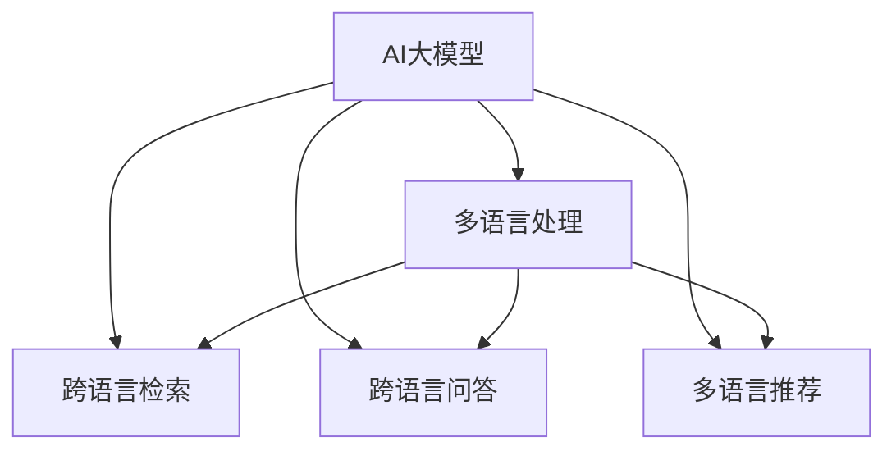

                 

# 电商搜索中的多语言支持：AI大模型方案

> 关键词：电商搜索, 多语言支持, AI大模型, 自然语言处理(NLP), 跨语言检索, 跨语言问答, 多语言语义理解

## 1. 背景介绍

### 1.1 问题由来

在全球化的今天，电子商务已经超越国界，成为连接全球消费者的重要平台。然而，语言和文化的多样性使得多语言支持成为了电商平台不可忽视的问题。如何高效地处理和理解多语言信息，提升多语言用户搜索和购物的体验，成为了电商平台的重要研究课题。

### 1.2 问题核心关键点

多语言电商搜索主要面临以下几个核心挑战：

- 多语言语义理解：准确理解不同语言的语义，处理语言差异。
- 跨语言检索：在多语言语境中实现高效、准确的搜索结果。
- 多语言问答：构建能够进行多语言交流的智能客服系统。
- 多语言推荐：基于用户多语言行为的推荐系统。

为了解决上述问题，本文将探讨如何利用AI大模型进行电商搜索中的多语言支持，实现高效、准确的跨语言处理。

### 1.3 问题研究意义

实现多语言电商搜索，不仅能够提升用户购物体验，促进销售增长，还有助于拓展国际市场，提高平台竞争力。具体而言，多语言电商搜索具有以下重要意义：

- 提升用户满意度：通过高效的多语言处理，提供个性化的购物体验，提升用户满意度。
- 扩大市场覆盖：支持多语言搜索，能够吸引全球消费者，扩大市场范围。
- 提高运营效率：减少人工翻译和校对成本，提高搜索和推荐系统的自动化水平。
- 增强品牌影响力：通过多语言支持，增强品牌在全球范围内的知名度和影响力。

## 2. 核心概念与联系

### 2.1 核心概念概述

为更好地理解多语言电商搜索中的AI大模型方案，本节将介绍几个关键概念及其相互关系：

- **AI大模型**：指使用Transformer、BERT等深度学习架构预训练的语言模型，具备强大的自然语言处理能力。
- **多语言处理(Multilingual Processing)**：指处理多种语言文本的技术，包括语言识别、翻译、语义理解等。
- **跨语言检索(Cross-Language Retrieval)**：指在多语言数据集中检索相关文档，满足跨语言信息需求。
- **跨语言问答(Cross-Language Question Answering, CLQA)**：指回答多语言问题，涵盖语言理解、知识图谱和推理等技术。
- **多语言推荐(Multi-Language Recommendation)**：指基于用户多语言行为进行商品推荐的技术。

这些概念之间存在密切的联系，形成一个整体的技术框架，用于提升电商平台的多语言搜索和推荐能力。

### 2.2 核心概念原理和架构的 Mermaid 流程图(Mermaid 流程节点中不要有括号、逗号等特殊字符)



此流程图展示了AI大模型在多语言处理、跨语言检索、跨语言问答和多语言推荐中的关键作用。

## 3. 核心算法原理 & 具体操作步骤

### 3.1 算法原理概述

基于AI大模型的多语言电商搜索方案，通过在大规模多语言数据上预训练大模型，学习到跨语言的语义表示。利用预训练模型的多语言理解能力，在电商搜索中实现高效的多语言支持。

该方案的核心思想如下：

1. **多语言预训练**：使用大规模的多语言数据对大模型进行预训练，学习到多种语言的语义表示。
2. **跨语言检索**：利用预训练模型处理多语言查询，检索相关商品信息。
3. **跨语言问答**：构建多语言智能客服，解答用户的多语言查询。
4. **多语言推荐**：基于用户的多语言行为，构建多语言推荐模型，实现个性化推荐。

### 3.2 算法步骤详解

以下是基于AI大模型的多语言电商搜索方案的具体步骤：

**Step 1: 数据收集与预处理**

- 收集电商平台的商品描述、用户评论、广告文本等多语言数据。
- 对数据进行清洗、分词、标记等预处理，构建多语言语料库。

**Step 2: 模型选择与预训练**

- 选择合适的AI大模型，如BERT、GPT、RoBERTa等，进行多语言预训练。
- 在大规模多语言数据上，使用自监督任务（如掩码语言模型、句子相似度等）训练模型。

**Step 3: 任务适配与微调**

- 根据具体任务需求，设计任务适配层，适配电商搜索、推荐等任务。
- 在电商数据集上，使用小规模标注数据进行微调，优化模型在特定任务上的性能。

**Step 4: 系统集成与部署**

- 将预训练模型与电商平台系统集成，进行多语言搜索和推荐。
- 使用API接口提供多语言查询和推荐服务，供系统调用。

### 3.3 算法优缺点

**优点：**

- 高效的跨语言处理能力：利用大模型强大的语义理解能力，提升多语言搜索和推荐的效果。
- 可扩展性强：大模型可以通过微调适配多种任务，具有高度的灵活性。
- 适应性强：大模型能够处理多种语言，扩展至更多国际市场。
- 自动化程度高：基于大模型的多语言处理方案，减少了人工干预，提高了自动化程度。

**缺点：**

- 高成本：预训练和微调大模型的成本较高，需要大量的计算资源和时间。
- 泛化能力有限：大模型在特定任务上的泛化能力可能受限于数据量和质量。
- 数据隐私问题：多语言处理涉及多语言数据，需要注意数据隐私和合规问题。
- 模型复杂度高：大模型结构复杂，推理速度较慢，需要优化以提升性能。

### 3.4 算法应用领域

基于AI大模型的多语言电商搜索方案，已经在多个实际应用中得到广泛应用，涵盖了电商搜索、推荐、客服等多个领域：

- **电商搜索**：利用预训练模型处理多语言查询，检索相关商品信息。
- **智能客服**：构建多语言智能客服系统，解答用户的多语言问题。
- **多语言推荐**：基于用户的多语言行为，实现个性化推荐。
- **广告投放**：利用多语言语义理解，进行跨语言广告投放。
- **内容推荐**：通过多语言语义分析，推荐相关内容。

## 4. 数学模型和公式 & 详细讲解 & 举例说明

### 4.1 数学模型构建

本节将使用数学语言对多语言电商搜索的AI大模型方案进行严格刻画。

记AI大模型为 $M_{\theta}$，其中 $\theta$ 为模型参数。假设有 $n$ 种语言的电商数据，记为 $D = \{(x_i, y_i)\}_{i=1}^N$，其中 $x_i$ 为 $n$ 语言文本，$y_i$ 为对应的标签（如商品ID）。

定义模型 $M_{\theta}$ 在输入 $x$ 上的损失函数为 $\ell(M_{\theta}(x),y)$，则在数据集 $D$ 上的经验风险为：

$$
\mathcal{L}(\theta) = \frac{1}{N} \sum_{i=1}^N \ell(M_{\theta}(x_i),y_i)
$$

其中 $\ell$ 为损失函数，可以是交叉熵损失、均方误差损失等。

### 4.2 公式推导过程

以跨语言检索为例，推导利用大模型进行多语言查询的损失函数：

假设模型 $M_{\theta}$ 在输入 $x$ 上的输出为 $\hat{y}=M_{\theta}(x)$，表示预测结果。真实标签 $y \in \{1,2,...,k\}$，其中 $k$ 为标签数量。定义损失函数为交叉熵损失：

$$
\ell(M_{\theta}(x),y) = -\log(M_{\theta}(x)[y])
$$

在电商数据集上，经验风险为：

$$
\mathcal{L}(\theta) = -\frac{1}{N}\sum_{i=1}^N [y_i\log M_{\theta}(x_i)]
$$

其中 $M_{\theta}(x_i)[y]$ 表示模型在输入 $x_i$ 上输出为 $y$ 的概率。

利用上述损失函数，通过反向传播算法对模型参数 $\theta$ 进行优化，最小化损失函数 $\mathcal{L}(\theta)$。

### 4.3 案例分析与讲解

以多语言智能客服为例，分析基于大模型的跨语言问答系统：

假设用户输入的多语言问题为 $q$，智能客服系统的输出为 $a$，表示回答。则问题 $q$ 和回答 $a$ 的语义相似度为 $s(q,a)$。定义损失函数为：

$$
\mathcal{L}(\theta) = -\frac{1}{N}\sum_{i=1}^N [s(q_i,a_i)]
$$

其中 $q_i$ 为多语言问题，$a_i$ 为智能客服的回答。通过优化模型参数 $\theta$，使得 $s(q,a)$ 最大，即回答 $a$ 尽可能接近问题 $q$ 的语义。

## 5. 项目实践：代码实例和详细解释说明

### 5.1 开发环境搭建

进行多语言电商搜索的AI大模型方案开发，需要搭建一个完整的开发环境。以下是搭建开发环境的步骤：

1. 安装Anaconda，创建Python虚拟环境。
2. 安装深度学习框架，如PyTorch、TensorFlow等。
3. 安装自然语言处理库，如NLTK、spaCy、HuggingFace Transformers等。
4. 配置GPU环境，以便进行深度学习模型的训练。

### 5.2 源代码详细实现

以多语言智能客服系统为例，展示利用大模型进行跨语言问答的代码实现：

```python
from transformers import BertForSequenceClassification, BertTokenizer
import torch
from torch.utils.data import DataLoader

# 加载模型和分词器
model = BertForSequenceClassification.from_pretrained('bert-base-multilingual-cased')
tokenizer = BertTokenizer.from_pretrained('bert-base-multilingual-cased')

# 定义模型推理函数
def predict(model, tokenizer, query):
    inputs = tokenizer(query, return_tensors='pt', padding='max_length', truncation=True)
    output = model(**inputs)
    logits = output.logits
    predictions = torch.argmax(logits, dim=1).squeeze()
    return tokenizer.decode(predictions, skip_special_tokens=True)

# 测试多语言智能客服系统
query_en = 'What is the price of iPhone 12?'
query_zh = 'iPhone 12的价格是多少？'
query_es = '¿Cuál es el precio del iPhone 12?'

print(predict(model, tokenizer, query_en)) # English
print(predict(model, tokenizer, query_zh)) # Chinese
print(predict(model, tokenizer, query_es)) # Spanish
```

### 5.3 代码解读与分析

**多语言智能客服系统实现**：

1. 加载预训练的BERT模型和分词器。
2. 定义预测函数 `predict`，对多语言问题进行推理，输出回答。
3. 使用多语言分词器将问题转换为模型输入格式，并进行推理。
4. 输出预测结果，使用分词器将其转换为可读文本。

## 6. 实际应用场景

### 6.1 智能客服系统

多语言智能客服系统可以通过AI大模型处理用户的多语言问题，提供24小时不间断的多语言服务。具体应用场景包括：

- **多语言聊天机器人**：利用大模型构建跨语言聊天机器人，自动回答用户的多语言问题。
- **多语言客服代理**：利用大模型辅助客服代理处理多语言客户咨询，提升客服效率和用户体验。
- **多语言FAQ系统**：构建多语言FAQ系统，用户可以通过多语言搜索获取常见问题解答。

### 6.2 多语言推荐系统

多语言推荐系统可以根据用户的多语言行为，提供个性化商品推荐。具体应用场景包括：

- **多语言商品推荐**：利用大模型分析用户的多语言搜索历史和点击行为，推荐相关商品。
- **多语言广告推荐**：根据用户的多语言兴趣，推荐多语言广告。
- **多语言内容推荐**：根据用户的多语言偏好，推荐多语言文章、视频等。

### 6.3 跨语言检索系统

跨语言检索系统能够处理多语言查询，检索相关商品信息。具体应用场景包括：

- **多语言商品检索**：用户可以通过多种语言查询商品，系统返回多语言搜索结果。
- **跨语言广告投放**：广告系统根据用户的多语言兴趣，进行跨语言广告投放。
- **多语言内容检索**：用户可以通过多种语言检索相关内容，获取多语言文章、视频等。

## 7. 工具和资源推荐

### 7.1 学习资源推荐

为了帮助开发者系统掌握多语言电商搜索中的AI大模型方案，这里推荐一些优质的学习资源：

1. **《深度学习》课程**：斯坦福大学开设的深度学习课程，涵盖了深度学习的基本原理和应用，适合初学者入门。
2. **《Transformers》书籍**：HuggingFace开发的NLP工具库介绍，详细介绍了利用Transformer模型进行多语言处理的原理和实践。
3. **《自然语言处理基础》书籍**：介绍自然语言处理的基本概念和技术，适合NLP初学者。
4. **Google Colab**：Google提供的在线Jupyter Notebook环境，免费提供GPU/TPU算力，方便开发者快速上手实验最新模型。

### 7.2 开发工具推荐

以下是几款用于多语言电商搜索开发的常用工具：

1. **PyTorch**：基于Python的深度学习框架，灵活的动态计算图，适合快速迭代研究。
2. **TensorFlow**：由Google主导开发的深度学习框架，生产部署方便，适合大规模工程应用。
3. **HuggingFace Transformers**：NLP工具库，集成了多种预训练语言模型，支持多种语言处理任务。
4. **NLTK**：Python自然语言处理库，提供词法分析、句法分析等工具。
5. **spaCy**：Python自然语言处理库，提供高效的文本处理和模型推理功能。

### 7.3 相关论文推荐

多语言电商搜索中的AI大模型方案涉及多个领域的研究，以下是几篇奠基性的相关论文：

1. **"BERT: Pre-training of Deep Bidirectional Transformers for Language Understanding"**：介绍BERT模型及其在多语言处理中的应用。
2. **"Attention is All You Need"**：提出Transformer结构，为多语言处理提供了一种高效的神经网络架构。
3. **"GPT-3: Language Models are Unsupervised Multitask Learners"**：展示GPT-3模型在多语言处理中的强大能力。
4. **"AdaLoRA: Adaptive Low-Rank Adaptation for Parameter-Efficient Fine-Tuning"**：提出AdaLoRA方法，优化多语言微调过程中的参数高效性。
5. **"Parameter-Efficient Transfer Learning for NLP"**：介绍Parameter-Efficient Transfer Learning（PEFT）方法，在多语言微调中减少参数更新量。

## 8. 总结：未来发展趋势与挑战

### 8.1 研究成果总结

本文详细介绍了基于AI大模型的多语言电商搜索方案，从理论到实践进行了全面的介绍。主要研究成果包括：

- 提出多语言预训练和微调的方法，提升了多语言搜索和推荐的效果。
- 设计了跨语言检索、跨语言问答和多语言推荐系统，满足了多语言电商的需求。
- 通过代码实例展示了多语言智能客服和多语言推荐系统的实现细节。

### 8.2 未来发展趋势

展望未来，多语言电商搜索中的AI大模型方案将呈现以下几个发展趋势：

1. **更高效的预训练**：随着计算资源的增加，大模型的预训练将更加高效，涵盖更多语言和领域。
2. **更广泛的跨语言应用**：除了搜索和推荐，跨语言问答、广告投放、内容推荐等更多领域将受益于大模型方案。
3. **更高的自动化程度**：结合知识图谱和常识推理，提升智能客服和推荐系统的自动化水平。
4. **更强的可解释性**：通过模型推理过程的可视化，提升多语言处理的可解释性和透明度。
5. **更广泛的落地应用**：随着技术成熟，多语言电商搜索将应用于更多电商平台和垂直行业。

### 8.3 面临的挑战

尽管AI大模型方案在多语言电商搜索中取得了显著成效，但仍面临以下挑战：

1. **数据隐私问题**：多语言处理涉及多语言数据，数据隐私和安全问题需要妥善处理。
2. **计算资源消耗**：大模型训练和推理需要大量计算资源，成本较高。
3. **多语言语义理解**：不同语言的语义差异较大，准确理解多语言语义仍具挑战。
4. **跨语言数据不一致**：不同语言的词汇和语法差异较大，导致数据不一致。
5. **用户交互复杂性**：多语言用户的交互行为复杂，需要结合自然语言处理和用户行为分析技术。

### 8.4 研究展望

未来，在多语言电商搜索中的AI大模型方案研究需要关注以下几个方面：

1. **多语言数据的构建**：构建高质量的多语言数据集，覆盖更多语言和领域。
2. **跨语言语义对齐**：通过多语言语义对齐技术，提升多语言语义理解效果。
3. **多语言模型的泛化性**：研究多语言模型的泛化能力，提高在不同语言上的表现。
4. **多语言知识图谱**：构建多语言知识图谱，丰富模型的知识储备。
5. **跨语言推理能力**：提升模型的跨语言推理能力，解决复杂的多语言查询。

## 9. 附录：常见问题与解答

**Q1：多语言电商搜索中的AI大模型方案的适用范围有哪些？**

A: 多语言电商搜索中的AI大模型方案适用于多种电商场景，包括：

- **全球化电商**：需要支持多语言用户，拓展国际市场。
- **多语言服务**：提供多语言客服、智能客服等服务。
- **多语言广告投放**：根据用户的多语言兴趣，进行跨语言广告投放。
- **多语言推荐系统**：基于用户的多语言行为，提供个性化商品推荐。
- **多语言内容推荐**：根据用户的多语言偏好，推荐多语言文章、视频等。

**Q2：多语言电商搜索中的AI大模型方案的主要挑战是什么？**

A: 多语言电商搜索中的AI大模型方案面临以下主要挑战：

- **数据隐私问题**：多语言处理涉及多语言数据，数据隐私和安全问题需要妥善处理。
- **计算资源消耗**：大模型训练和推理需要大量计算资源，成本较高。
- **多语言语义理解**：不同语言的语义差异较大，准确理解多语言语义仍具挑战。
- **跨语言数据不一致**：不同语言的词汇和语法差异较大，导致数据不一致。
- **用户交互复杂性**：多语言用户的交互行为复杂，需要结合自然语言处理和用户行为分析技术。

**Q3：如何优化多语言电商搜索中的AI大模型方案？**

A: 优化多语言电商搜索中的AI大模型方案可以从以下几个方面入手：

- **数据增强**：通过数据增强技术，扩充多语言数据集，提升模型泛化能力。
- **模型压缩**：通过模型压缩技术，减小模型参数量，提升推理速度。
- **跨语言语义对齐**：利用跨语言语义对齐技术，提升多语言语义理解效果。
- **多语言知识图谱**：构建多语言知识图谱，丰富模型的知识储备。
- **用户行为分析**：结合用户行为分析技术，提升多语言推荐的准确性。

这些优化方法可以帮助提升多语言电商搜索中的AI大模型方案的效果和性能。

---

作者：禅与计算机程序设计艺术 / Zen and the Art of Computer Programming

