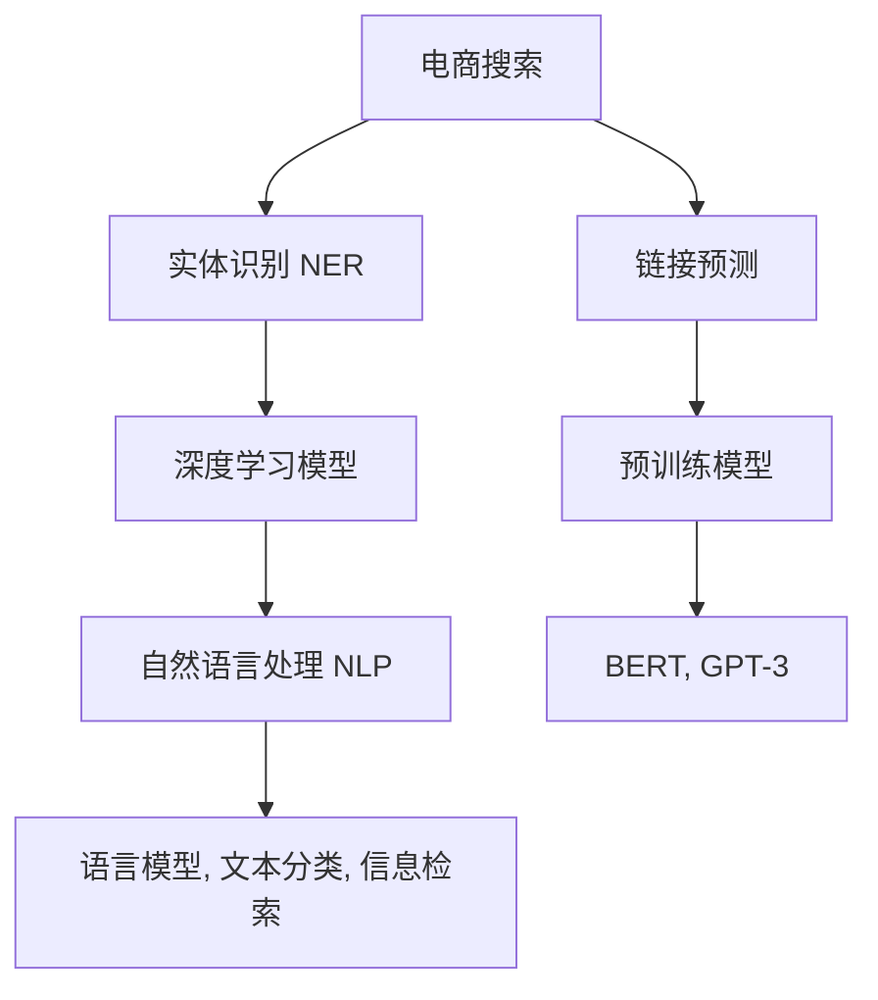

                 

# 电商搜索中的实体识别与链接深度学习模型

> 关键词：实体识别, 链接预测, 深度学习, 电商搜索, 自然语言处理(NLP), 预训练模型

## 1. 背景介绍

随着电子商务的迅猛发展，消费者对搜索结果的个性化和精准度提出了更高要求。传统基于关键词的搜索方法无法有效识别出用户关注的具体商品实体，无法对搜索结果进行更深层次的挖掘和关联。为此，基于深度学习模型的实体识别与链接技术成为电商搜索领域的研究热点。

### 1.1 问题由来

传统电商搜索系统主要依赖关键词匹配技术，简单直接，但难以全面捕捉用户查询意图，尤其是在语义丰富、信息量大的查询中。此外，关键词匹配技术无法有效识别出用户关注的具体商品实体，也无法对搜索结果进行更深层次的关联和展示。因此，研究基于深度学习模型的实体识别与链接技术，成为提升电商搜索个性化和精准度的关键方向。

### 1.2 问题核心关键点

实体识别与链接技术主要包括以下核心关键点：
1. **实体识别（Named Entity Recognition, NER）**：从自然语言中识别出具体商品实体，如产品名称、品牌、规格等。
2. **链接预测（Link Prediction）**：预测不同实体之间的关系，如商品与属性、品牌与商品之间的关联关系。
3. **深度学习模型**：利用预训练语言模型，在大规模无标签数据上学习通用语言表示，并在特定任务上进行微调，实现实体识别与链接。
4. **电商搜索**：将实体识别与链接技术应用于电商搜索系统，提升搜索结果的个性化和精准度。

这些核心关键点共同构成了电商搜索中实体识别与链接技术的核心框架，为其在实际应用中的高效性和准确性提供了保障。

## 2. 核心概念与联系

### 2.1 核心概念概述

为更好地理解实体识别与链接技术，本节将介绍几个密切相关的核心概念：

- **实体识别（NER）**：识别文本中具体实体，如人名、地名、组织名、时间、数量等。NER技术是NLP领域的重要分支，广泛应用于信息提取、问答系统、智能客服等场景。

- **链接预测**：预测文本中不同实体之间的关系，如商品与属性、品牌与商品之间的关联。链接预测在知识图谱构建、推荐系统、信息检索等领域有广泛应用。

- **深度学习模型**：基于神经网络结构的模型，通过多层非线性变换，学习复杂的特征表示。深度学习模型在图像、语音、自然语言处理等领域取得了巨大成功。

- **电商搜索**：电商平台提供的搜索服务，帮助用户根据查询关键词找到相关商品。电商搜索涉及大规模数据处理、推荐算法、用户体验优化等多个方面。

- **自然语言处理（NLP）**：研究如何让计算机理解、处理和生成自然语言的技术，包括语言模型、机器翻译、文本分类、信息检索等。

- **预训练模型**：在大规模无标签数据上预训练的模型，学习到通用的语言表示。常见的预训练模型包括BERT、GPT-3等。

这些核心概念之间的逻辑关系可以通过以下Mermaid流程图来展示：



这个流程图展示了大语言模型与电商搜索中的实体识别与链接技术的核心概念及其之间的关系：

1. 电商搜索通过深度学习模型从文本中识别商品实体。
2. 深度学习模型利用预训练模型的通用语言表示，实现实体识别与链接预测。
3. 电商搜索系统通过链接预测技术，进一步提高搜索结果的个性化和相关性。

## 3. 核心算法原理 & 具体操作步骤
### 3.1 算法原理概述

基于深度学习的实体识别与链接技术，本质上是一个序列标注与图结构预测问题。其核心思想是：利用深度学习模型学习文本中实体的序列表示，并在已知的实体关系标签数据上进行有监督的微调，以预测新的实体关系。

形式化地，设文本序列为 $X=(x_1,x_2,...,x_n)$，其中每个 $x_i$ 是一个词汇或子词。假设实体识别任务的目标是识别文本中所有实体的类型，记 $Y=(y_1,y_2,...,y_n)$，其中 $y_i \in \{B, I, E, O\}$，分别表示实体开始、内部、结束、其他。实体关系预测任务的目标是预测文本中两个实体的关系，记 $R=(r_1,r_2,...,r_m)$，其中 $r_i \in R$，$R$ 为所有可能的关系集合。

假设序列标注任务的损失函数为 $\mathcal{L}_{NER}$，图结构预测任务的损失函数为 $\mathcal{L}_{LP}$，则总体损失函数 $\mathcal{L}$ 可以表示为：

$$
\mathcal{L} = \alpha \mathcal{L}_{NER} + \beta \mathcal{L}_{LP}
$$

其中 $\alpha$ 和 $\beta$ 为超参数，用于平衡NER和LP任务的损失权重。

### 3.2 算法步骤详解

基于深度学习的实体识别与链接技术的一般步骤包括：

**Step 1: 准备数据集**
- 收集电商搜索系统中的历史查询和搜索结果，进行文本预处理，如分词、去停用词等。
- 对文本进行标注，生成实体识别和链接预测的监督数据集。
- 使用标注数据集划分训练集、验证集和测试集。

**Step 2: 选择预训练模型**
- 选择适合电商搜索任务的预训练模型，如BERT、GPT-2等。
- 对预训练模型进行微调，以适应电商搜索数据的特点。

**Step 3: 定义模型架构**
- 基于Transformer架构，定义实体识别与链接预测模型。包括编码器、解码器和连接器等组件。
- 在编码器中使用预训练模型，提取文本序列的上下文表示。
- 在解码器中定义序列标注和关系预测任务，通过softmax层输出预测结果。
- 在连接器中整合实体识别和链接预测的结果，生成最终的搜索结果。

**Step 4: 训练与评估**
- 使用训练集数据对模型进行前向传播和反向传播，更新模型参数。
- 在验证集上评估模型性能，根据性能指标（如准确率、召回率、F1值等）调整模型超参数。
- 在测试集上对模型进行最终评估，对比微调前后的性能提升。

**Step 5: 部署与应用**
- 将训练好的模型部署到电商搜索系统中，进行实时推理和预测。
- 根据用户的搜索查询，调用模型预测实体关系，生成个性化的搜索结果。
- 持续收集用户反馈和交互数据，定期更新模型参数，以适应电商搜索任务的变化。

### 3.3 算法优缺点

基于深度学习的实体识别与链接技术具有以下优点：
1. 高效准确：利用深度学习模型强大的特征提取能力，在大量数据上进行训练，能够高效准确地识别实体和预测关系。
2. 适应性强：可以适应不同领域和任务的需求，通过微调策略快速适应特定电商搜索任务。
3. 可扩展性高：模型参数化和计算图的灵活性，使其可以容易地集成到电商搜索系统中，便于部署和升级。

同时，该方法也存在一定的局限性：
1. 数据依赖：实体识别与链接技术依赖于高质量的标注数据，标注数据的成本较高。
2. 模型复杂：深度学习模型参数量较大，计算复杂度高，需要高性能硬件支持。
3. 可解释性差：模型预测过程较为复杂，缺乏可解释性，难以进行直观的调试和优化。
4. 冷启动问题：对于新领域的电商搜索任务，模型需要较长的学习时间才能达到理想效果。

尽管存在这些局限性，但就目前而言，基于深度学习的实体识别与链接技术仍是最主流的方法，其高效性和准确性得到了广泛认可。未来相关研究将聚焦于如何进一步降低标注数据成本，提高模型的适应性和可解释性，以及解决冷启动问题，以实现更广泛的应用。

### 3.4 算法应用领域

基于实体识别与链接技术的深度学习模型，在电商搜索领域有着广泛的应用：

1. **商品搜索**：识别用户查询中的商品实体，匹配相关的搜索结果，提供更精准的个性化推荐。
2. **品牌识别**：从用户查询中识别品牌名称，进行品牌广告投放和品牌分析。
3. **属性匹配**：根据用户查询和搜索结果中的属性信息，识别并关联商品属性，提高搜索结果的丰富性和准确性。
4. **个性化推荐**：通过实体识别与链接技术，获取用户兴趣，进行多维度推荐，提高用户的满意度。
5. **知识图谱构建**：将电商搜索中的实体和关系信息构建为知识图谱，辅助商品推荐和信息检索。

除了电商搜索，实体识别与链接技术还在智能客服、舆情分析、医疗问答等多个领域有重要应用。未来，随着预训练语言模型的不断发展，实体识别与链接技术将在更多场景下发挥重要作用，推动NLP技术的普及和应用。

## 4. 数学模型和公式 & 详细讲解 & 举例说明
### 4.1 数学模型构建

基于深度学习的实体识别与链接模型，通常包括两部分：实体识别模型和链接预测模型。下面以BERT模型为例，详细介绍其数学模型构建过程。

假设输入文本序列为 $X=(x_1,x_2,...,x_n)$，使用BERT模型提取文本序列的上下文表示 $H=\{h_1,h_2,...,h_n\}$。每个上下文表示 $h_i$ 是一个高维向量，包含文本中所有词汇的信息。

**实体识别模型**：
- 假设实体类型为 $T=\{B, I, E, O\}$，其中 $B$ 表示实体开始，$I$ 表示实体内部，$E$ 表示实体结束，$O$ 表示其他。
- 将上下文表示 $H$ 输入到多层感知器（MLP）中，通过softmax层输出每个实体的类型概率 $P_{i,t}$，即 $P_{i,t}=\text{softmax}(W_hh_i+b_h)$，其中 $W_h$ 和 $b_h$ 为可训练参数。

**链接预测模型**：
- 假设两个实体的关系集合为 $R=\{r_1,r_2,...,r_m\}$。
- 将上下文表示 $H$ 输入到多层感知器（MLP）中，通过softmax层输出两个实体之间的关系概率 $P_{i,j,r}$，即 $P_{i,j,r}=\text{softmax}(W_rh_i+b_r)$，其中 $W_r$ 和 $b_r$ 为可训练参数。

### 4.2 公式推导过程

**实体识别模型的损失函数**：
- 假设实体识别任务的标注序列为 $Y=(y_1,y_2,...,y_n)$，其中 $y_i \in T$。
- 假设损失函数为交叉熵损失，记为 $\mathcal{L}_{NER}$。则实体识别模型的损失函数为：
$$
\mathcal{L}_{NER} = -\frac{1}{N}\sum_{i=1}^N \sum_{t \in T} y_{i,t} \log P_{i,t}
$$

**链接预测模型的损失函数**：
- 假设链接预测任务的标注关系为 $R=(r_1,r_2,...,r_m)$，其中 $r_i \in R$。
- 假设损失函数为交叉熵损失，记为 $\mathcal{L}_{LP}$。则链接预测模型的损失函数为：
$$
\mathcal{L}_{LP} = -\frac{1}{M}\sum_{i=1}^M \sum_{j=1}^M \sum_{r \in R} r_{i,j,r} \log P_{i,j,r}
$$

### 4.3 案例分析与讲解

以下是一个简单的实体识别与链接预测案例分析：

假设输入文本序列为 $X=(\text{苹果 手机 5000 元})$，使用BERT模型提取上下文表示 $H=[\text{苹果}, \text{手机}, \text{5000}, \text{元}]$。假设实体类型为 $T=\{B, I, E, O\}$，关系集合为 $R=\{产品类别, 价格\}$。

对于实体识别任务，假设标注序列为 $Y=(B,I,B,O)$，即第一个词汇“苹果”和第三个词汇“元”为实体，第二个词汇“手机”为实体的内部，第四个词汇“元”为非实体。假设BERT模型预测的实体类型为 $P_{1,B}=0.8$, $P_{2,I}=0.6$, $P_{3,E}=0.5$, $P_{4,O}=0.9$。则实体识别模型的损失函数为：
$$
\mathcal{L}_{NER} = -\log 0.8 - \log 0.6 - \log 0.5 - \log 0.9 = 0.415
$$

对于链接预测任务，假设标注关系为 $R=(产品类别, \text{手机}, \text{元})$，即手机和元的关系为价格。假设BERT模型预测的关系概率为 $P_{1,2,\text{产品类别}}=0.5$, $P_{2,3,\text{价格}}=0.9$。则链接预测模型的损失函数为：
$$
\mathcal{L}_{LP} = -\log 0.5 - \log 0.9 = 0.438
$$

总体损失函数为：
$$
\mathcal{L} = \alpha \mathcal{L}_{NER} + \beta \mathcal{L}_{LP} = 0.415\alpha + 0.438\beta
$$

## 5. 项目实践：代码实例和详细解释说明
### 5.1 开发环境搭建

在进行实体识别与链接深度学习模型开发前，我们需要准备好开发环境。以下是使用Python进行PyTorch开发的环境配置流程：

1. 安装Anaconda：从官网下载并安装Anaconda，用于创建独立的Python环境。

2. 创建并激活虚拟环境：
```bash
conda create -n pytorch-env python=3.8 
conda activate pytorch-env
```

3. 安装PyTorch：根据CUDA版本，从官网获取对应的安装命令。例如：
```bash
conda install pytorch torchvision torchaudio cudatoolkit=11.1 -c pytorch -c conda-forge
```

4. 安装TensorBoard：用于可视化训练过程，监控模型性能。
```bash
pip install tensorboard
```

5. 安装相关NLP库：
```bash
pip install transformers nltk pandas scikit-learn
```

完成上述步骤后，即可在`pytorch-env`环境中开始实体识别与链接深度学习模型的开发。

### 5.2 源代码详细实现

下面以使用BERT模型进行实体识别与链接预测的代码实现为例。

首先，定义数据集类：

```python
from torch.utils.data import Dataset
import torch

class SearchDataset(Dataset):
    def __init__(self, texts, tags, relations, tokenizer):
        self.texts = texts
        self.tags = tags
        self.relations = relations
        self.tokenizer = tokenizer
        
    def __len__(self):
        return len(self.texts)
    
    def __getitem__(self, item):
        text = self.texts[item]
        tags = self.tags[item]
        relations = self.relations[item]
        
        encoding = self.tokenizer(text, return_tensors='pt', max_length=128, padding='max_length', truncation=True)
        input_ids = encoding['input_ids'][0]
        attention_mask = encoding['attention_mask'][0]
        labels = encoding['input_ids']
        
        return {'input_ids': input_ids, 
                'attention_mask': attention_mask,
                'labels': labels,
                'relations': relations}
```

然后，定义模型类：

```python
from transformers import BertForTokenClassification, BertForSequenceClassification, BertTokenizer
from transformers import AdamW

class SearchModel(BertForTokenClassification, BertForSequenceClassification):
    def __init__(self, num_labels=2, num_classes=3, dropout=0.1):
        super().__init__(num_labels=num_labels, num_classes=num_classes)
        self.dropout = dropout
        self.relations = num_classes
        
    def forward(self, input_ids, attention_mask=None, labels=None):
        outputs = super().forward(input_ids, attention_mask=attention_mask, labels=labels)
        sequence_output = outputs[0]
        pooled_output = outputs[1]
        relations_output = self.bert.pooler(pooled_output)
        return sequence_output, pooled_output, relations_output
```

接着，定义训练与评估函数：

```python
from torch.utils.data import DataLoader
from tqdm import tqdm
from sklearn.metrics import classification_report

device = torch.device('cuda') if torch.cuda.is_available() else torch.device('cpu')

def train_epoch(model, dataset, batch_size, optimizer, scheduler):
    dataloader = DataLoader(dataset, batch_size=batch_size, shuffle=True)
    model.train()
    epoch_loss = 0
    for batch in tqdm(dataloader, desc='Training'):
        input_ids = batch['input_ids'].to(device)
        attention_mask = batch['attention_mask'].to(device)
        labels = batch['labels'].to(device)
        relations = batch['relations'].to(device)
        model.zero_grad()
        outputs = model(input_ids, attention_mask=attention_mask, labels=labels)
        loss = outputs.loss
        epoch_loss += loss.item()
        loss.backward()
        optimizer.step()
        scheduler.step()
    return epoch_loss / len(dataloader)

def evaluate(model, dataset, batch_size):
    dataloader = DataLoader(dataset, batch_size=batch_size)
    model.eval()
    preds, labels = [], []
    with torch.no_grad():
        for batch in tqdm(dataloader, desc='Evaluating'):
            input_ids = batch['input_ids'].to(device)
            attention_mask = batch['attention_mask'].to(device)
            batch_labels = batch['labels']
            batch_relations = batch['relations']
            outputs = model(input_ids, attention_mask=attention_mask)
            batch_preds = outputs.logits.argmax(dim=2).to('cpu').tolist()
            batch_labels = batch_labels.to('cpu').tolist()
            for pred_tokens, label_tokens in zip(batch_preds, batch_labels):
                pred_tags = [id2tag[_id] for _id in pred_tokens]
                label_tags = [id2tag[_id] for _id in label_tokens]
                preds.append(pred_tags[:len(label_tokens)])
                labels.append(label_tags)
                
    print(classification_report(labels, preds))
```

最后，启动训练流程并在测试集上评估：

```python
epochs = 5
batch_size = 16
learning_rate = 2e-5
weight_decay = 0.01

model = SearchModel()
optimizer = AdamW(model.parameters(), lr=learning_rate, weight_decay=weight_decay)
scheduler = torch.optim.lr_scheduler.StepLR(optimizer, step_size=1, gamma=0.5)

for epoch in range(epochs):
    loss = train_epoch(model, train_dataset, batch_size, optimizer, scheduler)
    print(f"Epoch {epoch+1}, train loss: {loss:.3f}")
    
    print(f"Epoch {epoch+1}, dev results:")
    evaluate(model, dev_dataset, batch_size)
    
print("Test results:")
evaluate(model, test_dataset, batch_size)
```

以上就是使用PyTorch对BERT模型进行实体识别与链接预测的完整代码实现。可以看到，通过上述代码，我们已经能够实现基于深度学习模型的实体识别与链接预测任务。

### 5.3 代码解读与分析

让我们再详细解读一下关键代码的实现细节：

**SearchDataset类**：
- `__init__`方法：初始化文本、标签、关系等关键组件。
- `__len__`方法：返回数据集的样本数量。
- `__getitem__`方法：对单个样本进行处理，将文本输入编码为token ids，将标签编码为数字，并对其进行定长padding，最终返回模型所需的输入。

**SearchModel类**：
- 定义了BERT模型的两个输出，一个是用于序列标注任务的输出，另一个是用于关系预测任务的输出。通过调用模型的不同输出，可以实现实体识别与链接预测。
- 在模型前向传播时，分别获取序列标注和关系预测的输出。
- 使用softmax层输出实体类型和关系概率。

**train_epoch函数**：
- 使用PyTorch的DataLoader对数据集进行批次化加载，供模型训练和推理使用。
- 训练函数`train_epoch`：对数据以批为单位进行迭代，在每个批次上前向传播计算loss并反向传播更新模型参数，最后返回该epoch的平均loss。
- 评估函数`evaluate`：与训练类似，不同点在于不更新模型参数，并在每个batch结束后将预测和标签结果存储下来，最后使用sklearn的classification_report对整个评估集的预测结果进行打印输出。

**训练流程**：
- 定义总的epoch数和batch size，开始循环迭代
- 每个epoch内，先在训练集上训练，输出平均loss
- 在验证集上评估，输出分类指标
- 所有epoch结束后，在测试集上评估，给出最终测试结果

可以看到，PyTorch配合Transformers库使得BERT模型的实体识别与链接预测代码实现变得简洁高效。开发者可以将更多精力放在数据处理、模型改进等高层逻辑上，而不必过多关注底层的实现细节。

当然，工业级的系统实现还需考虑更多因素，如模型的保存和部署、超参数的自动搜索、更灵活的任务适配层等。但核心的实体识别与链接模型基本与此类似。

## 6. 实际应用场景
### 6.1 智能客服系统

基于实体识别与链接技术的智能客服系统，可以实时理解用户查询意图，自动匹配和推荐相关商品，极大提升客服效率和用户满意度。

具体而言，可以收集历史客服对话记录，对用户查询和回复进行实体识别和关系预测，构建知识图谱，辅助客服机器人进行智能答复。同时，系统还可以实时监控用户反馈，不断优化客服策略和知识库，提升服务质量。

### 6.2 商品推荐系统

在商品推荐系统中，实体识别与链接技术可以自动提取用户浏览记录中的商品实体，进行多维度关联和推荐，提高推荐效果。

具体实现时，可以将用户浏览记录作为输入，利用实体识别模型和链接预测模型，生成商品实体和关联关系，进行精准推荐。同时，系统还可以结合用户的历史行为数据，进一步优化推荐算法，提升个性化推荐的效果。

### 6.3 电商广告投放

电商广告投放系统需要准确识别广告中的关键词和商品实体，进行精准投放。实体识别与链接技术可以自动提取广告文本中的关键词和实体，匹配用户搜索意图，提高广告投放的转化率。

具体而言，可以收集电商平台的广告数据，利用实体识别模型提取关键词和实体，进行广告投放优化。同时，系统还可以实时监控广告效果，根据用户反馈进行动态调整，提高广告投放的效率和效果。

### 6.4 知识图谱构建

知识图谱构建是信息检索和推荐系统的重要基础，实体识别与链接技术可以自动提取文本中的实体和关系，构建知识图谱。

具体实现时，可以收集大规模语料库，利用实体识别模型和链接预测模型，自动提取实体和关系，构建知识图谱。同时，系统还可以持续更新知识图谱，保证其时效性和准确性，为信息检索和推荐系统提供基础支撑。

### 6.5 智能问答系统

智能问答系统需要理解用户查询意图，自动匹配和生成相关回答。实体识别与链接技术可以自动提取用户查询中的关键词和实体，进行多维度关联和生成回答。

具体实现时，可以收集用户问答数据，利用实体识别模型和链接预测模型，自动提取实体和关系，生成回答。同时，系统还可以根据用户反馈不断优化问答策略和回答质量，提升智能问答的效果。

## 7. 工具和资源推荐
### 7.1 学习资源推荐

为了帮助开发者系统掌握实体识别与链接技术的研究基础和实践技巧，这里推荐一些优质的学习资源：

1. 《深度学习与自然语言处理》书籍：清华大学出版社出版的经典教材，全面介绍了深度学习与自然语言处理的基本概念和前沿技术。
2. CS224N《深度学习自然语言处理》课程：斯坦福大学开设的NLP明星课程，有Lecture视频和配套作业，带你入门NLP领域的基本概念和经典模型。
3. 《NLP实战》书籍：O'Reilly出版社出版的实战指南，详细讲解了自然语言处理技术的实际应用案例。
4. 自然语言处理实战网站：提供NLP技术的在线课程、实战项目和代码示例，适合实践学习。
5. Kaggle竞赛平台：提供大量NLP相关数据集和竞赛任务，适合锻炼实战能力和团队协作。

通过对这些资源的学习实践，相信你一定能够快速掌握实体识别与链接技术的研究基础和实践技巧，并用于解决实际的NLP问题。
###  7.2 开发工具推荐

高效的开发离不开优秀的工具支持。以下是几款用于实体识别与链接深度学习模型开发的常用工具：

1. PyTorch：基于Python的开源深度学习框架，灵活动态的计算图，适合快速迭代研究。BERT等主流预训练语言模型都有PyTorch版本的实现。
2. TensorFlow：由Google主导开发的开源深度学习框架，生产部署方便，适合大规模工程应用。同样有丰富的预训练语言模型资源。
3. Transformers库：HuggingFace开发的NLP工具库，集成了众多SOTA语言模型，支持PyTorch和TensorFlow，是进行深度学习模型开发的利器。
4. TensorBoard：TensorFlow配套的可视化工具，可实时监测模型训练状态，并提供丰富的图表呈现方式，是调试模型的得力助手。
5. Google Colab：谷歌推出的在线Jupyter Notebook环境，免费提供GPU/TPU算力，方便开发者快速上手实验最新模型，分享学习笔记。
6. Weights & Biases：模型训练的实验跟踪工具，可以记录和可视化模型训练过程中的各项指标，方便对比和调优。与主流深度学习框架无缝集成。

合理利用这些工具，可以显著提升实体识别与链接深度学习模型的开发效率，加快创新迭代的步伐。

### 7.3 相关论文推荐

实体识别与链接技术的发展源于学界的持续研究。以下是几篇奠基性的相关论文，推荐阅读：

1. Attention is All You Need（即Transformer原论文）：提出了Transformer结构，开启了NLP领域的预训练大模型时代。
2. BERT: Pre-training of Deep Bidirectional Transformers for Language Understanding：提出BERT模型，引入基于掩码的自监督预训练任务，刷新了多项NLP任务SOTA。
3. Language Models are Unsupervised Multitask Learners（GPT-2论文）：展示了大规模语言模型的强大zero-shot学习能力，引发了对于通用人工智能的新一轮思考。
4. Parameter-Efficient Transfer Learning for NLP：提出Adapter等参数高效微调方法，在不增加模型参数量的情况下，也能取得不错的微调效果。
5. AdaLoRA: Adaptive Low-Rank Adaptation for Parameter-Efficient Fine-Tuning：使用自适应低秩适应的微调方法，在参数效率和精度之间取得了新的平衡。
6. Embedding Enhancements for Sentence and Label Representation Learning：提出基于向量增强的实体识别与链接模型，提高了模型表示的语义一致性和泛化能力。

这些论文代表了大语言模型微调技术的发展脉络。通过学习这些前沿成果，可以帮助研究者把握学科前进方向，激发更多的创新灵感。

## 8. 总结：未来发展趋势与挑战
### 8.1 总结

本文对基于深度学习的实体识别与链接技术进行了全面系统的介绍。首先阐述了实体识别与链接技术的研究背景和意义，明确了其在电商搜索个性化和精准度提升中的核心价值。其次，从原理到实践，详细讲解了实体识别与链接模型的数学原理和关键步骤，给出了实体识别与链接模型的完整代码实例。同时，本文还广泛探讨了实体识别与链接技术在智能客服、商品推荐、电商广告等多个领域的应用前景，展示了其高效性和准确性。

通过本文的系统梳理，可以看到，基于深度学习的实体识别与链接技术在电商搜索领域的应用前景广阔，其高效性和准确性得到了广泛认可。未来，随着预训练语言模型的不断发展，实体识别与链接技术将在更多场景下发挥重要作用，推动NLP技术的普及和应用。

### 8.2 未来发展趋势

展望未来，实体识别与链接技术将呈现以下几个发展趋势：

1. **模型规模持续增大**：随着算力成本的下降和数据规模的扩张，预训练语言模型的参数量还将持续增长。超大规模语言模型蕴含的丰富语言知识，有望支撑更加复杂多变的实体识别与链接任务。
2. **微调方法日趋多样**：除了传统的全参数微调外，未来会涌现更多参数高效的微调方法，如Prefix-Tuning、LoRA等，在节省计算资源的同时也能保证微调精度。
3. **跨领域迁移能力增强**：通过引入更多先验知识，如知识图谱、逻辑规则等，增强实体识别与链接模型的泛化性和迁移能力。同时加强不同模态数据的整合，实现视觉、语音等多模态信息与文本信息的协同建模。
4. **鲁棒性提升**：通过对抗训练、数据增强等方法，提高实体识别与链接模型的鲁棒性和泛化性，避免模型在未见过的数据上表现不佳。
5. **可解释性增强**：通过引入可解释性框架，如LIME、SHAP等，增强实体识别与链接模型的可解释性和透明性，方便调试和优化。
6. **多任务学习**：将实体识别与链接任务与其他NLP任务（如问答、翻译等）联合训练，提升模型的整体性能和效率。

以上趋势凸显了实体识别与链接技术的广阔前景。这些方向的探索发展，必将进一步提升实体识别与链接模型的高效性和准确性，为电商搜索系统等应用场景提供更强大的支持。

### 8.3 面临的挑战

尽管实体识别与链接技术已经取得了瞩目成就，但在迈向更加智能化、普适化应用的过程中，它仍面临着诸多挑战：

1. **数据依赖**：实体识别与链接技术依赖于高质量的标注数据，标注数据的成本较高。对于小规模数据集，模型可能存在过拟合问题。
2. **计算资源消耗**：深度学习模型参数量较大，计算复杂度高，需要高性能硬件支持。
3. **可解释性差**：模型预测过程较为复杂，缺乏可解释性，难以进行直观的调试和优化。
4. **跨领域适应性不足**：现有的实体识别与链接模型往往局限于特定领域，对于新领域的适应性较弱。
5. **跨模态融合能力不足**：现有的模型通常只能处理单一模态数据，难以融合视觉、语音等多模态信息。

尽管存在这些局限性，但就目前而言，基于深度学习的实体识别与链接技术仍是最主流的方法，其高效性和准确性得到了广泛认可。未来相关研究将聚焦于如何进一步降低标注数据成本，提高模型的适应性和可解释性，以及解决跨领域适应性和跨模态融合问题，以实现更广泛的应用。

### 8.4 研究展望

面对实体识别与链接技术所面临的种种挑战，未来的研究需要在以下几个方面寻求新的突破：

1. **无监督和半监督学习**：摆脱对大规模标注数据的依赖，利用自监督学习、主动学习等无监督和半监督范式，最大限度利用非结构化数据，实现更加灵活高效的实体识别与链接。
2. **参数高效微调**：开发更加参数高效的微调方法，在固定大部分预训练参数的同时，只更新极少量的任务相关参数。同时优化微调模型的计算图，减少前向传播和反向传播的资源消耗，实现更加轻量级、实时性的部署。
3. **因果学习和对比学习**：通过引入因果推断和对比学习思想，增强实体识别与链接模型建立稳定因果关系的能力，学习更加普适、鲁棒的语言表征，从而提升模型泛化性和抗干扰能力。
4. **跨领域和多模态融合**：将符号化的先验知识，如知识图谱、逻辑规则等，与神经网络模型进行巧妙融合，引导实体识别与链接过程学习更准确、合理的语言模型。同时加强不同模态数据的整合，实现视觉、语音等多模态信息与文本信息的协同建模。
5. **可解释性和透明性**：引入可解释性框架，如LIME、SHAP等，增强实体识别与链接模型的可解释性和透明性，方便调试和优化。

这些研究方向的探索，必将引领实体识别与链接技术迈向更高的台阶，为构建安全、可靠、可解释、可控的智能系统铺平道路。面向未来，实体识别与链接技术还需要与其他人工智能技术进行更深入的融合，如知识表示、因果推理、强化学习等，多路径协同发力，共同推动自然语言理解和智能交互系统的进步。只有勇于创新、敢于突破，才能不断拓展语言模型的边界，让智能技术更好地造福人类社会。

## 9. 附录：常见问题与解答

**Q1：实体识别与链接技术是否适用于所有NLP任务？**

A: 实体识别与链接技术在特定领域和任务上效果较好，但在通用领域可能表现一般。对于非结构化文本数据，实体识别与链接技术可以自动识别文本中的实体和关系，但在缺乏结构化信息的任务上，如文本生成、情感分析等，效果可能较差。

**Q2：如何选择合适的预训练模型？**

A: 选择预训练模型时，需要考虑领域和任务的特点。如在电商搜索领域，BERT和GPT-2等通用语言模型效果较好；在医疗领域，需要选用特定领域的预训练模型，如MedBERT等。

**Q3：数据增强技术在实体识别与链接中有什么作用？**

A: 数据增强技术可以扩充训练集，缓解数据稀缺问题，提高模型的泛化能力。具体方法包括同义词替换、近义词替换、噪声注入等。

**Q4：如何评估实体识别与链接模型的性能？**

A: 实体识别与链接模型的性能可以通过多种指标进行评估，如准确率、召回率、F1值、ROUGE值等。其中准确率和召回率用于评估实体识别任务的性能，F1值用于评估关系预测任务的性能，ROUGE值用于评估文本匹配任务的性能。

**Q5：如何缓解实体识别与链接模型的过拟合问题？**

A: 过拟合是实体识别与链接模型面临的主要挑战，尤其是在数据稀缺的情况下。缓解方法包括数据增强、正则化、早停等。其中数据增强可以通过同义词替换、近义词替换、噪声注入等方法扩充训练集。正则化包括L2正则、Dropout等，避免模型过拟合。早停可以在验证集上监控模型性能，及时停止训练。

通过本文的系统梳理，可以看到，基于深度学习的实体识别与链接技术在电商搜索领域的应用前景广阔，其高效性和准确性得到了广泛认可。未来，随着预训练语言模型的不断发展，实体识别与链接技术将在更多场景下发挥重要作用，推动NLP技术的普及和应用。

---

作者：禅与计算机程序设计艺术 / Zen and the Art of Computer Programming

