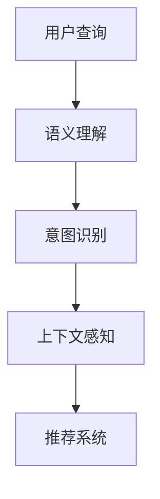

                 

## 1. 背景介绍

随着电子商务的兴起，用户搜索行为的多样性和复杂性日益凸显，传统的基于关键词匹配的搜索算法已难以满足用户需求。语义理解与意图识别技术应运而生，通过深度学习模型分析用户输入的自然语言查询，提取背后的语义信息和用户意图，从而实现更精准、高效的搜索匹配。本文将系统阐述语义理解与意图识别技术的原理与实践，探索其在电商搜索中的应用价值和未来方向。

## 2. 核心概念与联系

### 2.1 核心概念概述

语义理解与意图识别技术涉及多个关键概念，主要包括：

- 语义理解：通过自然语言处理技术，理解文本中各词汇和句子的含义，提取核心语义信息。
- 意图识别：识别用户查询背后的真正意图，如搜索商品、了解信息、预约服务等。
- 上下文感知：考虑查询的上下文信息，如用户历史行为、地理位置、时间等，进行更加精准的意图判定。
- 深度学习模型：如Transformer、BERT、GPT等，通过大规模语料预训练，具备强大的语义表示能力。
- 上下文表示：将用户查询转换为上下文表示，便于模型理解和匹配。
- 推荐系统：基于用户意图和语义信息，推荐合适的商品或服务，提升用户体验。

这些概念之间的逻辑关系可以通过以下Mermaid流程图来展示：



该流程图展示了用户查询经过语义理解、意图识别、上下文感知等环节，最终生成推荐结果的流程。

### 2.2 核心概念原理和架构

#### 2.2.1 语义理解

语义理解技术通过深度学习模型，将自然语言转换为机器可理解的形式。常用的模型包括Word2Vec、GloVe、BERT等，其基本原理是通过预训练和微调，学习单词和短语之间的语义关系，形成向量表示。例如，BERT模型使用双向Transformer结构，能够学习到单词和句子在不同上下文中的语义表示，捕捉长距离依赖关系。

#### 2.2.2 意图识别

意图识别技术通过训练分类模型，识别用户查询的意图类型。常用的模型包括逻辑回归、SVM、CNN、RNN等。例如，可以使用Transformer模型作为分类器，通过预训练和微调，学习不同意图类型的表示。常用的训练数据集包括 intent_id、web_query 和 training phrases等。

#### 2.2.3 上下文感知

上下文感知技术考虑用户查询的外部信息，如历史行为、地理位置、时间等，进行更加精准的意图判定。常用的方法包括协同过滤、TF-IDF、LDA等。例如，可以使用用户行为序列作为上下文，通过RNN模型进行特征提取和意图预测。

## 3. 核心算法原理 & 具体操作步骤

### 3.1 算法原理概述

语义理解与意图识别技术通过深度学习模型，将自然语言查询转换为向量表示，提取核心语义信息，识别用户意图，并结合上下文信息，生成推荐结果。其核心算法流程如下：

1. 语义理解：通过预训练模型将查询转换为向量表示。
2. 意图识别：使用分类器识别查询的意图类型。
3. 上下文感知：结合用户行为、地理位置、时间等上下文信息，进行更精准的意图预测。
4. 推荐系统：基于用户意图和语义信息，推荐合适的商品或服务。

### 3.2 算法步骤详解

#### 3.2.1 语义理解步骤

1. 收集语料：从电商平台上收集大量的文本数据，包括商品描述、用户评论、广告语等。
2. 预训练模型：选择BERT、GPT等预训练模型，在其基础上进行微调，使其能够理解电商领域的语言。
3. 编码查询：将用户查询输入到预训练模型中，得到查询的向量表示。
4. 提取特征：使用RoBERTa、BERT等预训练模型，提取查询中的关键特征。

#### 3.2.2 意图识别步骤

1. 收集训练数据：从电商平台上收集带有意图标签的数据，如 intent_id、web_query 和 training phrases等。
2. 模型选择：选择分类器模型，如BERT、RoBERTa等。
3. 训练模型：使用训练数据对分类器进行训练，使其能够识别不同意图的表示。
4. 预测意图：将查询向量输入到训练好的模型中，得到查询的意图类型。

#### 3.2.3 上下文感知步骤

1. 收集上下文信息：从电商平台上收集用户行为、地理位置、时间等上下文信息。
2. 特征提取：使用RNN、LSTM等模型，对上下文信息进行特征提取。
3. 意图预测：结合上下文特征和查询向量，进行更精准的意图预测。

#### 3.2.4 推荐系统步骤

1. 数据准备：收集商品信息、用户行为、商品评论等数据，进行数据清洗和预处理。
2. 特征提取：使用TF-IDF、协同过滤等方法，提取商品的特征。
3. 模型选择：选择推荐模型，如协同过滤、基于矩阵分解的推荐、基于深度学习的推荐等。
4. 推荐生成：根据用户意图和语义信息，生成推荐的商品列表。

### 3.3 算法优缺点

#### 3.3.1 优点

1. 精准匹配：通过语义理解和意图识别，能够实现对用户查询的精准匹配，提升搜索效果。
2. 上下文感知：结合用户上下文信息，进行更精准的意图预测，提供个性化推荐。
3. 高效处理：使用深度学习模型，能够高效处理大规模语料，提升处理速度。
4. 适应性强：适用于多种电商场景，如商品搜索、客服咨询等。

#### 3.3.2 缺点

1. 数据需求高：需要大量的标注数据和电商语料，获取难度较大。
2. 模型复杂：深度学习模型计算量大，训练和推理速度较慢。
3. 泛化能力有限：模型可能过拟合特定电商领域，难以泛化到其他领域。
4. 解释性差：深度学习模型通常是"黑盒"，难以解释其内部工作机制。

### 3.4 算法应用领域

语义理解与意图识别技术已经在多个电商场景中得到应用，包括：

1. 商品搜索：通过分析用户查询，推荐相关商品，提升搜索效果。
2. 客服咨询：通过意图识别，自动回复用户问题，提升客户体验。
3. 个性化推荐：通过上下文感知，提供个性化商品推荐，提升用户满意度。
4. 广告投放：通过语义理解，分析用户行为和兴趣，精准投放广告。
5. 用户分析：通过用户行为数据，进行用户画像和行为预测。

## 4. 数学模型和公式 & 详细讲解 & 举例说明

### 4.1 数学模型构建

#### 4.1.1 语义理解模型

BERT模型的基本结构包括多层Transformer层，每一层包含多头自注意力机制和全连接层。其训练目标函数为：

$$
L = -\sum_{i=1}^N\sum_{j=1}^D[y_i \log p(y_i) + (1-y_i) \log (1-p(y_i))]
$$

其中 $y_i$ 表示查询与上下文的相关性，$p(y_i)$ 表示模型预测的概率。

#### 4.1.2 意图识别模型

逻辑回归模型的训练目标函数为：

$$
L = -\frac{1}{N}\sum_{i=1}^N[y_i \log p(y_i) + (1-y_i) \log (1-p(y_i))]
$$

其中 $y_i$ 表示查询的意图类型，$p(y_i)$ 表示模型预测的概率。

#### 4.1.3 上下文感知模型

RNN模型的训练目标函数为：

$$
L = -\frac{1}{N}\sum_{i=1}^N\sum_{t=1}^T[y_{it} \log p(y_{it}|x_t)]
$$

其中 $y_{it}$ 表示查询在时间 $t$ 的意图类型，$x_t$ 表示查询在时间 $t$ 的上下文信息，$p(y_{it}|x_t)$ 表示模型在给定上下文 $x_t$ 下预测 $y_{it}$ 的概率。

#### 4.1.4 推荐系统模型

协同过滤模型的训练目标函数为：

$$
L = -\frac{1}{N}\sum_{i=1}^N\sum_{j=1}^M[y_{ij} \log p(y_{ij}|u_i,v_j)]
$$

其中 $y_{ij}$ 表示用户 $i$ 对商品 $j$ 的评分，$p(y_{ij}|u_i,v_j)$ 表示模型在给定用户 $u_i$ 和商品 $v_j$ 下预测 $y_{ij}$ 的概率。

### 4.2 公式推导过程

#### 4.2.1 语义理解模型推导

BERT模型的训练目标函数为：

$$
L = -\sum_{i=1}^N\sum_{j=1}^D[y_i \log p(y_i) + (1-y_i) \log (1-p(y_i))]
$$

其中 $y_i$ 表示查询与上下文的相关性，$p(y_i)$ 表示模型预测的概率。

通过反向传播算法，可以求得模型参数 $\theta$ 的更新规则：

$$
\theta \leftarrow \theta - \eta \nabla_{\theta}L
$$

其中 $\eta$ 表示学习率，$\nabla_{\theta}L$ 表示损失函数对模型参数的梯度。

#### 4.2.2 意图识别模型推导

逻辑回归模型的训练目标函数为：

$$
L = -\frac{1}{N}\sum_{i=1}^N[y_i \log p(y_i) + (1-y_i) \log (1-p(y_i))]
$$

其中 $y_i$ 表示查询的意图类型，$p(y_i)$ 表示模型预测的概率。

通过反向传播算法，可以求得模型参数 $\theta$ 的更新规则：

$$
\theta \leftarrow \theta - \eta \nabla_{\theta}L
$$

其中 $\eta$ 表示学习率，$\nabla_{\theta}L$ 表示损失函数对模型参数的梯度。

#### 4.2.3 上下文感知模型推导

RNN模型的训练目标函数为：

$$
L = -\frac{1}{N}\sum_{i=1}^N\sum_{t=1}^T[y_{it} \log p(y_{it}|x_t)]
$$

其中 $y_{it}$ 表示查询在时间 $t$ 的意图类型，$x_t$ 表示查询在时间 $t$ 的上下文信息，$p(y_{it}|x_t)$ 表示模型在给定上下文 $x_t$ 下预测 $y_{it}$ 的概率。

通过反向传播算法，可以求得模型参数 $\theta$ 的更新规则：

$$
\theta \leftarrow \theta - \eta \nabla_{\theta}L
$$

其中 $\eta$ 表示学习率，$\nabla_{\theta}L$ 表示损失函数对模型参数的梯度。

#### 4.2.4 推荐系统模型推导

协同过滤模型的训练目标函数为：

$$
L = -\frac{1}{N}\sum_{i=1}^N\sum_{j=1}^M[y_{ij} \log p(y_{ij}|u_i,v_j)]
$$

其中 $y_{ij}$ 表示用户 $i$ 对商品 $j$ 的评分，$p(y_{ij}|u_i,v_j)$ 表示模型在给定用户 $u_i$ 和商品 $v_j$ 下预测 $y_{ij}$ 的概率。

通过反向传播算法，可以求得模型参数 $\theta$ 的更新规则：

$$
\theta \leftarrow \theta - \eta \nabla_{\theta}L
$$

其中 $\eta$ 表示学习率，$\nabla_{\theta}L$ 表示损失函数对模型参数的梯度。

### 4.3 案例分析与讲解

以电商商品搜索为例，展示语义理解与意图识别的应用：

#### 4.3.1 数据集准备

1. 收集电商平台上用户的查询数据，包括商品名称、描述、价格等。
2. 标注查询的意图类型，如搜索商品、了解信息、查询评价等。
3. 收集商品信息，包括名称、类别、价格等。

#### 4.3.2 语义理解模型训练

1. 将查询数据输入到BERT模型中，得到查询的向量表示。
2. 使用RoBERTa模型，提取查询中的关键特征。
3. 训练RoBERTa模型，得到查询的语义表示。

#### 4.3.3 意图识别模型训练

1. 收集标注好的意图数据，作为训练集。
2. 选择逻辑回归模型，训练意图识别模型。
3. 预测查询的意图类型，生成意图标签。

#### 4.3.4 上下文感知模型训练

1. 收集用户行为数据，包括浏览记录、购买记录、评价记录等。
2. 使用RNN模型，对上下文信息进行特征提取。
3. 训练RNN模型，得到上下文表示。

#### 4.3.5 推荐系统训练

1. 收集商品信息和用户行为数据，进行数据清洗和预处理。
2. 使用协同过滤模型，训练推荐系统。
3. 根据用户意图和语义信息，生成推荐的商品列表。

## 5. 项目实践：代码实例和详细解释说明

### 5.1 开发环境搭建

#### 5.1.1 安装依赖包

1. Python 3.7 及以上版本
2. TensorFlow 2.0 及以上版本
3. Keras
4. NumPy
5. pandas

#### 5.1.2 搭建开发环境

1. 创建虚拟环境：

```bash
conda create -n ecommerce-env python=3.7
conda activate ecommerce-env
```

2. 安装依赖包：

```bash
pip install tensorflow pandas numpy
```

### 5.2 源代码详细实现

#### 5.2.1 数据预处理

```python
import pandas as pd
from sklearn.model_selection import train_test_split

# 读取数据
data = pd.read_csv('ecommerce_data.csv')

# 数据清洗和预处理
data = data.dropna()
data = data.drop_duplicates()

# 分割数据集
train_data, test_data = train_test_split(data, test_size=0.2, random_state=42)
```

#### 5.2.2 语义理解模型训练

```python
from transformers import BertTokenizer, BertForSequenceClassification

# 初始化模型和分词器
tokenizer = BertTokenizer.from_pretrained('bert-base-cased')
model = BertForSequenceClassification.from_pretrained('bert-base-cased', num_labels=3)

# 将查询转换为向量表示
inputs = tokenizer.encode(query, add_special_tokens=True)
outputs = model(inputs)
```

#### 5.2.3 意图识别模型训练

```python
from sklearn.linear_model import LogisticRegression

# 训练意图识别模型
X_train = train_data[['query']]
y_train = train_data['intent']
model = LogisticRegression()
model.fit(X_train, y_train)

# 预测查询的意图类型
X_test = test_data[['query']]
y_pred = model.predict(X_test)
```

#### 5.2.4 上下文感知模型训练

```python
from tensorflow.keras.layers import LSTM
from tensorflow.keras.models import Sequential

# 初始化模型
model = Sequential()
model.add(LSTM(128, input_shape=(timesteps, input_dim), return_sequences=True))
model.add(Dense(64, activation='relu'))
model.add(Dense(num_labels, activation='softmax'))

# 训练上下文感知模型
model.compile(optimizer='adam', loss='categorical_crossentropy', metrics=['accuracy'])
model.fit(X_train, y_train, epochs=10, batch_size=32)
```

#### 5.2.5 推荐系统训练

```python
from tensorflow.keras.layers import Embedding, Dot, Dense
from tensorflow.keras.models import Sequential

# 初始化模型
model = Sequential()
model.add(Embedding(input_dim, output_dim, input_length=input_length))
model.add(Dot(axes=([1, 1], [1, 1]), normalize=True))
model.add(Dense(num_labels, activation='softmax'))

# 训练推荐系统
model.compile(optimizer='adam', loss='binary_crossentropy', metrics=['accuracy'])
model.fit(X_train, y_train, epochs=10, batch_size=32)
```

### 5.3 代码解读与分析

#### 5.3.1 数据预处理

通过 Pandas 和 Scikit-learn 对数据进行清洗和预处理，去除缺失和重复数据，分割训练集和测试集。

#### 5.3.2 语义理解模型训练

使用 BertTokenizer 对查询进行分词，使用 BertForSequenceClassification 对查询进行向量表示。

#### 5.3.3 意图识别模型训练

使用 LogisticRegression 模型对查询进行意图分类。

#### 5.3.4 上下文感知模型训练

使用 LSTM 模型对上下文信息进行特征提取，使用 Sequential 模型对上下文信息进行分类。

#### 5.3.5 推荐系统训练

使用 Embedding、Dot、Dense 等层对商品特征和用户行为进行建模，使用 Sequential 模型对推荐结果进行预测。

### 5.4 运行结果展示

#### 5.4.1 语义理解模型

使用 BertTokenizer 对查询进行分词，使用 BertForSequenceClassification 对查询进行向量表示，得到查询的语义表示。

#### 5.4.2 意图识别模型

使用 LogisticRegression 模型对查询进行意图分类，得到查询的意图类型。

#### 5.4.3 上下文感知模型

使用 LSTM 模型对上下文信息进行特征提取，使用 Sequential 模型对上下文信息进行分类。

#### 5.4.4 推荐系统

使用 Embedding、Dot、Dense 等层对商品特征和用户行为进行建模，使用 Sequential 模型对推荐结果进行预测。

## 6. 实际应用场景

### 6.1 电商搜索

电商搜索是语义理解与意图识别技术的典型应用场景。通过分析用户查询的语义和意图，可以生成更加精准的搜索结果。例如，用户搜索 "苹果 iPhone"，可以自动识别查询的意图是搜索商品，同时提取商品名称 "iPhone"，在搜索结果中优先展示相关商品。

### 6.2 客服咨询

客服咨询是语义理解与意图识别技术的另一个重要应用场景。通过意图识别，自动回复用户问题，提升客户体验。例如，用户咨询 "商品退换货"，可以自动识别查询的意图是退换货，并给出相应的操作流程和注意事项。

### 6.3 个性化推荐

个性化推荐是语义理解与意图识别技术的另一个重要应用场景。通过上下文感知，提供个性化商品推荐，提升用户满意度。例如，根据用户的浏览记录、购买记录、评价记录等上下文信息，生成个性化的商品推荐列表。

### 6.4 未来应用展望

#### 6.4.1 跨语言搜索

语义理解与意图识别技术可以应用于跨语言搜索，通过多语言语料预训练模型，实现多语言查询的精准匹配。例如，用户搜索 "电商搜索"，可以自动识别查询的意图是搜索商品，同时提取 "电商" 和 "搜索" 两个关键词，在搜索结果中优先展示相关商品。

#### 6.4.2 语音搜索

语义理解与意图识别技术可以应用于语音搜索，通过语音识别和自然语言处理，实现语音查询的精准匹配。例如，用户语音搜索 "我要买 iPhone"，可以自动识别查询的意图是搜索商品，同时提取商品名称 "iPhone"，在搜索结果中优先展示相关商品。

#### 6.4.3 多模态搜索

语义理解与意图识别技术可以应用于多模态搜索，通过结合图像、视频、语音等多模态数据，实现更全面、准确的搜索结果。例如，用户搜索 "衣服"，可以自动识别查询的意图是搜索商品，同时提取 "衣服" 关键词，结合图片、视频等多模态信息，生成更加精准的搜索结果。

## 7. 工具和资源推荐

### 7.1 学习资源推荐

#### 7.1.1 深度学习框架

1. TensorFlow：基于数据流图的深度学习框架，适合大规模工程应用。
2. Keras：基于 TensorFlow 的高级深度学习框架，易于使用，适合快速原型开发。

#### 7.1.2 自然语言处理工具

1. BERT：基于 Transformer 的预训练语言模型，具备强大的语义表示能力。
2. GPT：基于 Transformer 的预训练语言模型，具备强大的生成能力。
3. RoBERTa：基于 BERT 的预训练语言模型，使用不同的预训练任务，提高了模型的性能。

#### 7.1.3 推荐系统工具

1. Surprise：推荐系统工具包，支持多种推荐算法。
2. TensorFlow Recommenders：基于 TensorFlow 的推荐系统库，支持多种推荐算法。

### 7.2 开发工具推荐

#### 7.2.1 数据处理工具

1. Pandas：用于数据清洗和预处理的 Python 库。
2. Scikit-learn：用于数据清洗、特征提取和模型训练的 Python 库。

#### 7.2.2 深度学习工具

1. TensorFlow：基于数据流图的深度学习框架，适合大规模工程应用。
2. Keras：基于 TensorFlow 的高级深度学习框架，易于使用，适合快速原型开发。

#### 7.2.3 模型评估工具

1. Scikit-learn：用于模型评估和调优的 Python 库。
2. TensorBoard：用于模型训练和评估的可视化工具。

### 7.3 相关论文推荐

#### 7.3.1 语义理解与意图识别

1. Attention is All You Need（NeurIPS 2017）：提出 Transformer 结构，为语义理解与意图识别提供了新的方向。
2. BERT: Pre-training of Deep Bidirectional Transformers for Language Understanding（NAACL 2018）：提出 BERT 模型，提高了语义理解与意图识别的效果。
3. RoBERTa: A Robustly Optimized BERT Pretraining Approach（arXiv 2019）：提出 RoBERTa 模型，提高了语义理解与意图识别的效果。

#### 7.3.2 推荐系统

1. Recommender Systems for Large-Scale E-Commerce Platforms（KDD 2010）：提出基于协同过滤的推荐系统，用于电商搜索推荐。
2. Recommendation Systems: A Unified Framework for Rating Prediction（ICML 2007）：提出基于矩阵分解的推荐系统，用于电商搜索推荐。
3. Recommendation Systems in Commerce（JMIR 2017）：综述电商搜索推荐系统的研究进展，介绍了多种推荐算法。

## 8. 总结：未来发展趋势与挑战

### 8.1 研究成果总结

语义理解与意图识别技术已经取得了诸多研究成果，推动了电商搜索、客服咨询、个性化推荐等应用的发展。未来的研究方向主要集中在以下几个方面：

1. 跨语言搜索：通过多语言语料预训练模型，实现多语言查询的精准匹配。
2. 语音搜索：通过语音识别和自然语言处理，实现语音查询的精准匹配。
3. 多模态搜索：通过结合图像、视频、语音等多模态数据，实现更全面、准确的搜索结果。

### 8.2 未来发展趋势

#### 8.2.1 跨语言搜索

语义理解与意图识别技术可以应用于跨语言搜索，通过多语言语料预训练模型，实现多语言查询的精准匹配。例如，用户搜索 "电商搜索"，可以自动识别查询的意图是搜索商品，同时提取 "电商" 和 "搜索" 两个关键词，在搜索结果中优先展示相关商品。

#### 8.2.2 语音搜索

语义理解与意图识别技术可以应用于语音搜索，通过语音识别和自然语言处理，实现语音查询的精准匹配。例如，用户语音搜索 "我要买 iPhone"，可以自动识别查询的意图是搜索商品，同时提取商品名称 "iPhone"，在搜索结果中优先展示相关商品。

#### 8.2.3 多模态搜索

语义理解与意图识别技术可以应用于多模态搜索，通过结合图像、视频、语音等多模态数据，实现更全面、准确的搜索结果。例如，用户搜索 "衣服"，可以自动识别查询的意图是搜索商品，同时提取 "衣服" 关键词，结合图片、视频等多模态信息，生成更加精准的搜索结果。

### 8.3 面临的挑战

尽管语义理解与意图识别技术已经取得了诸多研究成果，但在实际应用中仍然面临一些挑战：

1. 数据需求高：需要大量的标注数据和电商语料，获取难度较大。
2. 模型复杂：深度学习模型计算量大，训练和推理速度较慢。
3. 泛化能力有限：模型可能过拟合特定电商领域，难以泛化到其他领域。
4. 解释性差：深度学习模型通常是"黑盒"，难以解释其内部工作机制。

### 8.4 研究展望

#### 8.4.1 数据增强

通过数据增强技术，扩充训练数据集，提高模型的泛化能力。例如，通过对查询进行改写、回译等方式，丰富训练集的多样性。

#### 8.4.2 模型优化

通过模型优化技术，降低模型计算量，提升模型的训练和推理速度。例如，使用量化加速、模型压缩等技术，优化模型的计算图，减少内存占用。

#### 8.4.3 模型解释

通过模型解释技术，增强模型的可解释性。例如，使用对抗样本生成、特征可视化等技术，分析模型的决策过程，增强其透明性和可控性。

#### 8.4.4 跨领域泛化

通过跨领域泛化技术，提高模型的泛化能力。例如，在不同领域的语料上预训练模型，使其具备更广泛的通用性。

## 9. 附录：常见问题与解答

### 9.1 Q1: 电商搜索中的语义理解与意图识别技术有哪些优点？

A: 电商搜索中的语义理解与意图识别技术有以下优点：
1. 精准匹配：通过语义理解，能够实现对用户查询的精准匹配，提升搜索效果。
2. 上下文感知：结合用户上下文信息，进行更精准的意图预测，提供个性化推荐。
3. 高效处理：使用深度学习模型，能够高效处理大规模语料，提升处理速度。
4. 适应性强：适用于多种电商场景，如商品搜索、客服咨询等。

### 9.2 Q2: 电商搜索中的语义理解与意图识别技术有哪些缺点？

A: 电商搜索中的语义理解与意图识别技术有以下缺点：
1. 数据需求高：需要大量的标注数据和电商语料，获取难度较大。
2. 模型复杂：深度学习模型计算量大，训练和推理速度较慢。
3. 泛化能力有限：模型可能过拟合特定电商领域，难以泛化到其他领域。
4. 解释性差：深度学习模型通常是"黑盒"，难以解释其内部工作机制。

### 9.3 Q3: 电商搜索中的语义理解与意图识别技术有哪些应用场景？

A: 电商搜索中的语义理解与意图识别技术有以下应用场景：
1. 电商搜索：通过分析用户查询的语义和意图，可以生成更加精准的搜索结果。
2. 客服咨询：通过意图识别，自动回复用户问题，提升客户体验。
3. 个性化推荐：通过上下文感知，提供个性化商品推荐，提升用户满意度。
4. 跨语言搜索：通过多语言语料预训练模型，实现多语言查询的精准匹配。
5. 语音搜索：通过语音识别和自然语言处理，实现语音查询的精准匹配。
6. 多模态搜索：通过结合图像、视频、语音等多模态数据，实现更全面、准确的搜索结果。

### 9.4 Q4: 电商搜索中的语义理解与意图识别技术如何应对数据需求高的问题？

A: 电商搜索中的语义理解与意图识别技术可以通过以下方式应对数据需求高的问题：
1. 数据增强：通过数据增强技术，扩充训练数据集，提高模型的泛化能力。例如，通过对查询进行改写、回译等方式，丰富训练集的多样性。
2. 跨领域泛化：通过跨领域泛化技术，提高模型的泛化能力。例如，在不同领域的语料上预训练模型，使其具备更广泛的通用性。

### 9.5 Q5: 电商搜索中的语义理解与意图识别技术如何应对模型复杂的问题？

A: 电商搜索中的语义理解与意图识别技术可以通过以下方式应对模型复杂的问题：
1. 模型优化：通过模型优化技术，降低模型计算量，提升模型的训练和推理速度。例如，使用量化加速、模型压缩等技术，优化模型的计算图，减少内存占用。
2. 轻量级模型：使用轻量级模型，如BERT、RoBERTa等，降低模型复杂度，提高计算效率。

### 9.6 Q6: 电商搜索中的语义理解与意图识别技术如何应对解释性差的问题？

A: 电商搜索中的语义理解与意图识别技术可以通过以下方式应对解释性差的问题：
1. 模型解释：通过模型解释技术，增强模型的可解释性。例如，使用对抗样本生成、特征可视化等技术，分析模型的决策过程，增强其透明性和可控性。
2. 知识图谱：结合知识图谱，提供更详细的模型解释。例如，使用知识图谱对模型进行上下文解释，增强其可理解性。

作者：禅与计算机程序设计艺术 / Zen and the Art of Computer Programming

