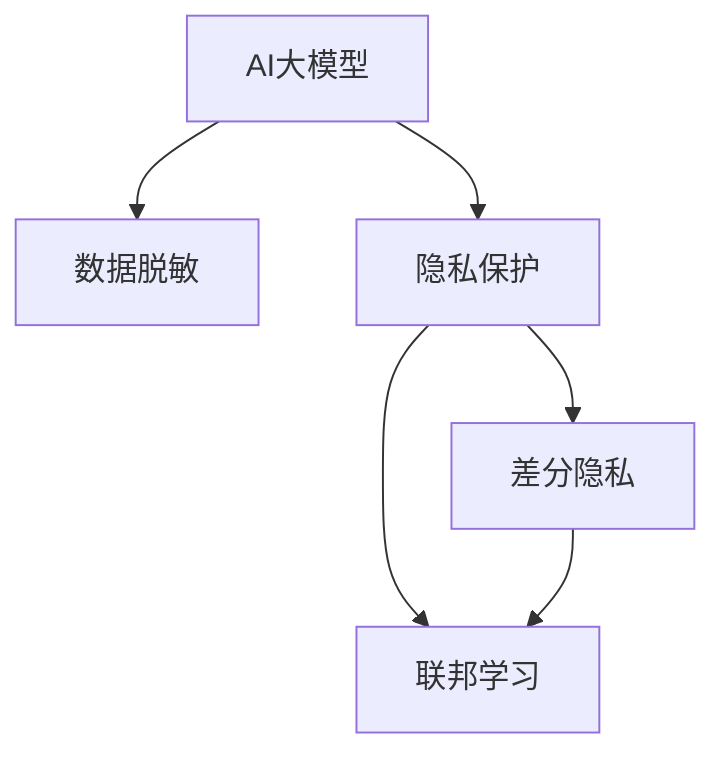

                 

# 电商搜索推荐中的AI大模型数据脱敏与隐私保护技术

> 关键词：人工智能大模型, 数据脱敏, 隐私保护, 电商搜索, 推荐系统, 数据治理, 数据安全

## 1. 背景介绍

### 1.1 问题由来
随着人工智能（AI）技术的迅猛发展，AI大模型在电商搜索推荐系统中的应用越来越广泛。这些模型能够利用大规模的消费者数据进行深度学习，从而为用户提供精准的搜索和推荐服务。然而，在享受AI带来的便利的同时，数据隐私和安全问题也日益突出。

消费者对数据隐私保护意识的增强、监管政策的日趋严格以及数据泄露事件频发，使得如何在利用AI大模型提升电商搜索推荐效果的同时，确保数据隐私安全，成为电商企业面临的重要挑战。

### 1.2 问题核心关键点
电商搜索推荐中的AI大模型数据脱敏与隐私保护问题，主要涉及以下几个关键点：

1. **数据获取与利用**：如何合法合规地获取和利用消费者数据，同时尽可能保证数据隐私。
2. **数据隐私保护**：在AI大模型的训练和推理过程中，如何防止数据泄露和滥用。
3. **数据治理与合规**：建立完善的数据治理框架，确保数据处理流程符合法规要求。
4. **隐私保护技术**：引入隐私保护技术，如差分隐私、联邦学习等，保护数据隐私。

## 2. 核心概念与联系

### 2.1 核心概念概述

为更好地理解电商搜索推荐中的AI大模型数据脱敏与隐私保护技术，本节将介绍几个密切相关的核心概念：

- **AI大模型**：指通过自监督或监督学习的方式，在大规模无标签或标注数据上进行训练，具备强大的数据处理和分析能力的深度学习模型，如BERT、GPT等。
- **数据脱敏**：指在确保数据可用性的前提下，对数据进行匿名化、模糊化、扰动等处理，使得数据无法直接被识别或重现，从而保护数据隐私。
- **隐私保护**：指在数据处理过程中，采用技术手段和管理措施，确保数据仅在授权范围内被使用，防止未经授权的访问和使用。
- **差分隐私**：指在数据分析过程中，通过向数据中添加噪声，使得个体数据无法被单独识别，从而保护隐私。
- **联邦学习**：指多个参与方在不共享原始数据的情况下，通过模型参数的分布式更新，共同训练出一个全局模型，从而实现隐私保护。

这些核心概念之间的逻辑关系可以通过以下Mermaid流程图来展示：



这个流程图展示了大模型处理数据的几个关键环节：

1. 通过数据脱敏技术处理原始数据。
2. 在模型训练和推理过程中，采用隐私保护技术确保数据安全。
3. 差分隐私和联邦学习是隐私保护中的两种重要手段。
4. 差分隐私和联邦学习相互配合，共同构建更强大的隐私保护体系。

## 3. 核心算法原理 & 具体操作步骤
### 3.1 算法原理概述

电商搜索推荐中的AI大模型数据脱敏与隐私保护，本质上是一个数据治理和隐私保护的过程。其核心思想是：通过一系列技术手段和管理措施，确保电商企业在不侵犯消费者隐私的前提下，有效利用数据提升AI大模型的性能。

具体来说，AI大模型在电商搜索推荐中的应用，主要分为数据获取、模型训练、推理预测三个阶段。每个阶段都涉及数据隐私保护的问题，需要通过数据脱敏和隐私保护技术进行处理。

1. **数据获取**：通过合法渠道获取消费者数据，如交易记录、浏览历史等，并采用数据脱敏技术，防止数据泄露。
2. **模型训练**：在脱敏后的数据上训练AI大模型，通过差分隐私等隐私保护技术，确保模型训练过程不侵犯数据隐私。
3. **推理预测**：在推理预测时，使用隐私保护的推理技术，防止模型输出泄露个人隐私。

### 3.2 算法步骤详解

电商搜索推荐中的AI大模型数据脱敏与隐私保护，一般包括以下几个关键步骤：

**Step 1: 数据准备与收集**
- 通过合法途径收集电商平台的消费者数据，包括交易记录、浏览历史、评分信息等。
- 对原始数据进行初步清洗，去除噪声和异常值，确保数据质量。

**Step 2: 数据脱敏**
- 选择合适的数据脱敏技术，如泛化、扰动、掩码等，对敏感数据进行处理。
- 将脱敏后的数据作为模型训练的输入。

**Step 3: 模型训练**
- 使用差分隐私等隐私保护技术，对模型训练过程进行约束。
- 设计合适的损失函数和优化算法，进行模型训练。

**Step 4: 模型部署与推理**
- 将训练好的模型部署到电商搜索推荐系统。
- 使用隐私保护的推理技术，确保模型输出不泄露个人隐私。

**Step 5: 数据审计与监控**
- 定期对模型输出和数据使用情况进行审计，确保符合隐私保护要求。
- 设置告警机制，监控异常行为，及时处理数据安全事件。

### 3.3 算法优缺点

电商搜索推荐中的AI大模型数据脱敏与隐私保护方法，具有以下优点：
1. 提升数据可用性。数据脱敏和隐私保护技术，使得数据可以在不泄露隐私的前提下，被广泛利用。
2. 确保数据安全。通过差分隐私、联邦学习等技术，有效防止数据泄露和滥用。
3. 提升模型效果。脱敏后的数据减少了噪声，有助于提升模型的性能。
4. 符合法规要求。符合GDPR、CCPA等隐私保护法规的要求，避免法律风险。

同时，该方法也存在一定的局限性：
1. 数据质量下降。数据脱敏可能会引入噪声，影响数据的原始分布。
2. 隐私保护复杂。差分隐私和联邦学习等技术，需要复杂的数学和算法支持。
3. 模型训练成本高。隐私保护的模型训练过程，可能需要更多的计算资源和时间。
4. 推理速度慢。隐私保护的推理技术，可能增加推理的计算负担。

尽管存在这些局限性，但就目前而言，电商搜索推荐中的AI大模型数据脱敏与隐私保护方法，是确保数据隐私和安全的最主流范式。未来相关研究的重点在于如何进一步降低隐私保护的计算成本，提高推理速度，同时兼顾模型性能和数据质量。

### 3.4 算法应用领域

电商搜索推荐中的AI大模型数据脱敏与隐私保护技术，已经广泛应用于电商平台的搜索推荐系统。具体来说，包括以下几个方面：

- **个性化推荐**：通过分析用户的历史行为和兴趣，提供个性化的商品推荐，提升用户满意度和转化率。
- **风险控制**：通过分析交易数据，识别欺诈行为，保护电商平台和消费者利益。
- **客户服务**：通过分析用户咨询记录，优化客户服务流程，提升用户体验。
- **市场分析**：通过分析用户反馈和评价，获取市场趋势和用户需求，指导电商平台的运营策略。

除了上述这些主要应用外，AI大模型数据脱敏与隐私保护技术，还可以应用于用户隐私保护、数据安全审计、数据共享合作等领域，为电商平台的数字化转型提供强有力的技术支持。

## 4. 数学模型和公式 & 详细讲解  
### 4.1 数学模型构建

本节将使用数学语言对电商搜索推荐中的AI大模型数据脱敏与隐私保护过程进行更加严格的刻画。

记原始消费者数据集为 $D=\{(x_i,y_i)\}_{i=1}^N$，其中 $x_i$ 为特征向量，$y_i$ 为标签。假设计算机使用差分隐私机制对数据进行处理，得到脱敏后的数据集 $D'$，其中 $x_i'$ 为处理后的特征向量。

定义模型 $M_{\theta}:\mathcal{X} \rightarrow \mathcal{Y}$，其中 $\mathcal{X}$ 为特征空间，$\mathcal{Y}$ 为标签空间，$\theta$ 为模型参数。假设使用差分隐私机制，对模型进行训练，得到最优参数 $\hat{\theta}$。

### 4.2 公式推导过程

以差分隐私机制为例，推导其数学公式。差分隐私机制的目标是在保证数据隐私的前提下，最大化模型性能。假设使用拉普拉斯噪声来保护隐私，则模型在输入 $x_i$ 上的输出为：

$$
\hat{y}=M_{\theta}(x_i') + \epsilon
$$

其中 $\epsilon \sim \text{Laplace}(0,\sigma)$，$\sigma$ 为噪声强度。在数据集 $D'$ 上，模型的损失函数为：

$$
\mathcal{L}(\hat{\theta},D') = -\frac{1}{N}\sum_{i=1}^N [y_i\log M_{\hat{\theta}}(x_i')+(1-y_i)\log(1-M_{\hat{\theta}}(x_i'))]
$$

通过最大化对数似然函数，可以求解得到最优参数 $\hat{\theta}$。具体的优化公式为：

$$
\hat{\theta} = \mathop{\arg\min}_{\theta} \mathcal{L}(\theta,D')
$$

将上述公式带入优化过程，得到：

$$
\hat{\theta} = \mathop{\arg\min}_{\theta} \mathcal{L}(\theta,D') - \eta\sum_{i=1}^N \log(\frac{1}{\sigma}\exp(\frac{y_i}{\sigma}M_{\theta}(x_i')-\frac{1-y_i}{\sigma}\log(1-M_{\theta}(x_i'))+\frac{\epsilon}{\sigma})
$$

其中 $\eta$ 为学习率，$\epsilon$ 为拉普拉斯噪声参数。

### 4.3 案例分析与讲解

以下我们以差分隐私机制为例，分析其在电商搜索推荐中的应用。假设电商平台希望使用AI大模型训练个性化推荐系统，使用差分隐私机制来保护用户隐私。

1. **数据收集**：电商平台收集用户的浏览记录、购买历史等数据，作为模型训练的输入。
2. **数据脱敏**：对原始数据进行泛化、扰动等处理，确保数据隐私。
3. **模型训练**：在脱敏后的数据上，使用差分隐私机制训练AI大模型，得到最优参数 $\hat{\theta}$。
4. **推理预测**：在推理预测时，使用隐私保护的推理技术，确保模型输出不泄露用户隐私。

通过差分隐私机制，电商平台可以在保护用户隐私的前提下，利用数据提升个性化推荐系统的效果，同时符合隐私保护法规的要求。

## 5. 项目实践：代码实例和详细解释说明
### 5.1 开发环境搭建

在进行电商搜索推荐中的AI大模型数据脱敏与隐私保护实践前，我们需要准备好开发环境。以下是使用Python进行TensorFlow开发的环境配置流程：

1. 安装Anaconda：从官网下载并安装Anaconda，用于创建独立的Python环境。

2. 创建并激活虚拟环境：
```bash
conda create -n tf-env python=3.8 
conda activate tf-env
```

3. 安装TensorFlow：根据CUDA版本，从官网获取对应的安装命令。例如：
```bash
conda install tensorflow==2.7
```

4. 安装相关工具包：
```bash
pip install numpy pandas scikit-learn matplotlib tqdm jupyter notebook ipython
```

完成上述步骤后，即可在`tf-env`环境中开始电商搜索推荐中的AI大模型数据脱敏与隐私保护实践。

### 5.2 源代码详细实现

这里我们以使用差分隐私机制训练电商推荐模型为例，给出TensorFlow代码实现。

首先，定义推荐任务的数据处理函数：

```python
import tensorflow as tf
import numpy as np

def preprocess_data(data):
    # 将数据转化为特征和标签
    features = data[:, :-1]
    labels = data[:, -1]
    return features, labels
```

然后，定义推荐模型的结构：

```python
class Recommender(tf.keras.Model):
    def __init__(self, num_features):
        super(Recommender, self).__init__()
        self.fc1 = tf.keras.layers.Dense(64, activation='relu')
        self.fc2 = tf.keras.layers.Dense(32, activation='relu')
        self.fc3 = tf.keras.layers.Dense(1, activation='sigmoid')
    
    def call(self, x):
        x = self.fc1(x)
        x = self.fc2(x)
        return self.fc3(x)
```

接着，定义差分隐私机制：

```python
def apply_differential_privacy(model, features, labels, epsilon=1.0):
    # 计算拉普拉斯噪声
    noise = tf.random.normal(shape=(len(features), 1), mean=0.0, stddev=epsilon/2.0)
    
    # 在模型输出上添加噪声
    output = model(features)
    noisy_output = output + noise
    
    # 计算损失函数
    loss = tf.reduce_mean(tf.nn.sigmoid_cross_entropy_with_logits(logits=noisy_output, labels=labels))
    
    # 计算梯度并更新模型参数
    grads = tf.gradients(loss, model.trainable_variables)
    grads = [tf.stop_gradient(g) for g in grads]
    optimizer = tf.keras.optimizers.Adam(learning_rate=0.01)
    optimizer.apply_gradients(zip(grads, model.trainable_variables))
    
    return loss
```

最后，启动训练流程：

```python
tf.random.set_seed(42)

# 准备数据
features = np.random.randn(1000, 10)
labels = np.random.randint(2, size=1000)

# 构建模型
model = Recommender(num_features=10)

# 训练模型
for epoch in range(100):
    loss = apply_differential_privacy(model, features, labels)
    print(f'Epoch {epoch+1}, Loss: {loss.numpy():.4f}')
```

以上就是使用TensorFlow对电商推荐模型进行差分隐私训练的完整代码实现。可以看到，TensorFlow提供了丰富的深度学习组件，可以方便地构建和训练模型。

### 5.3 代码解读与分析

让我们再详细解读一下关键代码的实现细节：

**preprocess_data函数**：
- 定义数据处理函数，将原始数据转化为特征和标签，方便模型训练。

**Recommender模型**：
- 定义推荐模型的结构，包括全连接层和激活函数。
- 使用`tf.keras.Model`类定义模型，方便在TensorFlow中进行训练和推理。

**apply_differential_privacy函数**：
- 定义差分隐私机制，使用拉普拉斯噪声保护模型隐私。
- 在模型输出上添加噪声，计算损失函数，并使用Adam优化器更新模型参数。
- 返回损失函数，方便模型训练的迭代过程。

**训练流程**：
- 设置随机种子，保证实验可复现。
- 准备训练数据，生成随机特征和标签。
- 构建推荐模型，使用`Recommender`类定义模型结构。
- 进行模型训练，迭代更新模型参数。

## 6. 实际应用场景
### 6.1 智能客服系统

电商平台的智能客服系统可以通过AI大模型进行智能应答和问题解答。使用差分隐私机制，可以有效保护用户隐私，同时提升客服系统的智能化水平。

在技术实现上，可以收集客服对话历史数据，利用差分隐私机制对数据进行处理，训练AI大模型进行智能应答。对于用户的新咨询，系统能够快速理解和回答，提升客户体验。

### 6.2 个性化推荐

电商平台的个性化推荐系统可以通过AI大模型进行商品推荐。使用差分隐私机制，可以在保护用户隐私的前提下，提升推荐系统的个性化和精准度。

具体而言，可以收集用户的历史浏览和购买记录，使用差分隐私机制对数据进行处理，训练AI大模型进行商品推荐。推荐系统能够根据用户的行为模式，推荐相关商品，提升用户的购物体验和转化率。

### 6.3 风险控制

电商平台的风险控制系统可以通过AI大模型进行欺诈检测。使用差分隐私机制，可以有效保护用户隐私，同时提升系统的检测准确率和及时性。

在技术实现上，可以收集用户的交易记录，使用差分隐私机制对数据进行处理，训练AI大模型进行欺诈检测。系统能够实时监测交易行为，识别异常交易，及时预警和阻止欺诈行为，保护电商平台和消费者利益。

### 6.4 未来应用展望

随着AI大模型和差分隐私机制的不断发展，电商搜索推荐中的数据脱敏与隐私保护技术将呈现以下几个发展趋势：

1. **隐私保护技术创新**：未来的隐私保护技术将更加复杂和多样化，如联邦学习、多方安全计算等，能够在不共享原始数据的情况下，联合训练出更强大的模型。
2. **隐私保护与数据利用并行**：未来的隐私保护技术将能够在不影响数据利用的情况下，保护数据隐私，提升数据利用效率。
3. **隐私保护机制集成**：未来的隐私保护机制将更加集成和自动化，能够自动检测和响应隐私保护风险，确保数据处理流程符合法规要求。
4. **隐私保护与业务协同**：未来的隐私保护技术将更好地融入业务流程，与业务系统无缝集成，提升整体运营效率。

这些趋势预示着电商搜索推荐中的AI大模型数据脱敏与隐私保护技术将迎来新的突破，为电商平台的数字化转型提供更强有力的技术保障。

## 7. 工具和资源推荐
### 7.1 学习资源推荐

为了帮助开发者系统掌握电商搜索推荐中的AI大模型数据脱敏与隐私保护技术，这里推荐一些优质的学习资源：

1. TensorFlow官方文档：提供了完整的深度学习组件和API，适合快速上手学习和实验。
2. TensorFlow Privacy：官方隐私保护库，提供了差分隐私、联邦学习等隐私保护技术。
3. Kaggle竞赛：参与Kaggle的隐私保护竞赛，实战演练隐私保护技术，提升实践能力。
4. Coursera和edX课程：斯坦福大学和MIT等高校提供的隐私保护课程，系统讲解隐私保护原理和技术。
5. 《TensorFlow实战》书籍：深入浅出地介绍TensorFlow的使用方法和隐私保护技巧，适合初学者和进阶开发者。

通过对这些资源的学习实践，相信你一定能够快速掌握电商搜索推荐中的AI大模型数据脱敏与隐私保护技术，并用于解决实际的隐私保护问题。

### 7.2 开发工具推荐

高效的开发离不开优秀的工具支持。以下是几款用于电商搜索推荐中的AI大模型数据脱敏与隐私保护开发的常用工具：

1. TensorFlow：由Google主导开发的开源深度学习框架，生产部署方便，适合大规模工程应用。
2. TensorFlow Privacy：官方隐私保护库，提供了差分隐私、联邦学习等隐私保护技术。
3. TensorBoard：TensorFlow配套的可视化工具，可实时监测模型训练状态，提供丰富的图表呈现方式。
4. Weights & Biases：模型训练的实验跟踪工具，可以记录和可视化模型训练过程中的各项指标。
5. Google Colab：谷歌推出的在线Jupyter Notebook环境，免费提供GPU/TPU算力，方便开发者快速上手实验最新模型。

合理利用这些工具，可以显著提升电商搜索推荐中的AI大模型数据脱敏与隐私保护任务的开发效率，加快创新迭代的步伐。

### 7.3 相关论文推荐

电商搜索推荐中的AI大模型数据脱敏与隐私保护技术，源于学界的持续研究。以下是几篇奠基性的相关论文，推荐阅读：

1. Differential Privacy by Augmenting Data: A Case Study (SIGKDD 2014)：介绍差分隐私机制的基本原理和应用案例。
2. Privacy-Preserving Federated Learning: A Tutorial (IEEE Access 2020)：系统介绍联邦学习的基本概念和算法。
3. Federated Learning with Asynchronous Model Averaging in Mobile Edge Networks (ICC 2020)：探讨联邦学习在移动边缘网络中的应用。
4. Privacy-Aware Recommender Systems: A Survey (IEEE Access 2019)：全面回顾隐私保护在推荐系统中的应用现状和技术进展。
5. Privacy-Preserving Machine Learning: A Survey (Journal of Big Data 2020)：综述隐私保护在机器学习中的方法和技术。

这些论文代表了大模型数据脱敏与隐私保护技术的发展脉络。通过学习这些前沿成果，可以帮助研究者把握学科前进方向，激发更多的创新灵感。

## 8. 总结：未来发展趋势与挑战

### 8.1 总结

本文对电商搜索推荐中的AI大模型数据脱敏与隐私保护技术进行了全面系统的介绍。首先阐述了电商搜索推荐系统面临的数据隐私和安全问题，明确了数据脱敏和隐私保护的重要性。其次，从原理到实践，详细讲解了差分隐私等隐私保护技术的数学原理和关键步骤，给出了电商搜索推荐系统中的数据脱敏与隐私保护完整代码实现。同时，本文还广泛探讨了隐私保护技术在电商搜索推荐系统中的应用前景，展示了隐私保护范式的巨大潜力。此外，本文精选了隐私保护技术的各类学习资源，力求为读者提供全方位的技术指引。

通过本文的系统梳理，可以看到，电商搜索推荐中的AI大模型数据脱敏与隐私保护技术，正在成为电商行业的重要范式，极大地提升了电商平台的智能化水平，保障了消费者数据隐私。未来，伴随隐私保护技术的不断发展，电商平台的数字化转型将更加安全可靠，为消费者带来更优质的购物体验。

### 8.2 未来发展趋势

展望未来，电商搜索推荐中的AI大模型数据脱敏与隐私保护技术将呈现以下几个发展趋势：

1. **隐私保护技术创新**：未来的隐私保护技术将更加复杂和多样化，如联邦学习、多方安全计算等，能够在不共享原始数据的情况下，联合训练出更强大的模型。
2. **隐私保护与数据利用并行**：未来的隐私保护技术将能够在不影响数据利用的情况下，保护数据隐私，提升数据利用效率。
3. **隐私保护机制集成**：未来的隐私保护机制将更加集成和自动化，能够自动检测和响应隐私保护风险，确保数据处理流程符合法规要求。
4. **隐私保护与业务协同**：未来的隐私保护技术将更好地融入业务流程，与业务系统无缝集成，提升整体运营效率。
5. **隐私保护与用户透明**：未来的隐私保护技术将能够向用户透明展示数据处理方式和隐私保护措施，提升用户信任感。

这些趋势预示着电商搜索推荐中的AI大模型数据脱敏与隐私保护技术将迎来新的突破，为电商平台的数字化转型提供更强有力的技术保障。

### 8.3 面临的挑战

尽管电商搜索推荐中的AI大模型数据脱敏与隐私保护技术已经取得了瞩目成就，但在迈向更加智能化、普适化应用的过程中，它仍面临着诸多挑战：

1. **隐私保护复杂**：差分隐私和联邦学习等隐私保护技术，需要复杂的数学和算法支持。如何简化技术实现，降低计算成本，是需要解决的重要问题。
2. **数据利用效率低**：隐私保护技术引入了噪声和计算负担，可能降低数据利用效率。如何在保证隐私的同时，最大化数据利用价值，是一个关键挑战。
3. **隐私保护机制兼容性**：不同隐私保护机制的兼容性问题，需要进一步研究和优化。
4. **隐私保护与业务需求协同**：隐私保护机制需要与业务需求协同设计，确保既能保护隐私，又能满足业务要求。
5. **用户隐私意识增强**：用户隐私意识的增强，对隐私保护技术提出了更高的要求。如何在用户隐私保护和数据利用之间找到平衡，是电商平台面临的挑战。

这些挑战凸显了大模型数据脱敏与隐私保护技术的复杂性和难度。未来，研究者需要进一步探索和优化隐私保护技术，同时加强与业务系统的协同设计，才能真正实现电商平台的数字化转型。

### 8.4 研究展望

面对电商搜索推荐中的AI大模型数据脱敏与隐私保护所面临的挑战，未来的研究需要在以下几个方面寻求新的突破：

1. **隐私保护技术优化**：开发更加高效和易于实施的隐私保护技术，降低计算成本，提升数据利用效率。
2. **隐私保护机制集成**：研究隐私保护机制与业务系统的集成方法，确保隐私保护技术与业务需求无缝协同。
3. **隐私保护技术普及**：推动隐私保护技术的普及应用，提高电商平台的整体隐私保护水平。
4. **隐私保护技术评估**：建立隐私保护技术的评估体系，衡量其隐私保护效果和数据利用效率。
5. **隐私保护技术与业务协同**：探索隐私保护技术在电商平台的实际应用，提升整体运营效率。

这些研究方向的探索，必将引领电商搜索推荐中的AI大模型数据脱敏与隐私保护技术迈向更高的台阶，为电商平台的数字化转型提供强有力的技术支持。面向未来，隐私保护技术需要与其他AI技术进行更深入的融合，如因果推理、强化学习等，多路径协同发力，共同推动电商平台的智能化发展。

## 9. 附录：常见问题与解答

**Q1：电商搜索推荐系统如何进行数据脱敏？**

A: 电商搜索推荐系统可以使用多种数据脱敏技术，如泛化、扰动、掩码等，对原始数据进行处理。具体步骤包括：
1. 对敏感数据进行泛化，减少数据粒度。
2. 对数据进行扰动，如添加噪声或交换数据。
3. 对数据进行掩码，隐藏部分敏感信息。

这些技术可以在保护数据隐私的同时，保留数据的可用性，便于后续模型训练和推理。

**Q2：差分隐私机制对电商搜索推荐系统有什么影响？**

A: 差分隐私机制对电商搜索推荐系统有以下影响：
1. 保护用户隐私：在模型训练和推理过程中，通过添加噪声，使得个体数据无法被单独识别，保护用户隐私。
2. 提升模型效果：虽然增加了计算负担，但差分隐私机制可以提升模型的泛化能力和鲁棒性，进而提升推荐效果。
3. 法规合规：符合GDPR、CCPA等隐私保护法规的要求，避免法律风险。

尽管差分隐私机制增加了计算成本，但其在保护用户隐私和提升推荐效果方面的优势，使得其在电商搜索推荐系统中具有广泛的应用前景。

**Q3：联邦学习在电商搜索推荐中的应用场景是什么？**

A: 联邦学习在电商搜索推荐中的应用场景包括：
1. 跨平台推荐：电商平台的多个子平台可以通过联邦学习，联合训练推荐模型，提升整体推荐效果。
2. 跨机构合作：电商企业与其他机构（如社交媒体、银行等）可以通过联邦学习，联合训练推荐模型，获取更全面的用户数据。
3. 个性化推荐：电商企业可以利用联邦学习，联合训练跨平台的个性化推荐模型，提升推荐精准度。
4. 风险控制：电商企业可以与其他机构联合训练风险控制模型，提升欺诈检测和风险控制的准确性。

通过联邦学习，电商搜索推荐系统可以在不共享原始数据的情况下，联合训练出更强大的模型，提升推荐效果，同时保护用户隐私。

**Q4：如何在电商搜索推荐系统中实现隐私保护与数据利用的平衡？**

A: 在电商搜索推荐系统中实现隐私保护与数据利用的平衡，可以从以下几个方面入手：
1. 选择合适的隐私保护技术，如差分隐私、联邦学习等，确保隐私保护的同时，最大化数据利用效率。
2. 优化隐私保护算法，降低计算成本，提升数据利用效率。
3. 结合业务需求，设计合理的隐私保护机制，确保隐私保护技术与业务需求无缝协同。
4. 引入用户反馈机制，实时调整隐私保护策略，确保隐私保护与数据利用之间的动态平衡。
5. 制定隐私保护政策，确保隐私保护技术符合法规要求，提升用户信任感。

通过这些措施，可以在电商搜索推荐系统中实现隐私保护与数据利用的平衡，确保系统的安全和稳定运行。

**Q5：电商搜索推荐系统如何应对数据隐私泄露风险？**

A: 电商搜索推荐系统应对数据隐私泄露风险，可以从以下几个方面入手：
1. 采用差分隐私、联邦学习等隐私保护技术，确保数据隐私。
2. 加强数据存储和传输的安全措施，防止数据泄露。
3. 定期进行数据审计和风险评估，及时发现和处理数据安全问题。
4. 设置告警机制，实时监测数据安全事件，及时响应和处理。
5. 建立数据安全管理制度，明确数据处理流程和责任。

通过这些措施，可以最大限度地降低数据隐私泄露的风险，确保电商搜索推荐系统的安全和稳定运行。

---

作者：禅与计算机程序设计艺术 / Zen and the Art of Computer Programming

