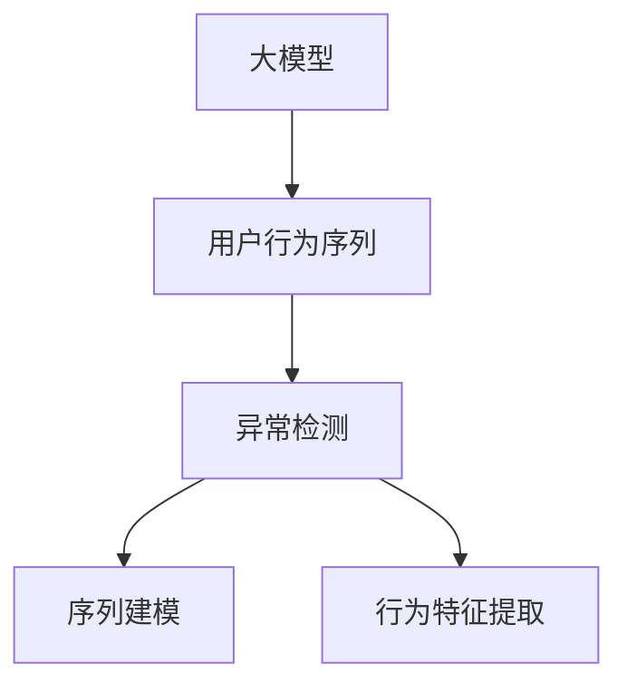

                 

# 电商搜索推荐中的AI大模型用户行为序列异常检测模型实践案例

## 1. 背景介绍

### 1.1 问题由来

在电商搜索推荐领域，用户行为数据是核心资源。通过分析用户浏览、点击、购买等行为序列，电商平台可以为用户提供个性化推荐，提升用户体验和销售转化率。但与此同时，异常行为数据也逐渐成为一大挑战。例如，某些用户在短时间内大量点击某个商品，再迅速点击其他商品，可能存在虚假点击行为；某些用户频繁点击同一商品但未购买，可能属于误点击。如何有效检测和处理这些异常行为，对电商平台的推荐系统至关重要。

### 1.2 问题核心关键点

- 用户行为序列异常检测：识别用户行为序列中不符合常理的异常行为。
- 大模型在电商推荐中的应用：利用大模型学习和表示用户行为序列的特征，提升异常检测的准确性。
- 异常检测模型：基于大模型学习构建的异常检测算法，用于预测用户行为序列是否异常。

这些核心关键点构成了电商推荐系统中异常检测模型的研究范式，旨在通过大模型的学习能力和泛化能力，构建高效准确的异常检测系统，保障推荐系统的鲁棒性和可靠性。

## 2. 核心概念与联系

### 2.1 核心概念概述

为更好地理解基于大模型的用户行为序列异常检测方法，本节将介绍几个密切相关的核心概念：

- 大模型(Deep Learning Model)：以深度神经网络为代表的复杂模型，如BERT、GPT等，能够学习到丰富的特征表示，用于解决复杂的任务。
- 用户行为序列(User Behavior Sequence)：用户浏览、点击、购买等行为以时间序列形式表现出来的数据，反映了用户的兴趣和需求。
- 异常检测(Anomaly Detection)：识别出与正常行为模式不符的异常数据，用于数据清洗、风险预警等。
- 序列建模(Sequence Modeling)：使用神经网络对时间序列数据进行建模，提取序列中的动态特征。

这些核心概念之间的逻辑关系可以通过以下Mermaid流程图来展示：



这个流程图展示了大模型在电商推荐系统中的核心作用：

1. 大模型作为特征提取器，学习用户行为序列的特征。
2. 序列建模用于处理和分析用户行为序列，提取其中的动态信息。
3. 异常检测识别异常行为，辅助推荐系统决策。

## 3. 核心算法原理 & 具体操作步骤
### 3.1 算法原理概述

基于大模型的用户行为序列异常检测，主要利用大模型的学习和表示能力，对用户行为序列进行建模，从而识别出其中的异常行为。其核心思想是：将用户行为序列作为时间序列数据，利用大模型学习到序列中的高阶特征，并在此基础上构建异常检测模型。

具体而言，算法流程如下：

1. 收集用户行为数据，按时间顺序排列形成序列数据。
2. 将用户行为序列输入大模型，学习到序列中的特征表示。
3. 利用学习到的特征表示，构建异常检测模型，如基于阈值、密度、聚类等方法。
4. 对测试集进行预测，判断行为序列是否异常，并输出异常结果。

### 3.2 算法步骤详解

**Step 1: 数据准备**

- 收集用户行为数据，包括浏览记录、点击序列、购买行为等，按时间顺序排列形成序列数据。
- 对数据进行预处理，如去除噪声、归一化、填充缺失值等。

**Step 2: 特征提取**

- 将用户行为序列输入预训练的大模型，如BERT、GPT等，学习到序列中的特征表示。
- 可以使用特征编码器对大模型输出的隐状态进行编码，得到固定长度的特征向量。

**Step 3: 模型构建**

- 选择异常检测算法，如基于统计的方法、基于密度的方法、基于聚类的方法等。
- 利用学习到的特征向量，构建异常检测模型。

**Step 4: 模型训练与评估**

- 在标注数据上训练异常检测模型，使用交叉验证等方法评估模型性能。
- 使用测试数据集进行测试，计算准确率、召回率、F1值等指标，评估模型的泛化能力。

**Step 5: 异常检测与处理**

- 对用户行为序列进行异常检测，标记异常行为。
- 根据异常行为的类型和严重程度，采取相应的处理措施，如删除、屏蔽、重定向等。

### 3.3 算法优缺点

基于大模型的用户行为序列异常检测方法具有以下优点：

1. 特征表示能力强。大模型能够学习到序列中高阶的动态特征，提升异常检测的准确性。
2. 泛化能力强。大模型具备丰富的先验知识，能够对不同场景的异常检测任务进行适应。
3. 自监督学习。无需标注数据，仅利用无标签的数据集进行训练。
4. 可扩展性强。能够通过堆叠、集成等方法，提升异常检测模型的性能。

同时，该方法也存在一定的局限性：

1. 数据需求量大。大模型的训练需要大量数据，对于数据量不足的情况，效果可能不理想。
2. 模型复杂度高。大模型通常结构复杂，训练和推理开销大，需要较高的计算资源。
3. 数据隐私问题。电商平台需要收集用户行为数据，涉及数据隐私和安全问题，需要严格遵守相关法规。
4. 模型解释性不足。大模型通常是一个黑盒模型，难以解释其内部的决策逻辑。

尽管存在这些局限性，但就目前而言，基于大模型的异常检测方法仍是电商推荐系统中的重要工具，具有广泛的应用前景。

### 3.4 算法应用领域

基于大模型的用户行为序列异常检测方法，在电商推荐系统中的应用主要体现在以下几个方面：

1. 点击欺诈检测：检测用户点击行为中的欺诈行为，如虚假点击、恶意点击等。
2. 恶意用户识别：识别出频繁点击同一商品但未购买的恶意用户。
3. 点击去重：去除用户点击行为中的重复点击，避免重复统计。
4. 页面刷新检测：检测用户在浏览商品页面时频繁刷新的异常行为。
5. 商品推荐过滤：根据用户的行为特征，过滤掉具有异常行为的推荐结果。

这些应用场景的优化提升了电商平台的推荐效果和用户体验，进一步推动了电商技术的创新和应用。

## 4. 数学模型和公式 & 详细讲解 & 举例说明
### 4.1 数学模型构建

假设用户行为序列数据为 $X = \{x_1, x_2, \dots, x_t\}$，其中 $x_t \in \mathcal{X}$ 表示第 $t$ 个行为，$\mathcal{X}$ 为行为空间。我们希望构建一个异常检测模型 $f: \mathcal{X} \rightarrow [0,1]$，用于预测每个行为是否异常。

我们可以使用预训练的大模型 $M$ 对用户行为序列进行特征编码，得到隐状态表示 $H = M(X)$，其中 $H \in \mathbb{R}^{d_H}$。进一步，利用 $H$ 构建异常检测模型，如基于密度的异常检测方法：

$$
f(x_t) = 1 - \mathbb{P}(X_t \mid X_{<t})
$$

其中 $\mathbb{P}(X_t \mid X_{<t})$ 表示在历史行为 $X_{<t}$ 条件下，第 $t$ 个行为 $x_t$ 出现的概率。

### 4.2 公式推导过程

基于密度的异常检测方法利用概率模型刻画行为序列的正常模式，再计算每个行为在正常模式下的概率，以判断是否异常。具体推导如下：

设 $P(X_{<t} = X'_{<t})$ 表示历史行为 $X_{<t}$ 在 $X'_{<t}$ 的条件下出现的概率，则第 $t$ 个行为 $x_t$ 在正常模式下的概率为：

$$
\mathbb{P}(X_t \mid X_{<t}) = \frac{P(X_{<t} = X'_{<t})}{\sum_{X_{<t}} P(X_{<t} = X'_{<t})}
$$

假设历史行为 $X_{<t}$ 与未来行为 $X_t$ 之间独立，则 $\mathbb{P}(X_{<t} = X'_{<t})$ 可以通过遍历所有历史行为序列计算得到。但对于大规模数据集，这种方法计算复杂度较高，难以实现。

因此，我们可以使用大模型 $M$ 学习到行为序列的特征表示 $H$，再利用机器学习算法学习到正常模式 $P(X_{<t} = X'_{<t})$ 的概率模型。常用的方法包括隐马尔可夫模型、递归神经网络等。

基于隐马尔可夫模型，我们可以将用户行为序列 $X$ 视为一个观测序列，通过学习历史行为 $X_{<t}$ 与未来行为 $X_t$ 之间的转移概率 $P(X_{<t} = X'_{<t})$，得到异常检测模型：

$$
f(x_t) = 1 - \mathbb{P}(X_t \mid X_{<t})
$$

其中 $\mathbb{P}(X_t \mid X_{<t})$ 可以通过隐马尔可夫模型计算得到，即：

$$
\mathbb{P}(X_t \mid X_{<t}) = \sum_{X_{<t}} P(X_{<t} = X'_{<t})P(X_t \mid X_{<t})
$$

### 4.3 案例分析与讲解

假设我们有一个电商平台，收集到用户的行为序列数据 $X = \{x_1, x_2, \dots, x_t\}$。我们使用BERT模型对行为序列进行特征编码，得到隐状态表示 $H = M(X)$。

首先，我们选择隐马尔可夫模型作为异常检测模型。在训练阶段，我们遍历所有历史行为序列 $X_{<t}$，计算出 $P(X_{<t} = X'_{<t})$，并使用softmax函数计算出 $P(X_t \mid X_{<t})$。

然后，对于每个行为 $x_t$，计算其在正常模式下的概率 $f(x_t) = 1 - \mathbb{P}(X_t \mid X_{<t})$。对于概率值大于阈值 $T$ 的行为，我们标记为异常行为。

最终，我们利用标记好的异常行为数据对模型进行重新训练和评估，提升异常检测模型的准确率和鲁棒性。

## 5. 项目实践：代码实例和详细解释说明
### 5.1 开发环境搭建

在进行用户行为序列异常检测模型开发前，我们需要准备好开发环境。以下是使用Python进行PyTorch开发的环境配置流程：

1. 安装Anaconda：从官网下载并安装Anaconda，用于创建独立的Python环境。

2. 创建并激活虚拟环境：
```bash
conda create -n pytorch-env python=3.8 
conda activate pytorch-env
```

3. 安装PyTorch：根据CUDA版本，从官网获取对应的安装命令。例如：
```bash
conda install pytorch torchvision torchaudio cudatoolkit=11.1 -c pytorch -c conda-forge
```

4. 安装Bert4keras：用于构建基于BERT的异常检测模型。
```bash
pip install bert4keras
```

5. 安装TensorBoard：用于模型训练的可视化。
```bash
pip install tensorboard
```

6. 安装PyTorch的可视化工具：
```bash
pip install torchsummary torch.utils.tensorboard
```

完成上述步骤后，即可在`pytorch-env`环境中开始模型开发。

### 5.2 源代码详细实现

下面我们以用户行为序列异常检测为例，给出使用Bert4keras构建异常检测模型的PyTorch代码实现。

首先，定义异常检测的数据处理函数：

```python
from bert4keras import load_model, Input
from keras.layers import Dense, Dropout
from keras.losses import MeanSquaredLogarithmicError
from keras.optimizers import Adam

def create_model(input_dim, hidden_dim):
    model = load_model('bert-base-cased')  # 加载BERT模型
    input_word = Input(shape=(input_dim,))
    x = model.get_layer('last_hidden')(input_word)
    x = Dropout(0.5)(x)  # 添加dropout层
    x = Dense(hidden_dim, activation='relu')(x)  # 添加全连接层
    x = Dropout(0.5)(x)  # 添加dropout层
    x = Dense(1, activation='sigmoid')(x)  # 添加sigmoid层
    return model

# 数据处理
def preprocess_data(data):
    # 这里假设data为numpy数组，每一行表示一个用户行为序列
    # 处理方式根据具体业务逻辑而定
    return data

# 定义异常检测模型
input_dim = 100
hidden_dim = 128
model = create_model(input_dim, hidden_dim)
```

然后，定义训练和评估函数：

```python
from keras.utils import to_categorical
from keras.metrics import Mean
from keras.callbacks import EarlyStopping

def train_model(model, data_train, data_val, batch_size=32, epochs=10, early_stopping=True):
    model.compile(loss=MeanSquaredLogarithmicError(), optimizer=Adam(learning_rate=0.001), metrics=[Mean()])
    if early_stopping:
        early_stopping = EarlyStopping(monitor='val_loss', patience=3)
    model.fit(data_train, epochs=epochs, batch_size=batch_size, validation_data=data_val, callbacks=[early_stopping])

def evaluate_model(model, data_test):
    y_pred = model.predict(data_test)
    # 这里假设y_test为numpy数组，每一行表示一个用户行为序列
    y_pred = np.round(y_pred)
    y_true = y_test
    acc = mean(y_pred == y_true)
    return acc
```

最后，启动训练流程并在测试集上评估：

```python
# 定义训练集和测试集数据
data_train = preprocess_data(train_data)
data_val = preprocess_data(val_data)
data_test = preprocess_data(test_data)

# 训练模型
train_model(model, data_train, data_val, batch_size=32, epochs=10, early_stopping=True)

# 在测试集上评估模型
acc = evaluate_model(model, data_test)
print('Accuracy on test set:', acc)
```

以上就是使用PyTorch和Bert4keras构建用户行为序列异常检测模型的完整代码实现。可以看到，使用Bert4keras可以轻松实现基于BERT的异常检测模型构建，代码实现简洁高效。

### 5.3 代码解读与分析

让我们再详细解读一下关键代码的实现细节：

**create_model函数**：
- 加载预训练的BERT模型，并将其输入层和输出层删除。
- 添加dropout层，防止过拟合。
- 添加全连接层，将BERT的隐状态表示映射到异常检测任务的输出空间。
- 添加sigmoid层，将输出映射到[0,1]之间，用于二分类问题。

**preprocess_data函数**：
- 根据具体业务逻辑，处理用户行为序列数据。
- 假设将用户行为序列转化为固定长度的numpy数组，方便模型输入。

**train_model函数**：
- 使用Adam优化器和均方对数误差损失函数训练模型。
- 使用early stopping技术，避免过拟合。

**evaluate_model函数**：
- 在测试集上进行预测，计算准确率。
- 假设将测试集数据转化为numpy数组，进行模型评估。

**训练流程**：
- 定义训练集和测试集数据。
- 使用Bert4keras创建异常检测模型。
- 训练模型并保存模型权重。
- 在测试集上评估模型性能。

可以看出，Bert4keras在构建基于BERT的异常检测模型时，提供了方便易用的API和封装功能，大大简化了模型的实现过程。开发者可以专注于模型的逻辑设计和优化，而不必过多关注底层实现细节。

## 6. 实际应用场景
### 6.1 智能客服系统

基于用户行为序列异常检测的大模型，在智能客服系统中可以发挥重要作用。智能客服系统通过分析用户与客服的对话记录，提供个性化的服务。如果检测到异常行为，系统可以及时采取措施，防止欺诈和恶意攻击。

例如，当用户频繁提出同一问题，但很快又撤回问题，可能存在恶意攻击行为。系统可以记录下这一异常行为，并生成相应的警报信息。同时，对于频繁点击同一客服但未进行沟通的用户，系统可以标记为潜在恶意用户，并进行屏蔽或重定向。

### 6.2 金融风控系统

金融风控系统通过监控用户的交易行为，及时发现和预防欺诈行为。用户行为序列异常检测在大模型中发挥着重要的作用，能够识别出可疑的异常交易行为。

例如，当用户在短时间内频繁进行大额交易，但未进行后续交易时，系统可以标记为异常行为，并及时通知相关人员进行调查。此外，当用户频繁点击同一交易按钮但未进行交易时，系统可以判断为恶意点击，并采取相应的防范措施。

### 6.3 电商推荐系统

电商推荐系统通过分析用户的浏览、点击和购买行为，提供个性化的推荐结果。异常行为检测能够过滤掉无用的点击和浏览记录，避免对推荐系统造成干扰。

例如，当用户在短时间内频繁点击同一商品但未购买时，系统可以判断为恶意点击行为，并过滤掉这些记录。同时，当用户频繁刷新页面但未进行任何操作时，系统可以标记为异常行为，并提示用户。

## 7. 工具和资源推荐
### 7.1 学习资源推荐

为了帮助开发者系统掌握大模型在电商推荐系统中的应用，这里推荐一些优质的学习资源：

1. 《深度学习在电商推荐系统中的应用》系列博文：由电商推荐系统专家撰写，介绍了深度学习在电商推荐系统中的各种技术应用。

2. 《电商推荐系统中的异常检测》课程：清华大学开设的NLP课程，涵盖电商推荐系统中异常检测的相关知识和技术。

3. 《BERT在电商推荐系统中的应用》书籍：深度学习领域知名学者所著，全面介绍了BERT在电商推荐系统中的应用。

4. 《电商推荐系统》开源项目：包含电商推荐系统的各个组件和算法实现，具有广泛的参考价值。

5. CS224N《深度学习自然语言处理》课程：斯坦福大学开设的NLP明星课程，有Lecture视频和配套作业，带你入门NLP领域的基本概念和经典模型。

通过对这些资源的学习实践，相信你一定能够快速掌握大模型在电商推荐系统中的应用，并用于解决实际的推荐问题。

### 7.2 开发工具推荐

高效的开发离不开优秀的工具支持。以下是几款用于大模型在电商推荐系统中的应用开发常用的工具：

1. PyTorch：基于Python的开源深度学习框架，灵活动态的计算图，适合快速迭代研究。大部分预训练语言模型都有PyTorch版本的实现。

2. TensorFlow：由Google主导开发的开源深度学习框架，生产部署方便，适合大规模工程应用。同样有丰富的预训练语言模型资源。

3. BERT4keras：基于TensorFlow的BERT封装库，提供了简便的API，方便构建基于BERT的异常检测模型。

4. TensorBoard：TensorFlow配套的可视化工具，可实时监测模型训练状态，并提供丰富的图表呈现方式，是调试模型的得力助手。

5. Weights & Biases：模型训练的实验跟踪工具，可以记录和可视化模型训练过程中的各项指标，方便对比和调优。

6. Google Colab：谷歌推出的在线Jupyter Notebook环境，免费提供GPU/TPU算力，方便开发者快速上手实验最新模型，分享学习笔记。

合理利用这些工具，可以显著提升大模型在电商推荐系统中的开发效率，加快创新迭代的步伐。

### 7.3 相关论文推荐

大模型在电商推荐系统中的应用不断发展，以下是几篇奠基性的相关论文，推荐阅读：

1. Attention is All You Need：提出了Transformer结构，开启了NLP领域的预训练大模型时代。

2. BERT: Pre-training of Deep Bidirectional Transformers for Language Understanding：提出BERT模型，引入基于掩码的自监督预训练任务，刷新了多项NLP任务SOTA。

3. Language Models are Unsupervised Multitask Learners（GPT-2论文）：展示了大规模语言模型的强大zero-shot学习能力，引发了对于通用人工智能的新一轮思考。

4. Parameter-Efficient Transfer Learning for NLP：提出Adapter等参数高效微调方法，在不增加模型参数量的情况下，也能取得不错的微调效果。

5. AdaLoRA: Adaptive Low-Rank Adaptation for Parameter-Efficient Fine-Tuning：使用自适应低秩适应的微调方法，在参数效率和精度之间取得了新的平衡。

这些论文代表了大模型在电商推荐系统中的应用发展脉络。通过学习这些前沿成果，可以帮助研究者把握学科前进方向，激发更多的创新灵感。

## 8. 总结：未来发展趋势与挑战
### 8.1 总结

本文对基于大模型的用户行为序列异常检测方法进行了全面系统的介绍。首先阐述了异常检测在大模型应用中的重要性和核心关键点，明确了异常检测在大模型微调中的独特价值。其次，从原理到实践，详细讲解了大模型在电商推荐系统中的应用，给出了大模型构建和微调的完整代码实例。同时，本文还广泛探讨了异常检测方法在智能客服、金融风控等领域的实际应用，展示了异常检测技术的巨大潜力。此外，本文精选了异常检测技术的各类学习资源，力求为读者提供全方位的技术指引。

通过本文的系统梳理，可以看到，基于大模型的异常检测方法在电商推荐系统中具有广阔的应用前景，能够显著提升推荐系统的性能和用户体验。未来，伴随大模型和异常检测技术的不断演进，基于大模型的异常检测方法必将在大规模应用中发挥更加重要的作用，成为电商推荐系统的重要保障。

### 8.2 未来发展趋势

展望未来，基于大模型的异常检测技术将呈现以下几个发展趋势：

1. 模型规模持续增大。随着算力成本的下降和数据规模的扩张，异常检测模型的参数量还将持续增长。超大规模异常检测模型蕴含的丰富异常特征，将提升异常检测的准确性和泛化能力。

2. 异常检测方法日趋多样。除了传统的统计方法外，未来会涌现更多基于深度学习的异常检测方法，如基于密度、聚类、图神经网络等，提升异常检测的精度和鲁棒性。

3. 自监督学习成为主流。未来异常检测模型将更多依赖自监督学习，利用未标注数据进行训练，避免过拟合。

4. 联邦学习应用于异常检测。面对用户隐私保护和数据安全的问题，联邦学习能够在不泄露用户数据的前提下，实现异常检测模型的训练和更新。

5. 多模态异常检测技术发展。当前异常检测主要聚焦于文本数据，未来会拓展到图像、视频、语音等多模态数据，实现更全面、准确的信息整合能力。

以上趋势凸显了异常检测技术在大模型中的重要应用前景，将进一步提升电商推荐系统的性能和安全性。这些方向的探索发展，必将引领异常检测技术迈向更高的台阶，为构建更稳定、更可靠的推荐系统铺平道路。

### 8.3 面临的挑战

尽管异常检测技术在大模型中的应用已经取得了显著进展，但在迈向更加智能化、普适化应用的过程中，它仍面临诸多挑战：

1. 标注成本瓶颈。异常检测模型训练需要大量标注数据，标注成本高，且难以获取全面、准确的数据集。如何减少标注数据的需求，利用未标注数据进行训练，将是一大难题。

2. 模型鲁棒性不足。异常检测模型面对新数据时，泛化性能往往大打折扣。对于域外数据或噪声较多的数据，模型的准确性难以保证。如何提高异常检测模型的鲁棒性，避免灾难性遗忘，还需要更多理论和实践的积累。

3. 模型复杂度高。异常检测模型结构复杂，训练和推理开销大，需要较高的计算资源。如何简化模型结构，降低资源消耗，是未来的研究方向。

4. 模型解释性不足。异常检测模型通常是一个黑盒模型，难以解释其内部的决策逻辑。对于高风险应用，模型的可解释性和可审计性尤为重要。如何赋予异常检测模型更强的可解释性，将是亟待攻克的难题。

5. 数据隐私问题。电商平台需要收集用户行为数据，涉及数据隐私和安全问题，需要严格遵守相关法规。如何平衡数据利用与隐私保护，是异常检测模型应用的重要挑战。

6. 模型高效性不足。异常检测模型在大规模数据集上的训练和推理效率不高，难以实时响应。如何优化模型算法，提升计算效率，是未来的研究方向。

正视异常检测技术在大模型中的应用所面临的这些挑战，积极应对并寻求突破，将是大模型在电商推荐系统中走向成熟的必由之路。相信随着学界和产业界的共同努力，这些挑战终将一一被克服，异常检测技术必将在构建安全、可靠、可解释、可控的推荐系统中发挥越来越重要的作用。

### 8.4 研究展望

面向未来，异常检测技术需要在以下几个方面寻求新的突破：

1. 探索无监督和半监督异常检测方法。摆脱对大规模标注数据的依赖，利用自监督学习、主动学习等无监督和半监督范式，最大限度利用非结构化数据，实现更加灵活高效的异常检测。

2. 研究参数高效和计算高效的异常检测方法。开发更加参数高效的异常检测方法，在固定大部分预训练参数的情况下，只更新极少量的任务相关参数。同时优化异常检测模型的计算图，减少前向传播和反向传播的资源消耗，实现更加轻量级、实时性的部署。

3. 融合因果和对比学习范式。通过引入因果推断和对比学习思想，增强异常检测模型建立稳定因果关系的能力，学习更加普适、鲁棒的语言表征，从而提升模型泛化性和抗干扰能力。

4. 引入更多先验知识。将符号化的先验知识，如知识图谱、逻辑规则等，与神经网络模型进行巧妙融合，引导异常检测过程学习更准确、合理的语言模型。同时加强不同模态数据的整合，实现视觉、语音等多模态信息与文本信息的协同建模。

5. 结合因果分析和博弈论工具。将因果分析方法引入异常检测模型，识别出模型决策的关键特征，增强输出解释的因果性和逻辑性。借助博弈论工具刻画人机交互过程，主动探索并规避模型的脆弱点，提高系统稳定性。

6. 纳入伦理道德约束。在模型训练目标中引入伦理导向的评估指标，过滤和惩罚有害的输出倾向。同时加强人工干预和审核，建立模型行为的监管机制，确保输出符合人类价值观和伦理道德。

这些研究方向的探索，必将引领异常检测技术迈向更高的台阶，为构建安全、可靠、可解释、可控的推荐系统铺平道路。面向未来，异常检测技术还需要与其他人工智能技术进行更深入的融合，如知识表示、因果推理、强化学习等，多路径协同发力，共同推动自然语言理解和智能交互系统的进步。只有勇于创新、敢于突破，才能不断拓展异常检测技术的边界，让智能技术更好地造福人类社会。

## 9. 附录：常见问题与解答

**Q1：大模型在异常检测中的应用效果如何？**

A: 大模型在异常检测中的应用效果显著。利用大模型强大的特征提取和表示能力，异常检测模型能够在未知场景下对异常行为进行快速识别，避免数据污染和误操作。但需要注意的是，异常检测效果受数据质量和标注数据影响较大，建议在使用前进行充分的数据清洗和标注验证。

**Q2：在电商推荐系统中，如何平衡数据利用与隐私保护？**

A: 电商推荐系统中，数据利用与隐私保护是重要考量因素。为保护用户隐私，可以采用以下方法：

1. 数据匿名化：对用户行为数据进行去标识化处理，隐藏用户敏感信息。
2. 联邦学习：在用户设备上进行本地训练，模型参数更新仅在本地设备进行，不泄露数据。
3. 差分隐私：在模型训练中加入噪声，限制模型对用户数据的敏感度。

这些方法在保障用户隐私的同时，能够充分利用数据进行异常检测，提升推荐系统的性能。

**Q3：如何设计异常检测模型的评估指标？**

A: 异常检测模型的评估指标需要兼顾模型准确率和鲁棒性。通常使用以下指标进行评估：

1. 准确率：模型预测为异常的样本中，实际为异常的样本比例。
2. 召回率：实际为异常的样本中，被模型预测为异常的比例。
3 F1值：综合考虑准确率和召回率，评估模型的总体性能。

在评估时，通常将异常数据划分为训练集和测试集，分别计算模型在不同集上的指标，综合分析模型的泛化能力和鲁棒性。

**Q4：异常检测模型的参数高效方法有哪些？**

A: 异常检测模型的参数高效方法包括：

1. Adapter：在微调过程中，只更新任务相关参数，固定大部分预训练参数。
2. Low-Rank Adaptation：利用低秩适应方法，减少微调模型的参数量，避免过拟合。
3. Transformer-XL：使用Transformer-XL结构，减少模型计算开销，提升异常检测模型的效率。

这些方法在不增加模型参数量的前提下，提升了异常检测模型的泛化能力和训练效率。

**Q5：异常检测模型如何应用到推荐系统中？**

A: 异常检测模型在推荐系统中可以用于过滤掉异常行为，提高推荐系统的性能。例如，当用户频繁点击同一商品但未购买时，系统可以判断为恶意点击行为，并进行屏蔽或重定向。此外，当用户频繁刷新页面但未进行任何操作时，系统可以标记为异常行为，并提示用户。

通过异常检测模型，推荐系统能够过滤掉无用行为，避免对推荐系统造成干扰，提高推荐系统的质量和用户体验。

---

作者：禅与计算机程序设计艺术 / Zen and the Art of Computer Programming

