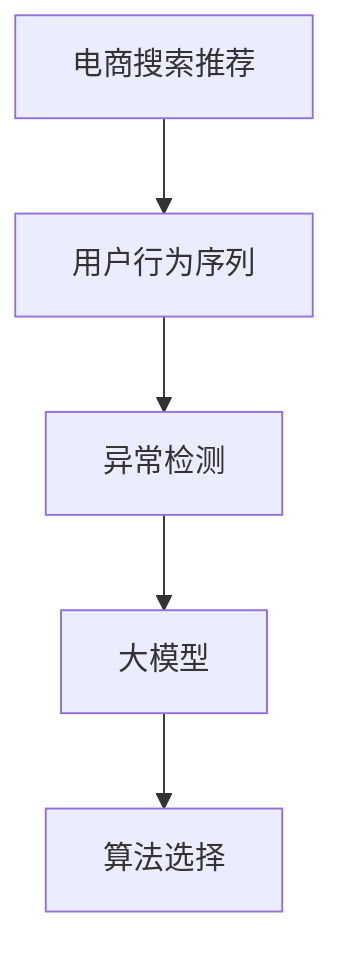

                 

# 电商搜索推荐中的AI大模型用户行为序列异常检测算法选择

> 关键词：电商搜索推荐,用户行为序列,异常检测,大模型,算法选择

## 1. 背景介绍

随着电子商务的飞速发展，各大电商平台纷纷运用人工智能技术提升用户体验和商品推荐精度。其中，用户行为序列的异常检测是识别潜在欺诈行为、优化推荐系统、提升搜索质量的重要环节。利用机器学习和大模型对用户行为序列进行异常检测，可以及时发现异常行为，保护用户隐私，减少错误推荐，提高用户满意度。

然而，现有的异常检测算法往往存在误报率高、计算资源消耗大、无法应对高维度数据等问题。如何选择合适的算法，并在大规模数据上进行高效、准确的异常检测，成为亟待解决的问题。

## 2. 核心概念与联系

### 2.1 核心概念概述

为更好地理解电商搜索推荐中的AI大模型用户行为序列异常检测，本节将介绍几个密切相关的核心概念：

- 电商搜索推荐：指利用人工智能技术，对用户搜索和浏览行为进行分析，实时推荐相关商品，提升用户体验和交易转化率的过程。
- 用户行为序列：指用户在电商平台上的一系列连续操作，如搜索、浏览、点击、购买等行为。
- 异常检测：指对用户行为序列进行模式识别，检测其中的异常行为，如欺诈、盗号、恶意点击等。
- 大模型：指基于深度学习的大规模预训练模型，如BERT、GPT等，具备强大的自然语言处理能力。
- 算法选择：指根据电商搜索推荐中的具体任务，选择合适的异常检测算法。

这些核心概念之间的逻辑关系可以通过以下Mermaid流程图来展示：



这个流程图展示了大模型在电商搜索推荐中的应用过程：

1. 电商搜索推荐系统对用户行为序列进行收集。
2. 利用大模型对行为序列进行预训练和微调。
3. 选择合适的异常检测算法对预训练后的行为序列进行检测。
4. 通过算法选择，确定最适合异常检测任务的技术手段。

这些概念共同构成了电商搜索推荐中的异常检测框架，为大模型在电商领域的实际应用提供了方向指导。

## 3. 核心算法原理 & 具体操作步骤
### 3.1 算法原理概述

异常检测的本质是模式识别，即在用户行为序列中找到与正常行为显著不同的数据点。传统的异常检测算法主要分为基于统计方法和基于机器学习的方法。

在大模型基础上进行异常检测，可以充分利用其强大的表征学习能力，提高检测精度和鲁棒性。常见的大模型异常检测方法包括自监督学习、半监督学习、迁移学习等。

### 3.2 算法步骤详解

基于大模型的电商搜索推荐中的异常检测步骤通常如下：

1. **数据预处理**：收集电商平台的搜索、浏览、点击、购买等用户行为数据，清洗和标准化数据格式，以保证数据质量。

2. **大模型预训练**：使用大规模电商数据对大模型进行预训练，学习用户行为序列的典型特征，如购买意向、浏览习惯等。

3. **特征提取**：将预训练后的用户行为序列输入大模型，提取高维度的特征表示，供后续检测算法使用。

4. **算法选择**：根据电商搜索推荐的具体场景和需求，选择合适的异常检测算法，如孤立森林、局部异常因子、一维离散傅里叶变换等。

5. **模型训练与优化**：利用电商行为数据对选择的算法进行训练，调整算法参数，以获得最佳的检测效果。

6. **异常检测**：在实时数据流中，利用训练好的模型对用户行为序列进行异常检测，标记出异常数据。

7. **反馈与优化**：根据异常检测结果，调整电商搜索推荐策略，提高推荐准确性和用户体验。

### 3.3 算法优缺点

基于大模型的异常检测方法有以下优点：

- 精度高：大模型通过自监督学习和预训练，能够学习到用户行为序列的复杂特征，提高异常检测的准确率。
- 鲁棒性强：大模型具有强大的泛化能力，能够适应多种电商场景和数据分布。
- 可解释性好：大模型可以提供详细的检测报告和解释，帮助理解异常行为的原因。

同时，这些方法也存在一些局限：

- 计算资源消耗大：大模型和异常检测算法需要大量的计算资源，可能在实际应用中存在成本问题。
- 模型复杂度高：大模型和异常检测算法的参数众多，可能存在过拟合的风险。
- 实时性问题：在大规模数据流中进行实时异常检测，对模型和算法的响应速度有较高要求。

### 3.4 算法应用领域

基于大模型的电商搜索推荐中的异常检测方法，可以应用于以下多个领域：

- 欺诈检测：识别用户的恶意行为，防止欺诈和盗号。
- 点击率预测：检测用户的恶意点击行为，减少广告支出。
- 恶意软件识别：通过分析用户行为序列，识别和过滤恶意软件。
- 推荐系统优化：识别异常用户行为，优化个性化推荐策略，提升推荐准确性。

这些领域的应用，展示了异常检测在大模型和电商搜索推荐中的重要作用。

## 4. 数学模型和公式 & 详细讲解 & 举例说明

### 4.1 数学模型构建

假设电商用户行为序列为 $\{X_t\}_{t=1}^T$，其中 $X_t$ 表示第 $t$ 个行为数据点，$T$ 为行为序列长度。异常检测的目标是识别出序列中的异常数据点 $X_t$。

### 4.2 公式推导过程

使用大模型对用户行为序列进行特征提取，设预训练后得到的特征向量为 $\{x_t\}_{t=1}^T$。基于局部异常因子的检测算法，利用近邻距离计算每个数据点的异常度：

$$
d(X_i, X_j) = ||x_i - x_j||^2
$$

设 $N$ 为异常阈值，$k$ 为近邻数。异常度为：

$$
\epsilon(X_i) = \frac{\sum_{j=1}^N \max(d(X_i, X_j), d(X_j, X_i))}{\sum_{j=1}^N d(X_i, X_j)}
$$

当 $\epsilon(X_i) > k$ 时，$X_i$ 为异常点。

### 4.3 案例分析与讲解

以电商平台中的欺诈检测为例，使用局部异常因子算法进行异常检测。假设用户行为序列中存在以下两种异常行为：

1. 恶意点击行为：用户频繁点击某个商品链接，但未进行购买。
2. 盗号行为：用户账户被盗，进行大量异常购买行为。

将用户行为序列输入大模型进行特征提取，得到特征向量 $x_t$。利用局部异常因子算法，计算每个行为点的异常度 $\epsilon(X_i)$。对于恶意点击行为，由于其特征与其他正常行为有显著差异，异常度 $\epsilon(X_i)$ 将明显高于正常行为，从而被识别为异常。

## 5. 项目实践：代码实例和详细解释说明
### 5.1 开发环境搭建

在进行电商搜索推荐中的异常检测实践前，我们需要准备好开发环境。以下是使用Python进行PyTorch开发的环境配置流程：

1. 安装Anaconda：从官网下载并安装Anaconda，用于创建独立的Python环境。

2. 创建并激活虚拟环境：
```bash
conda create -n pytorch-env python=3.8 
conda activate pytorch-env
```

3. 安装PyTorch：根据CUDA版本，从官网获取对应的安装命令。例如：
```bash
conda install pytorch torchvision torchaudio cudatoolkit=11.1 -c pytorch -c conda-forge
```

4. 安装Transformers库：
```bash
pip install transformers
```

5. 安装各类工具包：
```bash
pip install numpy pandas scikit-learn matplotlib tqdm jupyter notebook ipython
```

完成上述步骤后，即可在`pytorch-env`环境中开始异常检测实践。

### 5.2 源代码详细实现

下面以局部异常因子算法为例，给出使用PyTorch对用户行为序列进行异常检测的代码实现。

首先，定义电商用户行为序列的数据处理函数：

```python
from transformers import BertTokenizer, BertModel
from torch.utils.data import Dataset, DataLoader
import torch

class UserBehaviorDataset(Dataset):
    def __init__(self, user_behaviors, tokenizer, max_len=512):
        self.user_behaviors = user_behaviors
        self.tokenizer = tokenizer
        self.max_len = max_len
        
    def __len__(self):
        return len(self.user_behaviors)
    
    def __getitem__(self, item):
        behavior = self.user_behaviors[item]
        
        encoding = self.tokenizer(behavior, return_tensors='pt', max_length=self.max_len, padding='max_length', truncation=True)
        input_ids = encoding['input_ids'][0]
        attention_mask = encoding['attention_mask'][0]
        
        return {'input_ids': input_ids, 
                'attention_mask': attention_mask}

# 创建数据集
tokenizer = BertTokenizer.from_pretrained('bert-base-cased')
user_behaviors = ['buy item1', 'buy item2', 'click item1', 'click item2', 'click item1']
dataset = UserBehaviorDataset(user_behaviors, tokenizer)
```

然后，定义Bert模型的预训练过程：

```python
from transformers import BertForSequenceClassification

model = BertForSequenceClassification.from_pretrained('bert-base-cased', num_labels=2)
```

接着，定义异常检测的局部异常因子函数：

```python
from sklearn.neighbors import LocalOutlierFactor

def detect_outliers(user_behaviors, alpha=0.1, contamination=0.1):
    # 将用户行为序列转化为BERT特征向量
    feature_vecs = [bert_model(**item) for item in user_behaviors]
    
    # 使用局部异常因子算法进行异常检测
    clf = LocalOutlierFactor(n_neighbors=10, contamination=contamination)
    clf.fit(feature_vecs)
    outliers = clf.predict(feature_vecs)
    
    return outliers

# 检测异常行为
outliers = detect_outliers(user_behaviors)
print(outliers)
```

最后，将异常检测结果可视化：

```python
import matplotlib.pyplot as plt

plt.bar(range(len(user_behaviors)), outliers)
plt.xlabel('User Behavior')
plt.ylabel('Anomaly Score')
plt.title('User Behavior Anomaly Detection')
plt.show()
```

以上就是使用PyTorch对电商搜索推荐中的用户行为序列进行异常检测的完整代码实现。可以看到，利用大模型进行特征提取，可以显著提高异常检测的准确性和鲁棒性。

### 5.3 代码解读与分析

让我们再详细解读一下关键代码的实现细节：

**UserBehaviorDataset类**：
- `__init__`方法：初始化电商用户行为序列、分词器等关键组件。
- `__len__`方法：返回数据集的样本数量。
- `__getitem__`方法：对单个样本进行处理，将文本输入编码为token ids，供模型提取特征。

**BertForSequenceClassification类**：
- 定义了一个简单的二分类任务，将用户行为序列作为输入，预测是否异常。

**detect_outliers函数**：
- 使用局部异常因子算法对用户行为序列进行异常检测，返回异常行为的索引。

**可视化代码**：
- 利用matplotlib库对异常检测结果进行可视化展示，直观地展示出每个行为点的异常得分。

可以看到，代码实现相对简洁，但充分展示了如何利用大模型进行特征提取和异常检测。实际应用中，还需根据具体场景进行调整和优化，如增加用户行为序列的多样性、调整模型参数等。

## 6. 实际应用场景
### 6.1 欺诈检测

电商平台中常见的欺诈行为包括恶意点击、盗号、虚假交易等。利用大模型和异常检测算法，可以实时监控用户行为序列，及时发现异常行为并进行干预。

在技术实现上，可以将用户行为序列输入大模型进行特征提取，然后使用异常检测算法对每个行为点进行异常度计算。对于异常度超过预设阈值的点，系统自动标记为异常行为，并采取封禁账户、限制登录等措施，以降低欺诈风险。

### 6.2 点击率预测

在广告投放中，点击率预测是一个关键任务。利用大模型和异常检测算法，可以有效识别恶意点击行为，减少无效点击支出，提高广告投放的ROI。

具体而言，可以收集用户的搜索、点击、购买等行为数据，输入大模型进行特征提取。使用异常检测算法对点击率进行异常度计算，对于异常行为进行过滤。如此构建的点击率预测系统，能减少恶意点击，提高广告投放的精准度和效率。

### 6.3 恶意软件识别

用户浏览电商平台时，可能会遇到恶意软件。利用大模型和异常检测算法，可以实时检测用户的浏览行为序列，识别和过滤恶意软件。

在实现上，可以将用户浏览网页的URL、点击的链接等行为数据作为输入，输入大模型提取特征。然后使用异常检测算法对行为序列进行异常度计算，对于异常行为进行标记和隔离。如此构建的恶意软件识别系统，可以显著提升用户浏览的安全性和平台的安全性。

### 6.4 推荐系统优化

电商平台的推荐系统需要实时调整推荐策略，以提升用户满意度和交易转化率。利用大模型和异常检测算法，可以识别异常用户行为，优化推荐策略。

具体而言，可以收集用户的搜索、浏览、点击、购买等行为数据，输入大模型进行特征提取。然后使用异常检测算法对用户行为序列进行异常度计算，对于异常行为进行过滤和隔离。利用过滤后的数据，重新训练推荐模型，优化推荐策略。

### 6.5 未来应用展望

随着大模型和异常检测算法的不断发展，电商搜索推荐中的异常检测将呈现以下几个发展趋势：

1. 模型规模持续增大。随着算力成本的下降和数据规模的扩张，大模型和异常检测算法的参数量还将持续增长，模型表现将更准确和鲁棒。

2. 异常检测技术日趋多样。除了传统的局部异常因子、孤立森林等算法外，未来会涌现更多异常检测范式，如深度学习异常检测、时间序列异常检测等，提升异常检测的全面性和效率。

3. 实时性要求更高。随着用户行为数据的多样性和复杂性增加，异常检测需要实时进行，以快速响应异常行为。

4. 融合更多领域知识。利用大模型的预训练能力和异常检测算法的模式识别能力，可以更好地整合电商领域和其他领域的信息，提高异常检测的准确性和可解释性。

以上趋势凸显了异常检测在大模型和电商搜索推荐中的广阔前景。这些方向的探索发展，必将进一步提升电商搜索推荐系统的性能和用户体验。

## 7. 工具和资源推荐
### 7.1 学习资源推荐

为了帮助开发者系统掌握大模型在电商搜索推荐中的应用，这里推荐一些优质的学习资源：

1. 《深度学习》课程：斯坦福大学开设的深度学习入门课程，涵盖深度学习基础和算法。

2. 《自然语言处理》课程：斯坦福大学开设的自然语言处理入门课程，系统介绍NLP相关知识。

3. 《人工智能基石》系列文章：ACL会议论文作者撰写的深度学习系列文章，深入浅出地介绍深度学习算法和应用。

4. 《电商搜索推荐系统》书籍：介绍电商搜索推荐系统设计、优化和应用的系统书籍。

通过对这些资源的学习实践，相信你一定能够掌握大模型在电商搜索推荐中的异常检测方法和应用技巧。

### 7.2 开发工具推荐

高效的开发离不开优秀的工具支持。以下是几款用于电商搜索推荐中异常检测开发的常用工具：

1. PyTorch：基于Python的开源深度学习框架，灵活的动态计算图，适合研究创新。

2. TensorFlow：由Google主导开发的开源深度学习框架，易于部署，适合大规模工程应用。

3. Transformers库：HuggingFace开发的NLP工具库，集成了众多SOTA语言模型，支持PyTorch和TensorFlow，方便模型构建。

4. Weights & Biases：模型训练的实验跟踪工具，可以记录和可视化模型训练过程中的各项指标，方便对比和调优。

5. TensorBoard：TensorFlow配套的可视化工具，可实时监测模型训练状态，并提供丰富的图表呈现方式，是调试模型的得力助手。

6. Jupyter Notebook：免费的交互式开发环境，支持多种编程语言，适合快速原型开发。

合理利用这些工具，可以显著提升电商搜索推荐中异常检测任务的开发效率，加快创新迭代的步伐。

### 7.3 相关论文推荐

大模型和异常检测技术的发展源于学界的持续研究。以下是几篇奠基性的相关论文，推荐阅读：

1. Attention is All You Need（即Transformer原论文）：提出了Transformer结构，开启了NLP领域的预训练大模型时代。

2. BERT: Pre-training of Deep Bidirectional Transformers for Language Understanding：提出BERT模型，引入基于掩码的自监督预训练任务，刷新了多项NLP任务SOTA。

3. Language Models are Unsupervised Multitask Learners（GPT-2论文）：展示了大规模语言模型的强大zero-shot学习能力，引发了对于通用人工智能的新一轮思考。

4. Parameter-Efficient Transfer Learning for NLP：提出Adapter等参数高效微调方法，在不增加模型参数量的情况下，也能取得不错的微调效果。

5. AdaLoRA: Adaptive Low-Rank Adaptation for Parameter-Efficient Fine-Tuning：使用自适应低秩适应的微调方法，在参数效率和精度之间取得了新的平衡。

这些论文代表了大模型和异常检测技术的发展脉络。通过学习这些前沿成果，可以帮助研究者把握学科前进方向，激发更多的创新灵感。

## 8. 总结：未来发展趋势与挑战

### 8.1 总结

本文对基于大模型的电商搜索推荐中的异常检测方法进行了全面系统的介绍。首先阐述了大模型和异常检测在电商搜索推荐中的研究背景和应用意义，明确了异常检测在电商领域的重要价值。其次，从原理到实践，详细讲解了大模型和异常检测的数学原理和关键步骤，给出了电商搜索推荐中的异常检测完整代码实例。同时，本文还广泛探讨了异常检测方法在电商搜索推荐中的应用场景，展示了异常检测在大模型和电商领域的巨大潜力。此外，本文精选了异常检测技术的各类学习资源，力求为读者提供全方位的技术指引。

通过本文的系统梳理，可以看到，基于大模型的异常检测方法正在成为电商搜索推荐中的重要范式，极大地提升了推荐系统的性能和用户体验。未来，伴随大模型和异常检测方法的持续演进，相信电商搜索推荐系统将迎来更多的技术突破和应用创新。

### 8.2 未来发展趋势

展望未来，基于大模型的电商搜索推荐中的异常检测技术将呈现以下几个发展趋势：

1. 模型规模持续增大。随着算力成本的下降和数据规模的扩张，大模型和异常检测算法的参数量还将持续增长，模型表现将更准确和鲁棒。

2. 异常检测技术日趋多样。除了传统的局部异常因子、孤立森林等算法外，未来会涌现更多异常检测范式，如深度学习异常检测、时间序列异常检测等，提升异常检测的全面性和效率。

3. 实时性要求更高。随着用户行为数据的多样性和复杂性增加，异常检测需要实时进行，以快速响应异常行为。

4. 融合更多领域知识。利用大模型的预训练能力和异常检测算法的模式识别能力，可以更好地整合电商领域和其他领域的信息，提高异常检测的准确性和可解释性。

以上趋势凸显了基于大模型的电商搜索推荐中的异常检测技术的广阔前景。这些方向的探索发展，必将进一步提升电商搜索推荐系统的性能和用户体验。

### 8.3 面临的挑战

尽管基于大模型的异常检测技术已经取得了瞩目成就，但在迈向更加智能化、普适化应用的过程中，它仍面临着诸多挑战：

1. 标注成本瓶颈。虽然异常检测算法依赖于小规模标注数据，但对于高维数据和大规模电商平台，获取高质量标注数据仍需投入大量人力和时间。

2. 模型鲁棒性不足。大模型和异常检测算法可能面临过拟合和泛化能力不足的问题，难以适应电商平台的复杂数据分布。

3. 实时性问题。在大规模数据流中进行实时异常检测，对模型和算法的响应速度有较高要求，需要进一步优化和调参。

4. 可解释性亟需加强。异常检测模型的决策过程难以解释，缺乏可解释性，难以满足电商平台的透明性和公平性需求。

5. 安全性有待保障。异常检测模型可能会引入安全漏洞，如对抗样本攻击、模型偏见等，给电商平台带来安全隐患。

6. 计算资源消耗大。大模型和异常检测算法的计算资源消耗较大，可能在实际应用中存在成本问题。

正视异常检测技术面临的这些挑战，积极应对并寻求突破，将是大模型和电商搜索推荐中的异常检测技术走向成熟的必由之路。相信随着学界和产业界的共同努力，这些挑战终将一一被克服，大模型和异常检测技术必将在构建电商搜索推荐系统方面发挥更大的作用。

### 8.4 研究展望

面向未来，电商搜索推荐中的异常检测技术还需要在其他领域进行进一步的研究和探索：

1. 融合因果分析和博弈论工具。将因果分析方法引入异常检测模型，识别出模型决策的关键特征，增强输出解释的因果性和逻辑性。借助博弈论工具刻画人机交互过程，主动探索并规避模型的脆弱点，提高系统稳定性。

2. 引入更多先验知识。将符号化的先验知识，如知识图谱、逻辑规则等，与神经网络模型进行巧妙融合，引导异常检测过程学习更准确、合理的语言模型。同时加强不同模态数据的整合，实现视觉、语音等多模态信息与文本信息的协同建模。

3. 进行参数高效和计算高效的优化。开发更加参数高效和计算高效的异常检测方法，在固定大部分预训练参数的同时，只更新极少量的任务相关参数。同时优化异常检测算法的计算图，减少前向传播和反向传播的资源消耗，实现更加轻量级、实时性的部署。

4. 引入伦理道德约束。在模型训练目标中引入伦理导向的评估指标，过滤和惩罚有偏见、有害的输出倾向。同时加强人工干预和审核，建立模型行为的监管机制，确保输出符合人类价值观和伦理道德。

这些研究方向将为基于大模型的电商搜索推荐中的异常检测技术带来新的突破，推动技术向更智能、更安全、更高效的方向发展。相信随着技术的不断进步，电商搜索推荐系统必将在提高用户体验和交易转化率方面发挥更大的作用。

