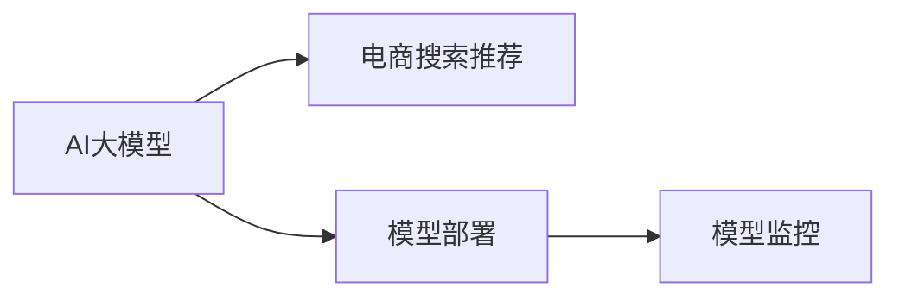

                 

# 电商搜索推荐场景下的AI大模型模型部署监控平台搭建最佳实践

> 关键词：AI大模型,电商搜索推荐,模型部署,监控平台,最佳实践

## 1. 背景介绍

随着人工智能技术的飞速发展，AI大模型在电商搜索推荐系统中得到了广泛应用。然而，模型部署和监控的复杂性也随之增加。本文将探讨在电商搜索推荐场景下，如何搭建高效、稳定的AI大模型模型部署监控平台，以实现模型的持续优化和高效管理。

## 2. 核心概念与联系

### 2.1 核心概念概述

为了更好地理解本文的主题，我们首先介绍几个关键概念：

- **AI大模型**：指基于深度学习的大规模模型，如BERT、GPT-3等，这些模型具有强大的语言理解、生成能力，能够处理复杂的电商搜索推荐任务。
- **电商搜索推荐**：指通过算法模型为用户推荐商品、优化搜索体验，是电商系统的核心功能之一。
- **模型部署**：指将训练好的模型从开发环境迁移到生产环境的过程，包括模型封装、部署到服务器、接入业务系统等步骤。
- **模型监控**：指在模型部署后，对模型性能、运行状态、资源消耗等进行持续监测和评估，以确保模型稳定运行。

这些概念之间的联系可以通过以下Mermaid流程图来展示：



这个流程图展示了大模型、电商推荐系统、模型部署、模型监控之间的逻辑关系：

1. 电商推荐系统使用AI大模型进行商品推荐。
2. 模型部署将训练好的模型从开发环境迁移到生产环境。
3. 模型监控对部署后的模型进行持续监测和评估，确保其稳定运行。

## 3. 核心算法原理 & 具体操作步骤

### 3.1 算法原理概述

电商搜索推荐场景下的AI大模型模型部署监控平台搭建，本质上是构建一套自动化、可扩展的模型管理和监控系统。其核心算法原理包括：

- **自动化模型部署**：使用Docker容器化技术，将模型封装成镜像，并通过CI/CD工具自动部署到服务器。
- **分布式监控**：使用Prometheus、Grafana等开源工具，构建分布式监控系统，实时监测模型性能、资源消耗、运行状态等。
- **模型调优**：通过A/B测试、在线实验等手段，持续优化模型，提升电商搜索推荐系统的用户体验。

### 3.2 算法步骤详解

#### 3.2.1 模型训练与验证

1. **数据准备**：收集电商平台的商品、用户行为数据，清洗、预处理数据集。
2. **模型训练**：使用PyTorch、TensorFlow等深度学习框架，训练AI大模型，并进行验证。
3. **模型导出与封装**：将训练好的模型导出为静态文件或Docker镜像，进行模型封装。

#### 3.2.2 模型部署

1. **Docker容器化**：将模型封装为Docker镜像，并添加必要的启动脚本、配置文件等。
2. **CI/CD集成**：使用Jenkins、GitLab CI等CI/CD工具，将模型部署流程自动化。
3. **服务化封装**：将模型封装为RESTful API接口，便于业务系统调用。

#### 3.2.3 模型监控

1. **监控指标定义**：定义模型性能、资源消耗、运行状态等监控指标，包括准确率、召回率、内存占用、CPU/GPU利用率等。
2. **监控工具选择**：选择Prometheus、Grafana等监控工具，构建分布式监控系统。
3. **实时监控与告警**：设置告警阈值，当监控指标超过预设值时，自动发送告警通知。

#### 3.2.4 模型调优

1. **A/B测试**：在生产环境中，进行A/B测试，比较不同模型的性能。
2. **在线实验**：通过在线实验框架，持续优化模型，提升用户体验。
3. **数据回传与分析**：将用户反馈数据回传到训练平台，进行模型评估和优化。

### 3.3 算法优缺点

#### 3.3.1 优点

1. **自动化部署**：减少手动操作，提升部署效率。
2. **分布式监控**：实时监控模型性能和运行状态，及时发现问题。
3. **持续优化**：通过A/B测试、在线实验等手段，持续优化模型。

#### 3.3.2 缺点

1. **资源消耗大**：大模型在部署和运行时，需要大量的计算资源和存储空间。
2. **模型调整复杂**：调整模型配置、参数等，需要多次部署和测试。
3. **运维成本高**：需要专门的人力进行模型部署、监控、调优等工作。

### 3.4 算法应用领域

大模型模型部署监控平台，不仅适用于电商搜索推荐场景，还适用于其他需要使用大模型的业务场景，如智能客服、金融风控、医疗诊断等。通过该平台，可以在各种业务场景中实现模型的自动化部署、实时监控和持续优化，提升业务系统的智能化水平。

## 4. 数学模型和公式 & 详细讲解 & 举例说明

### 4.1 数学模型构建

假设我们有一个电商推荐系统，使用一个AI大模型进行商品推荐。模型的输入为用户的行为数据，输出为用户可能感兴趣的商品ID。模型的目标是最小化损失函数，定义为：

$$
L = \frac{1}{N} \sum_{i=1}^N \ell(y_i, f(x_i; \theta))
$$

其中，$y_i$为真实标签，$f(x_i; \theta)$为模型输出，$\ell$为损失函数，$N$为样本数，$\theta$为模型参数。

### 4.2 公式推导过程

使用交叉熵损失函数$\ell$，有：

$$
\ell(y_i, f(x_i; \theta)) = -y_i \log f(x_i; \theta) - (1 - y_i) \log (1 - f(x_i; \theta))
$$

代入损失函数，得到：

$$
L = - \frac{1}{N} \sum_{i=1}^N (y_i \log f(x_i; \theta) + (1 - y_i) \log (1 - f(x_i; \theta)))
$$

通过梯度下降等优化算法，最小化损失函数，更新模型参数$\theta$。

### 4.3 案例分析与讲解

以一个简单的电商推荐模型为例，进行详细讲解：

1. **数据准备**：收集用户行为数据，包括浏览、点击、购买等行为记录。
2. **模型训练**：使用TensorFlow训练一个推荐模型，如DNN、GRU等。
3. **模型部署**：将训练好的模型导出为Docker镜像，使用Kubernetes进行部署。
4. **模型监控**：使用Prometheus和Grafana，实时监控模型性能、资源消耗等指标。
5. **模型调优**：通过A/B测试，比较不同模型的性能，进行持续优化。

## 5. 项目实践：代码实例和详细解释说明

### 5.1 开发环境搭建

1. **环境配置**：安装Python、Docker、Kubernetes、Prometheus、Grafana等工具。
2. **依赖管理**：使用pip、conda等工具管理项目依赖。
3. **版本控制**：使用Git进行代码版本控制。

### 5.2 源代码详细实现

#### 5.2.1 模型训练

```python
import tensorflow as tf
from tensorflow.keras import layers

model = tf.keras.Sequential([
    layers.Dense(64, activation='relu', input_shape=(10,)),
    layers.Dense(64, activation='relu'),
    layers.Dense(1, activation='sigmoid')
])

model.compile(optimizer='adam', loss='binary_crossentropy', metrics=['accuracy'])

model.fit(x_train, y_train, epochs=10, validation_data=(x_val, y_val))
```

#### 5.2.2 模型导出与封装

```python
import tensorflow as tf

model.save('recommendation_model.h5')
```

#### 5.2.3 模型部署

```dockerfile
FROM tensorflow:latest

# 安装依赖
RUN pip install -r requirements.txt

# 复制模型文件
COPY recommendation_model.h5 /model/
COPY requirements.txt /model/

# 启动模型
CMD ["python", "deploy.py"]
```

#### 5.2.4 模型监控

1. **Prometheus配置**：编写prometheus.yml配置文件，定义监控指标、采集频率、告警阈值等。
2. **Grafana配置**：编写grafana.yml配置文件，定义仪表盘、数据源、图表等。
3. **监控脚本**：编写监控脚本，使用Prometheus Client API获取模型性能数据，并发送告警通知。

### 5.3 代码解读与分析

1. **模型训练代码**：使用TensorFlow训练一个简单的推荐模型，包括输入层、隐藏层、输出层和损失函数。
2. **模型导出与封装**：将训练好的模型保存为h5文件，并进行Docker镜像封装。
3. **模型部署代码**：编写Dockerfile，指定环境依赖、模型文件路径和启动命令。
4. **监控配置文件**：编写prometheus.yml和grafana.yml配置文件，定义监控指标和仪表盘。
5. **监控脚本**：编写监控脚本，获取模型性能数据，并发送告警通知。

### 5.4 运行结果展示

1. **模型性能指标**：监控指标包括模型的准确率、召回率、训练时间、推理时间等。
2. **资源消耗**：监控模型的CPU、GPU、内存等资源消耗情况。
3. **告警通知**：当模型性能或资源消耗超过预设阈值时，自动发送告警通知。

## 6. 实际应用场景

### 6.1 电商搜索推荐

电商推荐系统使用AI大模型进行商品推荐，可以提升用户购物体验，增加销售转化率。

#### 6.1.1 实现方式

- **数据收集**：收集用户浏览、点击、购买等行为数据，构建训练集和验证集。
- **模型训练**：使用TensorFlow、PyTorch等深度学习框架，训练AI大模型。
- **模型部署**：使用Docker容器化技术，将模型封装成镜像，并使用Kubernetes进行部署。
- **模型监控**：使用Prometheus、Grafana等工具，实时监测模型性能和资源消耗。
- **模型调优**：通过A/B测试、在线实验等手段，持续优化模型，提升用户体验。

#### 6.1.2 效果评估

- **推荐效果**：通过A/B测试，比较不同模型的推荐效果，提升点击率、转化率等指标。
- **系统稳定**：实时监控系统性能和资源消耗，及时发现和解决问题，保障系统稳定性。

### 6.2 智能客服

智能客服系统使用AI大模型进行对话处理，可以提升客户服务效率，减少人力成本。

#### 6.2.1 实现方式

- **数据收集**：收集客服对话记录，构建训练集和验证集。
- **模型训练**：使用TensorFlow、PyTorch等深度学习框架，训练AI大模型。
- **模型部署**：使用Docker容器化技术，将模型封装成镜像，并使用Kubernetes进行部署。
- **模型监控**：使用Prometheus、Grafana等工具，实时监测模型性能和资源消耗。
- **模型调优**：通过A/B测试、在线实验等手段，持续优化模型，提升用户体验。

#### 6.2.2 效果评估

- **对话效果**：通过A/B测试，比较不同模型的对话效果，提升客户满意度。
- **系统稳定**：实时监控系统性能和资源消耗，及时发现和解决问题，保障系统稳定性。

## 7. 工具和资源推荐

### 7.1 学习资源推荐

1. **TensorFlow官方文档**：提供TensorFlow的详细使用指南和API文档。
2. **Kubernetes官方文档**：提供Kubernetes的详细使用指南和API文档。
3. **Prometheus官方文档**：提供Prometheus的详细使用指南和API文档。
4. **Grafana官方文档**：提供Grafana的详细使用指南和API文档。
5. **Docker官方文档**：提供Docker的详细使用指南和API文档。

### 7.2 开发工具推荐

1. **Python**：广泛使用的编程语言，适用于深度学习框架和容器化技术。
2. **Docker**：容器化技术，适用于模型封装和自动化部署。
3. **TensorFlow**：深度学习框架，适用于模型训练和部署。
4. **Kubernetes**：容器编排工具，适用于模型部署和自动化管理。
5. **Prometheus**：监控系统，适用于实时监测模型性能和资源消耗。
6. **Grafana**：仪表盘工具，适用于可视化模型性能和资源消耗。

### 7.3 相关论文推荐

1. **TensorFlow官方博客**：提供深度学习框架的使用技巧和最佳实践。
2. **Kubernetes官方博客**：提供容器编排工具的使用技巧和最佳实践。
3. **Prometheus官方博客**：提供监控系统的使用技巧和最佳实践。
4. **Grafana官方博客**：提供仪表盘工具的使用技巧和最佳实践。
5. **Docker官方博客**：提供容器化技术的使用技巧和最佳实践。

## 8. 总结：未来发展趋势与挑战

### 8.1 研究成果总结

本文介绍了在电商搜索推荐场景下，如何搭建AI大模型模型部署监控平台，包括模型训练、模型部署、模型监控、模型调优等关键步骤。通过该平台，可以提升电商搜索推荐系统的智能化水平，优化用户体验，提升业务效率。

### 8.2 未来发展趋势

1. **模型规模增大**：随着算力成本的下降和数据规模的扩张，未来AI大模型的参数量将进一步增大，带来更强大的语言理解和生成能力。
2. **自动化程度提高**：自动化部署、自动化调优等技术将更加成熟，降低模型部署和调优的复杂度。
3. **分布式监控**：分布式监控系统将更加完善，实时监测模型性能和资源消耗。
4. **持续优化**：A/B测试、在线实验等手段将更加成熟，持续优化模型性能。

### 8.3 面临的挑战

1. **计算资源需求高**：AI大模型在部署和运行时，需要大量的计算资源和存储空间，成本较高。
2. **模型调优复杂**：调整模型配置、参数等，需要多次部署和测试，增加了模型调优的复杂度。
3. **运维成本高**：模型部署、监控、调优等需要专门的人力，增加了运维成本。
4. **数据隐私问题**：电商搜索推荐系统需要处理大量用户数据，数据隐私和安全问题需要特别注意。

### 8.4 研究展望

1. **模型压缩与优化**：通过模型压缩和优化技术，降低模型在部署和运行时的资源消耗。
2. **多模型集成**：通过多模型集成技术，提升模型性能和鲁棒性。
3. **联邦学习**：通过联邦学习技术，保护用户隐私的同时，提升模型性能。
4. **模型解释与可解释性**：通过模型解释技术，提升模型的可解释性，增强用户信任。
5. **跨平台部署**：通过跨平台部署技术，提升模型在多种环境中的适应性。

## 9. 附录：常见问题与解答

**Q1: 电商搜索推荐场景下如何搭建AI大模型模型部署监控平台？**

A: 搭建AI大模型模型部署监控平台，需要以下步骤：

1. 数据收集：收集电商平台的商品、用户行为数据，构建训练集和验证集。
2. 模型训练：使用TensorFlow、PyTorch等深度学习框架，训练AI大模型。
3. 模型部署：使用Docker容器化技术，将模型封装成镜像，并使用Kubernetes进行部署。
4. 模型监控：使用Prometheus、Grafana等工具，实时监测模型性能和资源消耗。
5. 模型调优：通过A/B测试、在线实验等手段，持续优化模型，提升用户体验。

**Q2: 如何优化电商搜索推荐系统的性能？**

A: 优化电商搜索推荐系统的性能，可以从以下几个方面入手：

1. 数据预处理：对数据进行清洗、归一化、特征提取等处理，提升数据质量。
2. 模型选择：选择适合电商搜索推荐任务的模型，如DNN、GRU、Transformer等。
3. 超参数调优：通过网格搜索、随机搜索等方法，优化模型的超参数，提升模型性能。
4. 模型集成：通过多模型集成技术，提升模型的鲁棒性和泛化能力。
5. 模型评估：使用A/B测试、交叉验证等方法，评估模型的性能和稳定性。

**Q3: 电商搜索推荐系统中的数据隐私问题如何处理？**

A: 电商搜索推荐系统中的数据隐私问题，可以通过以下方式处理：

1. 数据匿名化：对用户数据进行匿名化处理，保护用户隐私。
2. 数据加密：对敏感数据进行加密处理，防止数据泄露。
3. 用户授权：获取用户授权，明确用户数据的使用范围和用途。
4. 合规性审核：定期进行数据隐私和安全合规性审核，确保数据处理符合法律法规。

**Q4: 电商搜索推荐系统中的模型鲁棒性如何提升？**

A: 电商搜索推荐系统中的模型鲁棒性，可以通过以下方式提升：

1. 数据增强：通过数据增强技术，增加数据的多样性，提升模型的泛化能力。
2. 对抗训练：通过对抗训练技术，提升模型的鲁棒性和抗干扰能力。
3. 模型压缩：通过模型压缩技术，减小模型规模，提升模型的鲁棒性。
4. 多模型集成：通过多模型集成技术，提升模型的鲁棒性和稳定性。

**Q5: 电商搜索推荐系统中的模型可解释性如何提升？**

A: 电商搜索推荐系统中的模型可解释性，可以通过以下方式提升：

1. 特征可视化：使用特征可视化技术，展示模型的输入特征与输出之间的关系。
2. 模型解释：使用模型解释技术，解释模型的决策过程和推理逻辑。
3. 可解释模型：选择可解释性较强的模型，如线性模型、决策树等。
4. 用户反馈：通过用户反馈，调整模型参数，提升模型的可解释性。

通过本文的系统梳理，可以看到，电商搜索推荐场景下的AI大模型模型部署监控平台的搭建，需要从数据、模型、部署、监控、调优等多个方面进行全面优化。只有在各个环节协同发力，才能构建高效、稳定的模型管理系统，实现模型的持续优化和高效管理。

---

作者：禅与计算机程序设计艺术 / Zen and the Art of Computer Programming

