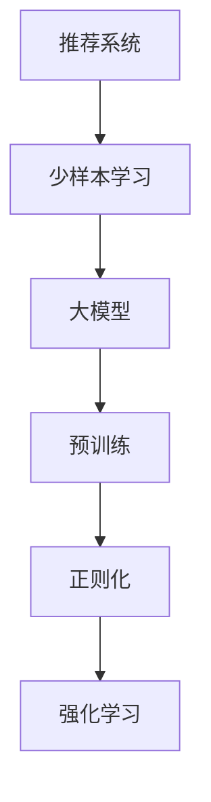

                 

# 电商行业中的少样本学习：大模型在新品推荐中的应用

> 关键词：少样本学习,大模型,电商,新品推荐,推荐系统,强化学习,深度学习

## 1. 背景介绍

### 1.1 问题由来

在现代电商领域，用户对新品的关注和购买意愿是商家极为关注的问题。对于新上架的商品，商家希望能够快速了解用户对其的兴趣，并及时调整营销策略，增加销量。传统推荐系统依赖历史行为数据进行推荐，但新商品没有历史行为数据，无法直接用于推荐。同时，随着新品的层出不穷，商家难以为每件商品单独收集数据进行推荐。因此，如何使用少样本数据高效地对新商品进行推荐，成为电商行业的一大挑战。

### 1.2 问题核心关键点

解决电商行业中的少样本学习问题，可以引入深度学习领域的新范式——少样本学习。少样本学习是指在大规模模型上仅通过少量标注数据，即可进行高效的推荐。大模型预训练后包含丰富的知识，能够利用已有的知识进行推荐，弥补新商品缺乏历史数据的不足。

少样本学习的关键在于如何让模型有效利用少量标注数据，并结合预训练知识，生成高质量的推荐结果。通过合理的任务设计和优化方法，可以使大模型在新商品推荐上取得优异的效果。

### 1.3 问题研究意义

研究少样本学习在电商行业中的应用，对于提升电商系统的推荐精度和效率，降低商家对用户历史数据的依赖，具有重要意义：

1. 提升推荐精度：利用大模型的知识库，即使缺乏大量标注数据，也能够生成精确的推荐结果。
2. 降低数据成本：商家不必为每件商品单独收集和标注数据，极大降低了推荐系统开发和维护的成本。
3. 快速响应市场：新商品上架后，能够迅速了解用户兴趣，快速调整推荐策略，提高营销效果。
4. 增加用户粘性：个性化推荐提升用户购物体验，增加用户回购率，形成稳定的客户群体。
5. 推动技术创新：少样本学习方法不断演进，推动深度学习技术在电商领域的应用创新。

## 2. 核心概念与联系

### 2.1 核心概念概述

为更好地理解少样本学习在电商行业中的应用，本节将介绍几个关键概念：

- 推荐系统(Recommender System)：根据用户行为和物品属性，为用户提供个性化的商品推荐。
- 少样本学习(Few-shot Learning)：在大规模模型上，仅利用少量标注数据进行高效推荐。
- 大模型(Large Model)：如BERT、GPT等大规模预训练模型，具备丰富的语言和知识表示。
- 预训练(Pre-training)：在大规模无标签数据上进行自监督学习，学习到通用的知识表示。
- 正则化(Regularization)：通过L2正则、Dropout等手段，避免模型过拟合。
- 强化学习(Reinforcement Learning)：利用奖励机制，不断调整模型参数，优化推荐策略。

这些核心概念通过以下Mermaid流程图展示其逻辑关系：



这个流程图展示了推荐系统、少样本学习、大模型、预训练、正则化和强化学习的相互关系：

1. 推荐系统通过少样本学习，利用大模型的预训练知识，生成推荐结果。
2. 少样本学习在大模型上进行推荐，利用少量标注数据进行优化。
3. 大模型通过预训练学习到丰富的知识表示。
4. 预训练在大模型上进行，学习通用的语言和知识表示。
5. 正则化在大模型上进行，避免模型过拟合。
6. 强化学习在大模型上进行，优化推荐策略。

这些概念共同构成了推荐系统基于少样本学习的应用框架，使其在新品推荐上发挥出巨大潜力。

## 3. 核心算法原理 & 具体操作步骤
### 3.1 算法原理概述

基于少样本学习的新品推荐，本质上是在大规模预训练模型上进行微调，以生成针对新商品的推荐。其核心思想是：利用已有知识，通过少量标注数据训练模型，使得模型能够为新商品生成推荐。

形式化地，假设已有推荐系统 $R_{\theta}$，其中 $\theta$ 为推荐模型参数。对于新商品 $i$，仅有少量用户对其进行了评价，即有 $N$ 个用户 $u_1,u_2,\ldots,u_N$，分别给予了评分 $y_1,y_2,\ldots,y_N$。少样本学习的目标是最小化模型在新商品上的推荐损失，即找到新的模型参数 $\hat{\theta}$，使得：

$$
\hat{\theta}=\mathop{\arg\min}_{\theta} \mathcal{L}(R_{\theta},D_i)
$$

其中 $\mathcal{L}$ 为针对新商品 $i$ 设计的损失函数，用于衡量模型推荐输出与真实评分之间的差异。常见的损失函数包括均方误差损失、交叉熵损失等。

通过梯度下降等优化算法，少样本学习过程不断更新模型参数 $\theta$，最小化损失函数 $\mathcal{L}$，使得模型输出逼近真实评分。由于 $\theta$ 已经通过预训练获得了丰富的知识，因此即使在新商品缺乏历史行为数据的情况下，也能较快收敛到理想的模型参数 $\hat{\theta}$。

### 3.2 算法步骤详解

基于少样本学习的新品推荐一般包括以下几个关键步骤：

**Step 1: 准备预训练模型和数据集**
- 选择合适的预训练模型 $R_{\theta}$ 作为初始化参数，如 BERT、GPT 等。
- 准备新商品 $i$ 的少量标注数据集 $D_i$，划分为训练集、验证集和测试集。一般要求标注数据与预训练数据的分布不要差异过大。

**Step 2: 添加任务适配层**
- 根据新商品的特点，在预训练模型顶层设计合适的输出层和损失函数。
- 对于评分预测任务，通常在顶层添加线性分类器和均方误差损失函数。
- 对于排序任务，通常使用排序损失函数，如PR loss。

**Step 3: 设置少样本学习超参数**
- 选择合适的优化算法及其参数，如 AdamW、SGD 等，设置学习率、批大小、迭代轮数等。
- 设置正则化技术及强度，包括权重衰减、Dropout、Early Stopping等。
- 确定冻结预训练参数的策略，如仅微调顶层，或全部参数都参与微调。

**Step 4: 执行梯度训练**
- 将训练集数据分批次输入模型，前向传播计算损失函数。
- 反向传播计算参数梯度，根据设定的优化算法和学习率更新模型参数。
- 周期性在验证集上评估模型性能，根据性能指标决定是否触发 Early Stopping。
- 重复上述步骤直到满足预设的迭代轮数或 Early Stopping 条件。

**Step 5: 测试和部署**
- 在测试集上评估少样本学习后模型 $R_{\hat{\theta}}$ 的性能，对比微调前后的精度提升。
- 使用少样本学习后的模型对新商品进行推荐，集成到实际的应用系统中。
- 持续收集新商品的用户评价，定期重新微调模型，以适应新商品的属性变化。

以上是基于少样本学习的新品推荐的一般流程。在实际应用中，还需要针对具体商品的特点，对微调过程的各个环节进行优化设计，如改进训练目标函数，引入更多的正则化技术，搜索最优的超参数组合等，以进一步提升模型性能。

### 3.3 算法优缺点

基于少样本学习的新品推荐方法具有以下优点：
1. 高效性：仅利用少量标注数据，即可生成推荐结果，极大地降低了推荐系统的开发和维护成本。
2. 泛化性：利用大规模预训练模型，模型具备更强的泛化能力，能够在新商品上生成准确的推荐。
3. 实时性：在商品上架后，能够快速生成推荐，及时调整营销策略，提高用户满意度。
4. 个性化：利用用户的历史行为数据，结合少样本学习，能够生成更个性化的推荐结果，提升用户体验。

同时，该方法也存在一些局限性：
1. 对标注数据的质量要求高：少样本学习对少量标注数据的质量和数量要求较高，获取高质量标注数据的成本较高。
2. 过拟合风险大：少样本学习对标注数据较少，容易发生过拟合，需要引入正则化技术进行避免。
3. 缺乏交互性：少样本学习不考虑用户实时行为，无法动态调整推荐策略，可能导致推荐结果不够准确。
4. 数据分布差异：如果新商品的分布与预训练数据的分布差异较大，推荐效果可能不佳。
5. 模型复杂度高：大规模预训练模型的计算和存储开销较大，需要强大的计算资源支持。

尽管存在这些局限性，但就目前而言，少样本学习基于预训练模型的新品推荐方法仍然是大规模推荐系统的重要技术手段。未来相关研究的重点在于如何进一步降低少样本学习对标注数据的依赖，提高模型的泛化能力和实时性，同时兼顾可解释性和用户交互性等因素。

### 3.4 算法应用领域

基于少样本学习的新品推荐方法已经在电商行业得到了广泛的应用，覆盖了商品推荐、个性化营销、用户画像分析等多个方面，具体应用如下：

- **商品推荐**：根据新商品少量用户评价，利用少样本学习生成推荐结果，帮助用户发现新品。
- **个性化营销**：对新商品进行广告投放和促销策略优化，提升营销效果。
- **用户画像分析**：根据用户历史行为数据和新商品数据，生成用户画像，进行用户细分和行为预测。
- **热门商品发现**：利用少样本学习识别热门新商品，辅助商品上架决策。
- **库存管理**：根据推荐结果预测商品销量，优化库存管理策略。
- **客户流失预测**：预测未购买新商品的用户流失风险，及时采取挽回措施。

除了这些经典应用外，少样本学习在新品推荐上还有更多创新性的应用，如可控生成、多模态推荐、实时推荐等，为电商推荐系统带来了新的突破。

## 4. 数学模型和公式 & 详细讲解  
### 4.1 数学模型构建

本节将使用数学语言对基于少样本学习的新品推荐过程进行更加严格的刻画。

记推荐系统为 $R_{\theta}:\mathcal{X} \rightarrow \mathcal{Y}$，其中 $\mathcal{X}$ 为用户行为特征，$\mathcal{Y}$ 为推荐结果，$\theta \in \mathbb{R}^d$ 为模型参数。假设新商品 $i$ 的少量标注数据集为 $D_i=\{(x_j,y_j)\}_{j=1}^N, x_j \in \mathcal{X}, y_j \in \mathcal{Y}$。

定义模型 $R_{\theta}$ 在新商品 $i$ 上的损失函数为 $\ell(R_{\theta}(x),y)$，则在数据集 $D_i$ 上的经验风险为：

$$
\mathcal{L}(\theta) = \frac{1}{N} \sum_{j=1}^N \ell(R_{\theta}(x_j),y_j)
$$

少样本学习的优化目标是最小化经验风险，即找到最优参数：

$$
\theta^* = \mathop{\arg\min}_{\theta} \mathcal{L}(\theta)
$$

在实践中，我们通常使用基于梯度的优化算法（如SGD、Adam等）来近似求解上述最优化问题。设 $\eta$ 为学习率，$\lambda$ 为正则化系数，则参数的更新公式为：

$$
\theta \leftarrow \theta - \eta \nabla_{\theta}\mathcal{L}(\theta) - \eta\lambda\theta
$$

其中 $\nabla_{\theta}\mathcal{L}(\theta)$ 为损失函数对参数 $\theta$ 的梯度，可通过反向传播算法高效计算。

### 4.2 公式推导过程

以下我们以评分预测任务为例，推导均方误差损失函数及其梯度的计算公式。

假设模型 $R_{\theta}$ 在用户行为特征 $x$ 上的推荐结果为 $\hat{y}=R_{\theta}(x)$，表示对商品 $i$ 的评分预测。真实标签 $y \in [1,N]$，表示用户评分。则均方误差损失函数定义为：

$$
\ell(R_{\theta}(x),y) = \frac{1}{2}(y-\hat{y})^2
$$

将其代入经验风险公式，得：

$$
\mathcal{L}(\theta) = \frac{1}{2N} \sum_{j=1}^N (y_j-\hat{y}_j)^2
$$

根据链式法则，损失函数对参数 $\theta_k$ 的梯度为：

$$
\frac{\partial \mathcal{L}(\theta)}{\partial \theta_k} = \frac{1}{N} \sum_{j=1}^N (\frac{\partial \hat{y}_j}{\partial \theta_k}) (y_j-\hat{y}_j)
$$

其中 $\frac{\partial \hat{y}_j}{\partial \theta_k}$ 可进一步递归展开，利用自动微分技术完成计算。

在得到损失函数的梯度后，即可带入参数更新公式，完成模型的迭代优化。重复上述过程直至收敛，最终得到适应新商品 $i$ 的最优模型参数 $\theta^*$。

## 5. 项目实践：代码实例和详细解释说明
### 5.1 开发环境搭建

在进行少样本学习实践前，我们需要准备好开发环境。以下是使用Python进行PyTorch开发的环境配置流程：

1. 安装Anaconda：从官网下载并安装Anaconda，用于创建独立的Python环境。

2. 创建并激活虚拟环境：
```bash
conda create -n pytorch-env python=3.8 
conda activate pytorch-env
```

3. 安装PyTorch：根据CUDA版本，从官网获取对应的安装命令。例如：
```bash
conda install pytorch torchvision torchaudio cudatoolkit=11.1 -c pytorch -c conda-forge
```

4. 安装Transformers库：
```bash
pip install transformers
```

5. 安装各类工具包：
```bash
pip install numpy pandas scikit-learn matplotlib tqdm jupyter notebook ipython
```

完成上述步骤后，即可在`pytorch-env`环境中开始少样本学习实践。

### 5.2 源代码详细实现

这里我们以评分预测任务为例，给出使用Transformers库对BERT模型进行少样本学习的PyTorch代码实现。

首先，定义评分预测任务的数据处理函数：

```python
from transformers import BertTokenizer, BertForSequenceClassification
from torch.utils.data import Dataset
import torch

class RatingDataset(Dataset):
    def __init__(self, texts, ratings, tokenizer, max_len=128):
        self.texts = texts
        self.ratings = ratings
        self.tokenizer = tokenizer
        self.max_len = max_len
        
    def __len__(self):
        return len(self.texts)
    
    def __getitem__(self, item):
        text = self.texts[item]
        rating = self.ratings[item]
        
        encoding = self.tokenizer(text, return_tensors='pt', max_length=self.max_len, padding='max_length', truncation=True)
        input_ids = encoding['input_ids'][0]
        attention_mask = encoding['attention_mask'][0]
        
        # 对评分进行编码
        encoded_rating = [rating]
        encoded_rating.extend([0.] * (self.max_len - len(encoded_rating)))
        labels = torch.tensor(encoded_rating, dtype=torch.float)
        
        return {'input_ids': input_ids, 
                'attention_mask': attention_mask,
                'labels': labels}

# 创建dataset
tokenizer = BertTokenizer.from_pretrained('bert-base-cased')

train_dataset = RatingDataset(train_texts, train_ratings, tokenizer)
dev_dataset = RatingDataset(dev_texts, dev_ratings, tokenizer)
test_dataset = RatingDataset(test_texts, test_ratings, tokenizer)
```

然后，定义模型和优化器：

```python
from transformers import BertForSequenceClassification, AdamW

model = BertForSequenceClassification.from_pretrained('bert-base-cased', num_labels=1)

optimizer = AdamW(model.parameters(), lr=2e-5)
```

接着，定义训练和评估函数：

```python
from torch.utils.data import DataLoader
from tqdm import tqdm
from sklearn.metrics import mean_squared_error

device = torch.device('cuda') if torch.cuda.is_available() else torch.device('cpu')
model.to(device)

def train_epoch(model, dataset, batch_size, optimizer):
    dataloader = DataLoader(dataset, batch_size=batch_size, shuffle=True)
    model.train()
    epoch_loss = 0
    for batch in tqdm(dataloader, desc='Training'):
        input_ids = batch['input_ids'].to(device)
        attention_mask = batch['attention_mask'].to(device)
        labels = batch['labels'].to(device)
        model.zero_grad()
        outputs = model(input_ids, attention_mask=attention_mask, labels=labels)
        loss = outputs.loss
        epoch_loss += loss.item()
        loss.backward()
        optimizer.step()
    return epoch_loss / len(dataloader)

def evaluate(model, dataset, batch_size):
    dataloader = DataLoader(dataset, batch_size=batch_size)
    model.eval()
    mse = mean_squared_error(y_true, y_pred)
    return mse
```

最后，启动训练流程并在测试集上评估：

```python
epochs = 5
batch_size = 16

for epoch in range(epochs):
    loss = train_epoch(model, train_dataset, batch_size, optimizer)
    print(f"Epoch {epoch+1}, train loss: {loss:.3f}")
    
    print(f"Epoch {epoch+1}, dev results:")
    mse = evaluate(model, dev_dataset, batch_size)
    print(f"Dev set MSE: {mse:.4f}")
    
print("Test results:")
mse = evaluate(model, test_dataset, batch_size)
print(f"Test set MSE: {mse:.4f}")
```

以上就是使用PyTorch对BERT进行少样本学习评分预测任务的完整代码实现。可以看到，得益于Transformers库的强大封装，我们能够用相对简洁的代码完成BERT模型的加载和少样本学习。

### 5.3 代码解读与分析

让我们再详细解读一下关键代码的实现细节：

**RatingDataset类**：
- `__init__`方法：初始化文本、评分、分词器等关键组件。
- `__len__`方法：返回数据集的样本数量。
- `__getitem__`方法：对单个样本进行处理，将文本输入编码为token ids，将评分编码为数字，并对其进行定长padding，最终返回模型所需的输入。

**评分编码**：
- 将评分标签进行编码，便于模型处理。

**训练和评估函数**：
- 使用PyTorch的DataLoader对数据集进行批次化加载，供模型训练和推理使用。
- 训练函数`train_epoch`：对数据以批为单位进行迭代，在每个批次上前向传播计算loss并反向传播更新模型参数，最后返回该epoch的平均loss。
- 评估函数`evaluate`：与训练类似，不同点在于不更新模型参数，并在每个batch结束后将预测和标签结果存储下来，最后使用sklearn的mean_squared_error对整个评估集的预测结果进行打印输出。

**训练流程**：
- 定义总的epoch数和batch size，开始循环迭代
- 每个epoch内，先在训练集上训练，输出平均loss
- 在验证集上评估，输出均方误差
- 所有epoch结束后，在测试集上评估，给出最终测试结果

可以看到，PyTorch配合Transformers库使得BERT少样本学习的代码实现变得简洁高效。开发者可以将更多精力放在数据处理、模型改进等高层逻辑上，而不必过多关注底层的实现细节。

当然，工业级的系统实现还需考虑更多因素，如模型的保存和部署、超参数的自动搜索、更灵活的任务适配层等。但核心的少样本学习范式基本与此类似。

## 6. 实际应用场景
### 6.1 智能客服系统

基于少样本学习的对话技术，可以广泛应用于智能客服系统的构建。传统客服往往需要配备大量人力，高峰期响应缓慢，且一致性和专业性难以保证。而使用少样本学习后的对话模型，可以7x24小时不间断服务，快速响应客户咨询，用自然流畅的语言解答各类常见问题。

在技术实现上，可以收集企业内部的历史客服对话记录，将问题和最佳答复构建成监督数据，在此基础上对预训练对话模型进行少样本学习。少样本学习后的对话模型能够自动理解用户意图，匹配最合适的答案模板进行回复。对于客户提出的新问题，还可以接入检索系统实时搜索相关内容，动态组织生成回答。如此构建的智能客服系统，能大幅提升客户咨询体验和问题解决效率。

### 6.2 金融舆情监测

金融机构需要实时监测市场舆论动向，以便及时应对负面信息传播，规避金融风险。传统的人工监测方式成本高、效率低，难以应对网络时代海量信息爆发的挑战。基于少样本学习文本分类和情感分析技术，为金融舆情监测提供了新的解决方案。

具体而言，可以收集金融领域相关的新闻、报道、评论等文本数据，并对其进行主题标注和情感标注。在此基础上对预训练语言模型进行少样本学习，使其能够自动判断文本属于何种主题，情感倾向是正面、中性还是负面。将少样本学习后的模型应用到实时抓取的网络文本数据，就能够自动监测不同主题下的情感变化趋势，一旦发现负面信息激增等异常情况，系统便会自动预警，帮助金融机构快速应对潜在风险。

### 6.3 个性化推荐系统

当前的推荐系统往往只依赖用户的历史行为数据进行物品推荐，无法深入理解用户的真实兴趣偏好。基于少样本学习技术，个性化推荐系统可以更好地挖掘用户行为背后的语义信息，从而提供更精准、多样的推荐内容。

在实践中，可以收集用户浏览、点击、评论、分享等行为数据，提取和用户交互的物品标题、描述、标签等文本内容。将文本内容作为模型输入，用户的后续行为（如是否点击、购买等）作为监督信号，在此基础上少样本学习预训练语言模型。少样本学习后的模型能够从文本内容中准确把握用户的兴趣点。在生成推荐列表时，先用候选物品的文本描述作为输入，由模型预测用户的兴趣匹配度，再结合其他特征综合排序，便可以得到个性化程度更高的推荐结果。

### 6.4 未来应用展望

随着少样本学习技术和大规模预训练模型的不断发展，基于少样本学习的新品推荐方法将在更多领域得到应用，为NLP技术带来新的突破。

在智慧医疗领域，基于少样本学习的医疗问答、病历分析、药物研发等应用将提升医疗服务的智能化水平，辅助医生诊疗，加速新药开发进程。

在智能教育领域，少样本学习可应用于作业批改、学情分析、知识推荐等方面，因材施教，促进教育公平，提高教学质量。

在智慧城市治理中，少样本学习可用于城市事件监测、舆情分析、应急指挥等环节，提高城市管理的自动化和智能化水平，构建更安全、高效的未来城市。

此外，在企业生产、社会治理、文娱传媒等众多领域，基于少样本学习的人工智能应用也将不断涌现，为经济社会发展注入新的动力。相信随着技术的日益成熟，少样本学习方法将成为人工智能落地应用的重要范式，推动人工智能技术向更广阔的领域加速渗透。

## 7. 工具和资源推荐
### 7.1 学习资源推荐

为了帮助开发者系统掌握少样本学习和大模型的理论基础和实践技巧，这里推荐一些优质的学习资源：

1. 《Transformer from Principles to Practice》系列博文：由大模型技术专家撰写，深入浅出地介绍了Transformer原理、BERT模型、少样本学习等前沿话题。

2. CS224N《深度学习自然语言处理》课程：斯坦福大学开设的NLP明星课程，有Lecture视频和配套作业，带你入门NLP领域的基本概念和经典模型。

3. 《Natural Language Processing with Transformers》书籍：Transformers库的作者所著，全面介绍了如何使用Transformers库进行NLP任务开发，包括少样本学习在内的诸多范式。

4. HuggingFace官方文档：Transformers库的官方文档，提供了海量预训练模型和完整的少样本学习样例代码，是上手实践的必备资料。

5. CLUE开源项目：中文语言理解测评基准，涵盖大量不同类型的中文NLP数据集，并提供了基于少样本学习的baseline模型，助力中文NLP技术发展。

通过对这些资源的学习实践，相信你一定能够快速掌握少样本学习和大模型的精髓，并用于解决实际的NLP问题。
###  7.2 开发工具推荐

高效的开发离不开优秀的工具支持。以下是几款用于少样本学习和大模型微调开发的常用工具：

1. PyTorch：基于Python的开源深度学习框架，灵活动态的计算图，适合快速迭代研究。大部分预训练语言模型都有PyTorch版本的实现。

2. TensorFlow：由Google主导开发的开源深度学习框架，生产部署方便，适合大规模工程应用。同样有丰富的预训练语言模型资源。

3. Transformers库：HuggingFace开发的NLP工具库，集成了众多SOTA语言模型，支持PyTorch和TensorFlow，是进行少样本学习任务开发的利器。

4. Weights & Biases：模型训练的实验跟踪工具，可以记录和可视化模型训练过程中的各项指标，方便对比和调优。与主流深度学习框架无缝集成。

5. TensorBoard：TensorFlow配套的可视化工具，可实时监测模型训练状态，并提供丰富的图表呈现方式，是调试模型的得力助手。

6. Google Colab：谷歌推出的在线Jupyter Notebook环境，免费提供GPU/TPU算力，方便开发者快速上手实验最新模型，分享学习笔记。

合理利用这些工具，可以显著提升少样本学习和大模型微调的开发效率，加快创新迭代的步伐。

### 7.3 相关论文推荐

少样本学习和大模型的研究源于学界的持续研究。以下是几篇奠基性的相关论文，推荐阅读：

1. Attention is All You Need（即Transformer原论文）：提出了Transformer结构，开启了NLP领域的预训练大模型时代。

2. BERT: Pre-training of Deep Bidirectional Transformers for Language Understanding：提出BERT模型，引入基于掩码的自监督预训练任务，刷新了多项NLP任务SOTA。

3. Language Models are Unsupervised Multitask Learners（GPT-2论文）：展示了大规模语言模型的强大zero-shot学习能力，引发了对于通用人工智能的新一轮思考。

4. Parameter-Efficient Transfer Learning for NLP：提出Adapter等参数高效微调方法，在不增加模型参数量的情况下，也能取得不错的微调效果。

5. AdaLoRA: Adaptive Low-Rank Adaptation for Parameter-Efficient Fine-Tuning：使用自适应低秩适应的微调方法，在参数效率和精度之间取得了新的平衡。

6. Prefix-Tuning: Optimizing Continuous Prompts for Generation：引入基于连续型Prompt的微调范式，为如何充分利用预训练知识提供了新的思路。

这些论文代表了大模型和少样本学习的演进脉络。通过学习这些前沿成果，可以帮助研究者把握学科前进方向，激发更多的创新灵感。

## 8. 总结：未来发展趋势与挑战

### 8.1 总结

本文对基于少样本学习的新品推荐方法进行了全面系统的介绍。首先阐述了少样本学习在大规模推荐系统中的应用背景和意义，明确了少样本学习在电商行业中的价值。其次，从原理到实践，详细讲解了少样本学习的数学原理和关键步骤，给出了少样本学习任务开发的完整代码实例。同时，本文还广泛探讨了少样本学习在电商推荐、客服系统、舆情监测等多个场景中的应用前景，展示了少样本学习范式的广泛应用潜力。此外，本文精选了少样本学习的各类学习资源，力求为读者提供全方位的技术指引。

通过本文的系统梳理，可以看到，基于少样本学习的大模型推荐方法正在成为NLP领域的重要范式，极大地拓展了推荐系统的应用边界，提升了推荐系统的性能和效率。少样本学习结合大模型的知识库，在缺乏大量标注数据的情况下，仍能生成准确的推荐结果，具有广阔的应用前景。未来，伴随大模型和少样本学习方法的持续演进，相信NLP技术将在更多领域带来变革性影响。

### 8.2 未来发展趋势

展望未来，少样本学习在大模型推荐系统中的应用将呈现以下几个发展趋势：

1. 模型规模持续增大。随着算力成本的下降和数据规模的扩张，大模型的参数量还将持续增长。超大规模语言模型蕴含的丰富知识，有望支撑更加复杂多变的推荐任务。

2. 推荐方法日趋多样。除了传统的评分预测和排序任务，未来会涌现更多少样本学习的推荐方法，如自适应推荐、交互式推荐等，进一步提升推荐效果。

3. 用户反馈机制引入。结合用户实时反馈，不断优化推荐策略，提升个性化推荐效果，增强用户满意度。

4. 多模态推荐崛起。当前的推荐主要聚焦于文本数据，未来会进一步拓展到图像、视频、语音等多模态数据推荐。多模态信息的融合，将显著提升推荐系统对现实世界的理解和建模能力。

5. 跨域推荐融合。结合用户画像和商品属性信息，生成跨域推荐，提升推荐系统的泛化能力和覆盖面。

6. 联邦推荐发展。在保护用户隐私的前提下，将用户数据分布式存储，利用分布式计算和隐私保护技术，优化推荐系统性能。

以上趋势凸显了少样本学习和大模型推荐技术的广阔前景。这些方向的探索发展，必将进一步提升推荐系统的性能和应用范围，为电商推荐系统带来新的突破。

### 8.3 面临的挑战

尽管少样本学习基于大模型的新品推荐方法已经取得了一定进展，但在迈向更加智能化、普适化应用的过程中，它仍面临诸多挑战：

1. 标注成本瓶颈。尽管少样本学习降低了标注数据的需求，但对于特定领域或长尾商品，仍需收集部分标注数据以进行微调。如何进一步降低标注成本，是未来研究的重要方向。

2. 推荐结果多样性。少样本学习依赖少量标注数据，可能存在模型过拟合或泛化能力不足的问题，推荐结果多样性难以保证。如何在模型多样性和准确性之间取得平衡，仍需深入研究。

3. 推荐稳定性。推荐系统面临多用户、多场景的复杂环境，如何保证推荐系统的稳定性和鲁棒性，仍需不断优化。

4. 用户隐私保护。少样本学习需要收集部分用户数据，如何保护用户隐私，防止数据泄露，仍需制定完善的隐私保护策略。

5. 实时性能要求。在实时推荐场景下，推荐系统需要在短时间内完成计算和推理，对计算资源和时间的要求较高。如何提高推荐系统的实时性能，仍是技术难点。

6. 跨领域通用性。少样本学习依赖于特定领域的数据，如何将通用知识与少样本学习结合，提高推荐系统的跨领域通用性，仍是研究挑战。

尽管存在这些挑战，但少样本学习技术仍然是大规模推荐系统的重要方向，其潜在价值巨大。未来，研究者需不断探索新技术和新方法，克服这些挑战，才能推动少样本学习在大规模推荐系统中的广泛应用。

### 8.4 研究展望

面对少样本学习面临的种种挑战，未来的研究需要在以下几个方面寻求新的突破：

1. 探索无监督和半监督推荐方法。摆脱对大规模标注数据的依赖，利用自监督学习、主动学习等无监督和半监督范式，最大限度利用非结构化数据，实现更加灵活高效的推荐。

2. 研究参数高效和计算高效的推荐范式。开发更加参数高效的推荐方法，在固定大部分预训练参数的同时，只更新极少量的任务相关参数。同时优化推荐系统的计算图，减少前向传播和反向传播的资源消耗，实现更加轻量级、实时性的部署。

3. 引入更多先验知识。将符号化的先验知识，如知识图谱、逻辑规则等，与神经网络模型进行巧妙融合，引导推荐过程学习更准确、合理的推荐结果。

4. 结合因果分析和博弈论工具。将因果分析方法引入推荐系统，识别出推荐决策的关键特征，增强推荐结果的因果性和逻辑性。借助博弈论工具刻画人机交互过程，主动探索并规避推荐系统的脆弱点，提高系统稳定性。

5. 纳入伦理道德约束。在推荐系统设计中引入伦理导向的评估指标，过滤和惩罚有偏见、有害的推荐结果，确保推荐系统的公平性和道德性。

这些研究方向的探索，必将引领少样本学习技术迈向更高的台阶，为构建安全、可靠、可解释、可控的推荐系统铺平道路。面向未来，少样本学习技术还需要与其他人工智能技术进行更深入的融合，如知识表示、因果推理、强化学习等，多路径协同发力，共同推动推荐系统的进步。只有勇于创新、敢于突破，才能不断拓展推荐系统的边界，让推荐技术更好地服务用户，推动社会经济的发展。

## 9. 附录：常见问题与解答

**Q1：少样本学习是否适用于所有推荐任务？**

A: 少样本学习在大多数推荐任务上都能取得不错的效果，特别是对于数据量较小的任务。但对于一些特定领域的任务，如医学、法律等，仅仅依靠通用语料预训练的模型可能难以很好地适应。此时需要在特定领域语料上进一步预训练，再进行少样本学习，才能获得理想效果。

**Q2：少样本学习对标注数据的质量要求高，如何降低标注成本？**

A: 少样本学习对标注数据的需求较少，但仍需收集部分标注数据以进行微调。为降低标注成本，可以采取以下措施：
1. 利用主动学习算法，自动选择最具代表性的样本进行标注。
2. 引入多标签标注，利用标注工具减少标注工作量。
3. 利用无监督学习方法，自动生成标注数据。
4. 引入用户行为数据，自动生成部分标注数据。
5. 结合半监督学习算法，利用少量标注数据和未标注数据进行学习。

这些措施可以在一定程度上降低标注成本，提升少样本学习的效果。

**Q3：少样本学习在大规模推荐系统中的应用效果如何？**

A: 少样本学习在大规模推荐系统中的应用效果显著。尽管仅利用少量标注数据，少样本学习仍能生成准确推荐结果，极大地提升了推荐系统的性能和效率。特别是在新品推荐、用户画像生成等方面，少样本学习表现尤为突出，成为电商推荐系统的有力助手。

**Q4：少样本学习推荐系统的缺点有哪些？**

A: 少样本学习推荐系统存在以下缺点：
1. 数据分布差异：如果新商品的分布与预训练数据的分布差异较大，推荐效果可能不佳。
2. 过拟合风险：少样本学习对标注数据较少，容易发生过拟合，需要引入正则化技术进行避免。
3. 缺乏交互性：少样本学习不考虑用户实时行为，无法动态调整推荐策略，可能导致推荐结果不够准确。
4. 推荐结果多样性：少样本学习依赖少量标注数据，可能存在模型过拟合或泛化能力不足的问题，推荐结果多样性难以保证。

这些缺点在实际应用中需要综合考虑，采取相应的优化措施，以提升推荐系统的性能和用户满意度。

**Q5：少样本学习推荐系统的应用前景如何？**

A: 少样本学习推荐系统具有广阔的应用前景。随着少样本学习技术和大规模预训练模型的不断发展，其在电商推荐、智能客服、金融舆情监测等领域的应用将进一步深化，为人工智能技术带来新的突破。未来，随着技术的不断进步和应用的不断拓展，少样本学习推荐系统必将在更多领域发挥重要作用，推动人工智能技术的进步和发展。

---

作者：禅与计算机程序设计艺术 / Zen and the Art of Computer Programming

