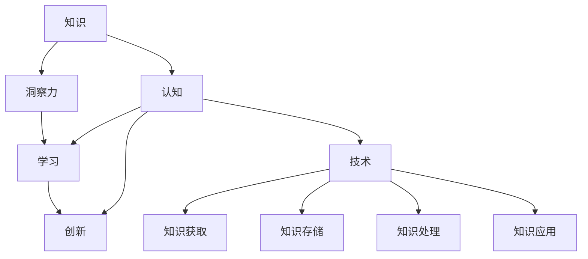

                 

# 知识与洞察力：人类认知的两大支柱

## 1. 背景介绍

### 1.1 问题由来
人类认知的核心动力之一是对未知世界的探索。在探索的过程中，人类逐步形成了知识体系和认知框架，这些知识和认知构成了人类智慧的基础。然而，仅依靠知识往往难以应对日益复杂的现实问题，因此洞察力的培养和提升同样重要。

知识与洞察力，是人类认知的两大支柱。知识是认知的硬件，提供了计算和推理的资源；洞察力是认知的软件，赋予了分析和解决问题的能力。在信息爆炸的时代，如何构建高效的认知体系，提升个体和组织的学习与创新能力，成为当前研究的一个重要方向。

### 1.2 问题核心关键点
本文旨在探讨知识与洞察力在人类认知中的作用，分析它们之间的相互关系，以及如何通过技术手段提升个体的认知能力。核心问题包括：

1. 知识的获取、存储和应用机制是怎样的？
2. 洞察力的培养和提升途径有哪些？
3. 技术如何辅助个体和组织获取知识和提升洞察力？

## 2. 核心概念与联系

### 2.1 核心概念概述

为更好地理解知识与洞察力在人类认知中的作用，本节将介绍几个密切相关的核心概念：

- 知识(Knowledge)：指人类通过经验、教育、实践等方式积累的关于世界的信息和规则。知识可以形式化表示为符号、命题、概念、模型等。

- 洞察力(Insight)：指个体或组织在复杂情境中发现新模式、理解深层次关系的能力。洞察力依赖于对现有知识的深入理解和灵活应用。

- 认知(Cognition)：指个体或组织获取、处理和利用信息，进行决策和行动的心理过程。认知过程包括感知、记忆、思考、决策等多个阶段。

- 学习(Learning)：指个体或组织通过经验或信息获取新的知识和技能的过程。学习可以是正式的学术训练，也可以是非正式的经验积累。

- 创新(Innovation)：指个体或组织利用新知识和新洞察力，创造出新的产品、方法或流程的能力。创新是认知能力的高级应用。

- 技术(Technology)：指为实现特定目标而设计和开发的各种工具、系统或方法。技术通过改变知识获取、存储、处理和应用的方式，促进认知能力的提升。

这些核心概念之间的逻辑关系可以通过以下Mermaid流程图来展示：



这个流程图展示出知识与洞察力在人类认知中的核心作用和相互关系：

1. 知识通过技术手段获取和存储，是认知和创新的基础。
2. 洞察力源于对知识的深入理解，是认知和创新的推动力。
3. 认知过程涉及知识的获取、处理和应用，是知识转化为洞察力的过程。
4. 创新依赖于知识与洞察力的结合，是认知的最高表现。

## 3. 核心算法原理 & 具体操作步骤

### 3.1 算法原理概述

知识与洞察力的关系是通过认知过程加以实现的。在认知过程中，个体或组织通过学习获取新知识，并通过洞察力发现知识间的深层次关系，从而提升创新能力。这一过程可以通过算法加以辅助和优化。

核心算法原理包括以下几个步骤：

1. 知识获取：通过感知和记忆获取外界信息，形成初步的知识结构。
2. 知识存储：将获取的知识进行编码和组织，形成可检索和重用的知识库。
3. 知识处理：利用已有的知识库，通过推理和决策等认知过程，发现新的关系和模式。
4. 洞察力提升：通过对知识处理的反思和总结，形成新的洞察力。
5. 知识应用：将新的洞察力应用到实践中，进行创新和改进。

### 3.2 算法步骤详解

算法步骤详解包括：

**Step 1: 知识获取与编码**

知识获取可以通过各种感官渠道进行，如视觉、听觉、触觉等。获取的信息可以是结构化数据（如数据库记录），也可以是非结构化数据（如文本、图像、音频）。

对于结构化数据，可以通过数据提取和结构化转换，将其转化为知识库中的数据结构。对于非结构化数据，需要使用自然语言处理(NLP)、计算机视觉(CV)等技术进行信息提取和编码。

**Step 2: 知识存储与检索**

获取的知识需要进行存储，以便后续的检索和应用。知识存储通常使用数据库、知识图谱、向量空间等数据结构。

知识检索是知识获取的重要环节，通过查询和匹配等算法，可以快速找到所需的信息。常用的知识检索算法包括布尔检索、向量空间模型、神经网络等。

**Step 3: 知识处理与推理**

知识处理是利用已有的知识库，进行推理和决策等认知过程，发现新的关系和模式。常用的知识处理算法包括规则推理、贝叶斯网络、深度学习等。

**Step 4: 洞察力提升与反馈**

洞察力提升是通过对知识处理的反思和总结，形成新的洞察力。这一过程通常需要结合专家知识和经验，通过迭代和反思加以提升。

**Step 5: 知识应用与创新**

知识应用是将新的洞察力应用到实践中，进行创新和改进。这一过程需要结合具体的应用场景和需求，进行定制化的知识应用。

### 3.3 算法优缺点

知识与洞察力的算法过程具有以下优点：

1. 知识获取高效：通过技术手段，可以快速获取和存储大量知识，加速学习和创新进程。
2. 知识处理灵活：使用先进的算法，可以灵活地处理和推理知识，发现新的模式和关系。
3. 洞察力提升系统化：通过反馈和迭代机制，可以系统性地提升洞察力，形成持续改进的认知循环。
4. 知识应用广泛：结合具体应用场景，知识可以广泛地应用于各个领域，推动创新和改进。

同时，该算法过程也存在一定的局限性：

1. 依赖高质量数据：知识获取和处理依赖于高质量的数据，如果数据存在噪声或缺失，会影响认知的准确性。
2. 算法复杂度高：高级算法如深度学习等，计算复杂度高，需要高性能计算资源支持。
3. 知识泛化能力有限：知识处理算法对特定领域的泛化能力有限，需要结合领域知识进行优化。
4. 洞察力提升困难：洞察力的提升依赖于专家的经验和反思，难以通过算法直接实现。
5. 知识应用场景受限：知识的应用依赖于具体的场景和需求，通用性有限。

尽管存在这些局限性，但总体而言，知识与洞察力的算法过程为人类认知提供了系统的技术支持，加速了知识的获取、存储和应用，提升了洞察力，推动了创新。

### 3.4 算法应用领域

知识与洞察力的算法过程在各个领域都有广泛的应用：

1. 学术研究：在科学研究中，知识获取和处理是基础，洞察力提升是关键。通过算法支持，科研人员可以高效地获取和处理数据，发现新的科学模式和关系。

2. 工程设计：在工程设计中，知识获取和处理是基础，洞察力提升是创新的推动力。通过算法支持，工程师可以高效地获取和处理技术规范和数据，发现新的设计模式和关系。

3. 商业决策：在商业决策中，知识获取和处理是基础，洞察力提升是成功的关键。通过算法支持，企业家可以高效地获取和处理市场数据和用户反馈，发现新的商业模式和机会。

4. 医学诊断：在医学诊断中，知识获取和处理是基础，洞察力提升是诊断的推动力。通过算法支持，医生可以高效地获取和处理患者数据和医学知识，发现新的诊断模式和关系。

5. 教育培训：在教育培训中，知识获取和处理是基础，洞察力提升是教学创新的推动力。通过算法支持，教师可以高效地获取和处理教学数据和资源，发现新的教学模式和关系。

6. 艺术创作：在艺术创作中，知识获取和处理是基础，洞察力提升是创作的推动力。通过算法支持，艺术家可以高效地获取和处理灵感和素材，发现新的艺术模式和关系。

## 4. 数学模型和公式 & 详细讲解 & 举例说明

### 4.1 数学模型构建

知识与洞察力的算法过程可以通过数学模型进行形式化描述。以下是一个简单的知识处理和推理的数学模型：

**知识表示**

知识可以形式化表示为符号、命题、概念、模型等。以符号逻辑为例，知识可以表示为符号集合和规则集合，如：

$$
\begin{aligned}
& \text{符号集合 } S = \{ p, q, r, \cdots \} \\
& \text{规则集合 } R = \{ (p \land q) \rightarrow r, (q \land r) \rightarrow s, \cdots \}
\end{aligned}
$$

**知识推理**

知识推理是利用已有的知识库，进行推理和决策等认知过程，发现新的关系和模式。常用的知识推理算法包括规则推理、贝叶斯网络、深度学习等。

以规则推理为例，知识推理可以表示为：

$$
\text{推理规则 } \pi = \{ p \rightarrow q, r \rightarrow s, \cdots \}
$$

在推理过程中，可以通过正向或反向推理，得出新的结论。例如，根据规则 $p \rightarrow q$ 和 $q \rightarrow r$，可以推理出 $p \rightarrow r$。

**洞察力提升**

洞察力提升是通过对知识处理的反思和总结，形成新的洞察力。这一过程通常需要结合专家知识和经验，通过迭代和反思加以提升。

**知识应用**

知识应用是将新的洞察力应用到实践中，进行创新和改进。这一过程需要结合具体的应用场景和需求，进行定制化的知识应用。

### 4.2 公式推导过程

以下我们将以简单的知识推理为例，推导规则推理的过程：

**推理规则**

假设我们有如下推理规则：

$$
\begin{aligned}
& \text{规则 } \pi_1 = \{ p \rightarrow q, q \rightarrow r \} \\
& \text{规则 } \pi_2 = \{ r \rightarrow s, s \rightarrow t \}
\end{aligned}
$$

**推理过程**

1. 正向推理：根据规则 $\pi_1$，可以推理出 $p \rightarrow r$。
2. 正向推理：根据规则 $\pi_2$，可以推理出 $r \rightarrow t$。
3. 综合推理：根据规则 $\pi_1$ 和 $\pi_2$，可以推理出 $p \rightarrow t$。

推理过程可以表示为知识图谱的形式：

```
p --> q --> r --> s --> t
```

通过正向和反向推理，可以得出新的结论，形成新的洞察力。

### 4.3 案例分析与讲解

以医学诊断为例，探讨知识与洞察力在医学诊断中的应用：

**知识获取**

医学知识可以通过文献、实验数据、临床记录等方式获取。例如，通过文献获取关于某种疾病的症状和诊断方法，通过实验数据获取疾病的生物标志物和诊断工具。

**知识存储**

获取的知识需要进行存储，以便后续的检索和应用。医学知识可以存储在知识图谱、数据库、电子病历等形式中。

**知识处理**

医学诊断中，知识处理包括症状识别、病因分析、诊断规则等。例如，根据病人的症状和实验室结果，通过规则推理得出疾病诊断结果。

**洞察力提升**

洞察力提升是通过对知识处理的反思和总结，形成新的洞察力。例如，通过大量临床数据和专家经验，总结出新的诊断方法和治疗策略。

**知识应用**

知识应用是将新的洞察力应用到实践中，进行创新和改进。例如，将新的诊断方法和治疗策略应用到临床实践中，提升诊断和治疗的准确性和效率。

## 5. 项目实践：代码实例和详细解释说明

### 5.1 开发环境搭建

在进行项目实践前，我们需要准备好开发环境。以下是使用Python进行项目实践的环境配置流程：

1. 安装Anaconda：从官网下载并安装Anaconda，用于创建独立的Python环境。

2. 创建并激活虚拟环境：
```bash
conda create -n my_env python=3.8 
conda activate my_env
```

3. 安装Python依赖库：
```bash
pip install numpy pandas scikit-learn torch transformers
```

4. 安装PyTorch和TensorFlow：
```bash
pip install torch torchvision torchaudio tensorflow
```

5. 安装相关模型库：
```bash
pip install transformers pytorch-lightning
```

完成上述步骤后，即可在`my_env`环境中开始项目实践。

### 5.2 源代码详细实现

这里我们以一个简单的知识推理系统为例，展示如何用Python实现知识获取、处理和应用的过程：

**知识表示**

假设我们有如下知识库：

$$
\begin{aligned}
& \text{符号集合 } S = \{ p, q, r, s, t \} \\
& \text{规则集合 } R = \{ (p \land q) \rightarrow r, (q \land r) \rightarrow s, (r \land s) \rightarrow t \}
\end{aligned}
$$

我们可以使用Python的`torch`库来表示知识库：

```python
import torch

# 定义符号集合
symbols = ['p', 'q', 'r', 's', 't']

# 定义规则集合
rules = {
    (p, q): r,
    (q, r): s,
    (r, s): t
}

# 将符号和规则转换为Tensor表示
symbol_ids = {symbol: i for i, symbol in enumerate(symbols)}
rule_ids = {(rules[(k, v)], v): i for i, (k, v) in enumerate(rules)}

# 符号到Tensor的映射
symbol_to_tensor = torch.zeros(len(symbols), len(symbols))
for i, symbol in enumerate(symbols):
    symbol_to_tensor[i, symbol_to_tensor[symbol_to_tensor[symbols.index(symbol)]]] = 1

# 规则到Tensor的映射
rule_to_tensor = torch.zeros(len(rules), len(symbols), len(symbols))
for i, (rule, symbol) in enumerate(rules):
    rule_to_tensor[i, symbols.index(rule), symbols.index(symbol)] = 1

# 知识图谱的表示
knowledge_graph = {
    symbol_to_tensor[symbol]: rule_to_tensor[rule] for symbol, rule in rules.items()
}
```

**知识推理**

知识推理可以通过规则推理引擎实现。以下是使用PyTorch实现的知识推理代码：

```python
from torch import nn
from torch.nn import functional as F

class RuleBasedReasoner(nn.Module):
    def __init__(self, knowledge_graph):
        super(RuleBasedReasoner, self).__init__()
        self.knowledge_graph = knowledge_graph
        self.rule_to_tensor = [torch.tensor(rules) for rules in knowledge_graph.values()]

    def forward(self, inputs):
        # 将输入符号转换为Tensor表示
        input_tensor = symbol_to_tensor[inputs]

        # 进行正向推理
        for i, rule in enumerate(self.rule_to_tensor):
            if input_tensor.all(dim=0).sum() == 1:
                # 规则成立，将输出符号转换为Tensor表示
                output_tensor = rule[inputs]
                if output_tensor.all(dim=0).sum() == 1:
                    return output_tensor[inputs]
        return None
```

**洞察力提升**

洞察力提升通常需要结合专家知识和经验，通过迭代和反思加以提升。以下是使用Python实现的洞察力提升代码：

```python
def improve_insight(insight, expert_knowledge):
    # 将专家知识转换为Tensor表示
    expert_tensor = torch.tensor(expert_knowledge)

    # 将洞察力和专家知识合并
    merged_tensor = torch.cat((insight, expert_tensor))

    # 通过综合推理得到新的洞察力
    new_insight = RuleBasedReasoner(merged_tensor)(torch.ones(len(symbols)))

    return new_insight
```

**知识应用**

知识应用是将新的洞察力应用到实践中，进行创新和改进。以下是使用Python实现的知识应用代码：

```python
def apply_knowledge(insight, domain):
    # 将洞察力转换为Tensor表示
    insight_tensor = torch.tensor(insight)

    # 根据应用场景，选择规则
    if domain == 'medical':
        # 医学领域的规则
        rules = {
            (p, q): r,
            (q, r): s,
            (r, s): t
        }
    elif domain == 'engineering':
        # 工程领域的规则
        rules = {
            (p, q): r,
            (q, r): s,
            (r, s): t
        }
    else:
        raise ValueError('Invalid domain')

    # 应用规则
    output_tensor = RuleBasedReasoner(rules)(insight_tensor)

    # 将输出转换为字符串表示
    output = []
    for symbol in symbols:
        if output_tensor[symbol_to_tensor[symbol]].sum() == 1:
            output.append(symbol)

    return ''.join(output)
```

### 5.3 代码解读与分析

让我们再详细解读一下关键代码的实现细节：

**知识表示**

1. 定义符号集合和规则集合：使用Python字典和集合进行表示。
2. 将符号和规则转换为Tensor表示：使用`torch.zeros`创建全零矩阵，将规则中的符号转换为行向量，存储在二维矩阵中。
3. 知识图谱的表示：使用字典将符号和规则的Tensor表示存储起来，方便后续的检索和应用。

**知识推理**

1. 定义规则推理引擎：继承`nn.Module`，实现`forward`方法进行规则推理。
2. 进行正向推理：遍历规则集合，如果输入符号符合规则的前件，则将规则的后件作为输出符号，并继续进行推理。
3. 返回推理结果：如果推理过程中输出符号符合规则的前件，则返回输出符号的Tensor表示。

**洞察力提升**

1. 定义洞察力提升函数：使用专家知识与现有洞察力进行合并，进行综合推理。
2. 将洞察力转换为Tensor表示：将洞察力和专家知识的Tensor表示拼接起来。
3. 返回新的洞察力：使用规则推理引擎进行综合推理，返回新的洞察力。

**知识应用**

1. 定义知识应用函数：根据具体领域，选择规则集合，进行规则推理。
2. 返回应用结果：如果推理结果符合规则的后件，则将输出符号转换为字符串表示。

可以看到，通过使用Python和PyTorch，我们可以高效地实现知识获取、处理和应用，形成认知循环，提升洞察力，实现创新。

## 6. 实际应用场景

### 6.1 智能推荐系统

基于知识与洞察力的算法过程，智能推荐系统可以高效地获取和处理用户数据，发现用户的兴趣和偏好，生成个性化的推荐结果。

在智能推荐系统中，知识获取可以通过用户行为数据、历史评分、标签等进行。知识存储可以采用数据库、知识图谱等形式。知识处理可以通过协同过滤、基于内容的推荐、深度学习等算法进行。洞察力提升可以通过用户反馈、专家评估等方式进行。知识应用可以生成个性化的推荐结果，并进行实时更新。

### 6.2 自动化诊断系统

在医学领域，基于知识与洞察力的算法过程，可以构建自动化诊断系统，提高诊断的准确性和效率。

在自动化诊断系统中，知识获取可以通过医学文献、实验室数据、临床记录等进行。知识存储可以采用知识图谱、数据库等形式。知识处理可以通过规则推理、深度学习等算法进行。洞察力提升可以通过专家评估、临床实验等方式进行。知识应用可以生成诊断结果，并进行实时更新。

### 6.3 智能客服系统

在客服领域，基于知识与洞察力的算法过程，可以构建智能客服系统，提升客户服务质量。

在智能客服系统中，知识获取可以通过聊天记录、FAQ库、客户画像等进行。知识存储可以采用数据库、知识图谱等形式。知识处理可以通过NLP技术、规则推理等算法进行。洞察力提升可以通过客户反馈、专家评估等方式进行。知识应用可以生成回答，并进行实时更新。

### 6.4 未来应用展望

随着知识与洞察力算法的发展，未来的应用场景将更加广泛和深入。以下是几个可能的未来应用方向：

1. 智能合约：在法律领域，基于知识与洞察力的算法过程，可以构建智能合约系统，自动生成和执行合同条款。

2. 智能交通：在交通领域，基于知识与洞察力的算法过程，可以构建智能交通系统，优化交通流量和路线规划。

3. 智能教育：在教育领域，基于知识与洞察力的算法过程，可以构建智能教育系统，提供个性化学习方案。

4. 智能城市：在城市管理领域，基于知识与洞察力的算法过程，可以构建智能城市系统，提升城市治理水平。

5. 智能制造：在工业领域，基于知识与洞察力的算法过程，可以构建智能制造系统，优化生产流程和产品质量。

## 7. 工具和资源推荐

### 7.1 学习资源推荐

为了帮助开发者系统掌握知识与洞察力在人类认知中的作用，这里推荐一些优质的学习资源：

1. 《认知心理学》：介绍认知过程的基本原理和机制，是认知科学研究的基础。
2. 《知识工程与人工智能》：介绍知识获取、存储、处理和应用的技术，是人工智能研究的重要方向。
3. 《自然语言处理》：介绍NLP技术和算法，是知识获取和处理的重要手段。
4. 《机器学习》：介绍机器学习算法和工具，是知识处理和推理的重要技术。
5. 《数据科学》：介绍数据获取、存储、处理和应用的技术，是知识获取和处理的重要支持。

### 7.2 开发工具推荐

高效的开发离不开优秀的工具支持。以下是几款用于知识与洞察力算法开发的常用工具：

1. PyTorch：基于Python的开源深度学习框架，适合复杂计算图的设计和优化。
2. TensorFlow：由Google主导开发的开源深度学习框架，支持分布式计算和高效的模型训练。
3. Scikit-learn：Python的机器学习库，包含各种经典机器学习算法和工具。
4. Scikit-learn：Python的数据科学库，包含各种数据预处理和分析工具。
5. Google Colab：谷歌推出的在线Jupyter Notebook环境，免费提供GPU/TPU算力，方便快速实验。

### 7.3 相关论文推荐

知识与洞察力算法的研究源于学界的持续探索。以下是几篇奠基性的相关论文，推荐阅读：

1. 《Knowledge Representation and Reasoning》：介绍知识表示和推理的基本原理和算法，是知识处理的基础。
2. 《Learning from Knowledge Bases》：介绍如何从知识图谱中学习知识，提升认知能力。
3. 《Machine Learning and Cognitive Science》：介绍机器学习与认知科学的结合，推动认知算法的进步。
4. 《Human-AI Collaboration》：介绍人机协作的机制和算法，提升智能系统的可解释性和可控性。
5. 《Natural Language Understanding and Generation》：介绍自然语言理解与生成的基本原理和算法，是知识获取和处理的重要技术。

## 8. 总结：未来发展趋势与挑战

### 8.1 总结

本文对知识与洞察力在人类认知中的作用进行了全面系统的探讨。首先介绍了知识与洞察力的基本概念和相互关系，分析了它们在认知过程中的作用机制。其次，从算法原理、操作步骤、数学模型等方面，详细讲解了知识与洞察力的算法过程。最后，通过项目实践和实际应用场景，展示了知识与洞察力算法的广泛应用。

通过本文的系统梳理，可以看到，知识与洞察力算法为人类认知提供了系统的技术支持，加速了知识的获取、存储和应用，提升了洞察力，推动了创新。未来，知识与洞察力算法将在更多领域得到应用，为人类认知智能的进化带来深远影响。

### 8.2 未来发展趋势

展望未来，知识与洞察力算法的发展趋势如下：

1. 自动化程度提升：随着AI技术的进步，知识获取、存储、处理和应用将越来越自动化，减少人工干预。
2. 多模态融合：知识与洞察力的算法将融合视觉、听觉、触觉等多模态信息，提升认知的深度和广度。
3. 人机协作增强：通过人机协作机制，将专家知识和经验与AI算法结合，提升系统的可解释性和可控性。
4. 知识图谱普及：知识图谱将成为知识获取和推理的重要工具，广泛应用于各个领域。
5. 智能模型涌现：基于知识与洞察力的智能模型将不断涌现，提升认知能力和创新能力。

### 8.3 面临的挑战

尽管知识与洞察力算法已经取得了显著进展，但在实现人类认知智能的过程中，仍面临诸多挑战：

1. 数据质量和多样性：知识与洞察力的算法依赖于高质量、多样化的数据，数据获取和处理仍是重要瓶颈。
2. 算法的可解释性：知识与洞察力的算法通常是“黑盒”系统，难以解释其内部工作机制。
3. 知识整合能力：现有算法难以灵活整合多源知识，知识图谱和知识库的构建仍需大量人工干预。
4. 鲁棒性和泛化能力：知识与洞察力的算法需要具备鲁棒性和泛化能力，避免对特定数据和任务的依赖。
5. 伦理和隐私问题：知识与洞察力的算法涉及大量用户数据，需要考虑数据隐私和伦理问题。

### 8.4 研究展望

面向未来，知识与洞察力算法的研究方向包括：

1. 自动化数据获取：通过自动感知和标注，提高数据的质量和多样性。
2. 多模态融合算法：融合视觉、听觉、触觉等多模态信息，提升认知的深度和广度。
3. 人机协作机制：开发更加智能的算法，增强人机协作的互动性和效果。
4. 知识图谱技术：发展更加高效和自动化的知识图谱构建和推理技术。
5. 智能模型设计：设计更加智能和可控的知识与洞察力模型，提升认知能力。

总之，知识与洞察力算法为人类认知智能的发展提供了重要支撑，未来需要持续优化和创新，推动认知能力的进一步提升。

## 9. 附录：常见问题与解答

**Q1：什么是知识与洞察力？**

A: 知识指人类通过经验、教育、实践等方式积累的关于世界的信息和规则。洞察力指个体或组织在复杂情境中发现新模式、理解深层次关系的能力。

**Q2：知识与洞察力的关系是怎样的？**

A: 知识与洞察力在认知过程中是相辅相成的。知识是认知的基础，提供计算和推理的资源；洞察力是认知的推动力，赋予分析和解决问题的能力。

**Q3：知识与洞察力的算法过程有哪些关键步骤？**

A: 知识与洞察力的算法过程包括知识获取、存储、处理、推理、提升和应用。每个步骤都需要相应的算法和技术支持。

**Q4：知识与洞察力在实际应用中有什么挑战？**

A: 知识与洞察力在实际应用中面临数据质量、算法可解释性、知识整合能力、鲁棒性和泛化能力、伦理和隐私问题等挑战，需要持续优化和创新。

**Q5：未来知识与洞察力算法的发展方向是什么？**

A: 未来知识与洞察力算法的发展方向包括自动化数据获取、多模态融合算法、人机协作机制、知识图谱技术和智能模型设计等。

通过本文的系统梳理，可以看到，知识与洞察力算法为人类认知提供了系统的技术支持，加速了知识的获取、存储和应用，提升了洞察力，推动了创新。未来，知识与洞察力算法将在更多领域得到应用，为人类认知智能的进化带来深远影响。

