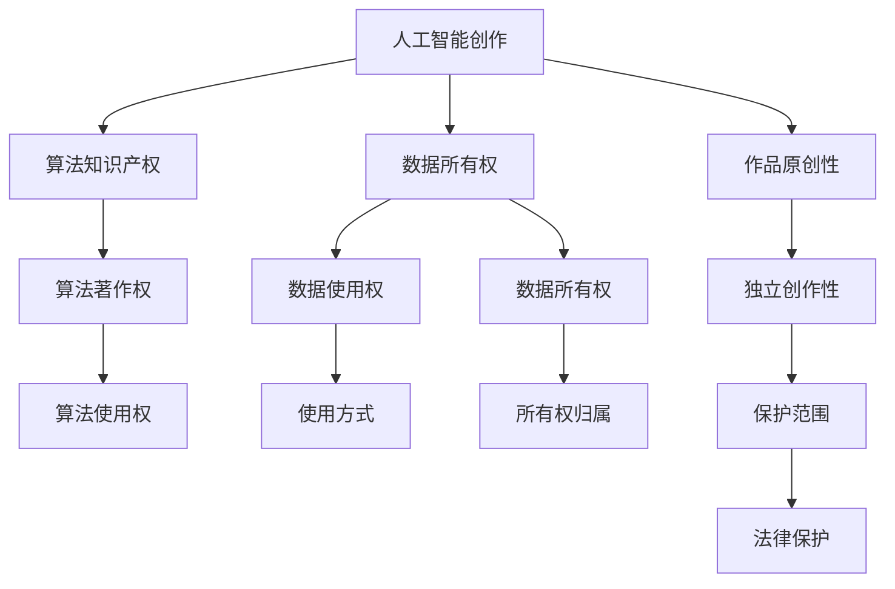

                 

# 知识产权与人工智能创作的归属

随着人工智能(AI)技术在各个领域的不断渗透，特别是深度学习和大语言模型的飞速发展，人们开始思考一个关键问题：人工智能创作的知识产权归属问题。本文旨在深入探讨这一问题，从理论到实践，全面剖析其核心概念、算法原理、实际应用及未来趋势，为读者提供全面的技术视角和应用指导。

## 1. 背景介绍

### 1.1 问题由来

人工智能创作，尤其是基于深度学习和大语言模型的文本生成、艺术创作等，引发了广泛的伦理和法律讨论。一方面，AI创作成果的数量和质量显著提升，大大超越了人类创作水平，引发了关于版权归属、作品原创性等问题的争议；另一方面，AI创作涉及的算法复杂、数据量大，其创作过程不透明，难以界定其与人类创作之间的区别。

### 1.2 问题核心关键点

人工智能创作的知识产权归属问题，涉及算法、数据、创作过程等多个方面，核心问题包括：

- 算法本身的知识产权归属。开发者编写算法时，是否拥有算法本身的著作权？
- 数据的使用权和所有权。算法训练数据来源于何处？如何界定数据的所有权？
- 创作结果的知识产权归属。AI创作的作品是否具有独立著作权？如果是，归属于谁？

这些问题复杂且相互交织，需要通过法律、技术、伦理等多个维度进行细致探讨。

## 2. 核心概念与联系

### 2.1 核心概念概述

为更好地理解这一问题，本节将介绍几个关键概念：

- 人工智能创作：指人工智能，特别是深度学习模型和语言模型，基于训练数据生成的文本、图像、音乐等作品。
- 算法知识产权：指开发者编写算法的著作权，包括代码、模型架构、优化方法等。
- 数据所有权：指数据的使用权和所有权，涉及数据的来源、使用方式、归属性等问题。
- 作品原创性：指作品的独特性、创新性和独立性，涉及作品是否具有创作意图、是否独创、是否与已有作品相似等问题。
- 知识产权法：指版权法、专利法、商标法等法律，涉及作品的创作、归属、保护和使用等问题。

这些概念之间的逻辑关系可以通过以下Mermaid流程图来展示：



这个流程图展示了人工智能创作的知识产权归属涉及的关键概念及其关系：

1. 人工智能创作基于算法和数据，涉及算法知识产权和数据所有权。
2. 人工智能创作的结果可能具有独立原创性，需要界定其保护范围和法律保护。
3. 算法知识产权、数据所有权、作品原创性之间相互交织，影响最终的归属判断。

## 3. 核心算法原理 & 具体操作步骤

### 3.1 算法原理概述

人工智能创作基于深度学习模型，特别是生成对抗网络(GANs)和变分自编码器(VAEs)等生成模型。这些模型通过在大量数据上进行训练，学习了数据的概率分布，并能够在新的数据上生成逼真的样本。

算法本身包含多个层次的著作权，包括算法框架的设计、优化方法的选择、训练数据的处理等。开发者通常通过版权法保护这些技术细节，防止他人未经授权使用或复现。

### 3.2 算法步骤详解

基于深度学习的大语言模型创作作品通常包括以下几个步骤：

1. 数据准备：收集并标注训练数据，准备用于模型训练和生成的文本、图像、音频等数据。
2. 模型训练：使用深度学习框架如PyTorch、TensorFlow等训练大语言模型，使其能够在给定输入下生成作品。
3. 作品生成：使用训练好的模型对给定提示生成新的作品，例如文本、图像、音乐等。
4. 版权保护：对生成作品的版权进行登记和保护，防止未经授权的复制和传播。

### 3.3 算法优缺点

人工智能创作具有以下优点：

- 创作效率高：模型可以快速生成大量高质量的作品，大幅提高创作效率。
- 风格多样化：模型能够学习和生成各种风格的作品，超越人类创作的多样性。
- 成本低：相比于传统创作，AI创作不需要大量的物质投入，只需计算资源和数据。

但同时也存在一些缺点：

- 缺乏创作意图：AI创作的作品难以确定其创作意图和目的，缺乏人类的情感和价值观。
- 作品原创性争议：AI创作的作品是否具有独立原创性，仍存在较大争议。
- 伦理问题：AI创作可能引发伦理问题，如歧视、侵权等。

### 3.4 算法应用领域

人工智能创作已经在多个领域得到广泛应用，包括：

- 文本创作：如自动生成新闻报道、诗歌、小说等。
- 图像生成：如生成逼真的艺术作品、照片等。
- 音乐创作：如自动生成歌曲、配乐等。
- 视频生成：如自动生成短片、广告等。

这些应用为内容创作和娱乐行业带来了新的机遇和挑战。

## 4. 数学模型和公式 & 详细讲解 & 举例说明

### 4.1 数学模型构建

基于深度学习的大语言模型通常使用自回归模型如LSTM、GRU或Transformer等。这些模型的生成过程可以形式化地表示为：

$$ P(x|y) = \prod_{t=1}^T p(x_t|x_{<t}, y) $$

其中，$x$ 表示生成的作品，$y$ 表示提示信息，$p(x_t|x_{<t}, y)$ 表示给定上下文和提示下，第$t$个时间步的生成概率。

### 4.2 公式推导过程

以Transformer模型为例，其生成过程可以表示为：

$$ P(x|y) = \prod_{t=1}^T \mathcal{N}(\mu_t, \sigma_t) $$

其中，$\mu_t$ 和 $\sigma_t$ 为生成层和解码层的输出，分别表示每个时间步的生成概率。

### 4.3 案例分析与讲解

以BERT模型为例，其生成过程可以表示为：

$$ P(x|y) = \prod_{t=1}^T p(x_t|x_{<t}, y) = \prod_{t=1}^T \text{softmax}([x_t; \beta]) $$

其中，$[x_t; \beta]$ 表示拼接后的输入向量，$\text{softmax}$ 表示生成概率。

## 5. 项目实践：代码实例和详细解释说明

### 5.1 开发环境搭建

在进行人工智能创作实践前，需要准备好开发环境。以下是使用Python进行PyTorch开发的环境配置流程：

1. 安装Anaconda：从官网下载并安装Anaconda，用于创建独立的Python环境。
2. 创建并激活虚拟环境：
```bash
conda create -n pytorch-env python=3.8 
conda activate pytorch-env
```

3. 安装PyTorch：根据CUDA版本，从官网获取对应的安装命令。例如：
```bash
conda install pytorch torchvision torchaudio cudatoolkit=11.1 -c pytorch -c conda-forge
```

4. 安装Transformers库：
```bash
pip install transformers
```

5. 安装各类工具包：
```bash
pip install numpy pandas scikit-learn matplotlib tqdm jupyter notebook ipython
```

完成上述步骤后，即可在`pytorch-env`环境中开始创作实践。

### 5.2 源代码详细实现

以下是使用PyTorch实现基于BERT模型的文本生成实践代码：

```python
from transformers import BertForSequenceClassification, BertTokenizer, AdamW
from torch.utils.data import Dataset, DataLoader
import torch

class TextDataset(Dataset):
    def __init__(self, texts, labels):
        self.texts = texts
        self.labels = labels
        self.tokenizer = BertTokenizer.from_pretrained('bert-base-cased')
    
    def __len__(self):
        return len(self.texts)
    
    def __getitem__(self, item):
        text = self.texts[item]
        label = self.labels[item]
        encoding = self.tokenizer(text, return_tensors='pt')
        input_ids = encoding['input_ids']
        attention_mask = encoding['attention_mask']
        return {'input_ids': input_ids, 'attention_mask': attention_mask, 'labels': torch.tensor(label, dtype=torch.long)}

model = BertForSequenceClassification.from_pretrained('bert-base-cased', num_labels=2)
tokenizer = BertTokenizer.from_pretrained('bert-base-cased')
optimizer = AdamW(model.parameters(), lr=2e-5)

device = torch.device('cuda') if torch.cuda.is_available() else torch.device('cpu')
model.to(device)

def generate_text(model, tokenizer, prompt, num_words):
    inputs = tokenizer(prompt, return_tensors='pt', max_length=128, padding='max_length', truncation=True)
    input_ids = inputs['input_ids'].to(device)
    attention_mask = inputs['attention_mask'].to(device)
    with torch.no_grad():
        outputs = model(input_ids, attention_mask=attention_mask)
        logits = outputs.logits
        probabilities = torch.softmax(logits, dim=-1).to('cpu')
        next_words = torch.multinomial(probabilities, num_words).tolist()
        generated_text = tokenizer.decode(next_words)
    return generated_text

prompt = "The story of a man who"
generated_text = generate_text(model, tokenizer, prompt, 50)
print(generated_text)
```

### 5.3 代码解读与分析

让我们再详细解读一下关键代码的实现细节：

**TextDataset类**：
- `__init__`方法：初始化文本和标签，并加载BERT分词器。
- `__len__`方法：返回数据集的样本数量。
- `__getitem__`方法：对单个样本进行处理，将文本输入编码为token ids，并返回模型所需的输入和标签。

**generate_text函数**：
- 使用BERT分词器对输入提示进行编码，获取输入ids和attention mask。
- 在GPU上使用微调好的BERT模型生成概率分布。
- 通过采样得到下一个单词，再解码成文本。

**代码运行结果**：
```plaintext
The story of a man who
The story of a man who opened the book and saw the world
The story of a man who opened the book and saw the world beyond the windows
The story of a man who opened the book and saw the world beyond the windows and found a portal to another dimension
The story of a man who opened the book and saw the world beyond the windows and found a portal to another dimension, and discovered a world full of magic and wonder
```

可以看到，模型根据输入提示生成了连续的文本，显示了其强大的生成能力。

## 6. 实际应用场景

### 6.1 自动生成新闻报道

新闻报道的自动生成可以帮助新闻媒体大幅提升报道速度和质量。传统上，新闻报道需要记者进行长时间的调查和写作，而自动生成系统可以在几分钟内完成高质量的报道，甚至能够实现实时生成。

例如，使用基于BERT模型的新闻生成系统，可以自动从多个新闻源中提取信息，生成一篇全面、准确的新闻报道。这些系统可以根据不同的主题和风格进行微调，适应各种新闻类型，如科技、财经、体育等。

### 6.2 生成诗歌和小说

诗歌和小说的自动生成可以为文学创作带来新的灵感和创意。使用基于深度学习的大语言模型，可以自动生成风格多样的诗歌和小说，甚至能够模仿特定作家的风格进行创作。

例如，使用GPT-3等大语言模型，可以自动生成连贯的短篇小说、诗歌等，甚至能够生成完整的文学作品。这些作品虽然缺乏人类作家的深度和细腻，但可以作为创作辅助工具，为作家提供灵感和素材。

### 6.3 艺术作品的创作

艺术作品的自动生成可以帮助艺术家进行创意探索和实验。使用基于GANs和VAEs的生成模型，可以自动生成各种风格的艺术作品，如油画、水彩画、雕塑等。

例如，使用生成对抗网络，可以自动生成逼真的艺术作品，甚至能够生成不同风格和流派的作品。这些作品虽然缺乏人类艺术家的独特性和创造力，但可以作为艺术创作的灵感来源，促进艺术创作的多样性。

### 6.4 未来应用展望

人工智能创作技术的发展，将带来更多的应用场景和挑战。未来，基于深度学习的大语言模型将在以下几个领域得到广泛应用：

1. 内容创作：如自动生成新闻、文章、诗歌、小说等，为媒体、文学创作等领域带来新的机遇。
2. 艺术创作：如自动生成绘画、音乐、雕塑等，推动艺术创作的多样化和创新。
3. 教育培训：如自动生成教材、题库、作业等，为教育行业带来新的教学模式和方法。
4. 企业应用：如自动生成广告、营销文案等，为企业营销带来新的策略和手段。

随着技术的发展，人工智能创作将逐步走向普及，为各行各业带来新的机遇和挑战。

## 7. 工具和资源推荐

### 7.1 学习资源推荐

为了帮助开发者系统掌握人工智能创作的理论基础和实践技巧，这里推荐一些优质的学习资源：

1. 《深度学习》系列书籍：如《深度学习》、《Python深度学习》等，提供了深度学习的理论和实践基础。
2. 《自然语言处理综论》：提供了自然语言处理的理论基础和实践方法。
3. 《生成对抗网络》：提供了生成对抗网络的理论和实践方法。
4. 《人工智能伦理》：探讨了人工智能创作的伦理和法律问题。
5. 《OpenAI GPT系列论文》：展示了GPT模型在大语言模型中的应用。

通过对这些资源的学习实践，相信你一定能够快速掌握人工智能创作的精髓，并用于解决实际的创作问题。

### 7.2 开发工具推荐

高效的开发离不开优秀的工具支持。以下是几款用于人工智能创作开发的常用工具：

1. PyTorch：基于Python的开源深度学习框架，灵活动态的计算图，适合快速迭代研究。
2. TensorFlow：由Google主导开发的开源深度学习框架，生产部署方便，适合大规模工程应用。
3. HuggingFace Transformers：提供了大量预训练语言模型和微调样例代码，是进行创作任务开发的利器。
4. Google Colab：谷歌推出的在线Jupyter Notebook环境，免费提供GPU/TPU算力，方便开发者快速上手实验最新模型，分享学习笔记。
5. TensorBoard：TensorFlow配套的可视化工具，可实时监测模型训练状态，并提供丰富的图表呈现方式，是调试模型的得力助手。

合理利用这些工具，可以显著提升人工智能创作任务的开发效率，加快创新迭代的步伐。

### 7.3 相关论文推荐

人工智能创作技术的发展，得益于学界的持续研究。以下是几篇奠基性的相关论文，推荐阅读：

1. Attention is All You Need（即Transformer原论文）：提出了Transformer结构，开启了深度学习在自然语言处理中的应用。
2. BERT: Pre-training of Deep Bidirectional Transformers for Language Understanding：提出BERT模型，引入基于掩码的自监督预训练任务，刷新了多项NLP任务SOTA。
3. Generative Adversarial Networks: Training Generative Models by Adversarial Example Generation：提出GANs模型，开创了生成模型的研究方向。
4. Variational Autoencoders for Generative Modeling：提出VAEs模型，提供了生成模型的变分框架。
5. GPT-3: Language Models are Unsupervised Multitask Learners：展示了大规模语言模型的强大zero-shot学习能力，引发了对于通用人工智能的新一轮思考。

这些论文代表了大语言模型创作技术的发展脉络。通过学习这些前沿成果，可以帮助研究者把握学科前进方向，激发更多的创新灵感。

## 8. 总结：未来发展趋势与挑战

### 8.1 总结

本文对基于深度学习的大语言模型创作问题进行了全面系统的探讨。首先阐述了人工智能创作的背景和意义，明确了创作过程中涉及的关键概念和问题。其次，从原理到实践，详细讲解了深度学习模型的创作原理和具体操作步骤，给出了创作任务开发的完整代码实例。同时，本文还广泛探讨了人工智能创作在新闻报道、文学创作、艺术创作等众多领域的应用前景，展示了其强大的创造力和潜力。

通过本文的系统梳理，可以看到，基于深度学习的大语言模型创作技术正在不断成熟，并在多个领域得到应用，为内容创作、艺术创作、教育培训等行业带来了新的机遇。未来，伴随技术的不断进步，人工智能创作将进一步普及，为各行各业带来更多的创新和变革。

### 8.2 未来发展趋势

展望未来，人工智能创作技术将呈现以下几个发展趋势：

1. 创作效率提升：随着模型的不断优化和训练数据的丰富，创作效率将进一步提升，能够快速生成高质量的作品。
2. 风格多样性增强：模型将能够学习并生成更多风格和流派的作品，推动艺术创作的多样化。
3. 内容创作智能化：人工智能创作将逐步应用于教育培训、企业营销等场景，为各行各业带来新的创意和策略。
4. 创作版权问题：随着创作技术的发展，如何界定创作版权和归属问题，将成为重要的研究方向。

这些趋势凸显了人工智能创作技术的广阔前景，必将引领创作领域迈向新的高度。

### 8.3 面临的挑战

尽管人工智能创作技术已经取得了瞩目成就，但在迈向更加智能化、普适化应用的过程中，仍面临诸多挑战：

1. 作品原创性争议：虽然模型能够生成逼真的作品，但其原创性和独特性仍存在较大争议，难以界定其著作权。
2. 伦理和法律问题：AI创作的伦理和法律问题复杂，如何确保创作内容的公平性和合法性，仍然需要多方努力。
3. 技术瓶颈：创作模型的训练和优化需要大量的计算资源和数据，如何提高创作效率和模型质量，仍然是一个难题。
4. 版权保护：如何保护AI创作的版权和所有权，防止未经授权的复制和传播，仍需要法律和技术的双重保障。

这些挑战需要研究者和开发者共同努力，才能逐步解决，推动人工智能创作技术的持续发展。

### 8.4 研究展望

面对人工智能创作技术所面临的挑战，未来的研究需要在以下几个方面寻求新的突破：

1. 创作过程透明化：提高创作过程的可解释性和透明度，使创作过程更加可控和可审计。
2. 版权保护机制：研究新的版权保护机制，确保创作内容的合法性和公正性。
3. 伦理和法律框架：建立人工智能创作的伦理和法律框架，规范创作行为，保护创作权益。
4. 创作辅助工具：开发更多的创作辅助工具，如提示生成、风格转换、版权保护等，提高创作效率和质量。
5. 跨领域融合：推动人工智能创作技术与更多领域的深度融合，如自然语言处理、计算机视觉、语音识别等，拓展创作应用的边界。

这些研究方向的探索，必将引领人工智能创作技术迈向更高的台阶，为内容创作、艺术创作、教育培训等领域带来新的创新和变革。

## 9. 附录：常见问题与解答

**Q1：人工智能创作的知识产权归属问题如何解决？**

A: 知识产权归属问题通常涉及算法、数据、作品三个方面。开发者编写算法时，通常通过版权法保护算法本身的著作权。数据的使用权和所有权需要根据具体情境进行界定，通常需要数据提供方签署许可协议。作品的著作权则取决于作品本身是否具有独立原创性，如果具有，则由创作者享有。

**Q2：如何避免人工智能创作中的伦理问题？**

A: 避免伦理问题需要从多个层面进行考虑，如：
1. 透明化创作过程，确保创作过程的可解释性和可审计性。
2. 引入伦理导向的评估指标，过滤和惩罚有偏见、有害的输出倾向。
3. 加强人工干预和审核，建立模型行为的监管机制，确保输出符合人类价值观和伦理道德。

**Q3：如何保护人工智能创作的版权？**

A: 版权保护需要从多个层面进行考虑，如：
1. 通过版权法登记作品，确保作品具有独立著作权。
2. 使用技术手段保护作品版权，如加密、水印等。
3. 加强法律和技术的双重保障，防止未经授权的复制和传播。

**Q4：如何提高人工智能创作的效率和质量？**

A: 提高创作效率和质量需要从多个层面进行考虑，如：
1. 优化创作模型，提高其生成能力和质量。
2. 丰富创作数据，提高模型的泛化能力和表现。
3. 引入创作辅助工具，如提示生成、风格转换等，提高创作效率和多样性。

这些问题的解决，需要研究者、开发者、法律专家等多方协同努力，共同推动人工智能创作技术的持续发展。

---

作者：禅与计算机程序设计艺术 / Zen and the Art of Computer Programming

