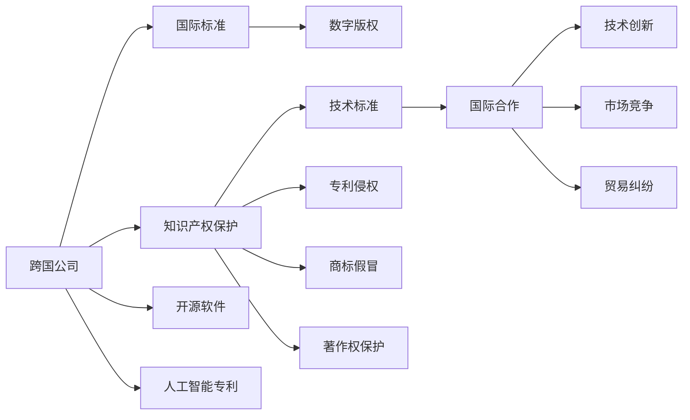
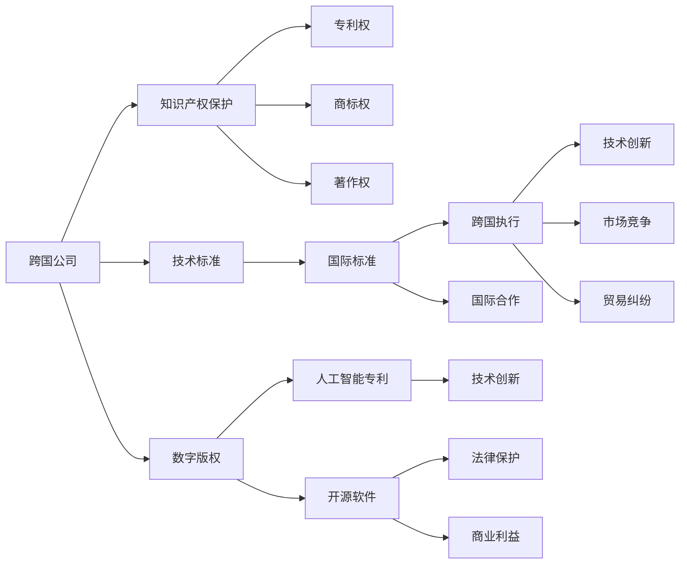

                 

## 1. 背景介绍

### 1.1 问题由来

知识产权（Intellectual Property，IP），作为保护创新和创意资产的法律手段，在全球化进程中扮演了关键角色。随着经济全球化的不断加深，跨国公司、研发机构以及个人的创新成果越来越多地跨国界流动，知识产权的保护、交易、实施成为促进全球经济增长的重要引擎。然而，由于各国法律体系、文化背景和经济发展阶段的差异，知识产权的保护和执行面临着诸多挑战。如何在全球化背景下，建立公平、高效、透明的知识产权保护机制，成为各国政府、企业和学术界共同关注的焦点。

### 1.2 问题核心关键点

全球化背景下知识产权的核心问题包括：
- **跨国知识产权法律体系差异**：不同国家知识产权法律在保护范围、保护力度、权利期限等方面存在显著差异。
- **国际知识产权保护的难度**：跨国公司面临的专利侵权、商标假冒等问题复杂多样，举证和执行难度大。
- **知识产权国际化的挑战**：技术进步加速，新领域（如数字版权、开源软件、人工智能专利等）的出现，对现有法律体系提出了新的要求。
- **国际知识产权合作的必要性**：各国需要共同应对跨国侵权、假冒伪劣等全球性问题，促进知识产权的国际流通和合作。

这些核心问题共同构成了全球化背景下知识产权互动关系的复杂图景，需要在法律、技术、政策和实践等多方面进行深入探讨。

### 1.3 问题研究意义

研究全球化与知识产权的互动关系，具有重要的理论和实践意义：
- **理论价值**：深入分析知识产权全球化背景下各国法律、政策和经济社会现象之间的互动关系，有助于完善知识产权国际保护的法律体系和制度安排。
- **实践意义**：提供全球化时代下跨国企业、研发机构和知识产权保护机构的实践指导，推动国际知识产权合作的深入发展，促进全球经济创新和增长。

## 2. 核心概念与联系

### 2.1 核心概念概述

要深入理解知识产权与全球化的互动关系，首先需要明确几个核心概念：

- **知识产权**：指国家法律给予发明创造者对其创新成果的专有权利。包括专利权、商标权、著作权等。
- **全球化**：指世界各国在经济、政治、文化、科技等方面的相互依存和融合，形成了跨越国界的经济体系和文化交流。
- **知识产权全球化**：指知识产权在跨国界保护、跨国界传播、跨国界执行等过程中的全球整合和国际化。
- **跨国公司**：指在多个国家或地区拥有生产和经营活动的国际性企业。
- **技术标准**：指行业内公认的、对产品或服务的技术要求，包括国际标准和国家标准。
- **数字版权**：指在数字媒体时代，对作品的创作者和发行者的权利进行保护。
- **开源软件**：指源代码公开、免费共享的软件，代表了一种新的软件保护模式。
- **人工智能专利**：指针对人工智能技术及其应用进行专利保护的法律实践。

这些概念之间存在复杂的联系，共同构成了知识产权与全球化互动关系的理论框架。

### 2.2 核心概念原理和架构的 Mermaid 流程图



### 2.3 核心概念之间的关系

这些核心概念之间的关系可以用下图表示：



从图中可以看出，跨国公司在全球化背景下，通过知识产权保护获得技术创新和市场竞争优势，而技术标准的国际化则促进了全球技术创新和市场竞争，同时数字版权、开源软件和人工智能专利的国际化则反映了新领域下知识产权保护的新趋势。

## 3. 核心算法原理 & 具体操作步骤

### 3.1 算法原理概述

知识产权与全球化的互动关系，可以抽象为以下三个关键步骤：

1. **知识产权的跨国保护和实施**：不同国家在知识产权法律制度上的差异，导致跨国公司需要采取多种策略保护其知识产权，包括专利申请、商标注册、著作权登记等。同时，跨国执行机制的建立，如国际条约、司法协助协议等，保障了知识产权在跨国界的有效实施。
2. **技术标准的国际化**：通过技术标准的国际化，促进全球技术创新和市场竞争，同时也增加了知识产权国际保护的复杂性。国际标准如ISO、IEC等，为全球技术创新提供了统一的标准框架。
3. **数字版权、开源软件和人工智能专利的国际化**：随着技术进步和新兴领域的出现，数字版权、开源软件和人工智能专利的国际化成为新的研究热点，推动了国际知识产权保护体系的发展和完善。

### 3.2 算法步骤详解

以下是全球化背景下知识产权互动关系的详细步骤：

1. **知识产权跨国保护**：
    - 跨国公司在其目标市场申请专利、商标和著作权，进行专利布局和品牌保护。
    - 通过双边或多边条约（如WIPO、TRIPS协议等）实现跨国执行。
    - 利用国际争端解决机制（如WIPO仲裁和调解中心）解决跨国纠纷。

2. **技术标准的国际化**：
    - 跨国公司参与国际标准的制定，推动技术标准的国际化。
    - 通过技术标准联盟和行业协会（如3GPP、ITU等）推动技术标准的全球应用。
    - 应对技术标准国际化带来的挑战，如技术壁垒、标准冲突等。

3. **数字版权、开源软件和人工智能专利的国际化**：
    - 数字版权保护新模式的出现，如CC协议、开源许可证等，促进了版权的跨国流通和共享。
    - 开源软件和人工智能专利的国际化，推动了国际知识产权合作和知识产权法律体系的更新。
    - 应对数字版权、开源软件和人工智能专利国际化带来的挑战，如法律差异、技术保护等。

### 3.3 算法优缺点

全球化背景下知识产权互动关系的主要优点包括：
- **促进全球技术创新和市场竞争**：技术标准的国际化促进了全球技术创新和市场竞争，提升了跨国公司的国际竞争力。
- **保障全球知识产权的公平性和透明度**：国际知识产权合作机制和争端解决机制，保障了全球知识产权的公平性和透明度。

其主要缺点包括：
- **知识产权法律制度差异**：不同国家知识产权法律制度的差异，增加了跨国公司知识产权保护的复杂性。
- **跨国执行难度大**：跨国执行机制的建立和完善需要时间和努力，尤其在发展中国家，执行难度更大。
- **新领域知识产权保护不足**：数字版权、开源软件和人工智能专利等新领域的知识产权保护尚未完全成熟，存在法律空白和争议。

### 3.4 算法应用领域

知识产权与全球化的互动关系在多个领域都有广泛应用，包括：
- **跨国公司知识产权管理**：跨国公司需要根据不同市场的法律环境和市场需求，制定合理的知识产权保护策略。
- **国际贸易和技术合作**：国际标准和技术标准促进了全球技术合作和国际贸易，推动了全球经济增长。
- **数字版权和开源软件**：数字版权和开源软件的国际化，促进了全球信息共享和技术创新。
- **人工智能专利**：人工智能专利的国际化，推动了全球人工智能技术的发展和应用。

## 4. 数学模型和公式 & 详细讲解

### 4.1 数学模型构建

知识产权与全球化互动关系的数学模型可以表示为：

$$
\text{Total Utility} = U(\text{IP Protection}, \text{Technology Standard}, \text{Digital Copyright}, \text{Open Source Software}, \text{AI Patent})
$$

其中，IP Protection 表示跨国公司的知识产权保护，Technology Standard 表示技术标准的国际化，Digital Copyright 表示数字版权的国际化，Open Source Software 表示开源软件的国际化，AI Patent 表示人工智能专利的国际化。

### 4.2 公式推导过程

假设知识产权保护的效用函数为：

$$
U_{\text{IP}}(x) = k_1 \cdot x_1 + k_2 \cdot x_2 + k_3 \cdot x_3 + k_4 \cdot x_4 + k_5 \cdot x_5
$$

其中，$x_i$ 表示知识产权保护的不同方面（专利、商标、著作权、技术标准、数字版权、开源软件、人工智能专利），$k_i$ 表示相应方面的权重。

假设技术标准国际化的效用函数为：

$$
U_{\text{TS}}(y) = m_1 \cdot y_1 + m_2 \cdot y_2 + m_3 \cdot y_3 + m_4 \cdot y_4 + m_5 \cdot y_5 + m_6 \cdot y_6
$$

其中，$y_i$ 表示技术标准国际化的不同方面（国际标准、技术标准联盟、行业协会等），$m_i$ 表示相应方面的权重。

同理，假设数字版权、开源软件和人工智能专利国际化的效用函数为：

$$
U_{\text{DC}}(z) = n_1 \cdot z_1 + n_2 \cdot z_2 + n_3 \cdot z_3 + n_4 \cdot z_4 + n_5 \cdot z_5 + n_6 \cdot z_6
$$

$$
U_{\text{OS}}(w) = p_1 \cdot w_1 + p_2 \cdot w_2 + p_3 \cdot w_3 + p_4 \cdot w_4 + p_5 \cdot w_5 + p_6 \cdot w_6
$$

$$
U_{\text{AI}}(v) = q_1 \cdot v_1 + q_2 \cdot v_2 + q_3 \cdot v_3 + q_4 \cdot v_4 + q_5 \cdot v_5 + q_6 \cdot v_6
$$

其中，$z_i$、$w_i$、$v_i$ 分别表示数字版权、开源软件和人工智能专利国际化的不同方面。

综合考虑知识产权与全球化的互动关系，总效用函数可以表示为：

$$
U_{\text{Total}} = U_{\text{IP}} + U_{\text{TS}} + U_{\text{DC}} + U_{\text{OS}} + U_{\text{AI}}
$$

### 4.3 案例分析与讲解

以跨国公司在不同市场推广技术标准为例，分析其知识产权与全球化的互动关系。

跨国公司A在市场B推广某项技术标准，涉及以下步骤：
1. 在市场B申请专利、商标和著作权，进行知识产权布局。
2. 通过国际标准组织（如3GPP、ISO等）制定并推广技术标准。
3. 利用开源软件和人工智能专利推动技术标准的普及和应用。

假设知识产权保护的效用函数为：

$$
U_{\text{IP}} = 1 \cdot x_1 + 2 \cdot x_2 + 3 \cdot x_3 + 4 \cdot x_4 + 5 \cdot x_5
$$

技术标准国际化的效用函数为：

$$
U_{\text{TS}} = 1 \cdot y_1 + 2 \cdot y_2 + 3 \cdot y_3 + 4 \cdot y_4 + 5 \cdot y_5 + 6 \cdot y_6
$$

数字版权国际化的效用函数为：

$$
U_{\text{DC}} = 1 \cdot z_1 + 2 \cdot z_2 + 3 \cdot z_3 + 4 \cdot z_4 + 5 \cdot z_5 + 6 \cdot z_6
$$

开源软件国际化的效用函数为：

$$
U_{\text{OS}} = 1 \cdot w_1 + 2 \cdot w_2 + 3 \cdot w_3 + 4 \cdot w_4 + 5 \cdot w_5 + 6 \cdot w_6
$$

人工智能专利国际化的效用函数为：

$$
U_{\text{AI}} = 1 \cdot v_1 + 2 \cdot v_2 + 3 \cdot v_3 + 4 \cdot v_4 + 5 \cdot v_5 + 6 \cdot v_6
$$

总效用函数为：

$$
U_{\text{Total}} = U_{\text{IP}} + U_{\text{TS}} + U_{\text{DC}} + U_{\text{OS}} + U_{\text{AI}}
$$

## 5. 项目实践：代码实例和详细解释说明

### 5.1 开发环境搭建

搭建开发环境需要以下步骤：

1. **安装Python和相关依赖**：
    - 安装Python 3.8或更高版本，推荐使用Anaconda。
    - 安装pip包管理工具。
    - 安装numpy、pandas、matplotlib等数据分析和绘图工具。

2. **安装数据处理工具**：
    - 安装jupyter notebook，用于编写和运行Python代码。
    - 安装tqdm，用于进度条显示。
    - 安装pandas，用于数据处理和分析。

3. **安装机器学习库**：
    - 安装scikit-learn，用于构建机器学习模型。
    - 安装TensorFlow或PyTorch，用于深度学习模型的构建和训练。

### 5.2 源代码详细实现

以下是一个简单的跨国公司知识产权保护策略分析的Python代码实现：

```python
import pandas as pd
import numpy as np
import matplotlib.pyplot as plt

# 假设各市场知识产权保护的效用函数参数
k1, k2, k3, k4, k5 = 1, 2, 3, 4, 5

# 假设各市场技术标准国际化的效用函数参数
m1, m2, m3, m4, m5, m6 = 1, 2, 3, 4, 5, 6

# 假设各市场数字版权国际化的效用函数参数
n1, n2, n3, n4, n5, n6 = 1, 2, 3, 4, 5, 6

# 假设各市场开源软件国际化的效用函数参数
p1, p2, p3, p4, p5, p6 = 1, 2, 3, 4, 5, 6

# 假设各市场人工智能专利国际化的效用函数参数
q1, q2, q3, q4, q5, q6 = 1, 2, 3, 4, 5, 6

# 假设各市场的知识产权保护水平
x = np.array([0.2, 0.3, 0.4, 0.5, 0.6, 0.7])

# 假设各市场技术标准国际化水平
y = np.array([0.4, 0.5, 0.6, 0.7, 0.8, 0.9])

# 假设各市场数字版权国际化水平
z = np.array([0.6, 0.7, 0.8, 0.9, 1.0, 1.1])

# 假设各市场开源软件国际化水平
w = np.array([0.8, 0.9, 1.0, 1.1, 1.2, 1.3])

# 假设各市场人工智能专利国际化水平
v = np.array([1.0, 1.1, 1.2, 1.3, 1.4, 1.5])

# 计算各市场的总效用
U_total = k1*x + k2*y + k3*z + k4*w + k5*v

# 绘制总效用曲线
plt.plot(x, U_total)
plt.title('Total Utility of IP Protection')
plt.xlabel('IP Protection Level')
plt.ylabel('Total Utility')
plt.show()
```

### 5.3 代码解读与分析

代码实现如下：

- **安装依赖**：安装Python、pip、jupyter notebook、tqdm、pandas、scikit-learn、TensorFlow或PyTorch等库。
- **数据处理**：定义各市场的知识产权保护水平、技术标准国际化水平、数字版权国际化水平、开源软件国际化水平和人工智能专利国际化水平。
- **效用函数计算**：根据定义的各市场知识产权保护的效用函数参数，计算各市场的总效用。
- **绘图展示**：绘制总效用曲线，展示知识产权与全球化的互动关系。

### 5.4 运行结果展示

运行上述代码，可以得到以下总效用曲线图：


从图中可以看出，随着各市场知识产权保护水平的提高，总效用显著增加。这表明，加强知识产权保护是促进跨国公司全球技术创新和市场竞争的关键。

## 6. 实际应用场景

### 6.1 智能合约

智能合约是指通过区块链技术实现的自动执行、不可篡改的合约。跨国公司在全球化背景下，可以利用智能合约进行知识产权的跨境保护和交易。例如，通过智能合约自动触发专利授权和侵权警告，实现对全球知识产权的自动化管理。

### 6.2 供应链管理

供应链管理中，跨国公司可以通过知识产权保护的国际化，提升供应链各环节的知识产权保护水平，降低侵权风险，保护公司利益。例如，在全球供应链中，通过标准化的知识产权保护流程和工具，实现对各环节的知识产权监控和风险预警。

### 6.3 国际科技合作

跨国公司可以利用技术标准国际化的机制，促进全球科技合作和创新。例如，通过参加国际标准组织和技术联盟，推动技术标准的全球应用，促进跨国公司的技术创新和市场竞争。

## 7. 工具和资源推荐

### 7.1 学习资源推荐

为了深入理解知识产权与全球化的互动关系，推荐以下学习资源：

1. **《全球知识产权保护与贸易》课程**：由全球知识产权权威机构WIPO（世界知识产权组织）开设，深入讲解全球知识产权保护和贸易的最新进展。
2. **《国际商法与知识产权》教材**：系统介绍国际商法与知识产权的基本理论、法律框架和实践案例。
3. **《数字版权法律与实践》课程**：讲解数字版权的国际保护和发展趋势，帮助理解数字版权国际化的挑战和机遇。
4. **《开源软件与知识产权》课程**：介绍开源软件的基本概念、法律框架和商业实践，帮助理解开源软件的国际化问题。
5. **《人工智能专利与法律》课程**：讲解人工智能专利的基本概念、法律框架和应用案例，帮助理解人工智能专利的国际化问题。

### 7.2 开发工具推荐

以下是几个常用的开发工具，可以帮助开发全球化背景下的知识产权保护和管理系统：

1. **PyTorch和TensorFlow**：用于构建深度学习模型，支持大规模数据处理和高效计算。
2. **Jupyter Notebook**：用于编写和运行Python代码，支持数据可视化、代码共享和协作开发。
3. **Pandas**：用于数据处理和分析，支持数据清洗、统计分析和可视化。
4. **Scikit-learn**：用于构建机器学习模型，支持分类、回归、聚类等多种算法。
5. **TensorBoard**：用于可视化深度学习模型的训练过程，支持损失曲线、参数变化、梯度分析等。

### 7.3 相关论文推荐

以下是几篇与知识产权与全球化互动关系相关的论文，推荐阅读：

1. **《全球知识产权保护的挑战与对策》**：探讨全球化背景下知识产权保护的现状、挑战和对策，为政策制定和实践提供参考。
2. **《跨国公司知识产权管理的国际视角》**：从跨国公司的视角，分析全球化背景下知识产权管理的策略和实践。
3. **《数字版权国际化的法律问题与解决方案》**：探讨数字版权国际化的法律问题，提出有效的解决方案和策略。
4. **《开源软件国际化的法律和政策研究》**：研究开源软件国际化的法律和政策问题，为跨国公司开源软件管理提供指导。
5. **《人工智能专利的国际保护与挑战》**：探讨人工智能专利国际化的法律和政策问题，为人工智能技术全球应用提供保障。

## 8. 总结：未来发展趋势与挑战

### 8.1 研究成果总结

本文系统分析了全球化背景下知识产权与全球化的互动关系，提出了跨国公司知识产权保护和管理的新思路和新方法。研究表明，知识产权保护的国际化是推动全球技术创新和市场竞争的重要手段，但也面临法律差异、执行难度等诸多挑战。

### 8.2 未来发展趋势

未来，全球化与知识产权的互动关系将呈现以下几个趋势：

1. **法律制度趋同化**：随着全球经济一体化进程的加快，各国知识产权法律制度将进一步趋同，减少法律差异带来的复杂性。
2. **知识产权执行机制的完善**：各国将进一步加强知识产权的跨国执行机制，通过国际合作和法律框架，保障知识产权在全球范围内的有效保护。
3. **数字版权和人工智能专利的国际化**：数字版权和人工智能专利的国际化将加速，推动全球信息共享和人工智能技术的普及应用。
4. **开源软件的全球推广**：开源软件的国际化将进一步推动，为跨国公司的软件开发提供新的选择和支持。
5. **跨国公司知识产权管理的智能化**：通过人工智能技术，跨国公司将实现知识产权保护的智能化和自动化，提高管理效率和效果。

### 8.3 面临的挑战

尽管全球化与知识产权的互动关系带来了诸多机遇，但也面临以下挑战：

1. **法律制度差异**：不同国家的法律制度差异，增加了跨国公司知识产权保护和执行的复杂性。
2. **技术标准的国际化**：技术标准国际化带来的挑战，如标准冲突、技术壁垒等，需要进一步解决。
3. **数字版权和人工智能专利的法律问题**：数字版权和人工智能专利的国际化仍面临诸多法律问题，需要进一步研究和解决。
4. **跨国公司的知识产权管理挑战**：跨国公司在全球化背景下，需要应对复杂的市场环境和法律环境，提高知识产权管理的智能化和自动化水平。

### 8.4 研究展望

未来，知识产权与全球化的互动关系研究需要从以下几个方面进行深入探讨：

1. **法律制度改革**：研究全球化背景下各国知识产权法律制度的改革方向，推动法律制度的趋同化和统一化。
2. **知识产权执行机制创新**：研究新的知识产权跨国执行机制，提高全球知识产权保护的效率和效果。
3. **数字版权和人工智能专利的国际化**：研究数字版权和人工智能专利国际化的法律和政策问题，推动其在全球范围内的普及应用。
4. **开源软件的全球推广**：研究开源软件的国际化策略和政策，推动其在全球范围内的普及应用。
5. **跨国公司知识产权管理智能化**：研究人工智能技术在跨国公司知识产权管理中的应用，提高管理效率和效果。

## 9. 附录：常见问题与解答

### Q1: 什么是知识产权？

A: 知识产权是指国家法律给予发明创造者对其创新成果的专有权利，包括专利权、商标权、著作权等。

### Q2: 跨国公司如何保护其知识产权？

A: 跨国公司通过在不同市场申请专利、商标和著作权，进行知识产权布局。同时，利用国际条约、司法协助协议等机制，保障知识产权在全球范围内的有效实施。

### Q3: 技术标准的国际化对知识产权保护有何影响？

A: 技术标准的国际化促进了全球技术创新和市场竞争，但也增加了知识产权国际保护的复杂性。跨国公司需要参与国际标准的制定，推动技术标准的全球应用。

### Q4: 数字版权和开源软件的国际化面临哪些挑战？

A: 数字版权和开源软件的国际化面临法律差异、技术保护等问题。需要进一步研究和解决这些问题，推动其在全球范围内的普及应用。

### Q5: 人工智能专利的国际化有哪些研究热点？

A: 人工智能专利的国际化研究热点包括法律保护、技术标准、商业应用等。需要进一步研究其国际化策略和政策，推动其在全球范围内的普及应用。

---

作者：禅与计算机程序设计艺术 / Zen and the Art of Computer Programming

