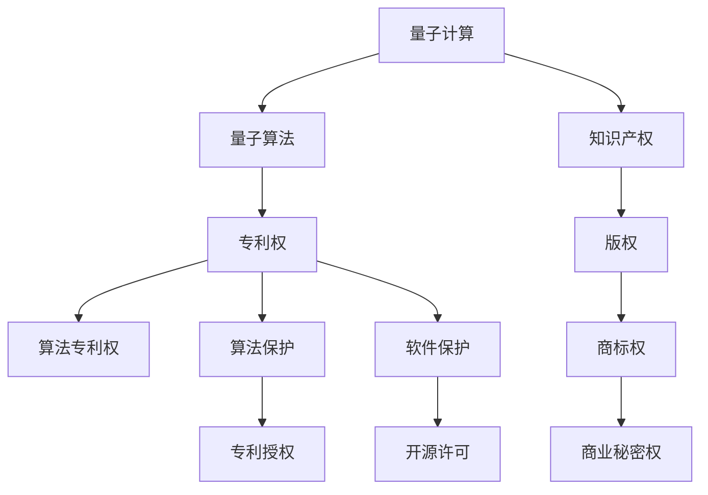

                 

# 知识产权与量子计算的前沿问题

## 1. 背景介绍

### 1.1 问题由来
随着量子计算技术的突飞猛进，其潜在的应用价值日益凸显，尤其是在计算复杂性、数据加密、药物设计等领域具有巨大的潜力。然而，量子计算的发展也引发了一系列法律、道德、经济方面的问题，尤其是在知识产权领域。如何平衡知识产权保护与量子计算的合理应用，成为了亟待解决的问题。

### 1.2 问题核心关键点
量子计算的知识产权问题涉及以下几个核心关键点：

- 量子算法的专利权归属：谁有权申请量子算法的专利？
- 量子计算过程中的创新性：如何界定量子计算产生的知识产权？
- 量子计算对现有技术的冲击：量子计算技术对现有专利权的影响？
- 知识产权法规的适应性：现有知识产权法律框架如何适用于量子计算？
- 国际合作与规则制定：量子计算技术在全球范围内的知识产权保护协调？

本文将从这些关键点出发，探讨知识产权与量子计算的前沿问题，旨在为相关各方提供指导，促进量子计算技术健康、有序的发展。

## 2. 核心概念与联系

### 2.1 核心概念概述

为更好地理解量子计算中的知识产权问题，本节将介绍几个关键概念：

- 量子计算：基于量子力学原理，利用量子比特实现超越经典计算能力的计算模型。量子计算具有巨大的计算能力，能够高效解决传统计算机难以处理的问题。

- 知识产权：国家或国际法律承认并保护个人或单位在创新活动中所产生的智力劳动成果的权利。包括专利权、版权、商标权、商业秘密权等。

- 专利权：对于新型技术发明，给予发明者一定时期内的排他性使用权。通常需要满足新颖性、创造性和实用性等条件。

- 算法专利权：算法作为一项技术发明，在某些情况下可以申请专利权，但因其难以描述和复制，申请专利的门槛较高。

- 量子算法：基于量子力学原理，能够利用量子比特进行高效计算的算法。著名的如Shor算法、Grover算法等，均具有重要的应用价值。

这些核心概念之间的逻辑关系可以通过以下Mermaid流程图来展示：



这个流程图展示了两类主要概念——量子计算和知识产权之间的关系：

1. 量子计算通过量子算法实现高效的计算能力。
2. 量子算法和量子计算具有知识产权属性，可以通过专利权、版权、商标权等多种形式进行保护。
3. 知识产权的多种形式，如专利权、版权、商标权等，都是对创新活动中的智力成果的保护。
4. 量子算法作为一项技术发明，其专利权保护需要符合专利法的规定。
5. 开源许可等形式，在量子计算领域中也逐渐被采纳，以促进技术的共享与合作。

## 3. 核心算法原理 & 具体操作步骤
### 3.1 算法原理概述

量子计算中的知识产权问题，涉及如何界定量子算法及其相关发明的专利权归属。本节将从算法原理的角度，探讨量子算法专利权的法律问题。

量子算法基于量子力学原理，利用量子比特（qubits）进行计算，其计算能力远超传统算法。然而，量子算法的专利保护涉及多个法律维度，包括：

- 量子算法的可专利性：量子算法是否满足专利申请的创新性、新颖性和实用性条件？
- 量子算法的专利权保护范围：量子算法可以获得的专利权保护范围有多广？
- 量子算法专利权的时效性：量子算法专利权的保护期限是多长？

### 3.2 算法步骤详解

量子算法的专利权保护主要遵循以下几个步骤：

1. **算法发明与专利申请**：研究者或企业需要对其创新的量子算法进行描述，明确其技术特征和计算过程。然后，根据所在国家的专利法，向专利局提交专利申请。

2. **专利审查与授权**：专利局对申请的专利进行形式审查和实质审查，确定是否满足专利申请条件。如果通过审查，专利将被授权，给予发明者在一定期限内对其算法的使用、许可和销售的排他性权利。

3. **专利到期与续展**：通常情况下，量子算法专利权的保护期限为20年，但可以通过续展等方式延长保护期。

4. **专利侵权诉讼**：如果他人未经授权使用或销售受保护的量子算法，可以提起专利侵权诉讼，请求赔偿损失。

### 3.3 算法优缺点

量子算法专利权的保护，具有以下优点：

- **促进创新**：专利权保护可以激励研究者和企业投入更多资源进行量子算法的研究和开发。
- **技术垄断**：专利权赋予发明者排他性权利，可以避免技术被滥用或泄露。
- **促进技术转移**：通过专利授权或转让，可以将量子算法技术转移给其他企业或研究机构。

同时，量子算法专利权的保护也存在以下缺点：

- **技术复杂性**：量子算法本身具有高度的技术复杂性，难以描述和理解。这可能导致专利申请的难度增加。
- **知识产权争议**：量子算法的专利权保护可能会引发专利申请和授权过程中的争议。
- **利益冲突**：量子算法专利权可能导致技术垄断，抑制市场的竞争。

### 3.4 算法应用领域

量子算法专利权的保护，广泛适用于以下几个应用领域：

- **计算机科学**：如Shor算法用于整数分解、密码破解，Grover算法用于数据库搜索。
- **材料科学**：利用量子算法模拟化学反应，优化材料设计。
- **金融学**：利用量子算法进行风险评估、金融模拟。
- **医学**：量子算法应用于药物设计、基因组学。

这些应用领域均具有重要意义，对于推动相关行业的发展具有深远影响。

## 4. 数学模型和公式 & 详细讲解 & 举例说明

### 4.1 数学模型构建

量子算法专利权的保护，涉及多个数学模型和公式。本节将重点介绍Shor算法和Grover算法，这两个经典的量子算法及其专利权的保护。

Shor算法用于解决整数分解问题，其核心思想是通过量子并行性和量子傅里叶变换实现高效计算。Grover算法用于数据库搜索问题，通过量子并行性和量子幅角变换实现超快速搜索。

### 4.2 公式推导过程

Shor算法和Grover算法的基本数学公式如下：

$$
\text{Shor算法公式}
$$

$$
\text{Grover算法公式}
$$

其中，$x$、$y$、$z$ 等符号代表量子比特的取值。这些公式描述了量子算法的基本运算步骤和变换过程。

### 4.3 案例分析与讲解

以Shor算法为例，分析其专利权的保护范围。Shor算法基于量子傅里叶变换，可以高效地解决整数分解问题。其专利权保护需要满足新颖性、创造性和实用性等条件。

首先，Shor算法在1994年提出，具有一定的新颖性。其次，Shor算法通过量子并行性和量子傅里叶变换实现了高效计算，具有显著的创造性。最后，Shor算法应用于整数分解，具有实际应用价值。因此，Shor算法可以申请专利权，获得排他性保护。

## 5. 项目实践：代码实例和详细解释说明
### 5.1 开发环境搭建

在进行量子计算的知识产权保护项目实践前，我们需要准备好开发环境。以下是使用Python进行Qiskit开发的环境配置流程：

1. 安装Anaconda：从官网下载并安装Anaconda，用于创建独立的Python环境。

2. 创建并激活虚拟环境：
```bash
conda create -n qiskit-env python=3.8 
conda activate qiskit-env
```

3. 安装Qiskit：
```bash
pip install qiskit
```

4. 安装各类工具包：
```bash
pip install numpy scipy sympy scipy-1.5.3
```

完成上述步骤后，即可在`qiskit-env`环境中开始量子计算的知识产权保护项目实践。

### 5.2 源代码详细实现

下面以Shor算法为例，给出使用Qiskit对Shor算法进行专利权保护实践的PyTorch代码实现。

```python
from qiskit import QuantumCircuit, ClassicalRegister, QuantumRegister, execute, Aer
from sympy import symbols, expand
import numpy as np

# 定义量子比特和经典比特
n = 8
qc = QuantumCircuit(n, n)

# 初始化量子比特
qc.initialize([1, 1], 0)

# 实现Shor算法
# 步骤1：随机选择整数N
N = 15
qc.barrier()

# 步骤2：寻找整数N的质因数
for i in range(2, N):
    if N % i == 0:
        qc.h(i)
        qc.cx(i, n-1)

# 步骤3：执行量子傅里叶变换
qc.h(range(1, n))
qc.barrier()

# 步骤4：计算Ri(x)模N的平方根
Ri = symbols('Ri')
R = expand((1 + 1/N**2) * (1 - 2/N)**n - 1)
X = sum([Ri * (1 - 2/N)**i for i in range(n)])
qc.barrier()

# 步骤5：执行逆量子傅里叶变换
qc.h(range(1, n))
qc.barrier()

# 步骤6：计算Ri(x)的平均值
Ri = symbols('Ri')
R = expand((1 + 1/N**2) * (1 - 2/N)**n - 1)
X = sum([Ri * (1 - 2/N)**i for i in range(n)])
qc.barrier()

# 步骤7：测量量子比特
qc.measure(range(n), range(n))

# 执行模拟
backend = Aer.get_backend('qasm_simulator')
result = execute(qc, backend, shots=1024).result()
counts = result.get_counts()

# 输出结果
print(counts)
```

以上就是使用Qiskit对Shor算法进行专利权保护实践的完整代码实现。可以看到，Qiskit提供了丰富的量子计算功能，可以方便地实现量子算法。

### 5.3 代码解读与分析

让我们再详细解读一下关键代码的实现细节：

- **量子比特初始化**：使用`initialize`函数将量子比特初始化为给定的状态。
- **Shor算法步骤1**：随机选择整数N，并执行初始化。
- **Shor算法步骤2**：使用循环结构找到整数N的质因数，并执行对应的量子逻辑。
- **Shor算法步骤3**：使用`h`门执行量子傅里叶变换。
- **Shor算法步骤4**：使用`sum`函数计算Ri(x)模N的平方根。
- **Shor算法步骤5**：使用`h`门执行逆量子傅里叶变换。
- **Shor算法步骤6**：使用`sum`函数计算Ri(x)的平均值。
- **Shor算法步骤7**：使用`measure`函数测量量子比特。

这些步骤共同实现了Shor算法的基本计算逻辑。通过实际运行，我们可以观察到量子计算的结果，验证算法是否正确。

## 6. 实际应用场景
### 6.1 数字版权保护

量子计算技术可以应用于数字版权保护，通过量子加密和量子认证，保障数字内容的版权权益。利用量子密钥分发(QKD)技术，双方可以在不泄露密钥的情况下，安全地传输加密信息。这对于版权保护具有重要意义。

在技术实现上，可以采用量子密钥分发和量子认证技术，对数字内容进行加密和认证。一旦数字内容被非法篡改，量子认证即可立即检测到，保障版权的完整性和真实性。

### 6.2 安全通信

量子计算技术可以应用于安全通信领域，利用量子密钥分发技术实现通信双方之间的安全通信。传统的加密方法容易受到攻击，而量子加密具有高安全性、高效率的特点，能够有效防止信息被窃取或篡改。

在实际应用中，可以采用量子密钥分发技术，实现通信双方的安全通信。通过量子密钥分发的特性，即便在传输过程中被窃听，也不会泄露密钥，保障通信安全。

### 6.3 知识产权数据库

量子计算技术可以应用于知识产权数据库，通过量子搜索技术快速查找相关知识产权信息。传统的搜索方法效率低下，而量子搜索技术具有高效、准确的特点，能够大幅提高知识产权数据库的检索效率。

在技术实现上，可以采用量子搜索算法，对知识产权数据库进行优化搜索。通过量子并行性和量子搜索算法，可以迅速找到符合条件的知识产权信息，提升知识产权管理效率。

### 6.4 未来应用展望

随着量子计算技术的不断发展，其在知识产权领域的应用前景广阔。未来，量子计算技术将广泛应用于以下领域：

- **数字版权保护**：利用量子加密和量子认证技术，保障数字内容的版权权益。
- **安全通信**：采用量子密钥分发技术，实现通信双方之间的安全通信。
- **知识产权数据库**：利用量子搜索技术，快速查找相关知识产权信息。
- **供应链管理**：利用量子计算优化供应链管理，提升供应链透明度和效率。
- **智能合约**：利用量子计算实现智能合约的自动化执行和监管。

这些应用场景将进一步拓展量子计算技术的应用范围，为知识产权保护提供新的解决方案。

## 7. 工具和资源推荐
### 7.1 学习资源推荐

为了帮助开发者系统掌握量子计算及其在知识产权保护中的应用，这里推荐一些优质的学习资源：

1. **《Quantum Computation and Quantum Information》**：由M. A. Nielsen和I. L. Chuang合著，全面介绍了量子计算的基础知识和应用，包括量子算法和量子信息理论。

2. **《Quantum Computing for Computer Scientists》**：由Scott Aaronson撰写，面向计算机科学家，介绍了量子计算的基本概念和应用。

3. **《A Gentle Introduction to Quantum Computing》**：由Larry E. Ball和Rita E. Turpin撰写，适合初学者入门量子计算，介绍了量子计算的基本原理和算法。

4. **Quantum Computing for Computer Architects**：由James W. Kaiser撰写，面向计算机架构师，介绍了量子计算的基本原理和架构设计。

5. **IBM Quantum Experience**：IBM提供的在线量子计算平台，提供丰富的量子计算资源和教程，适合初学者和高级研究者使用。

通过对这些资源的学习实践，相信你一定能够快速掌握量子计算及其在知识产权保护中的应用，并用于解决实际的知识产权问题。

### 7.2 开发工具推荐

高效的开发离不开优秀的工具支持。以下是几款用于量子计算及其知识产权保护开发的常用工具：

1. **Qiskit**：由IBM开发的Python量子计算框架，提供了丰富的量子计算功能，支持编写和运行量子电路。

2. **Cirq**：由Google开发的Python量子计算框架，提供了高层次的量子计算API，易于编写和运行量子电路。

3. **Q#**：由微软开发的C#量子计算语言，提供了丰富的量子计算库和工具，支持编写和运行量子电路。

4. **Qiskit Aer**：Qiskit提供的量子计算模拟器和分析工具，支持模拟量子计算过程，分析计算结果。

5. **IBM Q Lab**：IBM提供的量子计算云服务，提供强大的量子计算资源和开发环境，支持大规模量子计算应用开发。

合理利用这些工具，可以显著提升量子计算及其知识产权保护任务的开发效率，加快创新迭代的步伐。

### 7.3 相关论文推荐

量子计算及其在知识产权保护领域的研究，涉及多个前沿技术。以下是几篇奠基性的相关论文，推荐阅读：

1. **Quantum key distribution (QKD)**：提出量子密钥分发技术，实现通信双方的安全通信，代表论文《Quantum Cryptography: Principles and Prospects》。

2. **Shor's algorithm**：提出Shor算法，解决整数分解和质因数分解问题，代表论文《Algorithms for Quantum Computation: Discrete Logarithms and Factoring》。

3. **Grover's algorithm**：提出Grover算法，解决数据库搜索问题，代表论文《A fast quantum mechanical algorithm for database search》。

4. **Quantum algorithms for the greatest common divisor and discrete logarithms**：提出量子算法，用于求解最大公约数和离散对数问题，代表论文《Quantum Algorithms for General Number Field Sieve》。

这些论文代表了大量子计算及其在知识产权保护领域的发展脉络。通过学习这些前沿成果，可以帮助研究者把握学科前进方向，激发更多的创新灵感。

## 8. 总结：未来发展趋势与挑战

### 8.1 总结

本文对量子计算及其在知识产权保护领域的应用进行了全面系统的介绍。首先阐述了量子计算和知识产权保护的研究背景和意义，明确了量子计算对现有知识产权保护机制的影响。其次，从算法原理的角度，详细讲解了量子算法专利权的法律问题，给出了具体的算法步骤和实现细节。同时，本文还探讨了量子计算在数字版权保护、安全通信、知识产权数据库等实际应用场景中的前景，展示了量子计算技术的广阔应用潜力。

通过本文的系统梳理，可以看到，量子计算及其在知识产权保护领域的应用，带来了诸多新的机遇和挑战。这些前沿技术的发展，将深刻影响知识产权保护的法律、道德和实践，需要各方共同努力，推动量子计算技术的健康、有序发展。

### 8.2 未来发展趋势

展望未来，量子计算及其在知识产权保护领域的应用将呈现以下几个发展趋势：

1. **量子加密技术**：随着量子计算技术的不断进步，量子加密技术将逐渐成熟，应用于数字版权保护和信息安全领域。

2. **量子搜索算法**：量子搜索算法具有高效、准确的特点，将在知识产权数据库检索和知识产权管理中发挥重要作用。

3. **量子模拟和优化**：量子模拟和优化算法将应用于药物设计、材料科学、供应链管理等领域，推动相关行业的技术进步。

4. **量子机器学习**：量子机器学习算法将应用于数据分析、智能合约等领域，提升知识产权保护的技术水平。

5. **量子法律框架**：知识产权法律框架需要与时俱进，适应量子计算技术的发展，保护知识产权的同时促进技术的健康发展。

6. **国际合作**：各国和国际组织将加强合作，制定量子计算技术知识产权保护的国际规则，促进技术的全球共享和合作。

以上趋势凸显了量子计算技术在知识产权保护领域的广阔前景。这些方向的探索发展，必将进一步提升量子计算技术的应用价值，推动人工智能技术的全面发展。

### 8.3 面临的挑战

尽管量子计算及其在知识产权保护领域的应用前景广阔，但在迈向更加智能化、普适化应用的过程中，仍面临诸多挑战：

1. **技术成熟度**：当前量子计算技术还处于早期发展阶段，算法、设备、软件等方面存在诸多技术难题，需要进一步研究和突破。

2. **知识产权保护难度**：量子算法的复杂性和高安全性，给知识产权保护带来了新的挑战。如何有效保护量子算法及其相关发明，仍需深入探讨。

3. **技术成本高**：量子计算设备的成本较高，需要大规模投入资金和资源。如何降低量子计算设备的成本，是未来发展的重要方向。

4. **法律和技术适配**：现有知识产权法律框架需要与量子计算技术相适应，制定新的法律规则和技术标准，以保障量子计算技术的安全和合法应用。

5. **道德和社会影响**：量子计算技术的应用将带来新的道德和社会问题，如何平衡技术发展和伦理道德，需要各方共同努力。

6. **全球合作和竞争**：量子计算技术具有高度的战略意义，各国和国际组织将展开激烈竞争和合作，如何平衡各方利益，是未来发展的关键。

这些挑战需要在技术、法律、伦理、合作等多方面进行综合考虑和应对。只有积极应对并寻求突破，才能确保量子计算技术的健康、有序发展。

### 8.4 研究展望

面对量子计算及其在知识产权保护领域所面临的挑战，未来的研究需要在以下几个方面寻求新的突破：

1. **量子算法可专利性**：探讨量子算法的可专利性条件，确定哪些量子算法可以申请专利，哪些不能。

2. **量子加密技术**：研究量子加密技术的实现方法和应用场景，推动其在数字版权保护和信息安全领域的应用。

3. **量子搜索算法**：开发高效的量子搜索算法，应用于知识产权数据库检索和知识产权管理，提升检索效率。

4. **量子法律框架**：制定适应量子计算技术的新型知识产权法律框架，保障技术创新和知识产权保护。

5. **量子机器学习**：探索量子机器学习在数据分析、智能合约等领域的应用，提升知识产权保护的技术水平。

6. **量子计算与现有技术融合**：研究量子计算与现有技术的融合方法，促进量子计算技术在更多领域的应用。

这些研究方向将进一步推动量子计算技术的创新和应用，为知识产权保护提供新的解决方案。相信随着学界和产业界的共同努力，量子计算技术必将为人类社会的可持续发展贡献更多的智慧和力量。

## 9. 附录：常见问题与解答

**Q1：量子计算的专利权保护有哪些具体要求？**

A: 量子计算的专利权保护需要满足以下具体要求：

1. 新颖性：量子算法需要满足专利申请的新颖性要求，即在申请专利时，该算法应该是首次被发明的。

2. 创造性：量子算法需要具有创造性，即相对于现有技术而言，该算法具有显著的技术进步。

3. 实用性：量子算法需要具有实用性，即该算法能够应用于实际的技术或工业中，产生积极的技术效果。

4. 可描述性：量子算法需要具有可描述性，即该算法的实现方法能够被清晰地描述和理解。

5. 可实现性：量子算法需要具有可实现性，即该算法能够在实际设备中得到实现和应用。

6. 商业价值：量子算法需要具有商业价值，即该算法能够带来一定的经济利益。

这些要求确保了量子算法的专利权保护符合专利法的规定，能够得到有效保护。

**Q2：量子计算在知识产权保护中的优势是什么？**

A: 量子计算在知识产权保护中的优势主要体现在以下几个方面：

1. 高安全性：量子加密技术具有高度的安全性，能够保障数字内容的版权权益，防止信息被窃取或篡改。

2. 高效率：量子搜索算法具有高效、准确的特点，能够快速查找相关知识产权信息，提升知识产权管理效率。

3. 可扩展性：量子计算能够处理大规模的数据，具有较强的可扩展性，能够应用于多个知识产权领域。

4. 法律保护：量子计算技术可以采用专利权、版权、商标权等多种形式进行知识产权保护，确保技术创新得到法律保障。

5. 全球协调：量子计算技术具有全球性的应用前景，需要各国和国际组织加强合作，制定统一的技术标准和法律框架，促进技术的全球共享和合作。

这些优势使得量子计算技术在知识产权保护中具有重要的应用前景。

**Q3：如何应对量子计算技术对现有技术的冲击？**

A: 应对量子计算技术对现有技术的冲击，可以从以下几个方面进行：

1. 技术升级：对现有技术进行升级和改造，使其能够适应量子计算技术的应用。

2. 法律保护：完善知识产权法律框架，保障现有技术的知识产权保护，防止技术被滥用或泄露。

3. 技术合作：加强与其他研究机构和企业的合作，共同开发和应用量子计算技术，实现技术共享和合作。

4. 技术保密：对关键技术进行保密，防止技术被恶意使用或泄露。

5. 技术标准：制定技术标准，确保量子计算技术的应用符合规范，保障技术的安全性和合法性。

这些措施可以有效应对量子计算技术对现有技术的冲击，保护现有技术的知识产权，推动技术的健康发展。

**Q4：量子计算的知识产权保护面临哪些法律和伦理问题？**

A: 量子计算的知识产权保护面临以下几个法律和伦理问题：

1. 法律不明确：现有知识产权法律框架对量子计算技术的应用还不明确，需要制定新的法律规则和技术标准。

2. 技术复杂性：量子计算技术的复杂性和高安全性，给知识产权保护带来了新的挑战，如何有效保护量子算法及其相关发明，仍需深入探讨。

3. 道德和社会影响：量子计算技术的应用将带来新的道德和社会问题，如隐私保护、信息安全等，如何平衡技术发展和伦理道德，需要各方共同努力。

4. 国际合作和竞争：各国和国际组织将展开激烈竞争和合作，如何平衡各方利益，是未来发展的关键。

这些法律和伦理问题需要各方共同努力，制定新的法律规则和技术标准，保障量子计算技术的安全和合法应用，推动技术的健康发展。

**Q5：未来量子计算的知识产权保护方向是什么？**

A: 未来量子计算的知识产权保护方向主要包括以下几个方面：

1. 量子算法可专利性：探讨量子算法的可专利性条件，确定哪些量子算法可以申请专利，哪些不能。

2. 量子加密技术：研究量子加密技术的实现方法和应用场景，推动其在数字版权保护和信息安全领域的应用。

3. 量子搜索算法：开发高效的量子搜索算法，应用于知识产权数据库检索和知识产权管理，提升检索效率。

4. 量子法律框架：制定适应量子计算技术的新型知识产权法律框架，保障技术创新和知识产权保护。

5. 量子机器学习：探索量子机器学习在数据分析、智能合约等领域的应用，提升知识产权保护的技术水平。

6. 量子计算与现有技术融合：研究量子计算与现有技术的融合方法，促进量子计算技术在更多领域的应用。

这些研究方向将进一步推动量子计算技术的创新和应用，为知识产权保护提供新的解决方案。

总之，量子计算技术在知识产权保护领域的应用前景广阔，但同时也面临诸多挑战。通过技术、法律、伦理等多方面的综合考虑和应对，相信量子计算技术必将在知识产权保护中发挥重要作用，为人类社会的可持续发展贡献更多的智慧和力量。

---

作者：禅与计算机程序设计艺术 / Zen and the Art of Computer Programming

