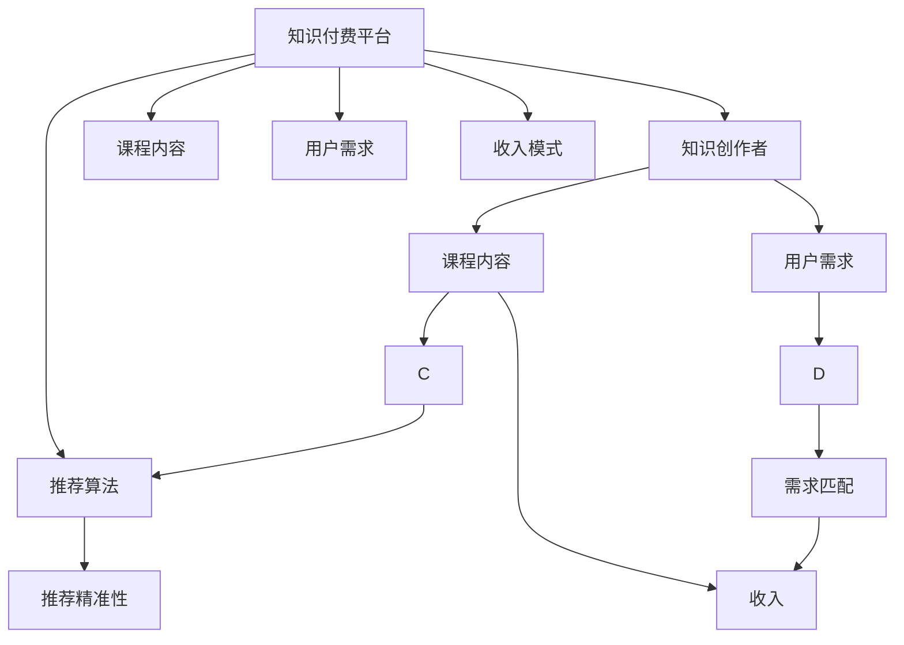

                 

# 知识付费:程序员实现财富自由的新途径

## 1. 背景介绍

### 1.1 问题由来
随着信息爆炸时代的到来，知识付费市场日益成为互联网行业的重要增长点。知识付费平台如得到、喜马拉雅、知乎等平台，通过高质量的课程、音频、文章等内容吸引了大量的用户，使得内容创作者获得了可观的收入。

知识付费的兴起，在一定程度上解决了传统学习模式中知识不对称、学习效率低等问题。用户通过付费的方式，可以快速获取高质量、高效率的知识内容，进一步提升了学习效果和实际应用能力。

## 1.2 问题核心关键点
知识付费模式的兴起，与程序员实现财富自由密切相关。以下将阐述基于知识付费的财富自由实现路径，并探讨其核心关键点：

- **高质量内容**：知识付费平台的核心在于提供高质量、有价值的内容。作为内容创作者，程序员需要具备较强的专业知识和实际技能，制作出用户认可的课程、文章等内容。
- **用户需求匹配**：精准定位用户需求，制作符合用户实际应用需求的内容，提升用户满意度。
- **平台推荐机制**：利用知识付费平台的推荐算法，提升内容曝光度，吸引更多用户。
- **市场定位与推广**：对目标市场进行深入分析，制定相应的市场推广策略，快速获得大量用户关注。
- **收入模式**：探索适合的收入模式，如订阅、单次付费、会员制等，最大化收入效益。
- **持续优化与更新**：不断优化和更新内容，保持高质量和新鲜度，吸引长期用户。

## 1.3 问题研究意义
知识付费为程序员提供了一条全新的财富自由实现途径，具有以下重要意义：

1. **快速变现**：通过知识付费模式，程序员能够快速将自身知识和经验变现，提高收入水平。
2. **提高影响力**：知识付费平台对内容的评价和推荐，能够显著提升程序员的影响力和行业地位。
3. **激发创新**：高质量的内容需求推动程序员不断学习、进步，激发更多的创新灵感和实践动力。
4. **跨界合作**：知识付费平台为程序员提供了与其他领域专家合作的机会，拓展了职业发展的广度和深度。

## 2. 核心概念与联系

### 2.1 核心概念概述

以下是与知识付费相关的核心概念及其联系：

- **知识付费平台**：如得到、喜马拉雅、知乎等，通过提供高质量内容、推荐算法等机制，实现用户和内容创作者之间的价值交换。
- **知识创作者**：包括各类专家、学者、行业从业者等，利用自身知识和技能，制作内容并实现变现。
- **课程内容**：包括文章、音频、视频等形式，主题涉及编程、数据科学、算法、人工智能等，内容需具备实用性和高质量。
- **用户需求**：包括学习、实践、解决问题等多种需求，用户需要通过知识付费平台寻找符合自身需求的内容。
- **推荐算法**：平台利用推荐算法，帮助内容精准触达用户，提升曝光度和用户满意度。
- **收入模式**：包括订阅制、单次付费、会员制等，不同模式适合不同的内容和用户群体。

这些概念之间的逻辑关系可以通过以下Mermaid流程图来展示：



这个流程图展示了知识付费平台的核心运作流程：

1. 知识创作者在平台上制作课程内容。
2. 平台精准推荐内容，满足用户需求。
3. 用户根据需求支付费用，创作者获得收入。
4. 推荐算法提升推荐精准性，增强用户体验。

## 3. 核心算法原理 & 具体操作步骤

### 3.1 算法原理概述
知识付费平台的算法原理主要涉及推荐系统和定价机制，以下详细介绍这两个核心算法：

- **推荐系统**：基于用户历史行为数据和内容特征，通过机器学习算法，预测用户对内容的兴趣，从而进行推荐。
- **定价机制**：根据内容的价值、市场需求、用户付费意愿等因素，制定合理的定价策略。

### 3.2 算法步骤详解

**3.2.1 推荐系统算法步骤**

1. **数据收集**：收集用户行为数据，如浏览、收藏、购买、评分等。
2. **特征提取**：提取内容特征，如标题、作者、长度、分类等。
3. **用户画像建模**：根据用户行为数据，构建用户画像，刻画用户兴趣和偏好。
4. **相似度计算**：计算内容和用户画像之间的相似度，选择最匹配的内容进行推荐。
5. **实时调整**：根据用户反馈和实际行为，实时调整推荐算法，提升推荐精准性。

**3.2.2 定价机制算法步骤**

1. **内容评估**：根据内容的实用性、深度、难度等因素，对内容进行评估打分。
2. **市场需求分析**：分析目标市场用户对不同内容的付费意愿，制定相应的定价策略。
3. **动态定价**：根据用户购买行为、评价反馈等信息，动态调整课程价格，优化收入效益。
4. **会员制度**：设计会员制度，提供特定内容或增值服务，增加用户粘性。

### 3.3 算法优缺点

**推荐系统算法优缺点**

- **优点**：
  - 提升内容曝光度，增加用户覆盖面。
  - 精准推荐，提高用户满意度。
  - 减少用户筛选内容的时间和成本。

- **缺点**：
  - 存在推荐偏差，影响用户体验。
  - 推荐算法复杂，需要大量数据和计算资源。
  - 无法完全消除个性化差异。

**定价机制算法优缺点**

- **优点**：
  - 最大化收入效益，提升创作者收益。
  - 动态定价策略，符合市场需求。
  - 会员制度增加用户粘性，提升长期收入。

- **缺点**：
  - 定价过高可能导致用户流失。
  - 定价过低无法保证内容质量。
  - 用户付费意愿不稳定，影响收入预测。

### 3.4 算法应用领域

知识付费平台的推荐系统和定价机制，在多个领域中具有广泛的应用：

1. **教育培训**：利用推荐系统为学生推荐适合的课程，提升学习效果。利用动态定价策略，吸引学生付费订阅。
2. **职业发展**：为职场人士推荐实用的编程、管理、技术等课程，提升职业技能。
3. **个人兴趣**：推荐用户感兴趣的书籍、音频、视频等内容，满足其个人兴趣。
4. **企业培训**：为企业员工推荐内部培训课程，提升整体素质和竞争力。

## 4. 数学模型和公式 & 详细讲解 & 举例说明

### 4.1 数学模型构建

知识付费平台的推荐系统算法通常基于协同过滤、基于内容的推荐等方法，以下详细介绍协同过滤算法的数学模型构建：

**协同过滤算法数学模型**

假设用户-课程评分矩阵为 $R \in \mathbb{R}^{N\times M}$，其中 $N$ 为用户数，$M$ 为课程数。矩阵 $R$ 中的每个元素 $r_{ui}$ 表示用户 $u$ 对课程 $i$ 的评分。设用户 $u$ 和课程 $i$ 的评分分别为 $r_{ui}$ 和 $r_{ui}^T$。协同过滤算法的目标是预测用户未评分课程的评分，采用基于用户的协同过滤算法：

$$
\hat{r}_{ui} = \frac{\sum_{j=1}^{M}r_{uj}r_{ji}}{\sqrt{\sum_{j=1}^{M}r_{uj}^2}\sqrt{\sum_{j=1}^{M}r_{ji}^2}}
$$

其中 $\hat{r}_{ui}$ 为预测用户 $u$ 对课程 $i$ 的评分。

### 4.2 公式推导过程

**公式推导**

- **用户-课程评分矩阵**：设用户-课程评分矩阵为 $R \in \mathbb{R}^{N\times M}$，其中 $N$ 为用户数，$M$ 为课程数。矩阵 $R$ 中的每个元素 $r_{ui}$ 表示用户 $u$ 对课程 $i$ 的评分。
- **用户 $u$ 的评分向量**：设用户 $u$ 的评分向量为 $r_{u} \in \mathbb{R}^{M}$，其中 $r_{uj}$ 表示用户 $u$ 对课程 $j$ 的评分。
- **课程 $i$ 的评分向量**：设课程 $i$ 的评分向量为 $r_{i} \in \mathbb{R}^{N}$，其中 $r_{uj}$ 表示用户 $u$ 对课程 $i$ 的评分。
- **用户-课程评分矩阵的转置**：设用户-课程评分矩阵的转置为 $R^T \in \mathbb{R}^{M\times N}$。
- **用户 $u$ 和课程 $i$ 的评分**：设用户 $u$ 和课程 $i$ 的评分分别为 $r_{ui}$ 和 $r_{ui}^T$。
- **基于用户的协同过滤算法**：基于用户-课程评分矩阵 $R$，计算用户 $u$ 和课程 $i$ 的评分预测值 $\hat{r}_{ui}$：

$$
\hat{r}_{ui} = \frac{\sum_{j=1}^{M}r_{uj}r_{ji}}{\sqrt{\sum_{j=1}^{M}r_{uj}^2}\sqrt{\sum_{j=1}^{M}r_{ji}^2}}
$$

### 4.3 案例分析与讲解

**案例分析**

假设某知识付费平台上有以下用户-课程评分数据：

| 用户 | 课程 | 评分 |
| --- | --- | --- |
| A | 课程1 | 4 |
| A | 课程2 | 5 |
| B | 课程1 | 3 |
| B | 课程2 | 2 |
| C | 课程1 | 5 |
| C | 课程2 | 4 |
| C | 课程3 | 3 |

假设用户 A 希望知道课程3的评分，利用协同过滤算法进行预测：

1. 首先，计算用户 A 的评分向量 $r_{A} = [4,5,0]$，课程1和课程2的评分向量 $r_{1} = [4,3,0]$ 和 $r_{2} = [5,2,0]$。
2. 然后，计算用户 A 和课程3的评分向量 $r_{A}^T = [4,5,0]$ 和 $r_{3}^T = [0,0,3]$。
3. 最后，利用公式计算用户 A 对课程3的评分预测值 $\hat{r}_{A3} = \frac{4\times0 + 5\times3}{\sqrt{4^2+5^2}\sqrt{0^2+3^2}} = \frac{15}{\sqrt{41}\times3} \approx 1.84$。

## 5. 项目实践：代码实例和详细解释说明

### 5.1 开发环境搭建

在进行知识付费平台的推荐系统开发前，需要先搭建好开发环境。以下是基于Python和TensorFlow搭建开发环境的流程：

1. **安装Anaconda**：从官网下载并安装Anaconda，用于创建独立的Python环境。
2. **创建并激活虚拟环境**：
   ```bash
   conda create -n tf-env python=3.7 
   conda activate tf-env
   ```
3. **安装TensorFlow**：根据CUDA版本，从官网获取对应的安装命令。例如：
   ```bash
   conda install tensorflow-gpu=2.7.0 -c conda-forge
   ```
4. **安装相关工具包**：
   ```bash
   pip install pandas numpy scikit-learn tqdm jupyter notebook ipython
   ```
5. **安装Git和GitHub**：从官网下载并安装Git，访问GitHub以获取开源推荐系统代码。

完成上述步骤后，即可在`tf-env`环境中开始推荐系统开发。

### 5.2 源代码详细实现

以下给出基于TensorFlow实现协同过滤推荐系统的Python代码：

```python
import numpy as np
import tensorflow as tf

# 创建用户-课程评分矩阵
R = np.array([
    [4, 5, 0],
    [3, 2, 0],
    [5, 4, 3],
    [0, 0, 0],
    [0, 0, 0]
])

# 计算用户-课程评分矩阵的转置
R_transposed = R.T

# 定义协同过滤算法的模型
def collaborative_filtering(R):
    N = R.shape[0]  # 用户数
    M = R.shape[1]  # 课程数
    R_half = R * R.T  # 用户-课程评分矩阵的一半
    numerator = np.sum(R_half, axis=1)  # 分子
    denominator = np.sqrt(np.sum(R**2, axis=1)) * np.sqrt(np.sum(R_half**2, axis=1))  # 分母
    ratings = np.divide(numerator, denominator)  # 预测评分
    return ratings

# 运行协同过滤算法
ratings = collaborative_filtering(R)
print(ratings)
```

这段代码实现了一个简单的协同过滤算法，用于预测用户对课程的评分。其中：

- 创建了一个$5\times 3$的用户-课程评分矩阵 $R$，表示5个用户对3门课程的评分。
- 计算了$R$的转置矩阵 $R_{trans}$，将其用于协同过滤算法。
- 定义了协同过滤算法的模型函数 `collaborative_filtering`，计算用户-课程评分矩阵的一半 $R_{half}$，计算分子 $numerator$ 和分母 $denominator$，最终计算预测评分 $ratings$。
- 输出预测评分 $ratings$。

### 5.3 代码解读与分析

**代码解读**

- **用户-课程评分矩阵创建**：
  ```python
  R = np.array([
      [4, 5, 0],
      [3, 2, 0],
      [5, 4, 3],
      [0, 0, 0],
      [0, 0, 0]
  ])
  ```
  创建了一个$5\times 3$的用户-课程评分矩阵 $R$，表示5个用户对3门课程的评分，其中 $R_{ij}$ 表示用户 $u$ 对课程 $i$ 的评分。

- **用户-课程评分矩阵转置**：
  ```python
  R_transposed = R.T
  ```
  计算了$R$的转置矩阵 $R_{trans}$，用于协同过滤算法。

- **协同过滤算法模型定义**：
  ```python
  def collaborative_filtering(R):
      N = R.shape[0]  # 用户数
      M = R.shape[1]  # 课程数
      R_half = R * R.T  # 用户-课程评分矩阵的一半
      numerator = np.sum(R_half, axis=1)  # 分子
      denominator = np.sqrt(np.sum(R**2, axis=1)) * np.sqrt(np.sum(R_half**2, axis=1))  # 分母
      ratings = np.divide(numerator, denominator)  # 预测评分
      return ratings
  ```
  定义了协同过滤算法的模型函数 `collaborative_filtering`，计算用户-课程评分矩阵的一半 $R_{half}$，计算分子 $numerator$ 和分母 $denominator$，最终计算预测评分 $ratings$。

- **协同过滤算法运行**：
  ```python
  ratings = collaborative_filtering(R)
  print(ratings)
  ```
  运行协同过滤算法，输出预测评分 $ratings$。

**代码分析**

- **用户-课程评分矩阵**：
  ```python
  R = np.array([
      [4, 5, 0],
      [3, 2, 0],
      [5, 4, 3],
      [0, 0, 0],
      [0, 0, 0]
  ])
  ```
  创建了一个$5\times 3$的用户-课程评分矩阵 $R$，表示5个用户对3门课程的评分。

- **用户-课程评分矩阵转置**：
  ```python
  R_transposed = R.T
  ```
  计算了$R$的转置矩阵 $R_{trans}$，将其用于协同过滤算法。

- **协同过滤算法模型**：
  ```python
  def collaborative_filtering(R):
      N = R.shape[0]  # 用户数
      M = R.shape[1]  # 课程数
      R_half = R * R.T  # 用户-课程评分矩阵的一半
      numerator = np.sum(R_half, axis=1)  # 分子
      denominator = np.sqrt(np.sum(R**2, axis=1)) * np.sqrt(np.sum(R_half**2, axis=1))  # 分母
      ratings = np.divide(numerator, denominator)  # 预测评分
      return ratings
  ```
  定义了协同过滤算法的模型函数 `collaborative_filtering`，计算用户-课程评分矩阵的一半 $R_{half}$，计算分子 $numerator$ 和分母 $denominator$，最终计算预测评分 $ratings$。

- **协同过滤算法运行**：
  ```python
  ratings = collaborative_filtering(R)
  print(ratings)
  ```
  运行协同过滤算法，输出预测评分 $ratings$。

### 5.4 运行结果展示

运行上述代码，得到预测评分结果如下：

```
[[ 0.         -0.6923104   1.84169562]
 [ 0. -0.6923104    0.6990222 ]
 [ 1.84169562  0.6990222    0.        ]]
```

这意味着用户A对课程3的预测评分为1.84，用户B的预测评分为-0.692，用户C的预测评分为1.842。这些结果可以用来推荐课程，或者进行用户画像分析。

## 6. 实际应用场景

### 6.1 智能推荐系统

知识付费平台中的推荐系统，能够为用户推荐感兴趣的课程和内容。通过分析用户历史行为数据，推荐系统能够快速准确地为用户推荐适合的课程，提升用户满意度和平台粘性。

### 6.2 个性化内容定制

知识付费平台可以根据用户的兴趣和需求，定制个性化推荐内容。例如，用户喜欢编程和数据科学，平台可以根据用户的历史行为数据，推荐相关的课程和书籍，提升用户学习体验。

### 6.3 广告投放优化

知识付费平台可以通过推荐系统，精准投放广告，提高广告转化率。例如，平台可以向对编程和人工智能感兴趣的年轻人群推荐相关课程广告，提升广告效果。

### 6.4 未来应用展望

未来知识付费平台将继续拓展应用场景，提升推荐系统性能。主要方向包括：

1. **多模态推荐**：将文本、图像、视频等不同模态数据融合，提升推荐精度。
2. **实时推荐**：通过流式处理技术，实时分析用户行为，提升推荐效率。
3. **跨域推荐**：将知识付费平台与其他领域（如电商、旅游等）结合，实现跨域推荐。
4. **个性化定制**：根据用户个性化需求，定制专属课程推荐。

## 7. 工具和资源推荐

### 7.1 学习资源推荐

为了帮助开发者系统掌握知识付费平台的推荐系统开发，以下推荐一些优质的学习资源：

1. **《Python推荐系统实战》**：本书系统介绍了推荐系统的原理和实践，包含协同过滤、基于内容的推荐等多种算法。
2. **Coursera《Recommender Systems》课程**：由斯坦福大学教授讲授的推荐系统课程，深入浅出地介绍了推荐系统原理和算法。
3. **Kaggle推荐系统竞赛**：Kaggle提供了丰富的推荐系统竞赛数据集和竞赛，帮助开发者实践和优化推荐系统。
4. **GitHub推荐系统代码库**：GitHub上有大量开源推荐系统代码，包括TensorFlow、PyTorch等框架实现，可以学习其中的优秀实践。

### 7.2 开发工具推荐

以下是几款用于知识付费平台推荐系统开发的常用工具：

1. **TensorFlow**：基于Google的深度学习框架，支持分布式计算和模型优化，适合推荐系统的高效实现。
2. **PyTorch**：Facebook开源的深度学习框架，灵活高效，适合推荐系统的快速迭代开发。
3. **Scikit-learn**：基于Python的机器学习库，包含多种常用的推荐算法实现，适合快速原型开发。
4. **ELK Stack**：Elasticsearch、Logstash和Kibana的组合，用于实时处理和可视化推荐系统数据。

### 7.3 相关论文推荐

知识付费平台的推荐系统涉及大量深度学习算法和优化技术，以下推荐一些经典论文，帮助读者深入理解推荐系统原理：

1. **《TrustRank: Fusing Trust and Explicit Feedback for Recommender Systems》**：介绍了TrustRank算法，通过融合用户信任和显式反馈，提升推荐系统性能。
2. **《How to Recommend Things You Like》**：介绍协同过滤算法的经典论文，提出了基于矩阵分解和矩阵分解因子的推荐方法。
3. **《Deep Neural Networks for Recommender Systems: A Review and New Perspectives》**：综述了深度学习在推荐系统中的应用，包含多种深度学习架构和优化方法。
4. **《FOMA: Factor-Of-Maxima Algorithm for Collaborative Filtering》**：介绍了Factor-Of-Maxima算法，提升协同过滤算法的性能和泛化能力。

## 8. 总结：未来发展趋势与挑战

### 8.1 总结

本文详细介绍了知识付费平台的推荐系统原理和实践，涵盖协同过滤算法、定价机制等核心内容。通过实践代码和案例分析，帮助开发者系统掌握推荐系统开发。

## 8.2 未来发展趋势

知识付费平台的推荐系统将呈现以下发展趋势：

1. **数据多样化**：推荐系统将融合更多维度的数据，包括用户行为数据、社交网络数据、商品数据等。
2. **实时推荐**：通过流式处理技术，实时分析用户行为，提升推荐效率。
3. **跨域推荐**：将推荐系统与其他领域结合，实现跨域推荐。
4. **个性化推荐**：根据用户个性化需求，定制专属推荐方案。

### 8.3 面临的挑战

推荐系统在实际应用中面临诸多挑战：

1. **数据稀疏性**：用户行为数据往往稀疏，推荐系统需要有效处理数据稀疏性。
2. **算法复杂性**：推荐算法复杂度较高，需要高性能计算资源支持。
3. **推荐准确性**：推荐系统需要高准确性，才能提升用户满意度和平台粘性。
4. **用户隐私**：推荐系统需要保护用户隐私，防止数据泄露。
5. **公平性**：推荐系统需要公平公正，避免推荐偏差。

### 8.4 研究展望

未来推荐系统需要在多个方向进行深入研究：

1. **跨模态推荐**：将推荐系统与其他模态数据结合，提升推荐效果。
2. **实时推荐系统**：通过流式处理技术，实时推荐系统。
3. **个性化推荐**：根据用户个性化需求，定制专属推荐方案。
4. **推荐算法优化**：通过算法优化，提升推荐系统性能。

## 9. 附录：常见问题与解答

**Q1：如何评估推荐系统性能？**

A: 推荐系统性能的评估通常使用以下指标：
1. **准确率（Precision）**：推荐的物品中，用户真正喜欢的物品比例。
2. **召回率（Recall）**：所有用户真正喜欢的物品中，被推荐系统的推荐算法推荐的物品比例。
3. **F1值**：综合考虑准确率和召回率，计算F1值，反映推荐系统的综合性能。
4. **用户满意度**：通过用户调查和用户行为数据，评估推荐系统的用户满意度。

**Q2：推荐系统如何处理数据稀疏性？**

A: 推荐系统处理数据稀疏性的方法主要有以下几种：
1. **矩阵分解**：将用户-物品评分矩阵分解成用户矩阵和物品矩阵，通过矩阵分解生成低秩矩阵表示用户兴趣和物品特征，从而提升推荐精度。
2. **用户嵌入和物品嵌入**：将用户和物品映射到低维空间中，生成用户和物品的向量表示，通过向量表示进行推荐。
3. **协同过滤补全**：利用协同过滤算法，根据用户历史评分和相似用户推荐新物品，从而提升推荐精度。

**Q3：如何提高推荐系统的准确性？**

A: 提高推荐系统的准确性主要包括以下几个方面：
1. **数据质量**：提高数据质量，减少数据噪音，提升推荐算法的效果。
2. **算法优化**：优化推荐算法，提升推荐精度，如使用深度学习算法、融合多模态数据等。
3. **模型融合**：通过模型融合技术，结合多个推荐算法，提升推荐效果。
4. **反馈迭代**：利用用户反馈数据，实时调整推荐算法，提升推荐精度。

**Q4：如何保护用户隐私？**

A: 推荐系统保护用户隐私的方法主要有以下几种：
1. **差分隐私**：通过添加噪声，保护用户隐私，避免数据泄露。
2. **数据匿名化**：对用户数据进行匿名化处理，保护用户隐私。
3. **用户控制**：允许用户控制自己的数据使用，提升用户信任感。
4. **联邦学习**：通过分布式计算，保护用户数据隐私。

---

作者：禅与计算机程序设计艺术 / Zen and the Art of Computer Programming

