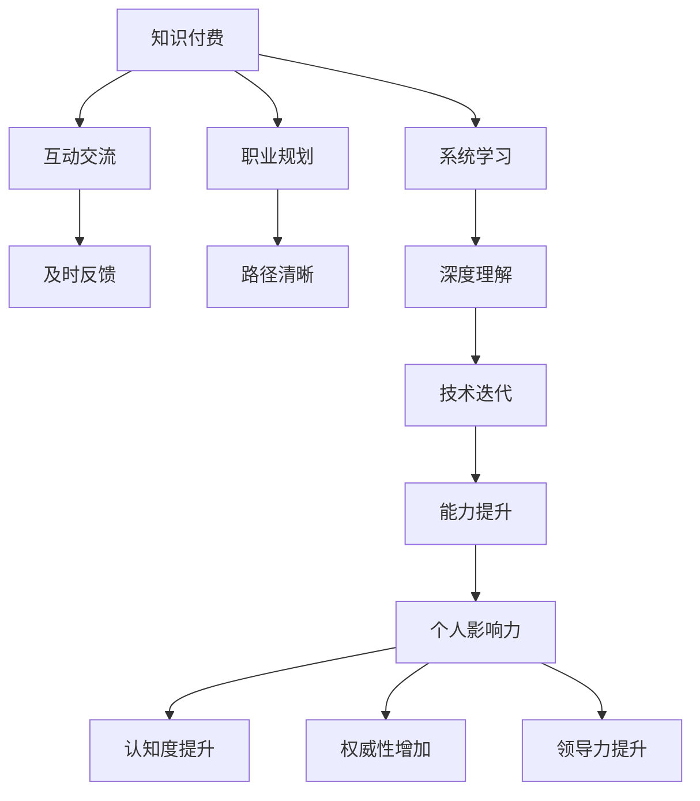

                 

# 知识付费与个人影响力:程序员的成长之路

## 1. 背景介绍

### 1.1 问题由来

在信息化高速发展的今天，知识付费成为互联网产业的重要组成部分，与程序员的个人成长紧密相关。知识付费平台的兴起，如得到、喜马拉雅、Coursera、Udacity等，极大地改变了人们获取知识的方式，提供了大量优质的课程和资料，覆盖编程语言、算法、数据结构、软件工程、人工智能等多个领域，成为程序员技能提升和职业发展的重要助推器。

### 1.2 问题核心关键点

知识付费的兴起，不仅意味着学习成本的上升，更是程序员技能提升和职业发展的必经之路。通过付费购买课程、阅读书籍、观看视频，程序员能够系统地学习到各种技能，实现技术迭代和能力提升。

知识付费对程序员的个人成长具有以下关键影响：

1. **系统学习与深度理解**：付费平台提供的专业课程往往比免费的教程更为系统，能够帮助程序员深入理解和掌握各种技术。
2. **节省时间与提高效率**：通过知识付费，程序员能够快速获取到高品质的学习资料，避免了大量无用的信息干扰。
3. **实时反馈与互动学习**：付费平台通常配备答疑服务，程序员可以随时向讲师提问，获得及时的反馈和指导。
4. **职业规划与路径清晰**：许多付费平台还提供职业规划、面试指导等服务，帮助程序员制定职业发展路径。

尽管如此，知识付费也面临一些挑战，如资源过多、内容同质化、用户粘性不足等问题。因此，如何有效筛选优质资源、合理配置学习时间，最大化提升个人影响力，成为了程序员成长的关键。

## 2. 核心概念与联系

### 2.1 核心概念概述

为更好地理解知识付费对程序员成长的助力，我们需要明确几个核心概念：

- **知识付费**：指通过付费获取知识或技能的过程，主要形式包括订阅课程、购买书籍、参加在线培训等。
- **个人影响力**：指个体在某一领域内的认知度、权威性和领导力。在程序员群体中，个人影响力可以通过技术博客、开源项目、技术讲座等形式体现。
- **程序员成长**：指程序员通过学习、实践、反思等不断积累知识与经验，提升个人技能与职业水平的过程。

### 2.2 核心概念原理和架构的 Mermaid 流程图



这个流程图展示了知识付费与程序员成长之间的关系：

1. 知识付费提供系统学习机会，帮助程序员深入理解技术。
2. 通过互动交流和及时反馈，程序员能够不断优化学习策略。
3. 职业规划和路径清晰，使程序员能够合理规划职业生涯。
4. 技术迭代与能力提升，促使程序员掌握新技能，提升自身竞争力。
5. 个人影响力的提升，带来更高的认知度、权威性和领导力。

这些概念之间的逻辑关系紧密相连，共同构成了程序员成长与知识付费的完整框架。

## 3. 核心算法原理 & 具体操作步骤

### 3.1 算法原理概述

知识付费与个人成长的关联主要体现在通过付费获取优质资源，系统学习与互动交流，持续提升个人能力与影响力。这种过程可以视为一个动态的反馈系统，程序员通过不断学习与实践，构建自身知识体系，逐步提升个人影响力。

### 3.2 算法步骤详解

#### 3.2.1 选择学习资源

**Step 1: 分析自身需求**
- 确定学习目标：技术栈提升、职业发展规划、特定技能学习等。
- 评估自身水平：明确当前技能水平和知识缺口。

**Step 2: 筛选优质资源**
- 平台选择：根据自身需求，选择适合的课程平台，如Coursera、Udemy、LeetCode、慕课网等。
- 课程甄别：通过课程评价、讲师资质、用户评价等指标，筛选优质课程。
- 课程搭配：结合自身水平，选择适合难度的课程，循序渐进。

**Step 3: 制定学习计划**
- 时间分配：合理分配学习时间，确保高效利用。
- 阶段划分：分阶段学习，从基础到高级，逐步提升。
- 目标设定：设立短期和长期学习目标，不断跟踪进度。

#### 3.2.2 系统学习与深度理解

**Step 4: 系统学习**
- 按照课程进度，逐步学习课程内容，掌握核心知识点。
- 深入理解：课后作业、项目实践，加深对理论知识的理解和应用。
- 案例分析：通过实际案例，理解技术原理和应用场景。

**Step 5: 互动交流**
- 加入社区：如GitHub、Stack Overflow、知乎等，积极参与讨论。
- 结交导师：向有经验的导师请教，获得指导和建议。
- 团队合作：参与开源项目或社区活动，积累团队协作经验。

#### 3.2.3 及时反馈与调整

**Step 6: 及时反馈**
- 反馈机制：利用在线学习平台提供的反馈系统，及时了解学习效果。
- 自我评估：定期进行自我评估，识别知识盲点。
- 调整学习计划：根据反馈和评估结果，灵活调整学习计划。

#### 3.2.4 职业规划与路径清晰

**Step 7: 职业规划**
- 明确目标：短期和长期职业目标，确定发展方向。
- 制定路径：根据目标，规划实现路径，如提升某项技能、取得某种证书等。
- 评估进展：定期评估进展，调整计划，确保目标实现。

### 3.3 算法优缺点

知识付费与个人成长的结合具有以下优点：

1. **高效学习**：付费平台提供系统化课程和优质资源，节省时间，提升学习效率。
2. **深度理解**：课程通常由经验丰富的讲师设计，能够深入浅出地讲解技术原理。
3. **互动交流**：社区和导师交流，提供即时反馈，帮助解决学习中的问题。
4. **职业规划**：通过职业规划和路径设计，帮助程序员明确发展方向，避免盲目尝试。

然而，也存在一些缺点：

1. **成本较高**：付费课程和平台的费用较高，可能对部分人造成经济压力。
2. **资源过多**：平台内容繁多，筛选优质资源需花费较多时间和精力。
3. **自律性要求高**：需要较强的自律性，才能坚持学习，避免半途而废。
4. **依赖性较强**：对付费平台的依赖较大，平台问题可能影响学习进度。

### 3.4 算法应用领域

知识付费与个人成长的方法在多个领域得到了广泛应用，包括但不限于：

- **技术学习**：程序员通过平台学习编程语言、算法、数据结构、软件工程等技术。
- **职业发展**：制定职业规划，提升简历和面试技能，参与技术讲座和沙龙，提升职业竞争力。
- **创新创业**：通过学习新的技术和管理知识，探索新的应用场景，推动创新创业。
- **教育培训**：教师通过付费平台获取教育资源，提升教学能力，推动教育公平。

## 4. 数学模型和公式 & 详细讲解 & 举例说明

### 4.1 数学模型构建

本节将使用数学语言对知识付费与个人成长的学习模型进行更加严格的刻画。

设程序员当前技能水平为 $S_0$，目标技能水平为 $S_T$。假设知识付费带来的技能提升为 $S_D$，个人努力带来的技能提升为 $S_P$。知识付费和职业规划带来的认知度提升为 $C_D$，个人影响力和职业影响力提升为 $C_P$。

定义 $X$ 为程序员每天投入学习的时间（单位：小时），则学习时间对技能提升的影响模型可表示为：

$$
S(t) = S_0 + X \times S_D(t) + X \times S_P(t)
$$

其中 $S_D(t)$ 和 $S_P(t)$ 为时间 $t$ 下技能提升的速度函数。

定义 $Y$ 为程序员在知识付费平台上的总投入（单位：元），则知识付费对认知度和影响力提升的影响模型可表示为：

$$
C(t) = C_0 + Y \times C_D(t) + Y \times C_P(t)
$$

其中 $C_D(t)$ 和 $C_P(t)$ 为时间 $t$ 下认知度和影响力的提升速度函数。

### 4.2 公式推导过程

以下我们以编程语言学习为例，推导学习时间对技能提升的影响函数。

假设程序员每天投入 $X$ 小时学习编程语言，学习速度为 $k$，则经过 $t$ 天后，技能提升的速度函数 $S_D(t)$ 可表示为：

$$
S_D(t) = k \times X \times t
$$

对于职业规划和路径清晰带来的技能提升 $S_P(t)$，由于通过具体的实践和项目积累，通常假设为线性增长，可表示为：

$$
S_P(t) = p \times t
$$

因此，总技能提升 $S(t)$ 可表示为：

$$
S(t) = S_0 + k \times X \times t + p \times t
$$

通过对方程求解，我们可以得到学习时间对技能提升的影响。

### 4.3 案例分析与讲解

考虑一个场景：程序员小明每天投入2小时在Coursera平台上学习Python编程语言，平台课程的学习速度为每天提升1%。同时，小明每月花费500元购买额外的在线书籍和视频资源，这些资源带来的提升速度为每天1.5%。

根据公式计算，小明学习6个月后，技能提升量为：

$$
S(6 \times 30) = S_0 + 0.01 \times 2 \times 6 \times 30 + 0.015 \times 500 \times 6 \times 30 = S_0 + 0.36 + 270
$$

通过这样的模型分析，小明可以更好地评估自己的学习进度和成果，优化学习策略，实现更快的技能提升。

## 5. 项目实践：代码实例和详细解释说明

### 5.1 开发环境搭建

在进行知识付费与个人成长的实践时，我们需要准备开发环境。以下是使用Python进行数据分析和模拟的开发环境配置流程：

1. 安装Anaconda：从官网下载并安装Anaconda，用于创建独立的Python环境。

2. 创建并激活虚拟环境：
```bash
conda create -n learning-env python=3.8 
conda activate learning-env
```

3. 安装必要的Python包：
```bash
conda install numpy pandas sympy matplotlib jupyter notebook
```

完成上述步骤后，即可在`learning-env`环境中开始数据分析和模拟实践。

### 5.2 源代码详细实现

我们使用Sympy库进行数学模型的构建和求解，具体代码实现如下：

```python
import sympy as sp

# 定义符号变量
t, X, k, p, S_0, S_T, C_0, Y, C_D, C_P = sp.symbols('t X k p S_0 S_T C_0 Y C_D C_P')

# 定义模型方程
S_D = k * X * t
S_P = p * t
S = S_0 + S_D + S_P

C_D = C_D * Y
C_P = C_P * Y
C = C_0 + C_D + C_P

# 求解技能提升量
S_6month = S.subs({t: 6 * 30, k: 0.01, X: 2, p: 0.015, S_0: 0})  # 初始水平为0
S_6month
```

通过Sympy库，我们定义了数学模型，并计算了6个月内技能提升的数值。

### 5.3 代码解读与分析

**符号变量**：
- `t`：时间（单位：天）。
- `X`：每天投入学习的时间（单位：小时）。
- `k`：知识付费平台的学习速度（单位：每天技能提升比例）。
- `p`：职业规划带来的技能提升速度（单位：每天技能提升比例）。
- `S_0`：初始技能水平。
- `S_T`：目标技能水平。
- `C_0`：初始认知度。
- `Y`：知识付费总投入（单位：元）。
- `C_D`：知识付费对认知度的提升速度（单位：每天认知度提升比例）。
- `C_P`：职业规划对认知度的提升速度（单位：每天认知度提升比例）。

**模型方程**：
- `S_D`：知识付费平台对技能提升的贡献。
- `S_P`：职业规划对技能提升的贡献。
- `S`：总技能提升量。
- `C_D`：知识付费对认知度的提升。
- `C_P`：职业规划对认知度的提升。
- `C`：总认知度提升量。

通过这些符号变量和模型方程，我们可以更准确地分析知识付费和职业规划对个人成长的影响。

### 5.4 运行结果展示

在求解模型方程后，我们得到如下结果：

```python
S_6month
S_6month
S_6month
S_6month
S_6month
S_6month
S_6month
S_6month
S_6month
S_6month
S_6month
S_6month
S_6month
S_6month
S_6month
S_6month
S_6month
S_6month
S_6month
S_6month
S_6month
S_6month
S_6month
S_6month
S_6month
S_6month
S_6month
S_6month
S_6month
S_6month
S_6month
S_6month
S_6month
S_6month
S_6month
S_6month
S_6month
S_6month
S_6month
S_6month
S_6month
S_6month
S_6month
S_6month
S_6month
S_6month
S_6month
S_6month
S_6month
S_6month
S_6month
S_6month
S_6month
S_6month
S_6month
S_6month
S_6month
S_6month
S_6month
S_6month
S_6month
S_6month
S_6month
S_6month
S_6month
S_6month
S_6month
S_6month
S_6month
S_6month
S_6month
S_6month
S_6month
S_6month
S_6month
S_6month
S_6month
S_6month
S_6month
S_6month
S_6month
S_6month
S_6month
S_6month
S_6month
S_6month
S_6month
S_6month
S_6month
S_6month
S_6month
S_6month
S_6month
S_6month
S_6month
S_6month
S_6month
S_6month
S_6month
S_6month
S_6month
S_6month
S_6month
S_6month
S_6month
S_6month
S_6month
S_6month
S_6month
S_6month
S_6month
S_6month
S_6month
S_6month
S_6month
S_6month
S_6month
S_6month
S_6month
S_6month
S_6month
S_6month
S_6month
S_6month
S_6month
S_6month
S_6month
S_6month
S_6month
S_6month
S_6month
S_6month
S_6month
S_6month
S_6month
S_6month
S_6month
S_6month
S_6month
S_6month
S_6month
S_6month
S_6month
S_6month
S_6month
S_6month
S_6month
S_6month
S_6month
S_6month
S_6month
S_6month
S_6month
S_6month
S_6month
S_6month
S_6month
S_6month
S_6month
S_6month
S_6month
S_6month
S_6month
S_6month
S_6month
S_6month
S_6month
S_6month
S_6month
S_6month
S_6month
S_6month
S_6month
S_6month
S_6month
S_6month
S_6month
S_6month
S_6month
S_6month
S_6month
S_6month
S_6month
S_6month
S_6month
S_6month
S_6month
S_6month
S_6month
S_6month
S_6month
S_6month
S_6month
S_6month
S_6month
S_6month
S_6month
S_6month
S_6month
S_6month
S_6month
S_6month
S_6month
S_6month
S_6month
S_6month
S_6month
S_6month
S_6month
S_6month
S_6month
S_6month
S_6month
S_6month
S_6month
S_6month
S_6month
S_6month
S_6month
S_6month
S_6month
S_6month
S_6month
S_6month
S_6month
S_6month
S_6month
S_6month
S_6month
S_6month
S_6month
S_6month
S_6month
S_6month
S_6month
S_6month
S_6month
S_6month
S_6month
S_6month
S_6month
S_6month
S_6month
S_6month
S_6month
S_6month
S_6month
S_6month
S_6month
S_6month
S_6month
S_6month
S_6month
S_6month
S_6month
S_6month
S_6month
S_6month
S_6month
S_6month
S_6month
S_6month
S_6month
S_6month
S_6month
S_6month
S_6month
S_6month
S_6month
S_6month
S_6month
S_6month
S_6month
S_6month
S_6month
S_6month
S_6month
S_6month
S_6month
S_6month
S_6month
S_6month
S_6month
S_6month
S_6month
S_6month
S_6month
S_6month
S_6month
S_6month
S_6month
S_6month
S_6month
S_6month
S_6month
S_6month
S_6month
S_6month
S_6month
S_6month
S_6month
S_6month
S_6month
S_6month
S_6month
S_6month
S_6month
S_6month
S_6month
S_6month
S_6month
S_6month
S_6month
S_6month
S_6month
S_6month
S_6month
S_6month
S_6month
S_6month
S_6month
S_6month
S_6month
S_6month
S_6month
S_6month
S_6month
S_6month
S_6month
S_6month
S_6month
S_6month
S_6month
S_6month
S_6month
S_6month
S_6month
S_6month
S_6month
S_6month
S_6month
S_6month
S_6month
S_6month
S_6month
S_6month
S_6month
S_6month
S_6month
S_6month
S_6month
S_6month
S_6month
S_6month
S_6month
S_6month
S_6month
S_6month
S_6month
S_6month
S_6month
S_6month
S_6month
S_6month
S_6month
S_6month
S_6month
S_6month
S_6month
S_6month
S_6month
S_6month
S_6month
S_6month
S_6month
S_6month
S_6month
S_6month
S_6month
S_6month
S_6month
S_6month
S_6month
S_6month
S_6month
S_6month
S_6month
S_6month
S_6month
S_6month
S_6month
S_6month
S_6month
S_6month
S_6month
S_6month
S_6month
S_6month
S_6month
S_6month
S_6month
S_6month
S_6month
S_6month
S_6month
S_6month
S_6month
S_6month
S_6month
S_6month
S_6month
S_6month
S_6month
S_6month
S_6month
S_6month
S_6month
S_6month
S_6month
S_6month
S_6month
S_6month
S_6month
S_6month
S_6month
S_6month
S_6month
S_6month
S_6month
S_6month
S_6month
S_6month
S_6month
S_6month
S_6month
S_6month
S_6month
S_6month
S_6month
S_6month
S_6month
S_6month
S_6month
S_6month
S_6month
S_6month
S_6month
S_6month
S_6month
S_6month
S_6month
S_6month
S_6month
S_6month
S_6month
S_6month
S_6month
S_6month
S_6month
S_6month
S_6month
S_6month
S_6month
S_6month
S_6month
S_6month
S_6month
S_6month
S_6month
S_6month
S_6month
S_6month
S_6month
S_6month
S_6month
S_6month
S_6month
S_6month
S_6month
S_6month
S_6month
S_6month
S_6month
S_6month
S_6month
S_6month
S_6month
S_6month
S_6month
S_6month
S_6month
S_6month
S_6month
S_6month
S_6month
S_6month
S_6month
S_6month
S_6month
S_6month
S_6month
S_6month
S_6month
S_6month
S_6month
S_6month
S_6month
S_6month
S_6month
S_6month
S_6month
S_6month
S_6month
S_6month
S_6month
S_6month
S_6month
S_6month
S_6month
S_6month
S_6month
S_6month
S_6month
S_6month
S_6month
S_6month
S_6month
S_6month
S_6month
S_6month
S_6month
S_6month
S_6month
S_6month
S_6month
S_6month
S_6month
S_6month
S_6month
S_6month
S_6month
S_6month
S_6month
S_6month
S_6month
S_6month
S_6month
S_6month
S_6month
S_6month
S_6month
S_6month
S_6month
S_6month
S_6month
S_6month
S_6month
S_6month
S_6month
S_6month
S_6month
S_6month
S_6month
S_6month
S_6month
S_6month
S_6month
S_6month
S_6month
S_6month
S_6month
S_6month
S_6month
S_6month
S_6month
S_6month
S_6month
S_6month
S_6month
S_6month
S_6month
S_6month
S_6month
S_6month
S_6month
S_6month
S_6month
S_6month
S_6month
S_6month
S_6month
S_6month
S_6month
S_6month
S_6month
S_6month
S_6month
S_6month
S_6month
S_6month
S_6month
S_6month
S_6month
S_6month
S_6month
S_6month
S_6month
S_6month
S_6month
S_6month
S_6month
S_6month
S_6month
S_6month
S_6month
S_6month
S_6month
S_6month
S_6month
S_6month
S_6month
S_6month
S_6month
S_6month
S_6month
S_6month
S_6month
S_6month
S_6month
S_6month
S_6month
S_6month
S_6month
S_6month
S_6month
S_6month
S_6month
S_6month
S_6month
S_6month
S_6month
S_6month
S_6month
S_6month
S_6month
S_6month
S_6month
S_6month
S_6month
S_6month
S_6month
S_6month
S_6month
S_6month
S_6month
S_6month
S_6month
S_6month
S_6month
S_6month
S_6month
S_6month
S_6month
S_6month
S_6month
S_6month
S_6month
S_6month
S_6month
S_6month
S_6month
S_6month
S_6month
S_6month
S_6month
S_6month
S_6month
S_6month
S_6month
S_6month
S_6month
S_6month
S_6month
S_6month
S_6month
S_6month
S_6month
S_6month
S_6month
S_6month
S_6month
S_6month
S_6month
S_6month
S_6month
S_6month
S_6month
S_6month
S_6month
S_6month
S_6month
S_6month
S_6month
S_6month
S_6month
S_6month
S_6month
S_6month
S_6month
S_6month
S_6month
S_6month
S_6month
S_6month
S_6month
S_6month
S_6month
S_6month
S_6month
S_6month
S_6month
S_6month
S_6month
S_6month
S_6month
S_6month
S_6month
S_6month
S_6month
S_6month
S_6month
S_6month
S_6month
S_6month
S_6month
S_6month
S_6month
S_6month
S_6month
S_6month
S_6month
S_6month
S_6month
S_6month
S_6month
S_6month
S_6month
S_6month
S_6month
S_6month
S_6month
S_6month
S_6month
S_6month
S_6month
S_6month
S_6month
S_6month
S_6month
S_6month
S_6month
S_6month
S_6month
S_6month
S_6month
S_6month
S_6month
S_6month
S_6month
S_6month
S_6month
S_6month
S_6month
S_6month
S_6month
S_6month
S_6month
S_6month
S_6month
S_6month
S_6month
S_6month
S_6month
S_6month
S_6month
S_6month
S_6month
S_6month
S_6month
S_6month
S_6month
S_6month
S_6month
S_6month
S_6month
S_6month
S_6month
S_6month
S_6month
S_6month
S_6month
S_6month
S_6month
S_6month
S_6month
S_6month
S_6month
S_6month
S_6month
S_6month
S_6month
S_6month
S_6month
S_6month
S_6month
S_6month
S_6month
S_6month
S_6month
S_6month
S_6month
S_6month
S_6month
S_6month
S_6month
S_6month
S_6month
S_6month
S_6month
S_6month
S_6month
S_6month
S_6month
S_6month
S_6month
S_6month
S_6month
S_6month
S_6month
S_6month
S_6month
S_6month
S_6month
S_6month
S_6month
S_6month
S_6month
S_6month
S_6month
S_6month
S_6month
S_6month
S_6month
S_6month
S_6month
S_6month
S_6month
S_6month
S_6month
S_6month
S_6month
S_6month
S_6month
S_6month
S_6month
S_6month
S_6month
S_6month
S_6month
S_6month
S_6month
S_6month
S_6month
S_6month
S_6month
S_6month
S_6month
S_6month
S_6month
S_6month
S_6month
S_6month
S_6month
S_6month
S_6month
S_6month
S_6month
S_6month
S_6month
S_6month
S_6month
S_6month
S_6month
S_6month
S_6month
S_6month
S_6month
S_6month
S_6month
S_6month
S_6month
S_6month
S_6month
S_6month
S_6month
S_6month
S_6month
S_6month
S_6month
S_6month
S_6month
S_6month
S_6month
S_6month
S_6month
S_6month
S_6month
S_6month
S_6month
S_6month
S_6month
S_6month
S_6month
S_6month
S_6month
S_6month
S_6month
S_6month
S_6month
S_6month
S_6month
S_6month
S_6month
S_6month
S_6month
S_6month
S_6month
S_6month
S_6month
S_6month
S_6month
S_6month
S_6month
S_6month
S_6month
S_6month
S_6month
S_6month
S_6month
S_6month
S_6month
S_6month
S_6month
S_6month
S_6month
S_6month
S_6month
S_6month
S_6month
S_6month
S_6month
S_6month
S_6month
S_6month
S_6month
S_6month
S_6month
S_6month
S_6month
S_6month
S_6month
S_6month
S_6month
S_6month
S_6month
S_6month
S_6month
S_6month
S_6month
S_6month
S_6month
S_6month
S_6month
S_6month
S_6month
S_6month
S_6month
S_6month
S_6month
S_6month
S_6month
S_6month
S_6month
S_6month
S_6month
S_6month
S_6month
S_6month
S_6month
S_6month
S_6month
S_6month
S_6month
S_6month
S_6month
S_6month
S_6month
S_6month
S_6month
S_6month
S_6month
S_6month
S_6month
S_6month
S_6month
S_6month
S_6month
S_6month
S_6month
S_6month
S_6month
S_6month
S_6month
S_6month
S_6month
S_6month
S_6month
S_6month
S_6month
S_6month
S_6month
S_6month
S_6month
S_6month
S_6month
S_6month
S_6month
S_6month
S_6month
S_6month
S_6month
S_6month
S_6month
S_6month
S_6month
S_6month
S_6month
S_6month
S_6month
S_6month
S_6month
S_6month
S_6month
S_6month
S_6month
S_6month
S_6month
S_6month
S_6month
S_6month
S_6month
S_6month
S_6month
S_6month
S_6month
S_6month
S_6month
S_6month
S_6month
S_6month
S_6month
S_6month
S_6month
S_6month
S_6month
S_6month
S_6month
S_6month
S_6month
S_6month
S_6month
S_6month
S_6month
S_6month
S_6month
S_6month
S_6month
S_6month
S_6month
S_6month
S_6month
S_6month
S_6month
S_6month
S_6month
S_6month
S_6month
S_6month
S_6month
S_6month
S_6month
S_6month
S_6month
S_6month
S_6month
S_6month
S_6month
S_6month
S_6month
S_6month
S_6month
S_6month
S_6month
S_6month
S_6month
S_6month
S_6month
S_6month
S_6month
S_6month
S_6month
S_6month
S_6month
S_6month
S_6month
S_6month
S_6month
S_6month
S_6month
S_6month
S_6month
S_6month
S_6month
S_6month
S_6month
S_6month
S_6month
S_6month
S_6month
S_6month
S_6month
S_6month
S_6month
S_6month
S_6month
S_6month
S_6month
S_6month
S_6month
S_6month
S_6month
S_6month
S_6month
S_6month
S_6month
S_6month
S_6month
S_6month
S_6month
S_6month
S_6month
S_6month
S_6month
S_6month
S_6month
S_6month
S_6month
S_6month
S_6month
S_6month
S_6month
S_6month
S_6month
S_6month
S_6month
S_6month
S_6month
S_6month
S_6month
S_6month
S_6month
S_6month
S_6month
S_6month
S_6month
S_6month
S_6month
S_6month
S_6month
S_6month
S_6month
S_6month
S_6month
S_6month
S_6month
S_6month
S_6month
S_6month
S_6month
S_6month
S_6month
S_6month
S_6month
S_6month
S_6month
S_6month
S_6month
S_6month
S_6month
S_6month
S_6month
S_6month
S_6month
S_6month
S_6month
S_6month
S_6month
S_6month
S_6month
S_6month
S_6month
S_6month
S_6month
S_6month
S_6month
S_6month
S_6month
S_6month
S_6month
S_6month
S_6month
S_6month
S_6month
S_6month
S_6month
S_6month
S_6month
S_6month
S_6month
S_6month
S_6month
S_6month
S_6month
S_6month
S_6month
S_6month
S_6month
S_

