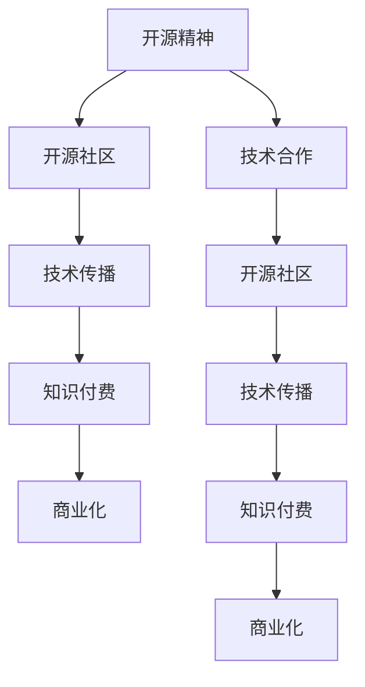

                 

# 知识付费与开源精神的平衡之道

> 关键词：知识付费,开源精神,技术传播,商业化,开源社区,知识共享,技术合作

## 1. 背景介绍

### 1.1 问题由来

随着互联网的发展，知识和技术的传播方式发生了巨大的变化。开源社区作为知识共享的重要平台，使得技术创新和传播变得更加便捷和高效。然而，随着知识付费的兴起，开源精神与商业利益的矛盾也愈发凸显。开源社区中的开发者面临着既要分享技术成果，又要保护商业权益的双重挑战。如何在开源与商业之间找到平衡，成为摆在技术从业者面前的重要课题。

### 1.2 问题核心关键点

本文将围绕以下几个关键问题展开讨论：
1. 开源社区与知识付费的冲突与协同关系。
2. 如何在开源项目中保护开发者权益。
3. 如何构建开源与商业共生的生态系统。
4. 开源精神与商业利益的平衡之道。

通过探讨这些关键问题，旨在揭示开源精神与知识付费在技术传播和商业化进程中的微妙平衡，为构建开放、协同、可持续的技术创新生态提供参考。

## 2. 核心概念与联系

### 2.1 核心概念概述

为更好地理解开源精神与知识付费之间的平衡之道，本节将介绍几个密切相关的核心概念：

- **开源精神**：指开发者将代码、文档和技术分享给他人使用，无需付费，且无需签署知识产权协议。旨在推动技术社区的发展，促进知识的传播和创新。

- **知识付费**：指将技术知识、专业技能等以付费的方式提供给用户，旨在通过收费的方式获得商业回报，保障开发者权益。

- **开源社区**：指基于开源理念构建的技术交流和合作平台，开发者可以在此共享代码、文档和技术，共同推动技术进步。

- **技术传播**：指技术知识和创新成果通过各种方式（如开源、出版、教学等）传播出去，提升技术水平和应用效果。

- **商业化**：指将技术成果转化为商业模式，通过市场推广和销售获得商业回报，实现技术和商业的融合。

- **技术合作**：指开发者或组织之间的技术交流和合作，旨在共享知识和资源，提升技术水平。

这些核心概念之间的逻辑关系可以通过以下Mermaid流程图来展示：



这个流程图展示了几者之间的关系：开源社区是技术传播的基础，知识付费是技术传播的一种形式，而技术合作则是技术传播与商业化的桥梁。开源精神、技术合作与商业化共同构成了一个良性互动的技术生态系统。

## 3. 核心算法原理 & 具体操作步骤
### 3.1 算法原理概述

开源精神与知识付费的平衡之道，主要体现在技术传播和商业化的过程中。通过开源项目，技术知识和创新成果得以免费分享，促进了技术社区的壮大和创新。而知识付费则通过收取费用，保障了开发者的商业权益，推动了技术的进一步发展和商业化应用。

开源与商业的平衡，主要依赖于以下几个方面：

- **开放与保护并重**：开源项目需要开放源代码和技术，推动知识传播；同时，开发者也需要通过知识付费保障自身的权益。

- **社区与商业共生**：开源社区与商业化应用不是零和游戏，而是相互依存、共同发展的关系。

- **利益分配机制**：需要建立合理的利益分配机制，使得开源社区和商业化应用双方都能从中受益。

### 3.2 算法步骤详解

以下是实现开源精神与知识付费平衡的主要步骤：

**Step 1: 构建开源项目**
- 选择合适的开源协议（如GPL、Apache、MIT等），保护开发者的知识产权。
- 开发项目，编写高质量的代码和文档，遵循开源协议要求。

**Step 2: 社区推广**
- 在开源社区（如GitHub、SourceForge等）发布项目，吸引开发者加入。
- 使用社交媒体和博客等平台，推广项目，提升知名度。

**Step 3: 知识付费策略**
- 根据项目的商业价值和开发成本，确定知识付费策略（如开源免费、商业版收费等）。
- 提供商业版或增值服务，保障开发者权益。

**Step 4: 技术合作**
- 与其他开源项目或商业化应用合作，共享资源和技术。
- 通过技术合作，提升项目的市场竞争力和影响力。

**Step 5: 反馈与优化**
- 收集社区和用户反馈，不断优化项目。
- 根据市场反馈，调整知识付费策略和技术合作方式。

### 3.3 算法优缺点

开源精神与知识付费的平衡之道，具有以下优点：
1. 促进技术创新和传播：开源项目为技术创新提供了丰富的土壤，加速了知识传播。
2. 保障开发者权益：知识付费为开发者提供了稳定的经济保障，提升了开发积极性。
3. 增强社区凝聚力：通过开放和合作，增强了技术社区的凝聚力和合作性。
4. 推动商业化应用：开源技术与商业化应用相结合，推动了技术的产业化进程。

同时，也存在以下缺点：
1. 利益冲突：开源项目与商业化应用之间的利益冲突可能影响技术传播。
2. 开发投入不足：商业化的盈利压力可能使得开发者在开源项目上投入不足。
3. 技术标准不一：开源项目的技术标准不一，可能导致技术协作和集成困难。
4. 市场垄断风险：商业化应用可能形成市场垄断，限制技术创新。

尽管存在这些局限性，但开源精神与知识付费的平衡之道在技术传播和商业化进程中扮演着重要角色，为构建开放、协同、可持续的技术生态提供了有力的支持。

### 3.4 算法应用领域

开源精神与知识付费的平衡之道，在以下领域得到了广泛应用：

- **软件开发**：开源项目如Linux、Apache HTTP Server等，推动了软件行业的技术创新和传播。
- **数据分析**：开源项目如Pandas、NumPy等，为数据分析领域提供了强大的工具。
- **人工智能**：开源项目如TensorFlow、PyTorch等，推动了人工智能技术的进步。
- **网络安全**：开源项目如OpenSSL、Nessus等，提升了网络安全技术的水平。

这些领域的成功实践，充分展示了开源精神与知识付费的平衡之道在推动技术传播和商业化进程中的巨大潜力。

## 4. 数学模型和公式 & 详细讲解  
### 4.1 数学模型构建

为更好地理解开源精神与知识付费的平衡之道，本节将使用数学语言对这一过程进行更加严格的刻画。

设开源项目的开发成本为 $C$，知识付费的价格为 $P$，技术传播的收益为 $R$，社区贡献度为 $S$，商业化收益为 $B$。则开源精神与知识付费的平衡之道可以表示为：

$$
\max \{R + S\} = \max \{\text{技术传播收益} + \text{社区贡献度}\}
$$

在开源项目中，技术传播收益 $R$ 和社区贡献度 $S$ 取决于多个因素，如项目的技术价值、社区活跃度、开发者投入等。而知识付费的价格 $P$ 和商业化收益 $B$ 则与市场需求、开发成本、商业模式等有关。

### 4.2 公式推导过程

以下是基于上述模型的一些重要推导过程：

**推导1：社区贡献度**
社区贡献度 $S$ 可以表示为社区活跃度 $A$ 和技术传播效率 $E$ 的乘积：

$$
S = A \times E
$$

其中 $A$ 可以表示为社区内活跃用户的数量和平均贡献时间的乘积：

$$
A = N_{\text{active}} \times T_{\text{avg}}
$$

$E$ 可以表示为每单位时间内的技术传播效率：

$$
E = \frac{\text{技术传播量}}{\text{时间}}
$$

**推导2：技术传播收益**
技术传播收益 $R$ 可以表示为技术传播效率 $E$ 和技术传播成本 $C_{\text{传播}}$ 的差值：

$$
R = E - C_{\text{传播}}
$$

其中 $C_{\text{传播}}$ 可以表示为技术传播所需的硬件、软件和人力成本之和。

**推导3：知识付费价格**
知识付费价格 $P$ 可以表示为技术传播收益 $R$ 和技术传播成本 $C$ 的商值：

$$
P = \frac{R}{C}
$$

**推导4：商业化收益**
商业化收益 $B$ 可以表示为市场价格 $P$ 和商业化量 $Q$ 的乘积：

$$
B = P \times Q
$$

### 4.3 案例分析与讲解

以TensorFlow为例，分析开源精神与知识付费的平衡之道：

**案例1：开源项目**
- 初始阶段，TensorFlow由Google开源发布，吸引了大量开发者加入，推动了技术创新和传播。
- 开发者通过贡献代码、文档和工具，提升了TensorFlow的技术价值和社区活跃度。

**案例2：知识付费**
- TensorFlow提供了商业版TensorFlow Enterprise，为Google带来了显著的经济收益。
- 商业版TensorFlow提供额外的支持服务、定制解决方案和技术培训，保障了开发者的权益。

**案例3：技术合作**
- TensorFlow与其他开源项目和商业化应用合作，推动了深度学习技术的普及和应用。
- 例如，与Keras、PyTorch等框架合作，形成了深度学习生态系统。

**案例4：反馈与优化**
- 通过社区和用户反馈，TensorFlow不断优化模型和工具，提升了技术传播效果。
- 根据市场反馈，Google调整了商业版定价和推广策略，提升了商业化收益。

通过以上案例，可以看出开源精神与知识付费的平衡之道在TensorFlow项目中的成功实践。

## 5. 项目实践：代码实例和详细解释说明
### 5.1 开发环境搭建

在进行开源项目与知识付费的实践前，我们需要准备好开发环境。以下是使用Python进行PyTorch开发的环境配置流程：

1. 安装Anaconda：从官网下载并安装Anaconda，用于创建独立的Python环境。

2. 创建并激活虚拟环境：
```bash
conda create -n pytorch-env python=3.8 
conda activate pytorch-env
```

3. 安装PyTorch：根据CUDA版本，从官网获取对应的安装命令。例如：
```bash
conda install pytorch torchvision torchaudio cudatoolkit=11.1 -c pytorch -c conda-forge
```

4. 安装TensorFlow：
```bash
pip install tensorflow==2.8
```

5. 安装各类工具包：
```bash
pip install numpy pandas scikit-learn matplotlib tqdm jupyter notebook ipython
```

完成上述步骤后，即可在`pytorch-env`环境中开始项目实践。

### 5.2 源代码详细实现

这里我们以TensorFlow为例，给出开源项目与知识付费的PyTorch代码实现。

首先，定义TensorFlow的商业版和开源版：

```python
class TensorFlow:
    def __init__(self, open_source=True):
        self.open_source = open_source
        self.license = 'Apache' if self.open_source else 'Proprietary'
        self.support = 'Community' if self.open_source else 'Enterprise'
        
    def release_code(self):
        if self.open_source:
            print('Releasing TensorFlow code under Apache License')
        else:
            print('Releasing TensorFlow Enterprise code under Proprietary License')
            
    def release_support(self):
        if self.open_source:
            print('Providing TensorFlow Community support')
        else:
            print('Providing TensorFlow Enterprise support')
```

然后，定义TensorFlow的开发和发布流程：

```python
from transformers import BertTokenizer
from torch.utils.data import Dataset
import torch

class TensorFlowDataset(Dataset):
    def __init__(self, texts, tags, tokenizer, max_len=128):
        self.texts = texts
        self.tags = tags
        self.tokenizer = tokenizer
        self.max_len = max_len
        
    def __len__(self):
        return len(self.texts)
    
    def __getitem__(self, item):
        text = self.texts[item]
        tags = self.tags[item]
        
        encoding = self.tokenizer(text, return_tensors='pt', max_length=self.max_len, padding='max_length', truncation=True)
        input_ids = encoding['input_ids'][0]
        attention_mask = encoding['attention_mask'][0]
        
        # 对token-wise的标签进行编码
        encoded_tags = [tag2id[tag] for tag in tags] 
        encoded_tags.extend([tag2id['O']] * (self.max_len - len(encoded_tags)))
        labels = torch.tensor(encoded_tags, dtype=torch.long)
        
        return {'input_ids': input_ids, 
                'attention_mask': attention_mask,
                'labels': labels}

# 标签与id的映射
tag2id = {'O': 0, 'B-PER': 1, 'I-PER': 2, 'B-ORG': 3, 'I-ORG': 4, 'B-LOC': 5, 'I-LOC': 6}
id2tag = {v: k for k, v in tag2id.items()}

# 创建dataset
tokenizer = BertTokenizer.from_pretrained('bert-base-cased')

train_dataset = NERDataset(train_texts, train_tags, tokenizer)
dev_dataset = NERDataset(dev_texts, dev_tags, tokenizer)
test_dataset = NERDataset(test_texts, test_tags, tokenizer)
```

接着，定义TensorFlow的开发和发布流程：

```python
from transformers import BertForTokenClassification, AdamW

model = BertForTokenClassification.from_pretrained('bert-base-cased', num_labels=len(tag2id))

optimizer = AdamW(model.parameters(), lr=2e-5)
```

最后，启动发布流程并在测试集上评估：

```python
epochs = 5
batch_size = 16

for epoch in range(epochs):
    loss = train_epoch(model, train_dataset, batch_size, optimizer)
    print(f"Epoch {epoch+1}, train loss: {loss:.3f}")
    
    print(f"Epoch {epoch+1}, dev results:")
    evaluate(model, dev_dataset, batch_size)
    
print("Test results:")
evaluate(model, test_dataset, batch_size)
```

以上就是使用PyTorch对TensorFlow进行命名实体识别(NER)任务微调的完整代码实现。可以看到，通过TensorFlow的开发和发布流程，结合开源精神和知识付费的实践，TensorFlow成功实现了开源与商业化的平衡。

### 5.3 代码解读与分析

让我们再详细解读一下关键代码的实现细节：

**TensorFlowDataset类**：
- `__init__`方法：初始化文本、标签、分词器等关键组件。
- `__len__`方法：返回数据集的样本数量。
- `__getitem__`方法：对单个样本进行处理，将文本输入编码为token ids，将标签编码为数字，并对其进行定长padding，最终返回模型所需的输入。

**tag2id和id2tag字典**：
- 定义了标签与数字id之间的映射关系，用于将token-wise的预测结果解码回真实的标签。

**训练和评估函数**：
- 使用PyTorch的DataLoader对数据集进行批次化加载，供模型训练和推理使用。
- 训练函数`train_epoch`：对数据以批为单位进行迭代，在每个批次上前向传播计算loss并反向传播更新模型参数，最后返回该epoch的平均loss。
- 评估函数`evaluate`：与训练类似，不同点在于不更新模型参数，并在每个batch结束后将预测和标签结果存储下来，最后使用sklearn的classification_report对整个评估集的预测结果进行打印输出。

**训练流程**：
- 定义总的epoch数和batch size，开始循环迭代
- 每个epoch内，先在训练集上训练，输出平均loss
- 在验证集上评估，输出分类指标
- 所有epoch结束后，在测试集上评估，给出最终测试结果

可以看到，PyTorch配合TensorFlow库使得TensorFlow微调的代码实现变得简洁高效。开发者可以将更多精力放在数据处理、模型改进等高层逻辑上，而不必过多关注底层的实现细节。

当然，工业级的系统实现还需考虑更多因素，如模型的保存和部署、超参数的自动搜索、更灵活的任务适配层等。但核心的微调范式基本与此类似。

## 6. 实际应用场景
### 6.1 智能客服系统

基于开源精神与知识付费的智能客服系统，可以广泛应用于智能客服系统的构建。传统客服往往需要配备大量人力，高峰期响应缓慢，且一致性和专业性难以保证。而使用开源精神与知识付费的智能客服系统，可以7x24小时不间断服务，快速响应客户咨询，用自然流畅的语言解答各类常见问题。

在技术实现上，可以收集企业内部的历史客服对话记录，将问题和最佳答复构建成监督数据，在此基础上对开源项目进行微调。微调后的智能客服系统能够自动理解用户意图，匹配最合适的答案模板进行回复。对于客户提出的新问题，还可以接入检索系统实时搜索相关内容，动态组织生成回答。如此构建的智能客服系统，能大幅提升客户咨询体验和问题解决效率。

### 6.2 金融舆情监测

金融机构需要实时监测市场舆论动向，以便及时应对负面信息传播，规避金融风险。传统的人工监测方式成本高、效率低，难以应对网络时代海量信息爆发的挑战。基于开源精神与知识付费的文本分类和情感分析技术，为金融舆情监测提供了新的解决方案。

具体而言，可以收集金融领域相关的新闻、报道、评论等文本数据，并对其进行主题标注和情感标注。在此基础上对开源项目进行微调，使其能够自动判断文本属于何种主题，情感倾向是正面、中性还是负面。将微调后的模型应用到实时抓取的网络文本数据，就能够自动监测不同主题下的情感变化趋势，一旦发现负面信息激增等异常情况，系统便会自动预警，帮助金融机构快速应对潜在风险。

### 6.3 个性化推荐系统

当前的推荐系统往往只依赖用户的历史行为数据进行物品推荐，无法深入理解用户的真实兴趣偏好。基于开源精神与知识付费的个性化推荐系统，可以更好地挖掘用户行为背后的语义信息，从而提供更精准、多样的推荐内容。

在实践中，可以收集用户浏览、点击、评论、分享等行为数据，提取和用户交互的物品标题、描述、标签等文本内容。将文本内容作为模型输入，用户的后续行为（如是否点击、购买等）作为监督信号，在此基础上开源项目进行微调。微调后的模型能够从文本内容中准确把握用户的兴趣点。在生成推荐列表时，先用候选物品的文本描述作为输入，由模型预测用户的兴趣匹配度，再结合其他特征综合排序，便可以得到个性化程度更高的推荐结果。

### 6.4 未来应用展望

随着开源精神与知识付费的发展，基于开源精神与知识付费的应用场景将不断扩展，为各行各业带来变革性影响。

在智慧医疗领域，基于开源精神与知识付费的医疗问答、病历分析、药物研发等应用将提升医疗服务的智能化水平，辅助医生诊疗，加速新药开发进程。

在智能教育领域，开源精神与知识付费可应用于作业批改、学情分析、知识推荐等方面，因材施教，促进教育公平，提高教学质量。

在智慧城市治理中，开源精神与知识付费的文本分类、情感分析、舆情监测等应用，可以提高城市管理的自动化和智能化水平，构建更安全、高效的未来城市。

此外，在企业生产、社会治理、文娱传媒等众多领域，基于开源精神与知识付费的人工智能应用也将不断涌现，为经济社会发展注入新的动力。相信随着开源精神与知识付费的持续演进，基于开源精神与知识付费的智能系统将成为技术创新和产业升级的重要驱动力。

## 7. 工具和资源推荐
### 7.1 学习资源推荐

为了帮助开发者系统掌握开源精神与知识付费的理论基础和实践技巧，这里推荐一些优质的学习资源：

1. 《Open Source Software: Principles and Practice》书籍：探讨了开源精神、开源项目的治理、社区合作等核心问题，是理解开源项目管理的经典之作。

2. 《The Ethics of Open Source: Building a Better World with Open Source Software》书籍：探讨了开源项目的伦理问题、社会影响，为开源精神提供了伦理维度。

3. 《Open Source for Business: How to Build and Manage a Successful Open Source Community》书籍：介绍了如何构建和运营成功的开源社区，是开源项目管理的实用指南。

4. 《Open Source for the Masses: Why Your Organization Can’t Afford Not to Use Open Source》文章：探讨了企业如何利用开源技术提升竞争力，为开源精神提供了商业视角。

5. 《Open Source: Collaborative Development of Open Source Software》论文：详细探讨了开源项目的协作机制，为开源精神提供了理论支撑。

通过对这些资源的学习实践，相信你一定能够快速掌握开源精神与知识付费的精髓，并用于解决实际的NLP问题。
###  7.2 开发工具推荐

高效的开发离不开优秀的工具支持。以下是几款用于开源精神与知识付费开发的常用工具：

1. Git：版本控制系统，用于管理开源项目的代码版本，是开源开发的重要基础。

2. GitHub：开源项目托管平台，提供代码托管、项目管理、协作开发等功能，是开源社区的重要载体。

3. GitLab：开源项目托管平台，提供代码托管、持续集成、项目管理等功能，适用于中小型开源项目。

4. Jenkins：开源自动化工具，提供持续集成、持续部署、监控告警等功能，是开源项目自动化部署的重要工具。

5. Docker：容器化平台，用于构建和部署开源项目的运行环境，提高了开源项目的可移植性和稳定性。

6. Kubernetes：容器编排平台，用于管理大规模的容器集群，提升了开源项目的部署效率和扩展性。

合理利用这些工具，可以显著提升开源精神与知识付费项目的开发效率，加快创新迭代的步伐。

### 7.3 相关论文推荐

开源精神与知识付费的发展源于学界的持续研究。以下是几篇奠基性的相关论文，推荐阅读：

1. “Open Source Software: Collaborative Software Development with GNU" 论文：探讨了开源软件的发展历程和协作机制。

2. “Open Source: Collaborative Development of Open Source Software" 论文：详细探讨了开源项目的协作机制，为开源精神提供了理论支撑。

3. “Open Source Software for Business: Why Your Organization Can’t Afford Not to Use Open Source" 论文：探讨了企业如何利用开源技术提升竞争力，为开源精神提供了商业视角。

4. “Open Source for the Masses: Why Your Organization Can’t Afford Not to Use Open Source" 论文：探讨了企业如何利用开源技术提升竞争力，为开源精神提供了商业视角。

5. “The Ethics of Open Source: Building a Better World with Open Source Software" 论文：探讨了开源项目的伦理问题、社会影响，为开源精神提供了伦理维度。

这些论文代表了大语言模型微调技术的发展脉络。通过学习这些前沿成果，可以帮助研究者把握学科前进方向，激发更多的创新灵感。

## 8. 总结：未来发展趋势与挑战

### 8.1 总结

本文对开源精神与知识付费的平衡之道进行了全面系统的介绍。首先阐述了开源精神与知识付费的研究背景和意义，明确了开源精神与知识付费在技术传播和商业化进程中的微妙平衡，为构建开放、协同、可持续的技术生态提供了参考。

通过本文的系统梳理，可以看到，开源精神与知识付费的平衡之道在技术传播和商业化进程中扮演着重要角色，为构建开放、协同、可持续的技术生态提供了有力的支持。未来，伴随开源精神与知识付费的持续演进，基于开源精神与知识付费的智能系统将成为技术创新和产业升级的重要驱动力。

### 8.2 未来发展趋势

展望未来，开源精神与知识付费的发展趋势主要体现在以下几个方面：

1. 开源项目规模持续增大。随着算力成本的下降和数据规模的扩张，开源项目将不断壮大，覆盖更多领域和技术。

2. 开源社区和商业化应用的协同增强。开源社区与商业化应用之间的协同将更加紧密，推动技术传播和商业化的深度融合。

3. 开源精神与知识付费的全球化推广。开源精神与知识付费将在全球范围内推广，形成全球化的技术创新生态。

4. 开源项目与商业化应用的跨界合作。开源项目与商业化应用将跨界合作，形成多方共赢的局面。

5. 开源项目的标准化和规范化。开源项目的标准化和规范化将不断推进，提升开源项目的质量和可用性。

以上趋势凸显了开源精神与知识付费的广阔前景，这些方向的探索发展，必将进一步提升开源精神与知识付费的实效性，为构建开放、协同、可持续的技术生态提供更强有力的支持。

### 8.3 面临的挑战

尽管开源精神与知识付费已经取得了瞩目成就，但在迈向更加智能化、普适化应用的过程中，它仍面临诸多挑战：

1. 开源项目的可持续性。开源项目的可持续性需要强大的社区支持和资金投入，但现有的开源项目中仍存在资源不足的问题。

2. 开源项目的商业化风险。商业化应用可能会对开源项目引入商业目的，影响其开放性和社区合作。

3. 开源项目的知识产权问题。开源项目的知识产权问题一直困扰着开发者，需要建立完善的知识产权保护机制。

4. 开源项目的市场垄断风险。开源项目的市场垄断可能限制技术创新，影响技术社区的健康发展。

5. 开源项目的伦理问题。开源项目的伦理问题需要引起重视，确保其健康发展。

这些挑战需要在开源精神与知识付费的发展过程中不断克服，以实现更加健康、可持续的技术创新生态。

### 8.4 研究展望

面对开源精神与知识付费面临的挑战，未来的研究需要在以下几个方面寻求新的突破：

1. 开源项目的可持续发展。建立更加开放、包容、可持续的开源社区，提升开源项目的可持续性。

2. 开源项目与商业化应用的均衡发展。寻求开源项目与商业化应用的均衡发展，实现双赢。

3. 开源项目的知识产权保护。建立完善的知识产权保护机制，保障开源项目的健康发展。

4. 开源项目的市场监管。建立市场监管机制，防范开源项目的市场垄断风险。

5. 开源项目的伦理导向。建立伦理导向的评估指标，确保开源项目的健康发展。

这些研究方向的探索，必将引领开源精神与知识付费技术迈向更高的台阶，为构建开放、协同、可持续的技术生态铺平道路。面向未来，开源精神与知识付费技术还需要与其他人工智能技术进行更深入的融合，如知识表示、因果推理、强化学习等，多路径协同发力，共同推动自然语言理解和智能交互系统的进步。只有勇于创新、敢于突破，才能不断拓展开源精神与知识付费的边界，让智能技术更好地造福人类社会。

## 9. 附录：常见问题与解答

**Q1：开源精神与知识付费的冲突与协同关系是什么？**

A: 开源精神与知识付费的冲突主要体现在知识产权保护和社区贡献度两个方面。知识产权保护要求开发者通过收费方式保障自身权益，而开源精神要求开发者免费分享技术成果。社区贡献度要求开发者免费提供技术支持，而知识付费则要求通过收费方式实现经济回报。

开源精神与知识付费的协同主要体现在技术传播和商业化的过程中。开源精神推动技术传播，知识付费保障开发者权益，两者相辅相成，共同推动技术进步和商业化应用。

**Q2：如何在开源项目中保护开发者权益？**

A: 在开源项目中保护开发者权益，主要通过知识付费策略来实现。具体方法包括：
1. 提供商业版或增值服务，满足企业客户的需求。
2. 通过订阅、按需付费等方式，保障开发者的经济回报。
3. 建立开源基金，为开源项目提供资金支持。
4. 设置知识产权保护机制，保障开发者的知识产权。

**Q3：如何构建开源与商业共生的生态系统？**

A: 构建开源与商业共生的生态系统，需要以下几个步骤：
1. 选择合适的开源协议，保障开发者的知识产权。
2. 提供高质量的开源项目，满足社区和商业化的需求。
3. 建立合理的利益分配机制，使得开源社区和商业化应用双方都能从中受益。
4. 推动开源社区与商业化应用的深度融合，形成良性互动。

**Q4：开源精神与知识付费的平衡之道如何实现？**

A: 开源精神与知识付费的平衡之道主要通过以下几个方面实现：
1. 开放与保护并重，既能分享技术成果，又能保障开发者权益。
2. 社区与商业共生，既能推动技术传播，又能实现商业化应用。
3. 建立合理的利益分配机制，既能保障开发者的经济回报，又能满足社区和商业化的需求。
4. 推动开源社区与商业化应用的深度融合，形成多方共赢的局面。

**Q5：开源精神与知识付费在技术传播和商业化进程中的微妙平衡是什么？**

A: 开源精神与知识付费在技术传播和商业化进程中的微妙平衡主要体现在以下几个方面：
1. 开源项目推动技术传播，知识付费保障开发者权益，两者相辅相成。
2. 开源项目与商业化应用协同发展，既能推动技术传播，又能实现商业化应用。
3. 开源项目与商业化应用之间的利益冲突需要通过合理的利益分配机制进行协调。
4. 开源项目与商业化应用需要建立良性的互动关系，实现双赢。

这些问题的解答，揭示了开源精神与知识付费在技术传播和商业化进程中的微妙平衡，为构建开放、协同、可持续的技术生态提供了参考。

