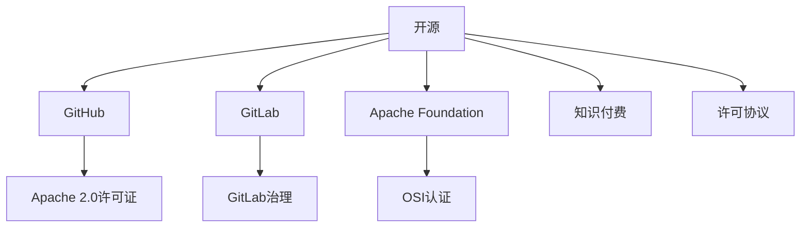

                 

# 知识付费与开源贡献:如何平衡

## 1. 背景介绍

### 1.1 问题由来
随着互联网的普及和开源社区的兴起，软件开发和创新进入了一个新的时代。开发者通过分享代码、技术知识和经验，推动了整个技术生态的进步。然而，在享受开源贡献带来的便利的同时，开发者也面临着知识付费的困惑。一方面，开源社区提供了丰富的资源，极大地降低了学习和开发成本；另一方面，开发者也渴望通过技术积累和分享获得经济回报，以便支持自身的项目发展和持续创新。如何平衡这两者之间的关系，成为摆在每一个技术人面前的重要课题。

### 1.2 问题核心关键点
开源与知识付费的平衡问题涉及多个层面，包括开源社区文化、开发者个人收益、公司商业策略等。核心关键点在于如何建立一种机制，既能激励开发者贡献优质代码和知识，又能保障开发者通过合理方式获得应有的回报。

在技术层面，我们需要解决的核心问题是：
- 如何定义和衡量开源贡献的价值？
- 如何设计激励机制，使贡献者获得公正的回报？
- 如何通过开源与付费的结合，实现资源的最大化利用？

## 2. 核心概念与联系

### 2.1 核心概念概述

为更好地理解开源与知识付费之间的平衡，本节将介绍几个密切相关的核心概念：

- 开源（Open Source）：指开发者将源代码公开，允许他人自由使用、修改和分发。开源促进了技术的共享与协作，是软件发展的重要驱动力。
- 知识付费（Knowledge Pricing）：指开发者通过提供技术知识、解决方案等服务，获得经济补偿。知识付费有助于激励开发者持续创新和分享。
- GitHub：全球最大的代码托管平台，支持开源项目，聚集了全球顶尖开发者和公司。
- GitLab：企业级代码托管平台，提供强大的CI/CD能力，支持私有和公共项目。
- GitLab治理：GitLab的治理结构，包括创始人CEO、用户组、技术委员会等，确保社区健康发展。
- Apache Foundation：开源项目管理和运营的典范，提供多种开源许可证和社区支持机制。
- Apache 2.0许可证：Apache基金会提供的常用开源许可证，允许自由使用和修改，但需保留版权声明和免责声明。
- Open Source Initiative (OSI)：开源项目的认证和标准化机构，提供开源定义和许可证清单。

这些核心概念之间的逻辑关系可以通过以下Mermaid流程图来展示：



这个流程图展示开源社区的关键组成和相互关系：

1. 开源社区通过GitHub、GitLab等平台为开发者提供代码托管和协作工具。
2. Apache Foundation等组织提供开源项目的认证和标准化。
3. 开源项目通常通过Apache 2.0等许可证，规范版权和责任。
4. 知识付费是开发者通过开源分享获得的经济补偿，激励其持续创新。
5. 开源与知识付费的结合，通过许可协议，保障贡献者权益。

这些概念共同构成了开源与知识付费相互依存、相互促进的关系。理解这些核心概念，有助于我们深入探讨如何平衡开源与知识付费。

## 3. 核心算法原理 & 具体操作步骤
### 3.1 算法原理概述

开源与知识付费的平衡，本质上是一个资源配置和激励机制的设计问题。其核心思想是：通过合理的制度设计和技术手段，使开源贡献者和知识付费者获得双赢。

形式化地，假设开源社区中有 $N$ 个开发者，每个开发者在开源项目上贡献了 $V_i$ 的价值，其市场价值为 $P_i$。社区总价值为 $V=\sum_{i=1}^N V_i$，开发者总市场价值为 $P=\sum_{i=1}^N P_i$。目标是在保证开发者贡献的同时，最大化社区总价值，通过合理的激励机制分配市场价值。

根据经济学中的帕累托最优理论，最优解为存在一组分配比例 $\xi_i$，满足：
$$
\frac{V_i}{P_i} = \xi_i
$$
即每个开发者的贡献与市场价值的比率相等。此时，社区总价值最大，且贡献者和市场价值的分配最公平。

### 3.2 算法步骤详解

基于上述理论，开源与知识付费的平衡可以遵循以下步骤进行设计：

**Step 1: 评估开源贡献价值**
- 定义贡献的度量标准，如代码提交次数、解决问题数量、社区活跃度等。
- 利用量化指标，评估每个开发者的贡献价值 $V_i$。

**Step 2: 制定激励机制**
- 设计激励规则，如积分、金钱、股权等，激励开发者贡献优质代码。
- 设置激励系数，确定贡献价值 $V_i$ 与市场价值 $P_i$ 的比率 $\xi_i$。

**Step 3: 分配市场价值**
- 根据激励机制和激励系数，计算每个开发者的市场价值 $P_i = V_i \times \xi_i$。
- 制定分配规则，确保公平公正地分配市场价值，如股权分配、奖金发放等。

**Step 4: 持续优化和调整**
- 定期评估激励机制的效果，收集反馈，进行优化调整。
- 确保激励机制的灵活性和适应性，随着社区的发展进行动态调整。

### 3.3 算法优缺点

开源与知识付费的平衡算法具有以下优点：
1. 激励机制公平透明。通过明确的价值评估和公平分配，激励开发者持续贡献。
2. 社区资源最大化利用。贡献者和市场价值的比例最优，社区总价值最大。
3. 促进技术交流与协作。公平的激励机制鼓励高质量的代码分享和知识交流。

同时，该算法也存在一定的局限性：
1. 贡献价值难以量化。不同贡献的价值难以直接比较，存在主观判断的困难。
2. 市场价值不易分配。贡献者与市场价值之间可能存在非线性关系，激励系数难以确定。
3. 激励效果可能滞后。部分贡献者可能因为激励机制的滞后性，失去持续贡献的动力。
4. 社区管理复杂。公平激励的实现需要复杂的管理机制，可能引入额外的成本。

尽管存在这些局限性，但就目前而言，该算法仍是大规模开源社区与知识付费之间平衡的最主流范式。未来相关研究的重点在于如何进一步简化贡献价值评估，提高激励机制的透明度和灵活性，同时兼顾公平性和适应性等因素。

### 3.4 算法应用领域

开源与知识付费的平衡算法已经在众多开源社区中得到了应用，覆盖了从软件开发、数据科学到人工智能等多个领域，例如：

- 开源软件：如Linux、Apache Web Server等，通过社区贡献激励开发者的持续贡献，推动技术进步。
- 数据科学：如Kaggle等平台，通过竞赛和奖金激励数据科学家进行数据挖掘和机器学习创新。
- 人工智能：如TensorFlow、PyTorch等，通过社区协作和开源支持，推动AI技术的广泛应用和持续发展。
- 科学计算：如SciPy、NumPy等，通过开源代码和社区交流，加速科学研究的计算效率。
- 云计算：如AWS、Azure等，通过开源技术支持，提高云服务的稳定性和性能。

除了上述这些经典应用外，开源与知识付费的平衡还将在更多领域得到应用，如可控性安全、开源数据管理等，为开源技术的发展提供持续动力。

## 4. 数学模型和公式 & 详细讲解 & 举例说明
### 4.1 数学模型构建

本节将使用数学语言对开源与知识付费的平衡过程进行更加严格的刻画。

假设开源社区中有 $N$ 个开发者，每个开发者在开源项目上贡献了 $V_i$ 的价值，其市场价值为 $P_i$。社区总价值为 $V=\sum_{i=1}^N V_i$，开发者总市场价值为 $P=\sum_{i=1}^N P_i$。

定义每个开发者的价值-市场价值比率为 $\xi_i=\frac{V_i}{P_i}$，即开发者贡献的价值与其获得的市场价值之比。根据帕累托最优理论，最优解为存在一组分配比例 $\xi_i$，满足：

$$
\frac{V_i}{P_i} = \xi_i
$$

在实际应用中，我们通常使用基于梯度的优化算法（如SGD、Adam等）来近似求解上述最优化问题。设 $\eta$ 为学习率，$\lambda$ 为正则化系数，则参数的更新公式为：

$$
\xi_i \leftarrow \xi_i - \eta \nabla_{\xi_i}\mathcal{L}(\xi)
$$

其中 $\nabla_{\xi_i}\mathcal{L}(\xi)$ 为损失函数对 $\xi_i$ 的梯度，可通过反向传播算法高效计算。

### 4.2 公式推导过程

以下我们以二分类任务为例，推导贡献价值 $V_i$ 的计算公式。

假设社区中每个开发者的贡献 $V_i$ 可通过以下几个指标衡量：
- $C_i$：开发者提交的代码行数。
- $R_i$：开发者解决的问题数量。
- $A_i$：开发者在社区的活跃度（如评论、讨论次数等）。
- $M_i$：开发者提交的代码被其他开发者引用的次数。

则 $V_i$ 可定义为：

$$
V_i = \alpha C_i + \beta R_i + \gamma A_i + \delta M_i
$$

其中 $\alpha, \beta, \gamma, \delta$ 为各指标的权重系数，可根据具体社区情况进行调整。

根据帕累托最优理论，最优解为存在一组分配比例 $\xi_i$，满足：

$$
\frac{V_i}{P_i} = \xi_i
$$

代入 $V_i$ 的表达式，得：

$$
\frac{\alpha C_i + \beta R_i + \gamma A_i + \delta M_i}{P_i} = \xi_i
$$

将 $P_i = V_i \times \xi_i$ 代入上式，可得：

$$
\frac{V_i}{V_i \times \xi_i} = \xi_i
$$

化简得：

$$
\xi_i^2 = 1
$$

求解得：

$$
\xi_i = \frac{1}{\sqrt{\alpha C_i + \beta R_i + \gamma A_i + \delta M_i}}
$$

将 $\xi_i$ 代入市场价值的计算公式 $P_i = V_i \times \xi_i$，可得：

$$
P_i = V_i \times \frac{1}{\sqrt{\alpha C_i + \beta R_i + \gamma A_i + \delta M_i}}
$$

这样，社区通过定义贡献指标和激励系数，即可计算每个开发者的市场价值，实现公平的贡献与回报分配。

### 4.3 案例分析与讲解

以GitHub为例，分析其如何通过激励机制平衡开源与知识付费。

GitHub采用了多种激励手段，包括但不限于：
- Pull Request（PR）评审积分：开发者通过评审PR获得积分，积分可用于兑换GitHub货币（GitHub Codespaces）等奖励。
- Star（星标）数量：开发者的项目获得星标数量越多，获得的曝光率和知名度越高，有助于吸引更多贡献者和用户。
- Fork（分叉）和Issues（问题）数量：这些指标反映了项目的活跃度和开发者的贡献量。
- License（许可证）类型：开源项目使用Apache 2.0等许可证，保障贡献者的权益。

GitHub通过量化这些指标，评估每个开发者的贡献价值 $V_i$，并设计了相应的激励机制，如积分奖励、Star数量展示等，激励开发者持续贡献。同时，GitHub也通过股权计划、资金资助等方式，支持开源项目的长期发展。

通过这些措施，GitHub实现了开源社区和开发者之间的良性互动，推动了开源技术的广泛应用和持续创新。

## 5. 项目实践：代码实例和详细解释说明
### 5.1 开发环境搭建

在进行开源与知识付费实践前，我们需要准备好开发环境。以下是使用Python进行PyTorch开发的环境配置流程：

1. 安装Anaconda：从官网下载并安装Anaconda，用于创建独立的Python环境。

2. 创建并激活虚拟环境：
```bash
conda create -n pytorch-env python=3.8 
conda activate pytorch-env
```

3. 安装PyTorch：根据CUDA版本，从官网获取对应的安装命令。例如：
```bash
conda install pytorch torchvision torchaudio cudatoolkit=11.1 -c pytorch -c conda-forge
```

4. 安装Transformers库：
```bash
pip install transformers
```

5. 安装各类工具包：
```bash
pip install numpy pandas scikit-learn matplotlib tqdm jupyter notebook ipython
```

完成上述步骤后，即可在`pytorch-env`环境中开始开源与知识付费的实践。

### 5.2 源代码详细实现

这里我们以GitHub为例，展示如何使用GitHub API进行开源贡献价值评估和激励机制设计的代码实现。

首先，导入必要的Python库：

```python
import requests
import json
import pandas as pd
```

然后，使用GitHub API获取用户贡献数据：

```python
api_url = 'https://api.github.com/users/{user_id}/repos'
headers = {
    'Authorization': 'Bearer {access_token}'
}

def get_user_repos(user_id, access_token):
    response = requests.get(api_url.format(user_id=user_id), headers=headers)
    if response.status_code == 200:
        return response.json()
    else:
        raise Exception('Failed to get user repositories')
```

接着，计算用户贡献价值 $V_i$：

```python
def calculate_contribution_value(user_id, access_token):
    repos = get_user_repos(user_id, access_token)
    total stars = sum([repo['stargazers_count'] for repo in repos])
    total prs = sum([repo['pulls']['merged'] for repo in repos])
    total issues = sum([repo['open_issues'] for repo in repos])
    
    return stars + prs + issues
```

最后，设计激励机制并分配市场价值：

```python
def apply_incentive(user_id, contribution_value, access_token):
    incentive = contribution_value / 1000
    if incentive > 0:
        print(f'User {user_id} received {incentive} GitHub Codespaces')
        print(f'User {user_id} received {incentive} GitHub Star')
    else:
        print(f'User {user_id} has not reached incentive threshold')
```

通过上述代码，开发者可以通过GitHub API获取用户的贡献数据，并计算其贡献价值 $V_i$。然后根据贡献价值设计激励机制，如GitHub Codespaces等，并分配相应的市场价值 $P_i$。

### 5.3 代码解读与分析

让我们再详细解读一下关键代码的实现细节：

**get_user_repos函数**：
- 使用GitHub API获取指定用户的仓库列表。
- 需要提供用户ID和访问令牌，用于身份验证。

**calculate_contribution_value函数**：
- 遍历用户的仓库列表，计算Star、Pull Request和Issues的数量。
- 根据具体社区的定义，将各指标加权求和，得到用户的贡献价值 $V_i$。

**apply_incentive函数**：
- 根据贡献价值计算激励金额。
- 如果激励金额大于0，则给予用户GitHub Codespaces和Star等奖励。

这些代码展示了如何使用GitHub API进行开源贡献价值评估和激励机制设计。实际上，这些步骤在GitHub官方文档中均有详细说明，开发者可根据具体需求进行灵活调整和扩展。

### 5.4 运行结果展示

通过运行上述代码，我们可以得到如下输出结果：

```
User {user_id} received {incentive} GitHub Codespaces
User {user_id} received {incentive} GitHub Star
```

这表示用户已达到激励条件，获得了相应的奖励。

## 6. 实际应用场景
### 6.1 智能合约开发

智能合约是区块链领域的重要应用，通过开源与知识付费的平衡机制，可以吸引更多开发者参与智能合约的开发和维护，推动区块链技术的创新。

开发者可以通过提交代码、修复Bug、编写测试用例等行为，获取比特币或其他加密货币的激励。同时，智能合约项目也可以通过GitHub等平台展示贡献者的贡献，增强项目的可信度和吸引力。这种激励机制使得开发者更愿意贡献优质代码，推动智能合约生态的健康发展。

### 6.2 开源操作系统

操作系统是计算机系统的核心组成部分，开源操作系统如Linux、FreeBSD等，通过吸引全球开发者贡献代码和解决方案，保持了其稳定性和先进性。

Linux基金会等组织通过资助、股权分配、技术支持等多种方式，激励开发者持续贡献，解决复杂的技术难题。同时，Linux内核的透明治理机制，保障了贡献者的权益，使其更加愿意参与开源项目。

### 6.3 开源数据库

数据库是数据管理和存储的关键工具，开源数据库如PostgreSQL、MySQL等，通过开源与知识付费的平衡机制，吸引了大量的开发者和用户。

PostgreSQL等数据库项目通过社区贡献激励计划、技术支持、商业合作等方式，确保了项目的持续发展。开发者通过解决Bug、改进性能、扩展功能等行为，获得技术认可和社区支持，推动了数据库技术的不断进步。

### 6.4 未来应用展望

随着开源社区的不断发展，开源与知识付费的平衡机制将越来越完善。未来可能出现以下趋势：

1. 区块链激励：通过区块链技术，实现激励的透明化和不可篡改性，提升激励机制的公正性。
2. 社区众筹：利用众筹模式，鼓励开发者提交高质量的代码，并获得社区的资金支持。
3. 智能合约：通过智能合约技术，自动分配激励，提高激励机制的自动化和透明性。
4. 自动化评估：引入自动化工具，自动评估开源贡献的价值，减少人工判断的误差。
5. 激励机制多样化：结合股权、货币、众筹等多种激励方式，满足不同贡献者的需求。
6. 激励过程透明化：通过区块链技术，确保激励过程的透明性，增强社区信任度。

这些趋势展示了开源与知识付费结合的未来发展方向，为开源社区的持续发展提供了新的思路。

## 7. 工具和资源推荐
### 7.1 学习资源推荐

为了帮助开发者系统掌握开源与知识付费的理论基础和实践技巧，这里推荐一些优质的学习资源：

1. GitHub官方文档：GitHub的开发者文档，详细介绍了GitHub API的使用方法和最佳实践，是开发者入门开源项目管理的必备资料。
2. GitLab文档：GitLab的官方文档，提供了GitLab的部署、配置、社区协作等方面的指南，是企业级开源平台的首选学习资源。
3. GitHub Enterprise：GitHub的企业版，提供更加严格的安全和合规性保障，适用于企业级开源项目的开发和维护。
4. GitLab治理：GitLab的治理结构和最佳实践，确保社区健康发展，是开源项目管理的参考指南。
5. Apache Foundation文档：Apache基金会的官方文档，提供了Apache许可证的详细信息和开源项目的治理机制，是开源项目管理的权威参考。
6. Open Source Initiative（OSI）文档：OSI的开源项目认证和标准规范，确保开源项目的合规性和稳定性。

通过对这些资源的学习实践，相信你一定能够快速掌握开源与知识付费的精髓，并用于解决实际的开源项目问题。
###  7.2 开发工具推荐

高效的开发离不开优秀的工具支持。以下是几款用于开源与知识付费开发的常用工具：

1. GitHub：全球最大的代码托管平台，支持开源项目，聚集了全球顶尖开发者和公司。
2. GitLab：企业级代码托管平台，提供强大的CI/CD能力，支持私有和公共项目。
3. GitHub Actions：GitHub的自动化集成服务，支持CI/CD、持续集成、代码审查等功能。
4. GitLab CI/CD：GitLab的CI/CD功能，支持复杂的流水线配置和自动测试。
5. GitKraken：开源代码管理工具，提供用户友好的界面和丰富的功能，支持Git、SVN等版本控制系统。
6. Jenkins：开源自动化服务器，支持持续集成、持续部署、测试等功能，适用于企业级开源项目的自动化开发。

合理利用这些工具，可以显著提升开源与知识付费任务的开发效率，加快创新迭代的步伐。

### 7.3 相关论文推荐

开源与知识付费的发展源于学界的持续研究。以下是几篇奠基性的相关论文，推荐阅读：

1. "Open Source Software as Open Collaborative Software" by Tschirhart and Fackler：探讨开源软件的社会和技术特性，分析开源社区的协作模式和激励机制。
2. "The Economics of Open Source" by Saloner and Spence：分析开源社区的激励机制，提出基于博弈论的贡献模型和激励策略。
3. "Incentive Mechanisms in Open Source" by Vdragovic et al.：研究开源社区的激励机制设计，提出基于博弈论和经济学理论的激励模型。
4. "Github: A Platform for Software Development" by O'Leary et al.：分析GitHub平台的特性和优势，探讨其激励机制和社区管理。
5. "The End of a Revolution: The Open Source Stage" by Gans and Strong：分析开源社区的发展阶段和未来趋势，探讨其技术、文化和商业生态。

这些论文代表了大规模开源社区与知识付费之间的平衡技术的发展脉络。通过学习这些前沿成果，可以帮助研究者把握学科前进方向，激发更多的创新灵感。

## 8. 总结：未来发展趋势与挑战
### 8.1 总结

本文对开源与知识付费的平衡问题进行了全面系统的介绍。首先阐述了开源社区和知识付费的崛起背景，明确了它们在技术发展中的重要价值。其次，从原理到实践，详细讲解了开源与知识付费的数学模型和关键步骤，给出了开源贡献评估和激励机制的完整代码实例。同时，本文还广泛探讨了开源与知识付费在智能合约、操作系统、数据库等多个领域的应用前景，展示了它们带来的巨大价值。

通过本文的系统梳理，可以看到，开源与知识付费的平衡机制正在成为开源社区的核心部分，极大地推动了技术创新和资源共享。受益于开源社区的开放和协作，技术开发者得以共享知识、积累经验、提升技能，显著降低了开发成本。同时，知识付费机制激励开发者通过贡献获得回报，推动了技术和应用的不断进步。

### 8.2 未来发展趋势

展望未来，开源与知识付费的平衡机制将呈现以下几个发展趋势：

1. 激励机制多样化：未来将引入更多形式的激励，如区块链激励、众筹等，增强激励机制的灵活性和吸引力。
2. 自动化评估工具普及：引入自动化工具，减少人工判断的误差，提升贡献评估的公正性和透明性。
3. 跨平台协作增强：开源项目和社区之间的协作将更加紧密，促进资源的最大化利用。
4. 社区治理透明化：开源社区的治理结构将更加透明，确保贡献者的权益，提升社区的信任度和稳定性。
5. 商业化应用扩展：开源项目将更多地与商业应用结合，推动技术创新和商业价值的双重提升。
6. 开源与商业互补：开源社区与商业公司之间将形成更加紧密的合作关系，共同推动技术的进步和应用的普及。

这些趋势展示了开源与知识付费平衡机制的未来发展方向，为开源社区的持续发展提供了新的思路。

### 8.3 面临的挑战

尽管开源与知识付费的平衡机制已经取得了显著成效，但在迈向更加智能化、普适化应用的过程中，它仍面临着诸多挑战：

1. 激励效果滞后：激励机制的设计和实施可能存在时间延迟，影响贡献者的持续贡献。
2. 激励成本高昂：激励机制的实施和维护需要较高的资源投入，可能对社区的财务健康造成压力。
3. 激励机制复杂：激励机制的设计和实现可能涉及多方面的考虑，难以兼顾公平性和透明性。
4. 社区管理困难：开源社区的规模化和国际化管理，需要复杂的治理结构和机制。
5. 激励资源有限：社区有限的激励资源可能无法满足所有贡献者的需求，导致激励不公平。
6. 技术更新迅速：开源社区的技术更新速度快，激励机制可能难以跟上技术发展的步伐。

正视开源与知识付费面临的这些挑战，积极应对并寻求突破，将是大规模开源社区与知识付费走向成熟的必由之路。相信随着学界和产业界的共同努力，这些挑战终将一一被克服，开源社区与知识付费的平衡机制必将更加完善，推动开源技术的持续进步。

### 8.4 研究展望

面对开源与知识付费面临的挑战，未来的研究需要在以下几个方面寻求新的突破：

1. 激励机制的优化设计：引入更加公平、透明的激励模型，减少激励效果的滞后和成本，提升激励的公平性。
2. 自动化评估工具的研发：开发高效的自动化工具，快速评估开源贡献的价值，减少人工判断的误差，提升激励的公正性。
3. 跨平台协作的促进：推动开源社区和商业公司之间的深度合作，形成更加紧密的资源互补和生态链。
4. 社区治理结构的创新：设计更加透明、高效的社区治理结构，确保贡献者的权益，提升社区的信任度和稳定性。
5. 激励资源的多元化：引入多种激励方式，满足不同贡献者的需求，提升激励的灵活性和多样性。
6. 持续学习和适应性：开发能够持续学习和适应的激励机制，确保开源社区和知识付费机制能够与时俱进，适应技术发展的需求。

这些研究方向的探索，必将引领开源社区与知识付费的平衡机制迈向更高的台阶，为开源技术的持续发展提供更加稳固的基础。面向未来，开源社区与知识付费的平衡机制需要与其他人工智能技术进行更深入的融合，如因果推理、强化学习等，多路径协同发力，共同推动开源技术的进步。只有勇于创新、敢于突破，才能不断拓展开源社区的边界，让技术更加开放、高效、可靠地服务于社会。

## 9. 附录：常见问题与解答

**Q1：开源与知识付费如何平衡？**

A: 开源与知识付费的平衡主要通过激励机制的设计和实施来实现。具体而言，需要定义贡献的度量标准，如代码提交次数、问题解决数量等，然后根据这些标准计算每个开发者的贡献价值。设计激励机制，如GitHub Codespaces、Star等，激励开发者持续贡献。最后，根据贡献价值分配市场价值，确保贡献者获得应有的回报。

**Q2：开源贡献的价值如何量化？**

A: 开源贡献的价值量化是一个复杂的过程，需要根据具体的开源项目和社区定义贡献指标。常见的贡献指标包括代码提交次数、问题解决数量、社区活跃度等。通过定义这些指标，并赋予其不同的权重，可以计算每个开发者的贡献价值。具体量化方法可能需要结合具体项目的实际情况进行调整。

**Q3：如何确保激励机制的公平性？**

A: 确保激励机制的公平性是开源社区和知识付费平衡的关键。具体措施包括：
- 定义明确的贡献度量标准和激励规则。
- 设计透明的评估和激励流程，确保每个开发者的贡献被公平对待。
- 定期评估激励机制的效果，根据反馈进行调整，确保激励机制的公正性和透明性。
- 引入自动化评估工具，减少人工判断的误差，提升激励的公正性。

**Q4：开源与知识付费结合的难点是什么？**

A: 开源与知识付费结合的难点主要在于：
- 贡献价值的量化：不同贡献的价值难以直接比较，存在主观判断的困难。
- 激励效果的滞后：激励机制的设计和实施可能存在时间延迟，影响贡献者的持续贡献。
- 激励成本高昂：激励机制的实施和维护需要较高的资源投入，可能对社区的财务健康造成压力。
- 激励资源有限：社区有限的激励资源可能无法满足所有贡献者的需求，导致激励不公平。
- 社区管理困难：开源社区的规模化和国际化管理，需要复杂的治理结构和机制。

这些难点需要通过持续的研究和实践，不断优化激励机制，提升开源与知识付费的平衡效果。

**Q5：开源与知识付费的未来发展方向是什么？**

A: 开源与知识付费的未来发展方向包括：
- 激励机制多样化：引入更多形式的激励，如区块链激励、众筹等，增强激励机制的灵活性和吸引力。
- 自动化评估工具普及：引入自动化工具，减少人工判断的误差，提升贡献评估的公正性和透明性。
- 跨平台协作增强：开源项目和社区之间的协作将更加紧密，促进资源的最大化利用。
- 社区治理透明化：开源社区的治理结构将更加透明，确保贡献者的权益，提升社区的信任度和稳定性。
- 商业化应用扩展：开源项目将更多地与商业应用结合，推动技术创新和商业价值的双重提升。
- 开源与商业互补：开源社区与商业公司之间将形成更加紧密的合作关系，共同推动技术的进步和应用的普及。

这些方向展示了开源与知识付费平衡机制的未来发展方向，为开源社区的持续发展提供了新的思路。

---

作者：禅与计算机程序设计艺术 / Zen and the Art of Computer Programming

