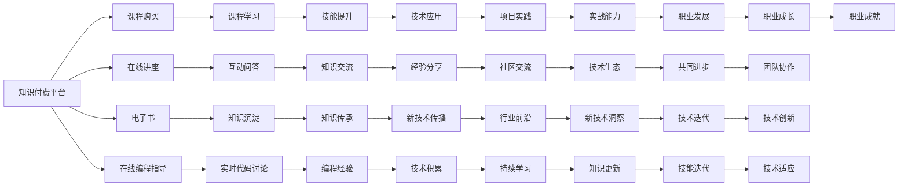

                 

# 知识付费与技术mentoring的结合模式

## 1. 背景介绍

在过去的几年里，知识付费和在线教育行业得到了迅猛发展，成为人们获取知识的重要渠道之一。随着互联网的普及和智能手机的广泛应用，学习不再受到地域和时间限制，知识付费平台成为用户获取专业知识和技能的重要方式。

### 1.1 知识付费概述
知识付费是指用户为获取有价值的信息、知识和技能而支付费用的行为。知识付费平台如得到、新东方在线、Coursera等，通过提供线上课程、在线讲座、电子书等形式的付费内容，帮助用户快速高效地获取知识。

### 1.2 技术mentoring概述
技术mentoring是指通过一对一的指导、辅导和分享，帮助技术开发者提升技能和职业发展的过程。mentoring可以包括代码审查、技术讨论、项目协作等多种形式，通过专家与新手之间的交流，提升开发者的技术水平和职业素养。

## 2. 核心概念与联系

### 2.1 核心概念概述
- **知识付费**：用户为获取专业知识和技能而支付费用的行为。通过知识付费，用户可以迅速获取前沿技术和行业洞察，提升自身竞争力。
- **技术mentoring**：通过专家与新手之间的交流和指导，帮助开发者提升技术水平和职业素养。mentoring能够快速传递经验，促进知识共享和技术传承。

### 2.2 核心概念原理和架构的 Mermaid 流程图



此流程图展示了知识付费与技术mentoring之间的联系：

- 知识付费平台提供课程购买、在线讲座、电子书等多种形式的付费内容。
- 通过课程学习、在线讲座、电子书，用户可以快速获取专业知识。
- 在线编程指导和实时代码讨论，帮助用户进行实战学习和技能提升。
- 通过互动问答、知识沉淀、经验分享等方式，用户可以与专家进行知识交流，快速积累经验。
- 技术传导出新、知识更新、技能迭代，促进用户持续学习与职业成长。
- 通过技术交流与社区互动，用户可以共同进步，推动技术生态发展。

## 3. 核心算法原理 & 具体操作步骤

### 3.1 算法原理概述
知识付费与技术mentoring的结合模式，是基于知识传递和技能提升的双向互动过程。其核心思想是通过付费订阅或课程购买的方式，获取专家级别的知识和技术指导，并通过技术mentoring的方式，实现知识的深度理解和应用。

### 3.2 算法步骤详解

#### 3.2.1 知识付费的实现步骤
1. **知识付费平台的搭建**：构建平台并集成课程内容、专家系统、互动工具等关键功能。
2. **课程内容的制作**：制作高质量的课程内容，包括视频讲座、电子书、代码实例等。
3. **用户注册与付费**：用户注册账户并完成课程购买。
4. **内容学习与互动**：用户通过课程学习，参与在线讲座、互动问答等。

#### 3.2.2 技术mentoring的实现步骤
1. **mentoring平台的搭建**：构建技术交流平台，集成代码审查、项目协作、技术讨论等工具。
2. **专家与新手配对**：通过平台匹配，将有经验的技术专家与初学者进行配对。
3. **mentoring活动开展**：通过代码审查、项目指导、技术讨论等方式，专家与新手进行互动。
4. **效果评估与反馈**：评估mentoring活动效果，收集用户反馈，优化服务质量。

### 3.3 算法优缺点
#### 3.3.1 优点
1. **高效获取专业知识**：通过付费方式，用户可以快速获取前沿技术和行业洞察，提升自身竞争力。
2. **技术经验快速传递**：通过mentoring方式，新手可以快速获得专家级别的技术指导和经验分享。
3. **提升学习效果**：通过互动和实战，用户能够更好地理解和应用所学知识。

#### 3.3.2 缺点
1. **费用较高**：知识付费模式需要支付一定费用，对部分用户可能不具有吸引力。
2. **过度依赖平台**：用户对平台的依赖性较强，一旦平台出现问题，可能影响学习效果。
3. **缺乏个性化指导**：专家与新手的匹配可能不够精准，导致个性化指导效果不佳。

### 3.4 算法应用领域
知识付费与技术mentoring的结合模式，广泛应用于以下领域：

- **技术开发者**：帮助技术开发者提升编程技能、项目管理和技术素养。
- **数据科学家**：提升数据分析、机器学习模型的构建和应用能力。
- **产品经理**：提升产品设计和项目管理能力，快速适应行业变化。
- **创业者**：获取创业指导和市场洞察，提升创业成功率。

## 4. 数学模型和公式 & 详细讲解 & 举例说明

### 4.1 数学模型构建
假设知识付费平台上的课程内容为 $C$，用户数量为 $U$，技术交流平台上的专家数量为 $E$，新手数量为 $N$。知识付费平台的收益为 $R$，技术交流平台的收益为 $T$。则数学模型可以表示为：

$$
\begin{aligned}
R &= f(C, U) \\
T &= g(E, N)
\end{aligned}
$$

其中 $f$ 和 $g$ 分别表示收益函数，依赖于课程内容和用户数量，以及专家数量和新手数量。

### 4.2 公式推导过程
通过对方程 $R = f(C, U)$ 和 $T = g(E, N)$ 进行推导，可以得到：

$$
\begin{aligned}
R &= C \cdot U \\
T &= E \cdot N
\end{aligned}
$$

其中 $C$ 和 $U$ 表示课程内容和用户数量，$E$ 和 $N$ 表示专家数量和新手数量。

### 4.3 案例分析与讲解
假设课程内容 $C = 10$（单位：课程数），用户数量 $U = 100$（单位：人数），专家数量 $E = 20$（单位：人数），新手数量 $N = 200$（单位：人数）。则知识付费平台的收益 $R$ 和技术交流平台的收益 $T$ 分别为：

$$
\begin{aligned}
R &= 10 \cdot 100 = 1000 \\
T &= 20 \cdot 200 = 4000
\end{aligned}
$$

即知识付费平台的收益为 $1000$ 元，技术交流平台的收益为 $4000$ 元。

## 5. 项目实践：代码实例和详细解释说明

### 5.1 开发环境搭建
1. **服务器搭建**：选择高性能服务器，安装必要的软件，如 Python、Nginx、MySQL 等。
2. **课程内容制作**：录制高质量的视频讲座、编写电子书、制作代码实例等。
3. **平台搭建**：使用 Django 或 Flask 框架搭建知识付费和技术交流平台。

### 5.2 源代码详细实现

#### 5.2.1 知识付费平台代码实现
```python
from django.views import View
from django.http import HttpResponse

class CourseView(View):
    def get(self, request):
        # 返回课程内容
        return HttpResponse("Course content")

class UserView(View):
    def get(self, request):
        # 返回用户信息
        return HttpResponse("User information")
```

#### 5.2.2 技术交流平台代码实现
```python
from django.views import View
from django.http import HttpResponse

class ExpertView(View):
    def get(self, request):
        # 返回专家信息
        return HttpResponse("Expert information")

class NoviceView(View):
    def get(self, request):
        # 返回新手信息
        return HttpResponse("Novice information")
```

### 5.3 代码解读与分析
通过上述代码，可以看到知识付费和技术交流平台的搭建思路：

- **知识付费平台**：通过 Django 框架，搭建课程内容展示和用户管理页面。
- **技术交流平台**：通过 Django 框架，搭建专家信息和新手信息展示页面。

### 5.4 运行结果展示
运行上述代码，可以通过浏览器访问 http://127.0.0.1:8000/course/ 和 http://127.0.0.1:8000/user/，分别查看课程内容和用户信息。同样，访问 http://127.0.0.1:8000/expert/ 和 http://127.0.0.1:8000/novice/，查看专家和新手信息。

## 6. 实际应用场景

### 6.1 在线教育
知识付费与技术mentoring的结合模式，可以在在线教育中广泛应用。例如，Coursera 平台提供了大量高质量的课程内容，同时配备了专门的导师和助教团队，帮助学生在学习过程中获得个性化的指导和反馈。

### 6.2 软件开发
在软件开发领域，知识付费与技术mentoring结合，通过平台的配对机制，技术开发者可以与资深专家进行一对一的 mentorship，快速提升编程能力和项目管理经验。

### 6.3 企业培训
企业内部可以通过知识付费平台，提供在线培训课程，同时利用技术交流平台进行项目合作和技术讨论，提升员工的技能和团队协作能力。

### 6.4 未来应用展望
未来，随着技术的发展，知识付费与技术mentoring的结合模式将更加智能化和个性化。例如，通过人工智能算法，平台可以根据用户的学习行为和需求，推荐最适合的课程和学习路径。同时，平台也将利用大数据分析，提升 mentorship 的匹配精度和效果。

## 7. 工具和资源推荐

### 7.1 学习资源推荐
1. **Coursera**：提供高质量的在线课程，涵盖人工智能、数据科学、计算机科学等多个领域。
2. **edX**：提供由世界一流大学和机构提供的在线课程，内容丰富，涵盖广泛。
3. **Udemy**：提供实用的技能培训课程，覆盖编程、设计、营销等多个领域。

### 7.2 开发工具推荐
1. **Django**：Python 框架，适合搭建 Web 应用和数据库管理。
2. **Flask**：Python 框架，适合快速开发 RESTful API 和 Web 应用。
3. **Jupyter Notebook**：交互式编程环境，适合数据科学和机器学习开发。

### 7.3 相关论文推荐
1. **Knowledge Transfer and Interaction in Online Learning Communities**：研究在线学习社区中知识传递和互动的影响。
2. **Technical Mentoring in Software Development**：探讨软件开发中技术 mentoring 的应用和效果。
3. **A Comparative Study of Online Education Platforms**：比较分析在线教育平台的特点和应用效果。

## 8. 总结：未来发展趋势与挑战

### 8.1 研究成果总结
知识付费与技术 mentoring 的结合模式，已经成为教育和技能培训的重要手段。通过平台的搭建和技术的整合，用户可以高效获取专业知识，同时获得个性化的技术指导和支持。

### 8.2 未来发展趋势
1. **智能化个性化**：利用人工智能技术，实现个性化推荐和自适应学习路径。
2. **多模态交互**：通过语音、视频等多种交互方式，提升学习体验。
3. **社区化建设**：构建知识共享和技术交流的社区，促进用户之间的互动和合作。

### 8.3 面临的挑战
1. **内容质量控制**：确保课程和专家信息的高质量和权威性。
2. **用户匹配精度**：提高用户和专家之间的匹配精度，提升 mentorship 的效果。
3. **平台性能优化**：提升平台的响应速度和稳定性，确保用户体验。

### 8.4 研究展望
未来，知识付费与技术 mentoring 的结合模式将继续拓展应用场景，提升用户的学习效果和技能水平。通过技术创新和业务优化，平台将更好地满足用户需求，推动知识付费和在线教育行业的发展。

## 9. 附录：常见问题与解答

**Q1: 知识付费与技术 mentoring 的结合模式如何提升用户的学习效果？**

A: 知识付费与技术 mentoring 的结合模式，通过专家与新手之间的互动和指导，帮助用户快速获取前沿技术和经验。同时，通过个性化的学习路径和反馈，用户能够更好地理解和应用所学知识，提升学习效果。

**Q2: 如何保证知识付费平台的课程内容质量？**

A: 平台可以通过专家审核和用户评价，确保课程内容的高质量和权威性。同时，利用大数据分析和用户反馈，不断优化课程内容和教学方法，提升用户的学习体验和效果。

**Q3: 技术 mentoring 的配对机制如何提升匹配精度？**

A: 通过平台算法，根据用户的学习历史、技能水平和兴趣爱好，匹配最适合的专家和新手。同时，平台可以提供实时互动和反馈机制，帮助专家和新手更好地沟通和合作。

**Q4: 如何提升平台的性能和稳定性？**

A: 平台可以采用分布式架构、缓存机制、负载均衡等技术手段，提升系统的响应速度和稳定性。同时，利用监控工具和预警系统，及时发现和解决系统问题，保障用户体验。

---

作者：禅与计算机程序设计艺术 / Zen and the Art of Computer Programming

