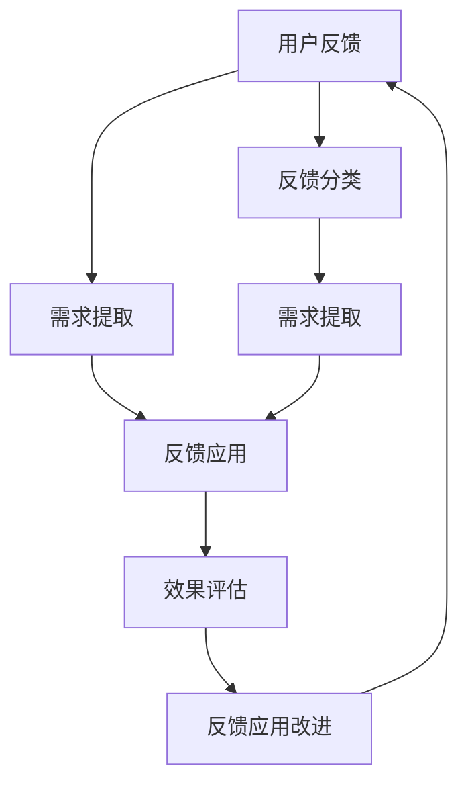

                 

## 1. 背景介绍

随着互联网经济的快速发展，知识付费市场呈现爆炸式增长。用户通过订阅各种在线课程、音频节目、电子书等形式，获取有价值的知识内容。知识付费产品不仅满足了用户对于高质量、专业化知识的渴求，也驱动了教育行业的数字化转型。然而，尽管知识付费产品市场蓬勃发展，其质量参差不齐，用户体验差异明显，用户满意度相对较低。为了提升产品的用户价值，知识付费平台亟需建立有效的用户反馈收集机制，精准挖掘用户需求，并根据用户反馈持续优化产品功能和服务，从而提升用户黏性和留存率。

### 1.1 问题由来

当前知识付费产品普遍面临如下挑战：

- **内容同质化**：众多知识付费平台提供的课程和内容类型相似，缺乏差异化，导致用户难以选择。
- **体验欠佳**：部分平台的交互界面设计不合理，功能模块存在冗余或缺失，影响用户体验。
- **反馈机制薄弱**：很多平台缺乏系统的用户反馈收集机制，导致用户需求被忽视，反馈信息处理效率低下。
- **持续优化不足**：由于缺乏有效的反馈应用机制，平台难以根据用户反馈快速迭代优化产品功能，导致用户流失。

### 1.2 问题核心关键点

构建用户反馈收集与应用系统的关键在于：

- **数据采集**：高效、全面地采集用户反馈信息，确保数据的准确性和代表性。
- **数据处理**：对收集到的反馈数据进行有效的预处理和分析，提取有价值的用户需求和意见。
- **决策支持**：将分析结果转化为业务决策支持，指导产品优化和功能开发。
- **效果评估**：建立反馈效果评估指标，跟踪用户满意度提升效果，持续改进反馈收集与处理流程。

通过用户反馈收集与应用系统的建立，平台可以有效识别用户痛点和需求，精准引导产品迭代，提升用户满意度，增强用户粘性。

### 1.3 问题研究意义

构建知识付费产品的用户反馈收集与应用系统，对于提升平台的用户体验和产品价值具有重要意义：

- **提升用户体验**：通过收集和分析用户反馈，及时改进产品缺陷，增强用户使用便捷性和满意度。
- **差异化竞争**：精准把握用户需求，打造具有差异化竞争力的知识付费产品，在激烈的市场竞争中脱颖而出。
- **提高运营效率**：通过自动化反馈处理流程，减少人工操作，提高反馈处理效率和决策速度。
- **增强用户粘性**：及时响应用户需求，提升用户忠诚度和长期留存率，增强平台市场竞争力。

## 2. 核心概念与联系

### 2.1 核心概念概述

为更好地理解用户反馈收集与应用系统，本节将介绍几个关键概念：

- **用户反馈（User Feedback）**：用户在使用产品过程中，对产品功能、内容、体验等方面提出意见和建议。
- **反馈分类（Feedback Classification）**：对用户反馈进行分类处理，便于按需进行分析和响应。
- **需求提取（Requirement Extraction）**：从用户反馈中提取实际需求，指导产品优化和功能开发。
- **反馈应用（Feedback Application）**：将需求转化为实际的产品改进和功能优化，以解决用户痛点。
- **效果评估（Feedback Effect Evaluation）**：对反馈应用效果进行评估，衡量改进措施的实际效果和用户满意度提升情况。

这些概念之间的逻辑关系可以通过以下Mermaid流程图来展示：



这个流程图展示了一整套用户反馈收集与应用流程：

1. 用户反馈：用户在使用产品过程中提出反馈信息。
2. 反馈分类：对收集到的反馈信息进行初步分类处理，便于后续分析。
3. 需求提取：从分类后的反馈中提取用户需求。
4. 反馈应用：将需求转化为实际的产品改进和功能优化。
5. 效果评估：评估反馈应用效果，收集改进反馈。
6. 反馈应用改进：基于效果评估反馈，持续改进反馈处理流程。

## 3. 核心算法原理 & 具体操作步骤
### 3.1 算法原理概述

用户反馈收集与应用系统的主要工作流程如下：

1. **数据采集**：通过API接口、用户界面、第三方渠道等方式，全面收集用户反馈信息。
2. **数据处理**：对采集到的数据进行去重、清洗、分类等预处理操作。
3. **需求提取**：利用自然语言处理技术，从用户反馈中提取用户需求，生成需求列表。
4. **需求分析**：根据需求列表，进行需求分析，确定优先级和解决方案。
5. **反馈应用**：将需求解决方案转化为实际的产品改进和功能优化。
6. **效果评估**：利用用户满意度调查、功能使用统计等手段，评估反馈应用效果。
7. **反馈改进**：根据效果评估结果，不断优化反馈收集与处理流程。

### 3.2 算法步骤详解

**Step 1: 数据采集**

数据采集是用户反馈收集与应用系统的第一步，通过多渠道多方式收集用户反馈信息：

- API接口：设置API接口，用户可通过请求接口提交反馈信息。
- 用户界面：在产品界面中添加反馈按钮，用户可提交反馈意见。
- 第三方渠道：通过社交媒体、邮件、客服渠道等收集用户反馈。

**Step 2: 数据处理**

数据处理是对采集到的反馈信息进行初步清洗和预处理，主要包括：

- 去重：去除重复反馈信息，确保反馈的唯一性。
- 清洗：去除无效、无关信息，保证反馈的有效性。
- 分类：对反馈信息进行分类，如内容建议、功能缺陷、用户体验等。

**Step 3: 需求提取**

需求提取是提取用户反馈中的实际需求，生成需求列表。可以使用自然语言处理技术：

- 文本预处理：去除停用词、标点符号等噪音，分词、词性标注等。
- 实体抽取：从文本中抽取关键实体，如功能、问题等。
- 意图识别：识别用户反馈的意图，判断是否为需求。
- 需求提取：从意图识别结果中提取具体需求。

**Step 4: 需求分析**

需求分析是对需求列表进行分析和优先级排序，确定需求的解决方案。主要方法包括：

- 需求分类：将需求按功能、性能、体验等分类，便于分析。
- 优先级排序：根据需求紧急程度、影响范围等，确定需求优先级。
- 解决方案确定：为每个需求确定具体的解决方案，如功能改进、UI优化等。

**Step 5: 反馈应用**

反馈应用是将需求解决方案转化为实际的产品改进和功能优化，具体步骤包括：

- 需求评审：对需求解决方案进行评审，确保方案可行。
- 产品设计：根据需求解决方案，进行产品功能设计和界面优化。
- 开发实现：将设计方案转化为具体功能模块，进行开发实现。
- 测试验证：对开发完成的功能模块进行测试验证，确保功能正常。

**Step 6: 效果评估**

效果评估是对反馈应用效果的评估，主要手段包括：

- 用户满意度调查：通过问卷调查、用户访谈等手段，评估用户满意度。
- 功能使用统计：统计改进后的功能模块使用情况，分析用户使用频率和效果。
- A/B测试：对改进前后的功能模块进行A/B测试，比较用户使用效果。

**Step 7: 反馈改进**

反馈改进是根据效果评估结果，不断优化反馈收集与处理流程，主要包括：

- 反馈流程优化：优化反馈收集和处理流程，提高效率。
- 数据质量提升：提高数据采集和清洗质量，保证反馈数据的准确性。
- 需求提取改进：改进需求提取算法，提高需求提取准确度。

### 3.3 算法优缺点

用户反馈收集与应用系统的主要优点包括：

- **用户体验提升**：通过及时收集和处理用户反馈，优化产品功能和服务，提升用户体验。
- **产品差异化**：精准把握用户需求，打造具有差异化竞争力的知识付费产品。
- **运营效率提升**：自动化反馈处理流程，提高反馈处理效率和决策速度。
- **用户粘性增强**：及时响应用户需求，提升用户满意度和忠诚度。

然而，该系统也存在一定的局限性：

- **数据采集难度**：需要多方渠道多方式收集数据，对平台的技术和运营能力要求较高。
- **需求提取挑战**：用户反馈多样性大，需求提取算法复杂，准确度存在挑战。
- **反馈效果评估复杂**：用户反馈与需求转化效果评估涉及多个维度，评估指标复杂。
- **反馈应用周期长**：需求分析和产品开发周期长，反馈处理效率较低。

尽管存在这些局限性，但用户反馈收集与应用系统的建立对于知识付费产品的优化和迭代具有重要意义，值得进一步研究和探索。

### 3.4 算法应用领域

用户反馈收集与应用系统在知识付费产品中有着广泛的应用场景：

- **内容优化**：通过用户反馈，优化课程内容，提升用户学习效果。
- **功能改进**：根据用户反馈，改进产品功能模块，增强用户使用便捷性。
- **界面优化**：根据用户反馈，优化用户界面设计，提升用户体验。
- **推荐系统改进**：根据用户反馈，优化推荐算法，提升内容推荐精准度。
- **客服优化**：根据用户反馈，优化客服服务流程，提高用户满意度。

除了知识付费产品外，用户反馈收集与应用系统在其他互联网产品中也具有广泛的应用前景，如电商、社交、金融等领域，通过精准把握用户需求，提升产品性能和用户满意度，驱动业务持续发展。

## 4. 数学模型和公式 & 详细讲解 & 举例说明

### 4.1 数学模型构建

用户反馈收集与应用系统的主要数学模型包括：

- **用户反馈数据模型**：用户反馈数据的采集、处理和存储。
- **需求提取模型**：利用自然语言处理技术，从用户反馈中提取需求。
- **需求分析模型**：对需求进行分类、排序和解决方案确定。
- **反馈应用模型**：将需求转化为实际的功能改进和产品优化。
- **效果评估模型**：评估反馈应用效果，评估指标和评估方法。

### 4.2 公式推导过程

以下对用户反馈数据模型和需求提取模型进行详细推导。

#### 用户反馈数据模型

设用户反馈数据集为 $D = \{(x_i, y_i)\}_{i=1}^N$，其中 $x_i$ 表示用户反馈的文本，$y_i$ 表示反馈类型（如内容、功能、体验等）。

对 $x_i$ 进行文本预处理和分词操作，得到分词后的文本 $w_i$，即 $x_i = \text{preprocess}(x_i)$。

根据反馈类型 $y_i$，将分词后的文本 $w_i$ 进行分类处理，得到分类结果 $z_i$，即 $z_i = \text{classify}(y_i, w_i)$。

#### 需求提取模型

设用户反馈中需求的数量为 $M$，需求列表为 $R = \{(r_j, c_j)\}_{j=1}^M$，其中 $r_j$ 表示需求文本，$c_j$ 表示需求类别（如功能、性能等）。

对需求文本 $r_j$ 进行实体抽取，得到实体列表 $e_j$，即 $e_j = \text{extract}(r_j)$。

对实体列表 $e_j$ 进行意图识别，得到意图列表 $i_j$，即 $i_j = \text{identify}(e_j)$。

对意图列表 $i_j$ 进行需求提取，得到需求列表 $r_j$，即 $r_j = \text{extract}(i_j)$。

### 4.3 案例分析与讲解

以知识付费产品中的功能优化为例，分析用户反馈收集与应用系统的应用过程：

1. **数据采集**：用户通过产品界面提交功能优化建议。
2. **数据处理**：平台对用户反馈进行去重、清洗和分类，去除无关信息。
3. **需求提取**：利用NLP技术，从功能优化建议中提取具体需求，如“希望增加视频播放控制功能”。
4. **需求分析**：对需求进行优先级排序，确定解决方案，如“优先解决视频播放控制功能缺陷”。
5. **反馈应用**：根据需求解决方案，进行产品设计和功能开发，实现视频播放控制功能。
6. **效果评估**：通过用户满意度调查，评估功能优化效果，收集用户反馈。
7. **反馈改进**：根据用户反馈，优化功能优化流程，提高处理效率。

## 5. 项目实践：代码实例和详细解释说明

### 5.1 开发环境搭建

在进行用户反馈收集与应用系统的开发前，需要先搭建开发环境。以下是使用Python进行Flask开发的开发环境配置流程：

1. 安装Anaconda：从官网下载并安装Anaconda，用于创建独立的Python环境。

2. 创建并激活虚拟环境：
```bash
conda create -n feedback-env python=3.8 
conda activate feedback-env
```

3. 安装Flask：
```bash
pip install flask
```

4. 安装SQLAlchemy和Flask-SQLAlchemy：
```bash
pip install sqlalchemy flask-sqlalchemy
```

5. 安装Werkzeug：
```bash
pip install werkzeug
```

6. 安装Flask-WTF：
```bash
pip install flask-wtf
```

完成上述步骤后，即可在`feedback-env`环境中开始开发实践。

### 5.2 源代码详细实现

这里我们以知识付费产品的用户反馈收集与应用系统的开发为例，给出完整的Flask代码实现。

首先，定义数据模型：

```python
from flask_sqlalchemy import SQLAlchemy
from flask_wtf import FlaskForm
from wtforms import StringField, SubmitField

db = SQLAlchemy()

class Feedback(db.Model):
    id = db.Column(db.Integer, primary_key=True)
    user_id = db.Column(db.Integer, nullable=False)
    content = db.Column(db.String(256), nullable=False)
    category = db.Column(db.String(20), nullable=False)
    status = db.Column(db.String(20), nullable=False)
    created_at = db.Column(db.DateTime, default=db.func.current_timestamp())
    updated_at = db.Column(db.DateTime, default=db.func.current_timestamp(), onupdate=db.func.current_timestamp())

class FeedbackForm(FlaskForm):
    user_id = StringField('User ID', render_kw={'placeholder': 'User ID'})
    content = StringField('Content', render_kw={'placeholder': 'Content'})
    category = StringField('Category', render_kw={'placeholder': 'Category'})
    submit = SubmitField('Submit')
```

然后，定义视图函数：

```python
from flask import render_template, request, redirect, url_for
from flask_login import login_required, current_user
from . import app, db
from .models import Feedback
from .forms import FeedbackForm

@app.route('/feedback', methods=['GET', 'POST'])
@login_required
def feedback():
    form = FeedbackForm()
    if form.validate_on_submit():
        feedback = Feedback(user_id=form.user_id.data, content=form.content.data, category=form.category.data, status='new')
        db.session.add(feedback)
        db.session.commit()
        return redirect(url_for('feedback'))
    return render_template('feedback.html', form=form)
```

最后，定义路由和视图函数：

```python
@app.route('/feedback/list')
@login_required
def feedback_list():
    feedbacks = Feedback.query.filter_by(user_id=current_user.id).order_by(Feedback.created_at.desc()).all()
    return render_template('feedback_list.html', feedbacks=feedbacks)
```

以上代码实现了知识付费产品用户反馈收集与应用系统的基本功能，包括数据模型定义、表单验证、视图函数、路由配置等。

### 5.3 代码解读与分析

让我们再详细解读一下关键代码的实现细节：

**Feedback类**：
- `id`：主键，唯一标识每个反馈记录。
- `user_id`：用户ID，关联用户信息。
- `content`：反馈内容，记录用户具体的反馈意见。
- `category`：反馈类别，如内容、功能、体验等。
- `status`：反馈状态，如待处理、已处理等。
- `created_at`：创建时间，记录反馈记录的创建时间。
- `updated_at`：更新时间，记录反馈记录的最后一次更新时间。

**FeedbackForm类**：
- `user_id`：用户ID，用于关联用户信息。
- `content`：反馈内容，用户在提交表单时填写的具体反馈意见。
- `category`：反馈类别，用户在提交表单时选择的反馈类型。
- `submit`：提交按钮，用于提交用户反馈。

**视图函数**：
- `feedback`：获取用户反馈表单，验证用户输入，将有效反馈记录到数据库中，并返回主页。
- `feedback_list`：获取用户历史反馈列表，按时间倒序排列，展示给用户。

通过上述代码，可以看到，使用Flask进行用户反馈收集与应用系统的开发，代码实现简洁高效。开发者可以将更多精力放在数据模型设计和业务逻辑优化上，而不必过多关注底层的Web框架细节。

当然，实际系统还需要考虑更多的因素，如用户权限管理、数据安全保护、系统监控等。但核心的反馈收集与应用逻辑基本与此类似。

### 5.4 运行结果展示

运行以上代码后，用户可以在产品界面中提交反馈，系统自动将反馈信息存储到数据库中，并在管理界面中展示给管理员。管理员可以通过查看反馈信息，进行需求分析、优先级排序和反馈处理。

## 6. 实际应用场景

### 6.1 智能客服系统

智能客服系统是知识付费产品的重要组成部分，用户可以通过客服渠道反馈产品问题，提出功能优化建议。平台通过用户反馈收集与应用系统，及时收集和处理用户反馈，优化客服响应流程，提升用户体验。

**应用场景**：
- **问题收集**：通过客服渠道收集用户反馈，了解常见问题。
- **需求分析**：对收集到的反馈信息进行分类、排序和需求提取。
- **功能优化**：根据用户需求，进行功能开发和客服流程优化。
- **效果评估**：通过用户满意度调查，评估功能优化效果。

### 6.2 个性化推荐系统

个性化推荐系统通过用户反馈，优化推荐算法，提升内容推荐精准度。平台通过用户反馈收集与应用系统，及时收集用户对推荐结果的评价，优化推荐模型，增强用户体验。

**应用场景**：
- **推荐效果评估**：通过用户反馈，评估推荐系统的效果，识别用户不满意的部分。
- **需求提取**：从用户反馈中提取具体需求，优化推荐算法。
- **模型优化**：根据用户反馈，优化推荐模型，提升推荐效果。
- **用户满意度提升**：通过持续优化，提升用户对推荐系统的满意度。

### 6.3 内容质量监控

内容质量监控是知识付费产品的重要功能，通过用户反馈，及时发现并处理内容问题，提升内容质量。平台通过用户反馈收集与应用系统，及时收集和处理用户反馈，优化内容审核流程，提升内容质量。

**应用场景**：
- **内容问题识别**：通过用户反馈，识别内容中的问题，如错误信息、版权侵权等。
- **需求分析**：对内容问题进行分类、排序和需求提取。
- **内容优化**：根据用户需求，优化内容审核流程，提高内容质量。
- **效果评估**：通过用户满意度调查，评估内容优化效果。

### 6.4 未来应用展望

随着知识付费产品的不断发展，用户反馈收集与应用系统的应用场景将更加广泛。未来，该系统将在更多领域得到应用，为互联网产品带来新的变革。

**展望**：
- **多渠道数据采集**：除了用户界面，还将通过社交媒体、论坛、邮件等多种渠道收集反馈信息，扩大数据采集范围。
- **AI辅助分析**：引入AI技术，自动进行用户反馈分类和需求提取，提高处理效率。
- **实时反馈处理**：实现实时反馈处理，缩短反馈处理时间，提高用户满意度。
- **跨产品应用**：将用户反馈收集与应用系统扩展到其他互联网产品中，如电商、金融、社交等，提升整体用户体验。

## 7. 工具和资源推荐

### 7.1 学习资源推荐

为了帮助开发者系统掌握用户反馈收集与应用技术，这里推荐一些优质的学习资源：

1. **Flask官方文档**：Flask官方文档提供了详细的API参考和示例，适合初学者快速上手。
2. **SQLAlchemy官方文档**：SQLAlchemy官方文档详细介绍了ORM和SQL表达式的使用方法，适合进行数据库操作。
3. **Flask-WTF官方文档**：Flask-WTF官方文档提供了表单验证和数据验证的详细说明，适合进行数据处理。
4. **NLP书籍推荐**：《自然语言处理综论》、《深度学习自然语言处理》等书籍，系统介绍了NLP的基本概念和应用方法。
5. **AI论文推荐**：《知识图谱：表示与学习》、《机器学习：理论与算法》等论文，系统介绍了AI技术的基本概念和应用方法。

通过对这些资源的学习实践，相信你一定能够快速掌握用户反馈收集与应用技术的精髓，并用于解决实际的NLP问题。

### 7.2 开发工具推荐

高效的开发离不开优秀的工具支持。以下是几款用于用户反馈收集与应用系统开发的常用工具：

1. **Flask**：Python轻量级Web框架，适合快速开发API接口和Web界面。
2. **SQLAlchemy**：Python ORM库，适合进行数据库操作，支持多种数据库。
3. **Flask-WTF**：Python表单验证库，适合进行用户输入验证，确保数据安全性。
4. **Werkzeug**：Python WSGI工具库，适合进行中间件开发，增强Web应用的灵活性和扩展性。
5. **Jupyter Notebook**：Python交互式开发环境，适合进行数据分析和算法验证。
6. **TensorBoard**：TensorFlow配套的可视化工具，适合进行模型训练和效果评估。

合理利用这些工具，可以显著提升用户反馈收集与应用系统的开发效率，加快创新迭代的步伐。

### 7.3 相关论文推荐

用户反馈收集与应用技术的快速发展得益于学界的持续研究。以下是几篇奠基性的相关论文，推荐阅读：

1. **数据挖掘与知识发现**：这篇论文介绍了数据挖掘和知识发现的基本概念和应用方法，适合初学者入门。
2. **用户反馈分析**：这篇论文详细介绍了用户反馈分析的基本方法，适合了解用户需求和用户满意度。
3. **推荐系统理论**：这篇论文介绍了推荐系统理论的基本概念和应用方法，适合了解推荐系统算法。
4. **智能客服系统设计**：这篇论文介绍了智能客服系统设计的基本方法，适合了解智能客服系统开发。
5. **知识付费平台优化**：这篇论文介绍了知识付费平台优化的基本方法，适合了解知识付费产品开发。

这些论文代表了大数据技术在用户反馈收集与应用领域的发展脉络。通过学习这些前沿成果，可以帮助研究者把握学科前进方向，激发更多的创新灵感。

## 8. 总结：未来发展趋势与挑战

### 8.1 总结

本文对用户反馈收集与应用系统进行了全面系统的介绍。首先阐述了用户反馈收集与应用系统的研究背景和意义，明确了系统的核心功能和设计原则。其次，从原理到实践，详细讲解了用户反馈收集与应用系统的数学模型和算法流程，给出了用户反馈收集与应用系统的完整代码实例。同时，本文还广泛探讨了用户反馈收集与应用系统在智能客服、个性化推荐、内容质量监控等多个领域的实际应用，展示了系统的广泛应用前景。此外，本文精选了用户反馈收集与应用系统的各类学习资源和开发工具，力求为读者提供全方位的技术指引。

通过本文的系统梳理，可以看到，用户反馈收集与应用系统对于提升产品用户体验和业务价值具有重要意义。构建高效、全面、自动化的用户反馈收集与应用系统，是知识付费产品成功的重要保障。

### 8.2 未来发展趋势

展望未来，用户反馈收集与应用系统将呈现以下几个发展趋势：

1. **数据采集多样化**：除了用户界面，还将通过社交媒体、论坛、邮件等多种渠道收集反馈信息，扩大数据采集范围。
2. **AI辅助分析**：引入AI技术，自动进行用户反馈分类和需求提取，提高处理效率。
3. **实时反馈处理**：实现实时反馈处理，缩短反馈处理时间，提高用户满意度。
4. **跨产品应用**：将用户反馈收集与应用系统扩展到其他互联网产品中，如电商、金融、社交等，提升整体用户体验。
5. **跨领域融合**：将用户反馈收集与应用系统与其他AI技术进行融合，如推荐系统、智能客服、内容质量监控等，形成更加全面、高效的系统。

以上趋势凸显了用户反馈收集与应用系统的发展方向，未来将在更多领域得到应用，为互联网产品带来新的变革。

### 8.3 面临的挑战

尽管用户反馈收集与应用系统已经取得了一定的成果，但在迈向更加智能化、普适化应用的过程中，仍面临诸多挑战：

1. **数据采集难度**：需要多方渠道多方式收集数据，对平台的技术和运营能力要求较高。
2. **需求提取复杂**：用户反馈多样性大，需求提取算法复杂，准确度存在挑战。
3. **反馈效果评估复杂**：用户反馈与需求转化效果评估涉及多个维度，评估指标复杂。
4. **反馈应用周期长**：需求分析和产品开发周期长，反馈处理效率较低。
5. **数据安全保护**：用户反馈数据涉及用户隐私，需要严格的保护措施。

尽管存在这些挑战，但构建用户反馈收集与应用系统对于提升产品用户体验和业务价值具有重要意义，值得进一步研究和探索。

### 8.4 研究展望

面对用户反馈收集与应用系统所面临的种种挑战，未来的研究需要在以下几个方面寻求新的突破：

1. **自动化需求提取**：研究基于NLP和机器学习的方法，自动从用户反馈中提取需求，提高处理效率和准确度。
2. **实时反馈处理**：研究实时反馈处理技术，提高反馈处理效率和用户体验。
3. **跨产品应用**：研究用户反馈收集与应用系统在不同产品中的应用方法，提升整体用户体验。
4. **跨领域融合**：研究用户反馈收集与应用系统与其他AI技术的融合方法，形成更加全面、高效的系统。
5. **数据安全保护**：研究用户反馈数据的保护措施，确保用户隐私和数据安全。

这些研究方向的探索，必将引领用户反馈收集与应用系统迈向更高的台阶，为构建安全、可靠、可解释、可控的智能系统铺平道路。面向未来，用户反馈收集与应用技术还需要与其他人工智能技术进行更深入的融合，如推荐系统、智能客服、内容质量监控等，多路径协同发力，共同推动自然语言理解和智能交互系统的进步。只有勇于创新、敢于突破，才能不断拓展语言模型的边界，让智能技术更好地造福人类社会。

## 9. 附录：常见问题与解答

**Q1: 用户反馈数据如何存储和查询？**

A: 用户反馈数据可以存储在关系型数据库（如MySQL、PostgreSQL）或NoSQL数据库（如MongoDB）中，具体存储方式根据需求和数据量进行设计。查询可以通过SQL语句进行，使用ORM（如SQLAlchemy）进行数据访问，方便进行数据管理和查询操作。

**Q2: 用户反馈数据如何保证安全？**

A: 用户反馈数据涉及用户隐私，需要进行严格的数据保护。可以通过加密存储、访问控制、数据匿名化等手段，确保用户数据的安全性。同时，需要对数据访问进行严格的权限控制，防止未授权访问和数据泄露。

**Q3: 如何提高用户反馈处理的效率？**

A: 提高用户反馈处理效率可以从多个方面进行优化：
- 自动化需求提取：引入自然语言处理和机器学习技术，自动从用户反馈中提取需求，减少人工操作。
- 多渠道数据采集：通过多种渠道收集用户反馈，提高数据采集效率。
- 实时反馈处理：实现实时反馈处理，缩短反馈处理时间。
- 数据预处理：对数据进行去重、清洗、分类等预处理操作，保证数据质量。
- 并发处理：使用并发处理技术，提高反馈处理效率。

**Q4: 如何提高用户反馈处理的准确度？**

A: 提高用户反馈处理准确度可以从多个方面进行优化：
- 自动化需求提取：引入自然语言处理和机器学习技术，自动从用户反馈中提取需求，减少人工操作。
- 需求分类算法：设计高效的需求分类算法，提高分类准确度。
- 需求优先级排序：根据需求紧急程度、影响范围等，确定需求优先级，确保关键需求优先处理。
- 需求验证机制：引入需求验证机制，确保需求的真实性和合理性。
- 反馈效果评估：通过用户满意度调查、功能使用统计等手段，评估反馈应用效果，不断优化反馈处理流程。

**Q5: 如何提高用户反馈处理的满意度？**

A: 提高用户反馈处理满意度可以从多个方面进行优化：
- 自动化需求提取：引入自然语言处理和机器学习技术，自动从用户反馈中提取需求，减少人工操作。
- 实时反馈处理：实现实时反馈处理，缩短反馈处理时间。
- 用户互动机制：引入用户互动机制，如用户评分、用户评论等，提升用户满意度。
- 用户反馈统计：通过用户反馈统计，识别用户痛点和需求，提升用户体验。
- 用户反馈回访：通过用户回访，了解用户对反馈处理的满意度，及时改进反馈处理流程。

通过不断优化用户反馈收集与应用系统，提升用户反馈处理的效率和准确度，增强用户满意度，才能真正实现知识付费产品的优化和迭代，提升用户粘性和留存率，增强平台市场竞争力。总之，用户反馈收集与应用系统需要在数据采集、处理、分析、应用等多个环节进行全面优化，才能真正发挥其应有的作用，推动知识付费产品的持续发展。

---

作者：禅与计算机程序设计艺术 / Zen and the Art of Computer Programming

