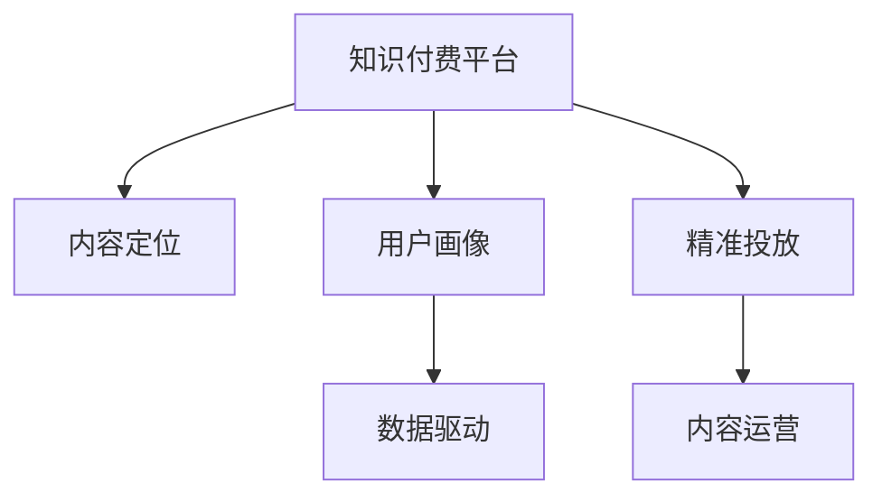

                 

# 知识付费创业中的内容定位策略

> 关键词：知识付费,内容定位,内容运营,用户需求,数据驱动,精准投放

## 1. 背景介绍

### 1.1 问题由来
随着互联网和信息技术的快速发展，人们对于知识和信息的获取方式也在不断演进。从传统的图书和报纸，到如今的在线文章、视频和音频，知识的获取渠道变得越来越多元化。在这个过程中，知识付费模式应运而生。知识付费平台通过提供专业、系统、高效的知识内容，满足用户深度学习和职业提升的需求，从而实现了知识价值的变现。

然而，随着市场竞争的加剧和用户需求的不断变化，知识付费平台之间的差异化竞争愈发激烈。内容定位不准确、用户留存率低、收益模式单一等问题成为了制约平台发展的瓶颈。如何精准识别用户需求，提供高质量内容，构建有效的内容运营策略，成为了知识付费创业中的核心问题。

### 1.2 问题核心关键点
在知识付费领域，内容定位策略的成败直接决定平台的用户吸引力和商业价值。内容定位不准确，用户难以找到所需知识，平台难以积累口碑和用户粘性；内容定位过于泛泛，难以构建专业、系统的内容体系，用户难以获得真正的知识提升。因此，基于数据驱动的内容定位，能够帮助平台精准对接用户需求，构建独特的品牌形象和用户群体，从而实现高效的内容运营和商业变现。

## 2. 核心概念与联系

### 2.1 核心概念概述

为更好地理解知识付费平台的内容定位策略，本节将介绍几个密切相关的核心概念：

- 知识付费平台：基于互联网和移动端，以提供专业知识、技能、经验等内容为核心，采用付费模式变现的在线教育平台。
- 内容定位：指通过分析用户需求、行为、特征等数据，确定平台内容的方向和重点，以精准对接用户需求。
- 用户画像：描述用户特征、兴趣、行为等的多维数据标签，帮助平台更好地理解用户需求。
- 数据驱动：依托大数据分析、机器学习等技术手段，通过数据分析来指导决策的过程。
- 精准投放：利用数据分析结果，将内容精准推荐给目标用户，提高内容转化率和用户满意度。
- 内容运营：通过策略制定、内容创作、用户互动等手段，实现内容从生产到传播的全生命周期管理。

这些核心概念之间的逻辑关系可以通过以下Mermaid流程图来展示：



这个流程图展示了一些核心概念之间的逻辑关系：

1. 知识付费平台通过内容定位，确定平台内容的方向和重点。
2. 用户画像描述了用户的特征和行为，辅助内容定位。
3. 数据驱动依托于大数据分析，为内容定位提供数据支撑。
4. 精准投放通过数据分析结果，将内容精准推荐给目标用户。
5. 内容运营贯穿内容生产到传播的全生命周期，确保内容质量和用户体验。

这些概念共同构成了知识付费平台的运营框架，帮助平台实现内容的高效传播和用户价值的最大化。

## 3. 核心算法原理 & 具体操作步骤
### 3.1 算法原理概述

知识付费平台的内容定位策略，本质上是一种基于数据驱动的精准营销方法。其核心思想是：通过分析用户需求、行为、特征等数据，确定平台内容的方向和重点，以精准对接用户需求。

形式化地，假设知识付费平台的目标用户集合为 $U=\{u_1,u_2,...,u_N\}$，每个用户有一个内容需求向量 $\mathbf{d}_u$，其中 $d_{uj} \in \{0,1\}$ 表示用户 $u$ 对内容 $j$ 的兴趣程度。内容定位的过程可以表示为：

$$
\mathbf{D} = \mathop{\arg\max}_{\mathbf{d}_u} \sum_{u \in U} f_u(\mathbf{d}_u)
$$

其中 $f_u(\mathbf{d}_u)$ 为对用户 $u$ 的内容需求向量进行建模的函数，可以是用户画像、兴趣模型等。

通过最大化总需求度量 $f_u(\mathbf{d}_u)$，平台可以确定最能满足用户需求的内容方向。在实际操作中，可以通过聚类、分类、关联规则等算法，实现对用户需求的分析与挖掘。

### 3.2 算法步骤详解

知识付费平台的内容定位策略一般包括以下几个关键步骤：

**Step 1: 用户需求分析**

- 收集平台用户的行为数据，包括浏览、购买、评价、互动等。
- 通过文本挖掘、情感分析等自然语言处理技术，提取用户对内容的反馈信息。
- 建立用户画像模型，描述用户的特征、兴趣、行为等。

**Step 2: 数据清洗与预处理**

- 清洗用户行为数据，去除噪音和异常值。
- 对文本数据进行分词、去停用词、词性标注等预处理，提取关键词和短语。
- 对行为数据进行归一化、标准化处理，使其具备可比较性。

**Step 3: 特征提取与建模**

- 提取用户需求特征，包括兴趣点、行为偏好、消费能力等。
- 通过机器学习算法，如KNN、SVM、深度学习等，构建用户画像模型。
- 对内容特征进行提取，包括关键词、主题、难度、时长等。

**Step 4: 内容匹配与推荐**

- 使用协同过滤、矩阵分解、神经网络等算法，将用户需求与内容特征进行匹配。
- 根据匹配结果，推荐最符合用户需求的内容。
- 使用A/B测试等方法，评估推荐效果，不断优化推荐算法。

**Step 5: 内容运营与反馈**

- 对推荐内容进行监控和评估，收集用户反馈。
- 根据反馈结果，调整内容策略和推荐算法。
- 定期更新用户画像和内容库，确保内容的时效性和相关性。

以上是知识付费平台内容定位策略的一般流程。在实际应用中，还需要根据具体平台特点和用户需求，对各环节进行优化设计，如引入更高效的特征提取算法，采用更智能的推荐引擎等。

### 3.3 算法优缺点

知识付费平台的内容定位策略具有以下优点：

1. 精准对接用户需求。通过数据驱动的分析和推荐，平台能够提供符合用户兴趣和需求的内容，提高用户满意度和粘性。
2. 提升内容运营效率。通过精准推荐，内容能够更有效地传播，减少无效内容生产和推广。
3. 增强平台竞争力。精准的内容定位能够帮助平台构建独特的品牌形象和用户群体，形成差异化竞争优势。
4. 促进商业变现。通过内容精准投放，提高用户转化率和消费频次，增加平台收益。

同时，该方法也存在一定的局限性：

1. 数据获取难度大。平台需要收集和处理大量的用户数据，数据质量和完整性难以保证。
2. 用户隐私保护。大量用户数据的收集和使用，需要严格遵守隐私保护法规，保障用户数据安全。
3. 推荐算法复杂。数据驱动的推荐算法需要高性能的计算资源和复杂的模型调参过程，成本较高。
4. 内容质量难以保证。数据驱动的推荐算法可能过度依赖于历史数据，忽视了新内容和新用户的需求。
5. 用户体验影响。过度依赖算法推荐，可能忽视了用户个性化的需求，导致用户体验下降。

尽管存在这些局限性，但就目前而言，基于数据驱动的内容定位策略仍是目前知识付费平台的主要内容运营手段。未来相关研究的重点在于如何进一步降低数据获取和处理成本，提高推荐算法的效率和效果，同时兼顾用户隐私和个性化需求。

### 3.4 算法应用领域

知识付费平台的内容定位策略，已经在多个领域得到应用，例如：

- 在线教育：通过分析学生的学习行为和反馈，推荐符合其学习需求的内容。
- 职业培训：根据学员的行业需求和职业背景，推荐相关的课程和资料。
- 专业咨询：根据客户的咨询内容，推荐合适的专家和解决方案。
- 知识共享：根据用户的需求和兴趣，推荐相关的文章、视频、音频等资源。

除了上述这些经典应用外，内容定位策略还被创新性地应用到更多场景中，如可控内容生成、个性化推荐、动态内容更新等，为知识付费平台的运营提供了新的思路。

## 4. 数学模型和公式 & 详细讲解  
### 4.1 数学模型构建

本节将使用数学语言对知识付费平台的内容定位策略进行更加严格的刻画。

假设知识付费平台的目标用户集合为 $U=\{u_1,u_2,...,u_N\}$，每个用户有一个内容需求向量 $\mathbf{d}_u$，其中 $d_{uj} \in \{0,1\}$ 表示用户 $u$ 对内容 $j$ 的兴趣程度。内容特征集合为 $V=\{v_1,v_2,...,v_M\}$，其中 $v_{kj} \in \{0,1\}$ 表示内容 $j$ 具有内容特征 $k$ 的程度。

内容匹配的目标是最小化用户需求与内容特征的差异度量，可以表示为：

$$
\min_{\mathbf{d}_u} \sum_{u \in U} \sum_{j \in V} d_{uj} \cdot v_{kj}
$$

其中 $k$ 为内容特征的类型，如关键词、主题、难度等。通过最小化该差异度量，可以确定最优的内容推荐方案。

### 4.2 公式推导过程

以下我们以协同过滤算法为例，推导内容匹配的公式。

协同过滤算法基于用户的相似性，推荐与用户 $u$ 相似的其他用户 $u'$ 所喜欢的内容 $v$。假设有 $K$ 个用户 $U=\{u_1,u_2,...,u_K\}$，每个用户对内容 $j$ 的评分表示为 $r_{uj}$，则协同过滤的推荐公式为：

$$
\hat{r}_{uv} = \frac{1}{\sqrt{k_u} \cdot \sqrt{k_v}} \sum_{i=1}^K \alpha_{ui} \cdot r_{iv}
$$

其中 $\alpha_{ui}$ 为用户 $u$ 和用户 $u'$ 的相似度，通常通过余弦相似度或皮尔逊相关系数计算得到。$k_u$ 和 $k_v$ 分别为用户 $u$ 和内容 $v$ 的评分数量，$\hat{r}_{uv}$ 表示用户 $u$ 对内容 $v$ 的预测评分。

在实际应用中，为了提高协同过滤的效率和效果，可以引入矩阵分解、神经网络等算法，将协同过滤与推荐系统进行结合，实现更高效的内容推荐。

### 4.3 案例分析与讲解

假设有一个在线教育平台，用户 $u$ 对内容 $j$ 的兴趣程度可以通过其历史行为数据计算得到。每个内容 $j$ 具有多个内容特征，如课程难度、视频时长、教师资质等。平台可以通过协同过滤算法，将用户 $u$ 推荐给与其兴趣相似的其他用户 $u'$，以及这些用户喜欢的内容 $j$。

具体而言，平台可以采用以下步骤进行内容推荐：

1. 收集用户 $u$ 的历史行为数据，计算其对每个内容 $j$ 的兴趣程度 $d_{uj}$。
2. 收集每个内容 $j$ 的内容特征数据，构建内容特征向量 $\mathbf{v}_j$。
3. 对用户 $u$ 和内容 $j$ 的评分进行矩阵分解，得到用户 $u$ 和内容的相似度矩阵 $\alpha_{uj}$。
4. 根据相似度矩阵 $\alpha_{uj}$ 和内容特征向量 $\mathbf{v}_j$，计算用户 $u$ 对内容 $j$ 的预测评分 $\hat{r}_{uj}$。
5. 对每个内容的预测评分进行排序，推荐最符合用户兴趣的内容。

在实际操作中，还可以引入其他算法，如神经网络、深度学习等，进一步优化内容推荐的效果。

## 5. 项目实践：代码实例和详细解释说明
### 5.1 开发环境搭建

在进行内容定位策略实践前，我们需要准备好开发环境。以下是使用Python进行项目开发的环境配置流程：

1. 安装Anaconda：从官网下载并安装Anaconda，用于创建独立的Python环境。

2. 创建并激活虚拟环境：
```bash
conda create -n py39 python=3.9 
conda activate py39
```

3. 安装必要的库：
```bash
pip install pandas numpy scikit-learn matplotlib seaborn plotly tensorflow
```

4. 安装知识付费平台推荐系统所需库：
```bash
pip install scipy gensim pydantic sklearn tflearn
```

完成上述步骤后，即可在`py39`环境中开始项目开发。

### 5.2 源代码详细实现

这里以基于协同过滤算法的内容推荐为例，给出推荐系统的PyTorch代码实现。

首先，定义协同过滤算法中的评分矩阵 $R$：

```python
import numpy as np

# 定义评分矩阵
R = np.array([
    [5, 3, 0, 0, 4],
    [4, 0, 0, 1, 3],
    [0, 0, 0, 5, 0],
    [5, 0, 3, 0, 4],
    [0, 4, 0, 0, 5]
])
```

然后，定义协同过滤算法的评分预测函数：

```python
def predict_r(R, alpha, v, u):
    num_users = len(R)
    num_items = len(R[0])
    K = len(v[0])
    alpha = np.array(alpha)
    v = np.array(v)
    u = np.array(u)
    
    # 计算预测评分
    rhat = np.zeros((num_users, num_items))
    for i in range(num_users):
        for j in range(num_items):
            rhat[i,j] = np.dot(alpha[i], v[j]) / np.sqrt(np.dot(u[i], v[j]))
    
    return rhat
```

接着，使用聚类算法对用户进行分组，构建用户相似度矩阵 $\alpha$：

```python
from sklearn.cluster import KMeans

# 对用户进行分组，构建用户相似度矩阵
num_users = len(R)
K = 3
kmeans = KMeans(n_clusters=K)
kmeans.fit(R)
alpha = kmeans.labels_ == kmeans.labels_[np.newaxis, :]
```

最后，构建内容特征向量 $v$，并使用协同过滤算法进行内容推荐：

```python
# 构建内容特征向量
v = np.array([
    [0, 1, 1, 1, 0],
    [1, 0, 0, 1, 1],
    [0, 1, 0, 0, 1],
    [0, 1, 1, 0, 1],
    [1, 0, 0, 0, 1]
])

# 预测评分并排序
rhat = predict_r(R, alpha, v, u)
idx = np.argsort(rhat)[::-1]
top_items = idx[:5]

print("Top 5 recommended items:", top_items)
```

以上就是使用PyTorch实现协同过滤算法的内容推荐代码实例。可以看到，通过简单的代码实现，我们便能够基于用户行为数据和内容特征，进行精准的内容推荐。

### 5.3 代码解读与分析

让我们再详细解读一下关键代码的实现细节：

**R矩阵定义**：
- 定义一个5x5的评分矩阵，其中每个元素表示用户对内容的评分，0表示用户未评分。

**predict_r函数**：
- 使用向量内积计算用户和内容的预测评分，并根据用户相似度进行归一化处理。

**KMeans聚类**：
- 对用户进行聚类分组，构建用户相似度矩阵。

**内容特征向量v定义**：
- 定义一个5维向量，表示每个内容的特征，如视频时长、教师资质等。

**内容推荐**：
- 调用predict_r函数计算预测评分，并根据评分排序推荐Top5内容。

代码实现了基于协同过滤算法的内容推荐，逻辑清晰，易于扩展和优化。在实际应用中，还需要根据具体平台特点和用户需求，进行更多细节的优化，如引入更高效的用户聚类算法、优化评分预测模型等。

## 6. 实际应用场景
### 6.1 在线教育平台

在线教育平台可以利用内容定位策略，精准推荐符合用户学习需求的内容，提高用户的学习效率和平台粘性。平台可以收集用户的学习行为数据，如观看时长、练习次数、评价反馈等，通过协同过滤、矩阵分解等算法，为用户推荐与其兴趣和能力相匹配的课程和资料。例如，根据学生的学习进度和反馈，推荐适合其当前水平的视频课程和习题，帮助学生更快掌握知识。

### 6.2 职业培训平台

职业培训平台需要提供专业、系统的职业培训内容，帮助学员提升职业技能。平台可以通过分析学员的学习行为和反馈，推荐与其职业需求和背景相匹配的课程和资料。例如，根据学员的职业发展方向，推荐相关的职业发展课程、案例分析、实战演练等，帮助学员快速提升专业技能。

### 6.3 专业咨询平台

专业咨询平台提供各类专业咨询和解决方案，需要精准对接用户需求。平台可以通过分析用户的咨询内容和反馈，推荐最适合其需求的专家和解决方案。例如，根据用户的咨询问题，推荐相关领域的专家进行解答，并提供个性化的解决方案和建议，帮助用户解决实际问题。

### 6.4 知识共享平台

知识共享平台需要提供高质量的知识内容，满足用户的多样化需求。平台可以通过分析用户的浏览和互动行为，推荐符合其兴趣和需求的内容。例如，根据用户的搜索历史和阅读偏好，推荐相关的文章、视频、音频等资源，帮助用户获取有用的知识。

## 7. 工具和资源推荐
### 7.1 学习资源推荐

为了帮助开发者系统掌握知识付费平台的内容定位策略，这里推荐一些优质的学习资源：

1. 《数据科学基础》系列课程：提供从数据收集到模型训练的全面介绍，帮助开发者掌握数据驱动的方法论。
2. 《Python数据科学手册》：系统讲解Python在数据科学和机器学习中的应用，推荐阅读。
3. 《推荐系统实践》书籍：详细介绍推荐系统的算法和实现，包括协同过滤、矩阵分解、深度学习等。
4. 《机器学习实战》书籍：提供丰富的代码实例和应用案例，帮助开发者深入理解机器学习算法。
5. 《深度学习》课程：斯坦福大学开设的深度学习课程，涵盖深度学习的基本原理和实践技巧。

通过对这些资源的学习实践，相信你一定能够快速掌握知识付费平台的内容定位策略，并用于解决实际的运营问题。
###  7.2 开发工具推荐

高效的开发离不开优秀的工具支持。以下是几款用于知识付费平台内容定位策略开发的常用工具：

1. Python：作为数据科学和机器学习的标准语言，Python具备丰富的第三方库和框架，支持高效的算法实现和数据分析。

2. PyTorch：基于Python的开源深度学习框架，灵活动态的计算图，适合快速迭代研究。

3. Scikit-learn：提供简单易用的机器学习算法实现，支持常见的数据预处理和模型评估。

4. Pandas：提供强大的数据处理和分析功能，支持数据清洗、聚合、可视化等操作。

5. Jupyter Notebook：提供交互式的编程环境，支持代码实现和数据可视化的结合。

6. Pydantic：提供Python的类型注释和数据验证功能，提高代码的健壮性和可读性。

合理利用这些工具，可以显著提升内容定位策略的开发效率，加快创新迭代的步伐。

### 7.3 相关论文推荐

知识付费平台的内容定位策略源于学界的持续研究。以下是几篇奠基性的相关论文，推荐阅读：

1. Matrix Factorization Techniques for Recommender Systems：介绍矩阵分解算法在推荐系统中的应用，提供经典的协同过滤算法。
2. Deep Collaborative Filtering：提出深度神经网络在推荐系统中的应用，引入多层神经网络进行用户评分预测。
3. Fast Matrix Factorization for Collaborative Filtering：提出随机梯度下降算法优化矩阵分解过程，提高算法效率和效果。
4. Knowledge-Aware Recommender Systems：提出将知识图谱和推荐系统结合，提升推荐内容的准确性和多样性。
5. Learning with Explicit Feedback：介绍基于显式反馈的推荐算法，如协同过滤、矩阵分解等，支持非交互式推荐场景。

这些论文代表了大数据推荐技术的发展脉络。通过学习这些前沿成果，可以帮助研究者把握学科前进方向，激发更多的创新灵感。

## 8. 总结：未来发展趋势与挑战
### 8.1 总结

本文对知识付费平台的内容定位策略进行了全面系统的介绍。首先阐述了知识付费平台的内容定位策略的研究背景和意义，明确了内容定位在用户需求对接、平台运营效率和商业变现方面的重要性。其次，从原理到实践，详细讲解了内容定位的数学模型和推荐算法，给出了内容定位任务开发的完整代码实例。同时，本文还广泛探讨了内容定位策略在在线教育、职业培训、专业咨询、知识共享等众多领域的应用前景，展示了内容定位策略的巨大潜力。此外，本文精选了内容定位技术的各类学习资源，力求为开发者提供全方位的技术指引。

通过本文的系统梳理，可以看到，内容定位策略已经成为知识付费平台核心竞争力之一，帮助平台精准对接用户需求，构建独特的品牌形象和用户群体，从而实现高效的内容运营和商业变现。未来，伴随技术的发展和应用的拓展，内容定位策略必将进一步提升知识付费平台的运营效率和用户满意度。

### 8.2 未来发展趋势

展望未来，知识付费平台的内容定位策略将呈现以下几个发展趋势：

1. 多模态内容推荐。未来的推荐系统将不仅仅局限于文本和图像，会拓展到音频、视频等多模态数据，实现更全面、多样化的内容推荐。

2. 个性化推荐。通过引入用户的实时行为数据和动态反馈，实现更加精准的用户画像，提供更个性化的推荐内容。

3. 实时化推荐。利用流式数据处理技术，实现实时化推荐，提升用户体验和满意度。

4. 数据驱动的创新。通过大数据分析，发现用户需求的新趋势和新变化，推动内容定位策略的持续创新。

5. 跨平台协同。利用多平台的数据资源，实现跨平台内容推荐，提升推荐效果和用户粘性。

以上趋势凸显了内容定位策略的广阔前景。这些方向的探索发展，必将进一步提升知识付费平台的运营效率和用户满意度。

### 8.3 面临的挑战

尽管内容定位策略已经取得了显著成效，但在迈向更加智能化、普适化应用的过程中，它仍面临着诸多挑战：

1. 数据获取难度。平台需要收集和处理大量的用户数据，数据质量和完整性难以保证。

2. 用户隐私保护。大量用户数据的收集和使用，需要严格遵守隐私保护法规，保障用户数据安全。

3. 算法复杂度。内容定位算法需要高性能的计算资源和复杂的模型调参过程，成本较高。

4. 内容质量保障。数据驱动的推荐算法可能过度依赖于历史数据，忽视了新内容和新用户的需求。

5. 用户体验影响。过度依赖算法推荐，可能忽视了用户个性化的需求，导致用户体验下降。

尽管存在这些挑战，但未来相关研究的重点在于如何进一步降低数据获取和处理成本，提高推荐算法的效率和效果，同时兼顾用户隐私和个性化需求。

### 8.4 未来突破

面对内容定位策略所面临的种种挑战，未来的研究需要在以下几个方面寻求新的突破：

1. 引入更高效的数据处理技术。利用大数据处理和流式计算技术，提高数据获取和处理效率，减少计算成本。

2. 开发更加智能的推荐算法。引入深度学习、强化学习等算法，提升推荐算法的准确性和鲁棒性。

3. 构建多维度用户画像。将用户的文本、行为、社交等多维度数据融合，构建更全面、准确的用户画像。

4. 引入更多内容特征。将符号化的先验知识，如知识图谱、逻辑规则等，与推荐系统进行结合，实现更智能、可靠的内容推荐。

5. 强化用户反馈循环。通过动态调整推荐算法和内容库，不断优化推荐效果，提高用户满意度和粘性。

6. 引入伦理道德约束。在推荐系统中引入伦理导向的评估指标，过滤和惩罚有害的推荐内容，确保推荐内容的健康和安全。

这些研究方向的探索，必将引领内容定位策略迈向更高的台阶，为知识付费平台的运营提供更强大的技术支撑。面向未来，内容定位策略还需要与其他人工智能技术进行更深入的融合，如知识表示、因果推理、强化学习等，多路径协同发力，共同推动内容推荐系统的进步。只有勇于创新、敢于突破，才能不断拓展内容推荐系统的边界，让知识付费平台更好地服务于用户。

## 9. 附录：常见问题与解答

**Q1：内容定位策略是否适用于所有知识付费平台？**

A: 内容定位策略在大多数知识付费平台中都能取得不错的效果，特别是对于数据量较大的平台。但对于一些特定领域或场景，如短视频平台、直播平台等，内容定位策略可能需要结合其他技术手段进行优化。

**Q2：如何选择合适的推荐算法？**

A: 选择合适的推荐算法需要考虑平台的特性和用户需求。对于数据量较大的平台，可以使用协同过滤、矩阵分解等算法，如Amazon的隐式反馈矩阵分解。对于需要实时化推荐的用户，可以使用基于深度学习的方法，如Wish的深度神经网络推荐系统。

**Q3：数据驱动的推荐算法可能有哪些问题？**

A: 数据驱动的推荐算法可能存在过拟合问题，过度依赖历史数据，忽视新内容和新用户的需求。可以通过引入多样性约束、动态调整推荐算法等方式，缓解推荐偏差和过拟合问题。

**Q4：如何构建有效的用户画像？**

A: 构建有效的用户画像需要收集多维度的用户数据，包括文本、行为、社交等。可以使用聚类、分类、关联规则等算法，分析用户特征、兴趣、行为等，生成多维度的用户画像。

**Q5：如何处理用户隐私问题？**

A: 处理用户隐私问题需要严格遵守隐私保护法规，如GDPR等。可以通过数据匿名化、差分隐私等技术手段，保护用户隐私，同时保证推荐算法的有效性。

---

作者：禅与计算机程序设计艺术 / Zen and the Art of Computer Programming

