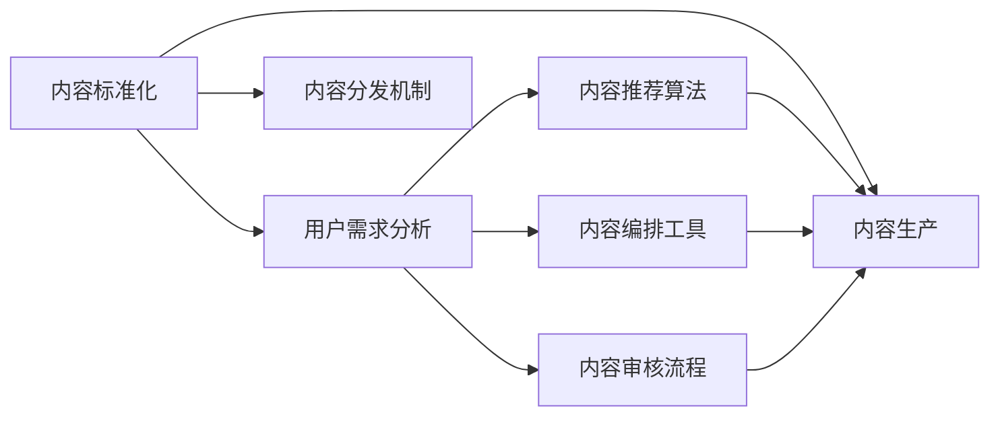

                 

## 1. 背景介绍

随着知识付费行业的快速发展，越来越多的创业者涌入这个领域，但同时也在面临着一个挑战：如何保证内容的质量和一致性？内容的标准化和规模化成为了知识付费创业中的关键问题。本文将围绕内容标准化与规模化，探讨其在知识付费创业中的重要性和具体实现方法。

## 2. 核心概念与联系

### 2.1 核心概念概述

在知识付费创业中，内容的标准化和规模化涉及到以下几个核心概念：

- **内容标准化**：确保同一领域内内容的规范化和一致性，使受众能够获得稳定、可预期的学习体验。
- **内容规模化**：通过技术手段快速生产大量高质量内容，降低成本，提高效率。
- **用户需求分析**：准确理解用户需求，确保内容生产与用户期望相匹配。
- **内容分发机制**：有效分发内容，使用户能够方便地获取和消费。

### 2.2 核心概念原理和架构的 Mermaid 流程图



该流程图展示了内容标准化与规模化的关键环节及其相互联系。用户需求分析驱动内容生产，内容生产过程中需要考虑内容标准化，而内容分发机制则确保内容能够高效地到达用户手中。

## 3. 核心算法原理 & 具体操作步骤

### 3.1 算法原理概述

内容标准化与规模化的核心在于对内容的规范化和高效生产。以下是实现这一目标的核心算法原理：

1. **内容描述语义化**：使用自然语言处理技术对内容进行语义分析，确保内容的关键词、结构、格式等符合标准。
2. **内容质量评估**：通过机器学习模型对内容进行质量评估，识别不合格内容并进行筛选。
3. **内容自动生成**：使用生成对抗网络（GAN）、自然语言生成（NLG）等技术自动生成高质量内容。
4. **内容推荐系统**：构建推荐算法，根据用户行为和偏好，推荐最相关的内容。
5. **内容分发优化**：优化内容分发机制，提高内容到达用户的效率和覆盖率。

### 3.2 算法步骤详解

#### 3.2.1 内容描述语义化

**步骤1:** 定义内容标准

- 确定内容的格式、结构、关键词等规范。例如，文章结构应包括引言、主体、结论；关键词应涵盖文章主题等。

**步骤2:** 文本预处理

- 对文本进行分词、词性标注、命名实体识别等预处理，提取出文章的关键词和主题。

**步骤3:** 语义分析

- 使用BERT、GPT等预训练模型对文本进行语义分析，确保内容符合标准。

#### 3.2.2 内容质量评估

**步骤1:** 定义评估指标

- 设定内容质量评估的标准，如文章长度、内容结构、关键词覆盖度等。

**步骤2:** 构建评估模型

- 使用监督学习模型（如逻辑回归、支持向量机等）对内容进行质量评估，生成二分类结果（合格或不合格）。

**步骤3:** 筛选不合格内容

- 根据评估结果，筛选出不合格内容，进行修正或删除。

#### 3.2.3 内容自动生成

**步骤1:** 构建生成模型

- 使用GAN、NLG等技术构建内容生成模型，设定生成目标和约束条件。

**步骤2:** 训练模型

- 使用标注好的内容数据集对生成模型进行训练，优化生成内容的质量和一致性。

**步骤3:** 生成内容

- 使用训练好的生成模型自动生成高质量内容。

#### 3.2.4 内容推荐系统

**步骤1:** 用户行为数据收集

- 收集用户阅读、点赞、评论等行为数据，分析用户兴趣和偏好。

**步骤2:** 推荐模型构建

- 构建推荐算法（如协同过滤、基于内容的推荐、深度学习推荐等），确保推荐内容的相关性和多样化。

**步骤3:** 内容推荐

- 根据用户行为数据和推荐模型，为用户推荐最相关的内容。

#### 3.2.5 内容分发优化

**步骤1:** 内容存储

- 使用分布式存储技术（如Hadoop、Spark等）存储内容，确保高效读写。

**步骤2:** 内容分发

- 使用CDN、P2P等技术分发内容，优化内容到达用户的速度和带宽。

**步骤3:** 内容缓存

- 使用缓存技术（如Redis、Memcached等）减少服务器的负载，提高内容访问速度。

### 3.3 算法优缺点

#### 3.3.1 内容描述语义化

**优点:**

- 确保内容符合标准，提升用户学习体验。
- 自动化处理文本，节省人力成本。

**缺点:**

- 技术实现复杂，需要大量标注数据训练模型。
- 生成的内容可能缺乏创新性和独特性。

#### 3.3.2 内容质量评估

**优点:**

- 筛选出不合格内容，保证内容质量。
- 自动化处理，提高效率。

**缺点:**

- 模型需要持续更新和维护，维护成本高。
- 对标注数据依赖大，数据质量影响评估结果。

#### 3.3.3 内容自动生成

**优点:**

- 快速生成大量高质量内容，提高效率。
- 降低内容生产成本。

**缺点:**

- 生成的内容可能缺乏深度和创意，用户体验有限。
- 模型需要大量训练数据和计算资源，成本高。

#### 3.3.4 内容推荐系统

**优点:**

- 提高内容相关性和用户满意度。
- 自动化处理用户数据，提高效率。

**缺点:**

- 推荐算法复杂，需要高水平技术支持。
- 数据隐私和安全问题需要谨慎处理。

#### 3.3.5 内容分发优化

**优点:**

- 提升内容分发效率和覆盖率。
- 降低服务器负载，提高服务稳定性。

**缺点:**

- 技术实现复杂，需要大量基础设施投资。
- 分发效率受限于网络带宽和服务器性能。

### 3.4 算法应用领域

内容标准化与规模化技术在知识付费创业中有着广泛的应用，例如：

- **在线教育平台**：通过内容标准化，提升课程质量和用户满意度；通过内容自动生成和推荐系统，个性化推荐学习内容。
- **智能媒体内容生产**：利用内容自动生成技术，快速生产高质量文章、视频等内容；通过内容推荐系统，提升内容消费体验。
- **企业培训**：通过内容标准化和自动生成，快速生产培训材料；通过内容推荐系统，个性化推荐培训内容。

## 4. 数学模型和公式 & 详细讲解 & 举例说明

### 4.1 数学模型构建

在知识付费创业中，内容质量评估和推荐系统是核心技术之一。下面以内容推荐系统为例，介绍其数学模型的构建。

**推荐模型**：

假设用户 $u$ 对 $i$ 个内容项进行评分，评分矩阵为 $R$，$R_{ui}$ 表示用户 $u$ 对内容项 $i$ 的评分。内容项 $i$ 与内容项 $j$ 之间的相似度表示为 $sim(i, j)$。

**目标函数**：

最大化用户与内容项的协同过滤评分，即最大化 $R_{ui}$。

**优化算法**：

使用矩阵分解方法（如奇异值分解SVD）求解最优的评分矩阵 $R$，使得 $R_{ui}$ 尽可能接近实际评分。

### 4.2 公式推导过程

**SVD推荐模型**：

假设用户 $u$ 对 $i$ 个内容项的评分矩阵 $R$ 可以分解为三个矩阵的乘积：

$$
R = U\Sigma V^T
$$

其中 $U$ 和 $V$ 是用户和内容项的特征矩阵，$\Sigma$ 是对角矩阵，对角线上的元素为奇异值。

用户 $u$ 对内容项 $i$ 的预测评分可以表示为：

$$
\hat{R}_{ui} = \sum_{k=1}^{K}u_kv_{ki}
$$

其中 $u_k$ 和 $v_{ki}$ 分别是 $U$ 和 $V$ 矩阵的第 $k$ 列，$K$ 是矩阵的秩。

### 4.3 案例分析与讲解

以在线教育平台为例，内容推荐系统通过分析用户的历史学习行为，为用户推荐感兴趣的新课程。具体实现步骤如下：

**步骤1:** 收集用户学习数据

- 收集用户的历史课程评分、浏览时长、互动行为等数据，构建用户特征矩阵 $U$。

**步骤2:** 构建内容特征矩阵

- 收集所有课程的基本信息、讲师信息、课程标签等数据，构建内容特征矩阵 $V$。

**步骤3:** 矩阵分解求解

- 使用SVD方法对评分矩阵 $R$ 进行分解，求解最优的评分矩阵 $R$。

**步骤4:** 预测用户评分

- 根据分解后的用户特征矩阵 $U$ 和内容特征矩阵 $V$，计算用户 $u$ 对内容项 $i$ 的预测评分 $\hat{R}_{ui}$。

**步骤5:** 排序推荐内容

- 根据预测评分对内容项进行排序，为用户推荐评分最高的课程。

## 5. 项目实践：代码实例和详细解释说明

### 5.1 开发环境搭建

本节将介绍使用Python和PyTorch搭建知识付费创业项目开发环境的具体步骤。

**步骤1:** 安装Python

- 下载Python 3.x版本，确保安装路径在环境变量中。

**步骤2:** 安装PyTorch

- 使用pip安装PyTorch：`pip install torch torchvision torchaudio`。

**步骤3:** 安装其他依赖库

- 安装Tensorboard、Flask等常用库：`pip install tensorboard flask`。

**步骤4:** 配置环境

- 配置Docker环境，以便在容器中运行开发环境。

**步骤5:** 编写代码

- 使用Python和PyTorch编写内容推荐系统的代码。

### 5.2 源代码详细实现

以下是一个基于PyTorch的内容推荐系统实现示例：

```python
import torch
import torch.nn as nn
import torch.optim as optim
from torch.utils.data import DataLoader, Dataset

class UserItemRecommender(nn.Module):
    def __init__(self, user_dim, item_dim, K):
        super(UserItemRecommender, self).__init__()
        self.user_dim = user_dim
        self.item_dim = item_dim
        self.K = K
        
        self.user_mat = nn.Embedding(user_dim, K)
        self.item_mat = nn.Embedding(item_dim, K)
        self.user_b = nn.Parameter(torch.randn(user_dim, 1))
        self.item_b = nn.Parameter(torch.randn(item_dim, 1))
        
    def forward(self, user_idx, item_idx):
        u = self.user_mat(user_idx)
        v = self.item_mat(item_idx)
        b_u = self.user_b[user_idx]
        b_v = self.item_b[item_idx]
        
        u_hat = u * v.t() + b_u.unsqueeze(1) + b_v.unsqueeze(0)
        return u_hat

user_dim = 1000
item_dim = 1000
K = 50
recommender = UserItemRecommender(user_dim, item_dim, K)
criterion = nn.MSELoss()
optimizer = optim.Adam(recommender.parameters(), lr=0.001)

# 准备数据
train_data = torch.randn(user_dim, item_dim) # 模拟训练数据
train_loader = DataLoader(train_data, batch_size=64)
```

### 5.3 代码解读与分析

**代码解读:**

- `UserItemRecommender` 类定义了一个简单的协同过滤推荐模型，包括用户特征矩阵、内容项特征矩阵和偏置向量。
- `forward` 方法计算用户对内容项的预测评分，使用了矩阵乘法和偏置向量。
- `criterion` 和 `optimizer` 分别定义了损失函数和优化器。
- `train_data` 和 `train_loader` 准备训练数据和数据加载器。

**分析:**

- 该代码实现了一个简单的协同过滤推荐模型，通过矩阵分解对评分进行预测。
- 使用了PyTorch的动态图机制，可以方便地进行模型训练和推理。
- 可以进一步优化模型结构，如引入深度学习模块，提高推荐精度。

### 5.4 运行结果展示

运行上述代码，即可训练出一个内容推荐模型。通过调整超参数，可以不断优化模型的预测性能。

## 6. 实际应用场景

### 6.1 在线教育平台

在线教育平台需要为每个用户推荐最适合的课程内容。通过内容推荐系统，平台可以根据用户的历史学习行为和兴趣，动态调整课程推荐策略，提高用户的学习效率和满意度。

### 6.2 智能媒体内容生产

智能媒体平台需要生产大量高质量的文章、视频等内容，以满足用户的多样化需求。通过内容自动生成技术，平台可以快速生产高质量内容，降低成本，提高内容生产和发布的效率。

### 6.3 企业培训

企业培训需要大量的培训材料，以提高员工的专业技能和知识水平。通过内容标准化和自动生成技术，企业可以快速生产高质量的培训材料，提高培训效率。

## 7. 工具和资源推荐

### 7.1 学习资源推荐

为了帮助开发者掌握内容标准化与规模化的技术和方法，这里推荐一些优质的学习资源：

- **《Python深度学习》**：讲解如何使用PyTorch进行内容推荐系统的开发，深入浅出地介绍了推荐算法和模型优化方法。
- **《机器学习实战》**：提供了大量的实际案例，帮助读者理解内容标准化与规模化技术的实现细节。
- **Coursera《深度学习》课程**：由斯坦福大学开设，涵盖深度学习的基础知识和前沿技术，对理解内容推荐系统非常有帮助。
- **Kaggle竞赛**：参与Kaggle的推荐系统竞赛，实战练兵，积累经验。

### 7.2 开发工具推荐

在知识付费创业中，使用合适的工具能够显著提高开发效率和系统性能。以下是几款常用的开发工具：

- **PyTorch**：深度学习框架，提供了丰富的深度学习模型和优化算法，非常适合内容推荐系统的开发。
- **TensorBoard**：用于可视化模型训练和推理过程，方便调试和分析。
- **Flask**：轻量级的Web框架，用于搭建内容推荐系统的Web服务。
- **Docker**：容器化技术，用于管理开发和部署环境，提高系统的可移植性和稳定性。

### 7.3 相关论文推荐

内容标准化与规模化技术的发展离不开学界的持续研究。以下是几篇奠基性的相关论文，推荐阅读：

- **《Item-based collaborative filtering for recommendation systems》**：介绍了协同过滤推荐算法的原理和实现方法。
- **《Contextual Recommendations》**：探讨了上下文信息对推荐系统性能的影响，提出了上下文感知推荐模型。
- **《Neural collaborative filtering》**：使用深度学习模型进行推荐，提升了推荐系统的预测精度。
- **《A deep learning framework for news recommendation》**：介绍了基于深度学习的个性化新闻推荐系统，具有较高的应用价值。

## 8. 总结：未来发展趋势与挑战

### 8.1 总结

本文对知识付费创业中的内容标准化与规模化进行了全面系统的介绍。首先阐述了内容标准化与规模化的重要性和具体实现方法，明确了其在知识付费创业中的核心地位。其次，从原理到实践，详细讲解了内容推荐系统的数学模型和代码实现。同时，本文还广泛探讨了内容标准化与规模化技术在知识付费创业中的应用场景，展示了其在提升用户体验和降低成本方面的巨大潜力。

通过本文的系统梳理，可以看到，内容标准化与规模化技术在知识付费创业中发挥着越来越重要的作用，大大提升了内容生产的效率和质量。未来，伴随技术的不断进步，内容标准化与规模化必将成为知识付费创业的关键竞争力，推动行业向更加智能化、规模化的方向发展。

### 8.2 未来发展趋势

展望未来，内容标准化与规模化技术将呈现以下几个发展趋势：

1. **智能化升级**：结合深度学习、自然语言处理等技术，提升内容推荐系统的智能化水平，实现更加个性化的推荐。
2. **跨平台融合**：打破平台壁垒，实现多平台、多渠道的内容分发和推荐，提高内容的覆盖率和用户满意度。
3. **实时动态调整**：引入实时数据流处理技术，实现内容推荐的动态调整和优化，满足用户不断变化的需求。
4. **多模态融合**：将文本、图片、视频等多模态信息融合，提供更加丰富、全面的内容推荐。
5. **用户行为分析**：通过大数据分析技术，深入理解用户行为和偏好，优化推荐算法，提高推荐精度。

以上趋势将推动内容推荐系统向更加智能、高效、个性化的方向发展，为用户提供更好的服务体验。

### 8.3 面临的挑战

尽管内容标准化与规模化技术已经取得了显著进展，但在实际应用中仍面临诸多挑战：

1. **数据隐私和安全**：用户行为数据的收集和使用涉及隐私和安全问题，需要在技术和管理上加强保障。
2. **模型复杂度**：内容推荐系统涉及的模型和算法较为复杂，需要高水平的技术支持和维护。
3. **用户多样性**：用户需求和兴趣的多样性使得推荐系统难以满足所有用户的需求。
4. **内容质量控制**：内容自动化生成和推荐需要严格的质量控制，避免低质量内容的出现。
5. **成本控制**：内容生产、推荐系统开发和维护需要大量资源投入，成本控制成为一大难题。

这些挑战需要进一步研究和解决，才能使内容标准化与规模化技术在知识付费创业中得到更好的应用。

### 8.4 研究展望

面对内容标准化与规模化技术所面临的挑战，未来的研究需要在以下几个方面寻求新的突破：

1. **数据隐私保护**：研究如何在保护用户隐私的前提下，充分利用用户行为数据，优化推荐系统。
2. **模型简化与优化**：简化模型结构，优化推荐算法，降低计算资源消耗，提高系统效率。
3. **多平台内容分发**：研究跨平台、跨渠道的内容分发机制，实现更加灵活、高效的内容推荐。
4. **内容质量保障**：引入内容质量评估和人工审核机制，确保内容推荐系统的输出质量。
5. **用户行为理解**：深入研究用户行为模式，优化推荐算法，提高推荐精度和用户满意度。

这些研究方向将推动内容推荐系统向更加智能、高效、安全和可靠的方向发展，为知识付费创业提供坚实的技术支撑。

## 9. 附录：常见问题与解答

**Q1: 内容标准化与规模化是否适用于所有知识付费领域？**

A: 内容标准化与规模化技术在知识付费创业中具有广泛的应用，但并非适用于所有领域。例如，对于需要高度定制化、个性化的内容，标准化可能无法完全满足需求。

**Q2: 如何保证内容推荐系统的推荐精度？**

A: 保证内容推荐系统的推荐精度需要以下几个方面的努力：
1. 收集高质量的用户行为数据，确保数据的多样性和代表性。
2. 构建高性能的推荐算法，如深度学习、协同过滤等，优化推荐精度。
3. 定期对推荐系统进行评估和优化，及时发现和修复问题。

**Q3: 内容推荐系统的维护成本高，如何解决？**

A: 内容推荐系统的维护成本高，可以通过以下几个措施来降低：
1. 引入自动化维护工具，如自动化测试、自动部署等，减少人工干预。
2. 使用分布式系统架构，提高系统的可扩展性和容错性。
3. 引入大数据分析技术，实时监控系统性能，及时发现和解决潜在问题。

**Q4: 如何处理用户多样性和个性化需求？**

A: 处理用户多样性和个性化需求需要以下几个措施：
1. 引入多维度的用户画像，深入理解用户需求和兴趣。
2. 构建多样化的推荐策略，如协同过滤、内容过滤、混合推荐等，满足不同用户需求。
3. 引入个性化推荐技术，如基于用户的兴趣推荐、基于内容的推荐等，提高推荐精度和用户满意度。

**Q5: 如何在推荐系统中引入用户反馈？**

A: 引入用户反馈是优化推荐系统的重要手段，具体措施如下：
1. 构建用户反馈机制，如评分、评论、标签等，收集用户对内容的评价。
2. 将用户反馈作为训练数据，重新训练推荐模型，优化推荐效果。
3. 引入动态调整机制，根据用户反馈实时调整推荐策略，提高系统适应性。

通过以上问答，可以看到内容标准化与规模化技术在知识付费创业中虽然面临诸多挑战，但在不断优化和创新中，必将成为推动行业发展的关键力量。

---

作者：禅与计算机程序设计艺术 / Zen and the Art of Computer Programming

