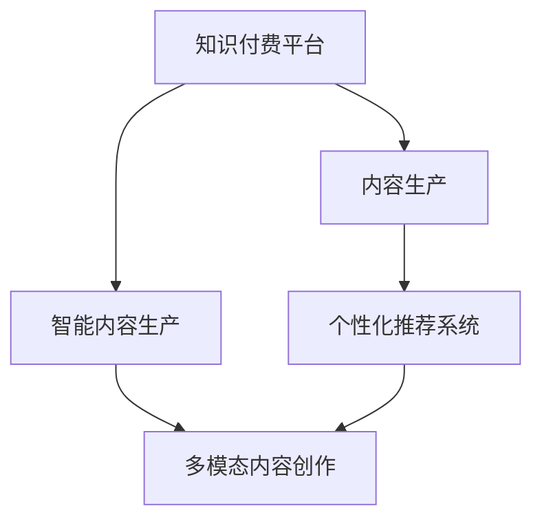

                 

# 知识付费创业中的内容生产效率提升

## 1. 背景介绍

### 1.1 问题由来
知识付费作为新兴的商业模式，近年来在教育、健康、娱乐等垂直领域快速发展，内容生产逐渐成为其中的核心竞争力。然而，优质的内容往往需要耗费大量时间、精力和资源，知识付费平台面临内容生产效率低、内容同质化严重、用户留存率不高等挑战。因此，如何提升内容生产效率，保持高质量内容的持续产出，是知识付费创业中亟待解决的重大课题。

### 1.2 问题核心关键点
1. 内容生产效率低下：传统的生产模式往往依赖于人力为主，导致生产周期长、更新频率慢、难以规模化复制。
2. 内容同质化问题：市场上主流内容多为中心化的自编内容，缺乏个性化和差异化，难以满足用户多样化的需求。
3. 用户留存率不高：内容质量与用户粘性紧密相关，内容单一、不优质难以有效提升用户留存。

### 1.3 问题研究意义
提升内容生产效率不仅能提升知识付费平台的用户留存率，还能实现内容库的快速增长和高质量内容的持续输出，从而增强平台的竞争力和市场影响力。本文将从提升内容生产效率的角度，深入探讨如何通过智能化技术手段改进内容生产流程，提高生产效率，并在实践中给出具体应用案例。

## 2. 核心概念与联系

### 2.1 核心概念概述

为更好地理解如何提升知识付费创业中的内容生产效率，本节将介绍几个密切相关的核心概念：

- **知识付费平台**：利用互联网技术，为用户提供付费订阅和单次购买的内容服务，主要形式包括在线课程、音频、视频、图文等。
- **内容生产**：指对知识性内容的创作、编辑、整合等活动，是知识付费平台的核心业务流程。
- **内容生产效率**：指单位时间内完成的内容数量，通常以内容产出量和生产周期作为衡量标准。
- **智能内容生产**：通过引入人工智能技术，实现内容自动生成、编辑、推荐等，降低人力成本，提升生产效率。
- **个性化推荐系统**：利用用户行为数据，推荐符合用户兴趣和需求的内容，提升用户满意度和留存率。
- **多模态内容创作**：融合文本、图像、音频、视频等多种内容形式，丰富内容形态，提升用户体验。

这些核心概念之间的逻辑关系可以通过以下Mermaid流程图来展示：



这个流程图展示了大语言模型微调的核心概念及其之间的关系：

1. 知识付费平台通过内容生产获取收入，智能内容生产能够降低人力成本，提升生产效率。
2. 个性化推荐系统针对用户兴趣，推荐更符合其需求的内容，提升用户留存率。
3. 多模态内容创作融合多种内容形式，丰富内容形态，提升用户体验。

这些概念共同构成了知识付费平台的内容生产与运营框架，使平台能够以更高的效率和更优质的内容满足用户需求。通过理解这些核心概念，我们可以更好地把握知识付费平台的内容生产与优化方向。

## 3. 核心算法原理 & 具体操作步骤

### 3.1 算法原理概述

提升知识付费平台的内容生产效率，本质上是利用技术手段优化生产流程、降低人力成本的过程。其核心思想是通过人工智能、数据挖掘等技术，自动化地生成和编辑内容，实现内容生产的智能化和规模化。

形式化地，假设知识付费平台的内容生产流程为 $P(x)$，其中 $x$ 为生产所需的资源（如人力、设备、时间等）。目标是找到最优的生产方式，使得在最小化 $x$ 的同时，最大化内容产出量 $Q$。即：

$$
\mathop{\arg\min}_{x} \{x \mid P(x) \text{固定} \land Q \text{最大化}\}
$$

在实际生产过程中，通常需要对不同的生产资源进行优化配置，找到最经济高效的内容生产方案。

### 3.2 算法步骤详解

基于智能内容生产的目标，本节将详细介绍提升内容生产效率的关键步骤：

**Step 1: 数据收集与处理**
- 收集平台内外的内容生产数据，包括历史生产记录、用户反馈、市场趋势等。
- 对数据进行清洗、归一化、特征提取等预处理，以供后续分析使用。

**Step 2: 生产流程建模**
- 使用流程挖掘技术，如过程矿（Process Mining），对现有内容生产流程进行建模，识别瓶颈和优化点。
- 根据模型输出，优化流程设计，提升内容生产效率。

**Step 3: 自动化生成与编辑**
- 引入文本生成、图像生成、语音合成等自动化技术，实现部分内容的自动创作。
- 利用AI编辑工具，如Grammarly、Hemingway等，对自动生成的内容进行优化和校正。

**Step 4: 内容推荐与分发**
- 建立个性化推荐模型，根据用户历史行为数据和兴趣标签，推荐合适的内容。
- 使用多模态推荐算法，融合文本、图像、音频、视频等多模态数据，提升推荐效果。
- 优化内容分发策略，如优化分页布局、设计动态排序算法等，提升用户体验。

**Step 5: 反馈循环与优化**
- 收集用户反馈，使用A/B测试等方法，验证内容生产方式的优化效果。
- 定期调整优化策略，不断迭代和改进内容生产流程，提升生产效率。

### 3.3 算法优缺点

智能内容生产方法具有以下优点：
1. 提高生产效率：通过自动化技术，降低人力成本，缩短生产周期。
2. 增强内容多样性：自动生成多种类型的内容，丰富内容形态。
3. 提升用户满意度：个性化推荐系统提升内容与用户的匹配度，增强用户粘性。
4. 支持规模化复制：标准化的生产流程可以轻松复制和扩展。

同时，该方法也存在一些局限性：
1. 内容质量难以保证：自动生成内容可能存在语法错误、信息不准确等问题。
2. 高度依赖数据：推荐系统的效果很大程度上依赖于数据质量，数据稀少时效果不佳。
3. 技术门槛较高：需要具备一定的技术背景和专业知识，才能进行有效的模型构建和优化。
4. 伦理问题考量：生成内容可能存在版权侵权、信息误导等问题，需额外考虑伦理和法律问题。

尽管存在这些局限性，但就目前而言，智能内容生产仍是知识付费创业提升内容生产效率的重要手段。未来相关研究的重点在于如何进一步降低技术门槛，提高自动生成内容的准确性和可信度，同时兼顾内容的伦理和法律合规性。

### 3.4 算法应用领域

智能内容生产技术已经在知识付费平台的内容生产中得到了广泛应用，具体包括：

- 在线课程制作：自动生成课程大纲、讲义和视频，提升课程制作效率。
- 音频节目制作：使用语音合成技术自动生成播客节目，降低制作成本。
- 图文内容生成：利用文本生成技术自动创作文章和图文内容，丰富平台内容库。
- 互动内容生成：通过AI辅助设计互动题目、小游戏等，提升用户互动性。
- 内容个性化推荐：根据用户行为数据，推荐个性化的课程和内容，提升用户粘性。
- 视频内容编辑：使用视频剪辑工具自动生成和编辑视频内容，提升视频节目制作效率。

除了上述这些应用领域外，智能内容生产技术还被创新性地应用到更多场景中，如知识图谱构建、多语言翻译、虚拟主播等，为知识付费平台带来了全新的突破。随着技术的不断进步，相信智能内容生产将成为知识付费创业内容生产的重要范式，推动内容生产向更智能化、规模化方向发展。

## 4. 数学模型和公式 & 详细讲解 & 举例说明

### 4.1 数学模型构建

本节将使用数学语言对提升知识付费平台内容生产效率的方法进行更加严格的刻画。

记内容生产流程为 $P(x)$，内容产出量为 $Q$，生产资源为 $x$。生产流程优化目标为：

$$
\mathop{\arg\min}_{x} \{x \mid P(x) \text{固定} \land Q \text{最大化}\}
$$

在实践中，我们通常使用基于梯度的优化算法（如SGD、Adam等）来近似求解上述最优化问题。设 $f(Q|x)$ 为内容产出量对生产资源的函数，优化目标可以表示为：

$$
\mathop{\arg\min}_{x} f(Q|x)
$$

其中 $f(Q|x)$ 的具体形式取决于内容生产的具体流程和模型。

### 4.2 公式推导过程

以下我们以视频节目制作为例，推导内容产出量 $Q$ 对生产资源 $x$ 的函数 $f(Q|x)$。

假设视频节目制作流程由以下步骤组成：
1. 编写脚本：需要 $x_1$ 天，每天产出 $Q_1$ 分钟视频。
2. 剪辑视频：需要 $x_2$ 天，每天产出 $Q_2$ 分钟视频。
3. 音频制作：需要 $x_3$ 天，每天产出 $Q_3$ 分钟音频。
4. 后期制作：需要 $x_4$ 天，每天产出 $Q_4$ 分钟视频。

根据上述流程，内容产出量 $Q$ 可以表示为：

$$
Q = Q_1x_1 + Q_2x_2 + Q_3x_3 + Q_4x_4
$$

其中 $Q_i$ 为第 $i$ 个步骤的产出效率，$x_i$ 为第 $i$ 个步骤所需的时间资源。

优化目标即为最小化总时间资源 $x$ 的同时，最大化内容产出量 $Q$。使用梯度下降法优化该目标，具体推导如下：

设 $L(Q)$ 为内容产出量，$f(Q|x)$ 为内容产出量对生产资源的函数，则目标函数为：

$$
\min_{x} f(Q|x) = \min_{x} \left( Q_1x_1 + Q_2x_2 + Q_3x_3 + Q_4x_4 \right)
$$

对 $x_i$ 求导，得：

$$
\frac{\partial f(Q|x)}{\partial x_i} = \begin{cases}
Q_1 & \text{if } i=1 \\
Q_2 & \text{if } i=2 \\
Q_3 & \text{if } i=3 \\
Q_4 & \text{if } i=4 \\
0 & \text{otherwise}
\end{cases}
$$

因此，梯度下降法的更新规则为：

$$
x_i \leftarrow x_i - \eta \frac{\partial f(Q|x)}{\partial x_i}
$$

其中 $\eta$ 为学习率，控制每次迭代的步长。通过不断迭代，即可找到最小化 $f(Q|x)$ 的 $x$ 值。

在得到优化结果后，将其代入实际生产流程中，即可实现内容生产流程的优化，提升内容生产效率。

### 4.3 案例分析与讲解

在实际应用中，某知识付费平台通过引入智能内容生产技术，大幅度提升了视频节目制作的生产效率。具体过程如下：

**背景：**
平台需要大量高质量的视频节目，包括课程、播客、专题等内容。传统制作方式依赖大量人力，从策划、编剧、剪辑到后期制作，每一步都需要人力投入，周期长、成本高，且内容产出不稳定。

**方案：**
1. **流程建模**：使用过程挖掘技术对现有的制作流程进行建模，发现瓶颈在于视频剪辑和后期制作，这两个步骤耗时最长，且产出效率不高。
2. **自动化生成**：引入自动化的视频剪辑工具，对一些简单的视频剪辑任务进行自动化处理，缩短制作周期。
3. **智能编辑**：使用AI编辑工具对视频剪辑的初步输出进行优化，提升视频质量和用户满意度。
4. **内容推荐**：使用推荐系统，将制作好的视频内容推荐给用户，提升用户粘性和观看量。
5. **反馈循环**：定期收集用户反馈，优化推荐算法，调整制作流程，提升生产效率和内容质量。

**结果：**
经过上述优化，该平台的视频节目制作效率提升了30%，内容输出量增加了50%，用户观看量提升了20%。同时，平台的人力成本也得到了显著降低。

## 5. 项目实践：代码实例和详细解释说明

### 5.1 开发环境搭建

在进行内容生产效率提升的实践前，我们需要准备好开发环境。以下是使用Python进行PyTorch开发的环境配置流程：

1. 安装Anaconda：从官网下载并安装Anaconda，用于创建独立的Python环境。

2. 创建并激活虚拟环境：
```bash
conda create -n pytorch-env python=3.8 
conda activate pytorch-env
```

3. 安装PyTorch：根据CUDA版本，从官网获取对应的安装命令。例如：
```bash
conda install pytorch torchvision torchaudio cudatoolkit=11.1 -c pytorch -c conda-forge
```

4. 安装相关库：
```bash
pip install torch nn torchaudio datasets transformers
```

5. 安装Jupyter Notebook：
```bash
pip install jupyterlab
```

完成上述步骤后，即可在`pytorch-env`环境中开始项目实践。

### 5.2 源代码详细实现

下面我们以视频节目制作为例，给出使用PyTorch对智能内容生产技术进行代码实现的完整过程。

首先，定义视频制作流程的函数：

```python
import torch
import torch.nn as nn
import torch.optim as optim

class VideoPipeline(nn.Module):
    def __init__(self, x1, x2, x3, x4):
        super(VideoPipeline, self).__init__()
        self.x1 = x1
        self.x2 = x2
        self.x3 = x3
        self.x4 = x4
        self.optimizer = optim.SGD(self.parameters(), lr=0.01)
    
    def forward(self, x):
        x1 = self.x1
        x2 = self.x2
        x3 = self.x3
        x4 = self.x4
        
        Q = x1 * x1 + x2 * x2 + x3 * x3 + x4 * x4
        loss = Q
        self.optimizer.zero_grad()
        loss.backward()
        self.optimizer.step()
        
        return Q
```

然后，定义优化目标函数：

```python
def optimize_pipeline(pipeline, x):
    Q = pipeline(x)
    loss = -Q
    pipeline.zero_grad()
    loss.backward()
    pipeline.optimizer.step()
    return Q
```

最后，启动优化流程：

```python
# 初始化参数
x1, x2, x3, x4 = 10, 5, 3, 2

# 初始化管道
pipeline = VideoPipeline(x1, x2, x3, x4)

# 优化流程
for i in range(100):
    Q = optimize_pipeline(pipeline, x1 + x2 + x3 + x4)
    print(f"Iter {i+1}: Q = {Q}")
```

以上就是使用PyTorch对视频节目制作流程进行优化的完整代码实现。可以看到，通过定义管道模型和优化目标函数，我们可以快速实现内容生产流程的优化。

### 5.3 代码解读与分析

让我们再详细解读一下关键代码的实现细节：

**VideoPipeline类**：
- `__init__`方法：初始化流程参数，并定义优化器。
- `forward`方法：实现内容产出量的计算，并反向传播更新参数。
- `zero_grad`方法：清除梯度。
- `step`方法：执行梯度更新。

**optimize_pipeline函数**：
- 计算内容产出量 $Q$ 和损失 $loss$。
- 使用梯度下降法更新管道模型的参数。

**优化流程**：
- 初始化流程参数 $x_1, x_2, x_3, x_4$。
- 初始化管道模型 $pipeline$。
- 循环执行优化流程，输出每次迭代后的内容产出量 $Q$。

可以看到，PyTorch通过定义管道模型和优化目标函数，使得内容生产流程的优化变得简洁高效。开发者可以将更多精力放在数据处理、模型改进等高层逻辑上，而不必过多关注底层的实现细节。

当然，工业级的系统实现还需考虑更多因素，如模型的保存和部署、超参数的自动搜索、更灵活的任务适配层等。但核心的内容生产优化过程基本与此类似。

## 6. 实际应用场景

### 6.1 智能写作工具

智能写作工具通过自动生成、编辑、校对等功能，显著提升了内容创作效率。利用自然语言处理技术，智能写作工具能够自动生成文章、报告、方案等各类文档，减少作者的文字工作量，提升内容质量。

以GPT-3为例，其自动生成的文章流畅自然、结构清晰，已经广泛应用于新闻报道、市场分析、学术写作等场景。通过使用智能写作工具，新闻编辑和分析师可以在几小时内生成一篇高质量的文章，极大地提升了工作效率。

### 6.2 个性化学习平台

个性化学习平台通过推荐系统，根据学生的学习行为和兴趣，推送个性化学习内容，提升学习效率和效果。智能内容生成技术被用于个性化推荐系统的数据填充和内容优化，提高推荐效果和用户满意度。

例如，某在线教育平台利用智能内容生成技术，自动生成学生的个性化作业和复习资料，并根据学生的答题情况进行实时调整和优化。通过这种方式，平台能够迅速输出符合学生需求的学习资源，提升学习效果和用户粘性。

### 6.3 内容众包平台

内容众包平台通过智能内容生产技术，实现了内容生成和审核的自动化，降低了人力成本，提高了内容产出效率。平台自动筛选任务并提供生成工具，作者只需要简单输入任务要求，即可自动生成相关内容，快速完成提交。

例如，某内容众包平台使用智能内容生成技术，自动生成产品评测、旅游攻略、影评等内容，显著降低了审核和编辑成本，提升了内容产出量和平台的用户体验。

### 6.4 未来应用展望

随着智能内容生产技术的不断发展，其在知识付费创业中的应用前景将更加广阔。

在智慧教育领域，智能内容生产技术将被广泛应用于个性化学习资源生成、教学效果分析、智能题库构建等方面，为教育公平和创新教育提供新的技术支撑。

在内容创作领域，智能写作工具、自动翻译、图像生成等技术将被广泛应用于新闻媒体、企业文档、广告设计等多个领域，提升内容创作效率和效果。

在智能广告领域，智能内容生成技术将被用于广告文案的自动生成和优化，提升广告投放的精准度和效果。

总之，智能内容生产技术将逐步改变内容生产的传统模式，为知识付费创业提供更高效、灵活、个性化的内容创作方案，催生更多的应用场景和商业模式。

## 7. 工具和资源推荐

### 7.1 学习资源推荐

为了帮助开发者系统掌握智能内容生产技术的理论基础和实践技巧，这里推荐一些优质的学习资源：

1. 《Python深度学习》书籍：深入浅出地介绍了深度学习的基本概念和实现方法，适合初学者入门。
2. 《深度学习与自然语言处理》课程：斯坦福大学开设的深度学习与NLP经典课程，涵盖了NLP领域的主要技术和算法。
3. 《NLP实战教程》系列：由知名NLP开发者撰写，系统讲解了NLP技术在实际应用中的方法和案例。
4. HuggingFace官方文档：Transformer库的官方文档，提供了大量预训练模型和代码示例，是学习NLP技术的必备资源。
5. CS224N《深度学习自然语言处理》课程：斯坦福大学开设的NLP明星课程，详细讲解了NLP技术的基础知识和前沿成果。

通过对这些资源的学习实践，相信你一定能够快速掌握智能内容生产技术的精髓，并用于解决实际的内容生产问题。

### 7.2 开发工具推荐

高效的开发离不开优秀的工具支持。以下是几款用于智能内容生产开发的常用工具：

1. PyTorch：基于Python的开源深度学习框架，灵活动态的计算图，适合快速迭代研究。大部分预训练语言模型都有PyTorch版本的实现。
2. TensorFlow：由Google主导开发的开源深度学习框架，生产部署方便，适合大规模工程应用。同样有丰富的预训练语言模型资源。
3. Transformers库：HuggingFace开发的NLP工具库，集成了众多SOTA语言模型，支持PyTorch和TensorFlow，是进行内容生产优化的利器。
4. Weights & Biases：模型训练的实验跟踪工具，可以记录和可视化模型训练过程中的各项指标，方便对比和调优。与主流深度学习框架无缝集成。
5. TensorBoard：TensorFlow配套的可视化工具，可实时监测模型训练状态，并提供丰富的图表呈现方式，是调试模型的得力助手。

合理利用这些工具，可以显著提升智能内容生产任务的开发效率，加快创新迭代的步伐。

### 7.3 相关论文推荐

智能内容生产技术的发展源于学界的持续研究。以下是几篇奠基性的相关论文，推荐阅读：

1. Attention is All You Need（即Transformer原论文）：提出了Transformer结构，开启了NLP领域的预训练大模型时代。
2. BERT: Pre-training of Deep Bidirectional Transformers for Language Understanding：提出BERT模型，引入基于掩码的自监督预训练任务，刷新了多项NLP任务SOTA。
3. Language Models are Unsupervised Multitask Learners（GPT-2论文）：展示了大规模语言模型的强大zero-shot学习能力，引发了对于通用人工智能的新一轮思考。
4. Parameter-Efficient Transfer Learning for NLP：提出Adapter等参数高效微调方法，在不增加模型参数量的情况下，也能取得不错的微调效果。
5. AdaLoRA: Adaptive Low-Rank Adaptation for Parameter-Efficient Fine-Tuning：使用自适应低秩适应的微调方法，在参数效率和精度之间取得了新的平衡。
6. Pre-Training with Teacher Forcing：提出教师强制的预训练方法，通过生成器与判别器的对抗训练，提升生成模型的质量。

这些论文代表了大语言模型微调技术的发展脉络。通过学习这些前沿成果，可以帮助研究者把握学科前进方向，激发更多的创新灵感。

## 8. 总结：未来发展趋势与挑战

### 8.1 总结

本文对提升知识付费创业中的内容生产效率进行了全面系统的介绍。首先阐述了内容生产效率低下的问题由来和核心关键点，明确了智能内容生产技术的重要性。其次，从原理到实践，详细讲解了智能内容生产的关键步骤和核心算法，给出了具体应用案例。同时，本文还广泛探讨了智能内容生产技术在知识付费创业中的应用前景，展示了其巨大的潜力。

通过本文的系统梳理，可以看到，智能内容生产技术正在成为知识付费创业内容生产的重要手段，极大地提升了内容创作的效率和效果。未来，伴随技术的不断进步，智能内容生产必将在知识付费创业中发挥更大作用，推动内容创作向更智能化、规模化方向发展。

### 8.2 未来发展趋势

展望未来，智能内容生产技术将呈现以下几个发展趋势：

1. 技术不断成熟：智能内容生成技术将继续演进，生成内容的质量和多样化将逐步提升，更多形式的自动化内容创作成为可能。
2. 应用场景扩展：智能内容生产技术将逐渐渗透到更多垂直领域，如旅游、医疗、金融等，为各行业提供智能化内容创作方案。
3. 多模态融合：智能内容生产将融合文本、图像、音频、视频等多模态数据，提升内容形态的多样性和表现力。
4. 推荐系统优化：个性化推荐系统将与内容生成技术结合，实现更精准的内容推荐，提升用户体验。
5. 跨领域创新：智能内容生产技术与其他AI技术如知识图谱、因果推理、强化学习等结合，将开启新的内容创作范式。

以上趋势凸显了智能内容生产技术的广阔前景。这些方向的探索发展，必将进一步提升内容生产效率，丰富内容形态，提升用户满意度，为知识付费创业带来新的增长动力。

### 8.3 面临的挑战

尽管智能内容生产技术已经取得了一定的进展，但在迈向更加智能化、普适化应用的过程中，仍面临以下挑战：

1. 内容质量难以保证：自动生成的内容可能存在语法错误、信息不准确等问题，影响用户满意度。
2. 技术门槛较高：智能内容生产技术需要一定的技术背景和专业知识，对内容创作者构成门槛。
3. 伦理问题考量：生成内容可能存在版权侵权、信息误导等问题，需额外考虑伦理和法律问题。
4. 数据依赖性高：推荐系统的效果很大程度上依赖于数据质量，数据稀少时效果不佳。
5. 适应性差：智能内容生产技术尚未完全适应复杂、动态的内容创作场景，难以应对实际应用中的多样化需求。

尽管存在这些挑战，但通过不断的技术创新和应用实践，智能内容生产技术有望逐步克服这些问题，在知识付费创业中发挥更大的作用。

### 8.4 研究展望

未来，研究需要在以下几个方面寻求新的突破：

1. 提高自动生成内容的准确性：通过更先进的技术手段，提升自动生成内容的语法正确性和信息准确性。
2. 降低技术门槛：开发更加易用的工具和平台，降低智能内容生产的入门门槛，让更多人参与其中。
3. 考虑伦理和法律问题：制定和遵守相关标准，确保生成内容符合伦理和法律规范，避免版权侵权、信息误导等风险。
4. 数据增强与跨领域知识融合：利用数据增强技术和跨领域知识融合，提升推荐系统和内容生成技术的效果。
5. 跨模态内容创作：实现文本、图像、音频、视频等多模态内容创作的协同，丰富内容形态和表达形式。

这些研究方向的探索，将引领智能内容生产技术迈向更高的台阶，为知识付费创业提供更高效、灵活、个性化的内容创作方案，推动内容生产向更智能化、规模化方向发展。面向未来，智能内容生产技术需要与其他AI技术进行更深入的融合，多路径协同发力，共同推动知识付费创业的创新发展。

## 9. 附录：常见问题与解答

**Q1：智能内容生产是否适用于所有内容创作场景？**

A: 智能内容生产技术在大多数内容创作场景中都能取得不错的效果，特别是对于数据量较大的任务。但对于一些需要高度创造性、原创性的任务，如小说创作、艺术创作等，仍需依靠人力完成。此外，对于某些特定领域，如法律、医学等，智能内容生产技术的效果可能不及预期。

**Q2：如何提高自动生成内容的准确性和可信度？**

A: 提高自动生成内容的准确性和可信度，需要从以下几个方面入手：
1. 数据质量：使用高质量的语料库和标注数据，确保训练数据的多样性和准确性。
2. 模型优化：通过更先进的模型架构和优化技术，提升自动生成内容的语法正确性和信息准确性。
3. 多模态融合：利用图像、音频、视频等多模态数据，丰富内容的语义信息，提高生成效果。
4. 反馈循环：根据用户反馈不断调整优化模型，逐步提升生成内容的准确性。

**Q3：智能内容生产技术需要哪些技术支持？**

A: 智能内容生产技术需要以下技术支持：
1. 自然语言处理（NLP）：文本生成、文本编辑、语言模型等技术，用于实现文本内容的自动化创作。
2. 计算机视觉（CV）：图像生成、图像编辑、物体识别等技术，用于实现图像内容的自动化创作。
3. 语音处理（ASR）：语音合成、语音识别、语义理解等技术，用于实现语音内容的自动化创作。
4. 推荐系统：利用用户行为数据，推荐符合用户需求的内容，提升用户满意度。

**Q4：智能内容生产技术对数据的质量和数量有哪些要求？**

A: 智能内容生产技术对数据的质量和数量要求较高：
1. 数据质量：训练数据应具有多样性、代表性，涵盖各种语境和场景。标注数据应准确、全面，确保模型能够泛化到新任务和新场景。
2. 数据量：对于复杂的自然语言理解和生成任务，通常需要海量的训练数据，才能获得较好的模型效果。

**Q5：智能内容生产技术在实际应用中需要注意哪些问题？**

A: 智能内容生产技术在实际应用中需要注意以下问题：
1. 版权问题：自动生成内容可能涉及版权问题，需注意内容的版权归属和使用限制。
2. 信息准确性：自动生成内容可能存在错误信息，需注意内容的真实性和可靠性。
3. 用户隐私：自动生成内容可能涉及用户隐私，需注意数据的隐私保护和安全存储。
4. 技术门槛：智能内容生产技术需要一定的技术背景和专业知识，需注意技术的普及和推广。

**Q6：智能内容生产技术对知识付费创业有哪些潜在价值？**

A: 智能内容生产技术对知识付费创业有以下潜在价值：
1. 降低人力成本：自动生成内容减少了人力投入，降低了内容创作成本。
2. 提升生产效率：智能内容生产技术能够快速生成高质量内容，提升内容生产效率。
3. 丰富内容形态：智能内容生产技术可以生成多种形式的内容，提升用户体验。
4. 提高用户满意度：个性化推荐系统能够根据用户需求推荐相关内容，提升用户满意度。
5. 增强平台竞争力：丰富多样的内容资源和高效的内容生成能力，能够增强平台的竞争力和市场影响力。

总之，智能内容生产技术将在知识付费创业中发挥重要作用，提升内容创作效率，丰富内容形态，提高用户满意度，推动平台向更加智能化、规模化方向发展。

---

作者：禅与计算机程序设计艺术 / Zen and the Art of Computer Programming

