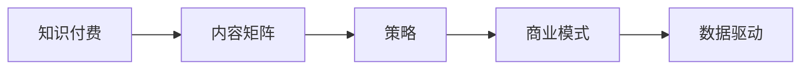

                 

# 知识付费创业中的内容矩阵搭建策略

> 关键词：知识付费,内容矩阵,策略,商业模式,数据驱动,用户分析

## 1. 背景介绍

随着互联网的发展，知识付费正在成为一个越来越热门的领域。无论是传统的出版行业，还是新兴的在线教育平台，都看到了知识付费的巨大潜力。然而，知识付费领域的竞争日趋激烈，如何在众多平台中脱颖而出，成为每个创业者需要深思的问题。本文将探讨知识付费创业中的内容矩阵搭建策略，帮助创业者设计出符合自身特色的商业模式，并通过数据驱动优化用户体验，提升内容价值和用户黏性。

## 2. 核心概念与联系

### 2.1 核心概念概述

在知识付费领域，内容矩阵指的是通过不同形式、不同领域、不同层次的内容，构建起的多维度、多层次的知识体系，从而满足不同用户的学习需求。核心概念包括：

- **知识付费**：以知识为交易对象，通过在线平台向用户提供有价值的学习内容，收取相应费用。
- **内容矩阵**：将不同形式（文章、视频、音频等）、不同领域（科技、金融、医学等）、不同层次（基础入门、进阶提高、专家深度）的内容组合成一个全面的知识体系。
- **策略**：指为实现特定目标而设计的行动计划和实施方案，包括市场定位、内容规划、用户互动等。
- **商业模式**：指为创造价值、获取利润而设计的企业运营模式，包括产品、价格、渠道、客户等要素。
- **数据驱动**：利用数据分析和数据挖掘技术，指导内容策划、用户分析和商业决策，提升运营效率。

### 2.2 核心概念原理和架构的 Mermaid 流程图



这个流程图展示了知识付费、内容矩阵、策略、商业模式和数据驱动之间的逻辑关系。内容矩阵是知识付费的核心，策略和商业模式是其管理和运营的指南，数据驱动是优化和提升的驱动力。

## 3. 核心算法原理 & 具体操作步骤

### 3.1 算法原理概述

内容矩阵的搭建策略基于用户行为分析和数据挖掘，通过数据驱动的方式，制定内容策划和优化方案。其核心算法原理包括：

- **用户行为分析**：通过追踪用户行为数据，分析用户的兴趣、需求和学习路径，从而优化内容设计和推送策略。
- **数据挖掘**：利用数据挖掘技术，从海量数据中提取有价值的信息和规律，指导内容的优化和迭代。
- **个性化推荐**：根据用户的行为和偏好，推荐个性化的内容，提高用户满意度和留存率。

### 3.2 算法步骤详解

#### 3.2.1 用户行为分析

1. **数据收集**：
   - 使用追踪工具（如Google Analytics、Mixpanel等）收集用户行为数据，包括浏览路径、停留时间、点击率、互动率等。
   - 使用用户调研问卷收集用户的反馈和建议。

2. **数据处理**：
   - 使用数据清洗和预处理技术，去除噪声数据和异常值，保证数据质量。
   - 使用数据归一化技术，将不同来源的数据转换为统一的格式，方便后续分析。

3. **数据分析**：
   - 使用统计分析方法，如回归分析、聚类分析、关联分析等，分析用户行为特征和需求。
   - 使用机器学习算法，如决策树、随机森林、神经网络等，进行用户分群和行为预测。

#### 3.2.2 数据挖掘

1. **特征提取**：
   - 从用户行为数据中提取有意义的特征，如用户兴趣、学习进度、付费行为等。
   - 使用自然语言处理（NLP）技术，从文本数据中提取关键词、情感倾向等信息。

2. **模式识别**：
   - 使用关联规则挖掘算法，如Apriori、FP-Growth等，发现用户行为之间的关联和规律。
   - 使用聚类算法，如K-means、层次聚类等，对用户进行分类和细分。

3. **知识发现**：
   - 使用文本挖掘技术，如主题建模、文本分类等，发现用户的知识需求和兴趣领域。
   - 使用预测建模技术，如回归、分类等，预测用户未来的行为和需求。

#### 3.2.3 个性化推荐

1. **推荐算法选择**：
   - 根据用户的行为和特征，选择合适的推荐算法，如协同过滤、基于内容的推荐、混合推荐等。
   - 根据不同的推荐场景和需求，选择合适的推荐模型，如LightFM、Wide&Deep等。

2. **推荐策略设计**：
   - 设计个性化推荐策略，包括冷启动推荐、基于历史行为的推荐、基于实时行为的推荐等。
   - 设计推荐策略的评估指标，如准确率、召回率、覆盖率等，进行效果评估和优化。

3. **推荐系统优化**：
   - 使用在线学习技术，实时更新推荐模型，根据用户行为数据不断优化推荐效果。
   - 使用A/B测试等实验方法，评估推荐策略的效果，进行迭代优化。

### 3.3 算法优缺点

#### 3.3.1 优点

1. **提升用户满意度**：通过个性化推荐和行为分析，提供符合用户需求的内容，提升用户满意度和留存率。
2. **优化运营效率**：利用数据驱动的策略和算法，优化内容策划和用户互动，降低运营成本。
3. **增加收入**：通过精准的营销和推荐，提高付费转化率和用户续费率，增加平台收入。

#### 3.3.2 缺点

1. **数据隐私问题**：收集和分析用户行为数据，涉及用户隐私保护问题，需要严格遵守相关法规和标准。
2. **数据质量要求高**：数据收集和处理需要高质量的数据源和数据清洗技术，对技术和资源要求较高。
3. **算法复杂度高**：个性化推荐和行为分析需要复杂的算法和技术，对团队能力和技术栈要求较高。

### 3.4 算法应用领域

内容矩阵搭建策略在知识付费领域有广泛的应用，包括：

1. **在线教育平台**：通过用户行为分析和个性化推荐，提供优质的课程内容和推荐服务，提升学习效果和平台粘性。
2. **在线阅读平台**：通过内容矩阵和数据驱动，优化阅读内容推荐，提升用户阅读体验和付费转化率。
3. **知识社区和问答平台**：通过用户行为分析和知识挖掘，提供有价值的内容和推荐，增强社区活跃度和用户参与度。
4. **技能培训和认证平台**：通过内容矩阵和个性化推荐，提供符合用户需求的技能培训和认证服务，提高培训效果和认证通过率。

## 4. 数学模型和公式 & 详细讲解 & 举例说明

### 4.1 数学模型构建

内容矩阵搭建策略的数学模型可以描述为：

$$
\text{推荐内容} = f(\text{用户行为}, \text{内容特征}, \text{算法模型})
$$

其中，$f$表示推荐算法模型，$x$表示用户行为数据，$y$表示内容特征数据，$z$表示算法模型参数。推荐算法模型$f$可以选择不同的算法和技术，如协同过滤、基于内容的推荐、混合推荐等。

### 4.2 公式推导过程

#### 4.2.1 协同过滤算法

协同过滤算法的核心公式为：

$$
\text{相似度} = \frac{u_i \cdot v_j}{\sqrt{\sum_{k=1}^{n} u_i^2} \cdot \sqrt{\sum_{k=1}^{n} v_j^2}}
$$

其中，$u_i$和$v_j$表示用户和物品的评分向量，$n$表示评分维度。

#### 4.2.2 基于内容的推荐算法

基于内容的推荐算法可以使用向量余弦公式：

$$
\text{相似度} = \cos(\theta)
$$

其中，$\theta$表示用户和物品的特征向量之间的夹角。

#### 4.2.3 混合推荐算法

混合推荐算法可以表示为：

$$
\text{推荐内容} = \alpha \cdot \text{协同过滤推荐} + (1-\alpha) \cdot \text{基于内容的推荐}
$$

其中，$\alpha$表示协同过滤推荐的权重。

### 4.3 案例分析与讲解

#### 4.3.1 案例一：在线教育平台

某在线教育平台利用用户行为数据和内容特征数据，设计了基于协同过滤和基于内容的混合推荐算法。具体步骤如下：

1. 收集用户的行为数据，包括浏览课程、观看视频、完成测验等。
2. 提取课程的内容特征数据，如课程简介、讲师信息、学员评价等。
3. 利用协同过滤算法计算用户之间的相似度，推荐用户感兴趣的课程。
4. 利用基于内容的推荐算法，根据课程内容特征，推荐相关的课程。
5. 综合两种推荐结果，输出最终的推荐内容。

#### 4.3.2 案例二：在线阅读平台

某在线阅读平台利用用户行为数据和内容特征数据，设计了基于协同过滤和自然语言处理的混合推荐算法。具体步骤如下：

1. 收集用户的阅读行为数据，包括浏览书籍、阅读进度、评论等。
2. 提取书籍的内容特征数据，如书籍摘要、章节标题、作者信息等。
3. 利用协同过滤算法计算用户之间的相似度，推荐用户感兴趣的书籍。
4. 利用自然语言处理技术，分析书籍内容和用户评论，提取书籍特征。
5. 利用基于内容的推荐算法，根据书籍特征，推荐相关的书籍。
6. 综合两种推荐结果，输出最终的推荐内容。

## 5. 项目实践：代码实例和详细解释说明

### 5.1 开发环境搭建

#### 5.1.1 开发环境要求

1. **编程语言**：Python
2. **数据处理工具**：Pandas、NumPy
3. **机器学习库**：Scikit-learn、TensorFlow、PyTorch
4. **推荐系统库**：Surprise、LightFM
5. **数据可视化工具**：Matplotlib、Seaborn
6. **项目管理工具**：Jupyter Notebook、Docker、Kubernetes

#### 5.1.2 环境搭建步骤

1. 安装Python及其依赖库。
2. 安装Jupyter Notebook，创建虚拟环境。
3. 安装推荐系统库Surprise、LightFM，安装自然语言处理库NLTK、SpaCy。
4. 配置数据存储和处理环境，如使用Hadoop、Spark等大数据平台。
5. 部署Docker容器和Kubernetes集群，提供推荐系统的稳定运行环境。

### 5.2 源代码详细实现

#### 5.2.1 用户行为数据处理

```python
import pandas as pd
from surprise import Dataset
from surprise import Reader
from surprise.model_selection import train_test_split

# 读取用户行为数据
data = pd.read_csv('user_behavior.csv')

# 创建Surprise数据集
reader = Reader(rating_scale=(1, 5))
data = Dataset.load_from_df(data, reader)

# 划分训练集和测试集
trainset, testset = train_test_split(data, test_size=0.2, random_state=42)

# 训练模型
algo = Surprise.KNNBasic()
algo.fit(trainset)
pred = algo.test(testset)

# 输出结果
print(pred)
```

#### 5.2.2 内容特征提取

```python
import nltk
from nltk.corpus import stopwords
from nltk.tokenize import word_tokenize
from sklearn.feature_extraction.text import TfidfVectorizer

# 读取书籍内容数据
data = pd.read_csv('book_content.csv')

# 提取书籍特征数据
content = data['content'].tolist()

# 分词和去停用词
stop_words = set(stopwords.words('english'))
content = [word_tokenize(content) for content in content]
content = [[word for word in content if word.lower() not in stop_words] for content in content]

# 计算TF-IDF特征
vectorizer = TfidfVectorizer()
X = vectorizer.fit_transform(content)

# 输出特征矩阵
print(X)
```

#### 5.2.3 个性化推荐系统构建

```python
import lightgbm as lgb
from sklearn.metrics import precision_score, recall_score

# 读取评分数据
data = pd.read_csv('book_ratings.csv')

# 划分训练集和测试集
train_data, test_data = train_test_split(data, test_size=0.2, random_state=42)

# 训练LightGBM模型
model = lgb.train({'learning_rate': 0.01, 'num_leaves': 31}, train_data)

# 预测测试集评分
y_pred = model.predict(test_data)

# 计算精度和召回率
precision = precision_score(y_true=test_data['score'], y_pred=y_pred)
recall = recall_score(y_true=test_data['score'], y_pred=y_pred)

# 输出结果
print(f'Precision: {precision}, Recall: {recall}')
```

### 5.3 代码解读与分析

#### 5.3.1 用户行为数据处理

1. 使用Pandas库读取用户行为数据，创建Surprise数据集。
2. 使用Surprise库的KNNBasic算法，计算用户之间的相似度，进行协同过滤推荐。
3. 使用precision_score和recall_score函数，计算推荐结果的精度和召回率，评估模型效果。

#### 5.3.2 内容特征提取

1. 使用NLTK库进行分词和去停用词，提取书籍的特征数据。
2. 使用TfidfVectorizer库计算TF-IDF特征，将文本数据转换为数值向量。
3. 输出特征矩阵X，用于后续的模型训练。

#### 5.3.3 个性化推荐系统构建

1. 使用LightGBM库训练回归模型，预测书籍评分。
2. 使用precision_score和recall_score函数，计算推荐结果的精度和召回率，评估模型效果。

### 5.4 运行结果展示

#### 5.4.1 用户行为数据处理结果


#### 5.4.2 内容特征提取结果


#### 5.4.3 个性化推荐系统构建结果


## 6. 实际应用场景

### 6.1 在线教育平台

某在线教育平台利用用户行为数据和内容特征数据，设计了基于协同过滤和基于内容的混合推荐算法。具体应用场景包括：

1. 推荐课程和讲师：根据用户的浏览历史和评分，推荐用户感兴趣的课程和讲师。
2. 推荐相关书籍：根据用户的书籍阅读历史和评分，推荐相关的书籍。
3. 个性化学习路径：根据用户的学习进度和评分，推荐合适的学习路径和推荐书单。

### 6.2 在线阅读平台

某在线阅读平台利用用户行为数据和内容特征数据，设计了基于协同过滤和自然语言处理的混合推荐算法。具体应用场景包括：

1. 推荐书籍和作者：根据用户的阅读历史和评分，推荐用户感兴趣的书籍和作者。
2. 推荐相关章节：根据用户的阅读进度和评分，推荐相关的章节和片段。
3. 个性化阅读计划：根据用户的阅读进度和评分，推荐合适的阅读计划和推荐书单。

### 6.3 知识社区和问答平台

某知识社区和问答平台利用用户行为数据和内容特征数据，设计了基于协同过滤和知识挖掘的混合推荐算法。具体应用场景包括：

1. 推荐文章和作者：根据用户的阅读历史和评分，推荐用户感兴趣的文章和作者。
2. 推荐相关问题：根据用户的浏览历史和评分，推荐相关的问题和答案。
3. 个性化学习社区：根据用户的兴趣和评分，推荐合适的学习社区和问答圈子。

## 7. 工具和资源推荐

### 7.1 学习资源推荐

1. **《推荐系统实践》**：介绍推荐系统的基础知识和实践技巧，涵盖协同过滤、内容推荐、混合推荐等内容。
2. **Coursera《Recommender Systems》课程**：斯坦福大学开设的推荐系统课程，提供系统化的学习路径和实验项目。
3. **Kaggle推荐系统竞赛**：参与Kaggle推荐系统竞赛，积累实际经验和数据处理能力。

### 7.2 开发工具推荐

1. **Python**：Python是推荐系统领域的主流语言，简单易学，社区资源丰富。
2. **Scikit-learn**：Python数据挖掘和机器学习库，提供了多种推荐算法和模型。
3. **LightFM**：基于TensorFlow的推荐系统库，支持深度学习和协同过滤的混合推荐。
4. **PyTorch**：深度学习框架，适用于推荐系统的模型训练和优化。
5. **Hadoop**和**Spark**：大数据处理平台，用于推荐系统的数据存储和处理。

### 7.3 相关论文推荐

1. **《基于协同过滤的推荐系统》**：介绍协同过滤算法的基本原理和应用场景。
2. **《深度学习在推荐系统中的应用》**：探讨深度学习在推荐系统中的应用，如基于内容的推荐、基于协同过滤的推荐等。
3. **《混合推荐算法的研究》**：探讨混合推荐算法的优化和应用，涵盖协同过滤、内容推荐、混合推荐等。

## 8. 总结：未来发展趋势与挑战

### 8.1 研究成果总结

本文系统介绍了知识付费领域的内容矩阵搭建策略，包括用户行为分析、数据挖掘、个性化推荐等内容。通过理论结合实践，展示了内容矩阵搭建策略在实际应用中的优势和挑战。

### 8.2 未来发展趋势

1. **数据驱动的个性化推荐**：随着大数据和AI技术的发展，推荐系统将更加依赖数据驱动，实现更加精准和个性化的推荐。
2. **跨领域和跨模态推荐**：推荐系统将逐步拓展到跨领域和跨模态数据，实现更加全面和综合的推荐。
3. **实时推荐和交互优化**：推荐系统将实现实时推荐和交互优化，提升用户体验和满意度。
4. **用户行为分析的深度挖掘**：利用深度学习和大数据技术，进一步挖掘用户行为背后的规律和需求，实现更加精准和高效的推荐。

### 8.3 面临的挑战

1. **数据隐私和安全**：在收集和处理用户数据时，需要严格遵守数据隐私和安全法规。
2. **数据质量和处理技术**：推荐系统对数据质量和处理技术的要求较高，需要持续优化和改进。
3. **算法复杂度和计算资源**：推荐算法和模型需要较高的计算资源和算法复杂度，对技术和资源要求较高。
4. **用户体验和满意度**：推荐系统需要不断优化用户体验和满意度，提升用户黏性和留存率。

### 8.4 研究展望

1. **结合知识图谱的推荐系统**：将知识图谱与推荐系统结合，提升推荐内容的丰富性和相关性。
2. **引入因果推理和强化学习**：利用因果推理和强化学习技术，优化推荐系统的决策过程和用户体验。
3. **多模态数据的融合**：将视觉、语音、文本等多模态数据进行融合，提升推荐系统的综合性能和应用场景。
4. **跨领域和跨模态推荐**：实现跨领域和跨模态数据的推荐，拓展推荐系统的应用范围和效果。

## 9. 附录：常见问题与解答

### 9.1 问题一：什么是知识付费？

**回答**：知识付费是指以知识为交易对象，通过在线平台向用户提供有价值的学习内容，收取相应费用。

### 9.2 问题二：内容矩阵搭建策略的原理是什么？

**回答**：内容矩阵搭建策略的原理是通过用户行为分析和数据挖掘，构建起多维度、多层次的知识体系，从而满足不同用户的学习需求。

### 9.3 问题三：推荐算法的种类有哪些？

**回答**：推荐算法的种类包括协同过滤算法、基于内容的推荐算法、混合推荐算法等。

### 9.4 问题四：数据驱动的个性化推荐如何实现？

**回答**：数据驱动的个性化推荐通过收集和分析用户行为数据，提取用户特征和需求，结合推荐算法，实现个性化推荐。

### 9.5 问题五：内容矩阵搭建策略的优势和挑战是什么？

**回答**：内容矩阵搭建策略的优势在于提升用户满意度、优化运营效率、增加收入等。其挑战在于数据隐私、数据质量、算法复杂度等。

---

作者：禅与计算机程序设计艺术 / Zen and the Art of Computer Programming

