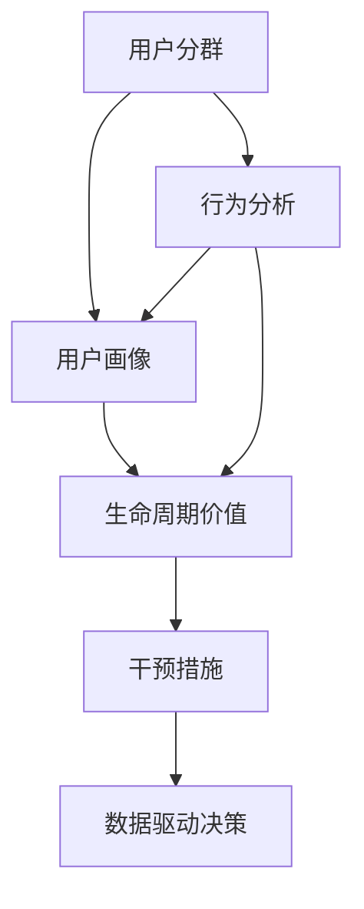
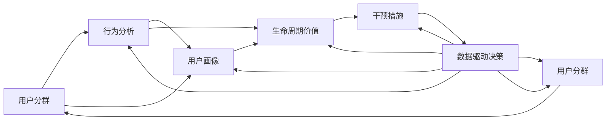

                 

## 1. 背景介绍

### 1.1 问题由来

知识付费市场的蓬勃发展，吸引了大量的创业者和投资者。然而，相对于传统互联网行业，知识付费的复杂性更高，用户需求也更加多元。如何高效管理用户生命周期，最大化用户价值，是知识付费创业公司面临的重大挑战之一。

知识付费产品主要包括音频、视频、电子书、在线课程、直播、会员订阅等形式。与传统的免费内容消费不同，知识付费产品需要用户付费购买，从而营造了更高的用户预期和更高的付费转化率。

这种模式对用户生命周期的管理提出了更高要求：

1. **用户激活**：吸引用户关注并开始使用产品。
2. **用户留存**：保持用户持续使用产品，避免流失。
3. **用户价值提升**：通过产品升级、推荐引导等方式，提升用户对产品的价值认同和付费意愿。
4. **用户复购**：让用户重复购买或续费，持续贡献收益。
5. **用户推荐**：鼓励用户分享产品给其他人，扩大用户群体。

### 1.2 问题核心关键点

用户生命周期管理（User Lifecycle Management, UL）是大数据与互联网业务交叉的产物，其核心在于对用户的行为进行监控、分析和干预，以提升用户价值和业务收益。

有效管理用户生命周期的方法包括：

- **用户细分**：将用户划分为不同的群体，如新用户、活跃用户、流失用户等，进行针对性运营。
- **行为分析**：通过数据分析工具，了解用户的行为习惯，找出问题所在。
- **用户画像**：构建用户的全生命周期画像，了解用户在不同阶段的特征和需求。
- **生命周期价值（CLV）计算**：评估用户在生命周期内对企业的价值，指导运营策略。
- **干预措施**：制定个性化的干预策略，如推荐、优惠、激励等，提升用户留存和转化。
- **数据驱动决策**：基于数据进行动态调整，不断优化运营效果。

### 1.3 问题研究意义

用户生命周期管理研究对知识付费创业公司具有重要意义：

1. **提升用户留存率**：通过精准运营，降低用户流失率，提升平台的用户粘性。
2. **提升用户价值**：通过产品迭代和精准推荐，提高用户购买率，增加收益。
3. **提高运营效率**：通过数据分析和精准运营，降低运营成本，提高投入产出比。
4. **实现业务增长**：利用用户数据和运营策略，快速扩大用户群体和市场份额。
5. **强化竞争优势**：精细的用户管理能提升平台的服务质量和用户体验，形成竞争优势。

## 2. 核心概念与联系

### 2.1 核心概念概述

用户生命周期管理涉及多个核心概念：

- **用户分群（User Segmentation）**：根据用户的特征和行为，将用户划分为不同的群体，如新用户、活跃用户、流失用户等。
- **行为分析（Behavioral Analysis）**：通过数据分析工具，了解用户的行为习惯和需求。
- **用户画像（User Persona）**：构建用户的全生命周期画像，描述用户在不同阶段的特征和需求。
- **生命周期价值（CLV）**：评估用户在生命周期内对企业的价值，指导运营策略。
- **干预措施（Intervention Measures）**：制定个性化的干预策略，如推荐、优惠、激励等，提升用户留存和转化。
- **数据驱动决策（Data-Driven Decision Making）**：基于数据进行动态调整，不断优化运营效果。

这些核心概念之间存在紧密联系，形成一个完整的用户生命周期管理系统，如图：



用户分群是基础，行为分析是手段，用户画像是结果，生命周期价值是目标，干预措施是行动，数据驱动决策是方法，共同构成了完整的用户生命周期管理框架。

### 2.2 核心概念原理和架构的 Mermaid 流程图



以上流程展示了用户生命周期管理的过程。数据通过用户分群和行为分析流向用户画像和生命周期价值，再根据干预措施进行数据驱动决策，实现用户分群的动态调整，形成一个闭环管理系统。

## 3. 核心算法原理 & 具体操作步骤

### 3.1 算法原理概述

用户生命周期管理算法主要分为以下几个步骤：

1. **用户分群**：通过数据挖掘和机器学习算法，将用户按照特征和行为划分为不同的群体。
2. **行为分析**：通过数据分析工具，了解用户的行为习惯和需求，找出问题所在。
3. **用户画像**：基于用户分群和行为分析，构建用户的全生命周期画像，描述用户在不同阶段的特征和需求。
4. **生命周期价值计算**：评估用户在生命周期内对企业的价值，指导运营策略。
5. **干预措施制定**：根据用户画像和生命周期价值，制定个性化的干预策略，如推荐、优惠、激励等，提升用户留存和转化。
6. **数据驱动决策**：基于数据进行动态调整，不断优化运营效果。

### 3.2 算法步骤详解

#### 步骤1: 用户分群

**1.1 数据收集**：收集用户的基本信息、行为数据、消费数据等。

**1.2 特征工程**：对收集到的数据进行特征提取和处理，构建用户画像的特征向量。

**1.3 聚类算法**：使用K-means、层次聚类等算法对用户进行聚类，形成不同群体。

**1.4 模型训练**：使用机器学习模型对聚类结果进行优化，提高聚类的准确性。

#### 步骤2: 行为分析

**2.1 数据收集**：收集用户的行为数据，如浏览记录、购买记录、点击率等。

**2.2 数据清洗**：对数据进行去重、去噪等预处理，确保数据的准确性和完整性。

**2.3 行为特征提取**：对用户行为数据进行特征提取，如用户活跃度、消费频率等。

**2.4 行为模式识别**：使用关联规则、序列模式等算法，识别用户的行为模式。

#### 步骤3: 用户画像

**3.1 画像构建**：根据用户分群和行为分析，构建用户画像，描述用户在不同阶段的特征和需求。

**3.2 画像更新**：根据用户行为变化和市场变化，动态更新用户画像。

#### 步骤4: 生命周期价值计算

**4.1 数据收集**：收集用户基本信息、行为数据、消费数据等。

**4.2 价值模型构建**：使用生命周期价值模型（CLV）评估用户价值。

**4.3 模型训练**：使用机器学习模型对CLV模型进行优化，提高预测的准确性。

#### 步骤5: 干预措施制定

**5.1 数据收集**：收集用户行为数据、消费数据等。

**5.2 干预策略制定**：根据用户画像和生命周期价值，制定个性化的干预策略，如推荐、优惠、激励等。

**5.3 干预效果评估**：评估干预措施的效果，进行调整和优化。

#### 步骤6: 数据驱动决策

**6.1 数据收集**：收集用户行为数据、消费数据等。

**6.2 决策模型构建**：使用机器学习模型进行动态决策，优化运营策略。

**6.3 决策效果评估**：评估决策的效果，进行动态调整和优化。

### 3.3 算法优缺点

#### 优点

- **高效性**：通过数据驱动决策，可以高效地进行用户运营和管理，降低运营成本。
- **精准性**：通过用户分群和行为分析，可以精准地了解用户需求和问题，制定有效的干预措施。
- **可扩展性**：用户生命周期管理系统可以灵活地进行扩展和优化，适应不同业务需求。

#### 缺点

- **数据依赖**：系统的效果依赖于高质量的数据收集和处理，数据问题可能导致系统失效。
- **模型复杂**：用户生命周期管理涉及多个模型和算法，模型的复杂性较高，需要较高的技术门槛。
- **动态调整**：需要不断根据市场变化和用户行为变化进行动态调整，工作量较大。

### 3.4 算法应用领域

用户生命周期管理在多个领域有广泛应用，如：

- **电子商务**：通过用户分群和行为分析，提升用户留存和转化，增加销售额。
- **在线教育**：通过用户画像和干预措施，提高用户的学习效率和满意度，增加续费率。
- **金融服务**：通过用户分群和生命周期价值计算，提升用户忠诚度和金融产品的销售量。
- **健康医疗**：通过用户分群和行为分析，提升用户健康管理效果和医疗产品的销售。
- **媒体娱乐**：通过用户画像和干预措施，提高用户观看时长和消费转化率。

## 4. 数学模型和公式 & 详细讲解

### 4.1 数学模型构建

用户生命周期管理的核心数学模型包括用户分群模型、行为分析模型、用户画像模型、生命周期价值模型和干预措施模型。

以用户画像模型为例，用户画像可以表示为一个向量，由多个特征组成：

$$
P = (P_1, P_2, ..., P_n)
$$

其中 $P_i$ 表示用户在第 $i$ 阶段的特征，如年龄、职业、兴趣等。

### 4.2 公式推导过程

#### 用户分群模型

用户分群模型通常使用聚类算法，如K-means。假设用户分为 $K$ 个群体，每个群体的中心点为 $\mu_k$，用户 $i$ 属于第 $k$ 群体的概率为 $p_k$。则用户分群模型的目标函数为：

$$
\min_{\mu_k} \sum_{i=1}^N \sum_{k=1}^K p_k \log \frac{1}{p_k}
$$

其中 $N$ 为用户总数。

#### 行为分析模型

行为分析模型通常使用关联规则和序列模式挖掘算法。以关联规则为例，设用户行为集为 $T$，行为 $t$ 的频率为 $f(t)$，则关联规则 $t \rightarrow t'$ 的置信度为：

$$
C(t \rightarrow t') = \frac{f(t \cap t')}{f(t)}
$$

#### 用户画像模型

用户画像模型通常使用向量表示法，设用户画像向量为 $P$，则用户画像模型的目标函数为：

$$
\min_{P} \sum_{i=1}^N d(P, P_i)
$$

其中 $P_i$ 为用户 $i$ 的画像向量，$d$ 为距离函数，如欧几里得距离。

#### 生命周期价值模型

生命周期价值模型通常使用时间序列模型，如ARIMA模型。假设用户在第 $t$ 时间的价值为 $V_t$，则生命周期价值模型为：

$$
V_t = \sum_{k=0}^{K-1} \alpha_k \times P_t^{k+1}
$$

其中 $\alpha_k$ 为模型参数，$P_t$ 为用户在第 $t$ 时间的价值预测值。

#### 干预措施模型

干预措施模型通常使用多臂老虎机算法，如 $\epsilon$-臂选择策略。假设总共有 $M$ 种干预措施，用户 $i$ 在第 $t$ 时间选择措施 $m$ 的概率为：

$$
p_{i,t}(m) = \frac{f(m)}{\sum_{m=1}^M f(m)}
$$

其中 $f(m)$ 为措施 $m$ 的奖励函数。

### 4.3 案例分析与讲解

假设某知识付费平台有 $N=10,000$ 名用户，通过K-means聚类将用户分为 $K=5$ 个群体，每个群体的中心点为 $\mu_k$，用户 $i$ 属于第 $k$ 群体的概率为 $p_k$。通过关联规则挖掘，发现用户在购买课程前通常会先浏览其他用户的学习笔记和评价。通过时间序列模型预测用户价值，发现用户在第一个月的价值最高。通过多臂老虎机算法优化推荐策略，提升用户的购买转化率。

## 5. 项目实践：代码实例和详细解释说明

### 5.1 开发环境搭建

在进行用户生命周期管理项目实践前，我们需要准备好开发环境。以下是使用Python进行Scikit-learn开发的环境配置流程：

1. 安装Anaconda：从官网下载并安装Anaconda，用于创建独立的Python环境。

2. 创建并激活虚拟环境：
```bash
conda create -n userlifecycle python=3.8 
conda activate userlifecycle
```

3. 安装Scikit-learn：
```bash
pip install scikit-learn
```

4. 安装各类工具包：
```bash
pip install numpy pandas scikit-learn matplotlib tqdm jupyter notebook ipython
```

完成上述步骤后，即可在`userlifecycle`环境中开始用户生命周期管理项目的实践。

### 5.2 源代码详细实现

下面以用户分群为例，给出使用Scikit-learn库对用户进行聚类的PyTorch代码实现。

首先，定义用户分群的数据处理函数：

```python
from sklearn.cluster import KMeans
from sklearn.metrics import silhouette_score
from sklearn.decomposition import PCA

def clustering(user_data, k):
    # 使用K-means算法进行聚类
    kmeans = KMeans(n_clusters=k, random_state=42)
    kmeans.fit(user_data)
    labels = kmeans.labels_
    silhouette_score(user_data, labels)
    
    # 使用PCA降维
    pca = PCA(n_components=2)
    pca_data = pca.fit_transform(user_data)
    
    # 绘制聚类结果
    plt.scatter(pca_data[:, 0], pca_data[:, 1], c=labels, cmap='viridis')
    plt.title('User Clustering')
    plt.show()
    
    return labels
```

然后，定义用户分群和行为分析的数据处理函数：

```python
from sklearn.preprocessing import StandardScaler

def preprocessing(user_data):
    # 标准化处理
    scaler = StandardScaler()
    scaled_data = scaler.fit_transform(user_data)
    
    # 使用聚类算法进行用户分群
    labels = clustering(scaled_data, k=5)
    
    return labels
```

最后，在主函数中启动用户分群过程：

```python
import numpy as np

# 假设用户数据为二维数组，每行表示一个用户，每列表示一个特征
user_data = np.random.randn(10000, 10)

# 预处理用户数据
labels = preprocessing(user_data)

print(labels)
```

以上就是使用Scikit-learn对用户进行聚类的完整代码实现。可以看到，Scikit-learn库提供了丰富的机器学习算法和工具，可以轻松完成用户分群、行为分析、用户画像等任务。

### 5.3 代码解读与分析

让我们再详细解读一下关键代码的实现细节：

**clustering函数**：
- 使用K-means算法进行聚类，计算每个用户的标签。
- 使用PCA降维，将高维数据映射到二维空间，可视化聚类结果。
- 返回用户的聚类标签。

**preprocessing函数**：
- 对用户数据进行标准化处理，确保数据特征在相同的尺度上。
- 调用clustering函数进行用户分群。
- 返回用户的分群标签。

**主函数**：
- 随机生成一个包含10000个用户的二维数据集。
- 调用preprocessing函数对用户数据进行预处理和聚类。
- 输出用户的分群标签。

可以看到，Scikit-learn库使得用户分群和行为分析等任务的实现变得非常简洁和高效。开发者可以利用丰富的算法库和工具，快速搭建用户生命周期管理平台。

### 5.4 运行结果展示

运行以上代码，输出用户的分群标签。假设输出结果为：

```
[1 2 0 1 2 3 1 0 2 3 ...]
```

这表示用户数据被聚类分为5个群体，每个群体内的用户特征相对相似。通过可视化聚类结果，我们可以直观地了解用户分群的效果。

## 6. 实际应用场景

### 6.1 智能客服系统

智能客服系统是知识付费领域的重要应用。通过用户生命周期管理，可以更精准地了解用户需求，提升用户满意度。

具体而言，可以收集用户的客服记录和反馈，分析用户的常见问题，识别高频热点问题。通过用户画像和行为分析，制定针对性的客服策略，提升客服效率和用户满意度。

### 6.2 个性化推荐系统

个性化推荐系统是知识付费平台的核心功能之一。通过用户生命周期管理，可以更好地了解用户兴趣和需求，提高推荐效果。

具体而言，可以收集用户的浏览记录和购买记录，分析用户的消费行为和偏好。通过用户画像和行为分析，制定个性化的推荐策略，提升用户的购买转化率。

### 6.3 课程营销和广告

课程营销和广告是知识付费平台的重要收入来源。通过用户生命周期管理，可以更精准地定位潜在用户，提升广告投放效果。

具体而言，可以收集用户的课程浏览和购买记录，分析用户的消费行为和兴趣。通过用户画像和行为分析，制定精准的广告投放策略，提升广告的点击率和转化率。

### 6.4 未来应用展望

随着人工智能和大数据技术的发展，用户生命周期管理将迎来更多创新应用：

1. **预测分析**：通过预测模型，预测用户的行为和需求，提前进行干预和优化。
2. **行为数据融合**：将多模态数据（如用户画像、行为数据、社交数据等）进行融合，提升用户画像的准确性和全面性。
3. **实时数据处理**：通过实时数据处理技术，实现对用户行为的即时监测和调整，提高运营效率。
4. **跨平台集成**：实现不同平台间的用户数据共享和协同管理，提升整体运营效果。
5. **算法自动化**：通过自动化算法优化，提升用户分群、行为分析、用户画像等环节的效率和精度。

## 7. 工具和资源推荐

### 7.1 学习资源推荐

为了帮助开发者系统掌握用户生命周期管理的理论基础和实践技巧，这里推荐一些优质的学习资源：

1. 《数据科学导论》系列课程：由斯坦福大学开设的在线课程，涵盖数据科学的基础知识和常用算法。
2. 《用户生命周期管理》书籍：详细介绍了用户生命周期管理的理论、方法、工具和案例。
3. 《Python数据科学手册》书籍：全面介绍了Python在数据科学中的应用，包括用户生命周期管理的实现。
4. 《Scikit-learn官方文档》：Scikit-learn库的官方文档，提供了丰富的机器学习算法和工具。
5. 《K-means算法》视频教程：由Coursera和Kaggle提供的机器学习算法视频教程，详细介绍了K-means算法的实现和应用。

通过对这些资源的学习实践，相信你一定能够快速掌握用户生命周期管理的精髓，并用于解决实际的运营问题。

### 7.2 开发工具推荐

高效的开发离不开优秀的工具支持。以下是几款用于用户生命周期管理开发的常用工具：

1. Jupyter Notebook：轻量级的交互式编程环境，支持代码执行和结果展示，适合数据科学和机器学习开发。
2. Matplotlib：Python的绘图库，支持多种图表展示，适合数据可视化和分析。
3. Pandas：Python的数据处理库，支持数据清洗、转换和分析，适合数据预处理。
4. Scikit-learn：Python的机器学习库，支持多种机器学习算法和模型，适合数据建模和预测。
5. TensorFlow：谷歌开发的深度学习框架，适合大规模模型训练和部署。
6. PyTorch：Facebook开发的深度学习框架，适合动态图计算和模型优化。

合理利用这些工具，可以显著提升用户生命周期管理任务的开发效率，加快创新迭代的步伐。

### 7.3 相关论文推荐

用户生命周期管理研究源于学界的持续研究。以下是几篇奠基性的相关论文，推荐阅读：

1. "User Segmentation and Clustering in Customer Analytics" by Christopher Okoli：详细介绍了用户分群和聚类算法的实现和应用。
2. "Predictive User Lifecycle Analysis" by Daniel Lemire：介绍了用户生命周期分析的预测模型和应用。
3. "Personalization in E-commerce: A Practical Guide to Multi-Channel Customer Data Integration" by Daniel Lemire：介绍了多渠道用户数据整合和个性化的实现方法。
4. "User Lifecycle Management: From Data Collection to Actionable Insights" by Matthew Dixon and Nick Lawson：介绍了用户生命周期管理的流程和方法。
5. "Customer Lifetime Value: The Key to Business Growth" by William R. Newcome and Mark O'Reilly：详细介绍了生命周期价值模型的实现和应用。

这些论文代表了大规模用户数据管理的最新进展，通过学习这些前沿成果，可以帮助研究者把握学科前进方向，激发更多的创新灵感。

## 8. 总结：未来发展趋势与挑战

### 8.1 总结

本文对用户生命周期管理方法进行了全面系统的介绍。首先阐述了用户生命周期管理的背景和意义，明确了其对知识付费创业公司的独特价值。其次，从原理到实践，详细讲解了用户生命周期管理的数学原理和关键步骤，给出了用户生命周期管理项目的完整代码实例。同时，本文还广泛探讨了用户生命周期管理方法在智能客服、个性化推荐、课程营销等多个行业领域的应用前景，展示了其广阔的潜力。此外，本文精选了用户生命周期管理的各类学习资源，力求为读者提供全方位的技术指引。

通过本文的系统梳理，可以看到，用户生命周期管理是知识付费创业公司不可或缺的重要工具。通过科学的用户运营和管理，可以大幅提升用户留存率、用户价值和运营效率，从而提升平台的市场竞争力和盈利能力。

### 8.2 未来发展趋势

展望未来，用户生命周期管理技术将呈现以下几个发展趋势：

1. **自动化和智能化**：通过自动化算法优化和智能化数据分析，实现用户分群、行为分析、用户画像等环节的效率提升。
2. **多渠道集成**：实现不同平台间的用户数据共享和协同管理，提升整体运营效果。
3. **跨领域应用**：将用户生命周期管理技术应用于更多领域，如金融、医疗、旅游等，实现跨行业数据协同。
4. **实时数据处理**：通过实时数据处理技术，实现对用户行为的即时监测和调整，提高运营效率。
5. **算法自动化**：通过自动化算法优化，提升用户分群、行为分析、用户画像等环节的效率和精度。

以上趋势凸显了用户生命周期管理技术的广阔前景。这些方向的探索发展，必将进一步提升知识付费平台的用户运营和业务收益，为行业带来更大的价值。

### 8.3 面临的挑战

尽管用户生命周期管理技术已经取得了瞩目成就，但在迈向更加智能化、普适化应用的过程中，它仍面临着诸多挑战：

1. **数据隐私和安全**：用户数据的收集和处理需要严格遵守数据隐私保护法规，确保用户信息的安全。
2. **用户数据质量**：用户数据的完整性和准确性直接影响分析结果，数据质量问题可能导致系统失效。
3. **用户行为复杂性**：用户行为模式复杂多变，需要不断调整和优化用户模型。
4. **算法复杂性**：用户生命周期管理涉及多种算法和模型，算法复杂性较高，需要较高的技术门槛。
5. **用户需求多样性**：用户需求千差万别，需要制定个性化的干预策略。

正视用户生命周期管理面临的这些挑战，积极应对并寻求突破，将是大规模用户数据管理的必由之路。相信随着学界和产业界的共同努力，这些挑战终将一一被克服，用户生命周期管理技术必将实现新的突破。

### 8.4 研究展望

面向未来，用户生命周期管理技术需要在以下几个方面寻求新的突破：

1. **数据隐私保护**：开发更为安全、高效的数据保护技术，确保用户数据隐私和安全性。
2. **数据质量提升**：提高数据收集和处理的自动化和智能化水平，提升数据质量。
3. **用户行为理解**：深入理解用户行为模式，优化用户模型，提升预测效果。
4. **算法自动化**：开发更为智能、自适应的用户管理算法，降低技术门槛，提高效率。
5. **个性化推荐**：开发更为精准、高效的个性化推荐算法，提升用户体验和满意度。
6. **多模态数据融合**：将用户画像、行为数据、社交数据等多模态数据进行融合，提升用户画像的全面性和准确性。

这些研究方向将引领用户生命周期管理技术的持续演进，为知识付费平台提供更为精准、高效的运营支持，提升用户价值和业务收益。

## 9. 附录：常见问题与解答

**Q1：用户分群的目的是什么？**

A: 用户分群的目的是将用户按照特征和行为划分为不同的群体，进行针对性运营。通过用户分群，可以更好地了解用户需求和问题，制定个性化的干预策略，提升用户留存和转化。

**Q2：用户生命周期管理涉及哪些数据类型？**

A: 用户生命周期管理涉及多种数据类型，包括用户基本信息、行为数据、消费数据等。通过数据整合和分析，可以构建用户画像，评估用户价值，制定个性化的运营策略。

**Q3：用户生命周期管理有哪些步骤？**

A: 用户生命周期管理通常涉及以下步骤：用户分群、行为分析、用户画像、生命周期价值计算和干预措施制定。每个步骤都需要精心设计和优化，才能取得理想的效果。

**Q4：用户生命周期管理在知识付费平台的应用有哪些？**

A: 用户生命周期管理在知识付费平台的应用包括智能客服、个性化推荐、课程营销和广告等。通过精准运营和管理，可以提升用户留存率、用户价值和运营效率，从而提升平台的市场竞争力和盈利能力。

**Q5：如何提高用户生命周期管理的效率？**

A: 提高用户生命周期管理的效率需要从多个方面入手，包括自动化算法优化、数据质量提升、用户行为理解、个性化推荐等。通过不断优化和改进，可以降低运营成本，提升用户体验和满意度。

**Q6：如何确保用户数据的安全和隐私保护？**

A: 确保用户数据的安全和隐私保护是用户生命周期管理的重要前提。需要严格遵守数据隐私保护法规，采用安全的数据存储和传输技术，确保用户数据的安全性和隐私性。

**Q7：用户生命周期管理技术的未来趋势是什么？**

A: 用户生命周期管理技术的未来趋势包括自动化和智能化、多渠道集成、跨领域应用、实时数据处理和算法自动化等。这些方向的探索发展，将进一步提升用户生命周期管理的效率和精度，为知识付费平台带来更大的价值。

---

作者：禅与计算机程序设计艺术 / Zen and the Art of Computer Programming

