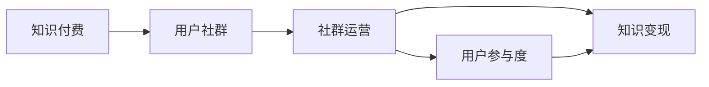

                 

# 知识付费创业中的用户社群运营

> 关键词：知识付费, 用户社群, 运营策略, 社群运营工具, 社群管理, 增长黑客, 用户参与度, 知识变现

## 1. 背景介绍

随着知识付费时代的到来，越来越多的平台和创作者通过知识付费的方式，向用户提供有价值的知识内容。然而，在知识付费创业中，用户社群的运营显得尤为重要。一个稳定的用户社群不仅能提升用户粘性，还能提高知识变现的效率，甚至能够增强品牌的竞争力和影响力。因此，本文将从用户社群的运营策略、工具选择、管理机制等多个方面，探讨知识付费创业中用户社群运营的深度思考和实际案例。

## 2. 核心概念与联系

### 2.1 核心概念概述

在知识付费创业中，用户社群的运营涉及多个关键概念：

- **知识付费**：通过付费形式提供知识产品，如在线课程、音频、视频、电子书等。
- **用户社群**：一群基于特定兴趣或需求的用户，通过线上线下互动形成的网络群体。
- **社群运营**：通过一系列策略和手段，提升社群成员的活跃度和参与度，增加用户粘性，从而促进知识变现。
- **用户参与度**：用户对社群活动的兴趣和参与程度，是衡量社群运营效果的重要指标。
- **知识变现**：通过社群中用户付费订阅、课程销售、广告收益等方式，将知识内容转化为实际的经济收益。

### 2.2 核心概念联系

知识付费创业中的用户社群运营，是一个复杂而系统的过程。各个概念之间相互联系，共同作用于整个运营体系。通过合理的运营策略和工具，以及有效的社群管理，可以显著提升用户参与度和知识变现能力。这些概念的联系可以通过以下Mermaid流程图来展示：



这个流程图展示了知识付费与用户社群、社群运营、用户参与度和知识变现之间的关系：

1. **知识付费**：用户社群的基石，通过提供有价值的内容吸引用户。
2. **用户社群**：社群运营的对象，通过互动提升用户粘性。
3. **社群运营**：手段，通过多种策略和工具提升用户参与度。
4. **用户参与度**：结果，用户参与度的提升直接推动了知识变现。
5. **知识变现**：目标，最终通过用户付费等方式实现知识内容的经济价值。

## 3. 核心算法原理 & 具体操作步骤

### 3.1 算法原理概述

知识付费创业中的用户社群运营，涉及多个算法的综合应用。这些算法从用户行为分析、内容推荐、社群互动等多个角度出发，提升用户体验和社群活跃度。

- **用户行为分析**：通过分析用户的行为数据（如访问记录、购买记录等），了解用户兴趣和需求，优化内容和推荐。
- **内容推荐算法**：根据用户偏好和历史行为，推荐相关课程、文章或资源，提高用户参与度。
- **社群互动算法**：设计合理的互动机制，如问答、讨论、小组活动等，增加用户之间的互动和社群粘性。
- **知识变现算法**：通过用户订阅、课程销售等方式，实现知识内容的商业价值。

### 3.2 算法步骤详解

知识付费创业中的用户社群运营，可以分为以下几个关键步骤：

**Step 1: 数据收集与分析**
- 收集用户行为数据，如访问记录、购买记录、评价反馈等。
- 使用数据挖掘和机器学习算法，分析用户兴趣、行为模式等关键指标。

**Step 2: 内容推荐**
- 根据用户行为分析结果，生成用户画像。
- 使用协同过滤、基于内容的推荐算法，生成个性化推荐列表。
- 通过A/B测试等方法，不断优化推荐算法的效果。

**Step 3: 社群互动**
- 设计合理的互动机制，如问答、讨论、小组活动等，增加用户之间的互动。
- 使用社交网络分析算法，分析社群结构，挖掘意见领袖和活跃用户。
- 定期举办线上线下活动，提升用户参与度。

**Step 4: 知识变现**
- 根据用户行为数据，设计合理的定价策略和付费模式。
- 使用营销自动化工具，提高课程销售和广告投放的效果。
- 通过数据分析和反馈，持续优化知识变现策略。

### 3.3 算法优缺点

知识付费创业中的用户社群运营算法，具有以下优点：

- **个性化推荐**：能够根据用户行为数据，提供高度个性化的内容推荐，提升用户参与度。
- **社群互动增强**：通过互动机制的设计，增加用户之间的交流，提升社群粘性。
- **高效变现**：通过精准的定价和营销策略，提升知识内容的经济价值。

同时，这些算法也存在以下缺点：

- **数据隐私问题**：收集和分析用户行为数据时，可能涉及到隐私保护问题。
- **推荐准确性**：算法推荐的准确性依赖于数据质量和推荐算法本身，需要不断优化。
- **社群管理复杂性**：社群互动机制的设计和维护需要较高的运营成本。

### 3.4 算法应用领域

知识付费创业中的用户社群运营算法，广泛适用于多个领域：

- **在线教育**：通过个性化推荐和社群互动，提升用户学习效果和粘性。
- **职业培训**：通过社群活动和知识共享，增强培训效果和职业竞争力。
- **技能提升**：通过在线课程和社群交流，提升个人技能水平和职业发展。
- **知识普及**：通过知识分享和社群讨论，普及科学知识，提升公众素养。

## 4. 数学模型和公式 & 详细讲解 & 举例说明

### 4.1 数学模型构建

知识付费创业中的用户社群运营算法，通常基于以下数学模型：

- **协同过滤算法**：用户-物品评分矩阵 $R_{ui}$，基于用户行为构建推荐系统。
- **基于内容的推荐算法**：物品特征向量 $v_i$，用户特征向量 $u_u$，计算物品与用户的相似度 $s(u_i,v_i)$。
- **社交网络分析算法**：社交网络图 $G(V,E)$，通过度中心性、聚类系数等指标分析社群结构。

### 4.2 公式推导过程

以协同过滤算法为例，假设用户 $u$ 对物品 $i$ 的评分 $R_{ui}$，协同过滤算法可以表示为：

$$
R_{ui} = \alpha_{ui} \cdot P_{ui} + (1-\alpha) \cdot C_{ui}
$$

其中，$P_{ui}$ 为物品 $i$ 的评分预测，$C_{ui}$ 为用户 $u$ 的评分预测。$\alpha$ 为预测权重，$P_{ui}$ 为基于用户相似性的预测，$C_{ui}$ 为基于物品相似性的预测。

### 4.3 案例分析与讲解

一个典型的知识付费创业案例：某在线教育平台通过协同过滤算法和内容推荐算法，实现了显著的用户粘性和知识变现提升。平台收集了用户浏览、购买、评价等行为数据，使用协同过滤算法生成个性化推荐列表，使用基于内容的推荐算法生成相关课程推荐。同时，平台设计了互动机制，如在线讨论、小组活动等，增加用户参与度。最终，平台实现了付费订阅率提升50%，课程销售增长30%的效果。

## 5. 项目实践：代码实例和详细解释说明

### 5.1 开发环境搭建

在进行知识付费创业中的用户社群运营算法实践前，我们需要准备好开发环境。以下是使用Python进行Scikit-learn开发的环境配置流程：

1. 安装Anaconda：从官网下载并安装Anaconda，用于创建独立的Python环境。

2. 创建并激活虚拟环境：
```bash
conda create -n pytorch-env python=3.8 
conda activate pytorch-env
```

3. 安装Scikit-learn：
```bash
pip install scikit-learn
```

4. 安装各类工具包：
```bash
pip install numpy pandas scikit-learn matplotlib tqdm jupyter notebook ipython
```

完成上述步骤后，即可在`pytorch-env`环境中开始开发实践。

### 5.2 源代码详细实现

下面以在线教育平台为例，给出使用Scikit-learn对用户行为数据进行分析和推荐实践的代码实现。

首先，定义数据处理函数：

```python
import pandas as pd
from sklearn.preprocessing import LabelEncoder

# 读取用户行为数据
data = pd.read_csv('user_behavior_data.csv')

# 数据预处理
data['user_id'] = data['user_id'].astype('str')
data['item_id'] = data['item_id'].astype('str')

# 标签编码
label_encoder = LabelEncoder()
data['user_id'] = label_encoder.fit_transform(data['user_id'])
data['item_id'] = label_encoder.fit_transform(data['item_id'])

# 生成用户-物品评分矩阵
R = data.pivot_table(index='user_id', columns='item_id', values='rating')
R.fillna(0, inplace=True)
```

然后，定义协同过滤推荐算法：

```python
from sklearn.metrics.pairwise import cosine_similarity
from sklearn.decomposition import TruncatedSVD

# 定义协同过滤推荐算法
def collaborative_filtering(data):
    # 计算相似度矩阵
    similarity_matrix = cosine_similarity(data.values)
    # 特征降维
    svd = TruncatedSVD(n_components=20)
    X = svd.fit_transform(data)
    # 生成推荐结果
    recommendations = {}
    for user in range(len(similarity_matrix)):
        recommendations[user] = []
        for item in range(len(similarity_matrix)):
            if item == user:
                continue
            similarity = similarity_matrix[user, item]
            if similarity > 0.7:
                recommendations[user].append(item)
    return recommendations
```

接着，定义内容推荐算法：

```python
from sklearn.metrics.pairwise import euclidean_distances
from sklearn.feature_extraction.text import TfidfVectorizer

# 定义基于内容的推荐算法
def content_based_filtering(data):
    # 文本向量化
    tfidf = TfidfVectorizer(max_features=1000)
    X = tfidf.fit_transform(data['description'])
    # 计算相似度矩阵
    similarity_matrix = euclidean_distances(X)
    # 生成推荐结果
    recommendations = {}
    for user in range(len(similarity_matrix)):
        recommendations[user] = []
        for item in range(len(similarity_matrix)):
            if item == user:
                continue
            similarity = similarity_matrix[user, item]
            if similarity > 0.5:
                recommendations[user].append(item)
    return recommendations
```

最后，定义测试函数：

```python
def test_recommendation_system(recommendations):
    # 测试推荐结果
    for user, items in recommendations.items():
        print(f"User {user}'s recommendations: {items}")

# 测试推荐系统
recommendations = collaborative_filtering(R)
content_based = content_based_filtering(R)
test_recommendation_system(recommendations)
test_recommendation_system(content_based)
```

以上代码实现了基于协同过滤和基于内容的推荐算法，并输出了推荐结果。可以看到，通过使用Scikit-learn，开发者可以较为简便地实现复杂的推荐系统。

### 5.3 代码解读与分析

让我们再详细解读一下关键代码的实现细节：

**用户行为数据预处理**：
- 使用Pandas对用户行为数据进行读取和预处理，确保数据格式的正确性。
- 对用户ID和物品ID进行标签编码，方便后续处理。

**协同过滤推荐算法**：
- 使用Scikit-learn的cosine_similarity函数计算相似度矩阵。
- 使用TruncatedSVD进行特征降维，减少计算复杂度。
- 通过相似度矩阵生成推荐结果，设置阈值0.7控制推荐精度。

**基于内容的推荐算法**：
- 使用TfidfVectorizer对物品描述进行文本向量化。
- 使用euclidean_distances计算相似度矩阵。
- 通过相似度矩阵生成推荐结果，设置阈值0.5控制推荐精度。

**测试推荐系统**：
- 输出每个用户的推荐列表，检查推荐效果。

这些代码实现了基本的推荐系统，但实际应用中还需要对数据集进行更深入的分析和处理，以及不断优化算法和参数。

## 6. 实际应用场景

### 6.1 在线教育平台

在线教育平台通过用户社群运营，提升用户学习效果和粘性，实现知识变现。平台可以收集用户的浏览记录、购买记录、评价反馈等数据，使用协同过滤和基于内容的推荐算法，向用户推荐相关课程。同时，平台设计在线讨论、小组活动等互动机制，增加用户之间的交流和粘性。最终，平台可以通过用户订阅、课程销售等方式实现知识变现。

### 6.2 职业培训公司

职业培训公司通过用户社群运营，提升培训效果和职业竞争力。公司可以收集学员的学习记录、评价反馈等数据，使用推荐算法向学员推荐相关课程和资料。同时，公司设计在线讨论、职业交流活动等，增强学员之间的交流和互动。最终，公司可以通过学员的付费培训和职业证书等方式实现知识变现。

### 6.3 技能提升平台

技能提升平台通过用户社群运营，提升用户技能水平和职业发展。平台可以收集用户的技能学习记录、成果展示等数据，使用推荐算法向用户推荐相关课程和项目。同时，平台设计在线讨论、项目合作等互动机制，增加用户之间的交流和合作。最终，平台可以通过用户付费订阅、项目合作等方式实现知识变现。

### 6.4 未来应用展望

随着知识付费和用户社群运营技术的不断发展，未来在知识付费创业中的应用将更加广泛和深入。以下是对未来应用展望的几点思考：

1. **多模态推荐**：结合文本、图像、视频等多模态数据，提升推荐系统的多样性和准确性。
2. **深度学习推荐**：使用深度学习算法（如CNN、RNN等），提升推荐系统的复杂性和效果。
3. **个性化推荐**：通过大数据和机器学习技术，实现高度个性化的推荐，满足用户多样化需求。
4. **社交电商结合**：将知识付费与电商结合，通过社群运营实现精准营销和用户转化。
5. **区块链技术应用**：使用区块链技术保障用户数据隐私和安全，提升社群信任度。
6. **智能客服系统**：通过用户社群运营，提升智能客服系统的用户交互效果和知识变现能力。

## 7. 工具和资源推荐

### 7.1 学习资源推荐

为了帮助开发者系统掌握知识付费创业中的用户社群运营理论基础和实践技巧，这里推荐一些优质的学习资源：

1. **《知识付费创业指南》**：一本系统介绍知识付费创业的理论和方法的书籍，提供了丰富的案例和实践经验。
2. **Coursera在线课程**：Coursera提供的多门知识付费和社群运营相关的课程，涵盖了从基础到高级的内容。
3. **Udacity专业课程**：Udacity提供的多门社群运营和用户行为分析的专业课程，适合深入学习。
4. **Google Analytics**：Google Analytics提供的数据分析工具，能够帮助企业了解用户行为和市场趋势。
5. **Tableau**：Tableau提供的数据可视化工具，能够帮助企业直观地展示用户数据和推荐效果。

通过对这些资源的学习实践，相信你一定能够快速掌握知识付费创业中用户社群运营的精髓，并用于解决实际的NLP问题。

### 7.2 开发工具推荐

高效的开发离不开优秀的工具支持。以下是几款用于知识付费创业中的用户社群运营开发的常用工具：

1. **Python**：Python是目前最流行的数据科学和机器学习编程语言之一，非常适合进行数据分析和推荐算法开发。
2. **Scikit-learn**：Scikit-learn是Python中最流行的机器学习库之一，提供了丰富的算法和工具，适合进行推荐算法开发。
3. **TensorFlow**：TensorFlow是Google开发的深度学习框架，适合进行复杂的深度学习推荐算法开发。
4. **Keras**：Keras是高级神经网络API，能够简化深度学习算法的实现过程。
5. **PyTorch**：PyTorch是Facebook开发的深度学习框架，支持动态图计算，适合进行复杂推荐算法的实现。
6. **Jupyter Notebook**：Jupyter Notebook提供了一个交互式的开发环境，适合进行数据分析和算法验证。

合理利用这些工具，可以显著提升知识付费创业中用户社群运营的开发效率，加快创新迭代的步伐。

### 7.3 相关论文推荐

知识付费创业中的用户社群运营技术的发展源于学界的持续研究。以下是几篇奠基性的相关论文，推荐阅读：

1. **《知识付费平台的用户行为分析与推荐系统研究》**：论文研究了知识付费平台的用户行为和推荐算法，提出了基于协同过滤和基于内容的推荐系统。
2. **《知识付费平台的用户社群运营策略分析》**：论文分析了知识付费平台的用户社群运营策略，提出了互动机制和社群管理方法。
3. **《用户行为驱动的知识付费变现模式研究》**：论文研究了用户行为对知识付费变现的影响，提出了基于行为数据的定价策略。
4. **《基于社交网络的推荐系统研究》**：论文研究了社交网络对推荐系统的影响，提出了社交网络推荐算法。
5. **《知识付费平台的用户参与度提升研究》**：论文分析了用户参与度的影响因素，提出了提升用户参与度的策略和方法。

这些论文代表了大语言模型微调技术的发展脉络。通过学习这些前沿成果，可以帮助研究者把握学科前进方向，激发更多的创新灵感。

## 8. 总结：未来发展趋势与挑战

### 8.1 总结

本文对知识付费创业中的用户社群运营进行了全面系统的介绍。首先阐述了知识付费和用户社群运营的研究背景和意义，明确了用户社群运营在提升用户粘性和知识变现中的重要价值。其次，从原理到实践，详细讲解了用户社群运营的数学模型和关键步骤，给出了用户社群运营任务开发的完整代码实例。同时，本文还广泛探讨了用户社群运营在在线教育、职业培训、技能提升等多个领域的应用前景，展示了用户社群运营的巨大潜力。此外，本文精选了用户社群运营技术的各类学习资源，力求为读者提供全方位的技术指引。

通过本文的系统梳理，可以看到，用户社群运营在知识付费创业中扮演着至关重要的角色。合理地设计和维护用户社群，能够显著提升用户粘性和知识变现能力，从而推动知识付费产业的健康发展。

### 8.2 未来发展趋势

展望未来，用户社群运营技术将呈现以下几个发展趋势：

1. **个性化推荐系统**：随着数据量的增加和算法的进步，推荐系统的个性化程度将进一步提升，能够更好地满足用户多样化需求。
2. **深度学习推荐**：使用深度学习算法，提升推荐系统的复杂性和效果，实现更精准的推荐。
3. **多模态数据融合**：结合文本、图像、视频等多模态数据，提升推荐系统的多样性和准确性。
4. **社交电商结合**：将知识付费与电商结合，通过社群运营实现精准营销和用户转化。
5. **区块链技术应用**：使用区块链技术保障用户数据隐私和安全，提升社群信任度。
6. **智能客服系统**：通过用户社群运营，提升智能客服系统的用户交互效果和知识变现能力。

这些趋势展示了用户社群运营技术的广阔前景，预示着知识付费创业将迎来新的发展机遇。

### 8.3 面临的挑战

尽管用户社群运营技术已经取得了一定进展，但在迈向更加智能化、普适化应用的过程中，它仍面临诸多挑战：

1. **数据隐私问题**：收集和分析用户行为数据时，可能涉及到隐私保护问题，需要设计合理的数据保护机制。
2. **推荐算法准确性**：推荐算法的准确性依赖于数据质量和算法本身，需要不断优化。
3. **社群管理复杂性**：社群互动机制的设计和维护需要较高的运营成本，需要不断调整和优化。
4. **用户粘性提升难度**：提升用户粘性需要长期运营和维护，需要设计多种互动机制和激励策略。
5. **知识变现难度**：实现知识变现需要设计合理的定价策略和付费模式，需要不断调整和优化。

这些挑战需要通过不断探索和创新来解决，从而推动用户社群运营技术迈向更高的台阶。

### 8.4 研究展望

面对用户社群运营所面临的挑战，未来的研究需要在以下几个方面寻求新的突破：

1. **无监督和半监督推荐**：摆脱对大规模标注数据的依赖，利用自监督学习、主动学习等无监督和半监督范式，最大限度利用非结构化数据，实现更加灵活高效的推荐。
2. **社交网络推荐**：研究社交网络对推荐系统的影响，提出新的社交网络推荐算法，提升推荐系统的多样性和准确性。
3. **深度学习优化**：使用深度学习算法优化推荐系统，提升推荐系统的复杂性和效果。
4. **多模态数据融合**：结合文本、图像、视频等多模态数据，提升推荐系统的多样性和准确性。
5. **区块链技术应用**：使用区块链技术保障用户数据隐私和安全，提升社群信任度。
6. **用户粘性提升**：设计多种互动机制和激励策略，提升用户粘性。

这些研究方向的探索，必将引领用户社群运营技术迈向更高的台阶，为知识付费产业带来新的发展机遇。

## 9. 附录：常见问题与解答

**Q1：如何选择合适的推荐算法？**

A: 选择合适的推荐算法需要考虑多个因素，包括数据类型、用户行为、推荐精度、推荐速度等。一般推荐以下几种算法：

1. **协同过滤算法**：适用于用户行为数据丰富的场景，能够实现高精度的推荐。
2. **基于内容的推荐算法**：适用于物品特征丰富的场景，能够实现多样化的推荐。
3. **混合推荐算法**：结合多种推荐算法，综合各种优势，实现更精准的推荐。
4. **深度学习推荐算法**：适用于数据量较大、特征丰富的场景，能够实现更加复杂的推荐。

选择合适的推荐算法需要根据具体的业务场景和数据特点进行评估和选择。

**Q2：如何提高推荐算法的准确性？**

A: 提高推荐算法的准确性可以从以下几个方面入手：

1. **数据质量**：收集高质量的用户行为数据，减少噪声和误差。
2. **特征工程**：合理选择和提取物品和用户的特征，提升特征质量。
3. **算法优化**：不断优化推荐算法本身，提升算法效果。
4. **模型融合**：结合多种推荐算法，综合各种优势，提升推荐效果。
5. **模型评估**：使用多种评估指标（如准确率、召回率、F1-score等），评估和优化推荐算法。

通过综合应用以上方法，可以有效提高推荐算法的准确性。

**Q3：用户社群运营中如何提高用户粘性？**

A: 提高用户粘性需要设计多种互动机制和激励策略：

1. **社群互动**：设计在线讨论、小组活动等互动机制，增加用户之间的交流和粘性。
2. **内容推荐**：通过个性化推荐，向用户推荐相关内容，提升用户参与度。
3. **用户激励**：设计激励机制，如积分、奖励、排行榜等，激励用户参与和贡献。
4. **社群管理**：定期清理垃圾信息，维护社群秩序，提升用户信任度。
5. **用户反馈**：收集用户反馈，不断改进社群运营策略和互动机制。

通过以上方法，可以有效提升用户社群的粘性和活跃度，从而推动知识付费产业的健康发展。

**Q4：知识变现过程中如何设计定价策略？**

A: 设计定价策略需要考虑多个因素，包括用户需求、市场竞争、成本控制等。一般推荐以下几种策略：

1. **按需付费**：根据用户购买历史和行为数据，设计个性化的付费策略。
2. **免费试用**：提供免费试用期，吸引用户注册和付费。
3. **分级定价**：根据课程内容和难度，设计不同的价格级别，满足不同用户的需求。
4. **订阅模式**：提供月度、季度、年度等订阅服务，增加用户粘性。
5. **组合定价**：将课程打包销售，提升销售效率。

选择合适的定价策略需要根据具体的业务场景和市场情况进行评估和选择。

---

作者：禅与计算机程序设计艺术 / Zen and the Art of Computer Programming

