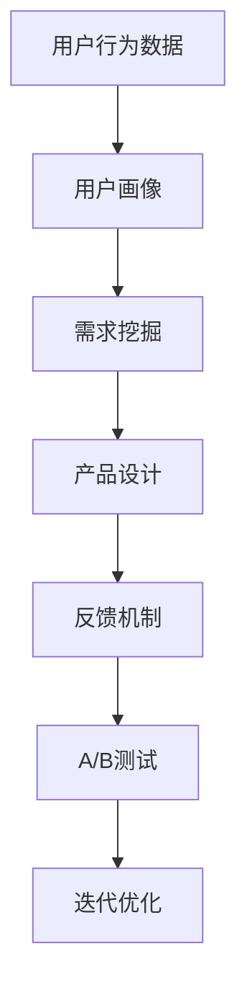

                 

# 知识付费创业中的用户需求挖掘技巧

## 1. 背景介绍

在知识付费时代，用户需求挖掘成为了决定创业成功的关键因素之一。用户通过购买课程、订阅服务等方式获取知识，这需要平台或机构深刻理解用户需求，提供真正有价值、满足用户实际需求的内容。

### 1.1 问题由来

随着在线教育、智能音箱、知识分享社区等知识付费产品的兴起，如何精准挖掘用户需求，从而开发出符合用户期望的产品，成为困扰知识付费创业者的核心问题。这一问题不只局限于知识付费领域，其实也反映了任何数字产品、服务需求挖掘的共同挑战。

### 1.2 问题核心关键点

用户需求挖掘的核心关键点在于以下几个方面：
- **用户行为分析**：通过分析用户的行为数据，了解用户在平台上的活动轨迹和偏好。
- **用户反馈收集**：主动收集用户的使用反馈，识别用户满意度和需求痛点。
- **竞品分析**：分析竞争对手的成功案例和失败教训，学习借鉴他们的用户需求挖掘策略。
- **市场调研**：通过市场调查问卷、访谈等方式，获取用户直接反馈，了解市场需求和潜在机会。

## 2. 核心概念与联系

### 2.1 核心概念概述

为更好地理解用户需求挖掘技巧，本节将介绍几个密切相关的核心概念：

- **用户行为数据**：记录用户在平台上的所有操作，如点击、浏览、购买、评论等，是分析用户需求和行为模式的基础。
- **用户画像**：通过整合多维度的用户数据，构建出用户的行为、兴趣、价值等标签，形成详细用户画像，帮助理解不同用户群体的需求。
- **需求挖掘**：利用用户行为数据、用户画像等工具和技术，识别出用户潜在需求，形成可执行的产品功能设计。
- **反馈机制**：通过设计合理的反馈渠道，收集用户对产品的意见和建议，进一步优化产品功能。
- **A/B测试**：在控制变量的情况下，测试不同设计方案对用户行为的影响，快速迭代优化产品。

这些概念之间的逻辑关系可以通过以下Mermaid流程图来展示：



这个流程图展示用户需求挖掘的关键流程：

1. 收集用户行为数据，构建详细用户画像。
2. 根据用户画像，进行需求挖掘，形成产品设计。
3. 设计反馈机制，收集用户意见，优化产品。
4. 使用A/B测试，验证产品设计效果，不断迭代。

## 3. 核心算法原理 & 具体操作步骤
### 3.1 算法原理概述

用户需求挖掘基于数据挖掘、机器学习和统计分析等技术，旨在从用户行为数据中识别出用户需求和潜在问题。其核心算法包括：

- **聚类算法**：将用户分为不同群体，识别出具有相似行为特征的用户群体。
- **关联规则学习**：挖掘用户行为数据中的关联规则，发现用户的行为模式。
- **文本挖掘**：分析用户评论、反馈等文本数据，了解用户的情感和需求。
- **分类算法**：预测用户对产品新功能的接受度，辅助设计合理的反馈和迭代机制。

### 3.2 算法步骤详解

用户需求挖掘通常分为以下几步：

**Step 1: 数据收集**
- 利用网站、应用等平台，记录用户的行为数据。
- 设计问卷调查，收集用户的直接反馈。
- 分析竞争对手的公开数据，学习成功案例和失败教训。

**Step 2: 数据预处理**
- 清洗用户数据，去除无效、异常数据。
- 进行数据标准化，确保数据的可比性。
- 分词、去除停用词等文本处理，为文本分析奠定基础。

**Step 3: 特征提取**
- 通过统计、文本分析等方法，提取用户特征。
- 使用TF-IDF、Word2Vec等技术，将文本转换为数值特征。
- 设计合适的指标，如用户活跃度、留存率等，描述用户行为。

**Step 4: 用户画像构建**
- 将用户特征进行聚类，构建用户画像。
- 设计用户分群模型，如K-Means、层次聚类等。
- 对用户画像进行可视化展示，便于分析。

**Step 5: 需求挖掘**
- 分析用户行为数据，识别用户兴趣和行为模式。
- 进行关联规则挖掘，找出用户需求之间的联系。
- 使用情感分析工具，了解用户对产品功能的态度。
- 设计分类模型，预测新功能的可能接受度。

**Step 6: 产品设计**
- 根据需求挖掘结果，设计初步产品功能。
- 设计用户反馈渠道，收集用户意见和建议。
- 设计A/B测试方案，验证产品功能的效果。

**Step 7: 迭代优化**
- 根据用户反馈和测试结果，迭代优化产品功能。
- 不断进行A/B测试，验证产品改进效果。
- 持续收集用户数据，更新用户画像和需求模型。

### 3.3 算法优缺点

用户需求挖掘方法具有以下优点：
1. 系统性：通过数据驱动的方式，科学地识别用户需求。
2. 可操作性：将抽象的需求转换为具体的产品设计，易于实施。
3. 动态性：能够快速迭代，根据用户反馈优化产品。

同时，也存在一些局限性：
1. 数据隐私：用户数据的收集和使用需要符合隐私法规，避免侵犯用户隐私。
2. 数据质量：数据的不完整、不均衡、噪声等问题，可能影响挖掘结果的准确性。
3. 用户主观性：用户的行为和反馈有时受情绪、偏见等因素影响，需进行充分分析和验证。

尽管存在这些局限性，但就目前而言，基于数据驱动的需求挖掘方法仍然是挖掘用户需求的有效途径。未来相关研究的重点在于如何提高数据质量和用户反馈的真实性，同时兼顾隐私保护和用户满意度。

### 3.4 算法应用领域

用户需求挖掘技术在多个领域中得到了广泛应用，例如：

- 在线教育平台：通过分析学生的学习行为和成绩，设计个性化的学习计划和推荐系统。
- 智能音箱和助理：根据用户语音指令，挖掘用户兴趣，提供个性化的语音服务和内容推荐。
- 知识分享社区：分析用户评论和点赞行为，挖掘用户兴趣和需求，优化社区内容推荐。
- 电子商务网站：通过分析用户的浏览、购买行为，设计个性化推荐引擎和广告投放策略。

## 4. 数学模型和公式 & 详细讲解 & 举例说明

### 4.1 数学模型构建

假设我们有一组用户行为数据 $D=\{(x_i,y_i)\}_{i=1}^N$，其中 $x_i$ 为行为特征，$y_i$ 为行为标签（如是否购买、点击等）。

用户需求挖掘的目标是构建用户画像 $U$，识别用户潜在需求 $R$。数学上，可以表示为：

$$
\begin{align*}
U &= \arg\min_U \mathcal{L}(U, D) \\
R &= \arg\max_R \mathcal{P}(R|U)
\end{align*}
$$

其中 $\mathcal{L}(U, D)$ 为画像损失函数，$\mathcal{P}(R|U)$ 为需求概率模型。

### 4.2 公式推导过程

**Step 1: 画像构建**
假设 $U=\{u_1,u_2,\dots,u_k\}$，每条用户行为数据 $x_i$ 对应画像中的权重 $w_i$。则画像损失函数 $\mathcal{L}(U, D)$ 可以表示为：

$$
\mathcal{L}(U, D) = \sum_{i=1}^N w_i y_i \log \hat{y}_i + (1-y_i) \log(1-\hat{y}_i)
$$

其中 $\hat{y}_i$ 为画像预测的概率。

**Step 2: 需求挖掘**
假设 $R=\{r_1,r_2,\dots,r_m\}$，每条需求 $r_j$ 对应画像中的权重 $w_j$。则需求概率模型 $\mathcal{P}(R|U)$ 可以表示为：

$$
\mathcal{P}(R|U) = \frac{\prod_{j=1}^m \exp(u_j \cdot w_j)}{\sum_{j=1}^m \exp(u_j \cdot w_j)}
$$

其中 $u_j$ 为画像中的特征向量，$w_j$ 为需求的权重。

**Step 3: 需求实现**
假设每条需求 $r_j$ 对应一个产品功能 $f_j$。则需求实现过程可以表示为：

$$
f_j = \arg\min_{f_j} \mathcal{L}(f_j, D|U)
$$

其中 $\mathcal{L}(f_j, D|U)$ 为功能损失函数，需要根据具体需求进行设计。

### 4.3 案例分析与讲解

以在线教育平台为例，通过用户行为数据和评论文本，进行用户需求挖掘和产品设计。

1. **数据收集**：收集学生的操作记录、成绩数据、课程评价等行为数据。
2. **数据预处理**：清洗行为数据，去除异常行为记录；对文本进行分词、去停用词等处理。
3. **特征提取**：提取学生行为特征（如学习时长、平均成绩等）和文本特征（如情感极性、评论词汇等）。
4. **用户画像构建**：使用K-Means聚类算法，将学生分为不同群体，每个群体对应一个画像。
5. **需求挖掘**：通过关联规则挖掘，发现学生群体对课程、学习内容的需求关联。
6. **产品设计**：根据需求挖掘结果，设计个性化推荐算法和课程推荐系统。
7. **迭代优化**：通过A/B测试，验证推荐算法的效果，不断优化产品功能。

## 5. 项目实践：代码实例和详细解释说明

### 5.1 开发环境搭建

在进行用户需求挖掘的实践前，我们需要准备好开发环境。以下是使用Python进行TensorFlow开发的环境配置流程：

1. 安装Anaconda：从官网下载并安装Anaconda，用于创建独立的Python环境。

2. 创建并激活虚拟环境：
```bash
conda create -n tf-env python=3.8 
conda activate tf-env
```

3. 安装TensorFlow：根据CUDA版本，从官网获取对应的安装命令。例如：
```bash
pip install tensorflow==2.3.0
```

4. 安装相关依赖：
```bash
pip install pandas numpy matplotlib sklearn
```

5. 安装TensorBoard：用于可视化模型训练过程，可以通过Jupyter Notebook启动TensorBoard。

完成上述步骤后，即可在`tf-env`环境中开始项目实践。

### 5.2 源代码详细实现

以下是一个简单的用户需求挖掘的TensorFlow代码实现，包括数据预处理、用户画像构建和需求挖掘：

```python
import tensorflow as tf
import pandas as pd
from sklearn.cluster import KMeans
from sklearn.decomposition import PCA

# 加载行为数据
data = pd.read_csv('user_behavior.csv')

# 数据预处理
data.dropna(inplace=True) # 去除缺失值
data.drop_duplicates(inplace=True) # 去除重复记录

# 特征提取
features = data[['learn_time', 'average_score', 'comment_score']]
labels = data['is_purchase']

# 用户画像构建
kmeans = KMeans(n_clusters=5)
kmeans.fit(features)
clusters = kmeans.labels_

# 可视化用户画像
pca = PCA(n_components=2)
features_pca = pca.fit_transform(features)
plt.scatter(features_pca[:, 0], features_pca[:, 1], c=clusters)

# 需求挖掘
关联规则 = pd.read_csv('association_rules.csv')
关联规则['cluster'] = clusters
关联规则 = pd.get_dummies(关联规则, columns=['cluster'], drop_first=True)
关联规则.head()

# 模型训练
model = tf.keras.models.Sequential([
    tf.keras.layers.Dense(32, activation='relu', input_shape=(features.shape[1],)),
    tf.keras.layers.Dense(8, activation='relu'),
    tf.keras.layers.Dense(1, activation='sigmoid')
])
model.compile(optimizer='adam', loss='binary_crossentropy', metrics=['accuracy'])
model.fit(features, labels, epochs=10, batch_size=32)
```

### 5.3 代码解读与分析

让我们再详细解读一下关键代码的实现细节：

**数据预处理**
- `data.dropna(inplace=True)`：去除缺失值，保证数据完整性。
- `data.drop_duplicates(inplace=True)`：去除重复记录，避免数据冗余。

**特征提取**
- `features = data[['learn_time', 'average_score', 'comment_score']]`：选择关键行为特征。
- `labels = data['is_purchase']`：选择行为标签（是否购买）。

**用户画像构建**
- `kmeans = KMeans(n_clusters=5)`：使用K-Means算法进行聚类，将用户分为5个群体。
- `clusters = kmeans.labels_`：获取聚类标签。
- `pca = PCA(n_components=2)`：使用PCA降维，可视化用户画像。
- `plt.scatter(features_pca[:, 0], features_pca[:, 1], c=clusters)`：绘制用户画像。

**需求挖掘**
- `关联规则 = pd.read_csv('association_rules.csv')`：加载关联规则数据。
- `关联规则['cluster'] = clusters`：将聚类标签添加到关联规则数据中。
- `关联规则 = pd.get_dummies(关联规则, columns=['cluster'], drop_first=True)`：将分类特征转换为哑变量。

**模型训练**
- `model = tf.keras.models.Sequential([...])`：定义神经网络模型。
- `model.compile(...)`：配置模型训练参数。
- `model.fit(...)`：训练模型。

### 5.4 运行结果展示

```python
import matplotlib.pyplot as plt
import seaborn as sns

# 绘制用户画像
sns.scatterplot(x=features_pca[:, 0], y=features_pca[:, 1], hue=clusters)
plt.show()

# 绘制关联规则
sns.barplot(x=关联规则.index, y=关联规则['count'])
plt.show()
```

以上就是完整的用户需求挖掘的代码实现，通过分析用户行为数据和评论文本，构建用户画像，挖掘用户潜在需求，并通过模型训练验证挖掘结果。

## 6. 实际应用场景

### 6.1 智能推荐系统

用户需求挖掘在智能推荐系统中具有重要应用。通过分析用户的历史行为数据，挖掘用户的兴趣和行为模式，可以设计出更加精准、个性化的推荐系统，提升用户体验。

在实际应用中，可以设计用户画像模型，对用户的行为数据进行聚类，构建详细用户画像。然后利用聚类结果，进行关联规则挖掘，找出用户需求之间的联系。最终，将挖掘出的需求作为产品功能设计的依据，优化推荐算法，提升推荐效果。

### 6.2 营销数据分析

营销数据分析中，用户需求挖掘可以帮助企业理解用户的消费行为，设计更有效的营销策略。通过收集用户购买记录、浏览历史等数据，构建用户画像，识别用户需求和兴趣。根据画像结果，企业可以设计有针对性的营销活动，提升营销效果。

### 6.3 客户服务优化

客户服务优化中，用户需求挖掘可以帮助企业识别客户投诉点，提升客户满意度。通过分析客户服务记录和反馈数据，构建用户画像，找出客户常遇问题和需求痛点。根据画像结果，企业可以优化服务流程，提升服务质量，增强客户黏性。

## 7. 工具和资源推荐

### 7.1 学习资源推荐

为了帮助开发者系统掌握用户需求挖掘的理论基础和实践技巧，这里推荐一些优质的学习资源：

1. 《数据挖掘导论》：是一本经典的入门书籍，涵盖了数据挖掘的基本概念和常用算法。
2. 《机器学习实战》：通过实战案例，介绍了机器学习的基础算法和应用。
3. Coursera《数据科学专业证书》：由斯坦福大学提供，系统讲解数据科学的方法和技术。
4. Kaggle竞赛平台：提供丰富的数据集和竞赛任务，可以实践和提升数据挖掘技能。
5. TensorFlow官方文档：详细的API和教程，帮助初学者快速上手TensorFlow。

通过对这些资源的学习实践，相信你一定能够快速掌握用户需求挖掘的精髓，并用于解决实际的业务问题。

### 7.2 开发工具推荐

高效的开发离不开优秀的工具支持。以下是几款用于用户需求挖掘开发的常用工具：

1. TensorFlow：基于Python的开源深度学习框架，灵活动态的计算图，适合快速迭代研究。支持丰富的机器学习算法和模型，是用户需求挖掘的重要工具。
2. Scikit-learn：开源的机器学习库，提供多种聚类、分类、回归等算法，方便进行数据处理和模型训练。
3. PyTorch：另一个流行的深度学习框架，灵活高效，适合进行复杂的模型训练和优化。
4. Weights & Biases：模型训练的实验跟踪工具，可以记录和可视化模型训练过程中的各项指标，方便对比和调优。
5. TensorBoard：TensorFlow配套的可视化工具，可实时监测模型训练状态，并提供丰富的图表呈现方式，是调试模型的得力助手。

合理利用这些工具，可以显著提升用户需求挖掘任务的开发效率，加快创新迭代的步伐。

### 7.3 相关论文推荐

用户需求挖掘技术的发展源于学界的持续研究。以下是几篇奠基性的相关论文，推荐阅读：

1. Clustering by Passes：提出K-Means算法，通过迭代优化，实现高效的聚类。
2. Apriori算法：提出基于关联规则的挖掘方法，识别频繁项集和关联规则。
3. TF-IDF：提出文本特征提取方法，通过词频和逆文档频率计算文本权重。
4. LDA主题模型：提出文本主题分析方法，识别文本中的潜在主题。
5. 深度学习中的自编码器：提出自编码器模型，通过重构误差训练深度神经网络。

这些论文代表了大数据挖掘技术的发展脉络。通过学习这些前沿成果，可以帮助研究者把握学科前进方向，激发更多的创新灵感。

## 8. 总结：未来发展趋势与挑战

### 8.1 总结

本文对用户需求挖掘技巧进行了全面系统的介绍。首先阐述了用户需求挖掘在知识付费创业中的重要性，明确了需求挖掘在用户行为分析和反馈收集中的核心地位。其次，从原理到实践，详细讲解了需求挖掘的数学模型和具体操作步骤，给出了用户需求挖掘的完整代码实例。同时，本文还广泛探讨了需求挖掘在智能推荐、营销数据分析、客户服务优化等多个领域的应用前景，展示了需求挖掘范式的广泛应用。最后，本文精选了需求挖掘技术的各类学习资源，力求为读者提供全方位的技术指引。

通过本文的系统梳理，可以看到，用户需求挖掘技术在知识付费领域具有重要应用价值。它通过数据驱动的方式，科学地识别用户需求，设计符合用户期望的产品，提升用户体验和满意度。未来，伴随用户数据的不断积累和分析技术的不断进步，用户需求挖掘将更加精准高效，为知识付费产业带来更大的商业价值。

### 8.2 未来发展趋势

展望未来，用户需求挖掘技术将呈现以下几个发展趋势：

1. 自动化程度提升：通过深度学习模型自动化分析用户数据，减少人工干预，提升挖掘效率。
2. 多维度数据融合：融合用户行为数据、社交网络数据、地理位置数据等多维度信息，更全面地理解用户需求。
3. 实时化挖掘：通过实时数据流分析，快速响应用户需求变化，提供更加个性化的服务。
4. 跨领域应用拓展：将需求挖掘技术应用到更多领域，如金融、医疗、制造等，提升跨领域数据融合和应用能力。
5. 交互式挖掘：通过用户反馈和互动，实时调整和优化需求挖掘模型，提升模型准确性。

以上趋势凸显了用户需求挖掘技术的广阔前景。这些方向的探索发展，必将进一步提升需求挖掘的精准性和实时性，为知识付费产业带来更大的商业价值。

### 8.3 面临的挑战

尽管用户需求挖掘技术已经取得了瞩目成就，但在迈向更加智能化、普适化应用的过程中，它仍面临诸多挑战：

1. 数据隐私保护：用户数据的收集和使用需要符合隐私法规，避免侵犯用户隐私。
2. 数据质量问题：数据的不完整、不均衡、噪声等问题，可能影响挖掘结果的准确性。
3. 用户主观性强：用户的行为和反馈有时受情绪、偏见等因素影响，需进行充分分析和验证。
4. 模型解释性不足：用户需求挖掘模型往往比较复杂，难以解释其内部工作机制和决策逻辑。

尽管存在这些挑战，但就目前而言，基于数据驱动的需求挖掘方法仍然是挖掘用户需求的有效途径。未来相关研究的重点在于如何提高数据质量和用户反馈的真实性，同时兼顾隐私保护和用户满意度。

### 8.4 研究展望

面对用户需求挖掘所面临的种种挑战，未来的研究需要在以下几个方面寻求新的突破：

1. 研究更高效的数据处理方法：开发高效的数据清洗、特征提取和降维技术，提升数据质量。
2. 引入更强大的深度学习模型：通过引入卷积神经网络、循环神经网络等深度学习模型，提高用户需求挖掘的准确性。
3. 设计更合理的反馈机制：设计用户反馈的自动化处理机制，提升用户反馈的真实性和效率。
4. 引入更多维度的数据融合：通过融合用户行为数据、社交网络数据、地理位置数据等多维度信息，更全面地理解用户需求。
5. 增强模型解释性：通过可解释性技术，如LIME、SHAP等，提升需求挖掘模型的解释性。

这些研究方向的探索，必将引领用户需求挖掘技术迈向更高的台阶，为知识付费产业带来更大的商业价值。面向未来，用户需求挖掘技术还需要与其他人工智能技术进行更深入的融合，如知识表示、因果推理、强化学习等，多路径协同发力，共同推动知识付费产业的发展。总之，需求挖掘需要开发者根据具体任务，不断迭代和优化模型、数据和算法，方能得到理想的效果。

---

作者：禅与计算机程序设计艺术 / Zen and the Art of Computer Programming

