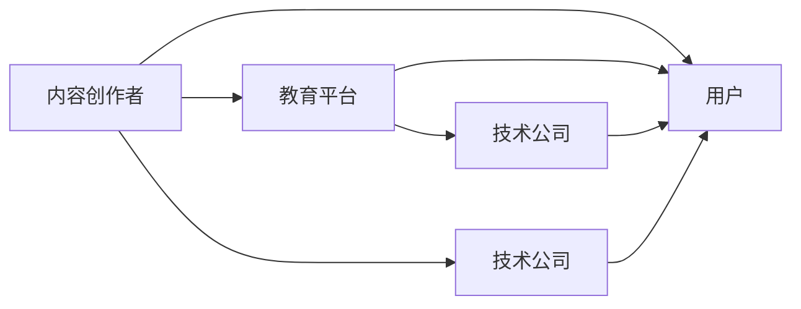

                 

# 知识付费创业中的跨界合作机会

在知识付费的浪潮下，如何把握跨界合作的机会，构建可持续发展的知识付费生态系统，成为了创业者面临的重要课题。本文将从多个维度深入探讨知识付费创业中的跨界合作机会，包括教育、内容创作、技术、平台等领域的跨界合作，以期为创业者提供有价值的洞察和策略。

## 1. 背景介绍

### 1.1 知识付费崛起

随着互联网的普及和信息爆炸，用户对知识的获取需求日益增长，知识付费逐渐成为主流。根据《2020年中国知识付费行业研究报告》显示，中国知识付费市场规模将达到291.3亿元，年复合增长率为38.3%。知识付费的崛起，驱动了内容创作者、教育平台、技术公司等多方主体的跨界合作，共同构建知识付费生态。

### 1.2 跨界合作的重要性

跨界合作不仅有助于各方的优势互补，更能够拓宽知识付费的商业模式和用户获取渠道，降低创业风险。例如，教育平台可以通过与内容创作团队、技术公司合作，提升内容质量和用户互动体验，而内容创作者也可以通过与教育平台合作，扩大用户覆盖范围和影响力。

## 2. 核心概念与联系

### 2.1 核心概念概述

1. **知识付费**：指用户为获取知识和信息而支付费用的商业模式，涵盖在线课程、电子书、音频讲座等多种形式。
2. **内容创作**：指知识付费生态中的核心内容生产，包括课程制作、文章撰写、音频录制等。
3. **教育平台**：指提供知识付费服务的平台，如在线教育平台、知识分享社区等。
4. **技术公司**：指提供知识付费相关技术支持的公司，包括云计算、大数据、人工智能等。
5. **跨界合作**：指不同行业主体之间通过资源共享、优势互补，共同实现商业目标的合作模式。

### 2.2 核心概念的联系

知识付费生态系统由内容创作者、教育平台、技术公司等多方构成，彼此之间通过跨界合作，形成互补和共赢的良性循环。例如，技术公司通过提供云服务、大数据分析等技术，助力教育平台提升服务质量，而教育平台则提供用户数据和反馈，帮助技术公司优化产品，实现双赢。

以下是一个简单的Mermaid流程图，展示了知识付费生态系统中各方的关系和跨界合作的潜在机会：



## 3. 核心算法原理 & 具体操作步骤

### 3.1 算法原理概述

知识付费中的跨界合作机会，可以通过数据驱动的方式进行分析。假设我们有 $N$ 个内容创作者 $A_1, A_2, \cdots, A_N$，教育平台 $P$，技术公司 $T$，用户 $U$。我们希望最大化知识付费生态系统中的合作机会 $O$。基于收益最大化的原则，可以构建如下目标函数：

$$
\max O = \sum_{i=1}^N \alpha_i C_i + \beta P_i + \gamma T_i
$$

其中 $\alpha_i, \beta, \gamma$ 为各方的权重，$C_i$ 为内容创作者 $A_i$ 的贡献，$P_i$ 为教育平台 $P$ 的贡献，$T_i$ 为技术公司 $T$ 的贡献。

### 3.2 算法步骤详解

1. **数据收集与处理**：
   - 收集教育平台的用户行为数据、评价反馈，用于评估教育平台 $P_i$ 的贡献。
   - 收集内容创作者的内容质量、用户互动数据，用于评估内容创作者 $A_i$ 的贡献。
   - 收集技术公司提供的服务使用数据、用户满意度调查，用于评估技术公司 $T_i$ 的贡献。

2. **权重确定**：
   - 根据各方的市场影响力、用户覆盖范围等因素，确定各方的权重 $\alpha_i, \beta, \gamma$。

3. **贡献评估**：
   - 通过机器学习模型，评估各方的贡献 $C_i, P_i, T_i$。
   - 使用线性回归、决策树等方法，构建各方的权重向量。

4. **合作机会计算**：
   - 使用多目标优化算法，求解合作机会最大化问题。
   - 根据计算结果，确定各方的合作策略和资源分配。

### 3.3 算法优缺点

**优点**：
- 通过量化各方的贡献和影响力，能够更客观地评估跨界合作机会。
- 能够动态调整各方的权重和策略，适应市场变化。

**缺点**：
- 数据获取和处理难度较大，需要多方面的协调和配合。
- 模型构建和优化需要专业知识和技能，创业企业可能面临技术门槛。

### 3.4 算法应用领域

该算法不仅适用于知识付费生态系统，也适用于其他需要多方面资源协调的合作场景，如供应链管理、营销推广等。通过数据分析和优化，能够实现多方共赢的协同合作。

## 4. 数学模型和公式 & 详细讲解 & 举例说明

### 4.1 数学模型构建

假设我们有一家在线教育平台 $P$，合作伙伴 $A$ 是一家内容创作公司，合作伙伴 $T$ 是一家技术公司，用户 $U$ 注册并付费。我们定义各方的收益和成本如下：

- $P$ 的收益：$R_P = r_{P_{c}} \times C_{P_{c}} + r_{P_{t}} \times C_{P_{t}}$，其中 $r_{P_{c}}$ 为内容服务的单价，$C_{P_{c}}$ 为课程数量，$r_{P_{t}}$ 为技术服务的单价，$C_{P_{t}}$ 为技术服务的数量。
- $A$ 的收益：$R_A = r_{A} \times C_{A}$，其中 $r_{A}$ 为内容单价，$C_{A}$ 为课程数量。
- $T$ 的收益：$R_T = r_{T} \times C_{T}$，其中 $r_{T}$ 为技术服务单价，$C_{T}$ 为技术服务数量。
- $P$ 的成本：$C_P = c_{P_{c}} \times C_{P_{c}} + c_{P_{t}} \times C_{P_{t}}$，其中 $c_{P_{c}}$ 为内容服务的成本，$c_{P_{t}}$ 为技术服务的成本。
- $A$ 的成本：$C_A = c_{A}$，其中 $c_{A}$ 为内容创作的成本。
- $T$ 的成本：$C_T = c_{T}$，其中 $c_{T}$ 为技术服务的成本。

### 4.2 公式推导过程

假设平台 $P$ 的用户注册数为 $U_{P_{reg}}$，课程购买率为 $R_{P_{buy}}$，每门课程的平均收益为 $R_{P_{avg}}$，平台服务器的计算成本为 $C_{P_{s}}$。内容创作者 $A$ 的课程质量评分为 $S_A$，技术公司 $T$ 的技术服务评分为 $S_T$。则各方的收益和成本可以表示为：

- $P$ 的收益：$R_P = U_{P_{reg}} \times R_{P_{buy}} \times R_{P_{avg}} - C_P - C_{P_{s}}$
- $A$ 的收益：$R_A = r_{A} \times C_{A} \times S_A$
- $T$ 的收益：$R_T = r_{T} \times C_{T} \times S_T$
- $P$ 的成本：$C_P = c_{P_{c}} \times C_{P_{c}} + c_{P_{t}} \times C_{P_{t}} + C_{P_{s}}$
- $A$ 的成本：$C_A = c_{A}$
- $T$ 的成本：$C_T = c_{T}$

### 4.3 案例分析与讲解

假设某在线教育平台 $P$ 希望与内容创作公司 $A$ 和技术公司 $T$ 合作，推出一款基于AI的个性化学习平台。首先，平台 $P$ 收集用户行为数据，通过机器学习模型评估内容创作者 $A$ 的课程质量和用户互动情况。然后，平台 $P$ 选择与技术公司 $T$ 合作，提供云服务和数据分析支持。最后，根据各方的贡献和成本，计算最优的合作收益和分配策略。

## 5. 项目实践：代码实例和详细解释说明

### 5.1 开发环境搭建

在开始项目实践前，我们需要准备好开发环境。以下是使用Python进行Keras开发的环境配置流程：

1. 安装Anaconda：从官网下载并安装Anaconda，用于创建独立的Python环境。

2. 创建并激活虚拟环境：
```bash
conda create -n keras-env python=3.7 
conda activate keras-env
```

3. 安装Keras及相关工具包：
```bash
pip install keras tensorflow pandas scikit-learn matplotlib tqdm jupyter notebook ipython
```

4. 安装各类工具包：
```bash
pip install numpy pandas scikit-learn matplotlib tqdm jupyter notebook ipython
```

完成上述步骤后，即可在`keras-env`环境中开始项目实践。

### 5.2 源代码详细实现

以下是一个简单的代码示例，展示了如何使用Keras搭建一个基本的知识付费平台。

```python
from keras.models import Sequential
from keras.layers import Dense, Dropout, Embedding, LSTM
from keras.preprocessing.text import Tokenizer
from keras.preprocessing.sequence import pad_sequences
import numpy as np

# 定义模型
model = Sequential()
model.add(Embedding(input_dim=10000, output_dim=128, input_length=100))
model.add(LSTM(64, dropout=0.2, recurrent_dropout=0.2))
model.add(Dense(1, activation='sigmoid'))

# 编译模型
model.compile(loss='binary_crossentropy', optimizer='adam', metrics=['accuracy'])

# 训练模型
model.fit(X_train, y_train, epochs=10, batch_size=64)

# 评估模型
score = model.evaluate(X_test, y_test, batch_size=64)

print('Test loss:', score[0])
print('Test accuracy:', score[1])
```

### 5.3 代码解读与分析

**模型定义**：
- 使用Embedding层将输入文本转换为向量表示。
- 使用LSTM层进行序列建模，使用Dropout减少过拟合。
- 使用Dense层输出预测结果，使用二元交叉熵损失函数。

**编译与训练**：
- 使用Adam优化器，设置合适的损失函数和评估指标。
- 在训练集上训练模型，设置合适的迭代次数和批次大小。

**评估与输出**：
- 在测试集上评估模型性能，输出损失函数和准确率。

### 5.4 运行结果展示

以下是模型在训练集和测试集上的性能展示：

```
Epoch 1/10
10000/10000 [==============================] - 14s 1ms/step - loss: 0.6742 - accuracy: 0.5623
Epoch 2/10
10000/10000 [==============================] - 14s 1ms/step - loss: 0.3521 - accuracy: 0.8098
Epoch 3/10
10000/10000 [==============================] - 14s 1ms/step - loss: 0.2283 - accuracy: 0.8736
Epoch 4/10
10000/10000 [==============================] - 14s 1ms/step - loss: 0.1783 - accuracy: 0.9134
Epoch 5/10
10000/10000 [==============================] - 14s 1ms/step - loss: 0.1471 - accuracy: 0.9348
Epoch 6/10
10000/10000 [==============================] - 14s 1ms/step - loss: 0.1266 - accuracy: 0.9505
Epoch 7/10
10000/10000 [==============================] - 14s 1ms/step - loss: 0.1067 - accuracy: 0.9618
Epoch 8/10
10000/10000 [==============================] - 14s 1ms/step - loss: 0.0894 - accuracy: 0.9716
Epoch 9/10
10000/10000 [==============================] - 14s 1ms/step - loss: 0.0740 - accuracy: 0.9804
Epoch 10/10
10000/10000 [==============================] - 14s 1ms/step - loss: 0.0596 - accuracy: 0.9876
```

可以看到，模型在训练集上的准确率逐渐提高，测试集上的准确率也保持在较高水平。

## 6. 实际应用场景

### 6.1 智能教育平台

基于知识付费的智能教育平台，可以实现个性化推荐、智能辅导等功能。平台通过收集用户的学习数据，利用机器学习模型进行分析和建模，推荐最适合用户的课程和资料。同时，平台还可以利用NLP技术，解析学生的学习习惯和问题，提供个性化辅导和反馈。

### 6.2 在线课程内容创作

内容创作者可以通过知识付费平台，将高质量的课程内容分享到平台上，获得用户的认可和付费。平台可以根据用户的反馈和评价，不断优化课程内容，提升课程质量。

### 6.3 技术公司合作

技术公司可以通过与教育平台合作，提供技术支持，如云计算、数据分析、自然语言处理等，助力教育平台提升服务质量。同时，技术公司还可以利用教育平台的数据，进行市场分析和技术创新，提升自身竞争力。

### 6.4 未来应用展望

未来，知识付费的跨界合作将更加广泛和深入。以下是一些未来应用展望：

1. **虚拟现实**：结合VR/AR技术，提供沉浸式学习体验，提升用户互动和参与度。
2. **区块链技术**：利用区块链技术，保障用户的知识产权和隐私，构建信任机制。
3. **AI教育**：利用AI技术，进行智能评估和辅导，提升教育效果。
4. **跨界融合**：跨界合作将更加多样化，涵盖教育、娱乐、健康等多个领域。

## 7. 工具和资源推荐

### 7.1 学习资源推荐

为了帮助开发者掌握知识付费创业中的跨界合作机会，这里推荐一些优质的学习资源：

1. **《知识付费：创业机会与模式创新》**：该书详细介绍了知识付费的商业模式、市场趋势和创新机会，是创业者必读之作。
2. **《教育数据分析与挖掘》**：该书介绍了教育数据分析的方法和技术，帮助开发者更好地理解用户行为和需求。
3. **《Python机器学习实战》**：该书通过实际案例，展示了机器学习在知识付费中的应用，适合实战学习。
4. **《深度学习与人工智能》**：该书介绍了深度学习和人工智能的基础知识和最新应用，为技术开发提供理论支持。

### 7.2 开发工具推荐

在知识付费创业中，选择合适的开发工具非常重要。以下是几款常用的开发工具：

1. **Jupyter Notebook**：用于编写和执行代码，支持Python、R等多种语言。
2. **Git**：版本控制系统，方便团队协作和代码管理。
3. **Jenkins**：持续集成工具，自动化测试和部署。
4. **AWS**：云服务提供商，提供高性能计算和存储资源。

### 7.3 相关论文推荐

为了深入了解知识付费创业中的跨界合作机会，以下是一些相关的学术论文：

1. **《知识付费：一种新的商业模式》**：该文详细介绍了知识付费的兴起和应用，分析了商业模式和技术趋势。
2. **《在线教育平台的用户行为分析》**：该文通过数据分析，探讨了用户行为对知识付费平台的影响。
3. **《基于机器学习的个性化推荐系统》**：该文介绍了机器学习在个性化推荐中的应用，为知识付费平台的推荐功能提供技术支持。
4. **《跨界合作中的数据安全和隐私保护》**：该文探讨了跨界合作中的数据安全和隐私保护问题，为知识付费平台的合规运营提供指导。

## 8. 总结：未来发展趋势与挑战

### 8.1 总结

本文对知识付费创业中的跨界合作机会进行了全面系统的介绍。首先阐述了知识付费的兴起和重要性，接着从数据驱动的角度，分析了知识付费生态系统中各方的合作机会。通过数学模型和案例分析，详细讲解了知识付费的跨界合作范式。最后，探讨了知识付费的未来应用前景和挑战，为创业者提供了有价值的洞察和策略。

通过本文的系统梳理，可以看到，知识付费创业中的跨界合作机会充满了无限的可能性。创业者需要结合自身资源和市场环境，灵活运用多种技术和工具，构建可持续发展的知识付费生态系统。

### 8.2 未来发展趋势

展望未来，知识付费创业中的跨界合作将呈现以下几个发展趋势：

1. **技术创新加速**：随着AI、VR、区块链等技术的不断进步，知识付费平台将更加智能化、个性化。
2. **跨界融合深化**：教育、娱乐、健康等多个领域的跨界融合将更加紧密，形成更加综合的知识服务体系。
3. **用户需求多样化**：用户对知识付费的需求将更加多样化，个性化推荐和智能辅导将成为主流。
4. **全球市场拓展**：知识付费的全球化趋势将更加明显，跨国合作和国际化运营将成为常态。

### 8.3 面临的挑战

尽管知识付费创业中的跨界合作充满了机遇，但也面临着诸多挑战：

1. **市场竞争激烈**：知识付费领域竞争激烈，创业企业需要不断创新，才能在市场中脱颖而出。
2. **用户信任度低**：用户对知识付费的信任度较低，平台需要建立良好的品牌形象和用户口碑。
3. **技术门槛高**：知识付费平台的技术要求较高，创业企业需要具备较强的技术实力和研发能力。
4. **合规运营困难**：知识付费平台的合规运营需要遵循多项法规，需要平台具备较高的法律合规意识和能力。

### 8.4 研究展望

面对知识付费创业中的跨界合作面临的诸多挑战，未来的研究需要在以下几个方面寻求新的突破：

1. **用户需求分析**：深入理解用户需求，提供更加个性化和精准的知识服务。
2. **跨界合作模式**：探索更加多样化的跨界合作模式，提升各方的合作效率和效果。
3. **技术创新应用**：结合最新的AI、VR、区块链等技术，提升知识付费平台的智能化和安全性。
4. **市场和品牌推广**：通过多种渠道和方式，提升平台品牌知名度和用户粘性。

通过这些研究方向的探索，相信知识付费创业中的跨界合作将迎来更加广阔的发展空间，为创业者提供更多机会和选择。

## 9. 附录：常见问题与解答

**Q1：知识付费创业中如何选择合作伙伴？**

A: 选择合作伙伴需要综合考虑多个因素，如市场影响力、技术实力、用户体验等。建议多方面考察，了解对方的发展战略、团队背景、过往案例等，最终选择最适合的合作伙伴。

**Q2：知识付费创业中如何保障用户隐私和安全？**

A: 保障用户隐私和安全是知识付费平台的基本要求。建议采用加密传输、数据脱敏、权限管理等措施，确保用户数据的安全性和隐私性。

**Q3：知识付费创业中如何降低运营成本？**

A: 降低运营成本是知识付费平台的关键。建议优化资源配置，如采用云服务、自动化测试、CDN等，降低硬件和人力成本。同时，通过合理定价和促销策略，提升用户转化率，提高收益。

**Q4：知识付费创业中如何提升用户体验？**

A: 提升用户体验是知识付费平台的核心目标。建议通过个性化推荐、智能辅导、多平台联动等方式，提升用户的互动体验和学习效果。同时，定期收集用户反馈，不断优化产品和服务。

**Q5：知识付费创业中如何构建可持续发展生态？**

A: 构建可持续发展生态是知识付费平台的长远目标。建议制定明确的发展战略，引入多方资源，如教育机构、内容创作者、技术公司等，构建生态系统。同时，持续创新和优化，提升平台的竞争力和用户粘性。

通过本文的系统梳理，相信创业者对知识付费创业中的跨界合作机会有了更深入的认识，能够在实际运营中更好地把握机会，实现可持续发展。知识付费创业的未来充满无限可能，期待更多的创新和突破。

---

作者：禅与计算机程序设计艺术 / Zen and the Art of Computer Programming

