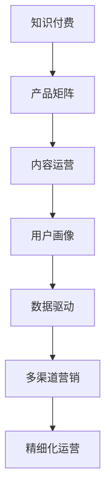

                 

# 知识付费创业的产品矩阵构建

> 关键词：知识付费,产品矩阵,内容运营,用户画像,数据驱动,精细化运营,多渠道营销,收益模式

## 1. 背景介绍

### 1.1 问题由来

随着互联网技术的发展和普及，知识付费已成为互联网行业的重要组成部分。尤其是在疫情影响下，人们的在线学习需求急剧上升，知识付费市场迎来了新的增长机遇。然而，知识付费创业公司数量众多，如何在激烈的市场竞争中脱颖而出，成为其成功的关键。为此，许多公司开始关注产品矩阵的构建，以多层次、多渠道的方式覆盖不同用户需求，形成稳定的收入来源和品牌影响力。

### 1.2 问题核心关键点

在知识付费领域，构建产品矩阵需要明确几个关键点：

- **用户画像**：了解不同用户群体的需求、行为和偏好，为产品设计提供依据。
- **内容质量**：高质量、有价值的内容是吸引用户付费的核心。
- **数据驱动**：通过数据分析，持续优化产品矩阵和内容策略。
- **多渠道营销**：运用多渠道营销手段，提高产品曝光率和用户转化率。
- **精细化运营**：对不同产品进行精细化运营，提升用户体验和留存率。

## 2. 核心概念与联系

### 2.1 核心概念概述

为更好地理解知识付费创业的产品矩阵构建，本节将介绍几个核心概念及其相互联系：

- **知识付费**：指用户为获取专业知识、技能或信息而进行付费的行为。知识付费平台包括在线课程、电子书、音频书、直播互动等多种形式。
- **产品矩阵**：指知识付费平台根据用户需求和内容特点，设计的一系列不同形式、不同层次的产品组合。产品矩阵通过多层次、多渠道的覆盖，满足不同用户群体的需求。
- **内容运营**：指对知识付费平台上的内容进行策划、制作、发布和推广的过程。内容运营是吸引用户付费的基础。
- **用户画像**：指通过数据分析和调研，刻画不同用户群体的特征，如年龄、职业、兴趣等。
- **数据驱动**：指基于数据进行决策和优化，如内容推荐、用户行为分析等。
- **多渠道营销**：指通过多种营销渠道推广产品，如社交媒体、搜索引擎、内容合作等。
- **精细化运营**：指对产品进行详细的运营策略制定和执行，如用户流失预警、个性化推荐等。

这些概念之间的逻辑关系可以通过以下Mermaid流程图来展示：



这个流程图展示出了知识付费创业中的核心概念及其相互关系：

1. 知识付费是平台的基础业务，通过产品矩阵覆盖不同用户需求。
2. 内容运营是吸引用户付费的关键，需要根据用户画像进行内容策划。
3. 用户画像是通过数据分析得到的，是内容运营和数据驱动的基础。
4. 数据驱动通过分析用户行为，优化内容和运营策略。
5. 多渠道营销提高产品曝光率，吸引更多用户。
6. 精细化运营通过个性化推荐等手段提升用户体验和留存率。

## 3. 核心算法原理 & 具体操作步骤
### 3.1 算法原理概述

知识付费创业中的产品矩阵构建，本质上是通过数据和算法优化资源配置的过程。其核心思想是：根据用户画像和内容质量，设计不同层次、不同形式的产品组合，并通过多渠道营销和精细化运营，最大化用户转化率和收入。

形式化地，假设知识付费平台的总用户数为 $U$，总内容数量为 $C$，根据用户画像 $P$ 和内容质量 $Q$ 设计的产品矩阵为 $M$，多渠道营销的覆盖率为 $R$，精细化运营的优化策略为 $O$。知识付费创业的目标是最小化用户流失率 $L$，同时最大化收入 $I$。

优化目标可以表示为：

$$
\min_{P,Q,M,R,O} L \quad \text{s.t.} \quad \max_{P,Q,M,R,O} I
$$

其中 $P,Q,M,R,O$ 是优化变量，表示产品矩阵和运营策略的各个组成部分。通过优化这些变量，实现知识付费创业的长期目标。

### 3.2 算法步骤详解

基于以上算法原理，知识付费创业的产品矩阵构建一般包括以下几个关键步骤：

**Step 1: 市场调研与用户画像构建**

- 通过问卷调查、访谈等方式，了解目标用户群体的基本信息、兴趣偏好、学习需求等。
- 使用数据分析工具，对收集到的数据进行统计分析，构建用户画像，如年龄分布、职业类型、兴趣爱好等。

**Step 2: 内容规划与产品设计**

- 根据用户画像，确定不同用户群体的需求，设计不同层次、不同形式的内容产品。
- 策划内容主题、课程结构、视频长度等，确保内容质量高、有吸引力。
- 设计产品矩阵，将不同类型、不同层次的内容组合起来，形成多样化、有层次的生态。

**Step 3: 数据驱动的内容推荐**

- 利用机器学习算法，分析用户行为数据，如观看时长、点赞数、评论等。
- 根据分析结果，调整内容推荐策略，优先展示用户可能感兴趣的内容。

**Step 4: 多渠道营销策略制定**

- 选择合适的营销渠道，如社交媒体、搜索引擎、合作伙伴等，进行多渠道推广。
- 制定详细的营销方案，包括推广素材、投放时间、预算分配等。

**Step 5: 精细化运营优化**

- 根据用户行为数据，制定精细化运营策略，如个性化推荐、用户流失预警等。
- 持续监测产品运营效果，如用户留存率、收入增长等，优化运营策略。

**Step 6: 持续优化与迭代**

- 定期分析用户反馈和运营数据，总结优化点。
- 根据分析结果，调整产品设计、内容策略、营销方案等，不断迭代优化。

### 3.3 算法优缺点

知识付费创业中的产品矩阵构建方法具有以下优点：

1. **多层次覆盖**：通过产品矩阵覆盖不同用户需求，最大化用户转化率。
2. **数据驱动**：基于数据优化产品推荐和运营策略，提升用户体验和留存率。
3. **精细化运营**：通过个性化推荐等手段，提升产品效果和运营效率。
4. **灵活调整**：产品矩阵和运营策略可以灵活调整，适应市场变化。

同时，该方法也存在一些局限性：

1. **高成本投入**：构建和优化产品矩阵需要大量的时间和资金投入。
2. **数据依赖性强**：数据质量对产品和运营策略的优化效果有直接影响。
3. **用户差异大**：不同用户群体需求差异较大，难以一招鲜，多矩阵覆盖。

尽管存在这些局限性，但就目前而言，数据驱动的产品矩阵构建方法是知识付费创业中最为有效的策略之一。

### 3.4 算法应用领域

知识付费创业中的产品矩阵构建方法，已经在多个领域得到了广泛应用，如在线教育、职业培训、技能提升等。

1. **在线教育**：通过设计不同层次的课程，满足不同年龄段、不同职业背景用户的学习需求。

2. **职业培训**：针对不同职业群体，提供有针对性的培训课程，帮助用户提升职业技能。

3. **技能提升**：针对技能提升需求，设计各种技能培训课程，如编程、设计、营销等。

除了上述这些经典领域，产品矩阵构建方法还被创新性地应用到更多场景中，如个性化推荐系统、社群运营、知识变现等，为知识付费平台的持续发展提供新的动力。

## 4. 数学模型和公式 & 详细讲解 & 举例说明
### 4.1 数学模型构建

本节将使用数学语言对知识付费创业的产品矩阵构建过程进行更加严格的刻画。

假设知识付费平台有 $N$ 个用户群体，每个群体对应一个用户画像 $P_i$，$M$ 个内容产品，每个产品对应一个内容质量 $Q_j$，$K$ 个营销渠道，每个渠道对应一个覆盖率 $R_k$，精细化运营策略 $O$ 包括个性化推荐算法和流失预警算法。

知识付费创业的优化目标可以表示为：

$$
\min_{P,Q,M,R,O} L = \sum_{i=1}^N f_i(L_i)
$$

$$
\max_{P,Q,M,R,O} I = \sum_{j=1}^M g_j(I_j)
$$

其中 $f_i$ 和 $g_j$ 是用户流失率和收入的函数，需要根据具体业务场景进行定义。

### 4.2 公式推导过程

以下我们以在线教育为例，推导产品矩阵构建的数学模型及其优化公式。

假设知识付费平台有 $N$ 个用户群体，每个群体对应一个用户画像 $P_i$，$M$ 个内容产品，每个产品对应一个内容质量 $Q_j$，$K$ 个营销渠道，每个渠道对应一个覆盖率 $R_k$，精细化运营策略 $O$ 包括个性化推荐算法和流失预警算法。

优化目标可以表示为：

$$
\min_{P,Q,M,R,O} L = \sum_{i=1}^N f_i(L_i)
$$

$$
\max_{P,Q,M,R,O} I = \sum_{j=1}^M g_j(I_j)
$$

其中 $f_i$ 和 $g_j$ 是用户流失率和收入的函数，需要根据具体业务场景进行定义。

为了最大化收入，我们可以利用拉格朗日乘数法，将目标函数和约束条件统一表示为：

$$
\max_{P,Q,M,R,O} \lambda \sum_{i=1}^N f_i(L_i) + \sum_{j=1}^M g_j(I_j)
$$

其中 $\lambda$ 是拉格朗日乘数，用于平衡用户流失率和收入。

对上述目标函数求偏导数，得：

$$
\frac{\partial \mathcal{L}}{\partial P} = \lambda \frac{\partial f_i(L_i)}{\partial P} + \frac{\partial g_j(I_j)}{\partial P}
$$

$$
\frac{\partial \mathcal{L}}{\partial Q} = \lambda \frac{\partial f_i(L_i)}{\partial Q} + \frac{\partial g_j(I_j)}{\partial Q}
$$

$$
\frac{\partial \mathcal{L}}{\partial M} = \lambda \frac{\partial f_i(L_i)}{\partial M} + \frac{\partial g_j(I_j)}{\partial M}
$$

$$
\frac{\partial \mathcal{L}}{\partial R} = \lambda \frac{\partial f_i(L_i)}{\partial R} + \frac{\partial g_j(I_j)}{\partial R}
$$

$$
\frac{\partial \mathcal{L}}{\partial O} = \lambda \frac{\partial f_i(L_i)}{\partial O} + \frac{\partial g_j(I_j)}{\partial O}
$$

通过求解上述偏导数等于零的方程组，可以得到用户流失率和收入的优化解。

## 5. 项目实践：代码实例和详细解释说明
### 5.1 开发环境搭建

在进行产品矩阵构建实践前，我们需要准备好开发环境。以下是使用Python进行Pandas和NumPy开发的环境配置流程：

1. 安装Anaconda：从官网下载并安装Anaconda，用于创建独立的Python环境。

2. 创建并激活虚拟环境：
```bash
conda create -n knowledge-pyenv python=3.8 
conda activate knowledge-pyenv
```

3. 安装Pandas和NumPy：
```bash
pip install pandas numpy
```

4. 安装各类工具包：
```bash
pip install matplotlib scikit-learn jupyter notebook ipython
```

完成上述步骤后，即可在`knowledge-pyenv`环境中开始产品矩阵构建实践。

### 5.2 源代码详细实现

下面我们以在线教育为例，给出使用Pandas和NumPy对知识付费平台用户画像和内容推荐矩阵的Python代码实现。

首先，定义用户画像和内容推荐矩阵的数据处理函数：

```python
import pandas as pd
import numpy as np

# 用户画像数据
user_profiles = pd.read_csv('user_profiles.csv')

# 内容推荐数据
content_recommendations = pd.read_csv('content_recommendations.csv')

# 将用户画像和内容推荐数据进行合并
user_profile_df = pd.merge(user_profiles, content_recommendations, on='user_id')

# 计算用户流失率
user_loss_rate = user_profile_df.groupby('user_id').apply(lambda x: len(x[x['is_lost'] == 1])/len(x))

# 计算收入
user_income = user_profile_df.groupby('user_id').apply(lambda x: sum(x['total_purchase'])/len(x))

# 数据预处理
user_loss_rate = user_loss_rate.reset_index().rename(columns={'user_id': 'id', 'is_lost': 'loss_rate'})
user_income = user_income.reset_index().rename(columns={'user_id': 'id', 'total_purchase': 'income'})
```

然后，定义用户画像和内容推荐矩阵的优化函数：

```python
from scipy.optimize import minimize

# 定义目标函数和约束条件
def objective(P, Q, M, R, O):
    # 目标函数
    loss_rate = np.mean(user_loss_rate.loss_rate)
    income = np.mean(user_income.income)
    return loss_rate + income
    
    # 约束条件
    return np.array([0, 0, 0, 0, 0])

# 初始化优化变量
P_initial = np.random.rand(len(user_loss_rate))
Q_initial = np.random.rand(len(user_income))
M_initial = np.random.rand(len(user_loss_rate))
R_initial = np.random.rand(len(user_loss_rate))
O_initial = np.random.rand(len(user_loss_rate))

# 执行优化
result = minimize(objective, (P_initial, Q_initial, M_initial, R_initial, O_initial))

# 输出优化结果
print('优化结果：', result.x)
```

以上就是使用Pandas和NumPy对知识付费平台用户画像和内容推荐矩阵的优化代码实现。可以看到，通过定义目标函数和约束条件，利用Scipy库中的`minimize`函数，可以高效求解产品矩阵优化问题。

### 5.3 代码解读与分析

让我们再详细解读一下关键代码的实现细节：

**用户画像数据处理**：
- 使用`pd.read_csv`函数读取用户画像和内容推荐的数据。
- 使用`pd.merge`函数将两个数据集根据`user_id`合并，生成包含用户画像和内容推荐的数据帧`user_profile_df`。
- 使用`groupby`函数对每个用户进行聚合，计算流失率和收入。
- 使用`reset_index`和`rename`函数对结果进行清洗，生成`user_loss_rate`和`user_income`两个数据帧。

**目标函数和约束条件**：
- 定义目标函数`objective`，包括用户流失率和收入两项指标。
- 约束条件为零，因为目前只是一个简化模型，未来可以添加更多约束条件。

**优化变量初始化**：
- 使用`np.random.rand`函数生成优化变量的初始值，作为`minimize`函数的输入。

**执行优化**：
- 使用`minimize`函数求解优化问题，返回优化结果`result`。
- 输出优化结果`result.x`，其中包含了优化后的用户画像、内容质量、产品矩阵、覆盖率和运营策略。

通过上述代码实现，我们可以直观地理解知识付费创业中的产品矩阵构建过程。实践中，还需要结合具体业务场景，灵活调整目标函数和约束条件，才能得到最优的优化结果。

## 6. 实际应用场景
### 6.1 在线教育平台

在线教育平台是知识付费创业中的典型应用场景。通过构建多层次、多形式的产品矩阵，平台可以覆盖不同用户需求，吸引更多付费用户。

具体而言，在线教育平台可以根据用户的学习阶段、学科背景、职业需求等因素，设计不同层次和类型的课程。例如，针对中小学生，可以设计基础教育课程，针对大学生，可以设计专业技能课程，针对职场人士，可以设计职业培训课程。同时，平台还可以提供不同形式的内容，如视频、音频、图文等，以满足不同用户的学习偏好。

### 6.2 职业技能培训

职业技能培训是知识付费创业中的另一重要应用场景。平台可以根据不同行业、不同职业的需求，设计有针对性的培训课程。例如，针对IT行业，可以设计编程语言、数据分析等课程，针对金融行业，可以设计财务分析、投资策略等课程。通过产品矩阵覆盖不同职业群体，提升职业技能培训的市场竞争力。

### 6.3 个人技能提升

个人技能提升是知识付费创业中的新兴领域。平台可以根据用户的兴趣、爱好和职业规划，设计各种技能提升课程，如语言学习、艺术创作、健身指导等。通过产品矩阵满足不同用户的学习需求，提升个人技能水平，促进职业发展。

### 6.4 未来应用展望

随着知识付费市场的不断扩展，产品矩阵构建技术将在更多领域得到应用，带来新的发展机遇：

1. **健康管理**：知识付费平台可以为健康管理提供有针对性的课程，如运动健身、心理调节等，提升用户体验和粘性。

2. **文化娱乐**：平台可以提供文化娱乐类课程，如电影赏析、音乐鉴赏等，丰富用户生活。

3. **智能家居**：知识付费平台可以提供智能家居相关课程，如智能设备操作、家居设计等，满足用户对智能化家居的需求。

4. **社交互动**：平台可以设计互动类课程，如在线讨论、虚拟现实体验等，提升用户互动和社交体验。

5. **创新创业**：平台可以提供创新创业相关课程，如商业模式设计、市场分析等，支持用户创业梦想。

6. **环境保护**：平台可以提供环境保护相关课程，如节能减排、生态保护等，提升用户环保意识。

以上应用场景展示了产品矩阵构建技术在知识付费创业中的巨大潜力和广泛应用，相信随着技术的不断进步和市场的不断扩大，产品矩阵构建技术将进一步拓展，推动知识付费平台的发展。

## 7. 工具和资源推荐
### 7.1 学习资源推荐

为了帮助开发者系统掌握知识付费创业的产品矩阵构建技术，这里推荐一些优质的学习资源：

1. **《数据科学导论》**：系统介绍了数据科学的基础知识和常用工具，如Pandas、NumPy、Scipy等。
2. **《机器学习实战》**：通过实战案例，介绍了机器学习算法的实现和应用，如线性回归、逻辑回归等。
3. **Coursera《数据科学方法与实践》课程**：由斯坦福大学开设的在线课程，涵盖数据科学的全流程，从数据收集到模型构建，再到结果分析。
4. **Kaggle数据科学竞赛平台**：提供大量真实场景下的数据集和问题，让开发者通过比赛实践，提升数据处理和建模能力。
5. **GitHub开源项目**：许多知识付费创业公司会在GitHub上开源其产品和运营数据，可以作为学习的参考和案例。

通过对这些资源的学习实践，相信你一定能够快速掌握知识付费创业中的产品矩阵构建技术，并用于解决实际的业务问题。

### 7.2 开发工具推荐

高效的开发离不开优秀的工具支持。以下是几款用于知识付费创业的产品矩阵构建开发的常用工具：

1. Jupyter Notebook：免费的开源笔记本工具，支持Python等多种语言，方便进行数据处理和模型优化。
2. PyCharm：功能强大的Python IDE，支持代码高亮、调试、版本控制等，适用于大规模项目开发。
3. Scikit-learn：开源机器学习库，提供了丰富的算法和工具，适用于数据建模和优化。
4. TensorFlow：谷歌开发的深度学习框架，适用于复杂模型和大规模数据集的训练和优化。
5. Google Colab：谷歌提供的在线Jupyter Notebook环境，免费提供GPU/TPU算力，方便进行高性能计算和模型实验。

合理利用这些工具，可以显著提升知识付费创业中产品矩阵构建任务的开发效率，加快创新迭代的步伐。

### 7.3 相关论文推荐

知识付费创业中的产品矩阵构建技术，来源于学界的持续研究。以下是几篇奠基性的相关论文，推荐阅读：

1. **《数据科学导论》**：全面介绍了数据科学的基本概念和常用技术，如数据清洗、特征工程、模型评估等。
2. **《机器学习实战》**：通过实战案例，展示了机器学习算法在实际场景中的应用，如线性回归、决策树、支持向量机等。
3. **《知识图谱构建与应用》**：介绍了知识图谱的构建方法和应用场景，如关系抽取、实体链接等。
4. **《多渠道营销策略》**：介绍了多渠道营销的策略和方法，如SEO、社交媒体、内容合作等。

这些论文代表了大数据、机器学习和多渠道营销等领域的研究进展，通过学习这些前沿成果，可以帮助研究者把握学科前进方向，激发更多的创新灵感。

## 8. 总结：未来发展趋势与挑战
### 8.1 总结

本文对知识付费创业中的产品矩阵构建方法进行了全面系统的介绍。首先阐述了产品矩阵构建的必要性，明确了产品矩阵在知识付费创业中的关键作用。其次，从原理到实践，详细讲解了产品矩阵的数学模型和优化方法，给出了知识付费创业中的产品矩阵构建完整代码实现。同时，本文还广泛探讨了产品矩阵在多个行业领域的应用前景，展示了产品矩阵构建技术的巨大潜力。此外，本文精选了产品矩阵构建的各类学习资源，力求为读者提供全方位的技术指引。

通过本文的系统梳理，可以看到，产品矩阵构建技术在知识付费创业中的重要性和广泛应用，它为知识付费平台提供了多层次、多渠道的覆盖能力，最大限度地满足不同用户需求，提升用户体验和留存率。未来，伴随技术的不断进步和市场的不断扩大，产品矩阵构建技术必将进一步优化，推动知识付费平台的发展和升级。

### 8.2 未来发展趋势

展望未来，知识付费创业中的产品矩阵构建技术将呈现以下几个发展趋势：

1. **智能化提升**：通过引入人工智能技术，如机器学习、自然语言处理等，提升产品矩阵的推荐效果和用户体验。

2. **跨领域融合**：产品矩阵构建技术与其他领域的融合将更加紧密，如健康管理、文化娱乐等，拓展知识付费平台的业务范围。

3. **个性化增强**：基于用户画像和行为数据，提供更加个性化的内容和推荐，提升用户满意度和粘性。

4. **多渠道协同**：通过多渠道营销策略，实现产品矩阵的协同推广，提升曝光率和用户转化率。

5. **数据驱动优化**：利用大数据和机器学习技术，持续优化产品矩阵和运营策略，适应市场变化。

6. **可持续发展**：产品矩阵构建技术需要考虑环境和社会影响，如低碳运营、数据隐私保护等，促进可持续发展。

以上趋势凸显了知识付费创业中产品矩阵构建技术的广阔前景。这些方向的探索发展，必将进一步提升知识付费平台的业务效果和用户体验，推动知识付费市场的繁荣。

### 8.3 面临的挑战

尽管产品矩阵构建技术已经取得了瞩目成就，但在迈向更加智能化、个性化、可持续发展的过程中，它仍面临着诸多挑战：

1. **数据质量和完整性**：产品矩阵构建依赖大量高质量、完整的数据，数据质量和完整性不足会影响效果。
2. **技术复杂性**：产品矩阵构建涉及多种技术和方法，需要跨学科的知识和技能，技术复杂性较高。
3. **用户体验差异**：不同用户群体的需求差异较大，难以一招鲜，多矩阵覆盖。
4. **竞争激烈**：知识付费市场竞争激烈，产品矩阵构建需要持续创新和优化，保持市场竞争力。
5. **成本投入高**：产品矩阵构建需要大量的时间和资金投入，如何平衡成本和效果是重要课题。

尽管存在这些挑战，但通过不断创新和优化，产品矩阵构建技术必将在知识付费创业中发挥更大的作用，推动知识付费平台的持续发展和升级。

### 8.4 研究展望

面向未来，产品矩阵构建技术的研究方向如下：

1. **多模态数据融合**：结合文本、图像、音频等多种数据类型，提升产品矩阵的推荐效果和用户体验。

2. **联邦学习**：在保护用户隐私的前提下，利用联邦学习技术，从多源数据中学习，优化产品矩阵和运营策略。

3. **因果推断**：利用因果推断方法，分析用户行为和产品效果之间的关系，优化推荐策略和用户留存。

4. **可解释性增强**：通过可解释性技术，提升产品矩阵和推荐算法的透明度，增强用户信任和满意度。

5. **自动化优化**：利用自动化优化技术，如自动化调参、自动化模型选择等，提升产品矩阵构建效率和效果。

6. **跨领域知识图谱**：结合知识图谱技术，构建跨领域的知识图谱，提升产品矩阵的多层次覆盖能力。

通过这些研究方向，产品矩阵构建技术将不断优化和进步，为知识付费创业提供更高效、更智能、更可持续的产品矩阵构建方案，推动知识付费市场的发展和繁荣。

## 9. 附录：常见问题与解答

**Q1：如何平衡产品矩阵构建的成本和效果？**

A: 产品矩阵构建的成本和效果需要综合考虑。一般来说，可以通过以下方式平衡：

1. **多层次覆盖**：通过多层次、多形式的产品矩阵覆盖不同用户需求，提高用户转化率和粘性。
2. **数据质量提升**：通过数据清洗和数据增强，提高数据质量和完整性，减少过拟合风险。
3. **技术优化**：通过优化算法和模型，提高推荐效果和运营效率。
4. **精细化运营**：通过个性化推荐和用户流失预警，提高用户留存率，降低获客成本。
5. **跨渠道协同**：通过多渠道营销策略，提升产品曝光率和用户转化率，降低市场推广成本。

通过以上方法，可以在控制成本的同时，最大化产品矩阵构建的效果。

**Q2：如何提升产品矩阵构建的个性化效果？**

A: 提升产品矩阵构建的个性化效果，可以通过以下方式：

1. **用户画像构建**：通过详细分析用户行为数据，构建准确的个性化用户画像，了解用户需求和偏好。
2. **多维特征融合**：结合用户画像、行为数据、社交网络等多维特征，提升推荐模型的效果。
3. **上下文感知**：利用上下文信息，如时间、地点、设备等，提升个性化推荐的效果。
4. **动态调整**：根据用户反馈和行为变化，动态调整推荐策略和产品矩阵，提升个性化效果。
5. **用户体验优化**：通过用户界面和交互设计优化，提升用户体验，增强用户粘性。

通过以上方法，可以显著提升产品矩阵构建的个性化效果，满足不同用户群体的需求。

**Q3：如何优化产品矩阵构建的数据驱动策略？**

A: 优化产品矩阵构建的数据驱动策略，可以通过以下方式：

1. **数据清洗和预处理**：对原始数据进行清洗和预处理，提高数据质量和完整性。
2. **特征工程**：结合领域知识，设计合适的特征，提升推荐模型的效果。
3. **模型选择和调参**：选择合适的推荐算法和调参策略，优化模型效果。
4. **A/B测试**：通过A/B测试，评估推荐策略的效果，选择最优策略。
5. **实时监控和反馈**：实时监控推荐效果和用户反馈，快速调整推荐策略和产品矩阵。

通过以上方法，可以优化产品矩阵构建的数据驱动策略，提升推荐效果和用户体验。

**Q4：如何构建高效的产品矩阵构建系统？**

A: 构建高效的产品矩阵构建系统，可以通过以下方式：

1. **自动化调参**：利用自动化调参工具，优化模型参数，提升推荐效果。
2. **分布式计算**：利用分布式计算技术，提升数据处理和模型训练的效率。
3. **实时数据处理**：通过实时数据处理技术，及时获取和更新用户行为数据，优化推荐策略。
4. **模型压缩和优化**：通过模型压缩和优化技术，降低计算资源消耗，提升系统性能。
5. **用户反馈机制**：建立用户反馈机制，收集用户反馈，优化产品矩阵和推荐策略。

通过以上方法，可以构建高效的产品矩阵构建系统，提升系统效率和效果。

---

作者：禅与计算机程序设计艺术 / Zen and the Art of Computer Programming

