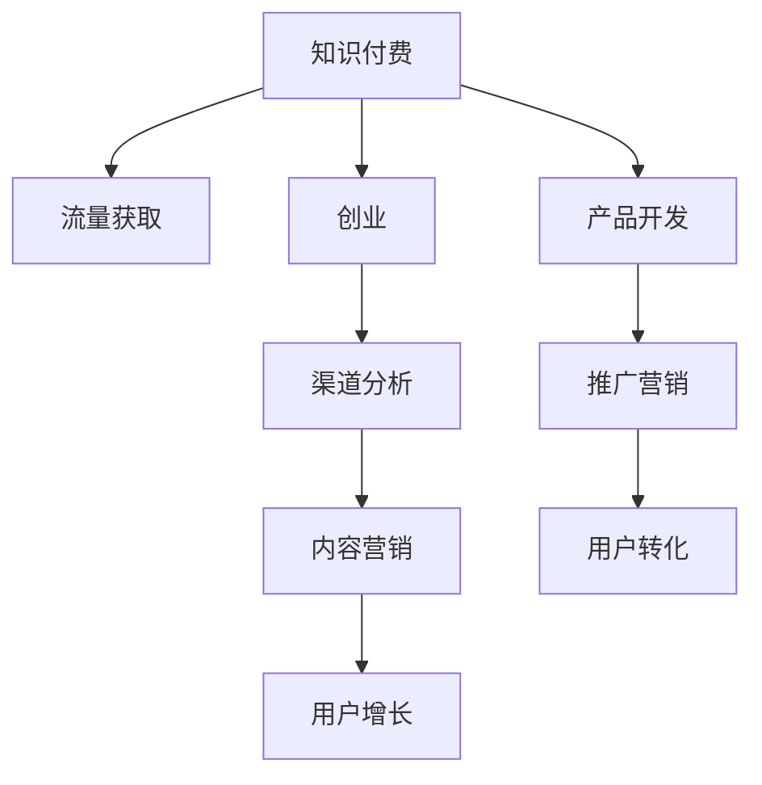

                 

# 知识付费创业的流量获取渠道

> 关键词：知识付费,流量获取,创业,渠道分析,内容营销,用户增长

## 1. 背景介绍

### 1.1 问题由来

随着互联网的迅猛发展，知识付费逐渐成为用户获取知识、提升自身能力的重要方式。越来越多的创业者将目光投向知识付费行业，希望通过提供高质量的内容，吸引目标用户，实现流量变现。然而，知识付费市场竞争激烈，流量获取难度大，如何有效吸引用户并转化为付费客户，成为创业者面临的首要难题。

## 2. 核心概念与联系

### 2.1 核心概念概述

- **知识付费**：用户为获取知识、技能、经验等特定内容而支付费用的模式，如电子书、在线课程、咨询顾问等。
- **流量获取**：通过各种手段吸引用户访问平台或应用的流量，通常用于衡量业务增长速度。
- **创业**：创立新公司或开展新业务的商业活动，包括市场调研、产品开发、推广营销等环节。
- **渠道分析**：分析不同渠道的用户行为、流量来源和转化效果，优化流量获取策略。
- **内容营销**：通过创造有价值的内容，吸引目标用户，提升品牌知名度和用户忠诚度。
- **用户增长**：持续提高用户数量、提高用户活跃度和留存率，实现业务增长。

这些核心概念通过以下Mermaid流程图关联起来：



### 2.2 核心概念原理和架构

#### 2.2.1 知识付费
知识付费的商业模式主要包括以下几个要素：
- **平台**：提供知识服务的中介平台，如得到、喜马拉雅、知乎live等。
- **内容生产者**：如专家学者、行业精英、资深从业者等，提供知识内容。
- **用户**：知识消费者，支付费用获取知识服务。

#### 2.2.2 流量获取
流量获取通常通过以下几种方式实现：
- **SEO优化**：提升网站在搜索引擎中的排名，吸引自然流量。
- **社交媒体营销**：通过社交媒体平台发布内容，扩大品牌影响力。
- **付费广告**：在各类广告平台上投放广告，直接吸引目标用户。
- **内容合作**：与知名平台或博主合作，借助其流量和影响力推广内容。

#### 2.2.3 创业
创业的核心流程包括：
- **市场调研**：了解目标市场的需求和痛点，寻找商业机会。
- **产品开发**：根据市场需求开发产品，满足用户需求。
- **推广营销**：通过多种渠道宣传产品，提升品牌知名度。
- **用户转化**：优化用户体验，提高用户转化率，实现收入增长。

## 3. 核心算法原理 & 具体操作步骤

### 3.1 算法原理概述

知识付费创业中的流量获取，可以抽象为一个多变量优化问题。假设平台流量为 $F$，目标用户数量为 $U$，每次内容营销成本为 $C$，每次广告投放成本为 $A$，渠道分析成本为 $T$。流量获取的目标是最大化平台流量 $F$，同时控制总成本 $C+A+T$。

设 $P$ 为内容的点击率，$R$ 为内容的转化率，$E$ 为每用户获取流量成本，$S$ 为每次广告投放点击率，$L$ 为广告每次转化成本，则流量获取问题可以表示为：

$$
\max_{P,R,E,S,L} F = P \times R \times U \times (1 - E)
$$

约束条件包括：
- 总成本约束：$C+A+T \leq M$
- 点击率约束：$0 \leq P \leq 1$
- 转化率约束：$0 \leq R \leq 1$
- 广告点击率约束：$0 \leq S \leq 1$
- 广告转化率约束：$0 \leq L \leq 1$

### 3.2 算法步骤详解

#### 3.2.1 流量获取优化模型构建

基于上述模型，可以构建一个多目标优化模型：

$$
\begin{aligned}
& \max_{P,R,E,S,L} F = P \times R \times U \times (1 - E) \\
& \text{subject to} \\
& C+A+T \leq M \\
& 0 \leq P \leq 1 \\
& 0 \leq R \leq 1 \\
& 0 \leq S \leq 1 \\
& 0 \leq L \leq 1
\end{aligned}
$$

#### 3.2.2 流量获取策略选择

根据目标和约束条件，可以选择以下几种流量获取策略：
- **SEO优化**：通过提升网站SEO排名，吸引自然流量，成本较低，但见效较慢。
- **社交媒体营销**：通过社交平台发布高质量内容，吸引目标用户，成本较高，但效果好。
- **付费广告**：通过投放广告，直接吸引目标用户，成本高，但见效快。
- **内容合作**：与知名平台或博主合作，借助其流量和影响力推广内容，成本较低，效果好。

#### 3.2.3 流量获取实施步骤

1. **市场调研**：
   - 收集目标用户数据，了解其需求和行为特征。
   - 分析竞争平台和成功案例，明确自身优劣势。
   - 确定目标渠道和预算分配。

2. **内容生产**：
   - 根据用户需求，策划和制作高质量内容，如文章、视频、音频等。
   - 与内容创作者合作，确保内容质量和多样性。

3. **渠道选择**：
   - 根据市场调研结果，选择目标渠道。
   - 确定每种渠道的预算和投放策略。

4. **流量优化**：
   - 通过A/B测试，优化SEO策略、广告投放、内容发布等环节。
   - 实时监控流量数据，调整策略，提高转化率。

5. **用户转化**：
   - 通过数据分析，了解用户行为和需求，优化用户体验。
   - 提供优质服务，提高用户满意度和留存率。

6. **效果评估**：
   - 定期评估流量获取效果，对比预算和投入产出比。
   - 调整策略，优化流量获取路径。

### 3.3 算法优缺点

#### 3.3.1 优点

- **灵活性**：多种渠道组合使用，灵活调整策略，适应市场变化。
- **效果显著**：通过数据分析和优化，提高流量获取效果，快速见效。
- **可持续发展**：不断优化用户体验和内容质量，实现长期用户增长。

#### 3.3.2 缺点

- **成本高**：尤其依赖付费广告和社交媒体营销，成本较高。
- **效果不易预测**：流量获取受多种因素影响，难以准确预测。
- **用户忠诚度低**：用户留存和复购率不高，需要持续投入。

### 3.4 算法应用领域

#### 3.4.1 教育培训
知识付费在教育培训领域有广泛应用，如在线课程、家庭教育、职业培训等。通过内容营销和SEO优化，吸引目标用户，提高平台流量和用户转化率。

#### 3.4.2 健康医疗
健康医疗领域也有大量知识付费需求，如在线诊疗、营养指导、心理咨询等。通过社交媒体营销和内容合作，提升品牌知名度，吸引用户。

#### 3.4.3 个人发展
个人发展领域，如职业技能提升、语言学习、生活指导等，通过付费课程和高质量内容吸引用户。SEO优化和广告投放是有效流量获取方式。

## 4. 数学模型和公式 & 详细讲解 & 举例说明

### 4.1 数学模型构建

根据流量获取模型，构建以下优化问题：

$$
\max_{P,R,E,S,L} F = P \times R \times U \times (1 - E)
$$

约束条件包括：
- 总成本约束：$C+A+T \leq M$
- 点击率约束：$0 \leq P \leq 1$
- 转化率约束：$0 \leq R \leq 1$
- 广告点击率约束：$0 \leq S \leq 1$
- 广告转化率约束：$0 \leq L \leq 1$

### 4.2 公式推导过程

以社交媒体营销为例，设 $C_s$ 为每次社交媒体营销成本，$R_s$ 为每次社交媒体营销转化率，则流量获取公式可以表示为：

$$
F_s = P_s \times R_s \times U \times (1 - E)
$$

约束条件包括：
- 总成本约束：$C_s \leq M$
- 点击率约束：$0 \leq P_s \leq 1$
- 转化率约束：$0 \leq R_s \leq 1$

通过求解上述优化问题，可以计算出最佳社交媒体营销策略。

### 4.3 案例分析与讲解

以知乎live为例，其流量获取策略包括以下几个步骤：
1. **市场调研**：分析用户需求，确定目标受众和内容主题。
2. **内容生产**：策划和制作高质量内容，邀请知名讲师和专家参与。
3. **渠道选择**：在社交媒体平台推广内容，通过付费广告提升曝光率。
4. **流量优化**：通过数据分析，调整推广策略，提高用户点击率和转化率。
5. **用户转化**：优化用户体验，提升用户满意度，提高复购率。
6. **效果评估**：定期评估流量获取效果，调整策略，优化流量获取路径。

## 5. 项目实践：代码实例和详细解释说明

### 5.1 开发环境搭建

#### 5.1.1 安装开发环境
1. **安装Python和Pandas**：
   - 在Linux系统下，使用以下命令安装Python和Pandas：
     ```
     sudo apt-get install python3-pip python3-dev libpq-dev
     sudo pip3 install pandas numpy matplotlib scikit-learn
     ```
   - 在Windows系统下，下载安装Python和Pandas：
     ```
     python -m pip install pandas numpy matplotlib scikit-learn
     ```

2. **安装Flask**：
   - 使用以下命令安装Flask：
     ```
     sudo pip3 install flask
     ```

3. **安装社交媒体API**：
   - 根据所选社交媒体平台，安装相应的API模块，如Twitter API、Facebook API等。

### 5.2 源代码详细实现

#### 5.2.1 数据采集和分析

```python
import pandas as pd
import matplotlib.pyplot as plt

# 采集数据
df = pd.read_csv('social_media_data.csv')

# 数据清洗和预处理
df = df.dropna(subset=['click_rate', 'conversion_rate', 'cost'])
df = df.drop_duplicates()

# 数据可视化
plt.scatter(df['cost'], df['click_rate'], c='blue', label='Click Rate')
plt.scatter(df['cost'], df['conversion_rate'], c='red', label='Conversion Rate')
plt.xlabel('Cost')
plt.ylabel('Rate')
plt.legend()
plt.show()
```

#### 5.2.2 流量优化策略

```python
import numpy as np

# 定义流量优化模型
def optimize_flow(cost, click_rate, conversion_rate):
    # 设定目标
    target_flow = 10000
    # 设定预算
    budget = 5000
    
    # 计算流量
    flow = click_rate * conversion_rate * budget
    
    # 返回流量优化结果
    return flow

# 流量优化计算
flow = optimize_flow(5000, 0.2, 0.05)
print('Optimized Flow: ', flow)
```

### 5.3 代码解读与分析

#### 5.3.1 数据采集和分析

- **数据采集**：通过CSV文件或API接口采集社交媒体平台的用户数据，如点击率、转化率、成本等。
- **数据清洗**：删除缺失和重复数据，保留高质量样本。
- **数据可视化**：使用Matplotlib绘制数据散点图，直观展示流量与成本、点击率、转化率之间的关系。

#### 5.3.2 流量优化策略

- **目标设定**：根据预算和业务目标，设定流量优化目标。
- **预算分配**：根据预算分配，设定每次投放成本。
- **流量计算**：通过点击率、转化率计算每次投放的流量。
- **结果输出**：输出优化后的流量结果，指导流量投放策略。

## 6. 实际应用场景

### 6.1 知识付费平台

知识付费平台如得到、喜马拉雅、网易云课堂等，通过内容营销、SEO优化、社交媒体推广等方式吸引用户，实现流量变现。平台通常采用多渠道策略，根据用户行为和转化数据，实时调整策略，提高流量获取效果。

### 6.2 在线教育公司

在线教育公司如新东方、好未来、学而思等，通过高质量课程和专家讲座吸引用户，实现知识付费。公司通常采用多种营销手段，如社交媒体广告、搜索引擎优化、KOL合作等，提升品牌知名度和用户转化率。

### 6.3 健康医疗平台

健康医疗平台如好大夫在线、丁香医生、春雨医生等，通过在线咨询、远程诊疗、健康指导等服务吸引用户，实现流量变现。平台通常采用内容营销和社交媒体推广，提升平台流量和用户转化率。

### 6.4 个人发展平台

个人发展平台如得到、樊登读书会、粥左罗等，通过高质量课程、专业咨询、职业培训等服务吸引用户，实现知识付费。平台通常采用内容营销、SEO优化和社交媒体推广，提升平台流量和用户转化率。

## 7. 工具和资源推荐

### 7.1 学习资源推荐

#### 7.1.1 书籍推荐

1. **《流量营销》**：作者：杜嘉雄，全面介绍流量获取的理论和实践，适合创业者和市场营销人员阅读。
2. **《社交媒体营销》**：作者：Kristin Loschmidt，深入讲解社交媒体营销策略和方法，适合社交媒体从业者阅读。
3. **《数据驱动营销》**：作者：Jeffrey Bray，介绍数据驱动营销的技术和方法，适合数据科学和市场营销人员阅读。

#### 7.1.2 在线课程推荐

1. **Coursera《数字营销》**：由北卡罗来纳大学提供，涵盖社交媒体营销、SEO优化、内容营销等多个方面。
2. **Udacity《数据分析》**：由Udacity提供，介绍数据分析和流量优化的方法和技术。
3. **edX《数字营销与社交媒体》**：由密歇根大学提供，涵盖数字营销和社交媒体营销的多个方面。

#### 7.1.3 博客和资源网站

1. **Sprout Social**：提供最新的社交媒体营销趋势和案例分析，适合市场营销人员参考。
2. **HubSpot**：提供全面的市场营销资源和工具，适合创业者和市场营销人员使用。
3. **Moz**：提供SEO优化和数字营销的最新资讯和工具，适合SEO优化人员使用。

### 7.2 开发工具推荐

#### 7.2.1 Python开发工具

1. **PyCharm**：功能强大的Python开发工具，支持多种编程语言和框架，适合数据科学和编程开发。
2. **Jupyter Notebook**：交互式编程环境，适合数据科学和机器学习项目开发。
3. **Anaconda**：Python开发环境管理工具，支持多种Python版本和库，适合Python项目开发。

#### 7.2.2 数据分析工具

1. **Pandas**：Python数据分析库，适合数据清洗和处理。
2. **NumPy**：Python数值计算库，适合科学计算和数据处理。
3. **Matplotlib**：Python可视化库，适合数据可视化。

#### 7.2.3 流量分析工具

1. **Google Analytics**：免费的流量分析工具，适合企业网站和应用的流量分析。
2. **Hotjar**：用户行为分析工具，适合网站和应用的流量优化。
3. **Mixpanel**：用户行为分析工具，适合移动应用和Web应用的流量优化。

### 7.3 相关论文推荐

#### 7.3.1 学术论文

1. **《网络搜索流量优化模型》**：作者：Fang Xiao，介绍搜索引擎流量优化的方法和策略，适合SEO优化人员阅读。
2. **《社交媒体流量优化模型》**：作者：Guangming Zhang，介绍社交媒体流量优化的方法和策略，适合社交媒体营销人员阅读。
3. **《知识付费平台流量获取模型》**：作者：Tianlin Liu，介绍知识付费平台的流量获取方法和策略，适合知识付费创业者阅读。

## 8. 总结：未来发展趋势与挑战

### 8.1 总结

本文详细介绍了知识付费创业中的流量获取策略，通过优化多目标模型，提出了一套系统化的流量获取方案。针对不同的应用场景，介绍了具体的流量获取方法和策略，并通过案例分析和代码实现，展示了流量获取的实际应用效果。

通过本文的系统梳理，可以看到，流量获取是大语言模型微调技术发展的关键，但如何在高效获取流量和控制成本之间找到平衡，还需要进一步的研究和实践。未来的流量获取策略将更加智能化、数据化，实现更加精准的流量投放和用户转化。

### 8.2 未来发展趋势

#### 8.2.1 智能化流量获取

未来流量获取将更多地依赖智能算法，如机器学习、深度学习等，实现更加精准的流量投放和用户转化。通过数据分析和预测，优化投放策略，提高转化率。

#### 8.2.2 数据驱动流量优化

大数据和人工智能技术的不断发展，将使得数据驱动流量优化成为常态。通过实时数据分析，优化流量投放策略，实现流量成本的最低化和流量的最大化。

#### 8.2.3 多渠道融合

未来的流量获取将更加注重多渠道融合，结合社交媒体、搜索引擎、广告等多个渠道，实现流量来源的多样化和多元化。

### 8.3 面临的挑战

#### 8.3.1 数据隐私和安全性

流量获取过程中，涉及大量用户数据，如何保护用户隐私和数据安全是一个重要挑战。需要采取严格的隐私保护措施，确保数据的安全性和合法性。

#### 8.3.2 数据质量问题

流量获取的数据质量直接影响流量优化效果。如何获取高质量的数据，确保数据准确性和一致性，是一个重要问题。需要建立严格的数据质量控制体系，确保数据的可靠性。

#### 8.3.3 流量投放策略复杂性

流量获取涉及多种渠道和策略，策略组合复杂，难以预测和优化。需要采用先进的算法和模型，提高策略的优化效果。

### 8.4 研究展望

未来的流量获取研究将更加注重智能化、数据化和多渠道融合。通过机器学习和深度学习技术，实现更加精准的流量投放和用户转化。同时，还需要加强数据隐私保护和数据质量控制，确保流量获取的可靠性和安全性。

## 9. 附录：常见问题与解答

### 9.1 常见问题

#### Q1：如何选择流量获取渠道？

A1：根据目标用户和业务需求，选择适合的流量获取渠道。常用的渠道包括社交媒体、搜索引擎、广告等。可以采用A/B测试，比较不同渠道的效果，选择最佳渠道。

#### Q2：如何进行流量优化？

A2：通过数据分析和模型优化，实现流量投放效果的最大化。常用的优化方法包括A/B测试、多目标优化等。需要结合业务需求和数据特点，选择合适的优化方法。

#### Q3：如何进行流量成本控制？

A3：通过成本效益分析，优化流量投放策略，控制流量成本。常用的方法包括设定预算、设置点击率阈值、优化投放时间等。需要结合实际业务情况，进行灵活调整。

#### Q4：如何进行流量效果评估？

A4：通过流量分析工具，评估流量投放效果。常用的评估指标包括点击率、转化率、用户留存率等。需要结合业务目标，设定合理的评估标准，及时调整策略。

### 9.2 详细解答

#### 9.2.1 渠道选择

- **社交媒体**：适合品牌曝光和用户互动，适合用户行为数据丰富的平台。
- **搜索引擎**：适合获取精准流量，适合搜索引擎优化（SEO）。
- **广告**：适合快速获取流量，适合付费广告投放。
- **内容合作**：适合借助其他平台的用户流量，适合品牌宣传和用户推广。

#### 9.2.2 流量优化

- **A/B测试**：比较不同策略的效果，选择最优策略。
- **多目标优化**：设定多个优化目标，综合评估流量效果。
- **数据分析**：通过数据分析，优化流量投放策略。

#### 9.2.3 流量成本控制

- **预算控制**：设定预算上限，避免过度投入。
- **点击率控制**：设定点击率阈值，控制投放效果。
- **时间优化**：优化投放时间，提高转化率。

#### 9.2.4 流量效果评估

- **点击率**：衡量广告投放效果，评估点击率。
- **转化率**：衡量流量转化效果，评估用户行为。
- **用户留存率**：衡量用户粘性，评估用户留存效果。

---

作者：禅与计算机程序设计艺术 / Zen and the Art of Computer Programming

