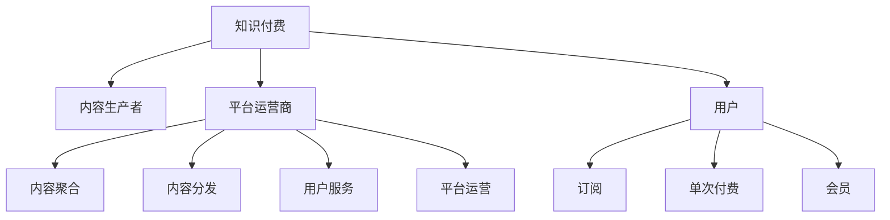

                 

# 知识付费如何实现可持续盈利？

> 关键词：知识付费,可持续盈利,平台运营,用户留存,内容质量,商业模式,技术创新

## 1. 背景介绍

### 1.1 问题由来
随着移动互联网和数字内容产业的迅猛发展，知识付费成为一种新的趋势。用户不再满足于免费的零散信息，而是愿意为系统化、专业化的知识产品付费。这一趋势背后的驱动力包括：

- **需求变化**：用户希望通过付费获得更深度、更全面的知识，提升职业发展和生活质量。
- **信息过载**：海量信息导致信息筛选难度加大，付费订阅成为一种快捷的解决方案。
- **专业化**：高水平的专业内容往往只有少数人产出，通过付费形式获取成为重要途径。

知识付费市场兴起，带来了许多创业机会和挑战。如何在激烈的市场竞争中脱颖而出，实现可持续发展，成为行业关注的焦点。

### 1.2 问题核心关键点
知识付费的核心在于提供有价值的内容，满足用户知识需求，同时实现商业盈利。然而，当前知识付费市场面临诸多挑战：

- **内容质量参差不齐**：大量低质量内容混杂其中，难以满足用户需求。
- **用户粘性不足**：用户流失率高，付费转化率低。
- **盈利模式单一**：过度依赖订阅费，难以应对市场波动。
- **运营成本高**：内容生产、平台维护、用户服务等运营成本巨大。

本文将系统介绍知识付费的商业模式和技术实现，探讨如何构建可持续盈利、用户粘性强的知识付费平台。

## 2. 核心概念与联系

### 2.1 核心概念概述

为更好地理解知识付费的可持续盈利模式，本节将介绍几个密切相关的核心概念：

- **知识付费**：指用户为获取深度、系统化的专业知识而付费的行为。这可以是订阅内容、购买单次课程、购买图书等形式。
- **内容生产者**：包括专家、学者、自由职业者等，他们是知识付费市场的重要支撑。
- **平台运营商**：负责内容聚合、分发、运营的平台公司，如喜马拉雅、得到、知乎等。
- **用户**：通过付费获取知识的消费者，具有多样化的需求和偏好。
- **订阅模式**：用户按月/年付费订阅内容，平台按订阅数量分成。
- **单次付费模式**：用户购买单次课程或电子书，平台按销售数量分成。
- **会员模式**：用户付费成为平台会员，享受多项特权，如无限制内容、VIP服务等。

这些概念之间的关系可以通过以下Mermaid流程图来展示：



这个流程图展示出知识付费生态中各角色之间的联系：

1. 知识付费通过平台运营商聚合内容、分发内容，为用户提供知识服务。
2. 内容生产者提供高质量的专业知识，平台运营商负责内容审核和推广。
3. 用户通过订阅、单次付费、会员等方式获取知识，享受平台提供的各类服务。
4. 平台运营商通过广告、付费会员、增值服务等方式实现盈利。

## 3. 核心算法原理 & 具体操作步骤
### 3.1 算法原理概述

知识付费平台的可持续盈利模式主要基于订阅、单次付费和会员等多种收费方式。其核心在于建立优质的内容生态，吸引和保留用户，同时优化商业模式，提升盈利能力。

订阅模式和单次付费模式是基于用户付费购买内容的模型。用户通过付费获得定制化、系统化的知识服务，平台则通过用户订阅和单次购买实现盈利。会员模式则是在此基础上，提供更多特权和增值服务，满足用户更高层次的需求。

内容质量是知识付费平台的核心竞争力。平台运营商需要持续优化内容审核机制，提升内容生产效率，同时引入优质的内容生产者，保持内容多样性和专业性。

### 3.2 算法步骤详解

知识付费平台的构建主要包括内容建设、用户管理、平台运营和技术支持四个方面。

**内容建设**：平台运营商需要建立健全的内容审核和推荐机制，确保内容的质量和多样性。通过内容生产者提交稿件，平台运营团队进行审核和编辑，同时利用算法推荐系统将优质内容推荐给用户。

**用户管理**：平台需要建立用户行为分析系统，了解用户需求和偏好，优化用户体验，提升用户粘性。通过用户评价、反馈等数据，平台可以不断调整内容和服务，满足用户需求。

**平台运营**：平台运营商需要制定合理的商业模式，如广告、增值服务、会员制度等，实现盈利。同时，需要建立良好的客户服务机制，提升用户满意度和忠诚度。

**技术支持**：知识付费平台需要强大的技术支持，包括内容管理系统、用户管理系统、推荐系统、广告系统等。平台运营商需要持续投入技术研发，提升平台性能和稳定性。

### 3.3 算法优缺点

知识付费平台的盈利模式具有以下优点：

- **多层次收费**：通过订阅、单次付费和会员等多种模式，满足不同用户需求，提升盈利能力。
- **内容多样化**：优质的内容生产者能够提供多样化的知识服务，满足用户个性化需求。
- **用户粘性高**：优质内容和服务能够提升用户粘性，减少流失率，提高续费率。

同时，该模式也存在一些缺点：

- **运营成本高**：内容审核、平台维护、用户服务等运营成本较大，需要大量投入。
- **内容质量风险**：平台需要对内容质量进行严格把控，避免低质量内容影响用户体验。
- **市场竞争激烈**：知识付费市场竞争激烈，需要不断创新和优化商业模式，保持市场竞争力。

### 3.4 算法应用领域

知识付费平台已经在教育培训、个人技能提升、职业技能认证等多个领域得到广泛应用。这些平台通过提供系统化、专业化的知识服务，满足了用户多样化的需求。

在教育培训领域，平台如得到、喜马拉雅等，通过引入优质的教育资源，帮助用户提升职业技能和个人素养。

在职业技能认证领域，平台如Coursera、Udacity等，通过提供专业课程和认证服务，帮助用户获得国际认可的职业资质。

此外，知识付费平台还扩展到健康生活、情感心理、文化艺术等多个领域，为不同用户提供丰富的知识服务。

## 4. 数学模型和公式 & 详细讲解  
### 4.1 数学模型构建

知识付费平台的可持续盈利模型主要基于订阅、单次付费和会员三种收费模式。假设平台用户总数为 $N$，订阅用户数为 $S$，单次付费用户数为 $O$，会员用户数为 $V$。

设订阅费用为 $P_S$，单次付费价格为 $P_O$，会员年费为 $P_V$。设内容生产者数量为 $C$，内容审核成本为 $C_a$，内容分发成本为 $C_d$，用户服务成本为 $C_s$。

订阅用户和单次付费用户通过支付订阅费或单次付费费，获得内容访问权。会员用户支付会员年费，获得更多的特权和增值服务。

**订阅盈利模型**：
$$
\text{订阅盈利} = S \cdot P_S + O \cdot P_O
$$

**单次付费盈利模型**：
$$
\text{单次付费盈利} = \sum_{i=1}^{N} x_i \cdot P_O
$$

**会员盈利模型**：
$$
\text{会员盈利} = V \cdot P_V
$$

其中 $x_i$ 表示用户 $i$ 是否为单次付费用户（$x_i=1$ 表示为单次付费用户，$x_i=0$ 表示为非单次付费用户）。

### 4.2 公式推导过程

通过以上盈利模型，我们可以推导出平台的总盈利公式：
$$
\text{总盈利} = \text{订阅盈利} + \text{单次付费盈利} + \text{会员盈利}
$$

具体到每一项，我们有：

- **订阅盈利**：
$$
\text{订阅盈利} = S \cdot P_S + O \cdot P_O = N \cdot P_S \cdot \frac{S}{N} + N \cdot P_O \cdot \frac{O}{N}
$$

- **单次付费盈利**：
$$
\text{单次付费盈利} = \sum_{i=1}^{N} x_i \cdot P_O = N \cdot P_O \cdot \frac{\sum_{i=1}^{N} x_i}{N}
$$

- **会员盈利**：
$$
\text{会员盈利} = V \cdot P_V = N \cdot P_V \cdot \frac{V}{N}
$$

### 4.3 案例分析与讲解

以得到平台为例，分析其盈利模型：

- **订阅用户**：得到平台主要通过订阅模式盈利。假设得到平台有100万用户，其中50万为订阅用户，月费为19.9元。
- **单次付费用户**：用户可以购买单次课程，每门课程价格为199元。假设平台每周有10万个新课程上线，每门课程平均卖出2000份。
- **会员用户**：会员用户每月需支付199元的会员费，享受更多特权。假设会员用户数为10万。

根据上述数据，我们可以计算得到到的总盈利：
$$
\text{总盈利} = 50 \cdot 19.9 + 10 \cdot 199 \cdot 2000 + 10 \cdot 199 = 992.5 + 39800 + 1990 = 43992.5 \text{ 元/月}
$$

## 5. 项目实践：代码实例和详细解释说明
### 5.1 开发环境搭建

在进行知识付费平台的开发前，我们需要准备好开发环境。以下是使用Python进行Django开发的环境配置流程：

1. 安装Anaconda：从官网下载并安装Anaconda，用于创建独立的Python环境。

2. 创建并激活虚拟环境：
```bash
conda create -n django-env python=3.8 
conda activate django-env
```

3. 安装Django：
```bash
pip install django
```

4. 安装所需的第三方库：
```bash
pip install django-crispy-forms django-ckeditor3-pygments markdown django-mptt django-compressor django-cors-headers
```

5. 安装MySQL数据库：
```bash
sudo apt-get update
sudo apt-get install mysql-server
sudo service mysql start
```

完成上述步骤后，即可在`django-env`环境中开始知识付费平台开发。

### 5.2 源代码详细实现

以下是一个简单的知识付费平台后台系统的代码实现：

```python
from django.contrib.auth.models import User
from django.db import models

class User(models.Model):
    email = models.EmailField(unique=True)
    username = models.CharField(max_length=50, unique=True)
    password = models.CharField(max_length=50)
    first_name = models.CharField(max_length=50)
    last_name = models.CharField(max_length=50)
    is_staff = models.BooleanField(default=False)
    is_superuser = models.BooleanField(default=False)
    is_active = models.BooleanField(default=True)

class Subscription(models.Model):
    user = models.ForeignKey(User, on_delete=models.CASCADE)
    plan = models.CharField(max_length=50)
    start_date = models.DateTimeField(auto_now_add=True)
    end_date = models.DateTimeField(null=True)

class Payment(models.Model):
    user = models.ForeignKey(User, on_delete=models.CASCADE)
    amount = models.DecimalField(max_digits=10, decimal_places=2)
    timestamp = models.DateTimeField(auto_now_add=True)

class Course(models.Model):
    title = models.CharField(max_length=100)
    description = models.TextField()
    price = models.DecimalField(max_digits=10, decimal_places=2)
    url = models.URLField()

class Review(models.Model):
    user = models.ForeignKey(User, on_delete=models.CASCADE)
    course = models.ForeignKey(Course, on_delete=models.CASCADE)
    rating = models.IntegerField()
    comment = models.TextField()
```

### 5.3 代码解读与分析

**User模型**：
- 定义用户的基本信息，包括用户名、邮箱、密码、姓名等。
- 通过is_staff、is_superuser、is_active等字段，区分管理员、超级用户和普通用户。

**Subscription模型**：
- 记录用户订阅的信息，包括用户、订阅计划和订阅时间等。
- 通过plan字段，区分不同的订阅计划，如免费、VIP等。
- 通过start_date和end_date字段，记录订阅的有效时间范围。

**Payment模型**：
- 记录用户的付费信息，包括用户、付费金额和付费时间。
- 通过amount字段，记录实际支付的金额，单位为元。

**Course模型**：
- 记录课程的基本信息，包括标题、描述、价格和链接等。
- 通过price字段，记录课程的价格，单位为元。

**Review模型**：
- 记录用户的课程评价信息，包括用户、课程、评分和评论内容等。

## 6. 实际应用场景
### 6.1 企业内部培训

企业可以通过知识付费平台，构建内部培训体系。员工可以通过订阅内部课程，系统化学习公司文化和业务知识，提升职业技能。平台运营商可以根据企业需求，定制化开发课程，提供优质培训内容。

### 6.2 远程教育

知识付费平台还可以用于远程教育。用户可以通过订阅平台课程，随时随地学习。平台运营商可以根据用户需求，引入国内外优质教育资源，提供多样化、系统化的学习内容。

### 6.3 职业认证

平台运营商可以与职业认证机构合作，提供专业课程和认证服务。用户通过付费学习和考试，可以获得国际认可的职业资质。

### 6.4 未来应用展望

随着知识付费平台的不断发展，未来的应用场景将更加多样化。

在智能家居领域，平台可以通过知识付费，提供智能设备的使用教程、维护指南等，提升用户体验。

在智慧城市建设中，平台可以提供交通规则、环境监测等知识服务，提升城市管理水平。

在文化旅游领域，平台可以提供历史文化、旅游攻略等知识服务，吸引更多用户关注和参与。

总之，知识付费平台的应用场景将不断扩展，为各行各业提供丰富的知识服务，促进社会进步和经济发展。

## 7. 工具和资源推荐
### 7.1 学习资源推荐

为了帮助开发者系统掌握知识付费平台的理论基础和实践技巧，这里推荐一些优质的学习资源：

1. 《知识付费商业模式》系列博文：由知识付费行业专家撰写，深入浅出地介绍了知识付费平台的设计和运营策略。

2. 《知识付费平台建设》课程：由知识付费平台提供商开设的在线课程，涵盖内容生产、平台运营、用户管理等核心知识。

3. 《知识付费用户行为分析》书籍：全面介绍了用户行为分析和用户留存策略，帮助平台运营商提升用户粘性。

4. 《知识付费平台技术架构》文档：详细介绍了知识付费平台的技术架构，包括用户管理系统、推荐系统、支付系统等关键组件。

5. 《知识付费平台运营策略》白皮书：提供系统化的知识付费平台运营策略，涵盖用户获取、内容建设、用户留存等多个方面。

通过对这些资源的学习实践，相信你一定能够快速掌握知识付费平台的精髓，并用于解决实际的业务问题。

### 7.2 开发工具推荐

高效的开发离不开优秀的工具支持。以下是几款用于知识付费平台开发的常用工具：

1. Django：基于Python的开源Web框架，灵活、易用，适合快速迭代研究。

2. Redis：高性能的内存数据库，用于缓存和消息队列，提升平台性能。

3. Apache Kafka：分布式流处理平台，用于实时数据处理和消息推送，优化用户体验。

4. Elasticsearch：开源的搜索与分析引擎，用于全文搜索和内容推荐，提升搜索效率。

5. React.js：用于构建前端界面的JavaScript库，提升用户体验和交互效果。

6. Docker和Kubernetes：容器化和容器编排工具，用于构建和管理知识付费平台的微服务架构。

合理利用这些工具，可以显著提升知识付费平台的开发效率，加快创新迭代的步伐。

### 7.3 相关论文推荐

知识付费平台的可持续发展需要持续的研究和优化。以下是几篇奠基性的相关论文，推荐阅读：

1. **知识付费平台的盈利模型研究**：研究知识付费平台的盈利模型，提出基于订阅、单次付费和会员模式的多层次收费策略，提升平台的盈利能力。

2. **内容推荐系统的优化研究**：通过优化内容推荐算法，提升知识付费平台的用户粘性和满意度。

3. **用户行为分析与留存策略**：研究用户行为分析技术，提出系统化的用户留存策略，提升平台的用户粘性和续费率。

4. **平台运营的策略优化**：通过优化平台运营策略，提升平台的用户增长、用户留存和付费转化率。

5. **知识付费平台的可持续发展**：分析知识付费平台的可持续发展问题，提出多层次收费、内容优化、用户留存等策略，提升平台的市场竞争力。

这些论文代表了大规模知识付费平台的研究方向。通过学习这些前沿成果，可以帮助研究者把握学科前进方向，激发更多的创新灵感。

## 8. 总结：未来发展趋势与挑战

### 8.1 总结

本文对知识付费平台的可持续盈利模式进行了全面系统的介绍。首先阐述了知识付费平台的发展背景和核心竞争力，明确了平台运营商在内容建设、用户管理、平台运营和技术支持等方面的关键任务。

通过本文的系统梳理，可以看到，知识付费平台通过优质的内容和服务，能够吸引和保留用户，同时优化商业模式，提升盈利能力。未来，伴随平台运营商的持续创新和优化，知识付费平台必将在教育培训、远程教育、职业认证等多个领域发挥重要作用，为各行各业提供丰富的知识服务。

### 8.2 未来发展趋势

展望未来，知识付费平台将呈现以下几个发展趋势：

1. **内容多样化**：平台运营商将引入更多优质的内容生产者，提供多样化的知识服务，满足用户个性化需求。

2. **用户粘性提升**：平台运营商将持续优化用户体验，提升用户满意度，通过系统化的用户留存策略，减少用户流失，提高续费率。

3. **商业模式多元化**：平台运营商将探索更多盈利模式，如广告、增值服务、会员制度等，提升平台的盈利能力。

4. **技术创新**：平台运营商将引入更多前沿技术，如人工智能、大数据、云计算等，提升平台的智能化和自动化水平。

5. **平台合作**：平台运营商将与其他机构、平台进行深度合作，整合资源，提升平台的市场竞争力。

以上趋势凸显了知识付费平台的发展潜力。这些方向的探索发展，必将进一步提升平台的服务质量和技术水平，推动知识付费市场走向成熟。

### 8.3 面临的挑战

尽管知识付费平台已经取得了显著成效，但在迈向更加智能化、普适化应用的过程中，它仍面临诸多挑战：

1. **内容质量风险**：平台运营商需要对内容质量进行严格把控，避免低质量内容影响用户体验。

2. **运营成本高**：内容审核、平台维护、用户服务等运营成本较大，需要大量投入。

3. **市场竞争激烈**：知识付费市场竞争激烈，需要不断创新和优化商业模式，保持市场竞争力。

4. **用户需求变化快**：用户需求不断变化，平台运营商需要持续优化内容和服务，保持平台的用户粘性。

5. **技术人才短缺**：平台运营商需要持续投入技术研发，提升平台性能和稳定性，但技术人才短缺问题较为严重。

6. **用户隐私保护**：平台运营商需要严格遵守隐私保护法规，保护用户隐私，避免数据泄露和滥用。

这些挑战凸显了知识付费平台的发展难度。平台运营商需要积极应对，通过创新和优化，突破各种瓶颈，实现可持续发展。

### 8.4 研究展望

未来，知识付费平台的研究需要在以下几个方面寻求新的突破：

1. **内容推荐系统优化**：通过优化内容推荐算法，提升知识付费平台的用户粘性和满意度。

2. **用户行为分析与留存策略**：研究用户行为分析技术，提出系统化的用户留存策略，提升平台的用户粘性和续费率。

3. **平台运营的策略优化**：通过优化平台运营策略，提升平台的用户增长、用户留存和付费转化率。

4. **多层次盈利模式探索**：探索更多盈利模式，如广告、增值服务、会员制度等，提升平台的盈利能力。

5. **平台合作的创新**：与其他机构、平台进行深度合作，整合资源，提升平台的市场竞争力。

6. **技术创新的持续**：引入更多前沿技术，如人工智能、大数据、云计算等，提升平台的智能化和自动化水平。

这些研究方向的探索，必将引领知识付费平台走向更高的台阶，为构建安全、可靠、可解释、可控的智能系统铺平道路。面向未来，知识付费平台需要从内容、用户、技术、商业等多个维度协同发力，共同推动平台持续发展。

## 9. 附录：常见问题与解答

**Q1：知识付费平台的盈利模式有哪些？**

A: 知识付费平台的盈利模式主要基于订阅、单次付费和会员三种收费方式。

- **订阅模式**：用户按月/年付费订阅内容，平台按订阅数量分成。
- **单次付费模式**：用户购买单次课程或电子书，平台按销售数量分成。
- **会员模式**：用户付费成为平台会员，享受多项特权，如无限制内容、VIP服务等。

**Q2：如何优化知识付费平台的内容推荐系统？**

A: 优化知识付费平台的内容推荐系统主要从以下几个方面入手：

1. **用户行为分析**：通过用户浏览、点赞、评论等行为，分析用户偏好，提升推荐精度。
2. **内容标签系统**：为内容打上标签，建立内容与用户的匹配关系，提升推荐效果。
3. **协同过滤推荐**：利用用户之间的相似性，进行协同过滤推荐，提高推荐多样性。
4. **内容质量评估**：建立内容质量评估体系，剔除低质量内容，提升推荐可信度。
5. **个性化推荐算法**：引入机器学习算法，如协同过滤、基于内容的推荐等，提升推荐效果。

**Q3：知识付费平台的用户留存策略有哪些？**

A: 知识付费平台的用户留存策略主要从以下几个方面入手：

1. **优质内容**：提供高质量、专业化的内容，满足用户知识需求。
2. **用户体验**：提升平台的用户体验，包括界面设计、加载速度、功能便捷性等。
3. **个性化推荐**：通过推荐系统，提供个性化的内容推荐，提升用户满意度。
4. **互动机制**：建立用户互动机制，如评论、点赞、分享等，增强用户粘性。
5. **会员制度**：提供会员制度，享受更多特权，如无限制内容、VIP服务等，提升用户续费率。
6. **客户服务**：建立良好的客户服务机制，及时响应用户问题，提升用户满意度。

**Q4：知识付费平台的技术架构需要考虑哪些因素？**

A: 知识付费平台的技术架构需要考虑以下几个因素：

1. **性能和稳定性**：通过缓存、负载均衡、分布式架构等手段，提升平台性能和稳定性。
2. **安全性**：建立安全机制，如用户认证、数据加密、权限控制等，保护用户数据安全。
3. **扩展性**：通过微服务、容器化、云服务等技术，实现平台的高可用和可扩展性。
4. **用户体验**：优化前端页面设计、提升加载速度、增强功能便捷性等，提升用户体验。
5. **数据管理**：建立数据管理机制，包括数据存储、数据清洗、数据备份等，保障数据安全。
6. **运营效率**：建立运营监控机制，实时监控平台状态，快速响应问题，提升运营效率。

**Q5：如何评估知识付费平台的盈利能力？**

A: 知识付费平台的盈利能力可以从以下几个方面进行评估：

1. **用户增长率**：评估平台的用户增长率和用户留存率，分析用户增长趋势和流失原因。
2. **付费转化率**：评估用户的付费转化率，分析付费用户来源和付费原因。
3. **收入规模**：评估平台的总收入，包括订阅收入、单次付费收入和会员收入等。
4. **用户活跃度**：评估用户的活跃度和付费频次，分析用户行为和需求变化。
5. **成本控制**：评估平台的运营成本，包括内容审核、平台维护、用户服务等各项费用，提升盈利能力。

通过对这些指标的评估，平台运营商可以全面了解平台的盈利状况，制定相应的优化策略，提升平台的盈利能力。

---

作者：禅与计算机程序设计艺术 / Zen and the Art of Computer Programming

