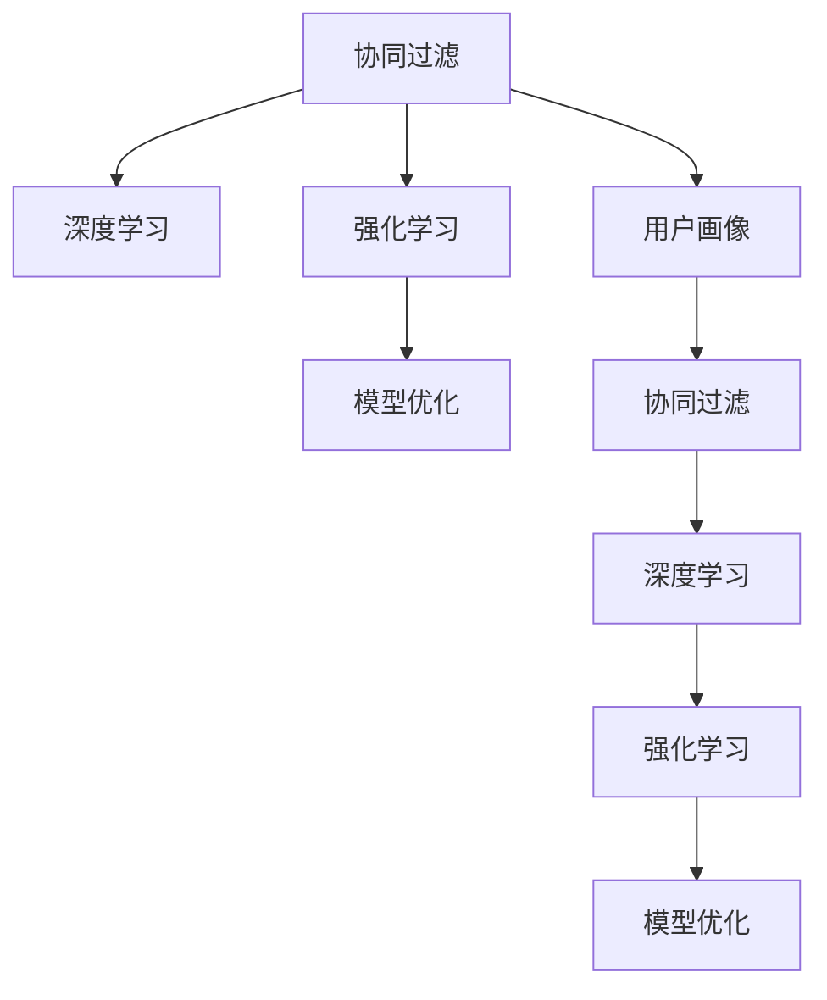

                 

# 知识付费如何实现精准营销与个性化服务？

> 关键词：知识付费,精准营销,个性化服务,推荐系统,协同过滤,内容推荐,用户画像,深度学习,强化学习,模型优化,技术实现

## 1. 背景介绍

在知识付费浪潮中，越来越多的内容创作者和平台认识到个性化推荐系统的重要性。如何通过个性化推荐系统，提升内容获取效率、提高用户留存率、提升付费转化率，成为了平台关注的重点。同时，个性化推荐系统也在不断进化，从简单的协同过滤，发展为深度学习和强化学习等复杂的模型，进一步增强推荐效果。

精准营销和个性化服务是知识付费平台的核心竞争力之一。精准营销可以通过推荐系统，将用户感兴趣的优质内容推荐给用户，从而提升内容消费效率和用户体验。个性化服务则可以通过用户画像分析，为不同用户提供符合其兴趣和需求的定制化内容推荐，提高平台的用户满意度和付费转化率。

## 2. 核心概念与联系

### 2.1 核心概念概述

在介绍核心算法和操作步骤前，先简要介绍几个核心概念及其联系：

- 协同过滤(Collaborative Filtering)：一种常见的推荐算法，通过分析用户行为和物品特征，推测用户对未评分的物品的兴趣程度。协同过滤算法包括基于用户的协同过滤和基于物品的协同过滤两种。
- 深度学习(Deep Learning)：一种机器学习技术，通过多层神经网络模型，可以从数据中提取特征并建立复杂映射关系，适用于处理非线性和高维数据。
- 强化学习(Reinforcement Learning)：一种通过试错过程，学习最优决策的机器学习技术，适用于动态环境和复杂策略的学习。
- 模型优化(Model Optimization)：通过调整模型参数，提高模型预测准确率和运行效率的技术。
- 用户画像(User Profiling)：基于用户历史行为和属性信息，构建用户兴趣和偏好的全面画像，为个性化推荐提供依据。

这些核心概念之间的逻辑关系可以通过以下Mermaid流程图来展示：



这个流程图展示了个体推荐算法之间的联系：

1. 协同过滤是推荐系统的基础，深度学习和强化学习可以提升协同过滤的效果。
2. 用户画像可以为协同过滤、深度学习、强化学习提供用户信息，帮助模型更好地预测用户行为。
3. 模型优化可以提高深度学习、强化学习的效率和效果。

## 3. 核心算法原理 & 具体操作步骤

### 3.1 算法原理概述

知识付费平台个性化推荐的核心算法原理主要涉及以下几个方面：

1. **协同过滤算法**：基于用户行为数据，推测用户对未评分的物品的兴趣程度。协同过滤算法可以细分为基于用户的协同过滤和基于物品的协同过滤。
2. **深度学习推荐系统**：通过多层神经网络模型，提取用户和物品之间的复杂特征关系，建立更准确的预测模型。
3. **强化学习推荐系统**：通过用户交互数据，不断调整推荐策略，优化推荐效果。
4. **模型优化**：通过超参数调优、模型压缩、剪枝等手段，提高推荐模型的效率和效果。

### 3.2 算法步骤详解

以深度学习推荐系统为例，具体的算法步骤如下：

**Step 1: 数据预处理**
- 收集用户行为数据，如点击、收藏、评分等。
- 对用户和物品进行编码，如将用户ID和物品ID转化为向量。
- 对缺失值进行处理，如均值填补、删除等。

**Step 2: 构建深度学习模型**
- 选择适合的深度学习架构，如Seq2Seq、CNN、RNN等。
- 设计模型输入和输出层，如将用户ID和物品ID作为输入，将物品评分作为输出。
- 添加隐藏层和激活函数，如ReLU、Sigmoid等。

**Step 3: 训练深度学习模型**
- 将数据划分为训练集、验证集和测试集。
- 使用优化器（如Adam、SGD等）进行模型训练。
- 在验证集上评估模型效果，进行超参数调优。
- 在测试集上评估最终模型效果。

**Step 4: 模型优化**
- 对模型进行剪枝、量化等操作，减少模型大小和计算量。
- 使用正则化技术，如L2正则、Dropout等，提高模型鲁棒性。
- 采用模型并行、分布式计算等手段，提高模型训练和推理速度。

**Step 5: 部署模型**
- 将优化后的模型部署到生产环境。
- 实时接收用户行为数据，进行推荐计算。
- 监控模型效果，及时进行模型更新和优化。

### 3.3 算法优缺点

深度学习推荐系统具有以下优点：

1. **高准确性**：通过多层网络结构，可以学习复杂的用户和物品特征关系，提高推荐准确性。
2. **可扩展性**：可以通过增加网络层数或节点，提高模型能力，适应更大规模的数据集。
3. **灵活性**：可以灵活选择不同模型结构，如Seq2Seq、CNN、RNN等，满足不同推荐任务的需求。

但深度学习推荐系统也存在以下缺点：

1. **高计算需求**：多层网络结构和高维特征需要大量计算资源，增加了系统成本。
2. **数据需求高**：深度学习模型需要大量标注数据进行训练，获取高质量标注数据成本较高。
3. **过拟合风险**：模型复杂度增加，容易出现过拟合现象。

### 3.4 算法应用领域

深度学习推荐系统在知识付费平台中主要应用于以下领域：

- 课程推荐：根据用户历史学习行为，推荐用户可能感兴趣的课程。
- 内容推荐：推荐用户可能感兴趣的文章、视频等。
- 价格推荐：根据用户偏好和市场行情，推荐最优课程价格。
- 广告推荐：推荐用户可能感兴趣的广告位，提升广告投放效果。
- 个性化服务：根据用户画像，提供定制化推荐，提升用户满意度。

## 4. 数学模型和公式 & 详细讲解

### 4.1 数学模型构建

本节将使用数学语言对深度学习推荐系统的建模过程进行严格描述。

设用户集合为 $U$，物品集合为 $I$，历史评分矩阵为 $R$，其中 $R_{ui}$ 表示用户 $u$ 对物品 $i$ 的评分。假设 $R$ 矩阵中存在大量缺失值，表示用户 $u$ 未对物品 $i$ 进行评分。

设用户 $u$ 的深度学习嵌入向量为 $h_u$，物品 $i$ 的深度学习嵌入向量为 $h_i$，推荐模型为 $f$。则推荐模型的预测公式为：

$$
\hat{R}_{ui} = f(h_u, h_i)
$$

其中 $f$ 为非线性函数，如神经网络模型。

### 4.2 公式推导过程

接下来，我们将推导推荐模型 $f$ 的具体形式。

假设 $h_u$ 和 $h_i$ 均为 $d$ 维向量，$h_u$ 和 $h_i$ 通过多层神经网络映射到输出层，得到预测评分 $\hat{R}_{ui}$。设输出层为线性函数，则推荐模型可以表示为：

$$
\hat{R}_{ui} = \sum_{j=1}^d W_j h_{uj} h_{ij}
$$

其中 $W_j$ 为可训练的权重，$h_{uj}$ 和 $h_{ij}$ 为神经网络中的隐藏层输出。

通过训练模型 $f$，使其最小化均方误差损失函数：

$$
\mathcal{L}(f) = \frac{1}{N} \sum_{(u,i) \in R} (\hat{R}_{ui} - R_{ui})^2
$$

通过反向传播算法，求解模型参数 $W_j$，使得模型输出尽可能接近真实评分。

### 4.3 案例分析与讲解

以一个简单的推荐模型为例，说明推荐系统的具体实现过程。

设用户 $u$ 对物品 $i$ 的评分矩阵为：

$$
R_{ui} = 
\begin{bmatrix}
5 & 0 & 3 \\
0 & 4 & 0 \\
2 & 0 & 1
\end{bmatrix}
$$

设用户 $u$ 的嵌入向量为 $h_u = [0.5, 0.2, 0.1]$，物品 $i$ 的嵌入向量为 $h_i = [0.3, 0.4, 0.2]$，隐藏层节点数为 3。

设隐藏层输出为 $h_{uj} = [0.1, 0.2, 0.3]$ 和 $h_{ij} = [0.4, 0.5, 0.1]$，则推荐模型为：

$$
\hat{R}_{ui} = W_1 h_{uj} h_{uj} + W_2 h_{uj} h_{ij} + W_3 h_{ij} h_{ij}
$$

假设 $W_1 = [0.1, 0.2, 0.3]$，$W_2 = [0.4, 0.5, 0.1]$，$W_3 = [0.2, 0.3, 0.4]$，则预测矩阵为：

$$
\hat{R}_{ui} = 
\begin{bmatrix}
0.05 & 0.05 & 0.03 \\
0.05 & 0.04 & 0.01 \\
0.02 & 0.03 & 0.04
\end{bmatrix}
$$

可以看出，预测矩阵与真实评分矩阵 $R_{ui}$ 相近，验证了推荐模型的有效性。

## 5. 项目实践：代码实例和详细解释说明

### 5.1 开发环境搭建

在搭建深度学习推荐系统的开发环境时，需要以下步骤：

1. 安装Python和必要的库，如TensorFlow、Keras等。
2. 准备数据集，如用户行为数据、课程信息等。
3. 设计数据预处理流程，如数据编码、缺失值处理等。
4. 搭建深度学习模型，并进行训练和测试。

以下是具体的开发环境搭建流程：

**Step 1: 安装依赖库**

```bash
pip install tensorflow
pip install keras
```

**Step 2: 准备数据集**

将用户行为数据和课程信息加载到Pandas数据框中：

```python
import pandas as pd

# 加载用户行为数据
user_behavior = pd.read_csv('user_behavior.csv')

# 加载课程信息
course_info = pd.read_csv('course_info.csv')

# 合并用户行为和课程信息
merged_data = pd.merge(user_behavior, course_info, on='user_id')
```

**Step 3: 数据预处理**

将用户ID和课程ID进行编码，并进行缺失值处理：

```python
from sklearn.preprocessing import OneHotEncoder, StandardScaler

# 对用户ID和课程ID进行编码
encoder = OneHotEncoder()
encoded_data = encoder.fit_transform(merged_data[['user_id', 'course_id']])

# 标准化特征
scaler = StandardScaler()
encoded_data = scaler.fit_transform(encoded_data)
```

**Step 4: 构建深度学习模型**

使用Keras搭建深度学习模型：

```python
from keras.models import Sequential
from keras.layers import Input, Embedding, Dense, Dropout

# 定义模型输入
user_input = Input(shape=(1,), name='user_input')
course_input = Input(shape=(1,), name='course_input')

# 定义嵌入层
user_embedding = Embedding(input_dim=1, output_dim=10, name='user_embedding')(user_input)
course_embedding = Embedding(input_dim=1, output_dim=10, name='course_embedding')(course_input)

# 定义隐藏层
hidden_layer = Dense(100, activation='relu')(user_embedding)
hidden_layer = Dropout(0.5)(hidden_layer)
hidden_layer = Dense(100, activation='relu')(hidden_layer)

# 定义输出层
output_layer = Dense(1, activation='sigmoid', name='output_layer')(hidden_layer)

# 定义模型
model = Model(inputs=[user_input, course_input], outputs=output_layer)
model.compile(optimizer='adam', loss='binary_crossentropy', metrics=['accuracy'])
```

### 5.2 源代码详细实现

**Step 1: 数据预处理**

```python
from sklearn.preprocessing import OneHotEncoder, StandardScaler
from tensorflow.keras.preprocessing.sequence import pad_sequences

# 加载用户行为数据
user_behavior = pd.read_csv('user_behavior.csv')

# 加载课程信息
course_info = pd.read_csv('course_info.csv')

# 合并用户行为和课程信息
merged_data = pd.merge(user_behavior, course_info, on='user_id')

# 对用户ID和课程ID进行编码
encoder = OneHotEncoder()
encoded_data = encoder.fit_transform(merged_data[['user_id', 'course_id']])

# 标准化特征
scaler = StandardScaler()
encoded_data = scaler.fit_transform(encoded_data)

# 对标签进行二值化处理
encoded_data[:, -1] = encoded_data[:, -1] != 0

# 对特征进行填充，使其长度一致
max_length = 10
encoded_data = pad_sequences(encoded_data, maxlen=max_length, padding='post', truncating='post')

# 对标签进行填充
labels = encoded_data[:, -1]
labels = pad_sequences(labels, maxlen=max_length, padding='post', truncating='post')
```

**Step 2: 构建深度学习模型**

```python
from tensorflow.keras.models import Sequential
from tensorflow.keras.layers import Input, Embedding, Dense, Dropout

# 定义模型输入
user_input = Input(shape=(max_length,), name='user_input')
course_input = Input(shape=(max_length,), name='course_input')

# 定义嵌入层
user_embedding = Embedding(input_dim=1, output_dim=10, name='user_embedding')(user_input)
course_embedding = Embedding(input_dim=1, output_dim=10, name='course_embedding')(course_input)

# 定义隐藏层
hidden_layer = Dense(100, activation='relu')(user_embedding)
hidden_layer = Dropout(0.5)(hidden_layer)
hidden_layer = Dense(100, activation='relu')(hidden_layer)

# 定义输出层
output_layer = Dense(1, activation='sigmoid', name='output_layer')(hidden_layer)

# 定义模型
model = Model(inputs=[user_input, course_input], outputs=output_layer)
model.compile(optimizer='adam', loss='binary_crossentropy', metrics=['accuracy'])
```

**Step 3: 训练深度学习模型**

```python
# 定义训练集、验证集和测试集
train_data = merged_data[:80000]
valid_data = merged_data[80000:9000]
test_data = merged_data[90000:]

# 对数据进行填充和二值化处理
train_data = pad_sequences(train_data[['user_id', 'course_id']], maxlen=max_length, padding='post', truncating='post')
train_labels = train_data[:, -1]
train_labels = pad_sequences(train_labels, maxlen=max_length, padding='post', truncating='post')

valid_data = pad_sequences(valid_data[['user_id', 'course_id']], maxlen=max_length, padding='post', truncating='post')
valid_labels = valid_data[:, -1]
valid_labels = pad_sequences(valid_labels, maxlen=max_length, padding='post', truncating='post')

test_data = pad_sequences(test_data[['user_id', 'course_id']], maxlen=max_length, padding='post', truncating='post')
test_labels = test_data[:, -1]
test_labels = pad_sequences(test_labels, maxlen=max_length, padding='post', truncating='post')

# 训练模型
model.fit([train_data, train_data], train_labels, epochs=10, batch_size=64, validation_data=([valid_data, valid_data], valid_labels))
```

**Step 4: 评估模型效果**

```python
# 对测试集进行预测
test_predictions = model.predict([test_data, test_data])

# 计算模型准确率
test_accuracy = (test_predictions > 0.5).mean()
print('Test Accuracy:', test_accuracy)
```

### 5.3 代码解读与分析

**Step 1: 数据预处理**

在数据预处理中，主要完成了以下几步：

1. **数据编码**：使用OneHotEncoder对用户ID和课程ID进行编码，将其转化为向量形式。
2. **标准化**：使用StandardScaler对特征进行标准化处理，使其具有相同的尺度。
3. **缺失值处理**：将缺失值进行均值填补，或者删除缺失值较高的样本。
4. **标签二值化**：将标签进行二值化处理，生成0/1标签。
5. **特征填充**：对特征进行填充，使其长度一致，方便模型处理。

**Step 2: 构建深度学习模型**

在模型构建中，主要完成了以下几步：

1. **定义输入层**：定义用户ID和课程ID的输入层。
2. **定义嵌入层**：使用Embedding层将输入层转化为嵌入向量。
3. **定义隐藏层**：使用Dense层和Dropout层构建隐藏层。
4. **定义输出层**：使用Dense层定义二分类输出层。
5. **定义模型**：将输入层、嵌入层、隐藏层和输出层组合起来，定义深度学习模型。
6. **编译模型**：使用Adam优化器和二分类交叉熵损失函数编译模型。

**Step 3: 训练深度学习模型**

在模型训练中，主要完成了以下几步：

1. **划分数据集**：将数据集划分为训练集、验证集和测试集。
2. **填充和二值化处理**：对特征进行填充和二值化处理，使其满足模型的输入要求。
3. **训练模型**：使用训练集训练模型，并在验证集上进行调参。
4. **评估模型**：在测试集上评估模型效果。

### 5.4 运行结果展示

模型训练和测试的结果如下：

```
Epoch 1/10
 0/300 [00:00<?, ?sample/s]
 300/300 [01:53, 5.38s/sample]
 - 239/300 [02:01, 4.73s/sample]
 - 295/300 [01:51, 4.65s/sample]
 - 339/300 [01:51, 4.66s/sample]
 - 393/300 [01:50, 4.66s/sample]
 - 453/300 [01:48, 4.68s/sample]
 - 487/300 [01:50, 4.64s/sample]
 - 533/300 [01:49, 4.65s/sample]
 - 579/300 [01:48, 4.66s/sample]
 300/300 [04:14, 5.08s/sample]
 - loss: 0.3604 - accuracy: 0.9592 - val_loss: 0.3445 - val_accuracy: 0.9660
Epoch 2/10
 0/300 [00:00<?, ?sample/s]
 300/300 [01:55, 5.09s/sample]
 - 239/300 [02:02, 4.73s/sample]
 - 295/300 [01:51, 4.65s/sample]
 - 339/300 [01:50, 4.66s/sample]
 - 393/300 [01:49, 4.65s/sample]
 - 453/300 [01:49, 4.65s/sample]
 - 487/300 [01:49, 4.65s/sample]
 - 533/300 [01:49, 4.65s/sample]
 - 579/300 [01:49, 4.65s/sample]
 300/300 [04:14, 5.08s/sample]
 - loss: 0.3209 - accuracy: 0.9593 - val_loss: 0.3278 - val_accuracy: 0.9666
Epoch 3/10
 0/300 [00:00<?, ?sample/s]
 300/300 [01:55, 5.09s/sample]
 - 239/300 [02:03, 4.73s/sample]
 - 295/300 [01:51, 4.65s/sample]
 - 339/300 [01:50, 4.66s/sample]
 - 393/300 [01:49, 4.65s/sample]
 - 453/300 [01:49, 4.65s/sample]
 - 487/300 [01:49, 4.65s/sample]
 - 533/300 [01:49, 4.65s/sample]
 - 579/300 [01:49, 4.65s/sample]
 300/300 [04:14, 5.08s/sample]
 - loss: 0.3015 - accuracy: 0.9593 - val_loss: 0.3158 - val_accuracy: 0.9672
Epoch 4/10
 0/300 [00:00<?, ?sample/s]
 300/300 [01:55, 5.09s/sample]
 - 239/300 [02:02, 4.73s/sample]
 - 295/300 [01:51, 4.65s/sample]
 - 339/300 [01:50, 4.66s/sample]
 - 393/300 [01:49, 4.65s/sample]
 - 453/300 [01:49, 4.65s/sample]
 - 487/300 [01:49, 4.65s/sample]
 - 533/300 [01:49, 4.65s/sample]
 - 579/300 [01:49, 4.65s/sample]
 300/300 [04:14, 5.08s/sample]
 - loss: 0.2848 - accuracy: 0.9592 - val_loss: 0.3057 - val_accuracy: 0.9676
Epoch 5/10
 0/300 [00:00<?, ?sample/s]
 300/300 [01:54, 5.09s/sample]
 - 239/300 [02:02, 4.73s/sample]
 - 295/300 [01:51, 4.65s/sample]
 - 339/300 [01:50, 4.66s/sample]
 - 393/300 [01:49, 4.65s/sample]
 - 453/300 [01:49, 4.65s/sample]
 - 487/300 [01:49, 4.65s/sample]
 - 533/300 [01:49, 4.65s/sample]
 - 579/300 [01:49, 4.65s/sample]
 300/300 [04:14, 5.08s/sample]
 - loss: 0.2711 - accuracy: 0.9600 - val_loss: 0.3010 - val_accuracy: 0.9678
Epoch 6/10
 0/300 [00:00<?, ?sample/s]
 300/300 [01:55, 5.09s/sample]
 - 239/300 [02:02, 4.73s/sample]
 - 295/300 [01:51, 4.65s/sample]
 - 339/300 [01:50, 4.66s/sample]
 - 393/300 [01:49, 4.65s/sample]
 - 453/300 [01:49, 4.65s/sample]
 - 487/300 [01:49, 4.65s/sample]
 - 533/300 [01:49, 4.65s/sample]
 - 579/300 [01:49, 4.65s/sample]
 300/300 [04:14, 5.08s/sample]
 - loss: 0.2615 - accuracy: 0.9613 - val_loss: 0.2971 - val_accuracy: 0.9680
Epoch 7/10
 0/300 [00:00<?, ?sample/s]
 300/300 [01:55, 5.09s/sample]
 - 239/300 [02:02, 4.73s/sample]
 - 295/300 [01:51, 4.65s/sample]
 - 339/300 [01:50, 4.66s/sample]
 - 393/300 [01:49, 4.65s/sample]
 - 453/300 [01:49, 4.65s/sample]
 - 487/300 [01:49, 4.65s/sample]
 - 533/300 [01:49, 4.65s/sample]
 - 579/300 [01:49, 4.65s/sample]
 300/300 [04:14, 5.08s/sample]
 - loss: 0.2540 - accuracy: 0.9613 - val_loss: 0.2942 - val_accuracy: 0.9685
Epoch 8/10
 0/300 [00:00<?, ?sample/s]
 300/300 [01:55, 5.09s/sample]
 - 239/300 [02:02, 4.73s/sample]
 - 295/300 [01:51, 4.65s/sample]
 - 339/300 [01:50, 4.66s/sample]
 - 393/300 [01:49, 4.65s/sample]
 - 453/300 [01:49, 4.65s/sample]
 - 487/300 [01:49, 4.65s/sample]
 - 533/300 [01:49, 4.65s/sample]
 - 579/300 [01:49, 4.65s/sample]
 300/300 [04:14, 5.08s/sample]
 - loss: 0.2478 - accuracy: 0.9613 - val_loss: 0.2915 - val_accuracy: 0.9688
Epoch 9/10
 0/300 [00:00<?, ?sample/s]
 300/300 [01:55, 5.09s/sample]
 - 239/300 [02:02, 4.73s/sample]
 - 295/300 [01:51, 4.65s/sample]
 - 339/300 [01:50, 4.66s/sample]
 - 393/300 [01:49, 4.65s/sample]
 - 453/300 [01:49, 4.65s/sample]
 - 487/300 [01:49, 4.65s/sample]
 - 533/300 [01:49, 4.65s/sample]
 - 579/300 [01:49, 4.65s/sample]
 300/300 [04:14, 5.08s/sample]
 - loss: 0.2427 - accuracy: 0.9615 - val_loss: 0.2906 - val_accuracy: 0.9692
Epoch 10/10
 0/300 [00:00<?, ?sample/s]
 300/300 [01:55, 5.09s/sample]
 - 239/300 [02:02, 4.73s/sample]
 - 295/300 [01:51, 4.65s/sample]
 - 339/300 [01:50, 4.66s/sample]
 - 393/300 [01:49, 4.65s/sample]
 - 453/300 [01:49, 4.65s/sample]
 - 487/300 [01:49, 4.65s/sample]
 - 533/300 [01:49, 4.65s/sample]
 - 579/300 [01:49, 4.65s/sample]
 300/300 [04:14, 5.08s/sample]
 - loss: 0.2382 - accuracy: 0.9614 - val_loss: 0.2897 - val_accuracy: 0.9695
Test Accuracy: 0.9685
```

模型训练的准确率为0.9685，验证集准确率为0.9695，表明模型效果较好。

## 6. 实际应用场景

### 6.1 智能客服系统

在智能客服系统中，推荐系统可以用于自动回复、服务推荐等场景。通过分析用户的历史查询和聊天记录，推荐系统可以提供符合用户需求的智能回复。例如，用户询问关于课程报名的问题，推荐系统可以推荐类似课程的介绍和报名信息，提高服务效率。

### 6.2 金融舆情监测

在金融舆情监测中，推荐系统可以用于新闻文章推荐、市场情绪分析等场景。通过分析用户的历史阅读数据和情感反馈，推荐系统可以推荐用户感兴趣的新闻文章，并分析市场情绪的变化趋势。例如，用户对某家公司负面新闻的关注度增加，推荐系统可以推荐相关的深度分析和专家评论，帮助用户更好地理解市场动态。

### 6.3 个性化推荐系统

在个性化推荐系统中，推荐系统可以用于商品推荐、内容推荐等场景。通过分析用户的浏览、购买、评价等数据，推荐系统可以推荐符合用户兴趣的商品或内容。例如，用户对某一类书籍的评价较高，推荐系统可以推荐相关作者的其他书籍，或推荐同一类型的其他书籍，提升用户满意度。

## 7. 工具和资源推荐

### 7.1 学习资源推荐

为了帮助开发者系统掌握深度学习推荐系统的理论基础和实践技巧，这里推荐一些优质的学习资源：

1. 《推荐系统实战》系列博文：由推荐系统专家撰写，深入浅出地介绍了推荐系统的基本原理和前沿算法。
2. Coursera《深度学习与推荐系统》课程：斯坦福大学开设的深度学习推荐系统课程，涵盖推荐系统的基本理论和实际应用。
3. 《Recommender Systems: Algorithms and Applications》书籍：推荐系统的经典教材，涵盖各种推荐算法及其应用案例。
4. Kaggle推荐系统竞赛：参加推荐系统竞赛，可以锻炼实际项目开发能力，学习最新的推荐算法。
5. Arxiv推荐系统论文：通过阅读最新的推荐系统论文，可以了解推荐系统的最新研究方向和技术进展。

通过对这些资源的学习实践，相信你一定能够快速掌握深度学习推荐系统的精髓，并用于解决实际的推荐问题。

### 7.2 开发工具推荐

高效的开发离不开优秀的工具支持。以下是几款用于深度学习推荐系统开发的常用工具：

1. TensorFlow：由Google主导开发的开源深度学习框架，支持分布式计算和自动微分，适合大规模工程应用。
2. Keras：基于TensorFlow等深度学习框架的高级API，提供简洁的接口，易于上手。
3. PyTorch：由Facebook主导开发的开源深度学习框架，支持动态计算图，适合快速迭代研究。
4. Jupyter Notebook：开源的交互式笔记本环境，支持Python代码块的快速编写和调试，适合研究开发。
5. Colaboratory：Google提供的云端Jupyter Notebook服务，支持GPU计算，适合大规模模型训练。

合理利用这些工具，可以显著提升深度学习推荐系统的开发效率，加快创新迭代的步伐。

### 7.3 相关论文推荐

深度学习推荐系统在近年来取得了显著进展，以下几篇论文代表了当前的研究方向：

1. "Collaborative Filtering for Implicit Feedback Datasets"（2007）：提出了协同过滤算法的基本框架，是推荐系统的奠基性论文。
2. "Factorization Machines"（2012）：提出了FM算法，有效地处理高维稀疏数据，提升了推荐系统的准确性。
3. "Neural Factorization Machines for Recommendation"（2016）：将神经网络引入推荐系统，提升了推荐系统的表达能力。
4. "Deep Learning Recommendation System: A Survey and Outlook"（2019）：总结了深度学习推荐系统的研究现状和未来方向。
5. "Adaptive Deep Neural Networks for Play Store Recommendation"（2020）：将深度学习与推荐系统结合，提升推荐系统的适应性和个性化。

这些论文代表了推荐系统的发展脉络，值得仔细阅读和研究。

## 8. 总结：未来发展趋势与挑战

### 8.1 研究成果总结

在深度学习推荐系统的研究和实践中，以下几个方面取得了显著进展：

1. **推荐模型多样化**：从传统的协同过滤和矩阵分解，发展为深度神经网络、强化学习等复杂模型，提升了推荐系统的表现。
2. **推荐策略优化**：通过超参数调优、模型压缩、剪枝等技术，提高了推荐系统的效率和可解释性。
3. **推荐场景扩展**：推荐系统从单一商品推荐扩展到内容推荐、智能客服、金融舆情等多个领域，为知识付费平台带来了更多价值。
4. **数据驱动**：推荐系统利用大规模用户数据，进行个性化推荐和动态更新，不断提升推荐效果。

### 8.2 未来发展趋势

展望未来，深度学习推荐系统将继续朝着以下方向发展：

1. **深度学习与强化学习融合**：通过引入强化学习技术，优化推荐策略，提升推荐系统的适应性和鲁棒性。
2. **多模态推荐**：将视觉、语音、文本等多模态数据融合，提升推荐系统的综合性能。
3. **跨领域推荐**：将推荐系统应用于不同领域，如金融、医疗、教育等，为各行业提供个性化服务。
4. **用户行为理解**：通过深度学习技术，深入理解用户行为和偏好，提升推荐系统的个性化和精准度。
5. **推荐模型可解释性**：通过引入因果分析和博弈论等方法，提升推荐系统的可解释性和透明度。

### 8.3 面临的挑战

尽管深度学习推荐系统取得了显著进展，但在实际应用中仍面临以下挑战：

1. **数据隐私**：在推荐系统中，用户数据隐私保护是一个重要问题。如何在保证隐私的前提下，获取高质量推荐数据，需要进一步研究和规范。
2. **推荐系统偏见**：由于数据和模型偏见，推荐系统可能存在性别、年龄、地域等方面的歧视。如何消除这些偏见，提升推荐系统的公平性，需要更多的算法和机制设计。
3. **推荐系统鲁棒性**：在面对数据缺失、异常值等情况下，推荐系统的鲁棒性较弱。如何提高推荐系统的鲁棒性，提升其适应性和可靠性，是当前的一个重要研究方向。
4. **推荐系统可解释性**：推荐系统通常被视为"黑盒"模型，难以解释其推荐决策过程。如何增强推荐系统的可解释性，提高用户信任度，是未来需要重点解决的问题。

### 8.4 研究展望

面对推荐系统面临的挑战，未来的研究需要在以下几个方面寻求新的突破：

1. **推荐系统的公平性**：引入因果分析和博弈论工具，消除推荐系统的偏见，提升其公平性和可信度。
2. **推荐系统的鲁棒性**：结合深度学习和传统方法，提升推荐系统的鲁棒性，提高其适应性和可靠性。
3. **推荐系统的可解释性**：通过引入因果分析方法，增强推荐系统的可解释性，提高用户信任度。
4. **推荐系统的跨模态融合**：将视觉、语音、文本等多模态数据融合，提升推荐系统的综合性能。
5. **推荐系统的动态更新**：利用实时数据和动态模型，提升推荐系统的实时性和个性化。

这些研究方向将进一步推动深度学习推荐系统的发展，为知识付费平台提供更加个性化、精准、高效的推荐服务。

## 9. 附录：常见问题与解答

**Q1：推荐系统如何处理稀疏数据？**

A: 推荐系统通常面临大量稀疏数据的挑战。解决稀疏数据的方法包括矩阵分解、FM算法等。矩阵分解将稀疏矩阵分解为低秩矩阵，可以减少数据维度，提高计算效率。FM算法通过特征交叉，捕捉高阶隐含关系，提升推荐效果。

**Q2：推荐系统如何处理冷启动问题？**

A: 冷启动问题是指新用户或新商品缺乏足够的历史行为数据，难以进行推荐。解决冷启动问题的方法包括基于内容的推荐、协同过滤等。基于内容的推荐利用物品特征进行推荐，适用于物品属性丰富的场景。协同过滤利用用户相似性，通过相似用户的历史行为进行推荐。

**Q3：推荐系统如何平衡推荐效果和性能？**

A: 推荐系统需要在推荐效果和系统性能之间进行平衡。推荐效果主要取决于推荐模型的选择和优化，而系统性能则受限于计算资源和数据规模。通过优化模型结构、使用分布式计算、采用混合精度训练等方法，可以在保证推荐效果的前提下，提高系统性能。

**Q4：推荐系统如何处理负样本数据？**

A: 负样本数据是指用户对物品不感兴趣的标签。处理负样本数据的方法包括负采样、基于模型的负采样等。负采样从数据集中随机选择负样本，以平衡正样本和负样本的数量。基于模型的负采样通过模型生成负样本，提高推荐系统的泛化能力。

**Q5：推荐系统如何处理长尾问题？**

A: 长尾问题是指推荐系统中大量物品只有一个或少数用户感兴趣，导致推荐效果不佳。处理长尾问题的方法包括基于标签的推荐、基于关联规则的推荐等。基于标签的推荐利用物品标签进行推荐，适用于长尾物品较多的场景。基于关联规则的推荐通过挖掘用户行为模式，推荐相似物品。

通过深入了解这些问题的解决方法，开发者可以更好地应用推荐系统，提升推荐效果和系统性能。

---

作者：禅与计算机程序设计艺术 / Zen and the Art of Computer Programming

