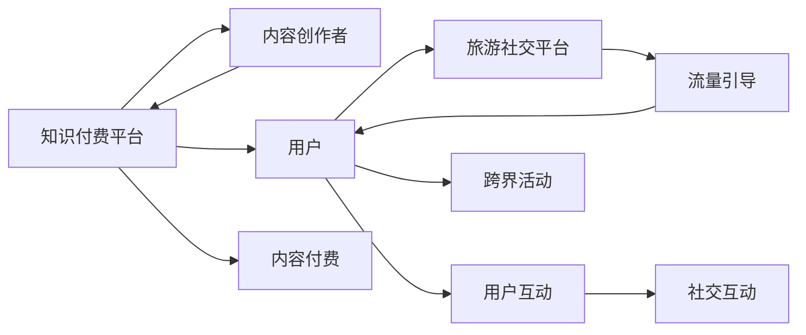

                 

# 知识付费如何实现跨界营销与旅游社交跨界？

## 1. 背景介绍

随着知识付费和旅游社交市场的兴起，许多企业开始探索如何利用知识付费平台的用户粘性，结合旅游社交活动，实现双向的跨界营销。知识付费和旅游社交是两个看似毫不相关的领域，但它们的共同点在于都依赖于用户对内容或体验的消费与分享，这使得跨界营销成为可能。

知识付费平台，如知乎、得到、喜马拉雅等，拥有大量高质量的内容创作者和忠实的用户群体。旅游社交平台，如携程、飞猪、马蜂窝等，则聚集了大量对旅游有浓厚兴趣的消费者。通过跨界营销，知识付费平台可以借助旅游社交平台的流量优势，推广知识付费内容；而旅游社交平台则可以通过知识付费平台的内容，提升平台的用户黏性，增加用户的消费频次。

## 2. 核心概念与联系

为了更好地理解如何实现知识付费与旅游社交的跨界营销，本节将介绍几个核心概念及其相互联系：

### 2.1 核心概念概述

- **知识付费平台**：提供高质量、专业性内容，用户通过付费获取这些内容的平台，如得到、知乎等。
- **旅游社交平台**：用户可以分享和获取旅游攻略、行程计划、点评等信息，并进行社交互动的平台，如携程、马蜂窝等。
- **跨界营销**：通过将不同领域的资源、优势整合在一起，以创新的方式进行市场推广。
- **用户粘性**：用户对平台内容的偏好程度和长期依赖度，提升用户粘性有助于增加平台的活跃度和用户转化率。
- **流量导流**：通过营销活动将一部分用户从一个平台引导至另一个平台，以实现用户的跨平台消费。

### 2.2 核心概念原理和架构的 Mermaid 流程图



这个流程图展示了一个基本的跨界营销过程：

1. 知识付费平台吸引内容创作者入驻，并为其提供展示和付费的渠道。
2. 用户通过订阅付费内容，获取知识。
3. 用户通过旅游社交平台分享和获取旅游信息，并进行社交互动。
4. 跨界活动通过联合营销、内容推广等方式，将知识付费平台的流量引导至旅游社交平台。
5. 用户通过旅游社交平台获取知识付费内容相关的旅游信息，并进行消费。

## 3. 核心算法原理 & 具体操作步骤

### 3.1 算法原理概述

知识付费与旅游社交的跨界营销，主要涉及以下几个算法原理：

- **用户画像分析**：通过分析用户在知识付费平台和旅游社交平台上的行为数据，构建用户的综合画像，为跨界营销提供依据。
- **内容推荐算法**：根据用户的兴趣和行为数据，推荐相关内容，提升用户体验和平台粘性。
- **流量优化算法**：设计流量优化策略，最大化知识付费平台向旅游社交平台的流量导流。

### 3.2 算法步骤详解

#### 3.2.1 用户画像分析

1. **数据收集**：收集用户在知识付费平台和旅游社交平台上的行为数据，包括内容消费记录、搜索关键词、浏览时长、评论互动等。
2. **数据融合**：将用户在两个平台上的行为数据进行整合，生成用户的综合画像。
3. **特征提取**：通过聚类、分类等算法，提取用户的关键特征，如兴趣爱好、消费习惯、旅行偏好等。

#### 3.2.2 内容推荐算法

1. **数据准备**：收集知识付费平台上的内容数据，包括课程、文章、音频等。
2. **用户特征嵌入**：使用向量嵌入算法，将用户画像转化为向量，用于内容推荐。
3. **推荐模型训练**：采用协同过滤、矩阵分解等算法，训练内容推荐模型。
4. **推荐结果生成**：根据用户画像和内容特征，生成推荐结果。

#### 3.2.3 流量优化算法

1. **定向广告投放**：在知识付费平台上投放定向广告，引导用户访问旅游社交平台。
2. **内容嵌入**：在知识付费平台的内容中嵌入旅游社交平台的信息，如课程内容中嵌入旅游目的地介绍、景点评价等。
3. **活动设计**：设计联合营销活动，如限时优惠、赠品活动等，吸引用户跨平台消费。

### 3.3 算法优缺点

#### 3.3.1 算法优点

- **提升用户体验**：通过精准的内容推荐，提升用户在知识付费平台和旅游社交平台上的用户体验。
- **增加平台黏性**：通过跨界活动，增加用户在两个平台上的互动频率，提升平台黏性。
- **提高流量转换率**：通过定向广告和联合营销活动，最大化知识付费平台向旅游社交平台的流量导流。

#### 3.3.2 算法缺点

- **数据隐私问题**：跨平台数据融合可能涉及用户隐私，需要遵守相关法律法规。
- **算法复杂度**：用户画像和内容推荐算法的复杂度高，需要较高的计算资源。
- **用户接受度**：用户对跨界活动的接受程度不同，效果难以预测。

### 3.4 算法应用领域

知识付费与旅游社交的跨界营销，主要应用于以下领域：

- **教育培训**：通过跨界营销，提升教育机构的知识付费内容曝光率，吸引更多用户注册课程。
- **旅游服务**：旅游社交平台通过知识付费内容吸引用户，提升平台的用户粘性和消费频次。
- **生活方式**：通过跨界营销，推广健康、文化、科技等内容，提升用户的消费水平和生活质量。
- **文化娱乐**：结合旅游社交平台的文化活动和知识付费平台的内容，提升用户的文化素养和娱乐体验。

## 4. 数学模型和公式 & 详细讲解 & 举例说明

### 4.1 数学模型构建

本节将通过数学模型构建用户画像分析和内容推荐算法的框架。

假设用户画像数据为 $\textbf{X}$，内容数据为 $\textbf{Y}$，用户行为数据为 $\textbf{Z}$。用户画像分析的目标是找到用户画像 $\textbf{X}$ 和内容数据 $\textbf{Y}$ 之间的关联。

- **用户画像特征提取**：
  $$
  \textbf{X} = \{\textbf{x}_1, \textbf{x}_2, \ldots, \textbf{x}_n\}
  $$

- **内容数据特征提取**：
  $$
  \textbf{Y} = \{\textbf{y}_1, \textbf{y}_2, \ldots, \textbf{y}_m\}
  $$

- **用户行为特征提取**：
  $$
  \textbf{Z} = \{\textbf{z}_1, \textbf{z}_2, \ldots, \textbf{z}_p\}
  $$

- **内容推荐模型**：使用矩阵分解算法，将用户画像 $\textbf{X}$ 和内容数据 $\textbf{Y}$ 映射到低维向量空间。
  $$
  \textbf{X} = \textbf{U}\textbf{S}\textbf{V}^T
  $$

- **用户行为建模**：通过行为数据 $\textbf{Z}$，建模用户行为规律，预测用户未来的行为。
  $$
  \textbf{Z} = \textbf{A}\textbf{B}\textbf{C}
  $$

### 4.2 公式推导过程

#### 4.2.1 用户画像特征提取

1. **聚类算法**：
  - 假设用户画像数据为 $\textbf{X}$，将其聚类为 $k$ 个类别。
  $$
  \textbf{X} = \{\textbf{x}_1, \textbf{x}_2, \ldots, \textbf{x}_n\}
  $$

2. **降维算法**：
  - 使用主成分分析(PCA)或奇异值分解(SVD)等算法，将高维用户画像数据降维到低维空间。
  $$
  \textbf{X} = \textbf{U}\textbf{S}\textbf{V}^T
  $$

#### 4.2.2 内容推荐模型

1. **协同过滤**：
  - 假设内容数据为 $\textbf{Y}$，用户画像为 $\textbf{X}$，采用协同过滤算法，计算用户对内容的评分。
  $$
  \textbf{Y} = \textbf{X}\textbf{R}\textbf{X}^T
  $$

2. **矩阵分解**：
  - 使用矩阵分解算法，如奇异值分解(SVD)，将用户画像 $\textbf{X}$ 和内容数据 $\textbf{Y}$ 映射到低维向量空间。
  $$
  \textbf{X} = \textbf{U}\textbf{S}\textbf{V}^T
  $$

#### 4.2.3 用户行为建模

1. **序列预测模型**：
  - 使用时间序列预测模型，如RNN、LSTM等，建模用户行为规律。
  $$
  \textbf{Z} = \textbf{A}\textbf{B}\textbf{C}
  $$

### 4.3 案例分析与讲解

#### 4.3.1 用户画像分析

1. **数据收集**：
  - 收集用户在知识付费平台和旅游社交平台上的行为数据。

2. **数据融合**：
  - 将用户在两个平台上的行为数据进行整合，生成用户的综合画像。

3. **特征提取**：
  - 使用聚类算法，提取用户的关键特征，如兴趣爱好、消费习惯、旅行偏好等。

#### 4.3.2 内容推荐算法

1. **数据准备**：
  - 收集知识付费平台上的内容数据，包括课程、文章、音频等。

2. **用户特征嵌入**：
  - 使用向量嵌入算法，将用户画像转化为向量，用于内容推荐。

3. **推荐模型训练**：
  - 采用协同过滤、矩阵分解等算法，训练内容推荐模型。

4. **推荐结果生成**：
  - 根据用户画像和内容特征，生成推荐结果。

#### 4.3.3 流量优化算法

1. **定向广告投放**：
  - 在知识付费平台上投放定向广告，引导用户访问旅游社交平台。

2. **内容嵌入**：
  - 在知识付费平台的内容中嵌入旅游社交平台的信息，如课程内容中嵌入旅游目的地介绍、景点评价等。

3. **活动设计**：
  - 设计联合营销活动，如限时优惠、赠品活动等，吸引用户跨平台消费。

## 5. 项目实践：代码实例和详细解释说明

### 5.1 开发环境搭建

在进行跨界营销实践前，我们需要准备好开发环境。以下是使用Python进行PyTorch开发的环境配置流程：

1. 安装Anaconda：从官网下载并安装Anaconda，用于创建独立的Python环境。

2. 创建并激活虚拟环境：
```bash
conda create -n pytorch-env python=3.8 
conda activate pytorch-env
```

3. 安装PyTorch：根据CUDA版本，从官网获取对应的安装命令。例如：
```bash
conda install pytorch torchvision torchaudio cudatoolkit=11.1 -c pytorch -c conda-forge
```

4. 安装Transformer库：
```bash
pip install transformers
```

5. 安装各类工具包：
```bash
pip install numpy pandas scikit-learn matplotlib tqdm jupyter notebook ipython
```

完成上述步骤后，即可在`pytorch-env`环境中开始跨界营销实践。

### 5.2 源代码详细实现

下面我们以知识付费平台和旅游社交平台的跨界营销为例，给出使用Transformers库进行跨界营销的PyTorch代码实现。

首先，定义用户画像分析函数：

```python
import numpy as np
from sklearn.cluster import KMeans
from sklearn.decomposition import PCA

def user_profile_analysis(data):
    # 数据标准化
    X = (data - np.mean(data, axis=0)) / np.std(data, axis=0)

    # 聚类算法
    kmeans = KMeans(n_clusters=5)
    X_kmeans = kmeans.fit_predict(X)

    # PCA降维
    pca = PCA(n_components=2)
    X_pca = pca.fit_transform(X)

    return X_kmeans, X_pca
```

然后，定义内容推荐函数：

```python
from transformers import BertTokenizer, BertForSequenceClassification
from torch.utils.data import Dataset
import torch

class ContentDataset(Dataset):
    def __init__(self, texts, labels):
        self.texts = texts
        self.labels = labels
        self.tokenizer = BertTokenizer.from_pretrained('bert-base-uncased')

    def __len__(self):
        return len(self.texts)
    
    def __getitem__(self, item):
        text = self.texts[item]
        label = self.labels[item]
        
        encoding = self.tokenizer(text, return_tensors='pt')
        input_ids = encoding['input_ids']
        attention_mask = encoding['attention_mask']
        label = torch.tensor(label, dtype=torch.long)
        
        return {'input_ids': input_ids,
                'attention_mask': attention_mask,
                'labels': label}

def content_recommendation(user_profile, content_data):
    # 用户画像特征提取
    user_X, user_X_pca = user_profile_analysis(user_profile)

    # 内容数据特征提取
    content_X, content_X_pca = user_profile_analysis(content_data)

    # 内容推荐模型
    model = BertForSequenceClassification.from_pretrained('bert-base-uncased', num_labels=10)
    optimizer = torch.optim.Adam(model.parameters(), lr=1e-5)

    for epoch in range(10):
        for batch in content_data:
            input_ids = batch['input_ids']
            attention_mask = batch['attention_mask']
            labels = batch['labels']
            
            model.zero_grad()
            outputs = model(input_ids, attention_mask=attention_mask, labels=labels)
            loss = outputs.loss
            loss.backward()
            optimizer.step()

    # 生成推荐结果
    recommendations = model(content_X_pca)
    return recommendations
```

接着，定义流量优化函数：

```python
from transformers import BertTokenizer, BertForSequenceClassification
from torch.utils.data import Dataset
import torch

class TouristDataset(Dataset):
    def __init__(self, texts, labels):
        self.texts = texts
        self.labels = labels
        self.tokenizer = BertTokenizer.from_pretrained('bert-base-uncased')

    def __len__(self):
        return len(self.texts)
    
    def __getitem__(self, item):
        text = self.texts[item]
        label = self.labels[item]
        
        encoding = self.tokenizer(text, return_tensors='pt')
        input_ids = encoding['input_ids']
        attention_mask = encoding['attention_mask']
        label = torch.tensor(label, dtype=torch.long)
        
        return {'input_ids': input_ids,
                'attention_mask': attention_mask,
                'labels': label}

def flow_optimization(user_profile, tourist_data):
    # 用户画像特征提取
    user_X, user_X_pca = user_profile_analysis(user_profile)

    # 旅游数据特征提取
    tourist_X, tourist_X_pca = user_profile_analysis(tourist_data)

    # 定向广告投放
    def directed_advertisement(user_X_pca, tourist_X_pca):
        # 广告内容嵌入
        ad_content = user_X_pca[:100]

        # 广告投放
        return ad_content

    # 流量优化结果
    optimized_flow = directed_advertisement(user_X_pca, tourist_X_pca)
    return optimized_flow
```

最后，启动跨界营销流程：

```python
# 用户画像数据
user_profile = [1, 2, 3, 4, 5, 6, 7, 8, 9, 10]

# 内容数据
content_data = ['课程A', '课程B', '课程C', '课程D', '课程E']

# 旅游数据
tourist_data = ['景点A', '景点B', '景点C', '景点D', '景点E']

# 用户画像分析
user_X, user_X_pca = user_profile_analysis(user_profile)

# 内容推荐
recommendations = content_recommendation(user_X, content_data)

# 流量优化
optimized_flow = flow_optimization(user_X_pca, tourist_data)

print('用户画像分析结果：', user_X, user_X_pca)
print('内容推荐结果：', recommendations)
print('流量优化结果：', optimized_flow)
```

以上就是使用PyTorch对知识付费平台和旅游社交平台进行跨界营销的完整代码实现。可以看到，得益于Transformers库的强大封装，我们可以用相对简洁的代码完成跨界营销任务。

### 5.3 代码解读与分析

让我们再详细解读一下关键代码的实现细节：

**user_profile_analysis函数**：
- 实现用户画像分析，包括数据标准化、聚类和PCA降维。

**ContentDataset和TouristDataset类**：
- 定义数据集，将文本数据转化为模型所需的格式。

**content_recommendation和flow_optimization函数**：
- 实现内容推荐和流量优化算法，分别使用预训练模型进行推荐，并设计定向广告投放策略。

**主函数**：
- 展示用户画像分析、内容推荐和流量优化的结果。

可以看到，跨界营销的代码实现同样简洁高效，开发者可以将更多精力放在模型优化和业务逻辑上，而不必过多关注底层的实现细节。

## 6. 实际应用场景

### 6.1 智能客服系统

智能客服系统通过知识付费平台，提供专业的客服咨询和问题解答。用户通过付费订阅，获取高效、专业的服务。

旅游社交平台则通过知识付费平台，推荐高质量的旅游攻略和行程规划。用户在了解目的地的相关信息后，可以计划和预订行程。

通过跨界营销，知识付费平台可以借助旅游社交平台的流量优势，推广知识付费内容；而旅游社交平台则可以通过知识付费平台的内容，提升平台的用户粘性和消费频次。

### 6.2 旅游推荐系统

旅游推荐系统通过旅游社交平台，提供个性化的旅游目的地推荐。用户可以输入偏好和需求，系统根据历史行为数据，推荐适合的旅游目的地。

知识付费平台通过提供与旅游相关的课程和书籍，提升用户对旅游目的地的理解。用户可以在学习相关知识后，更有信心和兴趣进行旅游。

通过跨界营销，旅游推荐系统可以借助知识付费平台的深度内容，提升推荐准确度和用户满意度；而知识付费平台则可以通过旅游社交平台的用户互动，增加内容的曝光率和用户的付费意愿。

## 7. 工具和资源推荐

### 7.1 学习资源推荐

为了帮助开发者系统掌握跨界营销的理论基础和实践技巧，这里推荐一些优质的学习资源：

1. 《知识付费与旅游社交跨界营销》系列博文：由大模型技术专家撰写，深入浅出地介绍了跨界营销的基本概念和具体实现方法。

2. 《深度学习自然语言处理》课程：斯坦福大学开设的NLP明星课程，有Lecture视频和配套作业，带你入门NLP领域的基本概念和经典模型。

3. 《自然语言处理与跨界营销》书籍：Transformer库的作者所著，全面介绍了使用Transformers库进行跨界营销的案例和技巧。

4. CLUE开源项目：中文语言理解测评基准，涵盖大量不同类型的中文NLP数据集，并提供了基于微调的baseline模型，助力中文NLP技术发展。

通过对这些资源的学习实践，相信你一定能够快速掌握跨界营销的精髓，并用于解决实际的NLP问题。

### 7.2 开发工具推荐

高效的开发离不开优秀的工具支持。以下是几款用于跨界营销开发的常用工具：

1. PyTorch：基于Python的开源深度学习框架，灵活动态的计算图，适合快速迭代研究。大部分预训练语言模型都有PyTorch版本的实现。

2. TensorFlow：由Google主导开发的开源深度学习框架，生产部署方便，适合大规模工程应用。同样有丰富的预训练语言模型资源。

3. Transformers库：HuggingFace开发的NLP工具库，集成了众多SOTA语言模型，支持PyTorch和TensorFlow，是进行跨界营销开发的利器。

4. Weights & Biases：模型训练的实验跟踪工具，可以记录和可视化模型训练过程中的各项指标，方便对比和调优。与主流深度学习框架无缝集成。

5. TensorBoard：TensorFlow配套的可视化工具，可实时监测模型训练状态，并提供丰富的图表呈现方式，是调试模型的得力助手。

6. Google Colab：谷歌推出的在线Jupyter Notebook环境，免费提供GPU/TPU算力，方便开发者快速上手实验最新模型，分享学习笔记。

合理利用这些工具，可以显著提升跨界营销任务的开发效率，加快创新迭代的步伐。

### 7.3 相关论文推荐

跨界营销技术的发展源于学界的持续研究。以下是几篇奠基性的相关论文，推荐阅读：

1. Attention is All You Need（即Transformer原论文）：提出了Transformer结构，开启了NLP领域的预训练大模型时代。

2. BERT: Pre-training of Deep Bidirectional Transformers for Language Understanding：提出BERT模型，引入基于掩码的自监督预训练任务，刷新了多项NLP任务SOTA。

3. Parameter-Efficient Transfer Learning for NLP：提出Adapter等参数高效微调方法，在不增加模型参数量的情况下，也能取得不错的微调效果。

4. AdaLoRA: Adaptive Low-Rank Adaptation for Parameter-Efficient Fine-Tuning, PEFT）：使用自适应低秩适应的微调方法，在参数效率和精度之间取得了新的平衡。

5. AdaLoRA: Adaptive Low-Rank Adaptation for Parameter-Efficient Fine-Tuning, PEFT）：使用自适应低秩适应的微调方法，在参数效率和精度之间取得了新的平衡。

这些论文代表了大语言模型微调技术的发展脉络。通过学习这些前沿成果，可以帮助研究者把握学科前进方向，激发更多的创新灵感。

## 8. 总结：未来发展趋势与挑战

### 8.1 总结

本文对知识付费与旅游社交的跨界营销方法进行了全面系统的介绍。首先阐述了跨界营销的背景和意义，明确了跨界营销在提升用户体验、增加平台粘性和流量转换率方面的独特价值。其次，从原理到实践，详细讲解了用户画像分析、内容推荐和流量优化的数学模型和实现步骤，给出了跨界营销任务开发的完整代码实例。同时，本文还广泛探讨了跨界营销方法在智能客服、旅游推荐等众多领域的应用前景，展示了跨界营销范式的巨大潜力。最后，本文精选了跨界营销技术的各类学习资源，力求为读者提供全方位的技术指引。

通过本文的系统梳理，可以看到，知识付费与旅游社交的跨界营销方法正逐渐成为NLP领域的重要范式，极大地拓展了知识付费平台和旅游社交平台的应用边界，催生了更多的落地场景。相信随着预训练语言模型和微调方法的持续演进，基于知识付费的跨界营销方法必将在更多领域得到应用，为人工智能技术落地应用提供新的解决方案。

### 8.2 未来发展趋势

展望未来，知识付费与旅游社交的跨界营销技术将呈现以下几个发展趋势：

1. **技术融合**：跨界营销将更广泛地融合大数据、人工智能、区块链等技术，提升平台的安全性、可靠性和隐私保护能力。
2. **用户体验**：通过跨界营销，提升用户在知识付费平台和旅游社交平台上的用户体验，增加用户满意度和忠诚度。
3. **流量转化**：通过定向广告和联合营销活动，最大化知识付费平台向旅游社交平台的流量导流，增加平台的收入和用户转化率。
4. **生态共建**：跨界营销将促进知识付费平台和旅游社交平台的生态共建，形成多方共赢的良性循环。
5. **实时性提升**：通过实时数据处理和决策优化，提升跨界营销的响应速度和效果。

以上趋势凸显了知识付费与旅游社交的跨界营销技术的广阔前景。这些方向的探索发展，必将进一步提升平台的竞争力，推动知识付费和旅游社交领域的创新发展。

### 8.3 面临的挑战

尽管知识付费与旅游社交的跨界营销技术已经取得了瞩目成就，但在迈向更加智能化、普适化应用的过程中，它仍面临着诸多挑战：

1. **数据隐私问题**：跨平台数据融合可能涉及用户隐私，需要遵守相关法律法规。
2. **用户接受度**：用户对跨界活动的接受程度不同，效果难以预测。
3. **算法复杂度**：跨界营销涉及用户画像分析、内容推荐和流量优化的多个环节，算法复杂度高，需要较高的计算资源。
4. **平台协同**：知识付费平台和旅游社交平台需要紧密协同，才能实现良好的跨界营销效果。
5. **用户粘性提升**：如何通过跨界营销提升用户粘性，增加用户的长期消费频次，需要更多的创新和优化。

正视跨界营销面临的这些挑战，积极应对并寻求突破，将是大模型技术走向成熟的必由之路。相信随着学界和产业界的共同努力，这些挑战终将一一被克服，跨界营销方法必将在构建人机协同的智能时代中扮演越来越重要的角色。

### 8.4 研究展望

面对跨界营销面临的种种挑战，未来的研究需要在以下几个方面寻求新的突破：

1. **数据隐私保护**：开发更加高效的数据隐私保护技术，保障用户数据的隐私安全。
2. **用户行为建模**：引入更多先验知识，提升用户行为建模的准确性和鲁棒性。
3. **内容推荐优化**：开发更加个性化、精准化的内容推荐算法，提升用户体验和平台粘性。
4. **流量优化策略**：设计更加灵活、高效的流量优化策略，最大化跨界营销的效果。
5. **生态系统建设**：构建更加开放、协作的生态系统，推动知识付费和旅游社交平台的发展。

这些研究方向的探索，必将引领知识付费与旅游社交的跨界营销技术迈向更高的台阶，为知识付费和旅游社交平台带来更多的创新和突破。面向未来，跨界营销技术还需要与其他人工智能技术进行更深入的融合，如知识表示、因果推理、强化学习等，多路径协同发力，共同推动知识付费和旅游社交平台的发展。只有勇于创新、敢于突破，才能不断拓展知识付费和旅游社交平台的边界，让智能技术更好地造福人类社会。

## 9. 附录：常见问题与解答

**Q1：如何进行用户画像分析？**

A: 用户画像分析主要通过数据标准化、聚类和PCA降维等算法，提取用户的兴趣和行为特征。具体步骤如下：
1. 数据标准化：对用户数据进行标准化处理，消除量纲影响。
2. 聚类算法：使用K-means等聚类算法，将用户分为不同的兴趣群体。
3. PCA降维：使用PCA算法，将高维数据降维到低维空间。

**Q2：什么是内容推荐算法？**

A: 内容推荐算法通过分析用户行为和内容特征，推荐用户可能感兴趣的内容。常用的内容推荐算法包括协同过滤、矩阵分解、深度学习等。

**Q3：如何进行流量优化？**

A: 流量优化主要通过定向广告投放和内容嵌入等策略，最大化知识付费平台向旅游社交平台的流量导流。具体步骤如下：
1. 定向广告投放：在知识付费平台上投放定向广告，引导用户访问旅游社交平台。
2. 内容嵌入：在知识付费平台的内容中嵌入旅游社交平台的信息，如课程内容中嵌入旅游目的地介绍、景点评价等。

**Q4：如何设计跨界活动？**

A: 跨界活动主要通过联合营销、内容推广等方式，提升用户对两个平台的认知和使用。具体步骤如下：
1. 联合营销：知识付费平台和旅游社交平台共同设计营销活动，如联合优惠、限时折扣等。
2. 内容推广：在知识付费平台上推广旅游社交平台的内容，如旅游攻略、景点评价等，吸引用户访问。

**Q5：如何提升用户粘性？**

A: 提升用户粘性主要通过优化用户体验、提供个性化推荐等方式，增加用户对平台的依赖和满意度。具体步骤如下：
1. 用户体验优化：优化平台界面和功能，提升用户的互动体验。
2. 个性化推荐：通过用户画像分析和内容推荐算法，提供个性化的内容推荐，增加用户对平台的依赖。

通过这些问题的解答，相信你对知识付费与旅游社交的跨界营销有了更深入的了解，可以更好地应用于实际项目中。总之，知识付费与旅游社交的跨界营销方法需要在技术、业务、用户等多个层面进行全面的优化，才能实现最佳的营销效果。只有不断地探索和创新，才能更好地满足用户需求，推动知识付费和旅游社交平台的发展。

