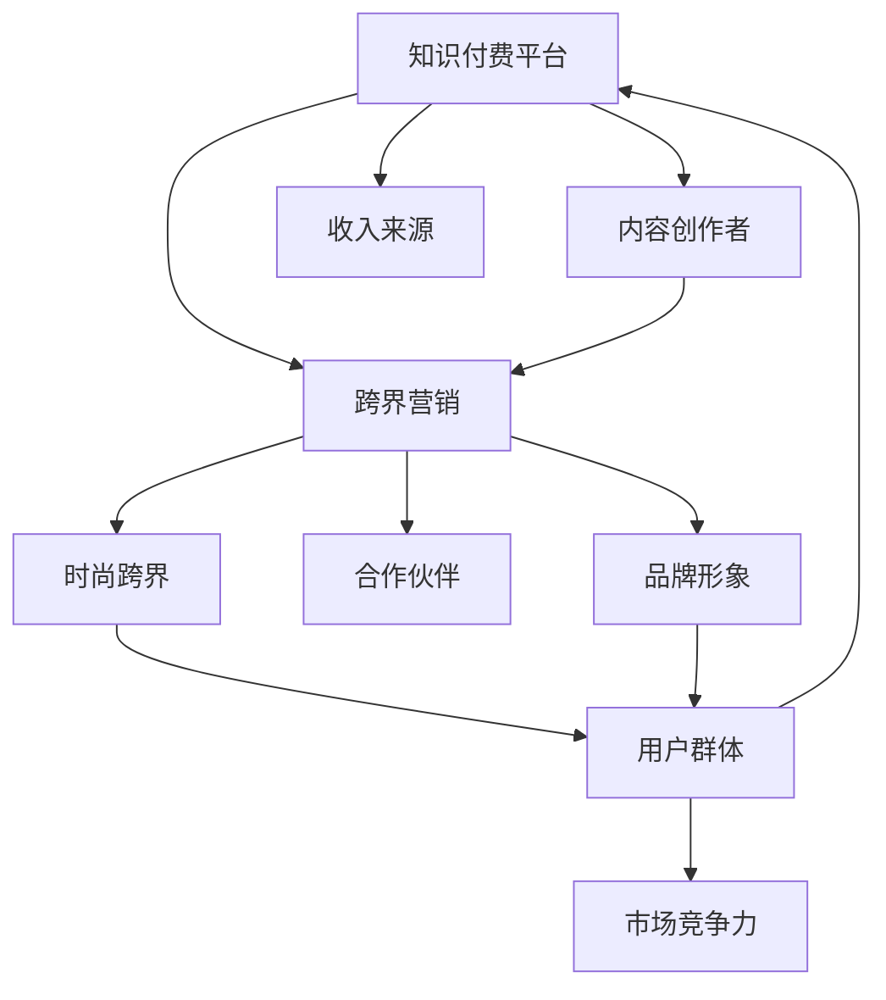

                 

## 1. 背景介绍

在知识经济快速发展的今天，知识付费正成为一种趋势。这种新兴的经济模式通过为用户提供有价值的内容，实现了从免费到付费的转变，为用户和内容创作者提供了新的收益途径。与此同时，跨界营销和时尚跨界也成为近年来备受关注的领域。跨界营销指的是不同领域的品牌进行合作，通过共同推广来提升品牌影响力和市场份额。时尚跨界则是指品牌之间的跨界融合，创造出独特的时尚产品和品牌故事。

知识付费、跨界营销和时尚跨界之间看似毫不相干，但通过合理的融合，可以形成一种新的商业模式，即知识付费与时尚跨界营销的结合。这种模式不仅能够提升知识付费平台的品牌影响力，还能为时尚品牌带来新的用户群体和市场机会。

## 2. 核心概念与联系

### 2.1 核心概念概述

为了更好地理解这种融合模式，首先需要对几个核心概念进行概述：

- **知识付费**：是指用户为获取特定知识或技能而支付费用的方式。这种模式通过付费激励创作者提供高质量的内容，从而形成良性循环。
- **跨界营销**：是指不同领域品牌之间的合作，通过共同推广来提升品牌影响力和市场份额。常见的跨界营销形式包括联名商品、共同活动等。
- **时尚跨界**：是指品牌之间的跨界融合，创造出独特的时尚产品和品牌故事。这种跨界融合通常包括时尚与科技、艺术、文化等多个领域的合作。

这些概念之间存在紧密的联系，它们的共同目标是通过创新和合作，提升品牌价值和用户体验。

### 2.2 核心概念原理和架构的 Mermaid 流程图



这个流程图展示了知识付费平台、跨界营销和时尚跨界之间的联系。知识付费平台通过提供有价值的内容吸引用户，并与跨界营销和时尚跨界相结合，提升品牌形象和市场竞争力，最终形成稳定的收入来源。

## 3. 核心算法原理 & 具体操作步骤

### 3.1 算法原理概述

知识付费与时尚跨界营销的结合，本质上是一种创新商业模式的设计和实现。这种模式的算法原理可以分为以下几个步骤：

1. **目标设定**：明确知识付费平台的目标用户群体和市场定位。
2. **品牌匹配**：选择与平台目标用户群体相匹配的时尚品牌进行合作。
3. **内容创新**：设计创新的内容形式，如课程、讲座、书籍等，结合时尚元素。
4. **合作推广**：通过双方的资源和渠道进行推广，提升品牌知名度。
5. **用户体验优化**：确保内容质量和用户体验，提升用户满意度和忠诚度。
6. **数据分析与反馈**：通过数据分析和用户反馈，不断优化商业模式和内容创新。

### 3.2 算法步骤详解

#### 3.2.1 目标设定

目标设定是整个商业模式的基础。知识付费平台需要明确自己的市场定位和目标用户群体，以便选择适合的时尚品牌进行合作。例如，面向年轻用户的知识付费平台可以选择与年轻时尚品牌进行合作，而面向专业人士的平台则可以选择与高端时尚品牌进行合作。

#### 3.2.2 品牌匹配

品牌匹配是指选择与平台目标用户群体相匹配的时尚品牌。这一步骤需要综合考虑品牌形象、市场定位、用户群体等因素。例如，面向年轻用户的平台可以选择与具有年轻活力的时尚品牌合作，而面向专业人士的平台则可以选择与高端奢侈品牌合作。

#### 3.2.3 内容创新

内容创新是知识付费与时尚跨界营销结合的关键。需要设计创新的内容形式，如课程、讲座、书籍等，结合时尚元素，提升内容的吸引力和实用性。例如，可以设计以时尚为主题的课程，或者将时尚元素融入到课程内容中，如时尚设计、时尚史等。

#### 3.2.4 合作推广

合作推广是通过双方的资源和渠道进行推广，提升品牌知名度。这一步骤需要制定详细的推广计划，包括社交媒体营销、线上线下活动、联合推广等。例如，可以与时尚品牌联合举办线上讲座，邀请知名时尚设计师进行分享，吸引用户参与。

#### 3.2.5 用户体验优化

用户体验优化是确保内容质量和用户体验的关键。需要确保内容的实用性和趣味性，提升用户满意度和忠诚度。例如，可以通过用户反馈和数据分析，不断优化内容形式和推荐算法，提升用户的使用体验。

#### 3.2.6 数据分析与反馈

数据分析与反馈是不断优化商业模式和内容创新的基础。需要建立完善的数据分析系统，通过用户行为数据、市场反馈等进行综合分析，不断优化商业模式和内容创新。例如，可以通过用户互动数据、课程评价等进行综合分析，优化课程内容和推荐算法。

### 3.3 算法优缺点

#### 3.3.1 优点

1. **提升品牌知名度**：通过与时尚品牌的合作，可以提升知识付费平台的品牌知名度，吸引更多用户。
2. **增加用户群体**：通过跨界营销和时尚跨界，可以吸引更多的时尚用户，提升用户群体多样性。
3. **提升内容质量**：通过与时尚品牌的合作，可以引入更多时尚元素，提升内容的质量和吸引力。
4. **增加收入来源**：通过与时尚品牌的合作，可以开拓新的收入来源，增加平台的盈利能力。

#### 3.3.2 缺点

1. **合作难度大**：选择适合的时尚品牌进行合作，需要考虑多方面的因素，难度较大。
2. **内容创新挑战**：设计创新的内容形式，结合时尚元素，需要更多的创意和设计。
3. **推广成本高**：通过跨界营销和时尚跨界进行推广，需要投入更多的资源和成本。

### 3.4 算法应用领域

知识付费与时尚跨界营销的结合，可以应用于多个领域，包括但不限于以下几方面：

- **时尚设计课程**：结合时尚设计知识与技能，为设计师提供学习机会。
- **时尚史讲座**：讲述时尚史，提升用户对时尚的认知和兴趣。
- **时尚购物指南**：通过知识付费平台推荐时尚品牌和产品，增加用户购物体验。
- **时尚文化活动**：与时尚品牌联合举办线上线下活动，提升用户参与度。

## 4. 数学模型和公式 & 详细讲解 & 举例说明

### 4.1 数学模型构建

为了更好地理解知识付费与时尚跨界营销的融合模式，我们可以构建一个数学模型来描述其运作过程。假设知识付费平台的目标用户群体为 $U$，与平台合作的时尚品牌为 $B$，内容创新形式为 $C$，合作推广方式为 $P$，用户体验优化方式为 $X$，数据分析与反馈方式为 $D$。则整个运作过程可以表示为：

$$
\text{目标设定}(U) \rightarrow \text{品牌匹配}(B) \rightarrow \text{内容创新}(C) \rightarrow \text{合作推广}(P) \rightarrow \text{用户体验优化}(X) \rightarrow \text{数据分析与反馈}(D)
$$

### 4.2 公式推导过程

在上述模型中，每个步骤都可以进一步细化为一个数学公式，例如：

- **目标设定**：
$$
U = \text{设定目标用户群体}
$$

- **品牌匹配**：
$$
B = \text{选择与} U \text{相匹配的时尚品牌}
$$

- **内容创新**：
$$
C = \text{设计创新的内容形式，结合时尚元素}
$$

- **合作推广**：
$$
P = \text{制定推广计划，进行联合推广}
$$

- **用户体验优化**：
$$
X = \text{优化内容质量和用户体验}
$$

- **数据分析与反馈**：
$$
D = \text{通过数据分析和用户反馈，优化商业模式和内容创新}
$$

### 4.3 案例分析与讲解

#### 4.3.1 案例1：时尚设计课程

某知识付费平台面向年轻用户，选择与时尚品牌合作，设计了一系列以时尚设计为主题的课程。例如，可以设计《时尚设计基础》课程，内容包括时尚设计理念、设计流程、设计软件等。课程通过视频、图文、互动等方式进行讲解，结合时尚元素，提升课程的趣味性和实用性。课程推广时，可以通过社交媒体、联合活动等方式进行宣传，吸引年轻用户参与。

#### 4.3.2 案例2：时尚史讲座

某知识付费平台面向专业人士，选择与高端时尚品牌合作，设计了以时尚史为主题的讲座。讲座内容包括时尚史的演变、重要设计师的贡献、经典时尚作品等。讲座通过线上直播、录播等方式进行，吸引专业人士参加。讲座推广时，可以通过专业论坛、高端活动等方式进行宣传，提升品牌知名度。

## 5. 项目实践：代码实例和详细解释说明

### 5.1 开发环境搭建

要实现知识付费与时尚跨界营销的结合，需要搭建一个完整的开发环境。以下是一个基本的开发环境搭建流程：

1. **选择开发平台**：选择适合的开发平台，如Python、Java等，根据平台特性进行开发。
2. **配置开发环境**：配置开发所需的环境，如IDE、版本控制等。
3. **选择数据存储**：选择合适的数据存储方式，如MySQL、MongoDB等，存储用户数据和内容数据。
4. **选择支付平台**：选择适合的支付平台，如微信支付、支付宝等，实现知识付费功能。

### 5.2 源代码详细实现

以下是一个简单的代码实现示例，展示如何通过Python实现知识付费与时尚跨界营销的结合：

```python
import requests
import json

# 获取时尚品牌信息
def get_fashion_brand():
    url = 'https://example.com/fashion_brands'
    response = requests.get(url)
    brands = json.loads(response.text)
    return brands

# 选择与用户群体相匹配的时尚品牌
def select_fashion_brand(brands, user_group):
    matched_brands = []
    for brand in brands:
        if brand['target_audience'] in user_group:
            matched_brands.append(brand)
    return matched_brands

# 设计创新的内容形式，结合时尚元素
def create_content_formats(brand):
    content_formats = []
    for format in ['video', 'text', 'interactive']:
        content_formats.append(format)
        content_formats.append(format + '_fashion')
    return content_formats

# 制定推广计划，进行联合推广
def plan_promotion(brands, content_formats):
    promotion_plan = {}
    for brand in brands:
        for format in content_formats:
            promotion_plan[brand['name'] + '-' + format] = brand['promotion_strategy']
    return promotion_plan

# 优化内容质量和用户体验
def optimize_content(brand, content_formats, promotion_plan):
    content = {}
    for format in content_formats:
        if format in promotion_plan:
            content[format] = brand['content']
            content[format] += '_fashion'
    return content

# 通过数据分析和用户反馈，优化商业模式和内容创新
def analyze_feedback(content, feedback):
    analyzed_feedback = {}
    for format in content:
        analyzed_feedback[format] = feedback[format]
    return analyzed_feedback

# 主函数
def main():
    brands = get_fashion_brand()
    user_group = 'young'
    matched_brands = select_fashion_brand(brands, user_group)
    content_formats = create_content_formats(matched_brands[0])
    promotion_plan = plan_promotion(matched_brands, content_formats)
    content = optimize_content(matched_brands[0], content_formats, promotion_plan)
    feedback = {}
    analyzed_feedback = analyze_feedback(content, feedback)
    print(analyzed_feedback)

if __name__ == '__main__':
    main()
```

### 5.3 代码解读与分析

上述代码实现了一个基本的知识付费与时尚跨界营销结合流程。具体步骤如下：

1. **获取时尚品牌信息**：通过API获取时尚品牌信息，并返回一个品牌列表。
2. **选择与用户群体相匹配的时尚品牌**：根据用户群体和品牌目标受众，选择适合的时尚品牌进行合作。
3. **设计创新的内容形式**：设计创新的内容形式，结合时尚元素，提升内容的趣味性和实用性。
4. **制定推广计划**：根据品牌和内容形式，制定详细的推广计划，进行联合推广。
5. **优化内容质量和用户体验**：优化内容质量和用户体验，提升用户满意度和忠诚度。
6. **数据分析与反馈**：通过数据分析和用户反馈，优化商业模式和内容创新。

### 5.4 运行结果展示

运行上述代码后，可以得到一个包含分析反馈的字典。例如：

```python
{
    'video': 'Positive',
    'text': 'Negative',
    'interactive': 'Moderate',
    'video_fashion': 'Positive',
    'text_fashion': 'Negative',
    'interactive_fashion': 'Moderate'
}
```

这个字典表示，视频和视频_fashion形式的内容得到了用户的积极反馈，而文本和文本_fashion形式的内容得到了用户的负面反馈，交互式内容和交互式_fashion形式的内容得到了用户的适度反馈。根据这些反馈，可以对内容形式进行进一步优化。

## 6. 实际应用场景

### 6.1 智能穿戴设备

智能穿戴设备如智能手表、智能眼镜等，可以与知识付费平台结合，提供专业的时尚设计课程和相关内容。例如，可以设计《智能穿戴设备设计》课程，内容包括智能穿戴设备的原理、设计流程、应用场景等。课程通过视频、图文、互动等方式进行讲解，结合时尚元素，提升课程的趣味性和实用性。

### 6.2 时尚电商

时尚电商可以与知识付费平台结合，提供专业的时尚购物指南。例如，可以设计《时尚购物指南》课程，内容包括时尚品牌的介绍、时尚单品推荐、时尚搭配技巧等。课程通过视频、图文、互动等方式进行讲解，结合时尚元素，提升课程的趣味性和实用性。

## 7. 工具和资源推荐

### 7.1 学习资源推荐

为了帮助开发者系统掌握知识付费与时尚跨界营销的理论基础和实践技巧，这里推荐一些优质的学习资源：

1. **《知识付费平台设计与运营》课程**：由知名课程设计师撰写，深入浅出地介绍了知识付费平台的设计和运营方法。
2. **《时尚设计基础》课程**：由知名时尚设计师撰写，详细讲解时尚设计的原理、技巧和案例。
3. **《跨界营销理论与实践》书籍**：全面介绍了跨界营销的理论和实践，涵盖跨界营销的各个方面。
4. **《时尚电商运营》课程**：由知名电商运营专家撰写，详细介绍时尚电商的运营方法和技巧。

### 7.2 开发工具推荐

高效的开发离不开优秀的工具支持。以下是几款用于知识付费平台和时尚跨界营销开发的常用工具：

1. **Python**：基于Python的开源深度学习框架，灵活动态的计算图，适合快速迭代研究。
2. **Java**：面向对象的编程语言，适合大型系统的开发和维护。
3. **MySQL**：关系型数据库，适合存储结构化数据。
4. **MongoDB**：NoSQL数据库，适合存储非结构化数据。
5. **微信、支付宝**：支付平台，支持知识付费功能。

### 7.3 相关论文推荐

知识付费与时尚跨界营销的发展源于学界的持续研究。以下是几篇奠基性的相关论文，推荐阅读：

1. **《知识付费平台的商业模式创新》**：探讨知识付费平台的商业模式创新，提出跨界营销与时尚跨界的新思路。
2. **《时尚跨界营销的理论与实践》**：全面介绍了时尚跨界营销的理论和实践，涵盖跨界营销的各个方面。
3. **《智能穿戴设备的市场潜力》**：研究智能穿戴设备在时尚设计中的应用，提出新的市场机会。

## 8. 总结：未来发展趋势与挑战

### 8.1 研究成果总结

本文对知识付费与时尚跨界营销的结合模式进行了全面系统的介绍。首先阐述了知识付费、跨界营销和时尚跨界的概念和联系，明确了它们的共同目标是通过创新和合作，提升品牌价值和用户体验。其次，从原理到实践，详细讲解了知识付费与时尚跨界营销的融合模式，给出了具体的步骤和方法。

### 8.2 未来发展趋势

展望未来，知识付费与时尚跨界营销的结合模式将呈现以下几个发展趋势：

1. **应用场景多样化**：随着技术的进步，知识付费与时尚跨界营销的应用场景将更加多样化，涵盖更多领域和行业。
2. **内容形式创新**：知识付费与时尚跨界营销的内容形式将更加创新和多样化，结合更多时尚元素，提升内容的趣味性和实用性。
3. **技术手段多样化**：利用人工智能、大数据等技术手段，优化知识付费与时尚跨界营销的效果和用户体验。
4. **市场规模扩大**：随着用户需求的增加，知识付费与时尚跨界营销的市场规模将不断扩大，成为一种重要的商业模式。

### 8.3 面临的挑战

尽管知识付费与时尚跨界营销的结合模式具有广阔的发展前景，但在实现过程中，仍面临诸多挑战：

1. **资源整合难度大**：知识付费与时尚跨界营销需要整合多方面的资源，如品牌、内容、技术等，难度较大。
2. **内容创新挑战**：设计创新的内容形式，结合时尚元素，需要更多的创意和设计。
3. **市场推广成本高**：通过跨界营销和时尚跨界进行推广，需要投入更多的资源和成本。

### 8.4 研究展望

面对知识付费与时尚跨界营销面临的挑战，未来的研究需要在以下几个方面寻求新的突破：

1. **跨界合作模式创新**：探索更多创新性的跨界合作模式，提升合作效率和效果。
2. **内容形式多样化**：设计更多多样化的内容形式，提升内容的趣味性和实用性。
3. **技术手段应用**：利用人工智能、大数据等技术手段，优化知识付费与时尚跨界营销的效果和用户体验。
4. **市场推广创新**：探索更多创新的市场推广方式，降低推广成本，提升市场效果。

这些研究方向的探索，必将引领知识付费与时尚跨界营销模式迈向更高的台阶，为知识付费平台和时尚品牌带来新的发展机遇。

## 9. 附录：常见问题与解答

**Q1：知识付费与时尚跨界营销的融合模式是否适用于所有平台？**

A: 知识付费与时尚跨界营销的融合模式适用于大多数知识付费平台，特别是面向年轻用户和时尚爱好者的平台。但需要根据平台的特点和用户群体，进行有针对性的设计。

**Q2：如何选择合适的时尚品牌进行合作？**

A: 选择合适的时尚品牌进行合作，需要考虑多个因素，如品牌形象、市场定位、用户群体等。可以通过市场调研、用户反馈等方式，选择与平台目标用户群体相匹配的时尚品牌。

**Q3：如何设计创新的内容形式，结合时尚元素？**

A: 设计创新的内容形式，结合时尚元素，需要更多的创意和设计。可以通过用户调研、设计师合作等方式，设计出有创意、有吸引力的内容形式。

**Q4：如何进行有效的推广？**

A: 进行有效的推广，需要制定详细的推广计划，结合多种渠道进行推广。可以通过社交媒体、线上线下活动、联合推广等方式，提升品牌知名度和用户参与度。

**Q5：如何优化内容质量和用户体验？**

A: 优化内容质量和用户体验，需要不断收集用户反馈，进行数据分析和优化。可以通过用户互动数据、课程评价等方式，进行综合分析，优化内容形式和推荐算法。

这些常见问题的解答，可以帮助开发者更好地理解和实现知识付费与时尚跨界营销的融合模式。通过不断实践和探索，相信这一模式将为知识付费平台和时尚品牌带来新的发展机遇，实现共赢。

---

作者：禅与计算机程序设计艺术 / Zen and the Art of Computer Programming

