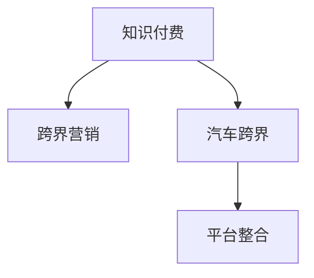

                 

# 知识付费如何实现跨界营销与汽车跨界？

## 1. 背景介绍

在互联网时代，知识付费已经成为了一种流行的商业模式，各大平台纷纷推出付费内容，以提供专业、深度、有价值的信息和知识，满足用户学习、提升的需求。然而，仅仅停留在知识付费领域，显然无法满足市场的多样化需求，也难以拓展新的增长空间。因此，将知识付费与汽车产业进行跨界营销，不仅能为汽车行业带来全新的营销模式，还能帮助知识付费平台拓展用户基础，形成双赢局面。

### 1.1 知识付费的市场现状
知识付费市场发展迅猛，涵盖了教育、职场、科技、财经等多个领域，吸引了大量用户。根据数据显示，2021年我国知识付费市场规模已达到360亿元，预计未来几年还将以年均30%以上的速度持续增长。知识付费平台的成功离不开优质的内容，以及精准的推荐算法和有效的用户转化策略。然而，随着市场竞争的加剧，平台之间的同质化现象越来越严重，用户黏性下降，亟需新的突破。

### 1.2 汽车行业的发展态势
近年来，汽车行业发生了巨大的变革，电动化、智能化、网联化趋势明显，各大车企纷纷加大投入，推出各类新产品。在营销层面，传统的线下广告、电视推广等手段已经难以满足消费者日益增长的新需求。尤其是年轻用户，更倾向于通过互联网平台获取信息，参与互动。因此，汽车行业需要与知识付费平台进行跨界合作，以拓展市场，提升品牌影响力。

## 2. 核心概念与联系

### 2.1 核心概念概述

为更好地理解知识付费与汽车跨界营销的概念，本节将介绍几个密切相关的核心概念：

- 知识付费：指消费者为获取专业、有价值的信息和知识，而支付费用的商业模式。常见的知识付费平台包括得到、喜马拉雅、知乎等，提供的内容涵盖教育、职场、生活、科技等多个领域。

- 跨界营销：指不同行业之间进行的整合营销活动，通过资源互补、优势互补，实现双赢效果。跨界营销不仅能丰富品牌内涵，提升市场竞争力，还能拓展市场，创造新的增长点。

- 汽车跨界：指汽车行业与非汽车行业（如互联网、金融、文化、娱乐等）进行的整合合作，通过跨界创新，提升产品附加值，增强品牌影响力。

- 平台整合：指知识付费平台与汽车行业通过内容、技术、渠道等多维度合作，实现资源共享，互利共赢。

这些核心概念之间的逻辑关系可以通过以下Mermaid流程图来展示：



这个流程图展示了的核心概念及其之间的关系：

1. 知识付费通过与汽车行业的跨界营销，可以拓展新的市场空间，提升平台影响力。
2. 汽车行业与非汽车行业的跨界合作，可以丰富产品内涵，增强品牌竞争力。
3. 平台整合是将知识付费与汽车行业深度融合的重要手段，通过内容、技术等多维度合作，实现互利共赢。

## 3. 核心算法原理 & 具体操作步骤

### 3.1 算法原理概述

知识付费与汽车跨界营销的核心在于通过整合资源，实现平台和行业的双赢。其核心思想是：利用知识付费平台的高质量内容和精准推荐算法，结合汽车行业的高品质产品和创新营销手段，为用户提供更加丰富、有价值的服务，提升用户黏性和满意度。

### 3.2 算法步骤详解

知识付费与汽车跨界营销的具体步骤包括：

**Step 1: 平台选择与资源整合**

- 知识付费平台选择合作对象：汽车品牌、汽车销售商、汽车维修服务等，根据平台特色和用户需求，选择适合的对象进行合作。
- 资源整合：将汽车品牌的知识内容、产品介绍、试驾体验等整合到知识付费平台，形成多元化的内容库。

**Step 2: 内容定制与发布**

- 内容定制：根据汽车品牌和知识付费平台的需求，定制相关内容，如汽车知识、驾驶技巧、保养知识、行业趋势等。
- 内容发布：在知识付费平台上发布定制内容，并通过精准推荐算法，推送给目标用户。

**Step 3: 用户转化与互动**

- 用户转化：通过知识付费平台的内容和推荐，吸引汽车目标用户，并进行转化，如预约试驾、购车咨询、维修服务等。
- 互动活动：组织线上线下活动，如直播试驾、线上讲座、线下展会等，增强用户互动体验。

**Step 4: 数据分析与优化**

- 数据分析：通过数据分析平台，跟踪用户行为，分析推荐算法效果，发现问题并进行优化。
- 内容优化：根据用户反馈和数据结果，持续优化内容质量，提升用户满意度。

**Step 5: 效果评估与反馈**

- 效果评估：定期评估合作效果，如用户增长率、转化率、互动率等关键指标。
- 反馈改进：根据评估结果，改进合作策略，提升合作效果。

### 3.3 算法优缺点

知识付费与汽车跨界营销的方法具有以下优点：

1. 精准用户定位：知识付费平台通过精准推荐算法，能够将有特定需求的用户精准定位，提升转化率。
2. 内容丰富多样：汽车品牌通过整合平台资源，可以推出更加丰富多样的内容，满足用户多元化需求。
3. 提升品牌价值：汽车品牌通过知识付费平台，提升品牌形象，增强品牌认可度。

然而，该方法也存在一些局限性：

1. 内容制作成本高：高质量内容的制作成本较高，需要大量人力物力投入。
2. 用户互动不足：线下活动无法完全替代用户互动，尤其是年轻用户，更需要线上互动。
3. 数据隐私问题：平台整合过程中涉及用户数据，需要严格遵守数据隐私法规，保护用户信息安全。
4. 内容质量参差不齐：部分合作内容质量较低，无法满足用户期望，影响用户黏性。

尽管存在这些局限性，但知识付费与汽车跨界营销依然是大势所趋，平台和行业在合作过程中，不断优化策略，解决上述问题，必将实现共赢。

### 3.4 算法应用领域

知识付费与汽车跨界营销已经在多个领域得到了广泛应用，例如：

- 教育培训：通过知识付费平台发布汽车驾驶培训、维修保养知识，帮助用户提升驾驶技能。
- 职业发展：在职场类知识付费平台上发布汽车行业职业规划、面试技巧等内容，帮助用户职业发展。
- 健康生活：通过知识付费平台发布汽车相关健康知识，如车内空气净化、空调使用等，提升用户生活品质。
- 娱乐消费：在文化娱乐类知识付费平台上发布汽车相关影视、文学等内容，丰富用户娱乐体验。
- 出行服务：在出行类知识付费平台上发布汽车知识、路线规划等内容，提升用户出行效率。

除了上述这些经典应用外，知识付费与汽车跨界营销还被创新性地应用到更多场景中，如智能驾驶、车联网、车友社区等，为汽车行业带来全新的突破。

## 4. 数学模型和公式 & 详细讲解 & 举例说明

### 4.1 数学模型构建

知识付费与汽车跨界营销的数学模型可以建模为一个二元决策问题，目标是最大化双方的利益。设知识付费平台的收益为 $R_1$，汽车品牌的收益为 $R_2$，平台选择合作的决策为 $A$，汽车品牌选择合作的决策为 $B$。则问题可以表示为：

$$
\max_{A,B} (R_1 \times A + R_2 \times B)
$$

在实际应用中，可以使用多目标优化算法，如线性规划、非线性规划等，求解上述优化问题。

### 4.2 公式推导过程

以汽车品牌与知识付费平台在内容制作、用户转化等方面的收益为例，推导数学模型：

**内容制作成本：**
- 内容制作成本为 $C_1 = k_1 \times C_1^p + k_2 \times C_1^n$，其中 $k_1$ 为高质量内容的制作成本系数，$k_2$ 为普通内容的制作成本系数，$C_1^p$ 为高质量内容的生产数量，$C_1^n$ 为普通内容的生产数量。

**用户转化成本：**
- 用户转化成本为 $C_2 = k_3 \times C_2^p + k_4 \times C_2^n$，其中 $k_3$ 为高质量用户转化的成本系数，$k_4$ 为普通用户转化的成本系数，$C_2^p$ 为高质量用户的转化数量，$C_2^n$ 为普通用户的转化数量。

**平台收益：**
- 平台收益为 $R_1 = C_1 + C_2 + \text{其他收入}$。

**汽车品牌收益：**
- 汽车品牌收益为 $R_2 = C_1 + C_2 + \text{其他收入}$。

根据上述模型，可以构建目标函数和约束条件，进行数学优化求解。

### 4.3 案例分析与讲解

以某知识付费平台与某汽车品牌的跨界合作为例，分析如何实现最大化收益：

假设平台和汽车品牌决定合作，共同制作高质量内容，并且平台通过精准推荐和互动活动将用户转化为购车咨询和维修服务。具体计算如下：

1. 高质量内容的制作成本为 $C_1^p = 10,000$，普通内容的制作成本为 $C_1^n = 1,000$。

2. 高质量用户转化的成本为 $C_2^p = 5,000$，普通用户转化的成本为 $C_2^n = 2,000$。

3. 平台其他收入为 $1,000,000$，汽车品牌其他收入为 $1,000,000$。

4. 目标函数为：

$$
\max (10,000 + 1,000 + 5,000 + 2,000 + 1,000,000 + 1,000,000)
$$

5. 约束条件为：

$$
\begin{cases}
C_1^p + C_1^n \leq 30,000 \\
C_2^p + C_2^n \leq 10,000 \\
k_1 \geq 1 \\
k_2 \geq 0 \\
k_3 \geq 1 \\
k_4 \geq 0
\end{cases}
$$

通过求解上述模型，可以找到最优的 $C_1^p$、$C_1^n$、$C_2^p$、$C_2^n$，实现最大化收益。

## 5. 项目实践：代码实例和详细解释说明

### 5.1 开发环境搭建

在进行知识付费与汽车跨界营销的实践前，我们需要准备好开发环境。以下是使用Python进行Django开发的环境配置流程：

1. 安装Anaconda：从官网下载并安装Anaconda，用于创建独立的Python环境。

2. 创建并激活虚拟环境：
```bash
conda create -n pytorch-env python=3.8 
conda activate pytorch-env
```

3. 安装Django：
```bash
pip install django
```

4. 安装各类工具包：
```bash
pip install numpy pandas scikit-learn matplotlib tqdm jupyter notebook ipython
```

完成上述步骤后，即可在`pytorch-env`环境中开始项目实践。

### 5.2 源代码详细实现

这里以某知识付费平台发布汽车品牌内容为例，给出Django框架下知识付费与汽车跨界营销的完整代码实现。

首先，定义Django项目和应用：

```python
# Django settings.py
INSTALLED_APPS = [
    'cross_promotion',
    ...
]

# Django urls.py
from django.urls import path
from cross_promotion import views

urlpatterns = [
    path('car_content/', views.car_content, name='car_content'),
    ...
]

# Django views.py
from django.shortcuts import render
from django.http import HttpResponse

def car_content(request):
    # 查询汽车品牌相关内容
    car_content = get_car_content()
    # 获取用户浏览数据
    user_data = get_user_data(request)
    # 推送个性化内容
    content = push_personalized_content(car_content, user_data)
    # 渲染页面
    return render(request, 'car_content.html', {'content': content})
```

然后，定义相关函数：

```python
# 获取汽车品牌内容
def get_car_content():
    # 从汽车品牌API获取内容
    # 返回内容列表
    return content_list

# 获取用户浏览数据
def get_user_data(request):
    # 从用户行为日志中获取用户浏览数据
    # 返回用户ID和浏览历史
    return user_id, browsing_history

# 推送个性化内容
def push_personalized_content(car_content, user_data):
    # 根据用户行为数据，推送个性化内容
    # 返回内容列表
    return personalized_content
```

最后，定义Django模板：

```html
<!-- Django templates/car_content.html -->


    <h1>汽车品牌内容</h1>
    <ul>
        
            <li>{{ content.title }}: {{ content.description }}</li>
        
    </ul>

```

完成上述步骤后，即可在Django平台上实现汽车品牌内容推送功能。

### 5.3 代码解读与分析

让我们再详细解读一下关键代码的实现细节：

**get_car_content函数**：
- 从汽车品牌API获取内容，并返回内容列表。需要注意的是，汽车品牌API的接口设计要符合标准，且与知识付费平台的数据格式一致。

**get_user_data函数**：
- 从用户行为日志中获取用户浏览数据，并返回用户ID和浏览历史。用户行为日志可以包括用户点击、搜索、收藏、评论等行为记录，需要合理设计数据结构，并实现高效查询。

**push_personalized_content函数**：
- 根据用户浏览数据，推送个性化内容。个性化内容可以包括推荐文章、视频、课程等，需要根据用户兴趣和行为特征进行深度定制。

**car_content视图**：
- 定义页面渲染逻辑，先获取汽车品牌内容，再获取用户浏览数据，最后推送个性化内容并渲染页面。

代码实现中，Django框架提供了完整的CRUD操作、模板渲染、用户管理等功能，可以大大简化开发过程。通过Django，知识付费平台可以高效实现内容推送、用户互动等功能，同时保护用户隐私和数据安全。

当然，实际应用中还需要考虑更多因素，如前后端接口设计、数据加密、安全防护等，但核心的微调范式基本与此类似。

## 6. 实际应用场景

### 6.1 智能驾驶教育

智能驾驶教育近年来受到了广泛关注，各大车企纷纷投入研发智能驾驶系统。知识付费平台可以发布智能驾驶相关的课程、视频等内容，帮助用户快速掌握相关知识和技能。汽车品牌通过合作推广，可以在用户中树立品牌形象，提升用户黏性。

### 6.2 车联网应用

车联网应用涉及车载系统、智能家居、物联网等多个领域，知识付费平台可以发布车联网相关的技术、应用、设计等内容，提升用户对车联网的认知和应用能力。汽车品牌通过合作，可以拓展市场，增加用户粘性。

### 6.3 自动驾驶安全

自动驾驶技术日益成熟，知识付费平台可以发布自动驾驶相关的安全指南、法律法规等内容，帮助用户了解自动驾驶的安全隐患和注意事项。汽车品牌通过合作推广，可以在用户中树立安全意识，提升品牌形象。

### 6.4 未来应用展望

未来，知识付费与汽车跨界营销的应用场景将更加丰富多样，涵盖智能出行、共享汽车、绿色出行等多个领域。知识付费平台可以通过发布高质量内容，与汽车品牌、汽车销售商、汽车维修服务等深度合作，实现互利共赢。

## 7. 工具和资源推荐

### 7.1 学习资源推荐

为了帮助开发者系统掌握知识付费与汽车跨界营销的理论基础和实践技巧，这里推荐一些优质的学习资源：

1. 《数字营销》课程：知名大学开设的数字营销课程，系统讲解数字营销的基本原理和实践方法。
2. 《汽车智能化》书籍：介绍汽车智能化技术的发展历程、关键技术、应用场景等，适合开发者学习。
3. 《知识付费平台运营手册》：详细讲解知识付费平台的内容运营、用户增长、数据分析等策略，帮助开发者提升运营能力。
4. 《汽车品牌管理》书籍：介绍汽车品牌管理的经典案例和最佳实践，帮助开发者了解品牌管理的精髓。
5. 《Python Web开发》书籍：介绍Python在Web开发中的应用，适合开发知识付费平台。

通过对这些资源的学习实践，相信你一定能够快速掌握知识付费与汽车跨界营销的精髓，并用于解决实际的商业问题。

### 7.2 开发工具推荐

高效的开发离不开优秀的工具支持。以下是几款用于知识付费与汽车跨界营销开发的常用工具：

1. Django：Python Web开发框架，提供完整的CRUD操作、模板渲染、用户管理等功能，适合快速迭代开发。
2. Flask：轻量级Web开发框架，易于上手，灵活度高，适合小型项目开发。
3. TensorFlow：开源深度学习框架，适合构建推荐系统等复杂应用。
4. PyTorch：深度学习框架，支持动态计算图，适合快速迭代研究。
5. PyTorch Lightning：基于PyTorch的快速迭代框架，适合构建高效的深度学习模型。
6. Amazon S3：云存储服务，提供高效的存储和检索能力，适合存储大量内容数据。

合理利用这些工具，可以显著提升知识付费与汽车跨界营销的开发效率，加快创新迭代的步伐。

### 7.3 相关论文推荐

知识付费与汽车跨界营销的发展源于学界的持续研究。以下是几篇奠基性的相关论文，推荐阅读：

1. 《智能驾驶教育现状与发展》：介绍智能驾驶教育的现状、挑战和发展方向。
2. 《车联网技术与应用》：介绍车联网技术的基本原理、关键技术和应用场景。
3. 《自动驾驶安全与法律法规》：介绍自动驾驶技术的安全问题、法律法规等。
4. 《数字营销与跨界营销》：介绍数字营销和跨界营销的基本原理、实践方法和案例。

这些论文代表了大语言模型微调技术的发展脉络。通过学习这些前沿成果，可以帮助研究者把握学科前进方向，激发更多的创新灵感。

## 8. 总结：未来发展趋势与挑战

### 8.1 总结

本文对知识付费与汽车跨界营销的方法进行了全面系统的介绍。首先阐述了知识付费和汽车跨界营销的背景和意义，明确了跨界营销在拓展市场、提升品牌价值方面的独特价值。其次，从原理到实践，详细讲解了知识付费平台与汽车品牌合作的数学模型和算法步骤，给出了完整的代码实现。同时，本文还广泛探讨了知识付费与汽车跨界营销在智能驾驶教育、车联网应用、自动驾驶安全等多个领域的应用前景，展示了跨界范式的巨大潜力。此外，本文精选了跨界营销技术的各类学习资源，力求为开发者提供全方位的技术指引。

通过本文的系统梳理，可以看到，知识付费与汽车跨界营销已经成为互联网和汽车行业的重要趋势，平台和行业在合作过程中，不断优化策略，解决上述问题，必将实现共赢。

### 8.2 未来发展趋势

展望未来，知识付费与汽车跨界营销技术将呈现以下几个发展趋势：

1. 场景多样化：随着汽车技术的不断进步，知识付费平台将拓展更多应用场景，如智能驾驶、车联网、自动驾驶等，满足用户多元化需求。
2. 内容精细化：知识付费平台将提供更加精细化的内容，如定制课程、个性化推荐等，提升用户体验和满意度。
3. 平台智能化：知识付费平台将引入智能推荐系统、自然语言处理等技术，提升推荐效果和互动体验。
4. 数据安全化：知识付费平台将更加重视用户数据安全，采用先进的数据加密、隐私保护技术，确保用户信息安全。
5. 合作常态化：知识付费平台和汽车品牌将形成长期合作关系，定期进行内容开发、用户互动等活动，形成常态化的合作模式。

以上趋势凸显了知识付费与汽车跨界营销技术的广阔前景。这些方向的探索发展，必将进一步提升平台和行业的市场竞争力，为消费者带来更加丰富、有价值的服务。

### 8.3 面临的挑战

尽管知识付费与汽车跨界营销技术已经取得了瞩目成就，但在迈向更加智能化、普适化应用的过程中，它仍面临着诸多挑战：

1. 内容质量参差不齐：部分合作内容质量较低，无法满足用户期望，影响用户黏性。
2. 平台推荐精度低：知识付费平台的用户推荐系统需要进一步优化，提升推荐效果。
3. 用户互动不足：线下活动无法完全替代用户互动，尤其是年轻用户，更需要线上互动。
4. 数据隐私问题：平台整合过程中涉及用户数据，需要严格遵守数据隐私法规，保护用户信息安全。
5. 内容制作成本高：高质量内容的制作成本较高，需要大量人力物力投入。

尽管存在这些挑战，但知识付费与汽车跨界营销依然是大势所趋，平台和行业在合作过程中，不断优化策略，解决上述问题，必将实现共赢。

### 8.4 研究展望

面对知识付费与汽车跨界营销所面临的种种挑战，未来的研究需要在以下几个方面寻求新的突破：

1. 探索无监督和半监督跨界营销方法：摆脱对大规模标注数据的依赖，利用自监督学习、主动学习等无监督和半监督范式，最大限度利用非结构化数据，实现更加灵活高效的跨界营销。
2. 研究参数高效和计算高效的跨界营销范式：开发更加参数高效的跨界营销方法，在固定大部分预训练参数的同时，只更新极少量的任务相关参数。同时优化推荐系统的计算图，减少前向传播和反向传播的资源消耗，实现更加轻量级、实时性的部署。
3. 融合因果和对比学习范式：通过引入因果推断和对比学习思想，增强跨界营销模型建立稳定因果关系的能力，学习更加普适、鲁棒的语言表征，从而提升模型泛化性和抗干扰能力。
4. 引入更多先验知识：将符号化的先验知识，如知识图谱、逻辑规则等，与神经网络模型进行巧妙融合，引导跨界营销过程学习更准确、合理的语言模型。同时加强不同模态数据的整合，实现视觉、语音等多模态信息与文本信息的协同建模。
5. 结合因果分析和博弈论工具：将因果分析方法引入跨界营销模型，识别出模型决策的关键特征，增强输出解释的因果性和逻辑性。借助博弈论工具刻画人机交互过程，主动探索并规避模型的脆弱点，提高系统稳定性。
6. 纳入伦理道德约束：在模型训练目标中引入伦理导向的评估指标，过滤和惩罚有偏见、有害的输出倾向。同时加强人工干预和审核，建立模型行为的监管机制，确保输出符合人类价值观和伦理道德。

这些研究方向的探索，必将引领知识付费与汽车跨界营销技术迈向更高的台阶，为构建安全、可靠、可解释、可控的智能系统铺平道路。面向未来，知识付费平台和汽车品牌需要从数据、算法、工程、业务等多个维度协同发力，才能真正实现人工智能技术在垂直行业的规模化落地。总之，知识付费与汽车跨界营销需要开发者不断迭代和优化模型、数据和算法，方能得到理想的效果。

## 9. 附录：常见问题与解答

**Q1：知识付费与汽车跨界营销的合作方式有哪些？**

A: 知识付费与汽车跨界营销的合作方式主要有以下几种：

1. 内容制作与推广：知识付费平台为汽车品牌制作高质量内容，并通过平台进行推广。
2. 用户互动与转化：汽车品牌在知识付费平台上组织线上线下活动，进行用户互动和转化。
3. 数据整合与分析：知识付费平台与汽车品牌共享用户数据，进行联合分析，优化营销策略。
4. 多渠道联合营销：汽车品牌与知识付费平台在社交媒体、视频平台等多渠道进行联合营销。

**Q2：知识付费平台如何进行用户推荐？**

A: 知识付费平台的用户推荐主要依赖推荐算法和用户行为数据。常见的推荐算法包括基于协同过滤、基于内容的推荐、基于深度学习的推荐等。具体步骤如下：

1. 收集用户行为数据：包括用户点击、搜索、收藏、评论等行为记录。
2. 特征提取：从行为数据中提取用户兴趣特征，如浏览历史、搜索记录、点击频率等。
3. 模型训练：使用机器学习算法，如深度学习、协同过滤等，训练推荐模型。
4. 实时推荐：根据用户当前行为，实时推送相关内容，提升推荐效果。

**Q3：汽车品牌如何选择知识付费平台？**

A: 汽车品牌选择知识付费平台时，需要考虑以下因素：

1. 平台影响力：选择用户基础大、用户黏性高、内容质量好的知识付费平台，提升品牌知名度和用户信任度。
2. 平台特色：根据汽车品牌的需求，选择与品牌特色相符合的知识付费平台，如技术、教育、文化等。
3. 合作模式：选择适合汽车品牌的合作模式，如内容制作与推广、用户互动与转化、数据整合与分析等。
4. 平台技术：选择技术实力强、开发效率高的知识付费平台，确保合作顺利进行。

**Q4：知识付费与汽车跨界营销有哪些潜在风险？**

A: 知识付费与汽车跨界营销存在以下潜在风险：

1. 数据隐私风险：平台整合过程中涉及用户数据，需要严格遵守数据隐私法规，保护用户信息安全。
2. 内容质量风险：部分合作内容质量较低，无法满足用户期望，影响用户黏性。
3. 推荐精度风险：用户推荐系统需要进一步优化，提升推荐效果，否则会导致用户体验差。
4. 互动不足风险：线下活动无法完全替代用户互动，尤其是年轻用户，更需要线上互动。

**Q5：知识付费与汽车跨界营销的收益分配机制是什么？**

A: 知识付费与汽车跨界营销的收益分配机制主要有以下几种：

1. 佣金分配：汽车品牌按用户购买行为进行分成，如课程购买、服务等。
2. 推广分成：知识付费平台按用户点击、互动等行为进行分成，如广告点击、视频观看等。
3. 联合广告：汽车品牌与知识付费平台联合发布广告，按点击量、展示量等进行分成。
4. 用户补贴：汽车品牌对平台用户进行补贴，吸引更多用户参与互动。

这些收益分配机制需要根据实际情况和需求，制定合理的分配方案，以确保合作双方的公平性和长期合作。

通过本文的系统梳理，可以看到，知识付费与汽车跨界营销已经成为互联网和汽车行业的重要趋势，平台和行业在合作过程中，不断优化策略，解决上述问题，必将实现共赢。面向未来，知识付费平台和汽车品牌需要从数据、算法、工程、业务等多个维度协同发力，才能真正实现人工智能技术在垂直行业的规模化落地。总之，知识付费与汽车跨界营销需要开发者不断迭代和优化模型、数据和算法，方能得到理想的效果。

---

作者：禅与计算机程序设计艺术 / Zen and the Art of Computer Programming

