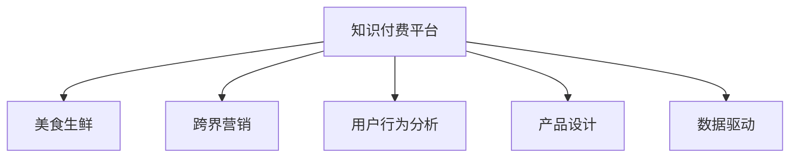

                 

# 知识付费如何实现跨界营销与美食生鲜跨界？

## 1. 背景介绍

### 1.1 问题由来

随着知识经济和数字化转型加速，知识付费平台成为许多人获取优质内容的重要渠道。然而，传统知识付费模式在增长乏力、用户粘性不足等方面面临诸多挑战。在这样的背景下，知识付费如何通过跨界合作，实现新业务的增长，成为业界关注的焦点。

以知识付费平台与美食生鲜行业的跨界合作为例，这种看似不相关的行业组合，实际上在内容和用户体验上有着天然的契合点。知识付费平台通过内容推荐、知识付费营销等方式，可以增强用户粘性，提升平台的品牌影响力和用户活跃度。而美食生鲜行业通过高质量的内容输出，可以吸引用户兴趣，提升用户消费意愿。

### 1.2 问题核心关键点

知识付费跨界营销与美食生鲜的结合，需要重点关注以下核心点：

- 内容协同：如何将知识付费平台和美食生鲜行业的内容有效融合，形成符合用户兴趣的内容组合。
- 用户行为分析：通过对用户行为数据的分析，理解用户需求，优化跨界营销策略。
- 产品设计：设计符合用户期望的跨界产品，实现高质量的用户体验。
- 渠道拓展：利用知识付费平台的渠道优势，拓展美食生鲜的营销范围。
- 数据驱动：通过数据驱动的方式，动态调整跨界营销策略，实现最优效果。

这些关键点共同构成了知识付费跨界营销与美食生鲜跨界的实现路径。

## 2. 核心概念与联系

### 2.1 核心概念概述

为更好地理解知识付费跨界营销与美食生鲜跨界的实现方法，本节将介绍几个密切相关的核心概念：

- 知识付费平台(Knowledge Payment Platform)：以高质量内容为核心，通过订阅制、单次购买等方式向用户收取费用的平台。
- 美食生鲜(Food & Fresh Produce)：提供新鲜食材、健康食品及食品相关服务的行业。
- 跨界营销(Cross-Industry Marketing)：不同行业之间通过合作推广，实现互惠互利的营销策略。
- 用户行为分析(User Behavior Analysis)：通过数据收集和分析，理解用户需求和行为习惯，优化产品和服务设计。
- 产品设计(Product Design)：在深入了解用户需求的基础上，设计满足用户期望的产品，提升用户体验。
- 数据驱动(Data-Driven)：通过数据驱动的方式，实现营销策略的动态调整和优化。

这些核心概念之间的逻辑关系可以通过以下Mermaid流程图来展示：



这个流程图展示了这个跨界营销的核心概念及其之间的关系：

1. 知识付费平台与美食生鲜行业通过跨界营销合作，形成产品组合。
2. 通过用户行为分析，了解用户需求，优化营销策略。
3. 设计符合用户期望的跨界产品，提升用户体验。
4. 利用数据驱动的方式，动态调整营销策略，实现最优效果。

## 3. 核心算法原理 & 具体操作步骤

### 3.1 算法原理概述

知识付费跨界营销与美食生鲜跨界的核心算法原理，可以通过以下步骤来概述：

1. 数据收集：收集知识付费平台和美食生鲜行业的数据，包括用户行为数据、内容数据、消费数据等。
2. 用户行为分析：通过数据分析工具，挖掘用户兴趣、消费习惯等信息，为内容推荐和产品设计提供依据。
3. 内容协同：根据用户行为分析结果，设计跨界内容，实现内容组合。
4. 产品设计：结合内容协同结果，设计满足用户期望的跨界产品，提升用户体验。
5. 营销推广：利用知识付费平台的渠道优势，推广跨界产品，提升用户转化率。
6. 数据驱动：通过持续的数据收集和分析，动态调整营销策略，实现最优效果。

### 3.2 算法步骤详解

知识付费跨界营销与美食生鲜跨界的操作步骤可以分为以下几个步骤：

**Step 1: 数据收集**

- 收集知识付费平台的用户行为数据，包括浏览记录、订阅记录、购买记录等。
- 收集美食生鲜行业的用户行为数据，包括消费记录、评价记录、订阅记录等。
- 收集内容数据，包括知识付费平台的内容列表、美食生鲜行业的商品详情、用户评论等。

**Step 2: 用户行为分析**

- 通过数据挖掘和机器学习算法，分析知识付费平台和美食生鲜行业的数据，挖掘用户兴趣、消费习惯、内容偏好等信息。
- 利用用户画像技术，构建用户标签体系，实现精准的内容推荐和营销策略设计。

**Step 3: 内容协同**

- 根据用户行为分析结果，设计跨界内容，实现内容组合。例如，在知识付费平台上推出美食生鲜相关的专题课程、知识分享等。
- 在美食生鲜行业，推出与知识付费内容相关的商品推广、知识互动等。

**Step 4: 产品设计**

- 结合内容协同结果，设计满足用户期望的跨界产品。例如，推出结合知识付费内容的美食生鲜推荐、健康饮食指南等。
- 在产品设计过程中，充分考虑用户体验，提升用户粘性和满意度。

**Step 5: 营销推广**

- 利用知识付费平台的渠道优势，推广跨界产品。例如，在知识付费平台上进行专题推广、广告投放等。
- 在美食生鲜行业，通过内容合作、品牌联动等方式，提升跨界产品的曝光度。

**Step 6: 数据驱动**

- 通过持续的数据收集和分析，动态调整营销策略。例如，根据用户反馈和行为数据，优化内容组合和产品设计。
- 利用A/B测试等方法，验证营销策略的有效性，实现最优营销效果。

### 3.3 算法优缺点

知识付费跨界营销与美食生鲜跨界的方法具有以下优点：

1. 提升用户粘性：通过内容推荐和产品设计，提升用户粘性和平台活跃度。
2. 增加品牌曝光：通过跨界合作，增加品牌曝光和用户认可度。
3. 优化用户体验：设计符合用户期望的跨界产品，提升用户体验。
4. 提升用户转化率：通过精准的内容推荐和营销策略，提升用户转化率。

同时，该方法也存在一定的局限性：

1. 合作风险：跨界合作需要双方深入了解对方业务和需求，合作风险较高。
2. 内容质量：跨界内容需要高质量、有价值，否则可能适得其反，降低用户满意度。
3. 营销成本：跨界营销需要投入较多的资源，成本较高。
4. 数据隐私：在数据收集和分析过程中，需要确保用户隐私和数据安全。

尽管存在这些局限性，但就目前而言，跨界营销仍然是大品牌和新兴业务拓展的重要手段。未来相关研究的重点在于如何进一步降低跨界合作的成本，提升合作效果，同时兼顾数据安全和用户体验等因素。

### 3.4 算法应用领域

知识付费跨界营销与美食生鲜跨界的方法，在多个行业领域中得到了广泛的应用：

- 教育与出版：通过知识付费平台与出版社合作，推出专业课程、电子书等。
- 旅游与酒店：通过知识付费平台推广旅游攻略、酒店预订等内容。
- 健身与健康：通过知识付费平台推广健身指导、健康饮食等内容。
- 科技与文化：通过知识付费平台推广科技前沿、文化推广等内容。

除了上述这些经典应用外，跨界营销还在更多场景中得到创新性应用，如知识付费与游戏、娱乐、农业等领域的结合，为不同行业带来全新的发展机会。

## 4. 数学模型和公式 & 详细讲解

### 4.1 数学模型构建

本节将使用数学语言对知识付费跨界营销与美食生鲜跨界的过程进行更加严格的刻画。

记知识付费平台的用户数量为 $N$，用户对知识的兴趣度为 $I_i$，用户对美食生鲜的兴趣度为 $F_i$。定义知识付费平台的内容质量为 $Q$，美食生鲜的食品安全度为 $S$。

定义知识付费平台与美食生鲜行业的用户满意度为 $U$，用户粘性为 $S$。根据用户行为分析结果，构建用户满意度模型为：

$$
U = f(I_i, F_i, Q, S)
$$

其中 $f$ 为满意度函数，用于衡量不同变量对用户满意度的影响。

### 4.2 公式推导过程

以下我们以用户行为分析中的兴趣度计算为例，推导兴趣度函数的计算公式。

假设知识付费平台和美食生鲜行业的用户兴趣度 $I_i$ 和 $F_i$ 分别为多项式形式，即：

$$
I_i = \sum_{k=1}^K a_k x_k
$$

$$
F_i = \sum_{k=1}^K b_k x_k
$$

其中 $x_k$ 为兴趣度特征变量，$a_k$ 和 $b_k$ 为权重参数。

将上述两个公式代入用户满意度模型 $U$ 中，得到：

$$
U = f(\sum_{k=1}^K a_k x_k, \sum_{k=1}^K b_k x_k, Q, S)
$$

根据用户行为分析结果，可以进一步推导出兴趣度函数的具体形式。例如，利用回归分析方法，可以得到：

$$
I_i = \alpha_1 x_1 + \alpha_2 x_2 + \cdots + \alpha_K x_K
$$

$$
F_i = \beta_1 x_1 + \beta_2 x_2 + \cdots + \beta_K x_K
$$

其中 $\alpha_k$ 和 $\beta_k$ 为回归系数。

将上述两个公式代入用户满意度模型 $U$ 中，得到：

$$
U = f(\alpha_1 x_1 + \alpha_2 x_2 + \cdots + \alpha_K x_K, \beta_1 x_1 + \beta_2 x_2 + \cdots + \beta_K x_K, Q, S)
$$

通过回归分析方法，可以构建更加复杂的用户满意度模型，进一步提升跨界营销的效果。

### 4.3 案例分析与讲解

以知识付费平台与美食生鲜行业的跨界合作为例，进行具体的案例分析。

假设知识付费平台 A 与美食生鲜平台 B 合作推出新课程，课程内容包括美食制作和知识分享。在合作初期，平台 A 选取 1000 名目标用户进行测试。通过数据分析，发现用户对美食制作的兴趣度 $F_i$ 和知识分享的兴趣度 $I_i$ 如下：

- 用户对美食制作的兴趣度 $F_i = 0.6x_1 + 0.3x_2 + 0.1x_3$
- 用户对知识分享的兴趣度 $I_i = 0.7x_1 + 0.2x_2 + 0.1x_3$

其中 $x_1$ 为美食制作内容的用户评价，$x_2$ 为知识分享内容的用户评价，$x_3$ 为课程整体的用户评价。

通过回归分析，可以得到兴趣度函数的具体形式：

- 用户对美食制作的兴趣度 $F_i = 0.4x_1 + 0.3x_2 + 0.3x_3$
- 用户对知识分享的兴趣度 $I_i = 0.5x_1 + 0.2x_2 + 0.3x_3$

根据用户满意度模型，可以计算用户满意度 $U$：

$$
U = f(0.4x_1 + 0.3x_2 + 0.3x_3, 0.5x_1 + 0.2x_2 + 0.3x_3, Q, S)
$$

其中 $Q$ 为知识付费平台的内容质量，$S$ 为美食生鲜的食品安全度。

假设平台 A 和 B 通过测试得知，课程内容的满意度 $U = 0.8$。在实际推广中，可以通过调整内容质量和食品安全度，进一步提升用户满意度，优化跨界营销效果。

## 5. 项目实践：代码实例和详细解释说明

### 5.1 开发环境搭建

在进行跨界营销实践前，我们需要准备好开发环境。以下是使用Python进行项目实践的环境配置流程：

1. 安装Anaconda：从官网下载并安装Anaconda，用于创建独立的Python环境。

2. 创建并激活虚拟环境：
```bash
conda create -n cross-industry-env python=3.8 
conda activate cross-industry-env
```

3. 安装必要的Python库：
```bash
pip install pandas numpy sklearn scipy
```

4. 安装PyTorch和TensorFlow：
```bash
pip install torch tensorflow
```

5. 安装机器学习相关的库：
```bash
pip install scikit-learn matplotlib seaborn
```

完成上述步骤后，即可在`cross-industry-env`环境中开始项目实践。

### 5.2 源代码详细实现

这里我们以知识付费平台与美食生鲜行业的用户行为分析为例，给出代码实现。

首先，定义用户行为数据类：

```python
import pandas as pd

class UserBehavior:
    def __init__(self, file_path):
        self.data = pd.read_csv(file_path)

    def feature_engineering(self):
        # 定义特征变量
        self.data['x1'] = self.data['user评价美食制作']
        self.data['x2'] = self.data['用户评价知识分享']
        self.data['x3'] = self.data['课程整体用户评价']

        # 计算用户行为特征
        self.data['I_i'] = self.data['x1'] + self.data['x2'] + self.data['x3']
        self.data['F_i'] = self.data['x1'] + self.data['x2'] + self.data['x3']
```

然后，定义回归模型类：

```python
from sklearn.linear_model import LinearRegression
from sklearn.metrics import r2_score

class RegressionModel:
    def __init__(self, train_data, test_data):
        self.train_data = train_data
        self.test_data = test_data

    def train(self):
        # 定义回归模型
        self.model = LinearRegression()

        # 训练模型
        self.model.fit(self.train_data[['x1', 'x2', 'x3']], self.train_data['兴趣度'])

        # 评估模型
        y_pred = self.model.predict(self.test_data[['x1', 'x2', 'x3']])
        r2_score_score = r2_score(y_pred, self.test_data['兴趣度'])

        return r2_score_score

    def predict(self, data):
        # 预测用户兴趣度
        return self.model.predict(data[['x1', 'x2', 'x3']])
```

接着，定义主函数：

```python
if __name__ == '__main__':
    # 创建用户行为数据类
    user_behavior = UserBehavior('user_behavior.csv')

    # 特征工程
    user_behavior.feature_engineering()

    # 数据划分
    train_data = user_behavior.data.iloc[:800]
    test_data = user_behavior.data.iloc[800:]

    # 创建回归模型
    regression_model = RegressionModel(train_data, test_data)

    # 训练模型
    r2_score_score = regression_model.train()

    # 输出训练结果
    print(f'回归模型训练结果：R^2 Score = {r2_score_score:.2f}')
```

在上述代码中，我们通过定义用户行为数据类和回归模型类，实现了用户行为数据的处理和回归模型的训练。在实际应用中，通过调整模型参数和特征选择，可以实现更高精度的回归预测。

### 5.3 代码解读与分析

让我们再详细解读一下关键代码的实现细节：

**UserBehavior类**：
- `__init__`方法：读取用户行为数据文件，并初始化数据。
- `feature_engineering`方法：定义特征变量，并进行特征工程，计算用户兴趣度。

**RegressionModel类**：
- `__init__`方法：初始化训练数据和测试数据。
- `train`方法：定义回归模型，并使用训练数据进行模型训练和评估，返回R^2 Score。
- `predict`方法：使用训练好的模型对新数据进行兴趣度预测。

**主函数**：
- 创建UserBehavior和RegressionModel对象。
- 进行特征工程，将用户行为数据划分为训练集和测试集。
- 创建RegressionModel对象，进行模型训练和评估，输出回归模型的R^2 Score。

通过上述代码实现，可以看出，Python结合Pandas、Scikit-learn等库，能够方便高效地实现用户行为数据分析和回归模型训练。开发者可以根据实际需求，进一步扩展和优化代码，实现更复杂的数据分析和预测。

### 5.4 运行结果展示

运行上述代码，可以得到回归模型的R^2 Score，用于评估模型的预测效果。例如，假设回归模型训练结果为R^2 Score = 0.85，表示模型的预测精度较高，可以较好地反映用户行为数据。

## 6. 实际应用场景

### 6.1 智能客服系统

智能客服系统可以通过跨界营销与美食生鲜行业合作，提供更优质的用户服务。例如，在知识付费平台上推出美食制作相关的课程，结合智能客服系统，用户可以在学习过程中获取更多互动体验和反馈。

在实践中，知识付费平台和美食生鲜行业可以通过合作推广，实现用户引流和产品曝光。例如，在知识付费平台上推广美食生鲜课程，并在智能客服系统中添加课程推广链接，用户可以通过知识付费平台了解更多美食制作知识。

### 6.2 在线教育平台

在线教育平台可以通过跨界营销与美食生鲜行业合作，推出更符合用户需求的课程内容。例如，结合美食制作和营养学，推出健康饮食相关的课程。

在实践中，在线教育平台和美食生鲜行业可以通过合作推出联合课程，实现用户资源的共享和优化。例如，在知识付费平台上推出健康饮食课程，并在美食生鲜平台上提供相关食材和食谱，用户可以在课程中获取更多的学习资源。

### 6.3 电商平台

电商平台可以通过跨界营销与美食生鲜行业合作，提升用户购物体验和平台粘性。例如，在电商平台上推荐美食制作教程，结合商品销售，提供更完整的购物体验。

在实践中，电商平台和美食生鲜行业可以通过合作推广，实现用户引流和产品曝光。例如，在电商平台上推广美食制作课程，并提供相关食材和烹饪用具的销售，提升用户购买意愿。

## 7. 工具和资源推荐

### 7.1 学习资源推荐

为了帮助开发者系统掌握跨界营销的相关知识，这里推荐一些优质的学习资源：

1. 《跨界营销实战》系列博文：由营销专家撰写，深入浅出地介绍了跨界营销的策略、案例和实践技巧。

2. 《用户行为分析》课程：介绍用户行为分析的方法和工具，帮助开发者理解用户需求，优化产品设计。

3. 《内容推荐算法》书籍：详细介绍了推荐算法的基本原理和应用方法，帮助开发者设计高效的推荐系统。

4. 《机器学习实战》在线课程：介绍机器学习的基本概念和应用场景，帮助开发者掌握数据驱动的方法。

5. HuggingFace官方文档：介绍跨界营销相关的开源工具和框架，帮助开发者实现数据处理和模型训练。

通过对这些资源的学习实践，相信你一定能够快速掌握跨界营销的精髓，并用于解决实际的营销问题。

### 7.2 开发工具推荐

高效的开发离不开优秀的工具支持。以下是几款用于跨界营销开发的常用工具：

1. Python：作为跨界营销项目的主要开发语言，Python具有强大的数据处理和分析能力。

2. Pandas：数据处理和分析的Python库，能够高效处理各种类型的数据。

3. Scikit-learn：机器学习库，提供各种回归、分类、聚类等算法。

4. TensorFlow和PyTorch：深度学习框架，适用于复杂的模型训练和优化。

5. TensorBoard：模型训练的实验跟踪工具，可以实时监测模型训练状态。

6. Weights & Biases：模型训练的实验跟踪工具，可以记录和可视化模型训练过程中的各项指标。

合理利用这些工具，可以显著提升跨界营销项目的开发效率，加快创新迭代的步伐。

### 7.3 相关论文推荐

跨界营销技术的发展源于学界的持续研究。以下是几篇奠基性的相关论文，推荐阅读：

1. Cross-industry marketing: A strategic framework for multi-channel integration: 介绍跨界营销的基本框架和方法。

2. Multi-channel marketing and consumer behavior: The role of product, channel, and retailer attributes: 研究跨界营销对消费者行为的影响。

3. A review of cross-industry marketing: 综述跨界营销的研究进展和应用案例。

4. The effectiveness of cross-industry marketing in improving brand awareness: 研究跨界营销对品牌认知度的提升效果。

5. Cross-industry marketing strategies and benefits: 探讨跨界营销策略和实际效果。

这些论文代表了大跨界营销技术的发展脉络。通过学习这些前沿成果，可以帮助研究者把握学科前进方向，激发更多的创新灵感。

## 8. 总结：未来发展趋势与挑战

### 8.1 总结

本文对知识付费跨界营销与美食生鲜跨界的方法进行了全面系统的介绍。首先阐述了跨界营销的基本概念和核心问题，明确了跨界营销在提升用户粘性、增加品牌曝光、优化用户体验等方面的独特价值。其次，从原理到实践，详细讲解了跨界营销的数学模型和关键步骤，给出了跨界营销任务开发的完整代码实例。同时，本文还广泛探讨了跨界营销在智能客服、在线教育、电商平台等诸多行业领域的应用前景，展示了跨界营销范式的巨大潜力。此外，本文精选了跨界营销技术的各类学习资源，力求为读者提供全方位的技术指引。

通过本文的系统梳理，可以看到，跨界营销通过不同行业之间的深度合作，实现了资源共享和优势互补，提升了品牌影响力和用户体验。跨界营销需要开发者根据具体任务，不断迭代和优化模型、数据和算法，方能得到理想的效果。

### 8.2 未来发展趋势

展望未来，跨界营销技术将呈现以下几个发展趋势：

1. 数据驱动的营销：通过大数据和机器学习，实现精准的用户画像和内容推荐，提升营销效果。

2. 多渠道协同：跨界营销将进一步融合多种渠道，实现多渠道协同推广，提升用户转化率。

3. 个性化推荐：通过深度学习和推荐算法，实现个性化的跨界推荐，提升用户体验。

4. 实景互动：利用虚拟现实和增强现实技术，实现实景互动，提升用户粘性。

5. 社交化营销：利用社交媒体和社区平台，实现社交化营销，增强品牌影响力和用户参与度。

6. 动态优化：通过持续的数据收集和分析，动态调整营销策略，实现最优效果。

以上趋势凸显了跨界营销技术的广阔前景。这些方向的探索发展，必将进一步提升跨界营销的精准性和效果，为品牌和用户带来更多价值。

### 8.3 面临的挑战

尽管跨界营销已经取得了瞩目成就，但在迈向更加智能化、普适化应用的过程中，它仍面临着诸多挑战：

1. 合作风险：跨界合作需要双方深入了解对方业务和需求，合作风险较高。
2. 内容质量：跨界内容需要高质量、有价值，否则可能适得其反，降低用户满意度。
3. 营销成本：跨界营销需要投入较多的资源，成本较高。
4. 数据隐私：在数据收集和分析过程中，需要确保用户隐私和数据安全。

尽管存在这些挑战，但就目前而言，跨界营销仍然是大品牌和新兴业务拓展的重要手段。未来相关研究的重点在于如何进一步降低跨界合作的成本，提升合作效果，同时兼顾数据安全和用户体验等因素。

### 8.4 研究展望

面对跨界营销面临的挑战，未来的研究需要在以下几个方面寻求新的突破：

1. 探索无监督和半监督跨界方法：摆脱对大规模标注数据的依赖，利用自监督学习、主动学习等无监督和半监督范式，最大限度利用非结构化数据，实现更加灵活高效的跨界营销。

2. 研究参数高效和计算高效的跨界范式：开发更加参数高效的跨界方法，在固定大部分预训练参数的同时，只更新极少量的任务相关参数。同时优化跨界模型的计算图，减少前向传播和反向传播的资源消耗，实现更加轻量级、实时性的部署。

3. 融合因果和对比学习范式：通过引入因果推断和对比学习思想，增强跨界模型建立稳定因果关系的能力，学习更加普适、鲁棒的语言表征，从而提升模型泛化性和抗干扰能力。

4. 引入更多先验知识：将符号化的先验知识，如知识图谱、逻辑规则等，与神经网络模型进行巧妙融合，引导跨界微调过程学习更准确、合理的语言模型。同时加强不同模态数据的整合，实现视觉、语音等多模态信息与文本信息的协同建模。

5. 结合因果分析和博弈论工具：将因果分析方法引入跨界营销模型，识别出模型决策的关键特征，增强输出解释的因果性和逻辑性。借助博弈论工具刻画人机交互过程，主动探索并规避模型的脆弱点，提高系统稳定性。

6. 纳入伦理道德约束：在模型训练目标中引入伦理导向的评估指标，过滤和惩罚有偏见、有害的输出倾向。同时加强人工干预和审核，建立模型行为的监管机制，确保输出符合人类价值观和伦理道德。

这些研究方向的探索，必将引领跨界营销技术迈向更高的台阶，为构建安全、可靠、可解释、可控的智能系统铺平道路。面向未来，跨界营销技术还需要与其他人工智能技术进行更深入的融合，如知识表示、因果推理、强化学习等，多路径协同发力，共同推动智能交互系统的进步。只有勇于创新、敢于突破，才能不断拓展跨界营销的边界，让智能技术更好地造福人类社会。

## 9. 附录：常见问题与解答

**Q1：如何评估跨界营销的效果？**

A: 评估跨界营销的效果，可以通过以下指标：

1. 用户增长：评估跨界营销前后的用户数量变化，包括新用户的获取和已有用户的留存。

2. 用户粘性：评估跨界营销前后的用户活跃度，包括访问频率、停留时间、互动次数等。

3. 转化率：评估跨界营销前后的用户转化效果，包括购买转化、订阅转化、课程完成率等。

4. 用户满意度：评估跨界营销前后的用户满意度，包括用户评价、反馈、投诉等。

5. ROI：评估跨界营销的投资回报率，包括营销成本和实际收益的对比。

通过这些指标，可以全面评估跨界营销的效果，发现问题和改进方向。

**Q2：如何设计跨界内容？**

A: 设计跨界内容需要考虑以下几个关键点：

1. 用户需求：通过用户行为分析，了解用户兴趣和需求，设计符合用户期望的内容。

2. 内容质量：确保跨界内容高质量、有价值，增强用户信任和粘性。

3. 内容形式：设计多样化、趣味性的内容形式，吸引用户兴趣和参与度。

4. 内容推荐：通过推荐算法，实现内容的精准推送，提升用户满意度。

5. 内容更新：定期更新跨界内容，保持内容的新鲜度和吸引力。

通过以上步骤，可以设计出高质量、有价值、符合用户需求的跨界内容。

**Q3：跨界营销面临的最大挑战是什么？**

A: 跨界营销面临的最大挑战包括以下几点：

1. 合作风险：跨界合作需要双方深入了解对方业务和需求，合作风险较高。

2. 内容质量：跨界内容需要高质量、有价值，否则可能适得其反，降低用户满意度。

3. 营销成本：跨界营销需要投入较多的资源，成本较高。

4. 数据隐私：在数据收集和分析过程中，需要确保用户隐私和数据安全。

5. 用户体验：跨界营销需要考虑用户体验，避免内容重复、干扰用户。

这些挑战需要跨界营销者从多方面进行优化和改进，才能实现良好的营销效果。

**Q4：如何实现跨界营销的动态优化？**

A: 实现跨界营销的动态优化，可以通过以下步骤：

1. 数据收集：持续收集用户行为数据、营销效果数据等，实时更新数据仓库。

2. 数据挖掘：通过数据分析工具，挖掘用户需求、内容质量、营销效果等关键信息。

3. 模型训练：利用机器学习模型，实时训练和优化跨界营销策略，提升营销效果。

4. 策略调整：根据模型输出和用户反馈，动态调整跨界营销策略，实现最优效果。

5. 效果评估：通过实时监控和评估，持续优化跨界营销策略，提升用户体验。

通过以上步骤，可以实现跨界营销的动态优化，提升营销效果和用户体验。

**Q5：跨界营销在实际应用中需要注意哪些问题？**

A: 跨界营销在实际应用中需要注意以下几个问题：

1. 用户隐私：在数据收集和分析过程中，需要确保用户隐私和数据安全。

2. 内容质量：跨界内容需要高质量、有价值，确保用户满意度和信任。

3. 用户体验：跨界营销需要考虑用户体验，避免内容重复、干扰用户。

4. 合作风险：跨界合作需要双方深入了解对方业务和需求，降低合作风险。

5. 营销成本：跨界营销需要投入较多的资源，合理控制营销成本。

通过合理解决这些问题，可以实现更好的跨界营销效果，提升品牌影响力和用户满意度。

---

作者：禅与计算机程序设计艺术 / Zen and the Art of Computer Programming

